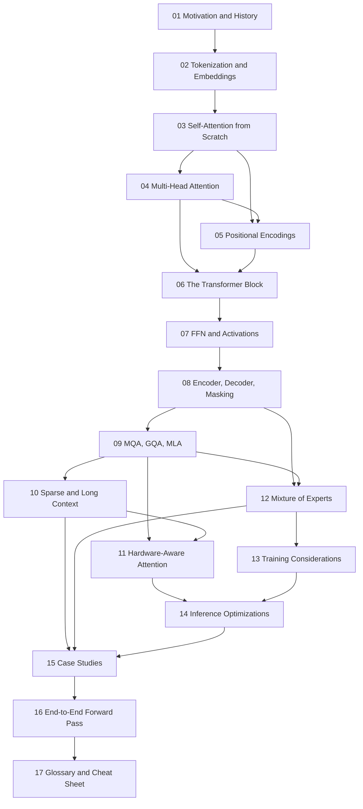

# Transformers Deep Dive — A 2026 Course

A sequential, build-from-scratch course on the Transformer architecture, from
"why did we abandon RNNs?" through to the exact configuration choices in
production models shipping in 2026.

## Who this is for

You can program. You are comfortable with matrices, `for` loops, and reading
code. You do **not** need prior deep-learning theory — no assumed knowledge of
backprop internals, attention, or embeddings. Every concept is built before it
is developed progressively. Some block diagrams preview components taught in
later modules (notably FFNs in 07 and grouped attention in 09); those previews
are not prerequisites for the earlier derivation.

## Module map

```
FOUNDATIONS          01  Motivation & History
                     02  Tokenization & Embeddings
                     03  Self-Attention from Scratch      <-- the load-bearing module
                     04  Multi-Head Attention
                     05  Positional Encodings
                     06  The Transformer Block
                     07  The FFN / MLP Layer
                     08  Encoder, Decoder, Masking

EFFICIENCY           09  MHA -> MQA -> GQA -> MLA
                     10  Sparse & Long-Context Attention
                     11  Hardware-Aware Attention
                     12  Mixture of Experts

PRACTICE             13  Training Considerations
                     14  Inference Optimizations

SYNTHESIS            15  Modern Architecture Case Studies
                     16  End-to-End Forward Pass
                     17  Glossary & Cheat Sheet
```

### Dependency graph



## How to read this course

1. **Do not skip module 03.** Everything else is a variation on it. The playlist
   spends five videos and roughly seven hours on self-attention alone, for good
   reason.
2. **Run the code.** Every core mechanism has runnable PyTorch. The numeric
   examples in modules 03 and 16 are worked by hand *and* in code so you can
   check yourself.
3. **Answer the self-check questions** at the end of each module before moving
   on. They are written as interview questions, because several of them are.

## Conventions used throughout

### Preparation and reproducibility

Before implementing the course, check that you can multiply `(T,d) @ (d,h)`,
differentiate a scalar loss, apply row-wise softmax, and explain broadcasting
of `(T,T)` over `(B,H,T,T)`. Review the [linear algebra notes](../../notes/math/linear-algebra.md)
and [calculus notes](../../notes/math/calculus.md) where needed.

The complete reference is [modern_decoder.py](./code/modern_decoder.py), tested
with Python 3.11 and PyTorch 2.8.0 on CPU. From the repository root:

```sh
python -m venv .venv-transformers
.venv-transformers/bin/python -m pip install torch==2.8.0
.venv-transformers/bin/python content/courses/transformers/code/modern_decoder.py
.venv-transformers/bin/python site/test_transformer_corrections.py
```

Individual class/method excerpts are teaching fragments unless they include
their own imports, inputs and assertions. Fences marked `transformer-check`
are independent CPU checks exercised by the regression command above. There
are no pretrained downloads or GPU requirements for those checks.

### Milestones

1. After module 08, produce a masked attention matrix and prove changing a future
   value leaves earlier outputs unchanged. The worked check in 08 is the oracle.
2. After modules 09-12, account for persistent KV bytes separately from temporary
   expansion, reproduce recurrent attention, and diagnose top-1 router gradients.
   Their worked checks provide reference calculations, not benchmark targets.
3. After module 16, pass dense/MoE, full/chunked-cache, target-shift and generation
   edge-case tests. A successful smoke test establishes implementation contracts,
   not language-model quality. The overfit exercise makes that distinction explicit.

Read 01-08 for concepts, continue through 16 for implementation, and use 09-14
alongside the [inference course](/courses/inference/) for serving systems.

| Symbol | Meaning |
|---|---|
| `B` | batch size |
| `T` | sequence length (number of tokens) — the playlist writes `n` |
| `d_model` | model / residual-stream width — the playlist writes `d_model`, Raschka writes "embedding dimension" |
| `H` | number of query heads |
| `H_kv` | number of key/value heads (equals `H` for MHA, `1` for MQA) |
| `d_head` | per-head dimension, usually `d_model / H` |
| `d_ff` | FFN inner width |
| `V` | vocabulary size |

Shapes are written as `(B, T, d_model)`. Code is PyTorch-flavoured; it is
written for clarity over speed, and is not always the fastest formulation.

---

**Start here → [01 — Motivation & History](./01-motivation-and-history.md)**
