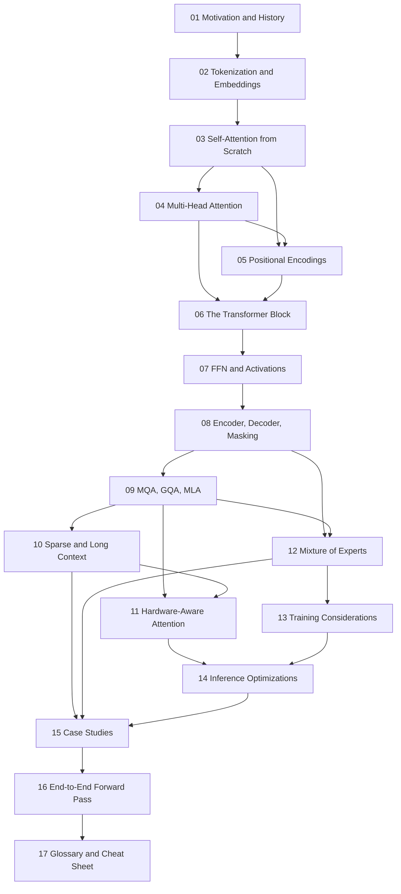

# Transformers Deep Dive — A 2026 Course

A sequential, build-from-scratch course on the Transformer architecture, from
"why did we abandon RNNs?" through to the exact configuration choices in
production models shipping in 2026.

## Who this is for

You can program. You are comfortable with matrices, `for` loops, and reading
code. You do **not** need prior deep-learning theory — no assumed knowledge of
backprop internals, attention, or embeddings. Every concept is built before it
is used, and nothing in module *N* assumes anything from module *N+1*.

## Source material

This course is built from two primary sources, deliberately chosen because they
sit at opposite ends of the abstraction ladder:

| Source | What it gives us | Where it dominates |
|---|---|---|
| **CampusX, *100 Days of Deep Learning*, videos 71–84** (instructor: Nitesh) — [playlist](https://youtube.com/playlist?list=PLKnIA16_RmvYuZauWaPlRTC54KxSNLtNn) | First-principles derivations. Every mechanism is *re-invented* rather than stated. Rich analogies and worked numeric examples. | Modules 01–08, 16 |
| **Sebastian Raschka, *The Big LLM Architecture Comparison*** — [article](https://magazine.sebastianraschka.com/p/the-big-llm-architecture-comparison) (living document; the version used here was last updated **April 2026**, covering 23 model families) | What real 2024–2026 production models actually do, with concrete hyperparameters. | Modules 09–15 |

The two sources sometimes use **different terminology for the same thing**, and
occasionally disagree on emphasis. Every module where this happens carries a
**"Reconciling the sources"** box. Nothing is silently harmonised.

Everything past module 10 (FlashAttention, PagedAttention, quantization,
speculative decoding) comes from the primary literature — those topics postdate
the playlist and sit outside the blog's architecture-only scope. Papers are
cited inline.

### A note on the playlist videos

Videos 71–84 are exactly the Transformers arc of the CampusX series:

| # | Title |
|---|---|
| 71 | Introduction to Transformers |
| 72 | What is Self Attention |
| 73 | Self Attention in Transformers (the 14-day video) |
| 74 | Scaled Dot Product Attention — why do we scale? |
| 75 | Self Attention Geometric Intuition |
| 76 | Why is Self Attention called "Self"? |
| 77 | Multi-head Attention |
| 78 | Positional Encoding |
| 79 | Layer Normalization (vs Batch Norm) |
| 80 | Transformer Architecture Part 1 — Encoder |
| 81 | Masked Self Attention |
| 82 | Cross Attention |
| 83 | Transformer Decoder Architecture |
| 84 | Transformer Inference |

They are taught in Hindi with English auto-captions; the analogies below are
reproduced faithfully but the phrasing is rewritten for a technical reader.

## Module map

```
FOUNDATIONS          01  Motivation & History
                     02  Tokenization & Embeddings
                     03  Self-Attention from Scratch      <-- the load-bearing module
                     04  Multi-Head Attention
                     05  Positional Encodings
                     06  The Transformer Block
                     07  The FFN / MLP Layer
                     08  Encoder, Decoder, Masking

EFFICIENCY           09  MHA -> MQA -> GQA -> MLA
                     10  Sparse & Long-Context Attention
                     11  Hardware-Aware Attention
                     12  Mixture of Experts

PRACTICE             13  Training Considerations
                     14  Inference Optimizations

SYNTHESIS            15  Modern Architecture Case Studies
                     16  End-to-End Forward Pass
                     17  Glossary & Cheat Sheet
```

### Dependency graph



## How to read this course

1. **Do not skip module 03.** Everything else is a variation on it. The playlist
   spends five videos and roughly seven hours on self-attention alone, for good
   reason.
2. **Run the code.** Every core mechanism has runnable PyTorch. The numeric
   examples in modules 03 and 16 are worked by hand *and* in code so you can
   check yourself.
3. **Answer the self-check questions** at the end of each module before moving
   on. They are written as interview questions, because several of them are.

## Conventions used throughout

| Symbol | Meaning |
|---|---|
| `B` | batch size |
| `T` | sequence length (number of tokens) — the playlist writes `n` |
| `d_model` | model / residual-stream width — the playlist writes `d_model`, Raschka writes "embedding dimension" |
| `H` | number of query heads |
| `H_kv` | number of key/value heads (equals `H` for MHA, `1` for MQA) |
| `d_head` | per-head dimension, usually `d_model / H` |
| `d_ff` | FFN inner width |
| `V` | vocabulary size |

Shapes are written as `(B, T, d_model)`. Code is PyTorch-flavoured; it is
written for clarity over speed, and is not always the fastest formulation.

---

**Start here → [01 — Motivation & History](./01-motivation-and-history.md)**
