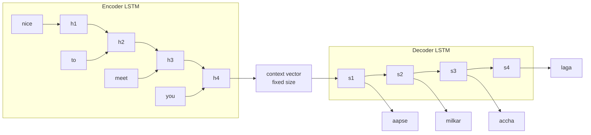
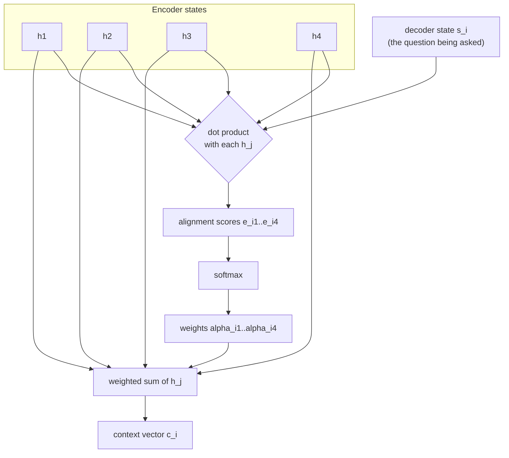
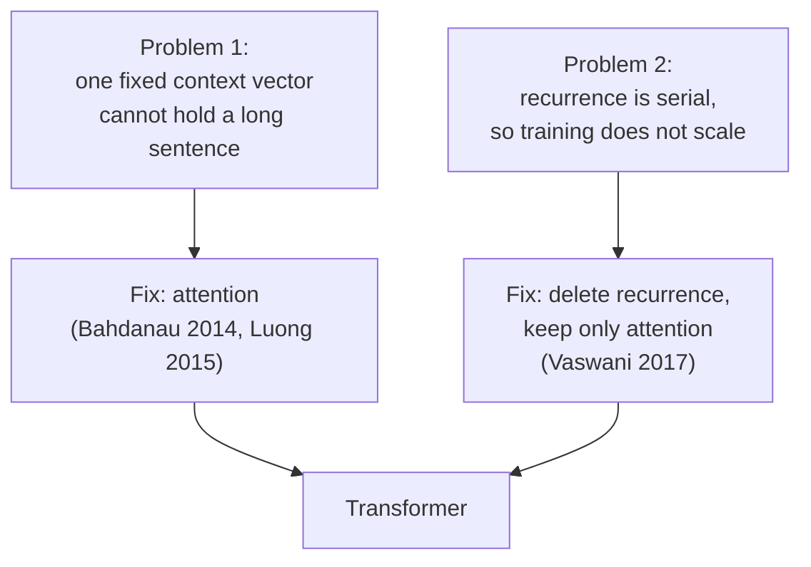

# 01 — Motivation & History: From RNNs to "Attention Is All You Need"

> **Prerequisites:** none.
> **You will learn:** why sequence models existed at all, the two specific
> failures that killed RNN/LSTM encoder-decoders, what attention fixed, and what
> the 2017 paper actually removed.

---

## 1.1 The shape of the problem

A **sequence-to-sequence** task takes a sequence in and emits a sequence out.
Machine translation is the canonical one, but the family is large:

| Task | Input sequence | Output sequence |
|---|---|---|
| Machine translation | English sentence | Hindi sentence |
| Summarization | Document | Summary |
| Question answering | Question + context | Answer |
| Code completion | Prefix | Continuation |

The playlist frames this crisply: neural architectures are specialised by data
shape. ANNs handle tabular data, CNNs handle images, RNNs handle sequences —
and Transformers were built specifically for sequence-to-sequence. The name is
literal: they *transform* one sequence into another.

## 1.2 The RNN answer, and why it was reasonable

A recurrent network processes tokens one at a time, carrying a hidden state
forward:

```
h_t = f(h_{t-1}, x_t)
```

This is a genuinely good idea. Order is baked into the computation for free: if
you feed "Nitesh killed lion" one word per timestep, the network *structurally*
knows which came first. Nothing extra is needed to represent position.

The **encoder–decoder** (Sutskever et al., 2014) applied this to seq2seq: an
encoder LSTM reads the whole input and compresses it into a final hidden state
called the **context vector**; a decoder LSTM reads that vector and emits the
output token by token.



## 1.3 Failure one: the context-vector bottleneck

Everything the encoder understood about the input must fit into one fixed-size
vector. The playlist puts the practical threshold at around **30 words** —
beyond that, translation quality visibly degrades. You are asking a fixed set of
numbers to summarise an arbitrarily long sentence, and it cannot.

### The attention fix (Bahdanau 2014, Luong 2015)

Instead of one context vector shared by every decoder step, compute a *different*
context vector for each output position:

$$c_i = \sum_j \alpha_{ij}\, h_j$$

where $h_j$ are the encoder hidden states and $\alpha_{ij}$ are weights saying
*how useful encoder position $j$ is for producing output position $i$*. Those
weights come from a softmax over **alignment scores**:

$$\alpha_{ij} = \operatorname{softmax}_j(e_{ij})$$

The two variants differ only in how $e_{ij}$ is computed:

| Variant | Alignment score $e_{ij}$ | Note |
|---|---|---|
| **Bahdanau** ("additive") | small feed-forward net over $[s_{i-1}; h_j]$ | learned scoring function |
| **Luong** ("multiplicative") | $s_i \cdot h_j$ — a plain dot product | cheaper; the ancestor of what we use today |

Remember Luong's dot product. **Module 03 is going to rebuild it from scratch
under a different name.**

If the input has 4 words and the output has 4 words, there are 16 alphas — one
per (output position, input position) pair.



Attention worked. Translation quality stopped collapsing on long sentences. But
it left the second failure completely untouched.

## 1.4 Failure two: sequence is inherently serial

`h_t` depends on `h_{t-1}`. You cannot compute timestep 500 until you have
computed timestep 499. A 10,000-token document requires 10,000 sequential steps.
GPUs are wide parallel machines; a strictly serial dependency chain wastes almost
all of that width.

This is the failure that mattered more, and it is the one that motivated
Transformers. As the playlist puts it: the encoder can process *all* words in the
sentence simultaneously, and **because of this the architecture is scalable** —
it can be trained on very large datasets. Scale, not accuracy, was the unlock.

Two failure modes, two fixes, in historical order:



## 1.5 What the 2017 paper actually did

*Attention Is All You Need* (Vaswani et al., 2017) kept the encoder-decoder
skeleton and kept attention — and **deleted the LSTMs**. The title is a claim
about what is *sufficient*, and the removal is the contribution.

The playlist's one-sentence summary is a good one to memorise:

> Transformers are a neural network architecture for sequence-to-sequence tasks.
> Like earlier seq2seq architectures they have an encoder and a decoder — but
> they do not use LSTMs. Instead they use a form of attention called
> **self-attention**, which lets the encoder process every word in the sentence
> simultaneously.

That substitution buys parallelism, and it costs one thing: **order information
disappears**. If every token is processed simultaneously with no recurrence,
nothing distinguishes "Nitesh killed lion" from "Lion killed Nitesh". Module 05
is entirely about paying that bill.

### The trade in one table

| | RNN / LSTM seq2seq | Transformer |
|---|---|---|
| Order information | free, structural | must be added back (module 05) |
| Training over `T` tokens | `O(T)` sequential steps | 1 parallel step |
| Path length between tokens `i` and `j` | `O(\|i-j\|)` | `O(1)` |
| Cost per layer | `O(T · d²)` | `O(T² · d)` — quadratic in `T` |
| Scales to huge corpora | poorly | yes |

Note the last two rows: the Transformer trades a *quadratic* cost in sequence
length for parallelism. In 2017 with 512-token contexts that was obviously worth
it. At 256k context it is the central problem of the field — which is what
modules 09–11 are about.

## 1.6 Why this mattered more than anyone expected

The authors built Transformers to win at machine translation. The playlist is
blunt that they had no idea what they had:

- **NLP was solved-ish, fast.** Fifty years of progress — rule systems, Naive
  Bayes, HMMs, bag-of-words, n-grams, then LSTMs — got compressed into about
  five years.
- **Transfer learning arrived in NLP.** BERT and GPT were pretrained on huge
  corpora and released publicly. A startup could fine-tune on a small dataset
  and get state-of-the-art results — previously near-impossible. Libraries like
  Hugging Face made that three or four lines of code.
- **Modality-independence.** The architecture only requires that your data be a
  sequence of vectors. Get images, audio, or video into that form and the same
  machinery applies. Every multimodal model you use runs on this observation.

## 1.7 The seven years since

Raschka's framing is the useful corrective to hype. Comparing GPT-2 (2019) with
DeepSeek V3 and Llama 4, one is "surprised at how structurally similar these
models still are." The changes since 2017 are real but *local*:

- absolute positional embeddings → **RoPE** (module 05)
- Multi-Head Attention → **Grouped-Query Attention** (module 09)
- GELU → **SwiGLU** (module 07)
- LayerNorm → **RMSNorm** (module 06)
- dense FFN → **Mixture-of-Experts** (module 12)

His question — "have we truly seen groundbreaking changes, or are we simply
polishing the same architectural foundations?" — is the thesis this course
inherits. The skeleton from module 06 is the skeleton of everything in module 15.

---

## Reconciling the sources

**On "attention".** The playlist uses *attention* for the 2014/2015
encoder-decoder mechanism, and *self-attention* for the 2017 one, then spends a
whole video (#76) proving they are the same mathematics in different settings.
Raschka uses "attention" to mean scaled dot-product attention by default and
does not discuss the Bahdanau/Luong lineage. **We follow the playlist**: attention
is the general mechanism; self- and cross-attention are the two ways to wire it.

**On what the innovation was.** The playlist emphasises *parallelism*. Raschka
implicitly emphasises *the residual-stream block* as the durable artefact. Both
are right about different things — parallelism is why Transformers won in 2017;
the block design is why they are still here in 2026.

---

## Key takeaways

- Two independent failures killed RNN seq2seq: the fixed context-vector
  bottleneck, and serial computation. Attention (2014–15) fixed the first;
  Transformers (2017) fixed the second by deleting recurrence.
- Luong's dot-product alignment score is the direct ancestor of scaled
  dot-product attention. You have already met the core operation.
- Parallelism was the unlock. It made training on internet-scale corpora
  possible, which made pretraining and transfer learning possible.
- Removing recurrence destroys order information. Positional encoding (module 05)
  exists solely to pay that debt.
- Attention costs `O(T²)`. Cheap at 512 tokens, the central engineering problem
  at 256k.
- Since 2017 the changes are refinements — norm placement, position scheme,
  head sharing, sparsity — not a new skeleton.

## Self-check

1. An RNN encoder-decoder and a Transformer both handle translation. Name the
   *two* distinct problems the Transformer solves, and say which one attention
   alone had already solved by 2015.
2. Transformers gained parallelism by removing recurrence. What capability was
   lost in that trade, and which later module pays for it?
3. If attention is `O(T²)` and recurrence is `O(T)`, why did the *more*
   expensive option win in 2017 — and under what conditions does that argument
   start to break down?

---

**Next → [02 — Tokenization & Embeddings](./02-tokenization-and-embeddings.md)**
