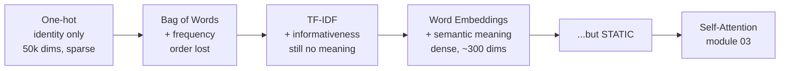
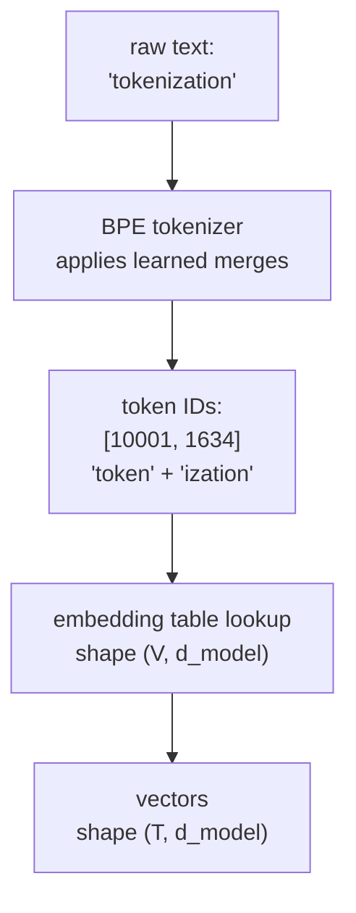
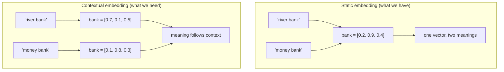
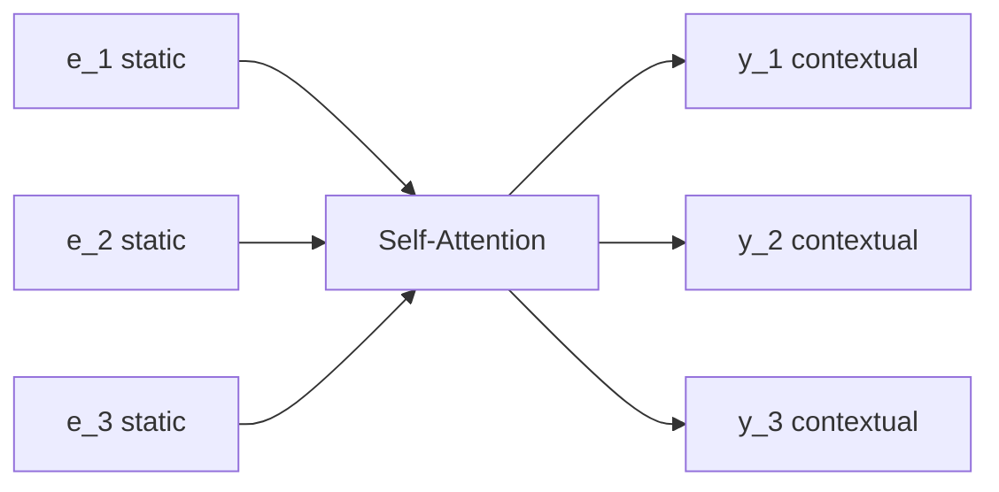

# 02 — Tokenization & Embeddings

> **Prerequisites:** module 01.
> **You will learn:** how text becomes numbers, why BPE beats both characters and
> words, what an embedding actually is, and the one flaw in embeddings that
> makes self-attention necessary.

---

## 2.1 The first requirement of every NLP system

The playlist opens video 72 with a question worth sitting with: what is the most
important requirement for building *any* NLP application?

The answer is not the model. It is **how do you turn words into numbers**. Every
NLP input — a review, a sentence, a document — is a set of words, and computers
process numbers. This step is called **vectorization**, and the history of NLP is
largely the history of getting better at it.

## 2.2 The ladder of vectorization techniques

Take two toy sentences: `"mat cat mat"` and `"cat rat rat"`.

### One-hot encoding

Build a vocabulary of unique words — `{mat, cat, rat}` — and give each word a
vector that is 1 in its own slot and 0 everywhere else.

```
mat -> [1, 0, 0]
cat -> [0, 1, 0]
rat -> [0, 0, 1]
```

Two fatal problems: the vector length equals vocabulary size (so ~50,000
dimensions for real text, almost all zeros), and **every pair of words is
equidistant**. `cat` is exactly as similar to `dog` as it is to `bulldozer`. The
representation encodes identity and nothing else.

### Bag of words

Count occurrences instead of just presence. `"mat cat mat"` → `[2, 1, 0]`.
Better — it carries frequency — but word *order* is gone entirely, and the
similarity problem is untouched.

### TF-IDF

Weight counts by how informative a word is across the corpus. Rare words score
higher, common words lower. Still no notion of meaning.

### Word embeddings — the real jump

Train a neural network on a large corpus (say, all of Wikipedia). The network
learns the contexts each word appears in, and represents each word as a dense
`n`-dimensional vector — 64, 256, 512, whatever you pick.

The payoff is **semantic meaning is captured**. Similar words get similar
vectors. `king` and `queen` land near each other; `cricketer` lands far away.

The playlist's intuition for what the dimensions mean is worth keeping, with a
caveat attached:

| | royalty | athlete | human |
|---|---|---|---|
| king | high | low | high |
| queen | high | low | high |
| cricketer | low | high | high |

**The caveat matters:** the network never tells you what a dimension means. These
labels are a teaching device. Real embedding dimensions are entangled and
individually uninterpretable. What is *true* is the relational structure —
similar words end up close in the space.



## 2.3 Tokenization: what counts as a unit?

Before embedding anything you must decide what a "token" is. Three options:

| Granularity | Vocabulary size | Sequence length | Unknown words |
|---|---|---|---|
| Characters | ~100 (tiny) | very long | impossible |
| Words | 100k–1M (huge) | short | constant problem |
| **Subwords** | 30k–260k | moderate | impossible by construction |

Word-level tokenization — what the playlist uses throughout for clarity — has a
hard failure: any word not in your vocabulary becomes `<UNK>` and its meaning is
destroyed. Every typo, every proper noun, every new word.

Subword tokenization solves this. Frequent words stay whole; rare words split
into known pieces.

### Byte Pair Encoding (BPE)

BPE starts from bytes and repeatedly merges the most frequent adjacent pair.

**Training:**

```
1. Start: vocabulary = all 256 individual bytes.
2. Count every adjacent pair in the corpus.
3. Merge the most frequent pair into one new token; add it to the vocabulary.
4. Repeat until you reach the target vocabulary size.
```

Worked example on the corpus `low low low lower lowest`:

```
start        l o w _ l o w _ l o w _ l o w e r _ l o w e s t
merge "l o"  -> "lo"       (most frequent pair)
             lo w _ lo w _ lo w _ lo w e r _ lo w e s t
merge "lo w" -> "low"
             low _ low _ low _ low e r _ low e s t
merge "e r"  -> "er"
             low _ low _ low _ low er _ low e s t
```

Final vocabulary contains `low`, `er`, `e`, `s`, `t`. Now `lower` tokenizes as
`low` + `er` — two known pieces, never `<UNK>`. And `slower`, never seen in
training, becomes `s` + `low` + `er`. Graceful.

Because BPE bottoms out at bytes, **there is no such thing as an out-of-vocabulary
input**. Worst case, a string tokenizes into individual bytes.



### Variants you will meet

| Method | Used by | Difference from BPE |
|---|---|---|
| **BPE** | GPT-2, GPT-4, Llama, Mistral | merge by raw frequency |
| **WordPiece** | BERT | merge by likelihood gain, not raw count |
| **Unigram / SentencePiece** | T5, Gemma, many multilingual models | start large, *prune* tokens that cost least |
| **Byte-level BPE** | GPT-2 onward | operates on bytes, so any Unicode works |

### Vocabulary size is an architectural decision

Raschka repeatedly flags this. Gemma's distinguishing feature is "the rather
large vocabulary size (to support multiple languages better)." Mistral Small 3.1
gets lower inference latency partly from "their custom tokenizer." Bigger
vocabulary means shorter sequences (cheaper attention, which is quadratic) but a
larger embedding table and a larger output projection.

There is a reporting wrinkle worth knowing about: Raschka notes that Google
"often exclude[s] embedding parameters to make the model appear smaller, except
in cases... where it is convenient to include them to make the model appear
larger." When you compare parameter counts across labs, check what is being
counted.

## 2.4 The embedding layer in code

An embedding layer is a lookup table, nothing more:

```python
import torch
import torch.nn as nn

V       = 50_000    # vocabulary size
d_model = 512       # embedding dimension

embed = nn.Embedding(V, d_model)   # a (V, d_model) learned matrix

token_ids = torch.tensor([[10001, 1634, 92]])   # (B=1, T=3)
x = embed(token_ids)                            # (1, 3, 512)
```

`nn.Embedding` is equivalent to one-hot-encoding the IDs and multiplying by the
table — but implemented as an index, which is why it is fast. The table is
**learned**: those weights are trained with everything else.

Two details that matter in practice:

- **Weight tying.** Many models share the embedding matrix with the final output
  projection (`(d_model, V)`). Saves `V × d_model` parameters — ~26M at
  `V=50k, d=512` — and often helps quality.
- **Scaling.** The original paper multiplies embeddings by `sqrt(d_model)` before
  adding positional encodings, so the two have comparable magnitude.

## 2.5 The flaw: embeddings are static

This is the hinge of the whole course.

An embedding is trained once and then reused everywhere. `bank` has **one**
vector, and that same vector is used in:

- "I deposited money at the **bank**"
- "We sat on the river **bank**"

Same numbers. Different meanings. The playlist's phrasing is precise and worth
adopting: an embedding does not capture the meaning of a word, it captures the
**average meaning** of that word across the training corpus.

### The Apple demonstration

Suppose we train two-dimensional embeddings with axes *taste* and *technology*,
on a corpus containing the word `apple`:

| Sentence | Pushes toward |
|---|---|
| "An apple a day keeps the doctor away" | taste ↑ |
| "Apple is healthy" | taste ↑ |
| "Apple is better than orange" | taste ↑ |
| "Apple makes great phones" | technology ↑ |

If 9,000 of 10,000 sentences use `apple` as fruit and 1,000 as company, the
learned vector sits at high-taste, low-technology. **Flip the corpus ratio and
the vector flips** — the representation is a property of your data distribution,
not of the word.

Now translate: *"I bought an Apple phone while I was eating an orange."*

The static embedding for `apple` says "fruit" — it was trained on a
fruit-dominant corpus. It is wrong here. What we need is an embedding that reads
the sentence, notices `phone`, raises the technology component, lowers the fruit
component — and is *not* fooled by `orange` sitting nearby.



### Static vs contextual, stated precisely

| | Static embedding | Contextual embedding |
|---|---|---|
| Produced by | word2vec, GloVe, `nn.Embedding` | self-attention |
| Depends on | the word only | the word **and** every other token present |
| Same word, two sentences | identical vector | different vectors |
| Computed | once, at training time | every forward pass |

**Self-attention is a mechanism that takes static embeddings as input and
produces contextual embeddings as output.** That sentence is the entire content
of module 03, and everything after it is a variation on how to compute it
efficiently.



Same count in, same count out, same dimension — but each output has absorbed
information from the whole sequence.

---

## Reconciling the sources

**Tokenization depth.** The playlist uses word-level tokenization throughout,
explicitly for pedagogical simplicity ("we are doing word-level tokenization").
No production model does this. Raschka does not cover tokenization mechanics at
all, but treats vocabulary size as a first-class architectural knob. This module
fills the gap with BPE, which is what the models in module 15 actually use. When
the playlist says "word", read "token".

**"Embedding".** The playlist uses *embedding* for the static word2vec-style
vector and *contextual embedding* for self-attention output. Raschka and most
papers use *embedding* for the input layer and "hidden state" or "residual
stream" for everything after. Both are fine; this course keeps the playlist's
static/contextual distinction because it names the problem self-attention solves.

---

## Key takeaways

- Vectorization is the first problem in NLP. The ladder runs one-hot → bag of
  words → TF-IDF → embeddings, each fixing a flaw in the last.
- Embeddings capture semantic meaning: similar words get similar vectors. But
  individual dimensions are not interpretable — only the relational geometry is.
- BPE tokenizes into subwords by iteratively merging frequent byte pairs. Because
  it bottoms out at bytes, out-of-vocabulary input is impossible.
- Vocabulary size is a real architectural trade: larger vocab → shorter
  sequences (cheaper quadratic attention) but bigger embedding and output layers.
- An embedding layer is a learned lookup table of shape `(V, d_model)`.
- **Embeddings are static.** They encode a word's *average* meaning across the
  training corpus, so one vector must serve every context.
- Self-attention exists to convert static embeddings into contextual ones.

## Self-check

1. Why is one-hot encoding unusable for real NLP, and which specific defect does
   TF-IDF still fail to fix?
2. `slower` never appeared in the BPE training corpus. Explain why the tokenizer
   still handles it, and what the equivalent word-level tokenizer would do.
3. Your corpus uses `apple` as a fruit 90% of the time. Describe the vector you
   get, and explain exactly why it is the wrong input for translating
   "I bought an Apple phone."

---

**Next → [03 — Self-Attention from Scratch](./03-self-attention-from-scratch.md)**
