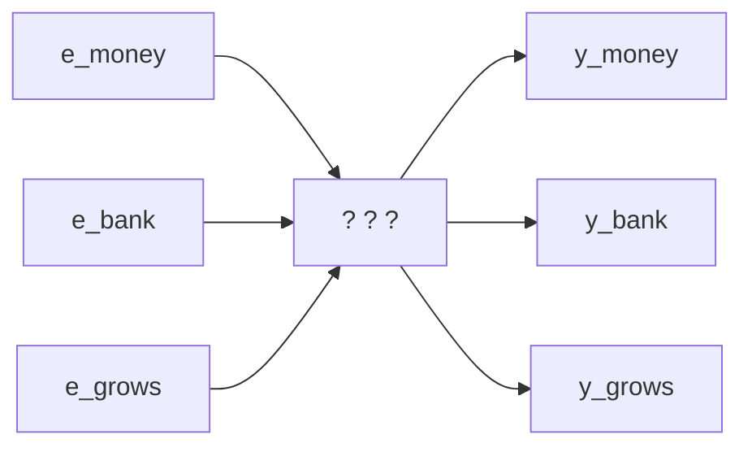
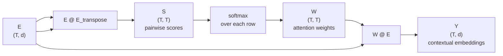
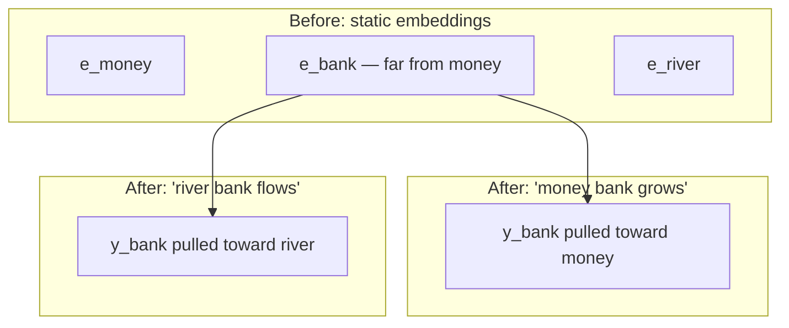
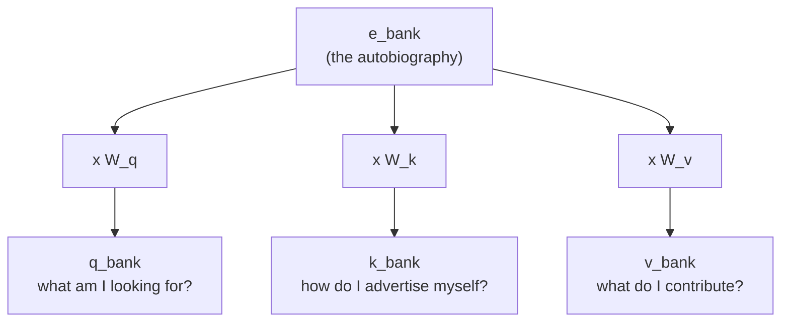
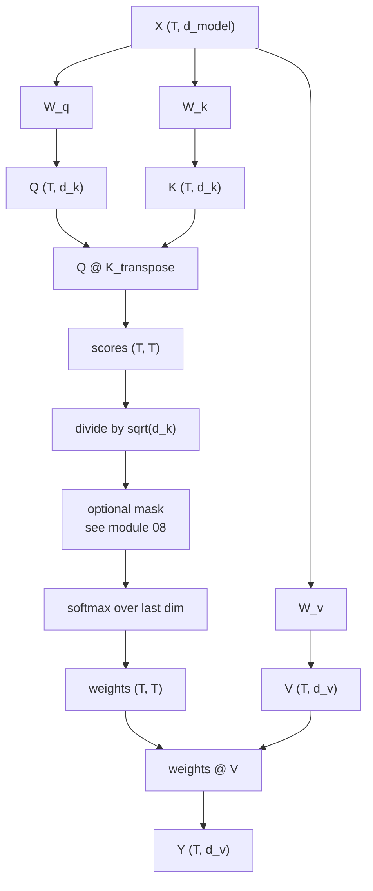

# 03 — Self-Attention from Scratch

> **Prerequisites:** modules 01–02.
> **You will learn:** how to derive self-attention from first principles, what
> Q/K/V actually are, why we divide by `sqrt(d_k)`, and what the operation does
> geometrically. Plus a fully worked numeric example you can check by hand.

This is the load-bearing module. The playlist spends five videos and roughly
seven hours here; the instructor says video 73 alone took fourteen days to make.
Everything in modules 04–16 is a variation on what follows.

---

## 3.1 The goal, restated

From module 02: embeddings are static. `bank` gets one vector regardless of
whether it appears next to `money` or next to `river`.

We want a function that takes the static embeddings of a whole sentence and
returns one **contextual** embedding per token:



This module works out what goes in the box. We will build it the way the
playlist does — by inventing it, finding what breaks, and fixing that.

Running example, two sentences that differ in one word:

```
money bank grows
river bank flows
```

`bank` means a financial institution in the first and a riverside in the second.
A static embedding gives it the same vector in both. We want different ones.

## 3.2 Attempt 1: represent each word using the other words

Here is the idea in plain language before any mathematics. Instead of
representing `bank` by itself, represent it as a **mixture of every word in its
sentence**:

```
sentence 1:   bank  =  0.2 * money  +  0.7 * bank  +  0.1 * grows
sentence 2:   bank  =  0.2 * river  +  0.7 * bank  +  0.1 * flows
```

The left-hand sides are identical; the right-hand sides are not. Context has
entered the representation. That is the whole trick.

In vector form, for each token `i`:

$$y_i = \sum_j w_{ij}\, e_j$$

Now: where do the weights `w_ij` come from? They should express **how related
token `i` is to token `j`**. And we already have a similarity measure for
vectors — the **dot product**.

Quick sanity check on why the dot product measures similarity. Take
`a = [4, 2]`, `b = [6, 1]`, `c = [1, 5]`:

```
a · b = 4*6 + 2*1 = 26     (both point rightward — similar)
a · c = 4*1 + 2*5 = 14     (different directions — less similar)
```

So the recipe is:

```
1. score  s_ij = e_i · e_j          for every pair
2. weight w_ij = softmax_j(s_ij)    so weights are positive and sum to 1
3. output y_i  = sum_j w_ij * e_j   weighted mixture
```

Softmax is doing two jobs: dot products can be negative or arbitrarily large,
and we want a *proportional mixture*. Softmax maps any real numbers to positive
values summing to 1.

### This is already parallel

Notice that computing `y_money` needs nothing from `y_bank`. There is no
dependency between the three outputs, so all of them can be computed **at once**
as matrix operations:

```python
E = ...              # (T, d) all token embeddings stacked
S = E @ E.T          # (T, T) all pairwise scores in one matmul
W = softmax(S, dim=-1)
Y = W @ E            # (T, d) all contextual embeddings
```

Three matrix multiplies for the whole sentence, whether it has 3 words or 3,000.
This is exactly the parallelism module 01 promised, and it is why GPUs love this
architecture.



## 3.3 Worked numeric example — the simplified version

Let us actually run it. Three tokens, `d = 4`, with deliberately simple
embeddings:

```
e_money = [1, 0, 1, 0]
e_bank  = [1, 1, 0, 0]
e_grows = [0, 1, 1, 1]
```

**Step 1 — scores `S = E Eᵀ`.** Each entry is a dot product:

```
s(money,money) = 1*1 + 0*0 + 1*1 + 0*0 = 2
s(money,bank)  = 1*1 + 0*1 + 1*0 + 0*0 = 1
s(money,grows) = 1*0 + 0*1 + 1*1 + 0*1 = 1
```

Filling in all nine:

```
         money  bank  grows
money  [   2     1      1  ]
bank   [   1     2      1  ]
grows  [   1     1      3  ]
```

**Step 2 — scale by `sqrt(d_k) = sqrt(4) = 2`.** (Section 3.6 derives why.)

```
         money  bank  grows
money  [  1.0   0.5   0.5  ]
bank   [  0.5   1.0   0.5  ]
grows  [  0.5   0.5   1.5  ]
```

**Step 3 — softmax each row.** Take the `bank` row `[0.5, 1.0, 0.5]`:

```
exp:  [1.6487, 2.7183, 1.6487]        sum = 6.0157
w:    [0.2741, 0.4519, 0.2741]        sums to 1.0
```

All three rows:

```
         money    bank    grows
money  [ 0.4519  0.2741  0.2741 ]
bank   [ 0.2741  0.4519  0.2741 ]
grows  [ 0.2119  0.2119  0.5761 ]
```

Each row sums to 1. Each token attends most to itself — unsurprising, since a
vector is maximally similar to itself.

**Step 4 — weighted sum `Y = W E`.** For `bank`:

```
y_bank = 0.2741 * [1,0,1,0]
       + 0.4519 * [1,1,0,0]
       + 0.2741 * [0,1,1,1]
       = [0.7259, 0.7259, 0.5481, 0.2741]
```

All three outputs:

```
y_money = [0.7259, 0.5481, 0.7259, 0.2741]
y_bank  = [0.7259, 0.7259, 0.5481, 0.2741]
y_grows = [0.4239, 0.7881, 0.7881, 0.5761]
```

**Did it work?** Compare `bank` and `money` before and after:

| | cosine similarity |
|---|---|
| `e_bank` vs `e_money` (before) | **0.500** |
| `y_bank` vs `y_money` (after) | **0.978** |

`bank` moved decisively toward `money`. That is context being absorbed, measured.

Verify it yourself:

```python
import numpy as np
E = np.array([[1.,0,1,0],[1.,1,0,0],[0.,1,1,1]])
S = E @ E.T / np.sqrt(4)
W = np.exp(S) / np.exp(S).sum(axis=-1, keepdims=True)
Y = W @ E
cos = lambda a,b: a@b/(np.linalg.norm(a)*np.linalg.norm(b))
print(cos(E[1],E[0]), "->", cos(Y[1],Y[0]))   # 0.5 -> 0.9779
```

## 3.4 The geometric picture

Video 75 gives the intuition that makes this stick. Embeddings are vectors in
space. Self-attention **moves each vector toward the vectors it attends to** —
the output is a weighted average, and a weighted average always lands inside the
convex hull of its inputs.

The playlist's phrase: **self-attention acts like gravity.** `money` pulls `bank`
toward itself. And `bank` pulls `money` toward itself, symmetrically.



Same starting vector for `bank`; two different destinations depending on the
sentence. That is exactly what module 02 asked for.

## 3.5 Attempt 2: adding learnable parameters

Attempt 1 works, and it parallelises. But count the learnable parameters:

```
S = E @ E.T        <- no parameters
W = softmax(S)     <- no parameters
Y = W @ E          <- no parameters
```

**Zero.** Nothing here can learn from data. And that is a real limitation, not a
cosmetic one.

### Why it matters: general vs task-specific context

The playlist's argument is the idiom example. Consider translating to Hindi:

- *"piece of cake"* — literally a slice of cake; idiomatically "very easy"
- *"break a leg"* — literally an injury; idiomatically "good luck"

A parameter-free mechanism produces **general** contextual embeddings: `piece`
mixed with `cake` yields something cake-flavoured. But your translation dataset
pairs "piece of cake" with the Hindi for "very easy". Only a mechanism that
learns *from that data* can produce embeddings suited to *that task*.

> General contextual embeddings are useful. Task-specific contextual embeddings
> are better. Getting them requires learnable parameters.

### Where can parameters possibly go?

Look at the three steps. Softmax has no natural place for weights. That leaves
the two matrix multiplications — the inputs to them. So: transform the
embeddings before use.

But transform them into *what*? Here the playlist makes an observation that is
the actual conceptual core of attention. Look at where `e_bank` appears in the
computation of a contextual embedding. It shows up in **three different roles**:

1. When computing `y_bank`, `e_bank` **asks** every other token: how similar are
   you to me? → it is *querying*.
2. When computing `y_money`, `e_bank` is **asked** by `money` and **answers**. →
   it is a *key*.
3. Once weights are known, `e_bank` **contributes content** to the weighted sum.
   → it is a *value*.

One vector, three jobs. The names come straight from dictionary lookup:

```python
d = {'a': 1, 'b': 2, 'c': 4}
d['a']   # 'a' is the QUERY; 'a','b','c' are the KEYS; 1,2,4 are the VALUES
```

Attention is a *soft* dictionary lookup: instead of matching one key exactly, you
match every key partially and return a blend of all the values.

### Why one vector should not do three jobs

The playlist's analogy here is unusually good, and it is worth reproducing
because it explains *separation of concerns* better than the abstract argument.

Imagine an author who has written a 300-page autobiography, now joining a
matrimonial site. The site needs three things from him:

| Site function | What it should contain | Attention role |
|---|---|---|
| **Profile** | a crisp, curated summary others use to evaluate him | **Key** |
| **Search query** | what he is looking for in a partner | **Query** |
| **First meeting** | the best of his personality, presented well | **Value** |

He could paste the entire autobiography into all three slots. It contains all
the information, after all. But nobody will read 300 pages to evaluate him; the
search engine cannot use a book as a query; and the autobiography contains
things ("half my salary goes to fantasy cricket") that should not lead the first
conversation.

The autobiography is the **embedding**: complete, undifferentiated. What you want
is three *extracts*, each optimised for its own job.

And critically — how does he decide what goes in each? **From data.** He notices
the profile mentioning political writing attracts partners too political for him,
so he edits it. He notices his geographic filter is too narrow, so he widens it.
Each extraction rule is tuned by feedback. Which is exactly what backpropagation
does to `W_q`, `W_k`, `W_v`.

### The mechanism

To turn one vector into three, use three learned linear projections:

$$q_i = e_i W_q \qquad k_i = e_i W_k \qquad v_i = e_i W_v$$

`W_q`, `W_k`, `W_v` are matrices initialised randomly and learned by
backpropagation. **The same three matrices are used for every token** — that is
what makes them learnable parameters rather than per-token free variables.



Rewriting the three steps with projections:

```
1. score  s_ij = q_i · k_j
2. weight w_ij = softmax_j(s_ij / sqrt(d_k))
3. output y_i  = sum_j w_ij * v_j
```

Which in matrix form is the famous equation:

$$\mathrm{Attention}(Q,K,V) = \operatorname{softmax}\!\left(\frac{QK^\top}{\sqrt{d_k}}\right)V$$

You just derived it.



## 3.6 Why divide by `sqrt(d_k)`?

Most explanations say "for stability" and move on. Video 74 derives it, and the
derivation is short enough to be worth having.

### Step 1 — dot products of high-dimensional vectors have high variance

A dot product of `d`-dimensional vectors is a sum of `d` products. Sum more
random terms and the spread grows. Empirically, with unit-Gaussian components:

| dimension `d` | variance of `q·k` | variance / `d` |
|---|---|---|
| 3 | 3.04 | 1.01 |
| 100 | 99.92 | 1.00 |
| 1000 | 998.90 | 1.00 |

*(50,000 sampled pairs per row.)* The relationship is exactly linear:
**Var(q·k) = d · Var(component product)**.

The derivation: if each `q` and `k` component is independent with variance
`σ²`, then each product term has variance `σ⁴`, and `d` independent terms sum to
variance `d·σ⁴`. Variance grows linearly in dimension.

### Step 2 — high variance saturates softmax

Softmax exponentiates. Feed it well-spread inputs and it collapses to nearly
one-hot:

```
softmax([1.0, 1.2, 0.9])  = [0.320, 0.391, 0.289]    <- soft, informative
softmax([10.0, 12.0, 9.0]) = [0.114, 0.844, 0.042]   <- nearly one-hot
```

Same *relative* ordering, ten times the scale, and the distribution has hardened.

### Step 3 — saturated softmax kills gradients

The playlist's classroom analogy: a class where student heights vary enormously.
When the teacher asks for questions, only the tall students are visible, so only
their doubts get answered. Over time the short students learn nothing — not
because their questions are bad, but because they are never seen.

Mechanically: where softmax output is near 0 or 1, its gradient is near zero.
Those attention weights stop updating. Training focuses entirely on the few
already-large scores. This is the vanishing-gradient problem, localised inside
attention.

### Step 4 — the fix, and why `sqrt`

We need to shrink the variance. Use the scaling rule for variance: if
`Y = X / c` then

$$\mathrm{Var}(Y) = \frac{1}{c^2}\mathrm{Var}(X)$$

We have `Var(scores) = d_k · σ⁴` and want it back to `σ⁴`. So we need
`1/c² · d_k = 1`, giving `c = sqrt(d_k)`.

That is the entire reason. Not a heuristic — the unique constant that makes score
variance independent of head dimension.

| `d_k` | Var before scaling | Var after ÷`sqrt(d_k)` |
|---|---|---|
| 1 | `σ⁴` | `σ⁴` |
| 2 | `2σ⁴` | `σ⁴` |
| 64 | `64σ⁴` | `σ⁴` |
| 512 | `512σ⁴` | `σ⁴` |

**`d_k` is the dimension of the key vectors** — the per-head dimension, not
`d_model`. In a model with `d_model = 512` and 8 heads, `d_k = 64`, so you divide
by 8, not by ~22.6. Module 04 explains why they differ.

## 3.7 Why is it called *self*-attention?

Video 76 answers what is genuinely a common interview question, and the answer
reframes everything from module 01.

Recall Luong attention. Three operations:

1. Take the decoder hidden state `s_i` — *this is asking a question*.
2. Dot it against each encoder hidden state `h_j` — *these are answering*.
3. Weighted-sum the `h_j` — *these are supplying content*.

Now line them up:

| Luong attention (2015) | Self-attention (2017) |
|---|---|
| decoder hidden state `s_i` | **query** `q_i` |
| encoder hidden state `h_j` | **key** `k_j` |
| encoder hidden state `h_j` *(same vector reused)* | **value** `v_j` |
| `e_ij = s_i · h_j` | `s_ij = q_i · k_j` |
| `α = softmax(e)` | `w = softmax(s / sqrt(d_k))` |
| `c_i = Σ α_ij h_j` | `y_i = Σ w_ij v_j` |

**Identical mathematics.** Two differences:

1. Luong reuses `h_j` as both key and value; self-attention learns separate
   projections for the two roles.
2. **Luong computes attention *between two different sequences*** — English
   encoder against Hindi decoder. Self-attention computes it **within a single
   sequence**.

That second point is the answer:

> It is called *self*-attention because the alignment scores are computed between
> a sequence and **itself** — intra-sequence rather than inter-sequence.

When you *do* compute it between two sequences inside a Transformer, it gets a
different name: **cross-attention** (module 08).

## 3.8 Complete implementation

```python
import torch
import torch.nn as nn
import torch.nn.functional as F
import math

class SelfAttention(nn.Module):
    """Single-head scaled dot-product self-attention."""

    def __init__(self, d_model: int, d_k: int):
        super().__init__()
        self.d_k = d_k
        self.W_q = nn.Linear(d_model, d_k, bias=False)
        self.W_k = nn.Linear(d_model, d_k, bias=False)
        self.W_v = nn.Linear(d_model, d_k, bias=False)

    def forward(self, x, mask=None):
        # x: (B, T, d_model)
        Q = self.W_q(x)                                  # (B, T, d_k)
        K = self.W_k(x)                                  # (B, T, d_k)
        V = self.W_v(x)                                  # (B, T, d_k)

        scores = Q @ K.transpose(-2, -1)                 # (B, T, T)
        scores = scores / math.sqrt(self.d_k)            # <- section 3.6

        if mask is not None:                             # <- module 08
            scores = scores.masked_fill(mask == 0, float('-inf'))

        weights = F.softmax(scores, dim=-1)              # (B, T, T)
        return weights @ V                               # (B, T, d_k)
```

The bare function, which is what module 04 will call:

```python
def scaled_dot_product_attention(Q, K, V, mask=None):
    """Q,K: (..., T, d_k)   V: (..., T, d_v)  ->  (..., T, d_v)"""
    d_k = Q.size(-1)
    scores = (Q @ K.transpose(-2, -1)) / math.sqrt(d_k)
    if mask is not None:
        scores = scores.masked_fill(mask == 0, float('-inf'))
    return F.softmax(scores, dim=-1) @ V
```

In production, call `F.scaled_dot_product_attention(Q, K, V, is_causal=True)` —
it dispatches to FlashAttention (module 11) and never materialises the `(T, T)`
matrix.

### Parameter and cost accounting

| Quantity | Value |
|---|---|
| Parameters | `3 · d_model · d_k` (plus output proj in module 04) |
| Time | `O(T² · d_k)` |
| Memory for score matrix | `O(T²)` per head — **the problem** |

At `T = 100,000`, one `(T, T)` float32 score matrix is 40 GB. Per head. This
single line in the cost table is what modules 09, 10 and 11 exist to attack.

---

## Reconciling the sources

**Notation.** The playlist writes `d_k` for key dimension and uses `n` for
sequence length; Raschka writes `d` and `n`, and in his formula
`softmax(QKᵀ/√d)V` the `d` *is* the head dimension. Same thing. This course uses
`d_k` for the head dimension and `T` for sequence length.

**Derivation vs. statement.** The playlist derives attention over five videos.
Raschka states the formula in one line and moves on to what varies between
models. Neither is wrong for its purpose. If you want the derivation, this
module is it; if you want the landscape, module 15 is it.

**Q/K/V terminology.** Both sources use query/key/value identically. The
dictionary-lookup framing is the playlist's; it is standard.

---

## Key takeaways

- Self-attention represents each token as a **weighted mixture of every token in
  the sequence**, with weights given by learned similarity.
- The parameter-free version (`Y = softmax(EEᵀ)E`) already works and already
  parallelises, but produces only *general* context — it cannot adapt to a task.
- Each embedding plays three roles: it queries, it is queried (key), and it
  contributes content (value). Learning **separate projections** for the three
  roles is the entire contribution of `W_q`, `W_k`, `W_v`.
- `Attention(Q,K,V) = softmax(QKᵀ/√d_k)V`.
- `sqrt(d_k)` is not a heuristic: `Var(q·k) = d_k · Var(component)`, and
  dividing by `sqrt(d_k)` is the unique constant making score variance
  independent of dimension. Without it, softmax saturates and gradients vanish.
- Geometrically, attention pulls each token's vector toward the tokens it
  attends to. In the worked example, `cos(bank, money)` rose from 0.500 to 0.978.
- It is called *self*-attention because it is computed **within one sequence**.
  The mathematics is Luong attention with learned K/V separation.
- The `(T, T)` score matrix is `O(T²)` in memory. This is the defining cost of
  the architecture.

## Self-check

1. Attempt 1 produced working contextual embeddings with zero parameters. Give a
   concrete task where its output is *worse* than the learned version, and say
   precisely why.
2. A colleague sets `d_model = 512`, `H = 8` heads, and divides scores by
   `sqrt(512)`. What did they get wrong, what is the correct divisor, and what
   would the symptom look like during training?
3. `s_ij = q_i · k_j` uses `q` from token `i` and `k` from token `j`. Why is
   `s_ij ≠ s_ji` in general — and what would break if we forced them equal?

---

**Next → [04 — Multi-Head Attention](./04-multi-head-attention.md)**
