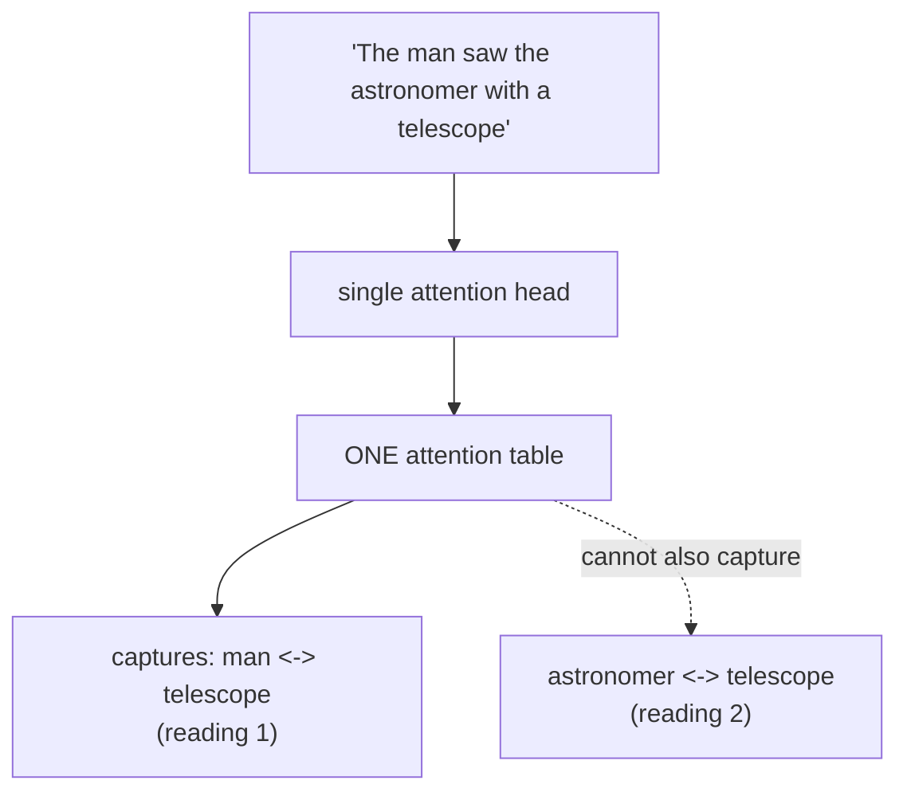
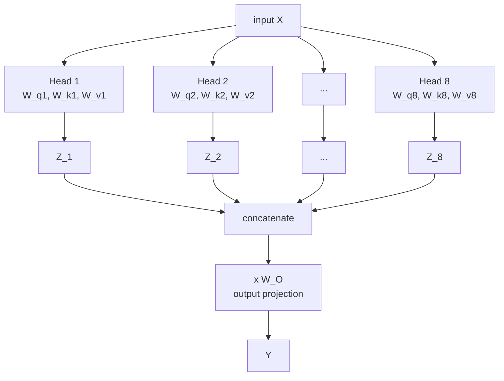
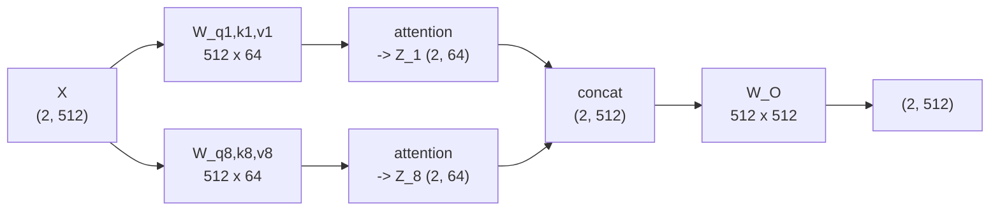

# 04 — Multi-Head Attention

> **Prerequisites:** module 03.
> **You will learn:** the specific failure of single-head attention, how running
> several heads in parallel fixes it, why the per-head dimension shrinks, and why
> multi-head attention costs no more than single-head.

---

## 4.1 The problem: one head sees one perspective

Video 77 opens with a sentence worth staring at:

> **The man saw the astronomer with a telescope.**

Two readings:

1. The man used a telescope to see the astronomer. *(the telescope belongs to the
   man)*
2. The man saw the astronomer, who was holding a telescope. *(the telescope
   belongs to the astronomer)*

Both are valid English. Now think about what self-attention produces: **one**
`(T, T)` attention matrix — one table of how related each word is to each other
word. That table can encode `man ↔ telescope` strongly, or `astronomer ↔
telescope` strongly. It cannot cleanly encode both, because they compete for
probability mass in the same softmax.

> A single attention head extracts a single perspective on a sequence.

This is not an edge case about ambiguous sentences. Natural language routinely
demands several simultaneous relational views: syntactic dependency, coreference,
semantic role, topical association. Summarising a document well means reading it
from several angles at once. One head, one angle.



## 4.2 The fix: run several attention modules in parallel

The solution is almost embarrassingly direct. If one set of `W_q, W_k, W_v`
gives one perspective, use **several sets**.

Each independent set is a **head**. Several heads is **multi-head attention**.



Each head runs exactly the module-03 computation, on the same input, with its own
parameters. Because the heads are independent, they run **in parallel** — no
extra wall-clock depth.

The original paper uses **8 heads**.

### The heads really do specialise

This is not a theoretical hope. The playlist demonstrates it using an attention
visualiser on the telescope sentence:

- **Layer 0, head 0**: hovering over `man` shows its strongest link to
  `telescope` — reading 1.
- **Layer 0, head 1**: `man` links strongly to `astronomer`, and `astronomer`
  links strongly to `telescope` — reading 2.

Two heads, two readings, same sentence, same layer. Exactly the design intent.

*(Caveat worth stating: head specialisation is real but not always this legible.
Many heads in trained models are redundant — several papers show large fractions
can be pruned with little loss. Treat clean per-head interpretations as
illustrative, not guaranteed.)*

## 4.3 Dimensions: the part everyone gets wrong

Naively, `H` heads each producing `d_model`-dimensional output would give `H ×
d_model` output and `H ×` the compute. That is not what happens.

**The head dimension is `d_model / H`.** With `d_model = 512` and `H = 8`, each
head works in **64** dimensions.

Walk the shapes for the paper's configuration, two tokens (`money bank`):

```
input X                              (2, 512)

per head h:
  W_q^h, W_k^h, W_v^h                (512, 64)     <- projects DOWN
  Q^h = X @ W_q^h                    (2, 64)
  K^h = X @ W_k^h                    (2, 64)
  V^h = X @ W_v^h                    (2, 64)
  Z^h = attention(Q^h, K^h, V^h)     (2, 64)

concat Z^1..Z^8                      (2, 512)      <- 8 * 64 = 512
  W_O                                (512, 512)
output = concat @ W_O                (2, 512)      <- same as input
```

Two properties to internalise:

1. **Output shape equals input shape**, `(T, d_model)`. This is non-negotiable —
   module 06's residual connections require it, and it lets blocks stack.
2. **The projections reduce dimensionality**, `512 → 64`. Each head operates in
   a smaller subspace.



### The cost is free

This is the elegant part. Because each head is `d_model/H`-dimensional, `H` heads
cost **the same** as one `d_model`-dimensional head:

| | Single head, `d_k = 512` | 8 heads, `d_k = 64` |
|---|---|---|
| QKV projection params | `3 · 512 · 512` = 786k | `8 · 3 · 512 · 64` = 786k |
| Score matrix size | `T × T` | `8 × T × T` ... |
| Score-matrix FLOPs | `T² · 512` | `8 · T² · 64` = `T² · 512` |

Identical parameter count, identical FLOPs. As the playlist puts it: you get the
best of both worlds — the compute of single-head attention with the multiple
perspectives of multi-head.

The one thing that *does* grow is the number of score matrices held in memory —
`H` of them rather than one. That is a real cost at long context, and part of
what module 11 addresses.

### What `W_O` is for

After concatenation you have 8 independent 64-dim perspectives sitting
side-by-side. `W_O` is a learned `(d_model, d_model)` matrix that **mixes** them.

Without it, dimension `j` of the output would come only from head `⌊j/64⌋` — the
heads would never communicate. `W_O` decides how much each perspective matters
and lets them combine. The playlist describes it as deciding "how important each
perspective is" and producing "the mixture of perspectives."

It is a genuine part of the mechanism, not bookkeeping.

## 4.4 Implementation

The naive version — a literal loop over heads — is the clearest:

```python
import torch, torch.nn as nn, torch.nn.functional as F, math

class MultiHeadAttentionNaive(nn.Module):
    def __init__(self, d_model, n_heads):
        super().__init__()
        assert d_model % n_heads == 0
        self.d_head = d_model // n_heads
        self.heads = nn.ModuleList([
            SelfAttention(d_model, self.d_head) for _ in range(n_heads)
        ])
        self.W_O = nn.Linear(d_model, d_model, bias=False)

    def forward(self, x, mask=None):
        outs = [h(x, mask) for h in self.heads]   # H tensors of (B, T, d_head)
        return self.W_O(torch.cat(outs, dim=-1))  # (B, T, d_model)
```

Real implementations use **one** big projection and reshape, which is far faster:

```python
class MultiHeadAttention(nn.Module):
    def __init__(self, d_model, n_heads, dropout=0.0):
        super().__init__()
        assert d_model % n_heads == 0
        self.H = n_heads
        self.d_head = d_model // n_heads

        # one fused matrix per role, sliced into heads by reshape
        self.W_q = nn.Linear(d_model, d_model, bias=False)
        self.W_k = nn.Linear(d_model, d_model, bias=False)
        self.W_v = nn.Linear(d_model, d_model, bias=False)
        self.W_O = nn.Linear(d_model, d_model, bias=False)
        self.dropout = dropout

    def _split(self, t, B, T):
        # (B, T, d_model) -> (B, H, T, d_head)
        return t.view(B, T, self.H, self.d_head).transpose(1, 2)

    def forward(self, x, mask=None, is_causal=False):
        B, T, _ = x.shape
        Q = self._split(self.W_q(x), B, T)
        K = self._split(self.W_k(x), B, T)
        V = self._split(self.W_v(x), B, T)

        # heads become a batch dimension -> all H run in one kernel
        out = F.scaled_dot_product_attention(
            Q, K, V, attn_mask=mask, is_causal=is_causal,
            dropout_p=self.dropout if self.training else 0.0,
        )                                            # (B, H, T, d_head)

        out = out.transpose(1, 2).reshape(B, T, -1)  # concat heads
        return self.W_O(out)
```

The key trick: after `view` + `transpose`, heads sit in a **batch dimension**, so
one batched matmul handles all of them. Nothing loops.

## 4.5 How many heads, and how wide?

Common configurations:

| Model | `d_model` | `H` | `d_head` |
|---|---|---|---|
| Transformer base (2017) | 512 | 8 | 64 |
| BERT-base | 768 | 12 | 64 |
| GPT-3 175B | 12288 | 96 | 128 |
| Llama 3 8B | 4096 | 32 | 128 |
| Qwen3 0.6B | 1024 | 16 | 128 |

`d_head = 64` or `128` dominates. That is not accidental: too small and each head
lacks representational room; too large and you can afford fewer heads, losing
perspectives.

Note that `d_head = d_model / H` is a **convention, not a requirement**. Several
2025–26 models decouple them — Qwen3 0.6B has `d_model = 1024` and `H = 16`,
which would give `d_head = 64`, but it uses `128`. When they are decoupled, the
QKV projections are `(d_model, H · d_head)` and `W_O` is `(H · d_head, d_model)`.

### Width versus depth

Raschka raises a related design question comparing gpt-oss and Qwen3, both MoE
models with similar active parameters:

- **Qwen3 30B-A3B** — 48 transformer blocks, `d_model = 2048`: *deeper*
- **gpt-oss-20b** — 24 transformer blocks, `d_model = 2880`: *wider*

His rule of thumb: deeper models have more flexibility but are harder to train
(vanishing/exploding gradients, which RMSNorm and residuals mitigate); wider
models parallelise better and give higher inference throughput at higher memory
cost.

The only clean ablation he cites is Gemma 2 (Table 9): at 9B parameters, wider
scored **52.0** average across four benchmarks versus **50.8** for deeper — a
small edge for width. He also notes gpt-oss uses twice as many attention heads as
Qwen3, but flags that **head count does not set model width** — `d_model` does.

## 4.6 A note on where this is going

Multi-head attention as described has every head owning its own `K` and `V`. At
inference time those `K` and `V` tensors get cached across generation steps
(module 11), and the cache size scales with the number of **key/value** heads.

That observation drives the entire next generation of attention variants:

- **MQA** — all query heads share one K/V pair
- **GQA** — query heads share K/V within groups
- **MLA** — K/V are compressed into a low-rank latent

All three are module 09. Multi-head attention is the baseline they optimise
against.

---

## Reconciling the sources

**Framing.** The playlist motivates multi-head attention entirely from
*expressiveness* — capturing multiple perspectives on ambiguous language.
Raschka barely motivates MHA at all; he treats it as the baseline and spends his
attention on the variants that make it *cheaper* (GQA, MLA). Both framings are
correct and they are about different eras: 2017 asked "is one head enough?",
2025 asks "how few K/V heads can we get away with?"

**`d_head = d_model / H`.** The playlist presents this as the rule (512/8 = 64),
which matches the original paper. Raschka's model tables show it is frequently
violated in modern models. Treat it as the default, not a constraint.

---

## Key takeaways

- One attention head produces one `(T, T)` table — one perspective. Ambiguous or
  structurally rich text needs several simultaneously.
- Multi-head attention runs `H` independent `(W_q, W_k, W_v)` sets in parallel,
  concatenates the outputs, and mixes them with a learned `W_O`.
- Per-head dimension is `d_model / H` by convention (512/8 = 64), so `H` heads
  cost the **same parameters and FLOPs** as one full-width head. The perspectives
  are effectively free.
- What is *not* free is memory: `H` score matrices instead of one.
- `W_O` is essential — without it the heads' outputs never mix.
- Efficient implementations fuse the per-head projections into one matmul and put
  heads in a batch dimension.
- Modern models often decouple `d_head` from `d_model / H`, and choose width
  versus depth deliberately (Gemma 2's ablation slightly favours width).

## Self-check

1. Why can a single attention head not represent both readings of "The man saw
   the astronomer with a telescope"? Point at the specific operation that forces
   the trade-off.
2. Show that 8 heads at `d_head = 64` and 1 head at `d_k = 512` have the same
   parameter count and FLOPs. Then name the resource where they genuinely differ.
3. Delete `W_O` and feed the raw concatenation forward. What property of the
   output is lost, and why does that matter for the next layer?

---

**Next → [05 — Positional Encodings](./05-positional-encodings.md)**
