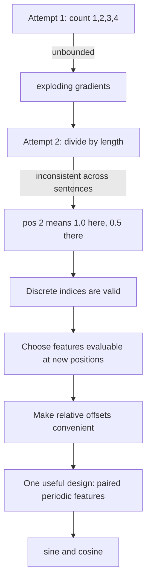
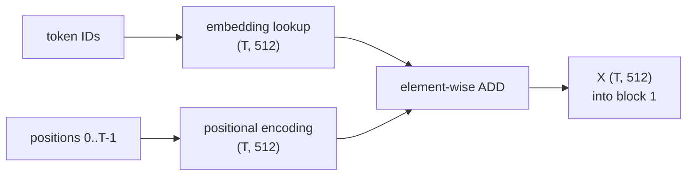
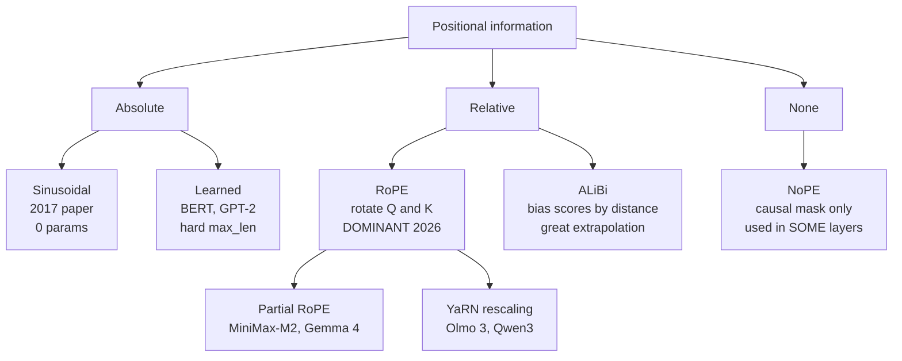

# 05 — Positional Encodings: Absolute, Learned, RoPE, ALiBi

> **Prerequisites:** modules 03–04.
> **You will learn:** why self-attention is blind to word order, the
> first-principles derivation of sinusoidal encoding, and the four schemes used
> in 2026 — learned absolute, RoPE, ALiBi, and NoPE.

---

## 5.1 Self-attention cannot see order

Look again at module 03's computation:

```
S = Q K^T          W = softmax(S)          Y = W V
```

Nothing in there refers to *where* a token sits. Every token is compared with
every other token, all at once, and the result of a sum does not depend on the
order of its terms.

The consequence, in the playlist's example:

```
"Nitesh killed lion"     and     "Lion killed Nitesh"
```

Without positions or a causal mask, these inputs differ by a row permutation.
Self-attention is **permutation-equivariant**: permuting input rows permutes
output rows, rather than leaving the output matrix identical. A permutation-
invariant pooling operation would then erase that distinction entirely.

This is the bill from module 01. An RNN gets order for free because it *is*
sequential. The Transformer traded that away for parallelism, and now has to
buy it back.

> **Positional encoding** is the mechanism that injects "which word is at which
> position" into the input, without reintroducing sequential computation.

## 5.2 Deriving sinusoidal encoding from first principles

Video 78 builds the solution by proposing the obvious thing, breaking it, and
repairing it. The derivation is the best part of the playlist, so we follow it
closely.

### Attempt 1: just count

Append the position index as an extra dimension: `1, 2, 3, 4, ...`

**Problem A — unbounded.** A 500-page book has ~1,000,000 words, so the last
token carries the value 1,000,000. Neural networks trained by backpropagation
often benefit from controlled input scale. Large raw indices can dominate
token features; this is a conditioning concern, not a universal `[-1,1]` rule.

### Attempt 2: normalise by sentence length

Divide each position by the total number of tokens, giving values in `[0, 1]`.

**Problem B — inconsistent across examples.** Take two sentences:

```
"thank you"             -> positions 1/2 = 0.5,  2/2 = 1.0
"Nitesh killed the lion" -> positions 1/4 = 0.25, 2/4 = 0.5, 3/4 = 0.75, 4/4 = 1.0
```

Position 2 encodes as **1.0** in the first sentence and **0.5** in the second.
The same positional slot means different things in different training examples.
The network cannot learn a consistent notion of "second word."

**Requirement 1: the encoding of position `p` must not depend on sequence length.**

### Attempt 3: still discrete

Positions are discrete indices, and need not receive gradients. A learned
embedding table works perfectly well with integer indices: gradients update
the selected rows. Smooth functions are a useful design choice for evaluating
new positions, not a requirement for backpropagation.

### Attempt 4: relative position is unreachable

Counting does express relative distance through subtraction. The design question
is how conveniently the chosen attention projections can use that relation.
Sinusoidal pairs offer a particularly useful linear transformation for offsets,
derived below; they are not the only representation of distance.

**Requirement 3: relative offsets should be expressible.**

### The three requirements

| Requirement | Why |
|---|---|
| **Bounded** | large values destabilise training |
| **Evaluable at new positions** | supports testing beyond training indices |
| **Periodic** | periodic functions let relative offsets be recovered |

A sine/cosine basis satisfies these design preferences. They do not uniquely
derive sinusoids; learned positions, relative biases and other bases are valid.



### Attempt 5: one sine wave — collisions

Use `PE(pos) = sin(pos)`. Bounded to `[-1, 1]`, continuous, periodic. 

Over real-valued positions it repeats: `sin(2)=sin(2+2*pi)`. Those are not both
integer token indices, so that equality alone is not an exact collision proof
on integer positions. The practical problem is ambiguity and near-collisions
at finite precision, especially as position ranges grow.

**Requirement 4: every position must get a unique encoding.**

### Attempt 6: sine *and* cosine — a vector, not a scalar

Use a **pair**: `(sin(pos), cos(pos))`. Now each position is a 2-D point on the
unit circle. It still repeats every `2*pi` over real inputs, but the paired
features resolve the sine-only phase ambiguity and support linear offset updates.

### Attempt 7: many pairs at decreasing frequencies

Add more sine/cosine pairs, each at a **lower frequency** than the last. With
enough pairs, positional vectors stay distinct over any realistic sequence
length. The encoding dimension grows until it matches `d_model`.

That is the actual formula from the paper:

$$PE_{(pos,\,2i)} = \sin\!\left(\frac{pos}{10000^{2i/d_{model}}}\right)
\qquad
PE_{(pos,\,2i+1)} = \cos\!\left(\frac{pos}{10000^{2i/d_{model}}}\right)$$

Reading the symbols:

| Symbol | Meaning |
|---|---|
| `pos` | token position, starting at 0 |
| `i` | pair index, `0 ≤ i < d_model/2` |
| `2i`, `2i+1` | the two dimensions of pair `i` |
| `d_model` | embedding dimension — the PE vector matches it exactly |
| `10000` | base controlling how fast frequency decays |

### Worked example, `d_model = 6`

The three wavelength scales are `10000^0 = 1`, `10000^(2/6) ≈ 21.5`, and
`10000^(4/6) ≈ 464.2`.

```
pos=0:  [0.0000,  1.0000,  0.0000,  1.0000,  0.0000,  1.0000]
pos=1:  [0.8415,  0.5403,  0.0464,  0.9989,  0.0022,  1.0000]
pos=2:  [0.9093, -0.4161,  0.0927,  0.9957,  0.0043,  1.0000]
pos=3:  [0.1411, -0.9900,  0.1388,  0.9903,  0.0065,  1.0000]
```

Two things to notice, both predicted by the formula:

- **Position 0 is `[0,1,0,1,0,1]`** — `sin(0)=0`, `cos(0)=1` for every pair.
- **Early dimensions change fast; later dimensions barely move.** Dimension 0
  swings from 0 → 0.84 → 0.91 → 0.14 while dimension 5 stays at 1.0000. High
  frequency early, low frequency late.

### The binary-counter analogy

Video 78's best observation. Look at binary numbers 0–15:

```
0000   the lowest bit flips every 1 step
0001   the next bit flips every 2 steps
0010   the next flips every 4
0011   the next flips every 8
...
```

Each successive bit has **half the frequency** of the one before. The analogy
is multiple timescales, not identical frequencies: neighboring sinusoidal pairs
have frequency ratio `10000**(-2/d_model)`, generally not one half. Discrete
binary features are trainable inputs too; paired sinusoids additionally give the
linear offset identity below.

This also explains the classic heatmap: for short sequences, only low dimensions
vary while high dimensions look constant. Their wavelengths are simply longer
than the sequence. Feed a longer sequence and the higher dimensions start moving
too.

## 5.3 Add or concatenate?

The paper **adds** the positional encoding to the token embedding:

```python
x = token_embedding(ids) + positional_encoding(positions)   # both (T, d_model)
```

Why not concatenate? Concatenation of two `d_model` vectors gives `2·d_model`,
which doubles the residual width if carried forward. A square projection then
has `(2d)^2 = 4d^2` weights rather than `d^2`; if only the input of one projection
is doubled, that projection doubles instead. Addition preserves width and has
an elementwise addition cost.

That is a real interview question, and the answer is exactly that: **concatenation
increases width unless followed by a projection; parameter and runtime changes
depend on which downstream dimensions grow.**

*(The deeper reason addition works: `d_model` is large enough that embeddings and
positional signals can occupy roughly independent subspaces, so the network can
separate them. It is not obvious a priori — it is an empirical fact.)*



## 5.4 The relative-position property

Requirement 3 said relative offsets should be expressible. Sinusoidal encoding
delivers this, and the mechanism is elegant.

**Claim:** for any fixed offset `k`, there exists a matrix `M_k` — independent of
position — such that `PE(pos + k) = M_k · PE(pos)` for all `pos`.

So one linear transformation moves you 10 positions forward from *anywhere*:
apply `M_10` to `PE(5)` and you land on `PE(15)`; apply the same `M_10` to
`PE(30)` and you land on `PE(40)`.

This follows from the angle-addition identities:

```
sin(a + b) = sin(a)cos(b) + cos(a)sin(b)
cos(a + b) = cos(a)cos(b) - sin(a)sin(b)
```

For pair `i` with frequency `ω`, the shift is a 2×2 rotation:

$$M_k^{(i)} = \begin{pmatrix} \cos(\omega k) & \sin(\omega k) \\ -\sin(\omega k) & \cos(\omega k)\end{pmatrix}$$

**This is why sine and cosine must be paired.** A rotation needs two components.
With sine alone the identity does not close, and relative offsets are not
linearly recoverable. The pairing is load-bearing, not decorative.

Keep this rotation in mind — RoPE is about to make it the entire mechanism.

## 5.5 Learned absolute embeddings

The simplest alternative: forget the mathematics and just learn a table.

```python
self.pos_embed = nn.Embedding(max_seq_len, d_model)  # learned, like tokens
x = tok_embed(ids) + self.pos_embed(torch.arange(T))
```

Used by **BERT, GPT-1, GPT-2, GPT-3, ViT**.

| | Sinusoidal | Learned |
|---|---|---|
| Parameters | 0 | `max_len × d_model` |
| Beyond `max_len` | defined (may not generalise) | **undefined** |
| Flexibility | fixed | can fit data |
| In practice | comparable quality | comparable quality |

The paper tested both and found "nearly identical results," choosing sinusoidal
for the extrapolation hope. The hard limit of learned embeddings is that they
have **no meaning past `max_len`** — GPT-2 physically cannot represent position
1025.

Both schemes share a deeper flaw: they inject position at the **input only**.
After a few layers of mixing, positional signal degrades. That is the opening
RoPE walks through.

## 5.6 RoPE — Rotary Position Embedding

RoPE (Su et al., 2021) is the dominant scheme in 2026. Llama, Qwen, Gemma,
Mistral, DeepSeek, Kimi — essentially every model in module 15 uses it or a
variant.

### The idea

Do not *add* anything to the embedding. Instead, **rotate the query and key
vectors by an angle proportional to their position**, inside every attention
layer.

Split each vector into 2-D pairs. Rotate pair `i` of a token at position `m` by
angle `m·θ_i`:

$$\begin{pmatrix} x'_{2i} \\ x'_{2i+1} \end{pmatrix} =
\begin{pmatrix} \cos m\theta_i & -\sin m\theta_i \\ \sin m\theta_i & \cos m\theta_i \end{pmatrix}
\begin{pmatrix} x_{2i} \\ x_{2i+1} \end{pmatrix}$$

with `θ_i = 10000^(-2i/d)` — the same frequency ladder as sinusoidal encoding.

### Why it is beautiful

Rotating two vectors by `mθ` and `nθ` and taking their dot product yields a
result that depends **only on `n − m`**. Absolute positions cancel; the relative
offset survives.

$$\langle \mathrm{RoPE}(q, m),\ \mathrm{RoPE}(k, n)\rangle = g(q, k, n-m)$$

Verified numerically — same `q`, `k`, same offset of 2, three different absolute
positions:

```
m=  3  n=  5   offset=2   dot = -0.127172
m= 10  n= 12   offset=2   dot = -0.127172
m=101  n=103   offset=2   dot = -0.127172
```

Identical to six decimal places. Attention scores become a function of distance,
not location.


### Properties

- Applied to **Q and K only**, never V. Position should influence *who attends to
  whom*, not the content retrieved.
- Applied in **every layer**, so positional signal never washes out.
- **Zero parameters.**
- Relative rotations induce distance-dependent scores, not monotonic decay.
  For a two-dimensional head with `q=k=(1,0)`, the score is `cos(n-m)`:
  it increases again between distances 3 and 6. Any aggregate decay tendency
  requires assumptions about frequencies and content.
- Extends to longer contexts via rescaling tricks (**YaRN**, position
  interpolation) — Raschka notes Olmo 3 uses YaRN for 64k context, and Qwen3 uses
  it optionally to go from 32k to 131k.

### Implementation

```python
import torch

def build_rope_cache(seq_len, d_head, base=10000.0, device=None):
    """Precompute cos/sin tables. Call once, reuse every layer."""
    # theta_i = base^(-2i/d) for i in [0, d/2)
    inv_freq = 1.0 / (base ** (torch.arange(0, d_head, 2, device=device).float() / d_head))
    t = torch.arange(seq_len, device=device).float()      # positions
    freqs = torch.outer(t, inv_freq)                      # (T, d_head/2)
    emb = torch.cat([freqs, freqs], dim=-1)               # (T, d_head)
    return emb.cos(), emb.sin()

def rotate_half(x):
    """Split in half and rotate: [x1, x2] -> [-x2, x1]."""
    x1, x2 = x.chunk(2, dim=-1)
    return torch.cat((-x2, x1), dim=-1)

def apply_rope(x, cos, sin):
    """x: (B, H, T, d_head).  cos/sin: (T, d_head) -> broadcast."""
    cos = cos[None, None, :, :]
    sin = sin[None, None, :, :]
    return (x * cos) + (rotate_half(x) * sin)

# usage inside attention, AFTER projection, BEFORE the score matmul:
#   Q = apply_rope(Q, cos, sin)
#   K = apply_rope(K, cos, sin)
#   scores = Q @ K.transpose(-2, -1) / math.sqrt(d_head)
```

Two conventions exist for pairing dimensions — adjacent (`0,1`), (`2,3`)… as in
the original paper, versus split-half (`0, d/2`), (`1, d/2+1`)… as in the
Hugging Face implementation above. They are equivalent up to a permutation of
dimensions, but **checkpoints are not interchangeable between them**. This causes
real bugs when porting weights.

### Partial RoPE

Raschka flags a 2025–26 refinement: rotate only *some* dimensions.

**MiniMax-M2** uses partial RoPE — "only the first `rotary_dim` channels of each
head get rotary position encodings, and the remaining `head_dim − rotary_dim`
channels remain unchanged":

```
Full RoPE:     [r r r r r r r r]
Partial RoPE:  [r r r r — — — —]
```

MiniMax-M1's paper states that "implementing RoPE on half of the softmax
attention dimensions enables length extrapolation without performance
degradation." Raschka's speculation: it "prevents too much rotation for long
sequences" — sequences longer than anything in training would otherwise be
rotated into angles the model never saw.

**Gemma 4** uses p-RoPE with only **25%** of frequency pairs positionally
encoded, which Raschka says "helps with reducing positional noise in long-context
situations."

## 5.7 ALiBi — Attention with Linear Biases

ALiBi (Press et al., 2021) takes the opposite approach: **do not encode position
at all. Bias the attention scores by distance.**

$$\text{scores}_{ij} = \frac{q_i \cdot k_j}{\sqrt{d_k}} - m_h \cdot |i - j|$$

Subtract a penalty proportional to how far apart the tokens are. `m_h` is a
fixed, per-head slope (a geometric sequence like `1/2, 1/4, 1/8, ...`), so
different heads have different locality preferences — some sharply local, others
nearly global.

```python
def alibi_bias(n_heads, T, device=None):
    slopes = torch.tensor(
        [2 ** (-8.0 * (h + 1) / n_heads) for h in range(n_heads)], device=device
    )                                                   # (H,)
    pos = torch.arange(T, device=device)
    dist = pos[None, :] - pos[:, None]                  # (T, T), j - i
    return slopes[:, None, None] * dist[None, :, :]     # (H, T, T)

# scores = scores + alibi_bias(H, T)     then mask, then softmax
```

| | RoPE | ALiBi |
|---|---|---|
| Modifies | Q and K vectors | attention scores |
| Parameters | 0 | 0 (slopes are fixed) |
| Length extrapolation | good with rescaling (YaRN) | excellent out of the box |
| Adoption in 2026 | dominant | niche (BLOOM, MPT) |

ALiBi extrapolates better but is used far less. RoPE won largely on empirical
quality and ecosystem momentum.

## 5.8 NoPE — no positional encoding at all

The most surprising entry, and one Raschka covers in the SmolLM3 section.

**NoPE** (Kazemnejad et al., 2023) removes explicit positional injection
entirely — "not fixed, not learned, not relative. Nothing."

### Why it can possibly work

The **causal mask** (module 08). In a decoder, token `t` can only attend to
positions `≤ t`. That asymmetry is itself positional information: the first token
sees one thing, the tenth sees ten. As Raschka puts it, "there is still an
implicit sense of direction baked into the model's structure, and the LLM... can
learn to exploit it if it finds it beneficial."

The NoPE paper found not only that explicit position is unnecessary, but that
NoPE **generalises better to longer sequences**.

### The caveat, and how it is actually used

Raschka is appropriately careful: those experiments used "a relatively small
GPT-style model of approximately 100 million parameters and relatively small
context sizes. It is unclear how well these findings generalize to larger,
contemporary LLMs."

Accordingly nobody uses NoPE everywhere. They use it **in some layers**:

| Model | NoPE usage |
|---|---|
| SmolLM3 | omits RoPE in **every 4th layer** |
| Kimi Linear | NoPE in the MLA (global attention) layers |
| Arcee Trinity Large | NoPE in the global layers |

Kimi's rationale is specific: NoPE "lets MLA run as pure multi-query attention at
inference and avoids RoPE retuning for long-context scaling" — positional bias is
handled by the other (Kimi Delta Attention) blocks instead.

Note this only works for **decoder-only** models. A bidirectional encoder has no
causal mask, so with NoPE it would be genuinely order-blind.

## 5.9 The landscape



| Scheme | Where applied | Params | Used by |
|---|---|---|---|
| Sinusoidal | input, added | 0 | original Transformer |
| Learned absolute | input, added | `max_len·d` | BERT, GPT-2/3, ViT |
| **RoPE** | Q,K every layer | 0 | Llama, Qwen, Gemma, Mistral, DeepSeek, Kimi |
| Partial RoPE | subset of dims | 0 | MiniMax-M1/M2, Gemma 4 (25%) |
| ALiBi | scores | 0 | BLOOM, MPT |
| NoPE | nowhere | 0 | SmolLM3 (1-in-4), Kimi Linear, Trinity (global layers) |

---

## Reconciling the sources

**Coverage gap.** The playlist covers *only* sinusoidal encoding — but covers it
better than any other source, deriving it from four failed attempts. It predates
RoPE's dominance. Raschka covers RoPE, partial RoPE, NoPE and YaRN as they appear
in real models, but assumes you already know what positional encoding *is*. The
two are complementary: derivation from the playlist, current practice from
Raschka.

**"Relative position."** The playlist shows sinusoidal encoding *supports*
relative offsets via the linear map `M_k`, but this is a property attention may
exploit, not something enforced. RoPE makes relativity structural — the dot
product mathematically cannot depend on absolute position. Same word, stronger
guarantee.

**Terminology.** Raschka calls Gemma 4's variant "p-RoPE" and MiniMax's "partial
RoPE". Same technique: rotate a fraction of dimensions.

---

## Worked equivariance, rotations and cache positions

Let P permute token rows. Without position features or an unchanged external
mask, `(PXW_Q)(PXW_K).T=P(QK.T)P.T`. Row-wise softmax commutes with the same
row/column permutation, so `Attention(PX)=P Attention(X)`. A causal mask breaks
this symmetry because the allowed predecessors are tied to sequence order.

For column vectors define `R(a)=[[cos(a),-sin(a)],[sin(a),cos(a)]]`.
Orthogonality and angle addition give `R(m).T R(n)=R(n-m)`, hence the rotated
dot product is `q.T R(n-m) k`. This isolates **positional dependence** for fixed
content q,k; it does not say complete contextual scores depend only on distance.

```python transformer-check
import torch
import torch.nn.functional as F
torch.manual_seed(5)
x = torch.randn(4, 3, dtype=torch.float64)
perm = torch.tensor([2, 0, 3, 1])
torch.testing.assert_close(F.scaled_dot_product_attention(x[perm], x[perm], x[perm]),
                           F.scaled_dot_product_attention(x, x, x)[perm])
def rotation(a):
    a = torch.tensor(float(a), dtype=torch.float64)
    return torch.stack((torch.stack((a.cos(), -a.sin())),
                        torch.stack((a.sin(), a.cos()))))
torch.testing.assert_close(rotation(5).T @ rotation(8), rotation(3))
q = torch.tensor([1., 0.], dtype=torch.float64)
assert q @ rotation(6) @ q > q @ rotation(3) @ q
print("Equivariance and relative rotation hold; monotonic score decay does not.")
```

**Cache contract:** a chunk appended after P tokens must rotate positions
`P,...,P+T-1`, not restart at zero. The corresponding causal limit is `P+i` for
query i. Packed documents may restart positions only together with document
attention isolation; resetting indices alone does not block cross-document
attention. Left padding requires valid-token position IDs, not blindly taking
the physical column number. Compute long-context angles with adequate precision
before casting cos/sin; low-precision position rounding can collapse distinct
positions. Measure extrapolation on lengths below and beyond training, with
retrieval difficulty and distractors controlled. A larger configured cache is
not evidence that a checkpoint learned to use that range.

## Key takeaways

- Unmasked self-attention without position features is permutation-equivariant:
  input row permutations produce the same output row permutations.
- Sinusoidal encoding is one design with controlled scale and a useful linear
  offset identity. Integer position indices do not obstruct gradient flow.
- Multiple sine/cosine pairs at geometrically decreasing frequencies prevent
  practical ambiguity over the intended range. Multiple timescales resemble a
  counter, but adjacent frequency ratios are `10000**(-2/d_model)`.
- Addition preserves residual width; concatenation followed by wider square
  projections can quadruple their parameter counts.
- Sine and cosine must be **paired** so that a fixed offset `k` corresponds to a
  fixed rotation `M_k` — that is what makes relative position recoverable.
- **RoPE** rotates Q and K by angle ∝ position, in every layer. Their dot product
  then depends only on `n − m`. Zero parameters, structurally relative, dominant
  in 2026.
- **ALiBi** subtracts a per-head linear distance penalty from scores. Excellent
  extrapolation, little adoption.
- **NoPE** injects nothing and relies on the causal mask. Used selectively — 1
  layer in 4 (SmolLM3), or global layers only (Kimi Linear, Trinity).
- 2025–26 trend: rotate *fewer* dimensions (partial RoPE, Gemma 4's 25%) to
  reduce positional noise at long context.

## Self-check

1. Walk through why "divide position by sentence length" fails. Use two sentences
   of different lengths and show what position 2 encodes in each.
2. Sine alone gives bounded, continuous, periodic values. Why is the cosine
   partner mandatory rather than merely helpful?
3. Show that a RoPE attention score between positions 5 and 8 equals the score
   between 105 and 108 for the same `q` and `k`. Then explain why absolute
   schemes cannot make that guarantee.

---

**Next → [06 — The Transformer Block](./06-transformer-block-anatomy.md)**
