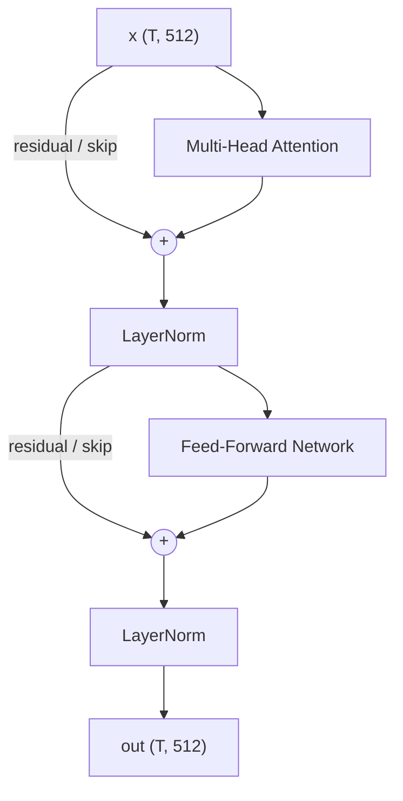
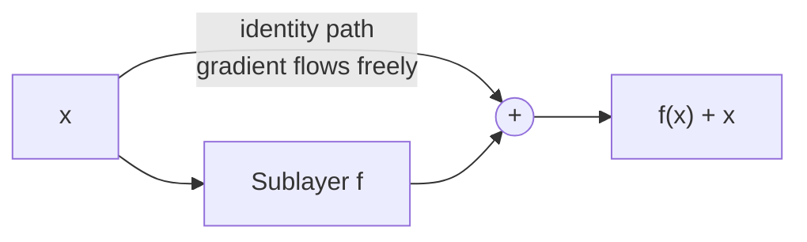
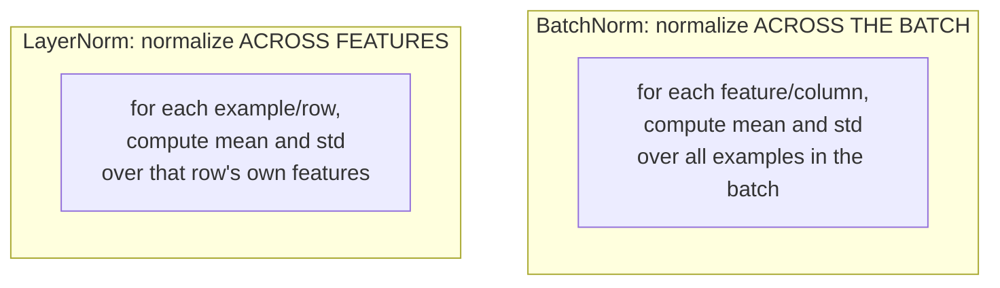
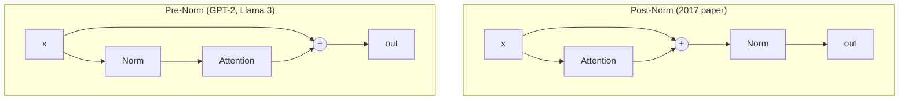

# 06 — The Transformer Block: Residuals, Normalization, Pre- vs Post-Norm

> **Prerequisites:** modules 03–05.
> **You will learn:** the exact anatomy of a transformer block, why LayerNorm
> replaced BatchNorm, why RMSNorm replaced LayerNorm, and why norm *placement*
> is the single most-varied design choice across 2026 models.

---

## 6.1 The block

A transformer is a stack of identical blocks. Understand one and you understand
all of them. The original encoder block has two sublayers:

1. **Multi-head attention** — tokens exchange information (module 04)
2. **Feed-forward network** — each token is processed independently (module 07)

Each sublayer is wrapped in a **residual connection** and a **normalization**.



Two invariants worth stating loudly:

- **Shape is preserved end to end.** `(T, 512)` in, `(T, 512)` out, at every
  intermediate point. This is what lets blocks stack, and it is why module 04
  insisted on the `W_O` projection back to `d_model`.
- **Every block has its own parameters.** The playlist's phone analogy: every
  iPhone 15 has identical hardware, but the apps differ. Blocks are
  architecturally copy-pasted; their weights are independent and diverge during
  training.

The original paper stacks **6** blocks in the encoder and 6 in the decoder. There
is nothing magic about 6 — it was empirically best for their translation task.
Modern models use far more (Qwen3 235B: 94; GLM-4.5: 92).

Why stack at all? Representation power. One block is not enough to model
language; depth is where "deep learning" gets its name.

## 6.2 Residual connections

A residual (or skip) connection routes the input *around* a sublayer and adds it
to the output:

```
out = Sublayer(x) + x
```

Introduced in ResNet (He et al., 2015) for CNNs. The playlist is admirably honest
that the original Transformer paper never justifies them, and offers two reasons
plus one piece of empirical evidence.

### Reason 1: gradient flow

In a deep network, gradients shrink as they propagate backward through many
layers — the **vanishing gradient** problem. A residual connection gives the
gradient an *alternate path* that skips the sublayer entirely.

Concretely, differentiating `out = f(x) + x` gives:

$$\frac{\partial \text{out}}{\partial x} = \frac{\partial f}{\partial x} + 1$$

That `+1` is the point. Even if `∂f/∂x` shrinks toward zero, the gradient
reaching `x` cannot fall below the identity path. With 6, 60, or 94 stacked
blocks, this is the difference between training and not training.

### Reason 2: transformations can be skipped

Suppose multi-head attention in some block produces *worse* representations than
its input — early in training, or for some particular input. Without a residual,
the damage propagates. With one, the network can learn to downweight the
sublayer and pass the original features through nearly unchanged.

A residual block can represent the identity function by driving `f → 0`. A plain
stack cannot easily do that. Adding depth therefore never has to *hurt*.

### The empirical evidence

The playlist relays a concrete data point: someone implementing the Transformer
from scratch in PyTorch accidentally omitted the residual connections. Everything
else was correct; performance was poor. Adding them back restored it.



## 6.3 Why LayerNorm and not BatchNorm

This is where video 79 earns its length, because the usual explanation
("sequences have variable length") is too vague to be useful.

### What normalization does

Rescale activations to have roughly zero mean and unit variance, then apply
learned scale `γ` and shift `β`:

$$\hat{x} = \frac{x - \mu}{\sqrt{\sigma^2 + \epsilon}}, \qquad y = \gamma\hat{x} + \beta$$

Benefits: training stability, faster convergence, mitigation of internal
covariate shift, and mild regularization.

### The difference is *which axis*



Given an activation tensor of shape `(batch, features)`:

- **BatchNorm** reduces over the batch dimension — statistics per *column*.
- **LayerNorm** reduces over the feature dimension — statistics per *row*.

### The padding argument

Here is the concrete reason, and it is decisive.

Batching sentences of different lengths requires **padding** to the longest one:

```
sentence 1: "hi Nitesh"                -> hi  Nitesh  PAD  PAD
sentence 2: "how are you today"        -> how  are    you  today
```

Padding embeddings are zeros, and stay zero through attention (anything times
zero is zero). Now scale up: batch size 32, longest sentence 100 tokens, average
sentence 30 tokens. Roughly **70% of every column is padding zeros.**

BatchNorm computes each column's mean and variance down that column — **including
all those zeros.** As the playlist puts it: those zeros "are not a part of our
original data, but we are forced to keep them here." A mean computed mostly from
artificial zeros is not a true representation of the data, and neither is the
standard deviation.

LayerNorm normalizes **within each token's own feature vector**. A real token's
512 features are all real numbers; padding tokens normalize themselves (to zero)
and contaminate nobody.

> **The zeros only affect themselves and do not affect others.** That is the
> whole argument.

There is a second, independent reason: BatchNorm's statistics depend on batch
composition, which makes behaviour differ between training and inference and
breaks down at batch size 1 — exactly the autoregressive generation case.

### In code

```python
import torch, torch.nn as nn

x = torch.randn(2, 4, 512)      # (batch, tokens, features)

# LayerNorm: reduce over the LAST dimension only
ln = nn.LayerNorm(512)
y = ln(x)                       # each of the 8 token vectors normalized independently

# equivalent by hand:
mu  = x.mean(dim=-1, keepdim=True)      # (2, 4, 1)
var = x.var(dim=-1, keepdim=True, unbiased=False)
y_manual = (x - mu) / torch.sqrt(var + 1e-5)
y_manual = y_manual * ln.weight + ln.bias
```

## 6.4 RMSNorm

Every model in module 15 uses **RMSNorm**, not LayerNorm. Raschka calls it "old
hat... basically a simplified version of LayerNorm with fewer trainable
parameters," which is accurate but skips why it matters.

RMSNorm (Zhang & Sennrich, 2019) drops mean-centering and the bias:

$$\text{RMSNorm}(x) = \frac{x}{\sqrt{\frac{1}{d}\sum_i x_i^2 + \epsilon}} \cdot \gamma$$

| | LayerNorm | RMSNorm |
|---|---|---|
| Subtract mean | yes | **no** |
| Divide by | standard deviation | root mean square |
| Learned params | `γ` and `β` (`2d`) | `γ` only (`d`) |
| Reduction passes | 2 (mean, then variance) | 1 |

Dropping mean subtraction removes a full reduction pass over the feature
dimension. On a GPU, reductions are memory-bandwidth-bound, so halving them is a
real speedup — and empirically quality is unaffected. That is the whole trade:
same results, cheaper.

```python
class RMSNorm(nn.Module):
    def __init__(self, d, eps=1e-6):
        super().__init__()
        self.weight = nn.Parameter(torch.ones(d))
        self.eps = eps

    def forward(self, x):
        # compute in fp32 for numerical stability, then cast back
        dtype = x.dtype
        x = x.float()
        rms = torch.rsqrt(x.pow(2).mean(-1, keepdim=True) + self.eps)
        return (x * rms).to(dtype) * self.weight
```

The fp32 upcast matters. In bf16 the sum of squares over 4096 dimensions can
overflow or lose precision; every production implementation does this.

## 6.5 Pre-norm vs post-norm — the most-varied choice in 2026

This is where models genuinely disagree, and Raschka devotes real space to it.

### Post-norm (the original, 2017)

```
x = LayerNorm(x + Attention(x))
x = LayerNorm(x + FFN(x))
```

Normalization goes **after** the residual addition.

### Pre-norm (GPT-2 onward)

```
x = x + Attention(LayerNorm(x))
x = x + FFN(LayerNorm(x))
```

Normalization goes **before** the sublayer, *inside* the residual branch.



### Why pre-norm won

The residual path in pre-norm is a **clean, unnormalized highway** from input to
output — nothing between the input and the final addition. Gradients flow through
it untouched.

Xiong et al. (2020) showed pre-LN gives "more well-behaved gradients at
initialization" and, crucially, "works well without careful learning rate
warm-up, which is otherwise a crucial tool for Post-LN." Removing the need for
warm-up tuning is a significant practical win.

### But post-norm came back

**OLMo 2** — and now **Olmo 3** — deliberately went back to a post-norm flavour:

```
x = x + RMSNorm(Attention(x))
x = x + RMSNorm(FFN(x))
```

Note the crucial difference from the 2017 original: **the normalization layers
are still inside the residual connections.** This is not a straight revert; it
places the norm on the sublayer *output* while keeping the residual highway
clean.

Raschka reports the OLMo 2 team found this "helped with training stability," and
is careful to add a caveat: their figure "shows the results of the reordering
together with QK-Norm, which is a separate concept. So it's hard to tell how much
the normalization layer reordering contributed by itself." Take the claim as
suggestive, not established.

### And Gemma does both

**Gemma 2, Gemma 3, and Gemma 4** wrap each sublayer in RMSNorm on *both* sides:

```
x = x + RMSNorm_post(Attention(RMSNorm_pre(x)))
x = x + RMSNorm_post(FFN(RMSNorm_pre(x)))
```

Raschka's read: "it gets the best of both worlds... a bit of extra normalization
can't hurt. In the worst case, if the extra normalization is redundant, this adds
a bit of inefficiency through redundancy" — negligible, since RMSNorm is cheap.

### And Trinity adds depth scaling

**Arcee AI Trinity Large** (Jan 2026) uses four RMSNorms per block — a
"depth-scaled sandwich norm". It looks like Gemma 3's placement, but the gain of
the second RMSNorm in each block is initialised to about `1/sqrt(L)` where `L` is
the total layer count. Early in training the residual update starts small and
grows as the model learns the right scale.

### Who uses what

| Model | Placement |
|---|---|
| Original Transformer (2017) | Post-norm, **outside** residual |
| GPT-2, GPT-3, Llama 3, Qwen3, Mistral | **Pre-norm** |
| OLMo 2, Olmo 3 | Post-norm, **inside** residual |
| Gemma 2 / 3 / 4 | **Both** pre- and post- |
| Arcee Trinity Large | Both, with depth-scaled gain (`1/sqrt(L)`) |

## 6.6 QK-Norm

A newer addition, and one Raschka flags across many 2025–26 models: an
**additional RMSNorm applied to the queries and keys**, inside the attention
module, **before RoPE**.

```python
class GroupedQueryAttention(nn.Module):
    def __init__(self, d_in, num_heads, num_kv_groups, head_dim=None,
                 qk_norm=False, dtype=None):
        # ...
        if qk_norm:
            self.q_norm = RMSNorm(head_dim, eps=1e-6)
            self.k_norm = RMSNorm(head_dim, eps=1e-6)
        else:
            self.q_norm = self.k_norm = None

    def forward(self, x, mask, cos, sin):
        queries = self.W_query(x)
        keys    = self.W_key(x)
        values  = self.W_value(x)

        if self.q_norm:                      # QK-Norm
            queries = self.q_norm(queries)
        if self.k_norm:
            keys = self.k_norm(keys)

        queries = apply_rope(queries, cos, sin)   # RoPE comes AFTER
        keys    = apply_rope(keys, cos, sin)
        # ...
```

*(Adapted from Raschka's Qwen3 from-scratch implementation.)*

**Why:** module 03 showed that large-magnitude scores saturate softmax and kill
gradients. `sqrt(d_k)` fixes the *dimensional* growth, but not drift in the
learned magnitude of Q and K during training. QK-Norm bounds them directly.

Not invented by OLMo 2 — it goes back to the 2023 *Scaling Vision Transformers*
paper. Used by OLMo 2, Gemma 2/3, Qwen3, Trinity Large, and others.

**MiniMax-M2** refines it further with **per-layer QK-Norm**: the RMSNorm scale
vector has "distinct parameters for every head (and each head dim)" rather than
being shared across heads within a layer.

## 6.7 The modern block, assembled

Putting modules 04–07 together, here is what a 2026 decoder block actually looks
like:

```python
class TransformerBlock(nn.Module):
    """Pre-norm decoder block, RMSNorm, RoPE, GQA, SwiGLU."""

    def __init__(self, d_model, n_heads, n_kv_heads, d_ff):
        super().__init__()
        self.norm1 = RMSNorm(d_model)
        self.attn  = GroupedQueryAttention(d_model, n_heads, n_kv_heads)  # module 09
        self.norm2 = RMSNorm(d_model)
        self.ffn   = SwiGLU(d_model, d_ff)                                # module 07

    def forward(self, x, cos, sin, mask=None):
        # sublayer 1 — attention.  Residual path stays clean.
        x = x + self.attn(self.norm1(x), cos, sin, mask)
        # sublayer 2 — feed-forward
        x = x + self.ffn(self.norm2(x))
        return x
```

Compare with the 2017 block: LayerNorm → RMSNorm, post-norm → pre-norm, MHA →
GQA, ReLU-FFN → SwiGLU, learned/sinusoidal PE → RoPE. Five substitutions. **The
skeleton is unchanged.** That is Raschka's thesis, in code.

### The residual stream

One conceptual reframe that pays off later. Because every sublayer *adds* to `x`,
the value flowing down the network is a running sum:

```
x_final = x_0 + attn_1(...) + ffn_1(...) + attn_2(...) + ffn_2(...) + ...
```

This is the **residual stream**: a shared communication bus of width `d_model`
that every sublayer reads from and writes to. It explains why `d_model` is
called the model width, why every sublayer must preserve shape, and why models
are described as "wide" or "deep" along that axis.

---

## Reconciling the sources

**Normalization coverage.** The playlist covers LayerNorm vs BatchNorm in depth
(the padding argument) but never mentions RMSNorm or pre/post-norm — video 79
predates their dominance. Raschka skips LayerNorm vs BatchNorm entirely ("RMSNorm
is old hat") and spends his effort on *placement*, because that is what varies
across models. Complementary: the playlist explains *why normalize this axis*,
Raschka explains *where to put it*.

**Post-norm.** The playlist teaches the 2017 post-norm arrangement, because it
teaches the original paper. Almost nothing in 2026 uses it in that exact form.
OLMo 2 revived a *variant* with the norm inside the residual — do not confuse the
two.

**Residual justification.** The playlist is explicit that nobody knows for
certain, offering gradient flow and feature-skipping as the leading candidates
plus anecdotal evidence. That honesty is correct; the theoretical literature is
still unsettled.

---

## Key takeaways

- A block is: attention sublayer + FFN sublayer, each wrapped in a residual and a
  normalization. Shape `(T, d_model)` is preserved throughout.
- Blocks are architecturally identical but have **independent parameters**.
- Residuals give gradients an identity path (`∂out/∂x = ∂f/∂x + 1`) and let the
  network skip an unhelpful transformation. Removing them measurably degrades
  quality.
- **LayerNorm not BatchNorm** because padding zeros — up to ~70% of a batch —
  poison per-column statistics. LayerNorm normalizes within each token, so
  padding affects only itself.
- **RMSNorm** drops mean-centering and bias: one reduction instead of two, half
  the parameters, same quality. Universal in 2026.
- **Pre-norm** (norm inside the residual branch) is the default: cleaner
  gradients, no warm-up needed.
- Placement is genuinely contested: OLMo 2/Olmo 3 use post-norm inside the
  residual for stability; Gemma 2/3/4 use both; Trinity Large uses four norms with
  a depth-scaled gain of `1/sqrt(L)`.
- **QK-Norm** applies RMSNorm to Q and K before RoPE, bounding score magnitudes
  beyond what `sqrt(d_k)` handles.
- The modern block differs from 2017 by five component substitutions and zero
  structural changes.

## Self-check

1. A colleague proposes BatchNorm in a Transformer, arguing it works fine in
   CNNs. Give the concrete numerical argument for why it fails here — name the
   axis and what contaminates it.
2. Write out pre-norm and post-norm for one sublayer. Explain what "the residual
   path is clean" means in the pre-norm version and why that helps gradients.
3. Module 03 scaled by `sqrt(d_k)` to control score variance. QK-Norm also
   controls score magnitude. What does QK-Norm handle that `sqrt(d_k)` cannot?

---

**Next → [07 — The FFN / MLP Layer](./07-ffn-and-activations.md)**
