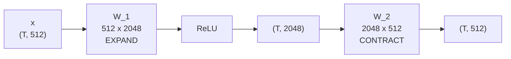
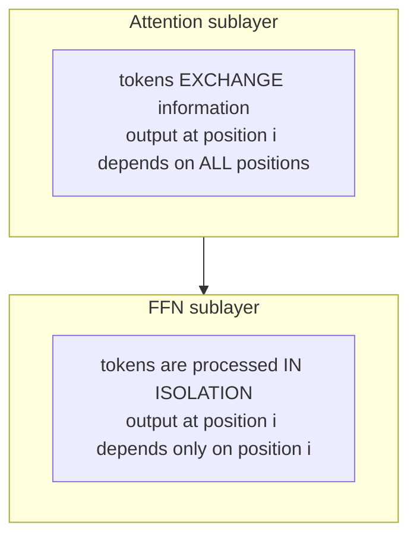
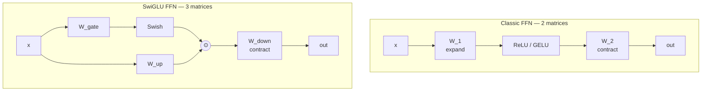

# 07 — The FFN / MLP Layer: GELU, SwiGLU, and Where the Parameters Live

> **Prerequisites:** modules 03–06.
> **You will learn:** what the feed-forward network does, why it holds two-thirds
> of a Transformer's parameters, the activation-function lineage from ReLU to
> SwiGLU, and the key-value-memory interpretation.

---

## 7.1 The other half of the block

Attention gets the attention. But the second sublayer — the feed-forward network
— holds **most of the parameters** and is where a surprising amount of the
model's knowledge lives.

Its structure is simple. Two linear layers with a nonlinearity between:

```
FFN(x) = activation(x · W_1 + b_1) · W_2 + b_2
```

The playlist walks the exact shapes from the paper:

| Layer | Neurons | Activation | Weight shape | Biases |
|---|---|---|---|---|
| input | 512 | — | — | — |
| hidden | **2048** | ReLU | `(512, 2048)` | 2048 |
| output | 512 | linear (none) | `(2048, 512)` | 512 |

So `d_ff = 4 · d_model`. That 4× ratio held for years and is still a common
default.



## 7.2 It is applied per token, independently

This is the property that makes the FFN the exact complement of attention, and it
is easy to miss.

The FFN sees **one token vector at a time**. It has no access to other positions.
Feeding `(T, 512)` through it is just `T` independent applications of the same
function — batched for efficiency, not because they interact.



That division of labour is the design:

| | Mixes across positions? | Mixes across features? |
|---|---|---|
| Attention | **yes** | no (per-head, linearly) |
| FFN | no | **yes** |

Attention decides *what information to gather*; the FFN decides *what to do with
it*. Alternate them enough times and you get a language model.

## 7.3 Why expand then contract?

A fair objection: we go 512 → 2048 → 512 and end where we started. What was
gained?

**Nonlinearity, in a high-dimensional space.** Without the ReLU the whole thing
would collapse — `W_2(W_1 x)` is just `(W_2 W_1) x`, a single linear map. The
activation is the point; the expansion gives it room to work.

The playlist makes an important structural observation here: **self-attention is
almost entirely linear.** Projections are linear, the score matmul is bilinear,
the weighted sum is linear. Softmax is the only nonlinearity, and it acts on
*weights*, not on content. So if the FFN were removed, a Transformer would have
very little capacity to represent nonlinear relationships in the data.

The FFN is where nonlinearity lives.

### Where the parameters live

Count, for `d_model = 512`, `d_ff = 2048`, per block:

| Component | Parameters |
|---|---|
| Attention: `W_q, W_k, W_v, W_O` | `4 × 512 × 512` = **1.05M** |
| FFN: `W_1, W_2` | `2 × 512 × 2048` = **2.10M** |

**The FFN has twice the attention's parameters.** Raschka's account is consistent:
the FFN "typically contains a large number of the model's total parameters," and
the paper the playlist cites states plainly that "feed-forward layers constitute
two-thirds of the Transformer model parameters."

This single fact explains module 12 entirely. If you want to grow model capacity
without proportionally growing inference cost, you attack the largest parameter
block. That is the FFN. Mixture-of-Experts is the FFN, replicated and sparsely
routed.

## 7.4 The key-value-memory interpretation

Why does the FFN work? The playlist is candid: "this is a gray area... not much
has been explained in the paper and it is an area of active research."

The standard answer is "to add nonlinearity". A more interesting one comes from
*Transformer Feed-Forward Layers Are Key-Value Memories* (Geva et al., 2021),
which the playlist flags. The claim:

> Feed-forward layers in transformer-based language models operate as key-value
> memories, where each key correlates with textual patterns in the training
> examples, and each value induces a distribution over the output vocabulary.

Read the FFN as an attention-like lookup with **learned, static** keys and values:

```
FFN(x) = sum over neurons j of  activation(x · W_1[:, j]) * W_2[j, :]
              \_______________________________/    \____________/
                   "how much does x match             "what this
                     pattern j?"  (the KEY)          neuron writes"
                                                        (the VALUE)
```

Each of the 2048 hidden neurons is a pattern detector; when it fires it writes
its learned value vector into the residual stream. Where attention retrieves from
the *current sequence*, the FFN retrieves from *parameters* — from what the model
learned during pretraining.

That framing makes the FFN the model's **factual memory**, and it makes MoE's
logic obvious: if the FFN is a lookup table, you can grow the table without
reading all of it every time.

## 7.5 The activation lineage

### ReLU (2017)

$$\mathrm{ReLU}(x) = \max(0, x)$$

Cheap, non-saturating for positive inputs, sparse (~50% zeros). Its flaw is the
**dying ReLU** problem: a neuron whose pre-activation is always negative outputs
zero forever, and its gradient is zero forever too. It never recovers.

### GELU (BERT, GPT-2/3)

$$\mathrm{GELU}(x) = x \cdot \Phi(x)$$

where `Φ` is the standard Gaussian CDF. Intuition: instead of a hard gate
(keep/zero), weight the input by the probability that it exceeds a random
threshold. The result is smooth, and slightly negative for small negative inputs
rather than exactly zero — so gradients survive.

The common tanh approximation:

$$\mathrm{GELU}(x) \approx 0.5x\left(1 + \tanh\left[\sqrt{2/\pi}\,(x + 0.044715x^3)\right]\right)$$

```python
import torch.nn.functional as F
y = F.gelu(x)                      # exact
y = F.gelu(x, approximate='tanh')  # the approximation, used by GPT-2
```

### SwiGLU (Llama, PaLM, and everything since)

The current standard, and structurally different from the two above — it changes
the *shape* of the FFN, not just the nonlinearity.

Start with **Swish** (a.k.a. SiLU):

$$\mathrm{Swish}(x) = x \cdot \sigma(x)$$

Similar to GELU, cheaper. Then add a **gate**. A Gated Linear Unit computes two
projections and multiplies them elementwise, so one branch *controls how much of
the other passes through*:

$$\mathrm{SwiGLU}(x) = \big(\mathrm{Swish}(x W_{gate})\big) \odot \big(x W_{up}\big)$$

$$\mathrm{FFN}_{\text{SwiGLU}}(x) = \Big(\mathrm{Swish}(x W_{gate}) \odot (x W_{up})\Big) W_{down}$$



**Three matrices, not two.** To keep the parameter count comparable, `d_ff` is
reduced from `4·d_model` to roughly `8/3 · d_model ≈ 2.67 · d_model` — usually
rounded to a hardware-friendly multiple. That is why you see intermediate sizes
like 11008 for Llama's `d_model = 4096` rather than 16384.

```python
class SwiGLU(nn.Module):
    def __init__(self, d_model, d_ff):
        super().__init__()
        self.w_gate = nn.Linear(d_model, d_ff, bias=False)
        self.w_up   = nn.Linear(d_model, d_ff, bias=False)
        self.w_down = nn.Linear(d_ff, d_model, bias=False)

    def forward(self, x):
        return self.w_down(F.silu(self.w_gate(x)) * self.w_up(x))
```

Note `bias=False` throughout. Modern models drop FFN biases — they cost
parameters and contribute nothing measurable.

**Why gating helps** is not fully settled. Noam Shazeer's paper introducing
SwiGLU ends with a famously honest line: the architectures' success is attributed
"to divine benevolence." The working explanation is that multiplicative
interaction adds expressiveness a single nonlinearity cannot, letting the network
learn input-dependent filtering. Empirically it wins consistently, so everyone
uses it.

### Comparison

| | ReLU | GELU | SwiGLU |
|---|---|---|---|
| Formula | `max(0,x)` | `x·Φ(x)` | `Swish(xW_g) ⊙ xW_u` |
| Smooth | no | yes | yes |
| Matrices in FFN | 2 | 2 | **3** |
| Typical `d_ff` | `4·d` | `4·d` | `~8/3·d` |
| Used by | Transformer 2017 | BERT, GPT-2/3 | Llama, Qwen, Gemma, Mistral, DeepSeek |

Raschka's one-line summary of the shift: "the more efficient SwiGLU has replaced
activation functions like GELU."

### One holdout

**gpt-oss** uses a gated activation but **keeps bias units in the attention
layers** — something Raschka says he hasn't "seen... since the GPT-2 days," and
which is "commonly regarded as redundant." He cites a paper showing this
mathematically for the key projection, with empirical results finding "little
difference between with and without bias units." GLM-4.5 also retains attention
bias. Curiosities, not trends.

## 7.6 Sizing in practice

| Model | `d_model` | `d_ff` | ratio | activation |
|---|---|---|---|---|
| Transformer base | 512 | 2048 | 4.00 | ReLU |
| GPT-3 175B | 12288 | 49152 | 4.00 | GELU |
| Llama 3 8B | 4096 | 14336 | 3.50 | SwiGLU |
| Qwen3 0.6B | 1024 | 3072 | 3.00 | SwiGLU |
| Olmo 3 32B | 5120 | ~27648 | 5.40 | SwiGLU |

Raschka notes Olmo 3's unusually high 5.4× ratio and reads it as deliberate: the
team likely "scaled up the intermediate size expansion from 5x in Qwen3 to 5.4 in
Olmo 3 to have a 32B model for a direct comparison" — the ratio was tuned to hit
a target parameter count, not chosen on principle. A useful reminder that not
every hyperparameter encodes a deep insight.

In MoE models the picture changes completely — expert FFNs are much narrower
(DeepSeek V3: 2048; Qwen3: 768) but there are hundreds of them. Module 12.

---

## Reconciling the sources

**Activation coverage.** The playlist covers only ReLU, because it teaches the
2017 paper. Raschka mentions SwiGLU's dominance but does not explain gating.
Neither covers GELU's role in the BERT/GPT-2 era. This module fills both gaps.

**Why the FFN exists.** The playlist is explicitly uncertain and offers two
answers: the standard "adds nonlinearity" and the key-value-memory paper. Raschka
does not address the question — for his purposes the FFN is simply the block MoE
replaces. The uncertainty is genuine and worth preserving; be suspicious of
sources that state a confident answer.

**`d_ff` ratio.** The playlist gives 4× from the paper. Raschka's tables show 3.0
to 5.4 in practice, and the SwiGLU three-matrix structure changes the arithmetic.
4× is a historical default, not a rule.

---

## Key takeaways

- The FFN is two (or three) linear layers with a nonlinearity between, applied
  **independently to each token** — the exact complement of attention, which
  mixes across tokens.
- Attention is almost entirely linear; softmax acts on weights, not content. The
  FFN supplies nearly all of the model's nonlinearity.
- The FFN holds roughly **two-thirds of a Transformer's parameters**. This is why
  MoE targets it.
- The key-value-memory reading: hidden neurons are learned pattern detectors
  (keys) that write learned value vectors into the residual stream. The FFN is
  retrieval from *parameters*; attention is retrieval from *context*.
- ReLU → GELU (smooth, no dying neurons) → SwiGLU (gated, three matrices).
- SwiGLU's third matrix means `d_ff` shrinks to ~`8/3 · d_model` to hold
  parameters constant.
- Modern FFNs drop biases entirely.
- `d_ff / d_model` ranges from 3.0 to 5.4 in practice; the 4× rule is historical.

## Self-check

1. Attention mixes information across positions; the FFN does not. State each
   sublayer's job in one sentence, and explain why alternating them is more
   powerful than either alone.
2. Under the key-value-memory reading, what plays the role of key and what plays
   the role of value in `FFN(x) = W_2 · act(W_1 x)`? How does this differ from
   attention's keys and values?
3. A model has `d_model = 4096` and a classic 2-matrix FFN with `d_ff = 16384`.
   You switch to SwiGLU and want the same parameter count. What `d_ff` do you
   pick, and show the arithmetic.

---

**Next → [08 — Encoder, Decoder, and Causal Masking](./08-encoder-decoder-masking.md)**
