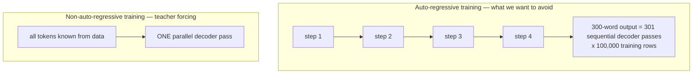
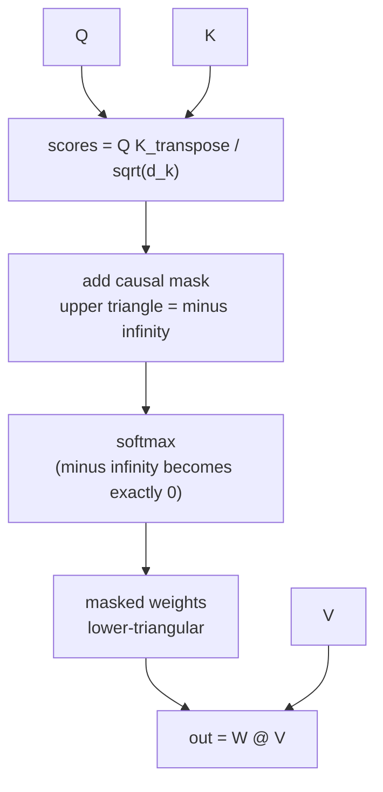
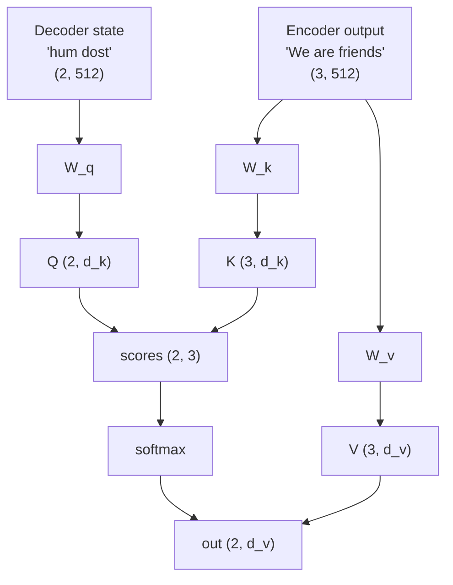
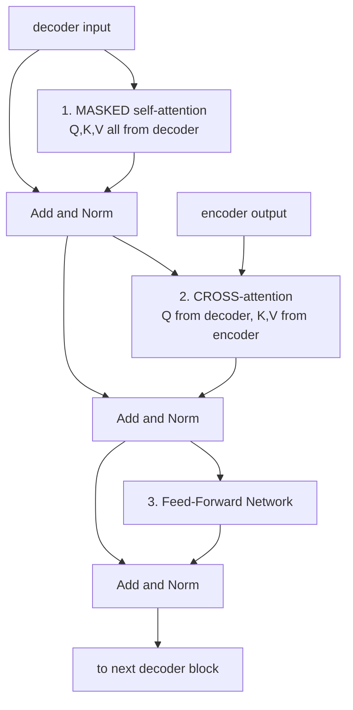
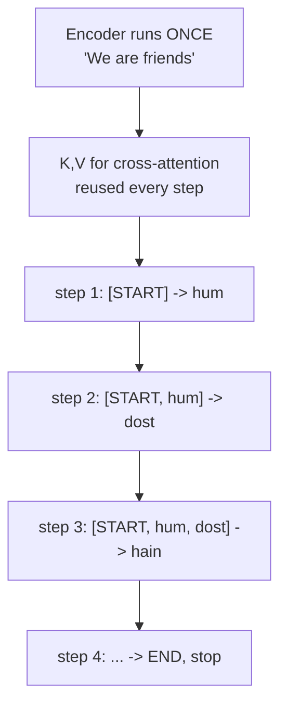

# 08 — Encoder, Decoder, Encoder-Decoder, and Causal Masking

> **Prerequisites:** modules 03–07.
> **You will learn:** the three architecture families, why the decoder needs a
> causal mask, the data-leakage argument that makes masking necessary, cross-
> attention, and exactly how training differs from inference.

---

## 8.1 Three families

The 2017 paper describes an encoder-**and**-decoder model. Both halves are stacks
of the module-06 block, but they are wired differently, and each half turned out
to be useful on its own.

```mermaid
flowchart TD
    subgraph ENCONLY["Encoder-only"]
        E1["bidirectional attention<br/>every token sees every token"]
        E1 --> E2["BERT, RoBERTa, ModernBERT"]
        E2 --> E3["classification, retrieval, embeddings"]
    end
    subgraph DECONLY["Decoder-only"]
        D1["causal attention<br/>token t sees only positions less-than-or-equal-to t"]
        D1 --> D2["GPT, Llama, Qwen, DeepSeek, Gemma"]
        D2 --> D3["generation — every LLM in module 15"]
    end
    subgraph ENCDEC["Encoder-Decoder"]
        X1["encoder: bidirectional<br/>decoder: causal + cross-attention"]
        X1 --> X2["original Transformer, T5, BART, Whisper"]
        X2 --> X3["translation, summarization, speech"]
    end
```



| | Encoder-only | Decoder-only | Encoder-Decoder |
|---|---|---|---|
| Attention | bidirectional | causal | both + cross |
| Can generate? | no | **yes** | yes |
| Sees full input at once | yes | only the prefix | yes (encoder side) |
| Objective | masked LM | next-token | seq2seq |
| Examples | BERT | GPT, Llama, Qwen | T5, Whisper |

**Decoder-only won.** Every model in module 15 is decoder-only. The reasons are
practical: one stack to train, one objective, and it scales cleanly.

## 8.2 The encoder stack

Nothing new here — it is module 06's block, six deep, with unrestricted
attention. Following the playlist's walkthrough of `"how are you"`:

```
INPUT BLOCK (before the stack)
  1. tokenization       "how are you"  ->  [how] [are] [you]
  2. embedding          each token -> 512-dim vector
  3. positional encoding  add PE(0), PE(1), PE(2)
  -> x1, x2, x3          each (512,)

ENCODER BLOCK x6
  4. multi-head attention        -> z1, z2, z3
  5. add residual (x + z), LayerNorm
  6. feed-forward network        -> y1, y2, y3
  7. add residual, LayerNorm
  -> output feeds the next block

OUTPUT: 3 vectors of 512 dims -> sent to the decoder
```

Shape is `(3, 512)` at every single checkpoint. As the playlist puts it: hold on
anywhere in the encoder and you get `3 × 512`.

Because there is no mask, `how` attends to `you` and `you` attends to `how`.
That bidirectionality is exactly what makes encoders good at *understanding* and
useless at *generating* — a generator cannot look at the future.

## 8.3 Causal masking: the core of the decoder

### The sentence to understand

Video 81 opens with a claim worth unpacking carefully:

> **The Transformer decoder is auto-regressive at inference time, and
> non-auto-regressive at training time.**

**Autoregressive** means each output is conditioned on previously generated
outputs. Stock prediction is autoregressive: Friday's forecast depends on
Thursday's and Wednesday's. An RNN decoder is autoregressive: each timestep's
input is the previous timestep's output.

Sequential generation is **unavoidable at inference**. To emit word 3 you must
know words 1 and 2, and you only know them because you generated them. There is
no way around it.

But at *training* time, something changes.

### Teacher forcing

During training you already have the correct output sentence. **Teacher forcing**
means feeding the *ground-truth* previous token at each step, not the model's
own (possibly wrong) prediction.

```
step 1:  input [START]              -> model says "tum"    (wrong; correct is "hum")
step 2:  input [START, hum]         <- feed the CORRECT word from data, not "tum"
step 3:  input [START, hum, dost]   <- again from data
```

And here is the consequence: **if every input comes from the dataset, no step
depends on any other step's output.** The sequential dependency is gone. All
positions can be processed in parallel.



The playlist's arithmetic: a 300-word target means running the entire decoder 301
times *for one training row*. Multiply by 100,000 rows. Training would be
impossibly slow.

### But parallelism creates data leakage

Feed all tokens at once into ordinary self-attention and something breaks.

Recall module 03: the contextual embedding of a token is a weighted mixture of
**every** token in the sequence. So when computing the representation for
position 1 (`hum`), the mechanism happily mixes in position 2 (`dost`) and
position 3 (`hain`).

Those are **future tokens**. At inference they do not exist yet. The model would
be learning to predict `dost` using information that includes `dost`.

The playlist's word for this is exactly right: **cheating.** More formally, it is
**data leakage** — the model has information at training time that it will not
have at prediction time. Training loss looks great; real-world performance is
terrible.

> The rule this violates is general to all machine learning: whatever information
> you have at training time you must also have at prediction time.

We are now stuck between two failures:

| Approach | Training speed | Data leakage |
|---|---|---|
| Auto-regressive training | very slow | none |
| Parallel training | fast | **catastrophic** |

### The fix: mask before softmax

We want position `i` to attend only to positions `≤ i`. Looking at module 03's
weight matrix, that means forcing the strictly-upper-triangular entries to zero.

Setting `w = 0` directly would break the softmax normalization. Instead, add
`-inf` to the **scores before softmax**, exploiting `softmax(-inf) = 0`:

```
scaled scores            mask (added)              masked scores
[ 3.0  2.1  0.8 ]        [  0   -inf  -inf ]       [ 3.0  -inf  -inf ]
[ 1.2  4.0  1.5 ]   +    [  0    0    -inf ]   =   [ 1.2   4.0  -inf ]
[ 0.9  2.2  3.1 ]        [  0    0     0   ]       [ 0.9   2.2   3.1 ]

                      softmax over each row
                              |
                              v
                    [ 1.00  0.00  0.00 ]
                    [ 0.06  0.88  0.06 ]   <- row sums to 1, future is exactly 0
                    [ 0.07  0.20  0.73 ]
```

Each row still sums to 1 — softmax renormalizes over the surviving entries. Row 1
attends only to itself; row 2 to positions 1–2; row 3 to all three.



**Best of both worlds:** all positions computed in one parallel pass, and no
position can see its future.

```python
import torch

def causal_mask(T, device=None):
    """Lower-triangular boolean mask: True = allowed."""
    return torch.tril(torch.ones(T, T, dtype=torch.bool, device=device))

# inside attention, after scaling:
scores = scores.masked_fill(~causal_mask(T, scores.device), float('-inf'))
weights = torch.softmax(scores, dim=-1)
```

In practice use the fused path, which never materialises the mask:

```python
out = F.scaled_dot_product_attention(Q, K, V, is_causal=True)
```

### Masking applies at inference too

Video 84 calls out a misconception explicitly, and it is worth repeating because
people get this wrong:

> Some people have this doubt that masking does not happen at inference time, but
> it is not so. In the Transformer architecture, masking also happens at
> inference.

You could argue it is unnecessary — at step 3 you only *have* three tokens, so
there is no future to hide. But the model was trained with masked attention
patterns. Removing the mask at inference changes the computation the weights were
fitted to, and quality drops. **Same computation at train and test time.** Always.

### Padding masks are a different thing

Two masks, often combined, often confused:

| | Causal mask | Padding mask |
|---|---|---|
| Purpose | hide future tokens | ignore `PAD` positions |
| Shape | `(T, T)`, same for all examples | `(B, T)`, per example |
| Used in | decoders only | encoders and decoders |

## 8.4 Cross-attention

The decoder's second attention sublayer is different, and video 82 is dedicated
to it. In the architecture diagram you can spot it immediately: **two arrows come
from the encoder and one from below**, whereas every other attention block has
all three arrows from the same place.

### The motivating question

Generating the third Hindi word depends on two things:

1. **What the decoder has generated so far** — handled by masked self-attention.
2. **What the input sentence says** — needs a mechanism relating two *different*
   sequences.

Self-attention relates a sequence to itself (module 03, §3.7). For two sequences
you need **cross-attention**.

### The mechanism

Identical to self-attention with one change in wiring:

$$Q \text{ from the } \textbf{decoder}, \qquad K, V \text{ from the } \textbf{encoder}$$



Note the **rectangular** score matrix: `(T_dec, T_enc)`, not square. Row `i` says
how much output token `i` should draw from each input token. That matrix is
exactly the alignment table you would draw by hand:

```
            we    are   friends
hum        0.80  0.10    0.10
dost       0.10  0.10    0.80
hain       0.15  0.75    0.10
```

**The number of outputs equals the number of tokens in the *decoder* sequence**,
not the encoder's — a point the playlist emphasises because it trips people up.

### It is Luong attention, again

The paper calls this "encoder-decoder attention" and says so directly:

> The queries come from the previous decoder layer, and the memory keys and
> values come from the output of the encoder. This allows every position in the
> decoder to attend over all positions in the input sequence. This mimics the
> typical encoder-decoder attention mechanisms in sequence-to-sequence models.

Which closes the loop from module 01. Bahdanau/Luong attention computed alignment
between decoder state and encoder states; cross-attention is the same operation
with learned K/V projections and multiple heads. The lineage is explicit.

### Where else it shows up

Cross-attention is the general tool for relating two sequences of *any* kind:

- **Image captioning** — image patches (K,V) → text (Q)
- **Text-to-image** (Stable Diffusion) — text (K,V) → image latents (Q)
- **Speech recognition** (Whisper) — audio (K,V) → text (Q)

Every multimodal system uses it somewhere.

## 8.5 The full decoder block

Three sublayers, each with residual + norm:



After the sixth block, an output head converts vectors to words:

```
final vectors (T, 512)
   -> Linear (512, V)        V = vocabulary size, e.g. 10,000
   -> logits (T, 10000)
   -> softmax
   -> probability distribution over the vocabulary
   -> argmax (or sample)
```

Each of the `V` output neurons corresponds to one vocabulary word. Pick the
highest-probability one (or sample — module 14).

## 8.6 Training vs inference, side by side

The encoder behaves **identically** in both. All the difference is in the decoder.

### Training — one parallel pass

```
encoder: "We are friends"  ->  3 context vectors
decoder input (teacher forced, right-shifted):  [START] hum dost
decoder target:                                  hum    dost hain

ALL positions processed simultaneously, causal mask applied.
Loss computed over all positions at once. One backward pass.
```

**Right-shifting** is what makes the targets line up: prepend `[START]` so that
position `i` of the input predicts position `i` of the target.

### Inference — one pass per token

```
step 1:  decoder input [START]                  -> "hum"
step 2:  decoder input [START, hum]             -> "dost"
step 3:  decoder input [START, hum, dost]       -> "hain"
step 4:  decoder input [START, hum, dost, hain] -> [END]  -> stop
```



Three details from video 84 that matter:

1. **The encoder runs once.** Its output is fixed and reused as cross-attention
   K/V at every decoding step.
2. **The input grows by one token each step** — 1, then 2, then 3.
3. **Only the last position's vector goes to the output head.** At step 2 the
   decoder produces *two* 512-dim vectors, but you already emitted a word for
   position 1. You send only the final vector and discard the rest.

That third point is the one people find confusing, and the playlist flags it:
"you are carrying all the vectors till the very end, but at the very last point
you send only the last one and forget it."

### The waste this reveals

Look at what happens between step 2 and step 3. Both recompute the K and V
vectors for `[START]` and `hum` — identical inputs, identical weights, identical
results. Every step redoes all of the previous steps' key/value work.

For a 1000-token generation that is ~500,000 redundant vector computations.

**The fix is the KV cache** (module 11): store K and V once and append. That one
optimisation reshapes the entire inference stack — and because cache *size* then
becomes the bottleneck, it is also what motivates MQA, GQA, and MLA in module 09.

## 8.7 Why decoder-only won

The original design has an encoder for the input and a decoder for the output.
Modern LLMs collapse this: concatenate everything into one sequence and run a
single causal stack.

```
[prompt tokens] [generated tokens]
 <---------- one causal sequence ---------->
```

The prompt is attended to by everything after it — which is what cross-attention
did — but with one stack, one set of weights, one objective.

| | Encoder-Decoder | Decoder-only |
|---|---|---|
| Stacks | 2 | 1 |
| Attention types | 3 (bi, causal, cross) | 1 (causal) |
| Input attention | bidirectional | causal only |
| Scales cleanly | harder | **yes** |

The cost: the prompt is processed causally rather than bidirectionally, so early
prompt tokens cannot see later ones. In practice this loses less than the
simplicity gains — and simplicity is what scales.

Raschka's framing is a nice historical marker. Discussing Kimi K2's 1-trillion
parameters, he notes it "may be the biggest LLM of this generation" given that
"Google's 1.6 trillion Switch Transformer is an encoder-decoder architecture from
a different generation." Encoder-decoder is, for LLMs, a previous era.

Encoder-decoder is still correct where input and output are genuinely different
modalities — Whisper (audio→text), translation systems, diffusion text
conditioning.

---

## Reconciling the sources

**Coverage split.** The playlist teaches the full encoder-decoder because it
teaches the 2017 paper, and covers masking, cross-attention, teacher forcing and
inference in depth (videos 80–84). Raschka covers only decoder-only models,
because that is what 2025–26 ships. The masking mechanics are identical either
way; only cross-attention drops out.

**"Non-autoregressive".** The playlist uses this for teacher-forced parallel
*training*. In the wider literature "non-autoregressive generation" means
something else entirely — models that emit all output tokens simultaneously at
*inference*. Do not confuse them; the playlist's usage is about training only.

**Cross-attention naming.** The paper says "encoder-decoder attention"; the
playlist and common usage say "cross-attention". Same thing.

---

## Key takeaways

- Three families: encoder-only (BERT, understanding), decoder-only (GPT/Llama,
  generation), encoder-decoder (T5/Whisper, seq2seq). **Decoder-only dominates.**
- Teacher forcing feeds ground-truth previous tokens during training, which
  removes the sequential dependency and makes training a single parallel pass.
- Parallel training without masking causes **data leakage** — position `i` mixes
  in future tokens it will not have at inference.
- The **causal mask** adds `-inf` to future positions *before* softmax, so their
  weights become exactly 0 while rows still sum to 1. Parallel *and* leak-free.
- Masking is applied at **inference too**. Train-test computation must match.
- **Cross-attention**: Q from the decoder, K and V from the encoder. Score matrix
  is rectangular `(T_dec, T_enc)`. It is Luong attention with learned projections.
- Inference: encoder runs once; the decoder loops, growing by one token per step,
  and **only the last position's vector reaches the output head**.
- Each decode step recomputes all previous K/V — pure waste, and the reason KV
  caching (module 11) exists.

## Self-check

1. Teacher forcing makes training parallel. Explain what breaks if you use
   teacher forcing *without* a causal mask, and name the machine-learning failure
   mode.
2. Cross-attention takes Q from the decoder and K/V from the encoder. What would
   go wrong if you swapped them — and what shape would the score matrix become?
3. At decode step 5 the decoder produces five 512-dim vectors. Only one reaches
   the output head. Which one, why, and what does that imply about the other four
   having been computed at all?

---

**Next → [09 — Efficient Attention: MHA, MQA, GQA, MLA](./09-mqa-gqa-mla.md)**
