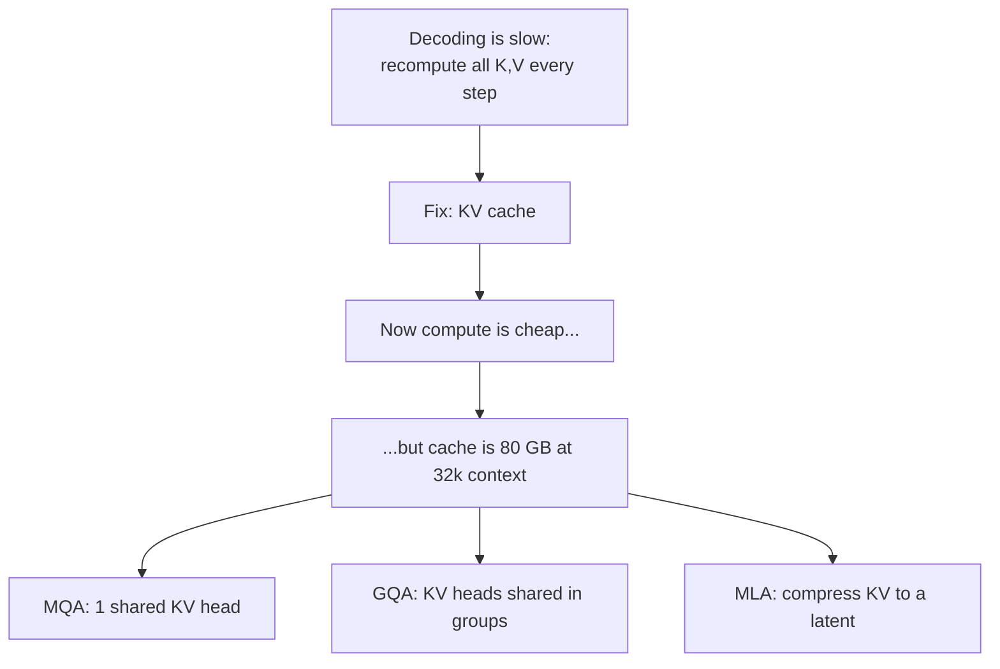
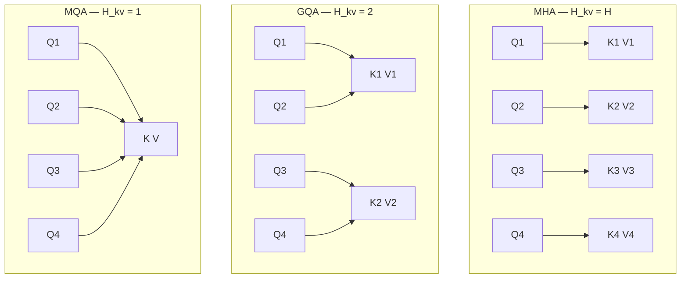
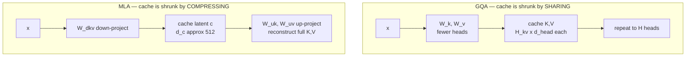
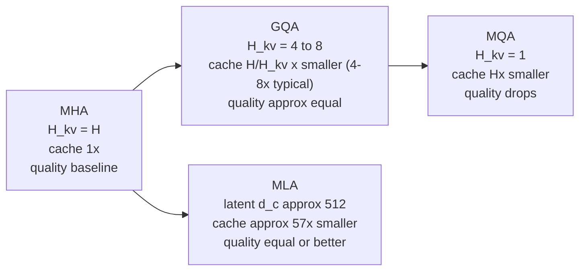

# 09 — Efficient Attention: MHA → MQA → GQA → MLA

> **Prerequisites:** modules 04, 08.
> **You will learn:** why the KV cache dominates inference memory, and the three
> mechanisms — MQA, GQA, MLA — invented to shrink it, with the arithmetic.

---

## 9.1 The KV cache, and why it changes everything

Module 08 ended on a waste: at each decode step the model recomputes K and V for
every previous token, identically. The fix is obvious once seen — **cache them**.

```python
# naive: recompute everything, every step
for step in range(max_new):
    K = W_k(all_tokens_so_far)     # recomputes positions 0..t-1 AGAIN
    V = W_v(all_tokens_so_far)

# cached: compute only the new token, append
for step in range(max_new):
    k_new = W_k(newest_token)      # ONE token
    v_new = W_v(newest_token)
    K = torch.cat([K_cache, k_new], dim=-2)
    V = torch.cat([V_cache, v_new], dim=-2)
```

Cost per step drops from `O(T)` to `O(1)` in projection work. Every serving stack
does this.

But it converts a **compute** problem into a **memory** problem, and the memory
problem is worse.

### The cache-size formula

$$\text{KV cache bytes} = 2 \times B \times T \times L \times H_{kv} \times d_{head} \times \text{bytes per element}$$

| Term | Meaning |
|---|---|
| `2` | one tensor for K, one for V |
| `B` | batch size (concurrent requests) |
| `T` | sequence length |
| `L` | number of layers |
| `H_kv` | **number of key/value heads** ← the lever |
| `d_head` | per-head dimension |
| bytes | 2 for bf16/fp16 |

Every term except `H_kv` is fixed by the model or the workload. `H_kv` is the one
you can design.

### How bad is it?

Take a Llama-3-70B-shaped model — `L = 80`, `H = 64` query heads, `d_head = 128`,
bf16 — serving a single 32,768-token request:

| Variant | `H_kv` | Per token | Cache at 32k | vs MHA |
|---|---|---|---|---|
| **MHA** (hypothetical) | 64 | 2560 KB | **80.00 GB** | 1× |
| **GQA** (what it ships with) | 8 | 320 KB | **10.00 GB** | 8× smaller |
| **MQA** | 1 | 40 KB | **1.25 GB** | 64× smaller |

80 GB for **one** user's context. An H100 has 80 GB total, and the model weights
alone need ~140 GB. Full MHA at long context is simply not servable.

*(Llama 3 70B actually uses GQA with 8 KV heads — the MHA row shows what it would
cost without it.)*



There is a second, subtler cost: decoding is **memory-bandwidth-bound**, not
compute-bound. Generating one token requires reading the entire cache from HBM.
Smaller cache means fewer bytes read means faster tokens/sec — the saving is
speed as well as capacity.

## 9.2 MHA — the baseline

Every query head owns its own K and V heads. `H_kv = H`.

```
Head 1:  Q1  K1  V1
Head 2:  Q2  K2  V2
Head 3:  Q3  K3  V3
Head 4:  Q4  K4  V4
```

Maximum expressiveness, maximum cache. Still used by OLMo 2 and Olmo 3 7B —
Raschka notes OLMo 2 "still uses traditional Multi-Head Attention (MHA) instead
of MLA or GQA," though the later 32B variant switched to GQA.

## 9.3 MQA — Multi-Query Attention

*(Shazeer, 2019)*

**All query heads share a single K and a single V head.** `H_kv = 1`.

```
Head 1:  Q1 ─┐
Head 2:  Q2 ─┼─  K_shared  V_shared
Head 3:  Q3 ─┤
Head 4:  Q4 ─┘
```

The cache shrinks by a factor of `H` — 64× for a 64-head model. Enormous.

The problem is equally large: every head now attends using the *same* key space.
Module 04's entire argument was that different heads should capture different
relational views; MQA forces them to share the lens they look through. Quality
degrades measurably, and training can become unstable.

MQA is rarely used alone today, but it matters as the endpoint of a spectrum —
and, as §9.5 notes, MLA effectively reaches it at inference.

## 9.4 GQA — Grouped-Query Attention

*(Ainslie et al., 2023)*

The interpolation, and the reason it won: **query heads are partitioned into
groups, and each group shares one K/V pair.**

Raschka's description: "if there are 2 key-value groups and 4 attention heads,
then heads 1 and 2 might share one set of keys and values, while heads 3 and 4
share another."

```
Group 1:  Q1, Q2  ──►  K1  V1
Group 2:  Q3, Q4  ──►  K2  V2
```



`H_kv` is now a dial: `H_kv = H` is MHA, `H_kv = 1` is MQA, anything between is
GQA. Typical production values are 4 or 8.

**The quality claim:** ablations in the original GQA paper and the Llama 2 paper
show GQA "performs comparably to standard MHA in terms of LLM modeling
performance" (Raschka). An 8× cache reduction for approximately no quality loss
is why GQA became the default.

### Implementation

The mechanism is: project fewer K/V heads, then **repeat** them to match the
query heads.

```python
import torch, torch.nn as nn, torch.nn.functional as F

class GroupedQueryAttention(nn.Module):
    def __init__(self, d_model, n_heads, n_kv_heads, d_head=None):
        super().__init__()
        assert n_heads % n_kv_heads == 0
        self.H, self.H_kv = n_heads, n_kv_heads
        self.group_size = n_heads // n_kv_heads
        self.d_head = d_head or d_model // n_heads

        self.W_q = nn.Linear(d_model, self.H    * self.d_head, bias=False)
        self.W_k = nn.Linear(d_model, self.H_kv * self.d_head, bias=False)  # SMALLER
        self.W_v = nn.Linear(d_model, self.H_kv * self.d_head, bias=False)  # SMALLER
        self.W_O = nn.Linear(self.H * self.d_head, d_model, bias=False)

    def forward(self, x, cos, sin, kv_cache=None):
        B, T, _ = x.shape
        q = self.W_q(x).view(B, T, self.H,    self.d_head).transpose(1, 2)
        k = self.W_k(x).view(B, T, self.H_kv, self.d_head).transpose(1, 2)
        v = self.W_v(x).view(B, T, self.H_kv, self.d_head).transpose(1, 2)

        q = apply_rope(q, cos, sin)
        k = apply_rope(k, cos, sin)

        if kv_cache is not None:                    # cache the SMALL tensors
            k, v = kv_cache.update(k, v)

        # expand K,V to match query heads — this is a VIEW, not a copy
        k = k.repeat_interleave(self.group_size, dim=1)   # (B, H, T, d_head)
        v = v.repeat_interleave(self.group_size, dim=1)

        out = F.scaled_dot_product_attention(q, k, v, is_causal=True)
        out = out.transpose(1, 2).reshape(B, T, -1)
        return self.W_O(out)
```

The saving is real because **only the pre-expansion tensors are cached**. The
`repeat_interleave` happens on the fly, per step, and good kernels avoid
materialising it at all.

### Who uses GQA

| Model | `H` | `H_kv` | group size |
|---|---|---|---|
| Llama 3 8B | 32 | 8 | 4 |
| Llama 3 70B | 64 | 8 | 8 |
| Llama 4 Maverick | — | — | GQA |
| Qwen3 (all sizes) | 16–64 | 4–8 | 4–8 |
| Gemma 3 / Gemma 4 | 16 | 8 | 2 |
| Mistral Small 3.1 | 32 | 8 | 4 |
| gpt-oss | 64 | 8 | 8 |
| Olmo 3 32B | 40 | 8 | 5 |

## 9.5 MLA — Multi-Head Latent Attention

*(DeepSeek-V2, 2024)*

DeepSeek took a different route: instead of *sharing* K and V, **compress** them.

Raschka: "Instead of sharing key and value heads like GQA, MLA compresses the key
and value tensors into a lower-dimensional space before storing them in the KV
cache. At inference time, these compressed tensors are projected back to their
original size before being used... This adds an extra matrix multiplication but
reduces memory usage."

### The mechanism

```
standard:   x ──W_k──► K  (H · d_head)     cache K and V directly
                                            
MLA:        x ──W_dkv──► c   (d_c ≈ 512)   cache ONLY c
                          │
                          ├──W_uk──► K     reconstruct at use time
                          └──W_uv──► V
```

`c` is a **low-rank latent**: a single compressed vector per token per layer
standing in for all heads' K and V.



### The RoPE complication

There is a genuine wrinkle. RoPE is position-dependent, so it cannot be applied
*after* decompression without breaking the low-rank structure — the up-projection
and the rotation do not commute cleanly.

DeepSeek's solution: **split each head's dimensions in two.**

- a **compressed** part, reconstructed from the latent, carrying no RoPE
- a small **RoPE-carrying** part (64 dims), cached separately in full

So the cache holds the latent `c_KV` (512) plus a decoupled RoPE key (64) — 576
values per token per layer, instead of `2 × 128 heads × 128 dims = 32,768`.

Also worth noting, per Raschka: "the queries are also compressed, but only during
training, not inference."

### The numbers

DeepSeek V3 — `L = 61`, 128 heads, `d_head = 128`, bf16, 32k context:

| | Per token | Cache at 32k |
|---|---|---|
| Equivalent MHA | 3904 KB | 122.00 GB |
| **MLA** (`d_c` = 512 + 64 RoPE) | **68.6 KB** | **2.14 GB** |

**~57× smaller.** That is a different regime, not an improvement.

### The surprising part: it is also *better*

Compression usually costs quality. Raschka reports the opposite, from the
DeepSeek-V2 ablations: "GQA appears to perform worse than MHA, whereas MLA offers
better modeling performance than MHA, which is likely why the DeepSeek team chose
MLA over GQA."

He adds a fair caveat — the paper does not show a "KV Cache per Token" comparison
between MLA and GQA directly — and elsewhere notes that "according to the
ablation studies in the DeepSeek-V2 paper, MLA is on par with regular full
attention when the hyperparameters are carefully chosen." So: MLA is somewhere
between "on par with" and "slightly better than" MHA, while using a fraction of
the cache.

Why might compression *help*? The low-rank bottleneck is a regulariser. Forcing
K/V through 512 dimensions may discard noise that full-rank projections preserve.

The cost is complexity. MLA is substantially harder to implement, and kernel
support lagged for a long time.

### Adoption

MLA has spread beyond DeepSeek:

| Model | Notes |
|---|---|
| DeepSeek V2 / V3 / R1 / V3.2 | originator |
| Kimi K2 (1T params) | DeepSeek V3 architecture, "fewer heads in the MLA module" |
| Kimi Linear | MLA in the global-attention layers, plus a gate |
| Mistral 3 Large (675B) | "exactly the same architecture as DeepSeek V3 and V3.1" |
| GLM-5 (744B, Feb 2026) | adopted MLA + DeepSeek Sparse Attention |

Raschka's note on Mistral 3 Large is a good summary of where the field landed:
"why change what ain't broke? A lot of the secret sauce these days is in the
training pipeline as well as the inference scaling strategies."

## 9.6 Side by side



| | MHA | MQA | GQA | MLA |
|---|---|---|---|---|
| Strategy | none | share all K/V | share in groups | compress to latent |
| KV heads | `H` | 1 | 4–8 | n/a (latent) |
| Cache vs MHA | 1× | `1/H` | `1/g` | ~1/57 (V3) |
| Quality | baseline | degrades | ≈ baseline | ≈ or > baseline |
| Complexity | trivial | trivial | easy | **hard** |
| Used by | OLMo 2, Olmo 3 7B | rare alone | Llama, Qwen, Gemma, Mistral, gpt-oss | DeepSeek, Kimi, Mistral 3 Large, GLM-5 |

**Choosing:** GQA unless you have a reason not to. It captures most of the
benefit at a fraction of the implementation cost, which is why it is the 2026
default. MLA is worth it at frontier scale where cache dominates the serving
budget and you can afford the engineering.

## 9.7 What this does not fix

All three shrink the cache by a **constant factor**. None change that it grows
**linearly with `T`**, or that attention compute is still `O(T²)`.

Halving the constant buys you 2× context. It does not buy you 100×.

For that you need to change the attention *pattern* (module 10) or the *kernel*
(module 11). Those are orthogonal to this module — Gemma 3 combines GQA with
sliding windows; DeepSeek V3.2 combines MLA with sparse attention; everything
runs on FlashAttention.

---

## Reconciling the sources

**Coverage.** The playlist does not cover MQA, GQA, or MLA at all — they postdate
it, and it never discusses the KV cache. Everything here comes from Raschka plus
the primary papers. What the playlist *does* give you is why MHA has multiple
heads in the first place (module 04), which is exactly what you need to
understand what MQA sacrifices.

**GQA vs MLA quality.** Raschka reports the DeepSeek-V2 ablation showing GQA
worse than MHA and MLA better. This is one team's ablation on their own
architecture, and it conflicts with the GQA paper and the Llama 2 paper, which
both find GQA ≈ MHA. Raschka reports the tension without resolving it, and so do
we. The honest reading: GQA's quality cost is small and setup-dependent; MLA's
advantage is real but measured by its authors.

---

## Key takeaways

- The KV cache turns decoding from `O(T)` recompute into `O(1)`, but its size
  becomes the binding constraint: `2·B·T·L·H_kv·d_head·bytes`.
- At 32k context an MHA-shaped 70B model needs ~80 GB of cache for **one**
  request. Not servable.
- `H_kv` is the only term you can design. MHA (`H_kv=H`), MQA (`H_kv=1`), and GQA
  (in between) are points on that one dial.
- **MQA** shrinks the cache `H`× but forces every head to share one key space,
  costing quality.
- **GQA** groups query heads to share K/V. 4–8× smaller cache at approximately no
  quality cost. **The 2026 default.**
- **MLA** compresses K/V into a ~512-dim latent, caching that instead. ~57×
  smaller for DeepSeek V3, and DeepSeek's ablations show quality *at or above*
  MHA. Much harder to implement; needs a decoupled RoPE dimension.
- Decoding is memory-bandwidth-bound, so a smaller cache is also *faster*, not
  just smaller.
- All three are constant-factor wins. Cache still grows linearly in `T` and
  attention is still `O(T²)`.

## Self-check

1. Compute the KV cache for a model with `L = 32`, `H = 32`, `d_head = 128`, bf16,
   at `T = 8192`, `B = 1`, for `H_kv ∈ {32, 8, 1}`. Which is servable on a 24 GB
   consumer GPU alongside a 14 GB model?
2. Module 04 argued multiple heads exist to capture multiple perspectives. Given
   that, explain precisely what MQA gives up — and why GQA gives up much less.
3. MLA must reconstruct K and V with an extra matmul at every step. Why is that
   still a win, given decoding is memory-bandwidth-bound?

---

**Next → [10 — Sparse & Long-Context Attention](./10-sparse-and-long-context.md)**
