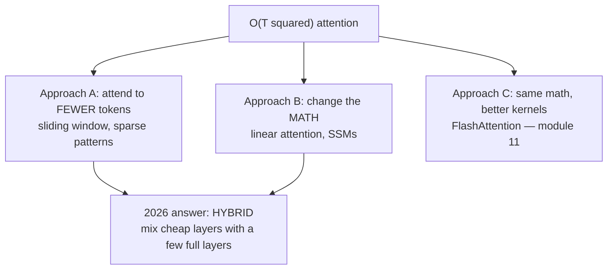
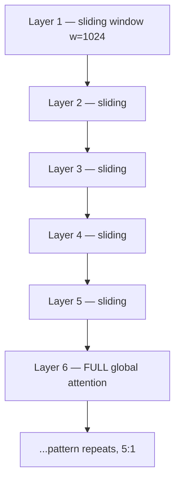
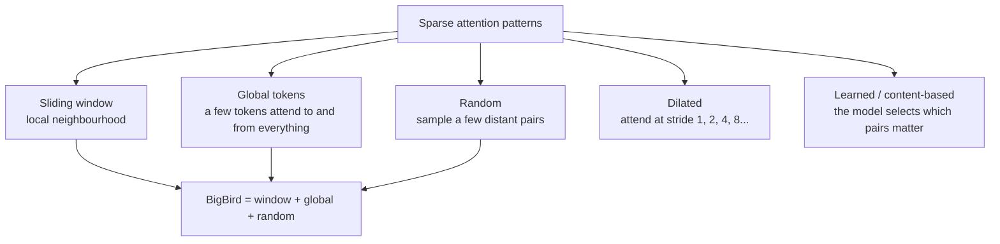
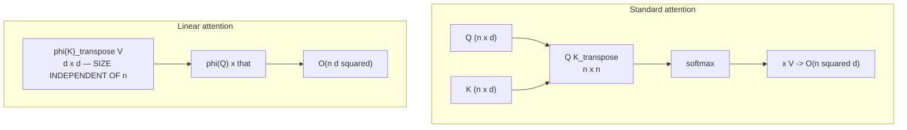
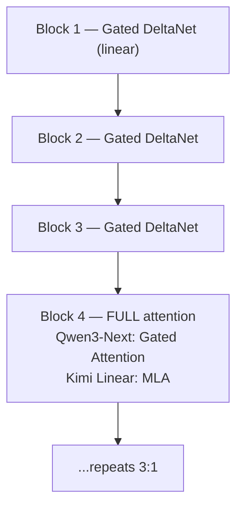
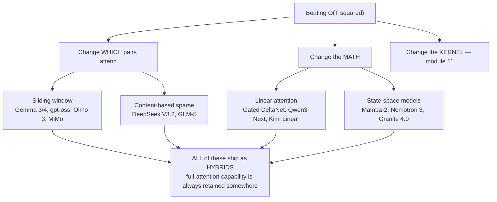

# 10 — Sparse & Long-Context Attention: Sliding Windows, Linear Attention, SSMs

> **Prerequisites:** module 09.
> **You will learn:** how to attack the `O(T²)` cost by changing *which* pairs
> attend, the linear-attention family and its 2025–26 revival, and where
> state-space models (Mamba) fit.

---

## 10.1 The wall

Module 09 shrank the KV cache by constant factors. Two costs survived:

$$\text{compute} = O(T^2 \cdot d) \qquad\qquad \text{cache} = O(T)$$

Raschka states the reason plainly: Q, K, V are `n × d` matrices where `n` is
sequence length, so `QKᵀ` is `n × n`. Double the context and you quadruple the
attention compute.

| Context | Score matrix entries | Relative cost |
|---|---|---|
| 2k | 4M | 1× |
| 32k | 1.07B | 256× |
| 128k | 16.4B | 4,096× |
| 1M | 1T | 250,000× |

Constant factors cannot fix a quadratic. To reach long context you must either
**compute fewer pairs** (this module) or **compute them more cleverly** (module
11).



## 10.2 Sliding window attention

The simplest idea that works: **let each token attend only to a window of nearby
tokens.**

Raschka's framing: if regular self-attention is *global* — every element accesses
every other — sliding window attention is *local*, restricting "the context size
around the current query position."

```
Full causal attention (T=8)          Sliding window, w=3
  x . . . . . . .                      x . . . . . . .
  x x . . . . . .                      x x . . . . . .
  x x x . . . . .                      x x x . . . . .
  x x x x . . . .                      . x x x . . . .
  x x x x x . . .                      . . x x x . . .
  x x x x x x . .                      . . . x x x . .
  x x x x x x x .                      . . . . x x x .
  x x x x x x x x                      . . . . . x x x

  O(T^2) pairs                         O(T * w) pairs — LINEAR in T
```

Cost drops from `O(T²)` to `O(T·w)`. The cache is bounded by `w` rather than `T`:
past a certain point, generating more tokens costs no more memory.

Introduced in **Longformer** (2020), used by **Mistral 7B**, and now standard.

### Why it does not destroy the model

Two reasons. Most linguistic dependencies are local. And **stacking creates an
effective receptive field**: with window `w` and `L` layers, information
propagates up to `w × L` positions — the same argument that makes CNNs work.

```python
def sliding_window_mask(T, window, device=None):
    """True = allowed. Causal AND within `window` positions."""
    i = torch.arange(T, device=device)[:, None]
    j = torch.arange(T, device=device)[None, :]
    return (j <= i) & (j > i - window)
```

### Gemma's hybrid ratio

Raschka's Gemma 3 section is the clearest real-world account.

**Gemma 2** used a **1:1** ratio — sliding window in every other layer — with a
4096-token window.

**Gemma 3** changed both numbers: **5:1** (one full-attention layer per five
sliding-window layers) and the window shrank from 4096 to **1024**. Raschka: "This
shifts the model's focus towards more efficient, localized computations."

The full-attention layers are what preserve genuine long-range capability. Local
layers do the bulk of the work cheaply; a few global layers move information
across the whole sequence.



The savings are substantial. For a Gemma-3-27B-shaped model at 32k context, an
all-global cache of ~15.5 GB drops to ~3.0 GB under the 5:1 hybrid — **5.2×
smaller**.

And the quality cost? Raschka reports Gemma 3's ablation shows sliding window
attention "has minimal impact on modeling performance" — "little to no impact on
the LLM-generated output perplexity."

### Who uses it, and how aggressively

| Model | Ratio (local:global) | Window |
|---|---|---|
| Gemma 2 | 1:1 | 4096 |
| Gemma 3 | 5:1 | 1024 |
| Gemma 4 | 5:1 | — |
| gpt-oss | 1:1 (every other layer) | — |
| Olmo 3 7B | 3:1 | 4096 |
| Xiaomi MiMo-V2-Flash | 5:1 | **128** |
| Arcee Trinity Large | 3:1 | 4096 |

Raschka flags Xiaomi MiMo-V2-Flash as notable: a 128-token window, "8 times
smaller than Gemma 3," on a 309B model — "the largest sliding window attention
model to date."

### The counterexample worth knowing

**Mistral Small 3.1** *abandoned* sliding window attention — the config file says
`"sliding_window": null`. Raschka's speculation is instructive:

> Since Mistral uses regular Grouped-Query Attention instead of Grouped-Query
> Attention with a sliding window as in Gemma 3, maybe there are additional
> inference compute savings due to being able to use more optimized code (i.e.,
> FlashAttention)... while sliding window attention reduces memory usage, it
> doesn't necessarily reduce inference latency.

The lesson generalises: **an algorithmically cheaper method can be slower in
practice if it breaks the fast kernel path.** MiniMax-M2 similarly has a
sliding-window setting that is disabled by default.

## 10.3 Other sparse patterns

Sliding windows are one sparsity pattern among several.



| Pattern | Idea | Used by |
|---|---|---|
| Sliding window | local neighbourhood | Longformer, Mistral, Gemma |
| Global tokens | designated tokens attend everywhere | Longformer, BigBird |
| Random | sample distant pairs | BigBird |
| Dilated | exponentially increasing strides | LongNet |
| **Learned/content-based** | model picks the pairs | **DeepSeek V3.2, GLM-5** |

The 2025–26 direction is the last one. **DeepSeek Sparse Attention** (V3.2)
selects which key-value pairs to attend to based on content rather than a fixed
geometric pattern. Raschka describes V3.2 as "overall similar to DeepSeek V3 but
they added a sparse attention mechanism to improve efficiency," and **GLM-5**
(Feb 2026) "adopts DeepSeek's multi-head latent attention (MLA) as well as
DeepSeek Sparse Attention... to reduce the inference cost when working with long
contexts."

### Attention sinks

A small but important discovery: models attend heavily to the **first few
tokens** regardless of content. These are "attention sinks" — a place to dump
probability mass when a head has nothing useful to attend to (softmax must sum to
1 somewhere).

Consequence: naively evicting early tokens from the cache destroys quality.
StreamingLLM keeps the first few tokens permanently.

Raschka finds explicit `sinks` parameters in **gpt-oss**: "attention sinks are
special 'always-attended' tokens placed at the start of the sequence to stabilize
attention." **Arcee Trinity Large** attacks the phenomenon from the other side —
its elementwise attention gating "reduces attention sinks and improves
long-sequence generalization."

## 10.4 Linear attention

A more radical option: change the mathematics so the `n × n` matrix never exists.

### The trick

Standard attention:

$$\text{Attention}(Q,K,V) = \operatorname{softmax}\!\left(\frac{QK^\top}{\sqrt d}\right)V$$

The softmax is what forces you to materialise `QKᵀ` — you cannot reassociate
across a nonlinearity. Replace it with a kernel feature map `φ` and the
associativity is restored:

$$\operatorname{softmax}\!\left(\frac{QK^\top}{\sqrt d}\right)V \;\approx\; \phi(Q)\big(\phi(K)^\top V\big)$$

Raschka's *Transformers are RNNs* (2020) reference uses `φ(x) = elu(x) + 1`.

Look at the bracketing. On the left you compute `(n×n)` then multiply by `V`. On
the right you compute `φ(K)ᵀV` first — a `(d×d)` matrix, **independent of `n`** —
then multiply by `φ(Q)`.

```
standard:   (Q K^T) V     ->  n x n  intermediate   ->  O(n^2 d)
linear:     Q (K^T V)     ->  d x d  intermediate   ->  O(n d^2)
```

`O(n²)` becomes `O(n)`. And because `KᵀV` is a fixed-size running state, decoding
becomes **cache-free** — you keep a `d × d` state instead of a growing cache. That
is why the 2020 paper is titled *Transformers are RNNs*.



### Why it failed for five years

Raschka is direct: these variants "never really gained traction as they degraded
the model accuracy, and I have never really seen one of these variants applied in
an open-weight state-of-the-art LLM."

The reason is capacity. A fixed `d × d` state cannot store arbitrary detail about
an arbitrarily long sequence. Full attention keeps *every* token exactly; linear
attention keeps a lossy summary. For precise recall — "what was the variable name
on line 400?" — that loss is fatal.

## 10.5 The 2025–26 linear attention revival

Then it came back, and the story has a genuine plot twist.

### The timeline

| When | Model | What |
|---|---|---|
| Jun 2025 | **MiniMax-M1** (456B) | "lightning attention", a linear variant |
| Sep 2025 | **Qwen3-Next** (80B-A3B) | Gated DeltaNet + Gated Attention, 3:1 |
| Sep 2025 | **DeepSeek V3.2** | sparse attention |
| Oct 2025 | **Kimi Linear** (48B) | Kimi Delta Attention + MLA, 3:1 |
| Oct 2025 | **MiniMax-M2** | **went back to full attention** |

### The plot twist

MiniMax released M1 *with* linear attention, then released M2 **without** it.
Raschka relays the team's reasoning:

> The team stated that linear attention is tricky in production LLMs. It seemed
> to work fine with regular prompts, but it had poor accuracy in reasoning and
> multi-turn tasks, which are not only important for regular chat sessions but
> also agentic applications.

This is the most useful data point in the module. Linear attention's weakness is
exactly where 2026 workloads live: long multi-turn agentic sessions requiring
precise recall.

Raschka: "This could have been a turning point where linear attention may not be
worth pursuing after all. However, it gets more interesting" — because Kimi
Linear shipped in October and performed well.

### Gated DeltaNet

The mechanism behind Qwen3-Next and Kimi Linear. Raschka's description:

> In the DeltaNet block, q, k, v and two gates (α, β) are produced by linear and
> lightweight convolutional layers with normalization, and the layer replaces
> attention with a fast-weight delta rule update.

Conceptually: maintain a small **fast-weight memory** updated by a delta rule,
gated by `α` (how much to decay old memory) and `β` (how much to write new
information). Read it with `q`.

The relationship to Mamba, in his words: "Mamba keeps a state with a learned
state-space filter (essentially a dynamic convolution over time). DeltaNet keeps a
tiny fast-weight memory updated with α and β and reads it with q." Gated DeltaNet
is "a DeltaNet with Mamba-style gating."

The tradeoff: "DeltaNet offers less precise content-based retrieval than full
attention, **which is why one gated attention layer remains**."

### The 3:1 hybrid

Both Qwen3-Next and Kimi Linear use the same structure: **three linear-attention
blocks, then one full-attention block.**



Same shape as Gemma's 5:1 sliding-window hybrid: **cheap layers do the bulk, a
few expensive layers preserve exact retrieval.**

This is the dominant 2026 pattern. Nobody replaces all attention.

### Gated Attention (Qwen3-Next's full layers)

Not plain GQA. Raschka lists three modifications, all stability-oriented:

- an **output gate** (sigmoid, usually per-channel) scaling the attention result
  before the residual add
- **zero-centered RMSNorm** for QK-Norm instead of standard RMSNorm
- **partial RoPE** (module 05)

"Note that these are essentially just stability changes to GQA."

### Kimi Delta Attention

Kimi Linear's refinement of Gated DeltaNet, in two changes:

1. **Channel-wise gating.** Where Qwen3-Next "applies a scalar gate (one value
   per attention head) to control the memory decay rate, Kimi Linear replaces it
   with a channel-wise gating for each feature dimension" — finer control over
   memory, better long-context reasoning.
2. **MLA for the full layers**, replacing Qwen3-Next's gated attention, with an
   additional gate.

Kimi Linear also uses **NoPE** in the MLA layers, letting MLA "run as pure
multi-query attention at inference" and avoiding RoPE retuning for long context.

Results, per Raschka: Kimi Linear "achieves higher modeling accuracy while
maintaining the same token-generation speed" as Gated DeltaNet-H1, and is "much
faster than an architecture with multi-head latent attention... while having a
higher benchmark performance."

The caveat he attaches matters: Kimi Linear is 48B, "20x smaller than Kimi K2." It
is unproven at frontier scale.

## 10.6 State-space models and Mamba

A parallel lineage that arrives at similar computational properties from control
theory rather than from attention.

An SSM maintains a hidden state evolving by a learned linear recurrence:

```
h_t = A h_{t-1} + B x_t
y_t = C h_t
```

Linear in sequence length, constant memory, and (because the recurrence is
linear) parallelisable over the sequence during training via a scan. **Mamba**
(2023) made `A`, `B`, `C` input-dependent — "selective" — which gave it the
content-awareness earlier SSMs lacked. **Mamba-2** refined the formulation.

The core tradeoff is the same as linear attention:

| | Attention | SSM / Mamba |
|---|---|---|
| State | grows with `T` (the KV cache) | **fixed size** |
| Compute | `O(T²)` | `O(T)` |
| Exact recall of any token | **yes** | lossy |
| Parallel training | yes | yes (scan) |

### Where SSMs actually ship

**NVIDIA Nemotron 3 Nano (30B-A3B)** is the most committed example Raschka
covers: "a 52-layer hybrid Mamba-Transformer model that interleaves Mamba-2
sequence-modeling blocks with sparse Mixture-of-Experts (MoE) feed-forward
layers, and uses self-attention **only in a small subset of layers**." Organised
as 13 macro blocks of Mamba-2 → MoE, plus a few GQA layers.

He notes it has "really good performance compared to pure transformer
architectures of similar size, while achieving much higher tokens-per-second
throughput," and calls it "even more extreme than Qwen3-Next and Kimi-Linear in
its use of only a few attention layers" — while flagging the open question: "one
of the strengths of the transformer architecture is its performance at a (really)
large scale."

Others: **IBM Granite 4.0**, **NVIDIA Nemotron Nano 2**.

### A taxonomy note

Raschka draws a distinction worth borrowing:

> I see these other transformer-SSM hybrids as SSMs with transformer components,
> whereas I see the models discussed here (Qwen3-Next and Kimi Linear) as
> transformers with SSM components.

Nemotron sits on the SSM side; Qwen3-Next and Kimi Linear on the transformer
side. The line is blurry, and he says an argument could be made for one category.

## 10.7 The landscape



| Method | Compute | State | Exact recall | 2026 status |
|---|---|---|---|---|
| Full attention | `O(T²)` | `O(T)` | yes | still the quality baseline |
| Sliding window | `O(T·w)` | `O(w)` | within window | **widely shipped** |
| Sparse (content) | `O(T·k)` | `O(T)` | selected pairs | DeepSeek V3.2, GLM-5 |
| Linear / DeltaNet | `O(T)` | `O(1)` | lossy | shipping, contested |
| SSM / Mamba | `O(T)` | `O(1)` | lossy | shipping in hybrids |

**The single most important takeaway: nobody removes full attention entirely.**
Every production long-context model keeps some full-attention layers — 1 in 6
(Gemma), 1 in 4 (Qwen3-Next, Kimi Linear, Olmo 3), or a handful (Nemotron). Exact
retrieval is worth paying for somewhere.

---

## Reconciling the sources

**Not in the playlist.** Videos 71–84 predate every technique here. The playlist
does establish the foundation — the `(T, T)` score matrix and why it exists —
which is what makes these approximations legible as approximations.

**Terminology tangle.** "Linear attention" covers a family: lightning attention
(MiniMax-M1), Gated DeltaNet (Qwen3-Next), Kimi Delta Attention (Kimi Linear),
Mamba-2 (Nemotron). Raschka groups them by the property that matters — fixed-size
state, linear time — while noting the mechanisms differ. "Sparse attention" is
similarly overloaded: fixed geometric patterns (Longformer) versus learned
content-based selection (DeepSeek V3.2) are quite different things under one
name.

**Contested territory.** Unlike modules 03–08, this is unsettled. MiniMax shipped
linear attention, retracted it, and published why; Kimi shipped it and reported
success. Raschka reports both without adjudicating, and so does this module. Treat
confident claims here with suspicion.

---

## Key takeaways

- Attention is `O(T²)`. From 2k to 128k context is a 4,096× increase in score
  matrix entries. Constant-factor fixes cannot cover that.
- **Sliding window attention** restricts each token to a local window: `O(T·w)`
  compute, `O(w)` cache. Stacking layers gives an effective receptive field of
  `w × L`.
- Gemma 3 uses **5:1** local:global with a 1024 window (down from Gemma 2's 1:1
  and 4096). ~5× cache reduction with "little to no impact" on perplexity.
- Mistral Small 3.1 *abandoned* sliding windows — likely because breaking the
  FlashAttention fast path costs more latency than the pattern saves.
- **Attention sinks** — heavy attention to the first tokens — mean naive cache
  eviction breaks models. gpt-oss has explicit sink parameters.
- **Linear attention** reassociates `Q(KᵀV)` instead of `(QKᵀ)V`, giving `O(T)`
  compute and a fixed-size state. The cost is lossy recall.
- Linear attention failed for five years, revived in 2025, and remains contested:
  MiniMax shipped it in M1 and **removed it in M2** citing poor reasoning and
  multi-turn accuracy; Kimi Linear shipped it successfully at 48B.
- **Gated DeltaNet** (Qwen3-Next) and **Kimi Delta Attention** (channel-wise
  gating) are the current linear variants, both in **3:1** hybrids with full
  attention.
- **SSMs / Mamba-2** reach the same properties from control theory. Nemotron 3
  Nano interleaves Mamba-2 with MoE and uses attention in only a few layers.
- **Every production long-context model is a hybrid.** Cheap layers for bulk
  processing, a few full-attention layers for exact retrieval.

## Self-check

1. A model has 32k context and a 1024-token sliding window in 5 of every 6
   layers. Explain how information from token 0 can still reach token 30,000, and
   identify which layers do that work.
2. Linear attention computes `φ(Q)(φ(K)ᵀV)` instead of `softmax(QKᵀ)V`. Show why
   the reassociation removes the `n × n` matrix, and name the property of softmax
   that blocks the same trick in standard attention.
3. MiniMax shipped linear attention in M1 and removed it in M2. What specific
   workload characteristic drove that decision, and why does the 3:1 hybrid used
   by Qwen3-Next partly address it?

---

**Next → [11 — Hardware-Aware Attention](./11-hardware-aware-attention.md)**
