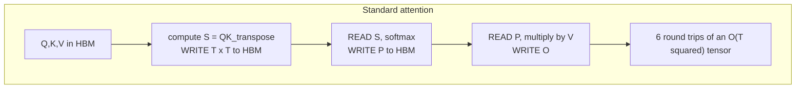
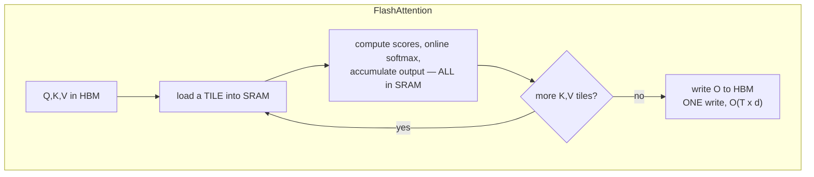
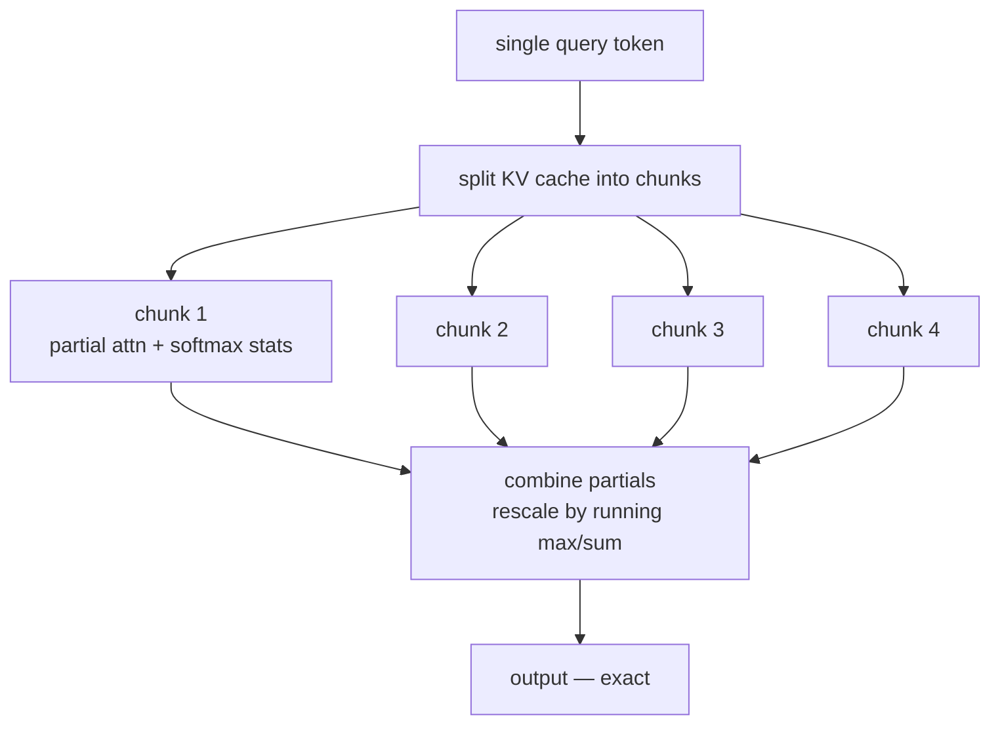
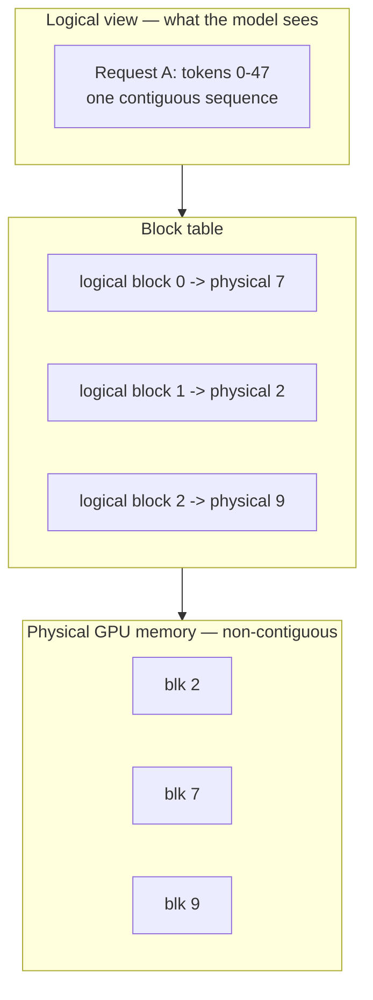
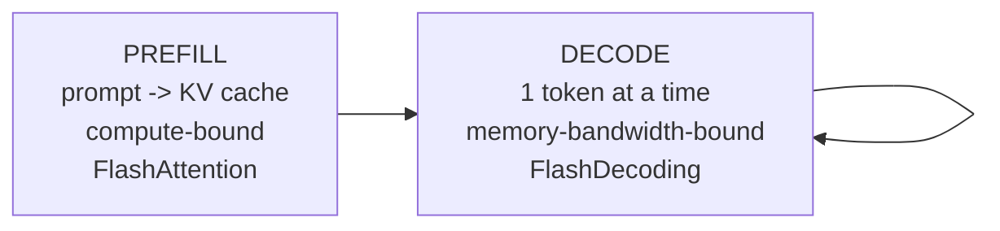

# 11 — Hardware-Aware Attention: FlashAttention, PagedAttention, KV Cache Management

> **Prerequisites:** modules 09–10.
> **You will learn:** why attention is memory-bound rather than compute-bound,
> how FlashAttention makes it exact *and* fast, and how vLLM's PagedAttention
> solved KV cache fragmentation.

Module 10 changed *which* pairs attend. This module changes **nothing about the
mathematics** — the outputs are bit-comparable — and still delivers order-of-
magnitude wins, by respecting how GPUs actually work.

---

## 11.1 The memory hierarchy is the whole story

A GPU is not one kind of memory. On an A100:

| Level | Size | Bandwidth |
|---|---|---|
| SRAM (on-chip, per SM) | ~20 MB total | ~19 TB/s |
| HBM (device memory) | 40–80 GB | ~1.5–2.0 TB/s |
| CPU DRAM | ~1 TB | ~64 GB/s |

SRAM is roughly **10× faster** than HBM and thousands of times smaller. Compute
throughput has grown far faster than memory bandwidth for a decade, so most
kernels are now **memory-bound**: the arithmetic units idle while data moves.

### Standard attention is a bandwidth disaster

Look at what a naive implementation writes to and reads from HBM:

```python
S = Q @ K.T           # write S   (T, T)  to HBM
S = S / sqrt(d)       # read S, write S
S = S + mask          # read S, write S
P = softmax(S)        # read S, write P   (T, T)
P = dropout(P)        # read P, write P
O = P @ V             # read P, write O
```

The `(T, T)` matrix crosses the HBM boundary **six times**. At `T = 4096` with 32
heads in bf16 that is ~1 GB per crossing, per layer.



The FLOPs are unavoidable. **The memory traffic is not.**

## 11.2 FlashAttention

*(Dao et al., 2022)*

The insight: **never materialise the `(T, T)` matrix in HBM at all.** Tile the
computation, keep tiles in SRAM, and fuse every step into one kernel.

### Tiling

Split Q, K, V into blocks that fit in SRAM. For each Q block, loop over K/V
blocks, accumulating the output incrementally:

```
for each block of Q (size B_r):
    load Q_i into SRAM
    initialize output accumulator O_i, running max m_i, running sum l_i
    for each block of K, V (size B_c):
        load K_j, V_j into SRAM
        S_ij = Q_i @ K_j.T                 # small, stays in SRAM
        update m_i, l_i, O_i               # online softmax
    write O_i to HBM                       # ONE write, size (B_r, d)
```

Only `O(T·d)` is written — the output — instead of `O(T²)`.

### Online softmax

The subtle part. Softmax needs a max and a sum over the **whole row** for
numerical stability, but we only ever see one block at a time.

The fix is a running update. Having processed blocks up to `j` with running max
`m` and sum `l`, a new block with max `m'` gives:

$$m^{new} = \max(m, m')$$
$$l^{new} = e^{m - m^{new}} l + e^{m' - m^{new}} l'$$
$$O^{new} = e^{m - m^{new}} O + e^{m' - m^{new}} O'$$

Each time the max grows, previously accumulated values are rescaled by
`exp(m_old − m_new)`. The result is **numerically identical** to computing softmax
over the full row.



### This is exact

Worth emphasising, because it is unusual. FlashAttention is **not an
approximation.** Unlike everything in module 10, it produces the same numbers as
the naive implementation (up to floating-point associativity). There is no
quality trade-off. It is a strictly better implementation of the same function.

### Recomputation in the backward pass

Backprop normally needs the stored `(T, T)` attention matrix. FlashAttention
stores only the softmax statistics (`m`, `l`) and **recomputes** scores on the
fly during the backward pass.

That is more FLOPs and *still faster*, because the operation is memory-bound.
This is the clearest demonstration of the module's thesis.

### Results

| | Memory | Speedup vs naive |
|---|---|---|
| FlashAttention-1 (2022) | `O(T)` instead of `O(T²)` | 2–4× |
| FlashAttention-2 (2023) | same | ~2× over FA-1 |
| FlashAttention-3 (2024) | same | 1.5–2× over FA-2 on H100 |

**FA-2** improved work partitioning: fewer non-matmul FLOPs, better parallelism
across sequence length, better warp scheduling. Reached ~70% of peak on A100.

**FA-3** targets Hopper specifically: asynchronous execution with the Tensor
Memory Accelerator, overlapping GEMM and softmax, and **FP8 support**. ~75% of
peak on H100.

### Using it

You almost never write this yourself:

```python
import torch.nn.functional as F

# dispatches to FlashAttention when shapes/dtype/hardware allow
out = F.scaled_dot_product_attention(Q, K, V, is_causal=True)
```

Conditions for the fast path: half precision (fp16/bf16), head dim ≤ 256,
supported GPU, and no arbitrary dense `attn_mask` (use `is_causal=True` instead —
passing an explicit mask usually falls back to the slow path). This is why
Mistral dropped sliding windows in module 10: an unusual pattern can knock you
off the fast kernel.

## 11.3 FlashDecoding

FlashAttention optimises **training and prefill**, where `T` is large and there
is plenty of parallel work.

**Decoding is different.** Generating one token means `T_q = 1` — a single query
against the whole cache. FlashAttention parallelises over query blocks, and with
one query there is nothing to parallelise. Most of the GPU sits idle.

**FlashDecoding** (2023) parallelises over the **key/value** dimension instead:
split the cache into chunks, attend to each chunk independently, then combine
using the same online-softmax rescaling.



Up to **8× faster** decoding at long context. Also exact.

**FlashDecoding++** adds a unified max value across partitions to avoid
synchronisation, plus asynchronous softmax.

## 11.4 FlashInfer

*(2024–25)*

A library rather than a single kernel — the recognition that serving needs *many*
attention variants, and hand-writing each is unsustainable.

FlashInfer provides:

- **Block-sparse and composable formats.** KV cache stored as a block-sparse
  matrix, so paged layouts, sliding windows, and shared prefixes are all
  expressed in one framework.
- **JIT compilation.** Kernels generated per attention variant (GQA vs MLA, with
  or without sinks, custom masks) rather than written by hand.
- **Load-balanced scheduling.** Handles ragged batches — requests with wildly
  different context lengths — without wasting warps.
- **CUDAGraph compatibility**, cutting launch overhead for small decode kernels.

It is now the kernel backend for vLLM, SGLang, and others. The trend it
represents: attention kernels have become a *compiler* problem.

## 11.5 KV cache management and PagedAttention

Module 09 sized the cache. This section is about *allocating* it, which turns out
to be where most memory was being wasted.

### The fragmentation problem

Pre-vLLM systems allocated one **contiguous** buffer per request, sized to the
maximum possible length:

```
Request A: max_len 2048, actually uses 300   -> 1748 slots wasted
Request B: max_len 2048, actually uses 1900  ->  148 slots wasted
Request C: max_len 2048, actually uses  50   -> 1998 slots wasted
```

Three sources of waste:

| Type | Cause |
|---|---|
| **Internal fragmentation** | reserved-but-unused slots inside a request's buffer |
| **External fragmentation** | gaps between buffers too small to reuse |
| **Over-reservation** | you must reserve for the worst case up front |

The vLLM paper measured real systems using **20–40%** of KV cache memory for
actual tokens. The rest was waste.

### PagedAttention

*(Kwon et al., SOSP 2023)*

Apply the idea operating systems have used since the 1960s: **virtual memory with
paging.**

Split the cache into fixed-size **blocks** (typically 16 tokens). A request gets
a **block table** mapping its logical positions to arbitrary physical blocks.
Blocks need not be contiguous.



What this buys:

- **Near-zero waste.** Blocks are allocated on demand as generation proceeds.
  Internal fragmentation is capped at one block (≤16 tokens) per request.
- **No external fragmentation.** All blocks are the same size, so any free block
  fits any request.
- **Copy-on-write sharing.** Requests with a common prefix — a shared system
  prompt, or `n` parallel samples from one prompt — **share physical blocks**.
  Only on divergence is a block copied.

Reported result: **2–4× higher throughput** at the same latency, coming almost
entirely from fitting more concurrent requests in the same memory.

### Prefix caching

Shared blocks generalise into a major production optimisation. If many requests
begin with the same long system prompt, its KV blocks are computed **once** and
reused — the prefill for that prefix is skipped entirely.

For agentic workloads, where a large tool-definition preamble is resent on every
turn, this is often the single biggest win available.

### Cache eviction

When memory runs out, something must go:

| Strategy | Behaviour |
|---|---|
| **Preemption + recompute** | evict a request's blocks; recompute on reschedule |
| **Swap to CPU** | move blocks to host memory, page back later |
| **H2O / heavy-hitter** | keep only high-attention tokens (lossy) |
| **StreamingLLM** | keep the first few tokens (attention sinks) + a recent window |

The first two are exact; the last two trade quality for capacity. StreamingLLM
exists specifically because of the attention-sink phenomenon from module 10 —
dropping the *first* tokens is catastrophic even though they are oldest.

## 11.6 Continuous batching

The scheduling counterpart to PagedAttention, and part of the same system.

**Static batching** groups requests and runs them to completion together. Because
outputs have different lengths, short requests sit finished-but-blocked while the
longest one runs. GPU utilisation collapses.

```
static:      [A....][B..........][C...]     all wait for B
             |------ blocked -----|

continuous:  A finishes -> D starts immediately in that slot
```

**Continuous batching** (a.k.a. in-flight batching) schedules at the level of
**individual decode steps**. When a request emits `[EOS]`, its slot is freed and a
queued request takes it on the very next step.

This only works if request slots are independently allocatable — which is exactly
what PagedAttention provides. The two were designed together.

Combined reported gains: up to **23×** throughput over naive static batching with
contiguous allocation.

More in module 14, where it sits alongside quantization and speculative decoding.

## 11.7 Prefill vs decode

A framing that explains most serving-system design.

| | **Prefill** | **Decode** |
|---|---|---|
| Processes | the whole prompt at once | one token |
| Query length | `T_prompt` | 1 |
| Bottleneck | **compute** (big matmuls) | **memory bandwidth** |
| Parallelism | abundant | scarce |
| Best kernel | FlashAttention | FlashDecoding |
| Arithmetic intensity | high | very low |



Because the two phases have opposite bottlenecks, running them on the same GPU
means one always underuses the hardware. Hence **chunked prefill** (interleave
prompt chunks with decode steps to keep both units busy) and **disaggregated
serving** (separate GPU pools for each phase, shipping the cache between them).

Understanding that decode is memory-bandwidth-bound explains almost everything
else in this course:

- why GQA/MLA help *speed*, not just capacity (module 09) — fewer bytes read
- why FlashAttention's extra recomputation is free (§11.2)
- why quantization speeds up decoding (module 14) — fewer bytes again
- why speculative decoding works (module 14) — it converts memory-bound decode
  steps into compute-bound verification

---

## Reconciling the sources

**Neither source covers this.** The playlist predates FlashAttention. Raschka
explicitly scopes his article to *architecture*, not systems — he mentions
FlashAttention only in passing, speculating that Mistral dropped sliding windows
to stay on its fast path. That remark is the one place the two worlds touch, and
it is instructive: an architectural choice was reversed for kernel reasons.

This module is from the primary literature: FlashAttention (Dao et al. 2022),
FlashAttention-2 (2023), FlashAttention-3 (2024), FlashDecoding (2023),
FlashInfer (2024–25), vLLM/PagedAttention (Kwon et al., SOSP 2023).

**A boundary worth keeping.** Module 10's techniques change the function computed
and trade quality for speed. This module's techniques compute the *same function*
and trade nothing. When someone says "we use FlashAttention," no approximation is
implied. When they say "we use sparse attention," one is.

---

## Key takeaways

- GPU SRAM is ~10× faster than HBM and thousands of times smaller. Attention is
  **memory-bound**, not compute-bound.
- Naive attention moves the `(T, T)` matrix across the HBM boundary six times.
- **FlashAttention** tiles the computation into SRAM, uses an **online softmax**
  with running max/sum rescaling, and never materialises `(T, T)`. Memory drops
  from `O(T²)` to `O(T)`; 2–4× faster.
- FlashAttention is **exact**. Same numbers, no quality trade-off — unlike
  everything in module 10.
- It even **recomputes** scores in the backward pass: more FLOPs, still faster,
  because the bottleneck is bandwidth.
- FA-2 improved partitioning (~70% of A100 peak); FA-3 uses Hopper async and FP8
  (~75% of H100 peak).
- **FlashDecoding** parallelises over the KV dimension because decoding has only
  one query and no query-side parallelism. Up to 8× faster decode.
- **FlashInfer** turns attention kernels into a JIT/compiler problem with
  block-sparse formats, backing vLLM and SGLang.
- Pre-vLLM systems wasted **60–80%** of KV memory to fragmentation and
  over-reservation.
- **PagedAttention** applies OS paging: fixed 16-token blocks, per-request block
  tables, non-contiguous allocation. Near-zero waste, plus copy-on-write **prefix
  sharing**. 2–4× throughput.
- **Continuous batching** schedules per decode step, freeing slots the instant a
  request finishes. Depends on paged allocation.
- **Prefill is compute-bound; decode is memory-bandwidth-bound.** That single
  distinction explains most serving-system design.

## Self-check

1. FlashAttention recomputes attention scores during the backward pass instead of
   storing them — strictly more arithmetic. Explain why it is nevertheless
   faster, and what hardware fact makes that possible.
2. FlashAttention gives little benefit during single-token decoding. Say why, and
   explain what FlashDecoding parallelises over instead.
3. A server runs 50 concurrent requests, each reserving 4096 tokens of contiguous
   cache but averaging 400 tokens. Estimate the waste, then explain how
   PagedAttention with 16-token blocks changes it.

---

**Next → [12 — Mixture of Experts](./12-mixture-of-experts.md)**
