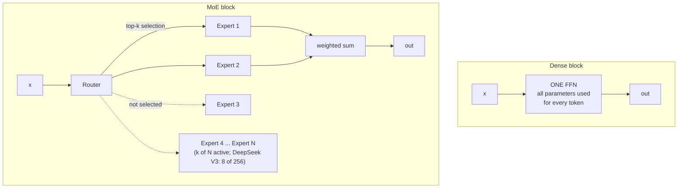
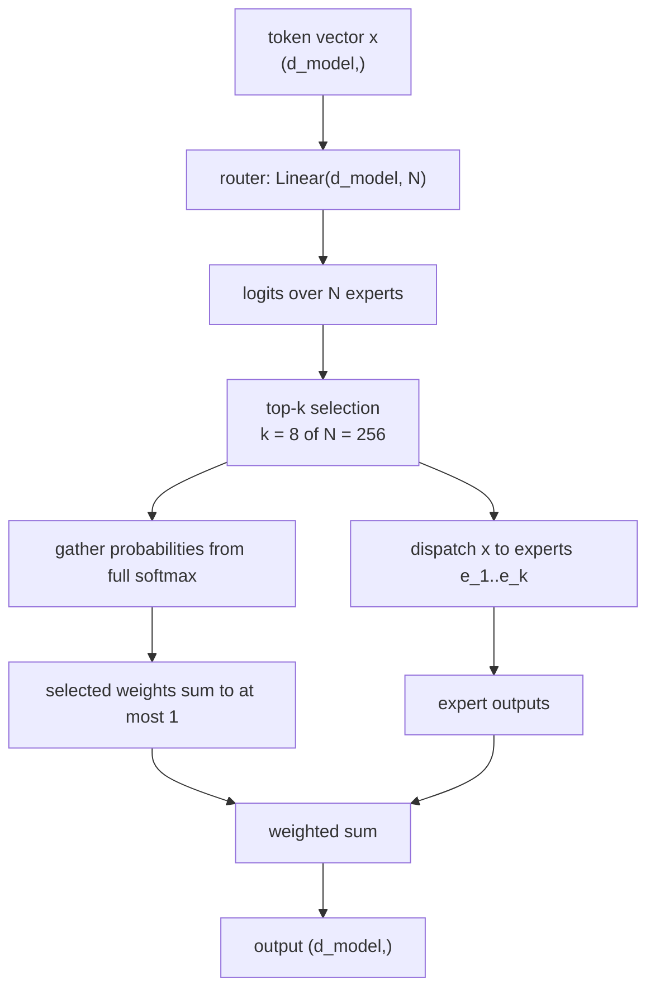
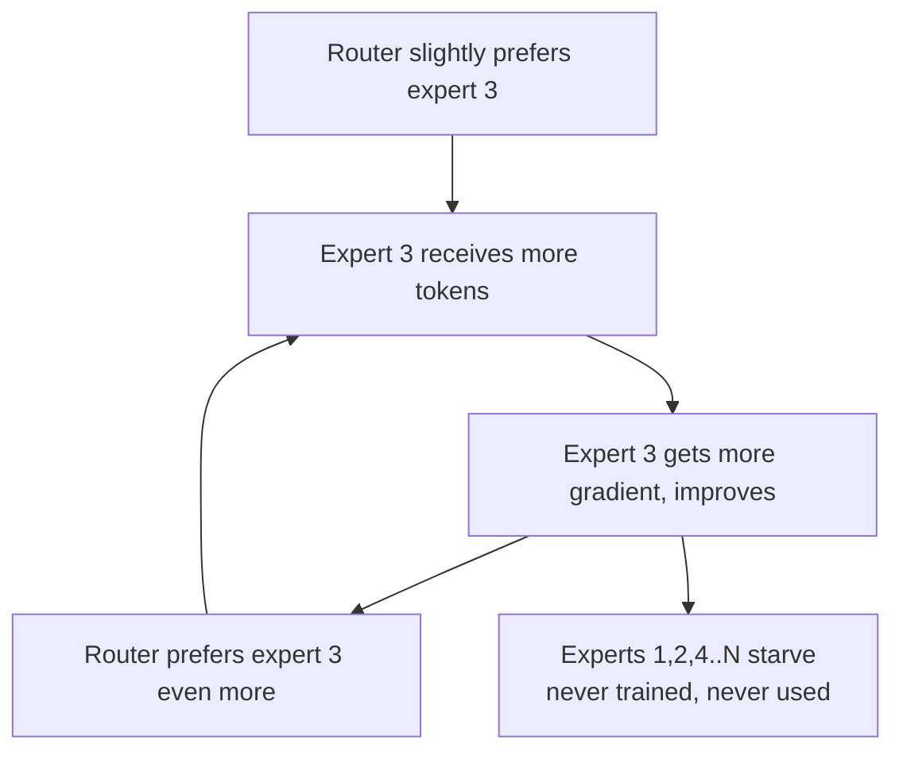
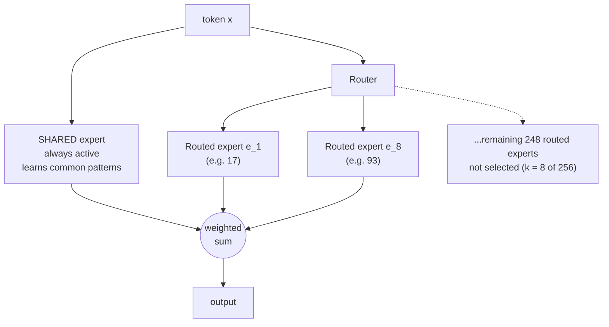
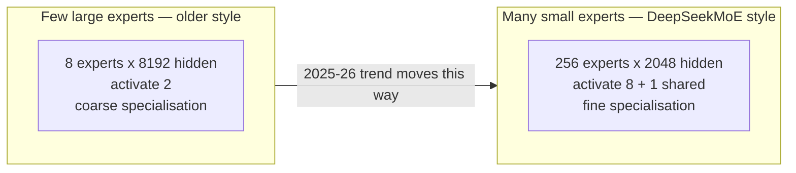

# 12 — Mixture of Experts: Sparse FFNs, Routers, and Shared Experts

> **Prerequisites:** modules 07, 09.
> **You will learn:** how MoE decouples model capacity from inference cost, how
> routers work, why load-balancing loss exists, and the fine-grained /
> shared-expert design that DeepSeek popularised.

---

## 12.1 The idea

Module 07 established that the FFN holds roughly **two-thirds of a Transformer's
parameters**. Module 09 established that inference cost is what limits deployment.

MoE resolves the tension between them. Raschka's statement of the core idea:

> The core idea in MoE is to replace each FeedForward module in a transformer
> block with multiple expert layers, where each of these expert layers is also a
> FeedForward module.

And the crucial part:

> The key trick is that we don't use ("activate") all experts for every token.
> Instead, a router selects only a small subset of experts per token.



**Total parameters** grow with the number of experts. **Active parameters** — the
ones touched per token — stay roughly constant.

> Because only a few experts are active at a time, MoE modules are often referred
> to as *sparse*, in contrast to *dense* modules that always use the full
> parameter set. However, the large total number of parameters via an MoE
> increases the capacity of the LLM, which means it can take up more knowledge
> during training. The sparsity keeps inference efficient.

DeepSeek V3 makes the numbers concrete: **671B total parameters, 37B active per
token**. It carries the knowledge capacity of a 671B model at roughly the
inference cost of a 37B one.

Note carefully: **all 671B parameters still need storage.** High-throughput
deployments generally keep weights resident across accelerators; offloading
trades residency for transfer cost. MoE saves active expert computation, not
total parameter storage. This is why MoE models are deployed on
multi-GPU clusters despite modest active parameter counts.

## 12.2 The router

The router is a single linear layer. That is genuinely all it is.

```python
class Router(nn.Module):
    def __init__(self, d_model, n_experts, top_k):
        super().__init__()
        self.gate = nn.Linear(d_model, n_experts, bias=False)
        self.top_k = top_k

    def forward(self, x):
        # x: (n_tokens, d_model)
        logits = self.gate(x)                              # (n_tokens, n_experts)
        # Full softmax, then selection: task gradients survive even at k=1.
        topk_weights, topk_idx = F.softmax(logits, dim=-1).topk(self.top_k, dim=-1)
        return topk_idx, topk_weights, logits
```

Then dispatch and combine:

```python
class MoELayer(nn.Module):
    def __init__(self, d_model, d_expert, n_experts, top_k, n_shared=0):
        super().__init__()
        self.router  = Router(d_model, n_experts, top_k)
        self.experts = nn.ModuleList(
            [SwiGLU(d_model, d_expert) for _ in range(n_experts)]
        )
        # shared experts run for EVERY token — see 12.4
        self.shared = nn.ModuleList(
            [SwiGLU(d_model, d_expert) for _ in range(n_shared)]
        )

    def forward(self, x):
        B, T, D = x.shape
        x_flat = x.view(-1, D)                             # (B*T, D)
        idx, weights, logits = self.router(x_flat)

        out = torch.zeros_like(x_flat)
        for e, expert in enumerate(self.experts):
            # which (token, slot) pairs chose expert e?
            tok, slot = (idx == e).nonzero(as_tuple=True)
            if tok.numel() == 0:
                continue
            out[tok] += weights[tok, slot, None] * expert(x_flat[tok])

        for expert in self.shared:                         # always-on
            out += expert(x_flat)

        return out.view(B, T, D), logits
```

Two details that matter:

- **This reference normalizes over all `N` experts before selection.** Selected
  weights sum to at most one. Renormalizing only selected logits is another
  valid design for `k>1`, used by some models, but at `k=1` it gives constant
  weight one and zero task-loss gradient to the router. Switch retains the
  selected full-softmax probability; gating conventions are model-specific.
- **Routing is per token, not per sequence.** Every token in a sentence may go to
  a different set of experts. This is why MoE routing is a load-balancing problem
  at all.



### Why top-k and not top-1?

`k = 1` minimizes expert work and can train successfully with the appropriate
gating and balancing recipe. Both top-1 and top-k have discrete selection
boundaries; blending selected experts does not make a changing top-k set smooth.
For fixed selected experts, probability weights are differentiable.

`k = 8` is the current norm (DeepSeek V3, Qwen3). gpt-oss uses `k = 4`; Llama 4
uses one routed expert plus one always-on shared expert, not two routed experts.

## 12.3 Load balancing

The central failure mode of MoE, and the reason most of the machinery exists.

Task loss alone does not explicitly encourage balanced load. A router can
**collapse**: a few experts get chosen for nearly everything, get more gradient,
become better, and get chosen even more. The rest are never selected, never
trained, and become dead weight.



### Auxiliary load-balancing loss

The standard fix (Switch Transformer). Add a term encouraging uniform usage:

$$\mathcal{L}_{aux} = \alpha \cdot N \sum_{i=1}^{N} f_i \cdot P_i$$

| Symbol | Meaning |
|---|---|
| `N` | number of experts |
| `f_i` | **fraction of routing slots** assigned to expert `i`; sums to one |
| `P_i` | **mean router probability** for expert `i` (differentiable) |
| `α` | loss weight, typically 0.01 |

The product is the trick. `f_i` carries the actual imbalance but is not
differentiable; `P_i` is differentiable. Multiplying them gives a gradient that
pushes probability *away* from experts already receiving many tokens. The sum is
discourages persistent concentration. Uniform `f_i=P_i=1/N` gives baseline
`alpha`; this bilinear surrogate is not a proof that uniformity is its unique
global minimum under arbitrary routing distributions.

```python
def load_balancing_loss(logits, top_k_idx, n_experts, alpha=0.01):
    probs = F.softmax(logits, dim=-1)                  # (n_tokens, n_experts)
    P = probs.mean(dim=0)                              # mean prob per expert

    one_hot = F.one_hot(top_k_idx, n_experts).float()  # (n_tokens, k, n_experts)
    f = one_hot.mean(dim=(0, 1))                      # normalize over tokens AND k

    return alpha * n_experts * torch.sum(f * P)
```

`α` is a real trade-off: too small and experts collapse; too large and the router
balances at the expense of routing *well*.

### Capacity factor

A systems constraint, distinct from the loss. For efficient batched execution
each expert gets a fixed-size buffer:

$$\text{capacity} = \text{capacity factor} \times \frac{\text{tokens per batch} \times k}{N}$$

A capacity factor of 1.0 allocates the average routing-slot demand per expert;
it does not force assignments to be uniform. Real distributions are
uneven, so values of **1.25–2.0** are typical.

Assignments arriving at a full expert are **dropped** from that expert. Other
selected/shared experts may still contribute; the residual remains. Higher capacity factor means
fewer drops but more wasted memory and compute on padding.

| Capacity factor | Drop risk under imbalance | Nominal capacity above uniform demand |
|---|---|---|
| 1.0 | high | 0%; imbalance still leaves unused slots |
| 1.25 | lower, workload-dependent | 25% |
| 2.0 | lower still, not guaranteed zero | 100% |

*(Capacity factors apply to training and batched prefill. Newer implementations
increasingly use dropless routing with variable-size grouped GEMMs.)*

### Loss-free balancing

Raschka notes DeepSeek V3 uses a **bias-based** approach instead: a per-expert
bias term added to routing logits and adjusted during training to equalise load,
without routing-task gradients through that bias update. DeepSeek-V3 still adds
a small sequence-wise auxiliary term, so it does not eliminate every auxiliary
loss or coefficient. The [technical report](https://arxiv.org/html/2412.19437v2)
separates these two mechanisms. Arcee Trinity
Large also introduces "a new MoE load-balancing strategy."

## 12.4 Shared experts

A DeepSeek design choice that Raschka highlights repeatedly.

> One notable feature of DeepSeek V3's MoE design is the use of a **shared
> expert**. This is an expert that is always active for every token.

Not new — it appeared in DeepSeek's 2024 MoE paper and the 2022 DeepSpeedMoE
paper.

**Why it helps**, in Raschka's words:

> The benefit of having a shared expert was first noted in the DeepSpeedMoE
> paper, where they found that it boosts overall modeling performance compared to
> no shared experts. This is likely because common or repeated patterns don't
> have to be learned by multiple individual experts, which leaves them with more
> room for learning more specialized patterns.

Without a shared expert, every routed expert must independently learn the generic
transformations *all* tokens need — wasteful duplication. Factoring that out
frees the routed experts to specialise.



### But not everyone agrees

Qwen3 **removed** shared experts, which earlier Qwen2.5-MoE had used. Raschka
pressed on this, and got an answer from Junyang Lin, a Qwen3 developer:

> At that moment we did not find significant enough improvement on shared expert
> and we were worrying about the optimization for inference caused by shared
> expert. No straight answer to this question honestly.

Raschka's own guess was that with 8 routed experts (up from 2 in Qwen2.5-MoE) a
shared expert became unnecessary for stability — while noting this "doesn't
explain why DeepSeek V3 is still keeping their shared expert."

Then **Qwen3-Next** (Sept 2025) **added one back**, alongside 4× more experts —
both changes Raschka had predicted as likely future directions.

Current state of play:

| Uses a shared expert | Does not |
|---|---|
| DeepSeek V3 / R1 / V3.2 | Qwen3 |
| Llama 4 Maverick | |
| Kimi K2 | gpt-oss |
| GLM-4.5, GLM-5 | MiniMax-M2 |
| Qwen3-Next | |
| Nemotron 3 Nano (1 shared + 6 routed) | |
| Grok 2.5 (effectively — an always-on SwiGLU with doubled width) | |

Genuinely contested. Raschka's own position: "in my opinion, shared experts are
useful because they reduce redundancy among the other experts."

## 12.5 Fine-grained experts: many small vs few large

The other major design axis.

The **DeepSeekMoE** paper argues for **more, smaller** experts at constant total
parameters. Splitting each expert into `m` smaller ones and activating `m` times
as many gives the same FLOPs but far more routing combinations — `C(256,8)` is
astronomically larger than `C(16,2)` — so specialisation can be much finer.



### The 2026 configuration table

| Model | Total | Active | Experts | Active experts | Expert hidden | Shared |
|---|---|---|---|---|---|---|
| DeepSeek V3 | 671B | 37B | 256 | 8 + 1 shared | 2048 | **yes** |
| Llama 4 Maverick | 400B | 17B | 128 routed | **1 routed + 1 shared** | **8192** | yes |
| Qwen3 235B-A22B | 235B | 22B | 128 | 8 | 1536 | no |
| Qwen3-Next | 80B | 3B | 512 | 10 + 1 shared | — | **yes** |
| gpt-oss-20b | 21B | 3.6B | **32** | **4** | 2880 | no |
| gpt-oss-120b | 117B | 5.1B | 128 | 4 | 2880 | no |
| Kimi K2 | **1T** | 32B | 384 | 8 + 1 shared | — | **yes** |
| GLM-4.5 | 355B | 32B | 160 | 8 | 1536 | **yes** |
| GLM-5 | 744B | 40B | 256 | — | 2048 | **yes** |
| MiniMax-M2 | 230B | 10B | 256 | — | — | no |
| Mistral 3 Large | 675B | 41B | 128 | — | 2× DeepSeek's | **yes** |
| Nemotron 3 Nano | 30B | 3B | 128 | 6 + 1 shared | — | **yes** |
| Trinity Large | 400B | 13B | many small | — | — | — |

Several stories are visible in that table.

**Llama 4 versus DeepSeek V3.** Raschka: "Llama 4 Maverick uses a more classic
MoE setup with fewer but larger experts (2 active experts with 8,192 hidden size
each) compared to DeepSeek V3 (9 active experts with 2,048 hidden size each)."
Also: DeepSeek uses MoE in every block except the first three; **Llama 4
alternates MoE and dense blocks.**

**gpt-oss is the counter-trend.** "gpt-oss has a surprisingly small number of
experts (32 instead of 128), and only uses 4 instead of 8 active experts per
token. However, each expert is much larger... This is interesting because the
recent trends and developments point towards more, smaller models as being
beneficial."

**Grok 2.5 is deliberately old-fashioned.** Eight large experts, "which reflects
an older trend" — a rare look at a real production system from a year earlier.

**Sparsity is increasing.** MiniMax-M2 activates **4.37%** of parameters per token
versus Qwen3 235B-A22B's **9.36%** — "twice as sparse as Qwen3" at comparable
total size.

**And sometimes it goes the other way.** Mistral 3 Large adopted DeepSeek V3's
architecture exactly, but "increased the size of the experts by a factor of 2
while decreasing the number of experts by the same factor." Trinity Large also
made its DeepSeek-style MoE "coarser as that helps with inference throughput."
Finer experts are better for quality; coarser ones are better for throughput.

## 12.6 Dense layers first

A structural detail with a clear rationale.

DeepSeek V3 uses MoE in every transformer block **except the first three**. GLM-4.5
adopted the same choice. Raschka explains:

> Starting with several dense layers improves convergence stability and overall
> performance in large MoE systems. If MoE routing is introduced immediately, the
> instability of sparse expert selection can interfere with early syntactic and
> semantic feature extraction. So, one might say that keeping the initial layers
> dense ensures the model forms stable low-level representations before routing
> decisions begin to shape higher-level processing.

Early layers do generic, universal work — there is nothing to specialise on yet,
and routing on unstable representations produces unstable routing.

## 12.7 Dense and MoE variants of the same model

Qwen3 ships both: seven dense models (0.6B → 32B) and two MoE models (30B-A3B,
235B-A22B). Raschka explains why:

> Dense models are typically more straightforward to fine-tune, deploy, and
> optimize across various hardware. On the other hand, MoE models are optimized
> for scaling inference. For instance, at a fixed inference budget, they can
> achieve a higher overall model capacity... without proportionally increasing
> inference costs.

Gemma 4 does the same — a 31B dense variant and a 26B-A4B MoE variant, with
"relatively similar" benchmark performance.

| | Dense | MoE |
|---|---|---|
| Fine-tuning | straightforward | harder (routing must adapt) |
| Deployment | any hardware | needs memory for **all** experts |
| Inference cost at fixed quality | higher | lower |
| Capacity at fixed inference cost | lower | **higher** |

## 12.8 Latent experts

The newest variant, from **Nemotron 3 Super** (March 2026). Experts operate in a
*compressed* space: MoE inputs are "down-projected from 4096 to 1024 dimensions,
the experts are applied, and then the outputs are up-projected back from 1024 to
4096."

Structurally this is MLA's trick (module 09) applied to the FFN rather than to
attention: do the expensive work in a lower-dimensional latent space. Combined
with MTP and Mamba-2 hybrid attention, Raschka reports Nemotron 3 Super hits "2x
faster than Qwen3.5 122B-A10B" throughput at comparable quality.

---

## Reconciling the sources

**Not in the playlist at all.** MoE postdates videos 71–84. What the playlist
gives you is module 07 — the FFN's structure and its share of the parameters —
without which MoE looks arbitrary rather than targeted.

**Raschka defers the router.** He is explicit: "In the interest of time, or
rather article space, I'll cover the router in more detail another time." So
§12.2 and §12.3 — top-k mechanics, load-balancing loss, capacity factor — come
from the primary literature (Shazeer et al. 2017; Switch Transformer, Fedus et
al. 2021; DeepSeekMoE 2024). Raschka's contribution here is the *configuration
landscape*: who uses what, and how it changed.

**Open questions.** Shared experts are genuinely unsettled — DeepSeek keeps them,
Qwen3 dropped them, Qwen3-Next brought them back, and the Qwen developer's own
answer was "no straight answer to this question honestly." Expert granularity is
similarly contested: the DeepSeekMoE trend favours many small experts, but
gpt-oss went the other way and Mistral 3 Large and Trinity Large deliberately
coarsened for throughput. Do not treat either as settled.

---

## Worked router gradients, dispatch and loss scaling

For top-1 selected-logit renormalization, `softmax([z_selected])=[1]`, so the
task output loses its differentiable dependence on the router. Top-k indices
are discrete and provide no alternative gradient. A full-softmax selected gate
`p_e=exp(z_e)/sum_j exp(z_j)` instead has derivative
`dp_e/dz_j=p_e*(1[e=j]-p_j)` within a fixed selection region. This is the
important top-1 distinction in [Switch Transformers](https://arxiv.org/abs/2101.03961).

```python transformer-check
import torch
logits = torch.tensor([[2., 0., -1.]], requires_grad=True)
bad = logits.topk(1, dim=-1).values.softmax(-1).sum()
bad_grad, = torch.autograd.grad(bad, logits)
good = logits.softmax(-1).topk(1, dim=-1).values.sum()
good_grad, = torch.autograd.grad(good, logits)
assert bad_grad.count_nonzero() == 0
assert good_grad.abs().sum() > 0
slots = torch.tensor([[0, 1], [1, 2], [2, 0]])
f = torch.nn.functional.one_hot(slots, 3).double().mean((0, 1))
p = torch.full((3,), 1 / 3, dtype=torch.float64)
torch.testing.assert_close(f.sum(), torch.tensor(1., dtype=torch.float64))
torch.testing.assert_close(3 * (f * p).sum(), torch.tensor(1., dtype=torch.float64))
print("Top-1 gradient and routing-slot normalization verified.")
```

With token A routed to experts `(0,1)` and B to `(1,2)`, expert 1's dispatch
buffer contains both A and B. Combining must scatter outputs back by **token
and slot**, not concatenate them in expert order. If one slot overflows capacity,
the token may still receive other routed/shared outputs plus its residual;
"residual only" applies when every expert contribution is dropped. Dropless
grouped GEMMs avoid fixed-buffer dropping but do not eliminate communication.

An expert-parallel layer commonly dispatches activations and routing metadata
across devices and combines returned outputs. Router overhead grows with expert
count even at fixed top-k; network bytes and imbalance can dominate tiny expert
matmuls. Monitor assignment histograms over many updates and domains, not one
small initialization batch. Uniform slot fractions sum to one; dividing counts
only by token count instead makes them sum to k and changes the auxiliary-loss
baseline to `alpha*k`.

**Architecture evidence:** Llama 4 uses a shared MLP in addition to routed
experts; "two active" counts one routed and one shared. The
[versioned implementation](https://github.com/huggingface/transformers/blob/v4.55.4/src/transformers/models/llama4/modeling_llama4.py)
shows the separate `shared_expert` path. Its sigmoid routing and input scaling
are not identical to this course's full-softmax teaching router.

## Key takeaways

- MoE replaces one FFN with `N` expert FFNs and routes each token to only `k` of
  them. Total parameters scale with `N`; **active** parameters do not.
- DeepSeek V3: 671B total, **37B active**. Capacity of a huge model at the
  inference cost of a modest one.
- **All experts still occupy memory.** MoE saves compute and bandwidth per token,
  not storage.
- The reference selects top-k **full-softmax probabilities** so top-1 retains
  task-loss gradients. Other models use selected renormalization or sigmoid
  gates. Routing is per token; top-k selection boundaries remain discontinuous.
- Routers can **collapse** onto a few experts. The
  load-balancing loss `α·N·Σ f_i·P_i` couples the non-differentiable usage
  fraction to the differentiable probability.
- **Capacity factor** bounds expert buffers; overflow assignments lose that
  expert's contribution, while other expert contributions and residuals remain.
- **Shared experts** are always-on and absorb common patterns so routed experts
  can specialise. DeepSeek/Kimi/GLM/Qwen3-Next use them; Qwen3/gpt-oss/MiniMax-M2
  do not. Genuinely contested.
- **Fine-grained experts** (many small) give combinatorially more routing
  options; DeepSeekMoE argues for them. gpt-oss went the other way, and Mistral 3
  Large and Trinity Large coarsened deliberately for throughput.
- **First few layers stay dense** — routing on unstable early representations
  hurts convergence.
- 2025–26 trends: more experts, higher sparsity (MiniMax-M2 at 4.37% active),
  and now **latent experts** operating in compressed space (Nemotron 3 Super).

## Self-check

1. A model has 128 experts, activates 8, and each expert has 100M parameters.
   Give total and active expert parameters. Then explain why this does **not**
   let you serve it on a small GPU.
2. Write the load-balancing loss and explain the role of each factor. Why does
   multiplying a non-differentiable count by a differentiable probability produce
   a usable gradient?
3. DeepSeek keeps a shared expert; Qwen3 removed one; Qwen3-Next added one back.
   Give the argument for shared experts, then the argument against, and say what
   evidence would settle it.

---

**Next → [13 — Training Considerations](./13-training-considerations.md)**
