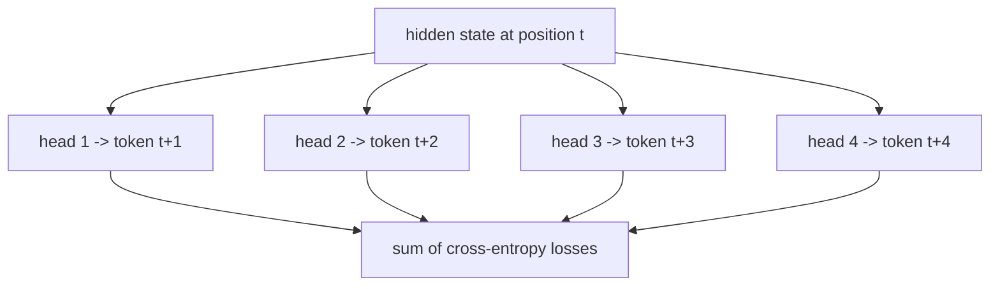
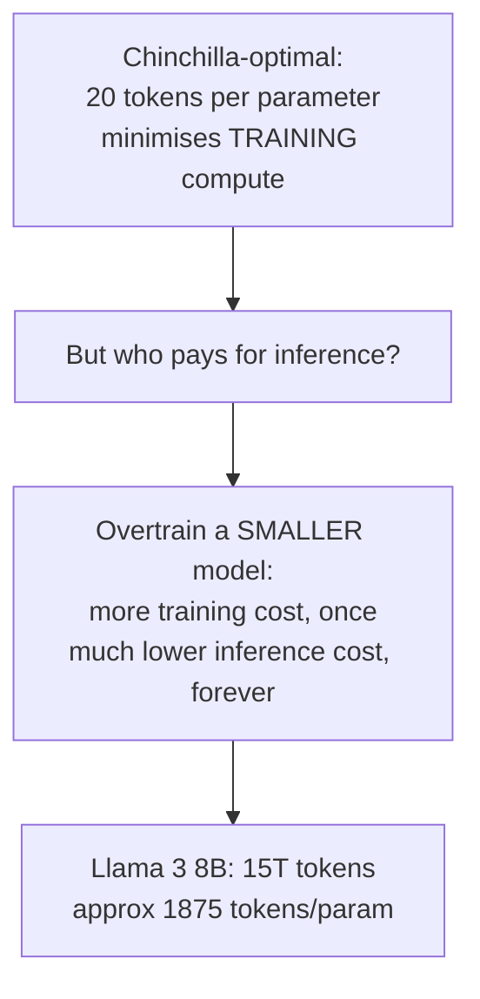
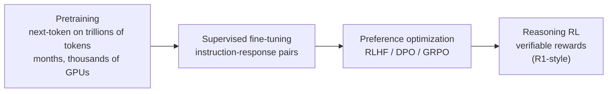

# 13 — Training Considerations: Objectives, Scaling Laws, Precision, Memory

> **Prerequisites:** modules 06–12.
> **You will learn:** what pretraining actually optimises, what scaling laws do
> and do not tell you, and the practical techniques — mixed precision, gradient
> checkpointing, MTP — that make training large models possible.

This module is deliberately practical. Training is a large field; what follows is
the part you need to read modern model reports.

---

## 13.1 Pretraining objectives

### Causal language modelling

The objective behind every model in module 15. Predict the next token:

$$\mathcal{L} = -\sum_{t=1}^{T} \log P(x_t \mid x_{<t})$$

Its virtue is that it is **self-supervised**: any text is training data, no labels
required. And because of the causal mask (module 08), all `T` positions are
trained **in one forward pass** — position `t` predicts `t+1` for every `t`
simultaneously.

```python
logits = model(input_ids)                    # (B, T, V)
loss = F.cross_entropy(
    logits[:, :-1].reshape(-1, V),           # predictions for positions 0..T-2
    input_ids[:, 1:].reshape(-1),            # targets are the NEXT tokens
)
```

That one-position shift is the entire objective.

### Masked language modelling

BERT's objective: mask ~15% of tokens and predict them from **both** directions.

| | Causal LM | Masked LM |
|---|---|---|
| Context | left only | bidirectional |
| Trains on | every position | ~15% of positions |
| Can generate | yes | no |
| Best for | generation | understanding |

MLM is more *sample*-efficient per token of context but trains on far fewer
positions per pass. Causal LM won because generation is what people want, and
because it scales more cleanly.

### Multi-token prediction (MTP)

A 2024–26 addition Raschka flags across several models.

> Multi-token prediction trains the LLM to predict several future tokens, instead
> of a single one, at each step. Here, at each position t, small extra heads
> (linear layers) output logits for t+1...t+k, and we sum cross-entropy losses
> for these offsets (in the MTP paper the researchers recommended k=4).



The richer signal speeds up training. Then it pays a second dividend: **the extra
heads become a draft model for speculative decoding** (module 14) at no extra
cost. Qwen3-Next "introduces a native Multi-Token Prediction (MTP) mechanism,
which not only yields an MTP module with a high acceptance rate for Speculative
Decoding but also enhances the overall performance."

Used by DeepSeek V3/V3.2, GLM-4.5, MiniMax-M2, Qwen3-Next, Xiaomi MiMo-V2-Flash,
and Nemotron 3 Super.

**Nemotron 3 Super** goes furthest: it uses MTP at *inference* too, where "the
shared-weight MTP head acts as an internal draft model for native speculative
decoding." Raschka suggests calling this "shared-weight MTP for speculative
decoding" rather than plain MTP, since standard MTP is training-only.

## 13.2 Scaling laws

### Kaplan et al. (2020)

Loss falls as a **power law** in model size, dataset size, and compute:

$$L(N) \approx \left(\frac{N_c}{N}\right)^{\alpha_N}$$

The finding that shaped 2020–22: performance improves smoothly and predictably
with scale, so you can **extrapolate from small runs**. Kaplan's analysis
suggested spending most of a compute increase on *parameters*, which is why
GPT-3 (175B) was trained on only ~300B tokens.

### Chinchilla (Hoffmann et al., 2022)

Then Kaplan's conclusion turned out to be wrong, because of a learning-rate
schedule artefact. Chinchilla's corrected finding:

> For compute-optimal training, model size and training tokens should scale
> **equally**. Roughly **20 tokens per parameter**.

| Model | Parameters | Tokens | Tokens/param |
|---|---|---|---|
| GPT-3 | 175B | 300B | 1.7 — badly undertrained |
| Chinchilla | 70B | 1.4T | 20 — compute-optimal |
| Llama 3 8B | 8B | 15T | **~1875** |
| Llama 3 70B | 70B | 15T | ~214 |

Chinchilla-70B beat GPT-3-175B while being 2.5× smaller. Same compute, better
allocation.

### Why modern models blow past Chinchilla

Look at Llama 3 8B: 1875 tokens per parameter, roughly **90× past**
compute-optimal. Deliberately.

Chinchilla optimises **training** compute. It ignores inference entirely. If you
serve a model to millions of users, inference cost dominates lifetime cost by
orders of magnitude — so it is rational to overtrain a *smaller* model, paying
more once to pay less forever.



**The practical lesson:** scaling laws are about *compute allocation*, not about
what is best to deploy. A "compute-optimal" model is rarely the one you want to
serve.

They also say nothing about data *quality*, architecture, or post-training — all
of which matter enormously in 2026. Raschka's repeated caution applies:
"datasets, training techniques, and hyperparameters vary widely and are often not
well documented."

## 13.3 Mixed precision

### The formats

| Format | Bits | Exponent | Mantissa | Range | Precision |
|---|---|---|---|---|---|
| FP32 | 32 | 8 | 23 | wide | high |
| FP16 | 16 | 5 | 10 | **narrow** | medium |
| **BF16** | 16 | **8** | 7 | same as FP32 | low |
| FP8 (E4M3) | 8 | 4 | 3 | narrow | very low |

The key comparison is FP16 versus BF16. Both are 16 bits, but they spend those
bits differently. BF16 keeps FP32's 8-bit exponent — **the same dynamic range** —
and sacrifices mantissa precision.

For deep learning that is the right trade. Gradients span many orders of
magnitude, so range matters more than precision, and FP16's narrow range causes
underflow. **BF16 is the default for training in 2026.**

### The recipe

```python
from torch.amp import autocast, GradScaler

use_fp16 = False
scaler = GradScaler('cuda', enabled=use_fp16)

for batch in loader:
    optimizer.zero_grad()
    with autocast(device_type='cuda', dtype=torch.float16 if use_fp16 else torch.bfloat16):
        loss = model(batch)                 # assumes model returns a scalar loss
    scaler.scale(loss).backward()           # FP32 parameter -> FP32 .grad
    scaler.unscale_(optimizer)              # required BEFORE clipping scaled grads
    torch.nn.utils.clip_grad_norm_(model.parameters(), 1.0)
    scaler.step(optimizer)                  # ordinary FP32 parameters updated here
    scaler.update()
```

Three components:

1. **Autocast chooses operation dtypes**; eligible matmuls use reduced precision.
   This does not halve all training memory or guarantee a fixed speedup.
2. **FP32 parameters and gradients** remain FP32 in this native-autocast recipe.
   Other recipes maintain low-precision parameters plus separate master weights.
3. **Loss scaling** — multiply the loss before backward to push small gradients
   above the representable minimum, then unscale before the step. Required for
   fp16; **unnecessary for bf16**, whose range already covers it.

Reduction and loss dtypes follow the backend/autocast policy or explicit casts,
not an unconditional rule for every call. Module 06 explicitly upcasts RMSNorm.

### FP8 and below

FP8 training is now used at frontier scale — DeepSeek V3 trained in FP8, and
FlashAttention-3 supports it. It needs careful per-tensor scaling and is not yet
routine. NVFP4 appears in Nemotron 3 deployment.

## 13.4 The memory budget

One explicit low-precision-parameter recipe with FP32 master weights has:

| Component | Bytes per parameter |
|---|---|
| Weights (bf16) | 2 |
| Gradients (bf16) | 2 |
| Adam momentum (fp32) | 4 |
| Adam variance (fp32) | 4 |
| FP32 master weights | 4 |
| **Total** | **~16** |

**A 7B model needs ~112 GB just for state** — before a single activation. This is
why training requires clusters and why optimizer sharding (ZeRO / FSDP) exists.

Then add activations, which scale with batch size, sequence length, and depth:

$$\text{activations} \approx B \times T \times d_{model} \times L \times c$$

At long context this exceeds the parameter state.

### Gradient checkpointing

The standard fix. Backprop needs forward activations; storing all of them is
expensive. Instead, **store activations only at block boundaries and recompute
the rest during the backward pass.**

```python
from torch.utils.checkpoint import checkpoint

class CheckpointedStack(nn.Module):
    def forward(self, x, *args):
        for block in self.blocks:
            # store only this block's input; recompute its internals in backward
            x = checkpoint(block, x, *args, use_reentrant=False)
        return x
```

| | Activation memory | Compute |
|---|---|---|
| Standard | `O(L)` block internals and boundaries | `F+B` |
| Each block checkpointed, as above | `O(L)` boundaries plus one block's recomputed internals | approximately `2F+B` |
| Segment checkpoints spaced about `sqrt(L)` apart | `O(sqrt(L))` boundary/segment storage under equal-size assumptions | recomputation-dependent |

If backward costs `B≈2F`, an extra forward costs `F/(F+B)≈1/3` more than an
ordinary **training step**, not 1.33 times forward alone. Native FP32 AdamW with
autocast typically also has 16 parameter-state bytes (`4+4+4+4`) without a
separate master copy; activation and temporary storage still depend on dtype.
This is the same principle as
FlashAttention's backward recomputation (module 11): **recompute is cheaper than
remember** when you are memory-bound.

### Other memory techniques

| Technique | Idea |
|---|---|
| **ZeRO / FSDP** | shard optimizer state, gradients, and parameters across GPUs |
| **Tensor parallelism** | split individual matrices across GPUs |
| **Pipeline parallelism** | put different layers on different GPUs |
| **Expert parallelism** | put different MoE experts on different GPUs |
| **Sequence parallelism** | split the sequence dimension across GPUs |
| **CPU/NVMe offload** | move optimizer state off the GPU |

Large runs combine several — commonly called 3D or 4D parallelism.

## 13.5 Optimizers, and Muon

**AdamW** is the default: Adam with decoupled weight decay. Typical settings
`β₁=0.9, β₂=0.95, ε=1e-8`, weight decay 0.1, cosine schedule with warm-up.

The notable 2025 development, per Raschka, is **Kimi K2**:

> A notable aspect is its use of a variant of the relatively new **Muon**
> optimizer over AdamW. As far as I know, this is the first time Muon was used
> over AdamW for any production model of this size (previously, it has only been
> shown to scale up to 16B).

Muon orthogonalises the update direction for matrix-shaped parameters (via
Newton-Schulz iteration), which conditions the update better than elementwise
adaptive scaling.

Raschka is careful about the evidence. On the widely-shared claim that Kimi K2's
loss curve was exceptionally smooth:

> I think it's not exceptionally smooth (e.g., see the OLMo 2 loss curve...; also,
> the L2 norm of the gradient would probably be a better metric to track training
> stability). However, what's remarkable is how well the loss curve **decays**.

A good instance of reading a training plot properly: smoothness is not the same
as fast convergence, and the second is what matters.

Arcee Trinity Large uses a related **MuOpt** optimizer.

## 13.6 Stability techniques

Large-model training diverges. The architectural defences, cross-referenced:

| Technique | Module | Mechanism |
|---|---|---|
| Residual connections | 06 | identity gradient path |
| Pre-norm | 06 | clean residual stream, no warm-up needed |
| Post-norm inside residual | 06 | OLMo 2/Olmo 3 stability finding |
| **QK-Norm** | 06 | bounds attention score magnitude |
| Depth-scaled norm gain | 06 | Trinity's `1/sqrt(L)` init |
| `sqrt(d_k)` scaling | 03 | keeps score variance dimension-independent |
| Gradient clipping | — | hard cap on global gradient norm (typically 1.0) |
| Learning-rate warm-up | — | linear ramp over the first ~1–2% of steps |
| Dense first layers | 12 | stable low-level features before MoE routing |
| Load-balancing loss | 12 | prevents expert collapse |
| BF16 over FP16 | 13 | dynamic range prevents gradient underflow |

Raschka's OLMo 2 caveat is worth carrying into any such discussion: their
stability figure "shows the results of the reordering together with QK-Norm,
which is a separate concept. So, it's hard to tell how much the normalization
layer reordering contributed by itself." Stability techniques are usually shipped
together and rarely ablated individually.

## 13.7 The post-training stack

Pretraining produces a base model that continues text. Turning it into an
assistant takes more:



Raschka scopes his article to architecture and repeatedly defers here — and it is
worth taking seriously that **most 2026 quality differences come from this stage,
not from architecture**. His comment on Mistral 3 Large adopting DeepSeek V3's
architecture wholesale says it directly: "A lot of the secret sauce these days is
in the training pipeline as well as the inference scaling strategies."

Two models with identical architectures can differ enormously. Architecture is
necessary to understand; it is not where the remaining differentiation lives.

---

## Reconciling the sources

**Neither source covers this centrally.** The playlist covers backprop and
optimizers earlier in the CampusX series (videos 32–38, outside our range) but
not large-model training. Raschka explicitly excludes training: "I aim to focus
only on the LLM architecture details (not training or data) to keep it at a
manageable length."

What Raschka *does* supply is architecture-adjacent training facts: Muon on Kimi
K2, MTP across several models, OLMo 2's stability findings, dense-first-layers.
The rest — scaling laws, mixed precision, checkpointing — is from Kaplan et al.
(2020), Hoffmann et al. (2022), Micikevicius et al. (2018), and Chen et al.
(2016).

**Where MTP belongs.** Raschka classifies MTP as a *training* technique and
therefore excludes it from architecture comparisons — except that Qwen3-Next and
Nemotron 3 Super use it at inference for speculative decoding. It genuinely
straddles the boundary; we cover the training half here and the inference half in
module 14.

---

## Worked scaling and real optimizer-step contracts

Suppose fitted validation loss is `E + A*N**(-alpha) + B*D**(-beta)` and
training compute is `C≈6ND`. Substitute `D=C/(6N)` and differentiate with
respect to N: `alpha*A*N**(-alpha)=beta*B*(6N/C)**beta` at the optimum.
Thus `N_opt` scales as `C**(beta/(alpha+beta))` and D with the complementary
exponent. Equal growth follows only when the fitted exponents are similar;
20 tokens per parameter is a regime-dependent fit, not a physical constant.

Here is an offline next-token **training-contract** example. The synthetic
documents are distinct rows, so no cross-document attention exists. BOS/EOS
are ordinary IDs here and PAD is excluded from the loss. The tiny GRU is used
only to keep this optimizer/dtype example independent of the course decoder;
module 16 applies the same shift to the actual Transformer.

```python transformer-check
import copy
import torch
import torch.nn.functional as F
torch.manual_seed(13)
class TinyLM(torch.nn.Module):
    def __init__(self):
        super().__init__()
        self.embed = torch.nn.Embedding(8, 8, padding_idx=0)
        self.rnn = torch.nn.GRU(8, 12, batch_first=True)
        self.head = torch.nn.Linear(12, 8)
    def forward(self, ids):
        h, _ = self.rnn(self.embed(ids))
        return self.head(h)
model = TinyLM()
optimizer = torch.optim.AdamW(model.parameters(), lr=0.01)
docs = torch.tensor([[1, 3, 4, 2, 0], [1, 5, 6, 7, 2]])
targets = docs[:, 1:].clone()
targets[targets == 0] = -100
before = model.head.weight.detach().clone()
optimizer.zero_grad(set_to_none=True)
valid_total = (targets != -100).sum()
for row in range(2):
    logits = model(docs[row:row+1, :-1])
    loss = F.cross_entropy(logits.reshape(-1, 8), targets[row].reshape(-1),
                           ignore_index=-100, reduction='sum') / valid_total
    loss.backward()
torch.nn.utils.clip_grad_norm_(model.parameters(), 1.0)
optimizer.step()
assert not torch.equal(before, model.head.weight)
assert all(p.grad is None or p.grad.dtype == p.dtype for p in model.parameters())
state = copy.deepcopy({'model': model.state_dict(), 'optimizer': optimizer.state_dict(),
                       'rng': torch.get_rng_state(), 'step': 1})
restored = TinyLM()
restored.load_state_dict(state['model'])
restored_optimizer = torch.optim.AdamW(restored.parameters(), lr=0.01)
restored_optimizer.load_state_dict(state['optimizer'])
torch.set_rng_state(state['rng'])
torch.testing.assert_close(model(docs[:, :-1]), restored(docs[:, :-1]))
print("Shifted targets, valid-token accumulation and in-memory state restoration verified.")
```

Token-summed losses divided by the accumulation window's total valid-token count
match a token-mean objective even when microbatches have unequal padding. For
FP16, scale each microbatch loss and unscale **once after accumulation**, before
clipping. Durable resume additionally saves scheduler/scaler state, data cursor,
device RNGs and distributed sampler state; this in-memory check does not claim
crash recovery or bitwise distributed reproducibility.

Generic independent future-token heads and DeepSeek-V3's sequential MTP modules
are different architectures. The latter combine previous module representations
with future-token embeddings; both incur additional computation. Deduplicate
and split documents before packing, and keep held-out evaluation text out of
tokenizer/model selection to avoid contamination.

## Key takeaways

- Causal LM predicts the next token, is self-supervised, and trains **every
  position in one pass** thanks to the causal mask.
- **MTP** adds heads predicting `t+1..t+k` (k≈4). Richer training signal, and the
  heads double as a speculative-decoding draft model.
- **Chinchilla**: compute-optimal training scales parameters and tokens equally,
  ~20 tokens per parameter. It corrected Kaplan's parameter-heavy conclusion.
- Modern models **deliberately overtrain** — Llama 3 8B at ~1875 tokens/param —
  because Chinchilla optimises training compute and ignores inference cost.
- **BF16 over FP16**: same 8-bit exponent as FP32, so the same dynamic range.
  Range beats precision for gradients. BF16 needs no loss scaling.
- Native autocast uses eligible reduced-precision operations while ordinary
  FP32 parameters and their gradients remain FP32; master-copy recipes differ.
- Training state is **~16 bytes per parameter** with bf16 + Adam. A 7B model needs
  ~112 GB before activations.
- **Per-block checkpointing** retains `O(L)` block boundaries but avoids storing
  all block internals. `O(sqrt(L))` needs a different segment placement strategy.
- **Muon** (Kimi K2, 1T params) is the first non-AdamW optimizer at production
  frontier scale. Its loss curve is notable for how it *decays*, not for
  smoothness.
- Stability is layered: residuals, pre-norm, QK-Norm, `sqrt(d_k)`, gradient
  clipping, warm-up, dense-first-layers, load-balancing loss.
- **Most 2026 quality differences come from post-training, not architecture.**

## Self-check

1. Chinchilla says ~20 tokens per parameter. Llama 3 8B used ~1875. Explain why
   that is rational rather than wasteful, and identify what Chinchilla's
   objective leaves out.
2. FP16 and BF16 are both 16 bits. Explain what BF16 gives up, what it keeps, and
   why the trade favours deep learning — including why loss scaling becomes
   unnecessary.
3. Gradient checkpointing and FlashAttention's backward pass both discard data
   and recompute it. State the shared principle and the hardware property that
   makes it a win.

---

**Next → [14 — Inference Optimizations](./14-inference-optimizations.md)**
