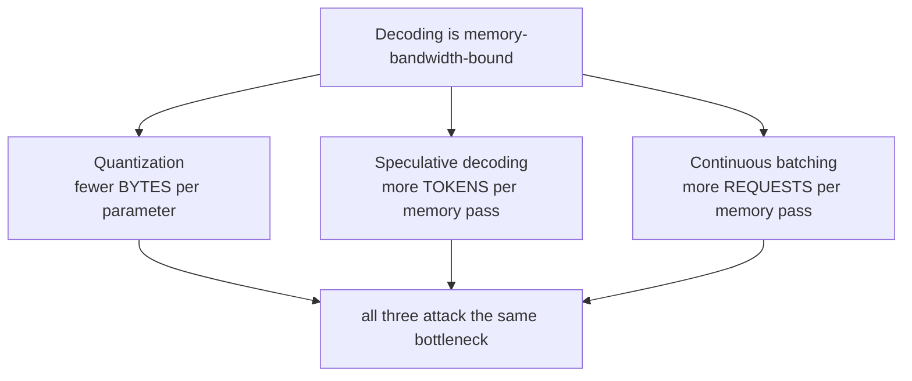
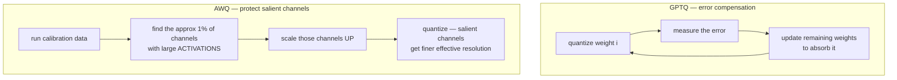
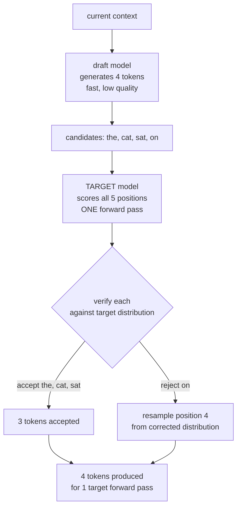
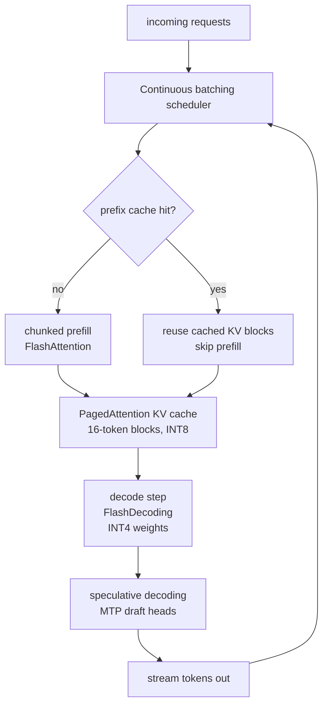

# 14 — Inference Optimizations: Quantization, Speculative Decoding, Batching

> **Prerequisites:** modules 11, 13.
> **You will learn:** how INT8/INT4 quantization works and what GPTQ/AWQ actually
> do, why speculative decoding gives free speedups, and how continuous batching
> turns latency wins into throughput wins.

---

## 14.1 What you are actually optimizing

Module 11 established the governing fact: **decoding is memory-bandwidth-bound.**

Generating one token requires reading every weight the token touches, plus its KV
cache, from HBM. The arithmetic is trivial by comparison — with batch size 1 you
do roughly two FLOPs per parameter byte read, while the hardware can do hundreds.

That single fact organises this entire module:



Every technique here either moves fewer bytes or gets more useful work out of each
byte moved.

## 14.2 Quantization

Store weights in fewer bits.

| Precision | Bits | 70B model size | vs FP16 |
|---|---|---|---|
| FP32 | 32 | 280 GB | 2× larger |
| FP16/BF16 | 16 | 140 GB | baseline |
| INT8 | 8 | 70 GB | 2× smaller |
| **INT4** | 4 | **35 GB** | **4× smaller** |

INT4 is what puts a 70B model on a single 48 GB GPU, or a 7B model on a laptop.

And because decoding is bandwidth-bound, **4× fewer bytes means roughly 4× faster
decoding** — the speedup is nearly as large as the memory saving.

### The basic mechanism

Map a floating-point range onto integers with a scale and a zero point:

$$q = \text{round}\left(\frac{x}{s}\right) + z, \qquad \hat{x} = s\,(q - z)$$

```python
def quantize_int8(x, axis=-1):
    """Symmetric per-channel INT8 quantization."""
    scale = x.abs().amax(dim=axis, keepdim=True) / 127.0
    q = torch.round(x / scale).clamp(-128, 127).to(torch.int8)
    return q, scale

def dequantize(q, scale):
    return q.to(torch.float16) * scale
```

**Granularity** is the main quality lever:

| Granularity | Scales stored | Quality | Overhead |
|---|---|---|---|
| Per tensor | 1 | poor | none |
| Per channel | one per row/column | good | small |
| **Per group** (64–128 weights) | many | **best** | ~0.5 bit/weight |

Per-group is standard for INT4 — hence "4-bit" formats that really cost ~4.5
bits/weight.

### The outlier problem

Naive quantization of LLMs fails, and for a specific reason: activations contain
**massive outliers**. A handful of channels carry values 10–100× larger than the
rest, and they are functionally important. Quantize per tensor and those outliers
set the scale, crushing everything else into a couple of levels.

The methods below are all, at bottom, answers to this problem.

### The method landscape

| Method | Type | What it does |
|---|---|---|
| **LLM.int8()** | weights + activations | keeps outlier channels in FP16, rest INT8 |
| **SmoothQuant** | weights + activations | migrates activation outliers into weights |
| **GPTQ** | weight-only | layer-wise error-compensating rounding |
| **AWQ** | weight-only | scales up salient channels before rounding |
| **GGUF / k-quants** | weight-only | mixed bit-widths per tensor; CPU-friendly |
| **FP8 / NVFP4** | weights + activations | hardware-native low precision |

**GPTQ** (Frantar et al., 2022) quantizes one weight at a time and **updates the
remaining unquantized weights** to compensate for the error just introduced,
using approximate second-order (Hessian) information. Errors do not accumulate;
each is partly absorbed by weights not yet fixed. INT4 with small quality loss,
in a few GPU-hours for a 175B model.

**AWQ** (Lin et al., 2023) starts from an observation: not all weights matter
equally. About **1% of weight channels are salient**, identifiable from
*activation* magnitudes rather than weight magnitudes. AWQ scales those channels
up before quantizing (and compensates in the following layer), so they land on a
finer part of the grid.



Both need a small **calibration set** (a few hundred sequences) and both are
weight-only: weights are stored INT4 and dequantized to FP16 inside the kernel.
That is fine precisely because the bottleneck is memory, not arithmetic.

### Quantization-aware training

PTQ (everything above) quantizes a trained model. **QAT** simulates quantization
*during* training so the model learns to tolerate it. Better quality at very low
bit-widths, at the cost of a training run. Used for sub-4-bit and for
edge deployment.

### KV cache quantization

Often forgotten, frequently decisive. Module 09 showed the cache can reach tens of
GB — quantizing it to INT8 or INT4 halves or quarters that.

The catch: keys and values behave differently. Keys are more outlier-prone (they
feed the score matmul, where errors get exponentiated by softmax) and generally
need higher precision than values. Common production setting: **K in INT8, V in
INT4.**

### What to expect

| Setting | Typical quality impact |
|---|---|
| INT8 weight-only | negligible |
| INT4 weight-only, per-group (GPTQ/AWQ) | small; usually acceptable |
| INT4 per-tensor, no calibration | noticeable degradation |
| INT3 and below | significant without QAT |
| KV cache INT8 | small |
| KV cache INT4 (values) | small; keys are riskier |

## 14.3 Speculative decoding

The most elegant inference optimization, because it is **exactly lossless**.

### The observation

Decoding one token reads the entire model from HBM but performs almost no
arithmetic. The GPU's compute units are nearly idle. Meanwhile, verifying `k`
tokens costs almost the same memory traffic as verifying one — it is a batched
forward pass.

So: **guess several tokens cheaply, then verify them all in one pass.**

### The algorithm

```
1. A small DRAFT model generates k candidate tokens autoregressively (cheap).
2. The large TARGET model scores all k+1 positions in ONE forward pass.
3. Accept the longest prefix consistent with the target's distribution.
4. On the first rejection, resample that token from a corrected distribution.
5. Repeat.
```



### Why the output distribution is unchanged

This is the part that makes it trustworthy. The **modified rejection sampling**
scheme (Leviathan et al. 2023; Chen et al. 2023) accepts a draft token `x` with
probability `min(1, p(x)/q(x))` where `p` is the target and `q` the draft. On
rejection, it resamples from the normalized residual `max(0, p − q)`.

The proof shows the resulting samples are drawn **exactly** from `p`. Not
approximately — exactly.

> Speculative decoding does not change what the model outputs. A bad draft model
> makes it *slower*, never *wrong*.

That property is why it is deployed by default in most serving stacks.

### Where the draft comes from

| Approach | Draft source |
|---|---|
| **Two-model** | a small model from the same family (Llama 70B ← Llama 1B) |
| **Self-speculative** | the target model with some layers skipped |
| **Medusa** | extra heads on the target predicting `t+1..t+k` |
| **EAGLE** | a lightweight head over the target's own features |
| **MTP heads** | the training-time heads from module 13 — free |
| **Prompt lookup** | copy n-grams from the prompt — no model at all |

The **MTP** route is especially neat: heads trained for the auxiliary objective in
module 13 become the draft model at inference with zero extra cost. Qwen3-Next
does this, and Nemotron 3 Super uses a shared-weight MTP head as "an internal
draft model for native speculative decoding... This reduces inference latency
without needing a separate external draft model."

**Prompt lookup decoding** is a lovely special case: in summarization or code
editing, much of the output is copied from the input, so drafting by n-gram match
against the prompt needs no model and can be very effective.

### Expected speedup

Speedup depends on the **acceptance rate** `α` and draft length `k`:

$$\text{expected tokens per target pass} = \frac{1 - \alpha^{k+1}}{1 - \alpha}$$

| `α` | `k=3` | `k=5` | `k=7` |
|---|---|---|---|
| 0.6 | 2.0 | 2.3 | 2.4 |
| 0.8 | 2.9 | 3.7 | 4.2 |
| 0.9 | 3.4 | 4.7 | 5.7 |

Real systems see **2–3×**. Note the diminishing returns in `k` — beyond a point
the draft is usually wrong anyway, and drafting costs grow. `k = 4–5` is typical.

**Important limitation:** speculative decoding helps *latency* at low batch size.
At high batch size the GPU is already compute-saturated, and the extra
verification work can *reduce* throughput. It is a latency optimization, not a
throughput one.

## 14.4 Continuous batching

Introduced in module 11 alongside PagedAttention; here is the operational view.

**Static batching** runs a batch to completion. Since outputs differ in length,
finished sequences occupy slots doing nothing:

```
static:
  A: |====|                    done at step 4, slot idle until step 12
  B: |============|            done at step 12
  C: |======|                  done at step 6, slot idle until step 12
       ^ GPU wastes most of its slots
```

**Continuous batching** schedules per decode step. The instant a sequence emits
`[EOS]`, its slot is freed and a queued request enters on the next step:

```
continuous:
  A: |====|
  D:      |========|           D starts the moment A finishes
  B: |============|
  C: |======|
  E:        |======|
```

Because PagedAttention (module 11) allocates cache in independent blocks, adding
and removing sequences mid-flight costs nothing. The two techniques were designed
together.

### Chunked prefill

Prefill is compute-bound; decode is memory-bound (module 11). A long prefill
monopolises the GPU and stalls every decoding request — a latency spike users
notice.

**Chunked prefill** splits a long prompt into pieces and interleaves them with
decode steps, so both compute and memory units stay busy and no request is
starved.

### Disaggregated serving

The logical endpoint: run prefill and decode on **separate GPU pools**, each
tuned for its bottleneck, shipping the KV cache between them over fast
interconnect. Increasingly common at scale.

## 14.5 Sampling

How you turn logits into a token. Not a performance optimization, but it belongs
in any inference discussion.

| Method | Behaviour |
|---|---|
| **Greedy** (`argmax`) | deterministic; repetitive |
| **Temperature** | `logits / T`; `T<1` sharpens, `T>1` flattens |
| **Top-k** | sample from the `k` most likely |
| **Top-p (nucleus)** | sample from the smallest set with cumulative prob ≥ `p` |
| **Min-p** | keep tokens above `p × max_prob`; adapts to confidence |
| **Repetition penalty** | downweight already-generated tokens |

```python
def sample(logits, temperature=0.8, top_p=0.95):
    if temperature == 0:
        return logits.argmax(-1)
    logits = logits / temperature
    probs = F.softmax(logits, dim=-1)

    sorted_probs, sorted_idx = probs.sort(descending=True, dim=-1)
    cumulative = sorted_probs.cumsum(dim=-1)
    # drop the tail beyond the nucleus, keeping at least one token
    mask = cumulative - sorted_probs > top_p
    sorted_probs[mask] = 0.0
    sorted_probs /= sorted_probs.sum(dim=-1, keepdim=True)

    choice = torch.multinomial(sorted_probs, 1)
    return sorted_idx.gather(-1, choice)
```

Top-p is generally preferred to top-k because it adapts: where the model is
confident the nucleus is small, where it is uncertain the nucleus widens.

Note that **speculative decoding is compatible with all of these** — the
rejection-sampling correction is defined with respect to whatever distribution
the target model produces after temperature and truncation.

## 14.6 Putting the stack together

A production serving system in 2026:



Rough contributions, all multiplicative:

| Technique | Gain | Type |
|---|---|---|
| KV cache | ~`T`× | exact |
| GQA/MLA (module 09) | 4–57× cache | ~exact |
| FlashAttention (module 11) | 2–4× | **exact** |
| PagedAttention + continuous batching | 2–24× throughput | **exact** |
| INT4 weight quantization | ~4× memory & bandwidth | lossy (small) |
| Speculative decoding | 2–3× latency | **exact** |
| Prefix caching | up to ∞ on prefill | **exact** |

Note how many are marked exact. The large wins in inference are overwhelmingly
*engineering*, not accuracy trades. Quantization is the only entry in the table
that costs quality — and even that is small at INT4 with good calibration.

---

## Reconciling the sources

**Neither source covers this.** The playlist's video 84 covers *what* inference
does — autoregressive decoding, growing input, masking still applied — but not
how to make it fast. Raschka scopes to architecture.

Raschka does supply the architectural hooks: MTP heads used for speculative
decoding in Qwen3-Next and Nemotron 3 Super, and his note that "a lot of the
secret sauce these days is in the training pipeline as well as the **inference
scaling strategies**."

The rest is from primary sources: GPTQ (Frantar et al. 2022), AWQ (Lin et al.
2023), LLM.int8() (Dettmers et al. 2022), SmoothQuant (Xiao et al. 2022),
speculative decoding (Leviathan et al. 2023; Chen et al. 2023), Medusa (Cai et
al. 2024), EAGLE (Li et al. 2024), Orca/continuous batching (Yu et al. 2022),
vLLM (Kwon et al. 2023).

**One framing worth keeping.** Module 10's techniques trade quality for speed.
Module 11's and most of this module's trade nothing. Quantization is the main
lossy technique here, and it is a *tunable* loss — you choose the bit-width.

---

## Key takeaways

- Decoding is memory-bandwidth-bound. Every technique here moves fewer bytes or
  extracts more work per byte.
- **Quantization**: INT4 gives 4× smaller weights *and* roughly 4× faster
  decoding, because bandwidth is the bottleneck.
- LLM activations have **massive outlier channels**; naive per-tensor
  quantization crushes everything else. Every serious method addresses this.
- **GPTQ** compensates rounding error by updating not-yet-quantized weights.
  **AWQ** scales up the ~1% salient channels, identified from *activation*
  magnitudes.
- Per-group scales (64–128 weights) are standard for INT4 — real cost ~4.5
  bits/weight.
- **KV cache quantization** matters as much as weight quantization at long
  context. Keys need more precision than values (K INT8, V INT4 is common).
- **Speculative decoding** drafts `k` tokens cheaply and verifies them in one
  target pass. Modified rejection sampling makes the output distribution
  **exactly** unchanged — a bad draft is slower, never wrong.
- MTP heads (module 13) serve as a free draft model. Qwen3-Next and Nemotron 3
  Super do exactly this.
- Speculative decoding is a **latency** optimization; at high batch size it can
  reduce throughput.
- **Continuous batching** frees a slot the step a sequence finishes; it depends on
  PagedAttention's independent block allocation.
- **Chunked prefill** interleaves compute-bound prefill with memory-bound decode.
- **Top-p** adapts to model confidence and is generally preferred to top-k.
- Most large inference wins are **exact**. Quantization is the main lossy one, and
  its loss is tunable.

## Self-check

1. INT4 quantization gives 4× memory savings and roughly 4× faster decoding, but
   only ~1× faster prefill at large batch. Explain the asymmetry.
2. Speculative decoding uses a weaker draft model yet is claimed lossless. Explain
   the acceptance rule and what happens on rejection that preserves the target
   distribution exactly.
3. A team enables speculative decoding and sees latency improve for single users
   but total throughput *drop* under heavy load. Explain why, and say what they
   should do.

---

**Next → [15 — Modern Architecture Case Studies](./15-modern-architecture-case-studies.md)**
