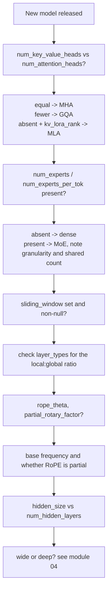

# 15 — Modern Architecture Case Studies

> **Prerequisites:** modules 05, 06, 09, 10, 12.
> **You will learn:** exactly what five flagship models do differently, and how to
> read any new model's config file using the vocabulary this course has built.

Source for this module: Sebastian Raschka, *The Big LLM Architecture Comparison*
(living document; the version used here was **last updated April 2026** and
covers 23 model families). Direct quotations are his.

---

## 15.0 The thesis

Raschka's opening question frames everything here:

> Sure, positional embeddings have evolved from absolute to rotational (RoPE),
> Multi-Head Attention has largely given way to Grouped-Query Attention, and the
> more efficient SwiGLU has replaced activation functions like GELU. But beneath
> these minor refinements, have we truly seen groundbreaking changes, or are we
> simply polishing the same architectural foundations?

By the end of this module you should be able to answer that yourself. The short
version: **the block from module 06 is unchanged.** What varies is which variant
fills each slot.

He also states the caveat that should accompany every comparison here:

> Comparing LLMs to determine the key ingredients that contribute to their good
> (or not-so-good) performance is notoriously challenging: datasets, training
> techniques, and hyperparameters vary widely and are often not well documented.

Architecture is what we can see. It is not necessarily what makes a model good.

---

## 15.1 DeepSeek V3 / R1 — the efficiency architecture

**671B total / 37B active · 61 layers · MLA + MoE**

The most influential open architecture of the period. Kimi K2, Mistral 3 Large,
and GLM-5 all adopted parts of it.

| Component | Choice |
|---|---|
| Attention | **MLA** — compressed KV latent (module 09) |
| FFN | **MoE**, 256 experts, 8 routed + **1 shared** active |
| Expert hidden | 2048 (fine-grained) |
| First 3 layers | **dense**, not MoE |
| Norm | RMSNorm, pre-norm |
| Position | RoPE |
| Activation | SwiGLU |
| Extras | MTP (training), FP8 training |

### The two decisions that define it

**MLA over GQA.** Raschka explains the reasoning via the DeepSeek-V2 ablations:

> GQA appears to perform worse than MHA, whereas MLA offers better modeling
> performance than MHA, which is likely why the DeepSeek team chose MLA over GQA.

So MLA was not chosen only for the ~57× cache reduction — DeepSeek's own
measurements say it is *better*, not merely cheaper. Raschka's summary: "MLA is a
clever trick to reduce KV cache memory use while even slightly outperforming MHA
in terms of modeling performance."

**Fine-grained MoE with a shared expert.** 256 experts of hidden size 2048, 8
routed active plus 1 always-on shared. Raschka on the shared expert:

> This is likely because common or repeated patterns don't have to be learned by
> multiple individual experts, which leaves them with more room for learning more
> specialized patterns.

### Why it matters

37B active parameters delivering better benchmarks than the 405B dense Llama 3.
That comparison is what made MoE the default for frontier open models in 2025.

### The descendants

| Model | Relationship |
|---|---|
| **Kimi K2** (1T) | same architecture, scaled up; more experts, fewer MLA heads |
| **Mistral 3 Large** (675B) | "exactly the same architecture as DeepSeek V3 and V3.1"; experts 2× larger, half as many |
| **GLM-5** (744B) | adopted MLA + DeepSeek Sparse Attention |
| **DeepSeek V3.2** | V3 + sparse attention |

Raschka on Mistral's choice: "why change what ain't broke? A lot of the secret
sauce these days is in the training pipeline as well as the inference scaling
strategies."

---

## 15.2 Llama 4 Maverick — the conservative MoE

**400B total / 17B active · GQA + alternating MoE**

The instructive counterpoint to DeepSeek V3: same family of ideas, different
choices at nearly every knob.

| Component | Choice | vs DeepSeek V3 |
|---|---|---|
| Attention | **GQA** | MLA |
| MoE experts | 128, **2 active** | 256, 9 active |
| Expert hidden | **8192** (large) | 2048 (small) |
| Shared expert | **no** | yes |
| MoE placement | **alternating** MoE/dense blocks | every block after the first 3 |
| Active params | 17B | 37B |

Raschka's summary:

> Llama 4 Maverick uses a more classic MoE setup with fewer but larger experts (2
> active experts with 8,192 hidden size each) compared to DeepSeek V3 (9 active
> experts with 2,048 hidden size each). Also, DeepSeek uses MoE layers in each
> transformer block (except the first 3), whereas Llama 4 alternates MoE and dense
> modules in every other transformer block.

Note that DeepSeek V3 is ~68% larger in total but has **more than twice** the
active parameters — the two models sit at very different sparsity levels.

### Reading it

Every Llama 4 choice is the conservative one: GQA over MLA (simpler, well-
supported kernels), few large experts (the older, better-understood MoE style),
alternating rather than pervasive MoE (less routing instability). Meta optimised
for deployability and reliability; DeepSeek optimised for efficiency at frontier
scale.

Raschka's own conclusion is appropriately humble: "Given the many small
differences between architectures, it is difficult to determine their exact
impact on final model performance. The main takeaway, however, is that MoE
architectures have seen a significant rise in popularity in 2025."

---

## 15.3 Qwen3 — the complete family

**Dense: 0.6B → 32B · MoE: 30B-A3B, 235B-A22B**

Qwen3 is the reference point Raschka compares nearly everything else against,
because it ships at every size in both dense and sparse variants.

| Component | Choice |
|---|---|
| Attention | GQA + **QK-Norm** |
| Norm | RMSNorm, pre-norm |
| Position | RoPE (YaRN optional, 32k → 131k) |
| Activation | SwiGLU |
| MoE (235B) | 128 experts, 8 active, **no shared expert** |
| Shape | **deeper and narrower** than Llama 3 |

### Deep and narrow

Comparing Qwen3 0.6B with Llama 3 1B, Raschka notes Qwen3 "is a deeper
architecture with more layers, whereas Llama 3 is a wider architecture with more
attention heads." The consequences he measured on an A100 with his own from-
scratch implementations: Qwen3 has a smaller memory footprint but "a slower
runtime (lower tokens/sec generation speed)" — depth cannot be parallelised.

### Why both dense and MoE

> Dense models are typically more straightforward to fine-tune, deploy, and
> optimize across various hardware. On the other hand, MoE models are optimized
> for scaling inference... By releasing both types, the Qwen3 series can support a
> broader range of use cases: dense models for robustness, simplicity, and
> fine-tuning, and MoE models for efficient serving at scale.

### The shared-expert story

Qwen3 **dropped** the shared expert that Qwen2.5-MoE had. Raschka asked; developer
Junyang Lin replied:

> At that moment we did not find significant enough improvement on shared expert
> and we were worrying about the optimization for inference caused by shared
> expert. No straight answer to this question honestly.

Then **Qwen3-Next** (Sept 2025) reversed it: 4× more experts *and* a shared expert
restored — both directions Raschka had predicted.

### Qwen3-Next — where Qwen went

An 80B-A3B model, 3× smaller than 235B-A22B, and a significant departure:

| Change | Detail |
|---|---|
| Experts | 4× more, **plus a shared expert** |
| Attention | **Gated DeltaNet + Gated Attention hybrid, 3:1** (module 10) |
| Context | 262k native (up from 32k / 131k with YaRN) |
| Training | **MTP**, also used for speculative decoding |

The gated attention layers are GQA with three stability tweaks: a sigmoid output
gate, zero-centered RMSNorm for QK-Norm, and partial RoPE. Raschka: "these are
essentially just stability changes to GQA."

**Qwen3-Coder-Next** (Feb 2026) uses the identical architecture, trained from
Qwen3-Next as a base, and reaches SWE-Bench Pro performance "roughly on par with
Claude-Sonnet-4.5" — a good illustration of the module-13 point that post-training
now drives most differentiation.

---

## 15.4 Gemma 3 / Gemma 4 — efficiency through locality

**Gemma 3: 27B · Gemma 4: 31B dense + 26B-A4B MoE**

Google's answer to long-context cost is neither MoE nor MLA. It is **sliding
window attention**.

| Component | Choice |
|---|---|
| Attention | **GQA + sliding window, 5:1 local:global** |
| Window | **1024** (Gemma 2 used 4096) |
| Norm | RMSNorm, **both pre- and post-** each sublayer |
| Position | RoPE (Gemma 4: **p-RoPE**, 25% of frequency pairs) |
| Vocabulary | unusually large (multilingual) |
| Gemma 4 extra | global layers set **values = keys** |

### The sliding-window design

Gemma 2 used a 1:1 ratio with a 4096 window. Gemma 3 moved to **5:1** and shrank
the window to **1024** — "this shifts the model's focus towards more efficient,
localized computations."

The ablation Raschka cites shows "little to no impact on the LLM-generated output
perplexity." Substantial cache reduction, essentially free.

### The distinctive norm placement

Gemma is the only major family using **both** pre- and post-norm around each
sublayer. Raschka's read:

> I think this normalization layer placement is a relatively intuitive approach as
> it gets the best of both worlds: Pre-Norm and Post-Norm. In my opinion, a bit of
> extra normalization can't hurt. In the worst case, if the extra normalization is
> redundant, this adds a bit of inefficiency through redundancy.

### Gemma 4's near-identical architecture

Raschka: Gemma 4 (31B) "looks pretty much unchanged compared to Gemma 3 (27B)."
Two small changes:

1. **In global layers, `values = keys`** — reusing the key tensor as the value
   tensor, "which should result in further KV cache size reduction."
2. **p-RoPE at 25%** — only a quarter of frequency pairs get positional
   information, reducing "positional noise in long-context situations."

And the lesson he draws is the most important one in this module:

> But let's not be fooled by the lack of big(ger) architectural changes. Looking
> at the benchmarks, Gemma 4 is a huge leap from Gemma 3!

Gemma 4 (31B) ranks comparably to Qwen3.5-397B-A17B on the AI Arena leaderboard —
though he immediately notes "arena scores are a bit problematic as they can be
gamed and are biased towards human (style) preference," and cross-checks against
standard benchmarks, where the leap holds.

**Near-identical architecture, large quality jump.** Architecture is not where the
gains came from.

### Gemma 3n — a different axis

The on-device variant uses **Per-Layer Embedding (PLE)**: keep only a subset of
parameters in GPU memory and stream modality-specific embeddings from CPU or SSD
on demand. Plus **MatFormer** (Matryoshka Transformer) — one shared architecture
sliceable into smaller independently-usable models, so you run only the part you
need.

---

## 15.5 Kimi K2 — DeepSeek V3, scaled to a trillion

**1T total / 32B active · MLA + MoE**

| Component | Choice |
|---|---|
| Architecture | **DeepSeek V3**, scaled |
| Attention | MLA, **fewer heads** than V3 |
| MoE | **more experts** than V3 (384), shared expert retained |
| Optimizer | **Muon** variant, not AdamW |
| Context | 128k (256k in the Thinking variant) |

Raschka:

> It's also coming full circle as Kimi K2 uses the DeepSeek V3 architecture we
> covered at the beginning of this article except they made it larger... Kimi K2
> is basically the same as DeepSeek V3, except that it uses more experts in the
> MoE modules and fewer heads in the Multi-head Latent Attention (MLA) module.

At the time of writing it "may be the biggest LLM of this generation" — with the
caveat that Google's 1.6T Switch Transformer "is an encoder-decoder architecture
from a different generation" (module 08).

### The Muon story

The genuinely novel element is the **optimizer**, not the architecture:

> A notable aspect is its use of a variant of the relatively new Muon optimizer
> over AdamW. As far as I know, this is the first time Muon was used over AdamW for
> any production model of this size (previously, it has only been shown to scale
> up to 16B).

And his careful reading of the evidence — worth reproducing because it models good
skepticism:

> While people commented that the loss was exceptionally smooth (due to the lack
> of spikes), I think it's not exceptionally smooth (e.g., see the OLMo 2 loss
> curve...; also, the L2 norm of the gradient would probably be a better metric to
> track training stability). However, what's remarkable is how well the loss curve
> decays.

**Kimi K2 Thinking** (Nov 2025) has an unchanged architecture with context
extended from 128k to 256k.

### Kimi Linear — the other branch

A 48B model exploring linear attention: Kimi Delta Attention (channel-wise gated
DeltaNet) in a **3:1** hybrid with **MLA** global layers, using **NoPE** in the
MLA layers. Higher accuracy than Gated DeltaNet at the same speed, and much
faster than pure MLA.

Raschka's caveat: it is "20x smaller than Kimi K2. It will be interesting to see
if the Kimi team adopts this approach for their upcoming K3 model." Unproven at
frontier scale.

---

## 15.6 The master comparison

```mermaid
flowchart TD
    ROOT["The 2026 decoder block"] --> ATT["Attention slot"]
    ROOT --> FFN["FFN slot"]
    ROOT --> NORM["Norm slot"]
    ROOT --> POS["Position slot"]
    ATT --> A1["MHA — Olmo 3 7B"]
    ATT --> A2["GQA — Llama, Qwen, Gemma, Mistral, gpt-oss"]
    ATT --> A3["MLA — DeepSeek, Kimi, Mistral 3 Large, GLM-5"]
    ATT --> A4["+ sliding window — Gemma, gpt-oss, Olmo 3, MiMo"]
    ATT --> A5["+ linear hybrid — Qwen3-Next, Kimi Linear, Nemotron"]
    FFN --> F1["Dense SwiGLU — Qwen3 dense, Gemma 3"]
    FFN --> F2["MoE many small — DeepSeek, Qwen3, GLM"]
    FFN --> F3["MoE few large — Llama 4, gpt-oss, Grok 2.5"]
    NORM --> N1["Pre-norm — most"]
    NORM --> N2["Post-norm in residual — OLMo 2, Olmo 3"]
    NORM --> N3["Both — Gemma 2/3/4"]
    NORM --> N4["Four, depth-scaled — Trinity Large"]
    POS --> P1["RoPE — nearly all"]
    POS --> P2["Partial RoPE — MiniMax-M2, Gemma 4"]
    POS --> P3["NoPE in some layers — SmolLM3, Kimi Linear, Trinity"]
```



### Full table

| Model | Size (total/active) | Attention | MoE | Shared expert | Norm | Position |
|---|---|---|---|---|---|---|
| **DeepSeek V3** | 671B / 37B | MLA | 256 exp, 8+1 | **yes** | pre-RMS | RoPE |
| **Llama 4 Maverick** | 400B / 17B | GQA | 128 exp, 2, alternating | no | pre-RMS | RoPE |
| **Qwen3 235B** | 235B / 22B | GQA + QK-Norm | 128 exp, 8 | no | pre-RMS | RoPE |
| **Qwen3-Next** | 80B / 3B | GatedDeltaNet+Attn 3:1 | 512 exp, 10+1 | **yes** | pre-RMS | partial RoPE |
| **Gemma 3** | 27B dense | GQA + SWA 5:1 | — | — | **pre+post** | RoPE |
| **Gemma 4** | 31B / 26B-A4B | GQA + SWA 5:1, V=K | MoE variant | — | **pre+post** | p-RoPE 25% |
| **Kimi K2** | 1T / 32B | MLA | 384 exp, 8+1 | **yes** | pre-RMS | RoPE |
| **Kimi Linear** | 48B | KDA + MLA 3:1 | MoE | — | pre-RMS | **NoPE** in MLA |
| **OLMo 2 / Olmo 3 7B** | 7B | **MHA** (+SWA in Olmo 3) | — | — | **post-in-residual** | RoPE (YaRN) |
| **Mistral Small 3.1** | 24B | GQA, **no SWA** | — | — | pre-RMS | RoPE |
| **Mistral 3 Large** | 675B / 41B | MLA (DeepSeek V3) | 128 exp, 2× larger | **yes** | pre-RMS | RoPE |
| **gpt-oss-120b** | 117B / 5.1B | GQA + SWA 1:1, **sinks**, **attn bias** | **32–128 exp, 4** | no | pre-RMS | RoPE |
| **GLM-4.5** | 355B / 32B | GQA, attn bias | 160 exp, 8, **3 dense first** | **yes** | pre-RMS | RoPE |
| **GLM-5** | 744B / 40B | **MLA + DeepSeek Sparse Attn** | 256 exp | **yes** | pre-RMS | RoPE |
| **MiniMax-M2** | 230B / 10B | GQA + **per-layer QK-Norm** | 256 exp, 4.37% active | no | pre-RMS | **partial RoPE** |
| **SmolLM3** | 3B | GQA | — | — | pre-RMS | **NoPE every 4th layer** |
| **Grok 2.5** | 270B | GQA | **8 large exp** | effectively yes | pre-RMS | RoPE |
| **Nemotron 3 Nano** | 30B / 3B | **Mamba-2 hybrid**, few GQA layers | 128 exp, 6+1 | **yes** | pre-RMS | RoPE |
| **Trinity Large** | 400B / 13B | GQA + SWA 3:1 + **gating** | many small | — | **4 norms, depth-scaled** | **NoPE** global |
| **Xiaomi MiMo-V2-Flash** | 309B / 15B | GQA + SWA 5:1, **window 128** | MoE | — | pre-RMS | RoPE |

### What is universal in 2026

Every model in that table uses:

- **Decoder-only** architecture
- **RMSNorm** (never LayerNorm)
- **SwiGLU** or a gated variant (never plain ReLU/GELU)
- **Residual connections** around both sublayers
- **RoPE** or a deliberate variant of it
- **Some form of KV reduction** — GQA, MLA, sliding window, or linear

### What genuinely varies

| Axis | Range |
|---|---|
| Attention | MHA → GQA → MLA → linear hybrids |
| Norm placement | pre / post-in-residual / both / four with depth scaling |
| MoE granularity | 8 huge experts (Grok) → 512 small (Qwen3-Next) |
| Shared expert | yes / no — genuinely contested |
| Sparsity | 4.37% (MiniMax-M2) → 100% (dense) |
| Position | full RoPE / partial RoPE / NoPE in some layers |
| Locality | none / SWA 1:1 / 3:1 / 5:1, windows 128–4096 |

---

## 15.7 How to read a new model in ten minutes

The practical payoff of this course. Open any model's `config.json` and answer:



| Config key | Tells you | Module |
|---|---|---|
| `num_attention_heads` / `num_key_value_heads` | MHA vs GQA vs MQA | 09 |
| `kv_lora_rank`, `q_lora_rank` | MLA | 09 |
| `num_local_experts`, `num_experts_per_tok` | MoE granularity, top-k | 12 |
| `n_shared_experts` | shared expert | 12 |
| `first_k_dense_replace` | dense layers before MoE | 12 |
| `sliding_window`, `layer_types` | locality pattern | 10 |
| `rope_theta`, `partial_rotary_factor` | position scheme | 05 |
| `rope_scaling` | YaRN / long-context extension | 05 |
| `hidden_size`, `intermediate_size` | width, `d_ff` ratio | 07 |
| `num_hidden_layers` | depth | 04 |
| `use_qk_norm` | QK-Norm | 06 |
| `attention_bias` | the gpt-oss/GLM curiosity | 07 |

**Worked example — a hypothetical config:**

```json
{
  "num_attention_heads": 64,
  "num_key_value_heads": 8,
  "num_hidden_layers": 62,
  "hidden_size": 5120,
  "intermediate_size": 1536,
  "num_local_experts": 160,
  "num_experts_per_tok": 8,
  "n_shared_experts": 1,
  "first_k_dense_replace": 3,
  "sliding_window": null,
  "rope_theta": 1000000.0,
  "use_qk_norm": true
}
```

Reading: GQA with group size 8 · 62 layers · MoE with 160 fine-grained experts,
top-8 plus one shared · first 3 layers dense · no sliding window · RoPE with a
large base (long-context tuned) · QK-Norm on. **This is GLM-4.5-shaped.**

---

## Reconciling the sources

**The playlist is the wrong tool here** — it teaches the 2017 architecture, and
every model in this module differs from it in at least five components. But
without modules 03–08 the table is unreadable. The playlist gives the vocabulary;
Raschka gives the data.

**The article is a living document.** The version used here was last updated April
2026 with 23 model families; earlier versions had 6. Section numbers and the model
set will change. Treat the *table* as a snapshot and the *method* — read the
config, map each slot to a module — as the durable part.

**Benchmarks are not architecture.** Raschka repeatedly declines to draw
architectural conclusions from benchmark results, and where he makes an exception
(GLM-5, Gemma 4) he flags it. Gemma 4 is the cleanest evidence for why: near-
identical architecture to Gemma 3, large benchmark leap. The gains came from
training, not from the block diagram.

---

## Key takeaways

- **The block from module 06 is unchanged across every model here.** What differs
  is which variant occupies each slot.
- **DeepSeek V3** — MLA + fine-grained MoE with a shared expert + dense first 3
  layers. 37B active outperforming 405B dense Llama 3 is what made MoE the norm.
- **Llama 4 Maverick** — the conservative mirror: GQA not MLA, 2 large experts not
  9 small, alternating not pervasive MoE, no shared expert.
- **Qwen3** — the reference family. Ships dense *and* MoE; deeper-and-narrower than
  Llama; dropped the shared expert, then Qwen3-Next added it back with 4× more
  experts and a 3:1 Gated DeltaNet hybrid.
- **Gemma 3/4** — efficiency through locality: 5:1 sliding window with a 1024
  window, and the unique pre-**and**-post norm placement. Gemma 4 adds `values =
  keys` in global layers and 25% p-RoPE.
- **Kimi K2** — DeepSeek V3 scaled to 1T with more experts and fewer MLA heads. Its
  real novelty is the **Muon** optimizer at production scale.
- Universal in 2026: decoder-only, RMSNorm, SwiGLU, residuals, RoPE, and *some*
  KV-reduction scheme.
- Genuinely contested: shared experts, expert granularity, norm placement, and
  whether linear attention is production-ready.
- **Gemma 4 is the key data point**: near-identical architecture to Gemma 3, large
  quality leap. Architecture is necessary to understand and is *not* where 2026's
  differentiation lives.
- You can classify any new model in ten minutes from `config.json` — the mapping
  table in §15.7 is the durable skill.

## Self-check

1. DeepSeek V3 and Llama 4 Maverick are both large MoE models released months
   apart. List four architectural decisions where they differ, and give the
   plausible motivation for each of Meta's choices.
2. Gemma 4's architecture is nearly identical to Gemma 3's, yet benchmarks improved
   substantially. What does this tell you about the relative contribution of
   architecture versus training — and which earlier module makes the same point?
3. You are handed a config with `num_attention_heads: 128`, `kv_lora_rank: 512`,
   `num_local_experts: 384`, `n_shared_experts: 1`. Identify the attention scheme,
   the MoE style, and the model family it most resembles.

---

**Next → [16 — End-to-End Forward Pass](./16-end-to-end-forward-pass.md)**
