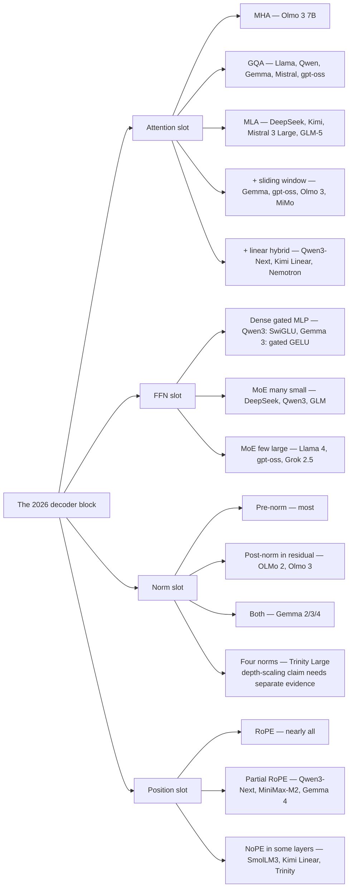
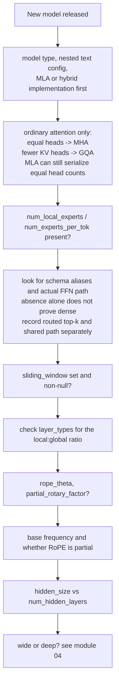

# 15 — Modern Architecture Case Studies

> **Prerequisites:** modules 05, 06, 09, 10, 12.
> **You will learn:** exactly what five flagship models do differently, and how to
> read any new model's config file using the vocabulary this course has built.

Source for this module: Sebastian Raschka, *The Big LLM Architecture Comparison*
(living document; the version used here was **last updated April 2026** and
covers 23 model families). Direct quotations are his.

---

## 15.0 The thesis

Raschka's opening question frames everything here:

> Sure, positional embeddings have evolved from absolute to rotational (RoPE),
> Multi-Head Attention has largely given way to Grouped-Query Attention, and the
> more efficient SwiGLU has replaced activation functions like GELU. But beneath
> these minor refinements, have we truly seen groundbreaking changes, or are we
> simply polishing the same architectural foundations?

By the end of this module you should be able to answer that yourself. The short
version: **many building blocks from module 06 recur, but the complete block is
not unchanged.** Hybrid models can replace attention with recurrent mixers,
split mixing and FFN into separate blocks, change norm placement, or add paths.
The vocabulary transfers; an identical computation graph does not.

He also states the caveat that should accompany every comparison here:

> Comparing LLMs to determine the key ingredients that contribute to their good
> (or not-so-good) performance is notoriously challenging: datasets, training
> techniques, and hyperparameters vary widely and are often not well documented.

Architecture is what we can see. It is not necessarily what makes a model good.

---

## 15.1 DeepSeek V3 / R1 — the efficiency architecture

**671B total / 37B active · 61 layers · MLA + MoE**

The most influential open architecture of the period. Kimi K2, Mistral 3 Large,
and GLM-5 all adopted parts of it.

| Component | Choice |
|---|---|
| Attention | **MLA** — compressed KV latent (module 09) |
| FFN | **MoE**, 256 experts, 8 routed + **1 shared** active |
| Expert hidden | 2048 (fine-grained) |
| First 3 layers | **dense**, not MoE |
| Norm | RMSNorm, pre-norm |
| Position | RoPE |
| Activation | SwiGLU |
| Extras | MTP (training), FP8 training |

### The two decisions that define it

**MLA over GQA.** Raschka explains the reasoning via the DeepSeek-V2 ablations:

> GQA appears to perform worse than MHA, whereas MLA offers better modeling
> performance than MHA, which is likely why the DeepSeek team chose MLA over GQA.

So MLA was not chosen only for the ~57× cache reduction — DeepSeek's own
measurements say it is *better*, not merely cheaper. Raschka's summary: "MLA is a
clever trick to reduce KV cache memory use while even slightly outperforming MHA
in terms of modeling performance."

**Fine-grained MoE with a shared expert.** 256 experts of hidden size 2048, 8
routed active plus 1 always-on shared. Raschka on the shared expert:

> This is likely because common or repeated patterns don't have to be learned by
> multiple individual experts, which leaves them with more room for learning more
> specialized patterns.

### Why it matters

37B active parameters delivering better benchmarks than the 405B dense Llama 3.
That comparison is what made MoE the default for frontier open models in 2025.

### The descendants

| Model | Relationship |
|---|---|
| **Kimi K2** (1T) | same architecture, scaled up; more experts, fewer MLA heads |
| **Mistral 3 Large** (675B) | "exactly the same architecture as DeepSeek V3 and V3.1"; experts 2× larger, half as many |
| **GLM-5** (744B) | adopted MLA + DeepSeek Sparse Attention |
| **DeepSeek V3.2** | V3 + sparse attention |

Raschka on Mistral's choice: "why change what ain't broke? A lot of the secret
sauce these days is in the training pipeline as well as the inference scaling
strategies."

---

## 15.2 Llama 4 Maverick — the conservative MoE

**400B total / 17B active · GQA + alternating MoE**

The instructive counterpoint to DeepSeek V3: same family of ideas, different
choices at nearly every knob.

| Component | Choice | vs DeepSeek V3 |
|---|---|---|
| Attention | **GQA** | MLA |
| MoE experts | 128 routed, **1 routed + 1 shared active** | 256 routed, 8 routed + 1 shared active |
| Expert hidden | **8192** (large) | 2048 (small) |
| Shared expert | **yes** | yes |
| MoE placement | **alternating** MoE/dense blocks | every block after the first 3 |
| Active params | 17B | 37B |

Raschka's summary:

> Llama 4 Maverick uses a more classic MoE setup with fewer but larger experts (2
> active experts with 8,192 hidden size each) compared to DeepSeek V3 (9 active
> experts with 2,048 hidden size each). Also, DeepSeek uses MoE layers in each
> transformer block (except the first 3), whereas Llama 4 alternates MoE and dense
> modules in every other transformer block.

Note that DeepSeek V3 is ~68% larger in total but has **more than twice** the
active parameters — the two models sit at very different sparsity levels.

### Reading it

Every Llama 4 choice is the conservative one: GQA over MLA (simpler, well-
supported kernels), few large experts (the older, better-understood MoE style),
alternating rather than pervasive MoE (less routing instability). Meta optimised
for deployability and reliability; DeepSeek optimised for efficiency at frontier
scale.

Raschka's own conclusion is appropriately humble: "Given the many small
differences between architectures, it is difficult to determine their exact
impact on final model performance. The main takeaway, however, is that MoE
architectures have seen a significant rise in popularity in 2025."

---

## 15.3 Qwen3 — the complete family

**Dense: 0.6B → 32B · MoE: 30B-A3B, 235B-A22B**

Qwen3 is the reference point Raschka compares nearly everything else against,
because it ships at every size in both dense and sparse variants.

| Component | Choice |
|---|---|
| Attention | GQA + **QK-Norm** |
| Norm | RMSNorm, pre-norm |
| Position | RoPE (YaRN optional, 32k → 131k) |
| Activation | SwiGLU |
| MoE (235B) | 128 experts, 8 active, **no shared expert** |
| Shape | **deeper and narrower** than Llama 3 |

### Deep and narrow

Comparing Qwen3 0.6B with Llama 3 1B, Raschka notes Qwen3 "is a deeper
architecture with more layers, whereas Llama 3 is a wider architecture with more
attention heads." The consequences he measured on an A100 with his own from-
scratch implementations: Qwen3 has a smaller memory footprint but "a slower
runtime (lower tokens/sec generation speed)" — depth cannot be parallelised.

### Why both dense and MoE

> Dense models are typically more straightforward to fine-tune, deploy, and
> optimize across various hardware. On the other hand, MoE models are optimized
> for scaling inference... By releasing both types, the Qwen3 series can support a
> broader range of use cases: dense models for robustness, simplicity, and
> fine-tuning, and MoE models for efficient serving at scale.

### The shared-expert story

Qwen3 **dropped** the shared expert that Qwen2.5-MoE had. Raschka asked; developer
Junyang Lin replied:

> At that moment we did not find significant enough improvement on shared expert
> and we were worrying about the optimization for inference caused by shared
> expert. No straight answer to this question honestly.

Then **Qwen3-Next** (Sept 2025) reversed it: 4× more experts *and* a shared expert
restored — both directions Raschka had predicted.

### Qwen3-Next — where Qwen went

An 80B-A3B model, 3× smaller than 235B-A22B, and a significant departure:

| Change | Detail |
|---|---|
| Experts | 4× more, **plus a shared expert** |
| Attention | **Gated DeltaNet + Gated Attention hybrid, 3:1** (module 10) |
| Context | 262k native (up from 32k / 131k with YaRN) |
| Training | **MTP**, also used for speculative decoding |

The gated attention layers are GQA with three stability tweaks: a sigmoid output
gate, zero-centered RMSNorm for QK-Norm, and partial RoPE. Raschka: "these are
essentially just stability changes to GQA."

**Qwen3-Coder-Next** (Feb 2026) uses the identical architecture, trained from
Qwen3-Next as a base, and reaches SWE-Bench Pro performance "roughly on par with
Claude-Sonnet-4.5" — a good illustration of the module-13 point that post-training
now drives most differentiation.

---

## 15.4 Gemma 3 / Gemma 4 — efficiency through locality

**Gemma 3: 27B · Gemma 4: 31B dense + 26B-A4B MoE**

Gemma 3's prominent long-context mechanism is **sliding-window attention**.
Gemma 4 retains locality and also offers an MoE variant; these choices are not
mutually exclusive.

| Component | Choice |
|---|---|
| Attention | **GQA + sliding window, 5:1 local:global** |
| Window | **1024** (Gemma 2 used 4096) |
| Norm | RMSNorm, **both pre- and post-** each sublayer |
| Position | RoPE (Gemma 4: **p-RoPE**, 25% of frequency pairs) |
| Vocabulary | unusually large (multilingual) |
| Gemma 4 extra | global layers set **values = keys** |

### The sliding-window design

Gemma 2 used a 1:1 ratio with a 4096 window. Gemma 3 moved to **5:1** and shrank
the window to **1024** — "this shifts the model's focus towards more efficient,
localized computations."

The ablation Raschka cites shows "little to no impact on the LLM-generated output
perplexity." Substantial cache reduction, essentially free.

### The distinctive norm placement

Gemma uses **both** pre- and post-norm around each sublayer. This is not unique
across the full table: the pinned Trinity implementation also uses four norms.
Raschka's read:

> I think this normalization layer placement is a relatively intuitive approach as
> it gets the best of both worlds: Pre-Norm and Post-Norm. In my opinion, a bit of
> extra normalization can't hurt. In the worst case, if the extra normalization is
> redundant, this adds a bit of inefficiency through redundancy.

### Gemma 4's near-identical architecture

Raschka: Gemma 4 (31B) "looks pretty much unchanged compared to Gemma 3 (27B)."
Two small changes:

1. **In global layers, `values = keys`** — reusing the key tensor as the value
   tensor, "which should result in further KV cache size reduction."
2. **p-RoPE at 25%** — only a quarter of frequency pairs get positional
   information, reducing "positional noise in long-context situations."

And the lesson he draws is the most important one in this module:

> But let's not be fooled by the lack of big(ger) architectural changes. Looking
> at the benchmarks, Gemma 4 is a huge leap from Gemma 3!

Gemma 4 (31B) ranks comparably to Qwen3.5-397B-A17B on the AI Arena leaderboard —
though he immediately notes "arena scores are a bit problematic as they can be
gamed and are biased towards human (style) preference," and cross-checks against
standard benchmarks, where the leap holds.

**Similar high-level architecture, reported quality jump.** This is consistent
with training and post-training mattering substantially, but it does not isolate
their causal contribution. Data, implementation details, evaluation conditions,
and architectural changes are not controlled in this comparison.

### Gemma 3n — a different axis

The on-device variant uses **Per-Layer Embedding (PLE)**: keep only a subset of
parameters in GPU memory and stream modality-specific embeddings from CPU or SSD
on demand. Plus **MatFormer** (Matryoshka Transformer) — one shared architecture
sliceable into smaller independently-usable models, so you run only the part you
need.

---

## 15.5 Kimi K2 — DeepSeek V3, scaled to a trillion

**1T total / 32B active · MLA + MoE**

| Component | Choice |
|---|---|
| Architecture | **DeepSeek V3**, scaled |
| Attention | MLA, **fewer heads** than V3 |
| MoE | **more experts** than V3 (384), shared expert retained |
| Optimizer | **Muon** variant, not AdamW |
| Context | 128k (256k in the Thinking variant) |

Raschka:

> It's also coming full circle as Kimi K2 uses the DeepSeek V3 architecture we
> covered at the beginning of this article except they made it larger... Kimi K2
> is basically the same as DeepSeek V3, except that it uses more experts in the
> MoE modules and fewer heads in the Multi-head Latent Attention (MLA) module.

At the time of writing it "may be the biggest LLM of this generation" — with the
caveat that Google's 1.6T Switch Transformer "is an encoder-decoder architecture
from a different generation" (module 08).

### The Muon story

The genuinely novel element is the **optimizer**, not the architecture:

> A notable aspect is its use of a variant of the relatively new Muon optimizer
> over AdamW. As far as I know, this is the first time Muon was used over AdamW for
> any production model of this size (previously, it has only been shown to scale
> up to 16B).

And his careful reading of the evidence — worth reproducing because it models good
skepticism:

> While people commented that the loss was exceptionally smooth (due to the lack
> of spikes), I think it's not exceptionally smooth (e.g., see the OLMo 2 loss
> curve...; also, the L2 norm of the gradient would probably be a better metric to
> track training stability). However, what's remarkable is how well the loss curve
> decays.

**Kimi K2 Thinking** (Nov 2025) has an unchanged architecture with context
extended from 128k to 256k.

### Kimi Linear — the other branch

A 48B model exploring linear attention: Kimi Delta Attention (channel-wise gated
DeltaNet) follows a **3:1 repeating motif** with **MLA** global layers, using
**NoPE** in the MLA layers. The released 27-layer config contains **20 KDA and
7 MLA layers**, including a final global layer that breaks the exact overall
ratio. The reported accuracy and speed comparisons are workload-dependent
vendor results, not properties established by the config.

Raschka's caveat: it is "20x smaller than Kimi K2. It will be interesting to see
if the Kimi team adopts this approach for their upcoming K3 model." Unproven at
frontier scale.

---

## 15.6 The master comparison



### Full table

| Model | Size (total/active) | Attention | MoE | Shared expert | Norm | Position |
|---|---|---|---|---|---|---|
| **DeepSeek V3** | 671B / 37B | MLA | 256 exp, 8+1 | **yes** | pre-RMS | RoPE |
| **Llama 4 Maverick** | 400B / 17B | GQA | 128 routed, 1+1 shared, alternating | yes | pre-RMS | RoPE/NoPE interleaving |
| **Qwen3 235B** | 235B / 22B | GQA + QK-Norm | 128 exp, 8 | no | pre-RMS | RoPE |
| **Qwen3-Next** | 80B / 3B | GatedDeltaNet+Attn 3:1 | 512 exp, 10+1 | **yes** | pre-RMS | partial RoPE |
| **Gemma 3** | 27B dense | GQA + SWA 5:1 | — | — | **pre+post** | RoPE |
| **Gemma 4** | 31B dense / 26B-A4B MoE | GQA + SWA 5:1, global V=K | MoE variant: 128 routed, 8 active | yes in MoE variant | **pre+post**, additional MoE norms | global p-RoPE 25% |
| **Kimi K2** | 1T / 32B | MLA | 384 exp, 8+1 | **yes** | pre-RMS | RoPE |
| **Kimi Linear** | 48B / 3B | KDA + MLA 3:1 motif; **20:7 actual layers** | 256 routed, 8 active | yes, 1 | pre-RMS | **NoPE** in MLA |
| **OLMo 2 / Olmo 3 7B** | 7B | **MHA**; Olmo 3 SWA 3:1 | — | — | **post-in-residual** | RoPE; pinned Olmo 3 uses YaRN, OLMo 2 does not |
| **Mistral Small 3.1** | 24B | GQA, **no SWA** | — | — | pre-RMS | RoPE |
| **Mistral 3 Large** | 675B / 41B multimodal; 673B / 39B text | MLA (DeepSeek-related) | 128 routed, 4 active; width 4096 | **yes**, 1 | pre-RMS claim not separately checked | RoPE |
| **gpt-oss-120b** | 117B / 5.1B | GQA + SWA 1:1, **sinks**, **attn bias** | **128 experts, 4 active** | no | pre-RMS | RoPE |
| **GLM-4.5** | 355B / 32B | GQA + QK-Norm, attn bias | 160 exp, 8, **3 dense first** | **yes** | pre-RMS | partial RoPE, factor 0.5 |
| **GLM-5** | 744B / 40B | **MLA + DeepSeek Sparse Attn** | 256 exp | **yes** | pre-RMS | RoPE |
| **MiniMax-M2** | 230B / 10B | GQA + **per-layer QK-Norm** | 256 experts, 8 routed active | no | pre-RMS | **partial RoPE**, 64 of 128 dimensions |
| **SmolLM3** | 3B | GQA | — | — | pre-RMS | **NoPE every 4th layer** |
| **Grok 2.5** (snapshot label) | 270B, not independently confirmed | GQA claim; example repository is named Grok 2 | **8 large experts** in example config | residual-MoE field; shared equivalence unverified | unverified for snapshot identity | RoPE in example config |
| **Nemotron 3 Nano** | 30B / **3.5B vendor-reported active** | **Mamba-2 hybrid**, 6 GQA blocks | 128 routed, 6+1 | **yes** | pre-RMS per mixer block | **NoPE in inspected attention paths** |
| **Trinity Large** | about 400B / 13B; vendor says 398B | GQA + SWA 3:1 + **gating** | 256 routed, 4 active; 6 dense first | yes, 1 | **4 pre/post norms**; depth gain unverified | **NoPE** global |
| **Xiaomi MiMo-V2-Flash** | 309B / 15B | GQA + SWA 5:1 motif; 39 local / 9 global, **window 128** | 256 routed, 8 active | none configured | pre-RMS | partial global RoPE; separate local RoPE |

### What is universal in 2026

Common patterns in this historical snapshot, not requirements for every model:

- **Decoder-only** architecture
- **RMSNorm** in many language backbones, with placement and scope differences
- **Gated FFNs** are common, including SwiGLU and Gemma 3's GELU-based gate;
  the pinned Nemotron Nano MLP instead uses an ungated ReLU-squared path
- **Residual connections** around both sublayers
- **RoPE** or a deliberate variant of it
- **Some form of KV reduction** — GQA, MLA, sliding window, or linear

### What genuinely varies

| Axis | Range |
|---|---|
| Attention | MHA → GQA → MLA → linear hybrids |
| Norm placement | pre / post-in-residual / both / four norms; Trinity's exact depth-gain claim remains partial |
| MoE granularity | 8 huge experts (Grok) → 512 small (Qwen3-Next) |
| Shared expert | yes / no — genuinely contested |
| Sparsity | roughly 4% of rounded MiniMax-M2 total parameters → 100% (dense); expert selection fraction is a different quantity |
| Position | full RoPE / partial RoPE / NoPE in some layers |
| Locality | none / SWA 1:1 / 3:1 / 5:1, windows 128–4096 |

---

## 15.7 How to read a new model in ten minutes

The practical payoff of this course. Open any model's `config.json` and answer:



| Config key | Tells you | Module |
|---|---|---|
| `num_attention_heads` / `num_key_value_heads` | MHA vs GQA vs MQA only after ruling out MLA/hybrid semantics | 09 |
| `kv_lora_rank`, `q_lora_rank` | MLA | 09 |
| `num_local_experts`, `num_experts_per_tok` and vendor aliases | MoE granularity, top-k; missing fields do not prove dense | 12 |
| `n_shared_experts` | shared expert | 12 |
| `first_k_dense_replace` | dense layers before MoE | 12 |
| `sliding_window`, `layer_types` | locality pattern | 10 |
| `rope_theta`, `partial_rotary_factor` | candidate position settings; confirm the attention path actually uses them | 05 |
| `rope_scaling` | YaRN / long-context extension | 05 |
| `hidden_size`, `intermediate_size` | width, `d_ff` ratio | 07 |
| `num_hidden_layers` | depth | 04 |
| `use_qk_norm` | QK-Norm | 06 |
| `attention_bias` | the gpt-oss/GLM curiosity | 07 |

**Worked example — a hypothetical config:**

```json
{
  "num_attention_heads": 64,
  "num_key_value_heads": 8,
  "num_hidden_layers": 62,
  "hidden_size": 5120,
  "intermediate_size": 1536,
  "num_local_experts": 160,
  "num_experts_per_tok": 8,
  "n_shared_experts": 1,
  "first_k_dense_replace": 3,
  "sliding_window": null,
  "rope_theta": 1000000.0,
  "use_qk_norm": true
}
```

Reading: GQA with group size 8 · 62 layers · MoE with 160 fine-grained experts,
top-8 plus one shared · first 3 layers dense · no sliding window · RoPE with a
large base (long-context tuned) · QK-Norm on. **This is GLM-4.5-shaped.**

---

## Reconciling the sources

**The playlist is the wrong tool here** — it teaches the 2017 architecture, and
every model in this module differs from it in at least five components. But
without modules 03–08 the table is unreadable. The playlist gives the vocabulary;
Raschka gives the data.

**The article is a living document.** The version used here was last updated April
2026 with 23 model families; earlier versions had 6. Section numbers and the model
set will change. Treat the *table* as a snapshot and the *method* — read the
config, map each slot to a module — as the durable part.

**Benchmarks are not architecture.** Raschka repeatedly declines to draw
architectural conclusions from benchmark results, and where he makes an exception
(GLM-5, Gemma 4) he flags it. Gemma 4 is the cleanest evidence for why: near-
similar architecture to Gemma 3, a reported benchmark leap. The comparison does
not establish that training alone caused the improvement; a block diagram omits
many confounding differences.

---

## Evidence and executable configuration reading

The table is an April-2026 comparison snapshot, not a live leaderboard or a
claim that every row was independently reproduced. Distinguish measured vendor
facts, implementation facts and explanations proposed by the author. For
example, alternate dense/MoE placement is observable; "chosen to reduce routing
instability" is a hypothesis unless supported by an ablation.

Two important primary-source corrections are material here: [Meta's Llama 4
announcement](https://ai.meta.com/blog/llama-4-multimodal-intelligence/) describes
128 routed experts plus a shared expert for Maverick, and the
[versioned Llama 4 implementation](https://github.com/huggingface/transformers/blob/v4.55.4/src/transformers/models/llama4/modeling_llama4.py)
has a separate shared path. "Two active" is not two routed experts.
[Gemma 3's configuration](https://huggingface.co/docs/transformers/model_doc/gemma3)
uses a GELU-based gate, so SwiGLU is not universal.

For every real checkpoint record vendor repository, exact revision, model size,
text-only versus multimodal scope, config fields and implementation version.
A vision tower/projector belongs in total parameter counts but not in a
text-decoder KV calculation. Some fields describe defaults rather than the
chosen released size; remote/custom modeling code may override generic helpers.
Do not execute untrusted remote code merely to inspect a JSON configuration.

### Pinned checkpoint evidence, row by row

The cited article's **23-family** description is not the number of rows in this
lesson: the master table contains **20 rows**, combines OLMo 2 with Olmo 3, and
combines Gemma 4 dense with MoE. This evidence pass accounts for every one of
those 20 rows. It does not silently claim coverage of every family mentioned
elsewhere in the article or every variant mentioned in this lesson.

The [machine-readable ledger](./code/provenance/ledger.json) records **22 checkpoint
config attempts, 20 public JSON snapshots, 370 exact JSON-pointer assertions,
and 42 immutable implementation/model-card references**. The original downloaded
bytes are preserved with SHA-256 hashes. The blocked requests were Llama 4
Maverick and Gemma 3: both required authentication, so no credentials, access
workarounds, gated weights, or remote model code were used. Public native vendor
sources supply explicitly different evidence for those two rows.

These revisions were retrieved for this audit. They identify reproducible
**example checkpoints now**, not an archived reconstruction of the author's
April-2026 table. A current model card at an immutable revision can itself
describe later family additions. The ledger therefore separates current source
identity, the historical label, and the claim being supported.

| Model row | Immutable primary configuration or alternative | Concrete finding |
|---|---|---|
| DeepSeek V3 | [vendor config, e815299b](https://huggingface.co/deepseek-ai/DeepSeek-V3/blob/e815299b0bcbac849fa540c768ef21845365c9eb/config.json) | MLA latent 512; 256 routed, top-8 plus 1 shared; 61 layers, first 3 dense |
| Llama 4 Maverick | [Meta model card](https://github.com/meta-llama/llama-models/blob/0e0b8c519242d5833d8c11bffc1232b77ad7f301/models/llama4/MODEL_CARD.md) and [native SKU mapping](https://github.com/meta-llama/llama-models/blob/0e0b8c519242d5833d8c11bffc1232b77ad7f301/models/sku_list.py#L101) | Meta reports 400B total, 17B active and 128 experts; SKU architecture arguments are empty, not replacement config bytes |
| Qwen3 235B | [vendor config, 8efa6172](https://huggingface.co/Qwen/Qwen3-235B-A22B/blob/8efa61729e24bd65b1d152b5ab5409052aa80e65/config.json) | 64 query / 4 KV heads; 128 top-8 experts; configured context 40,960 |
| Qwen3-Next | [vendor config, 9c7f2fbe](https://huggingface.co/Qwen/Qwen3-Next-80B-A3B-Instruct/blob/9c7f2fbe84465e40164a94cc16cd30b6999b0cc7/config.json) | 512 top-10 experts, shared width 512; full-attention interval 4; partial RoPE 0.25 |
| Gemma 3 | [Google's 27B-v3 constructor](https://github.com/google/gemma_pytorch/blob/014acb7ac4563a5f77c76d7ff98f31b568c16508/gemma/config.py#L277) | 62 layers, 32 query / 16 KV heads, window 1024, five-local/one-global repeating motif; native implementation evidence, not gated JSON |
| Gemma 4 | [31B dense config](https://huggingface.co/google/gemma-4-31B-it/blob/842da3794eaa0b77d5f08bae87a17459d91ff475/config.json) and [26B-A4B config](https://huggingface.co/google/gemma-4-26B-A4B-it/blob/4d7ae4984b7db7de8f8457170b3f1a419ee76d52/config.json) | 60 versus 30 text layers; separate local/global head shapes; MoE flag differs, 128 top-8 in the MoE variant |
| Kimi K2 | [vendor config, fd1984e2](https://huggingface.co/moonshotai/Kimi-K2-Instruct/blob/fd1984e2b7a3350dbf7305fe73a4ede25c14de50/config.json) | 64 MLA heads, 384 top-8 plus 1 shared; only first **1** layer dense, versus DeepSeek's 3 |
| Kimi Linear | [vendor config, e1df551a](https://huggingface.co/moonshotai/Kimi-Linear-48B-A3B-Instruct/blob/e1df551a447157d4658b573f9a695d57658590e9/config.json) | 20 KDA / 7 MLA layers; 256 top-8 plus 1 shared; MLA NoPE enabled |
| OLMo 2 / Olmo 3 7B | [OLMo 2 config](https://huggingface.co/allenai/OLMo-2-1124-7B/blob/7df9a82518afdecae4e8c026b27adccc8c1f0032/config.json) and [Olmo 3 config](https://huggingface.co/allenai/Olmo-3-7B-Think/blob/d97e442d7cc678210054dbcc9b440894d62c89a4/config.json) | Both 32 query / 32 KV heads; Olmo 3 has 24 sliding / 8 full layers, window 4096 and YaRN; OLMo 2 has no configured YaRN |
| Mistral Small 3.1 | [vendor config, 68faf511](https://huggingface.co/mistralai/Mistral-Small-3.1-24B-Instruct-2503/blob/68faf511d618ef198fef186659617cfd2eb8e33a/config.json) | Text config is nested; 32 query / 8 KV heads and null sliding window |
| Mistral 3 Large | [native params.json, 383ffea2](https://huggingface.co/mistralai/Mistral-Large-3-675B-Instruct-2512/blob/383ffea2c7d60dfd44ca960e8e691709d4fdb9cd/params.json) | Different schema: `moe.num_experts=128`, top-4, 1 shared, expert width 4096; no `config.json` at this revision |
| gpt-oss-120b | [vendor config, b5c939de](https://huggingface.co/openai/gpt-oss-120b/blob/b5c939de8f754692c1647ca79fbf85e8c1e70f8a/config.json) | Exactly **128** experts, top-4; 18 sliding / 18 full layers, window 128; attention bias true |
| GLM-4.5 | [vendor config, cbb2c7cf](https://huggingface.co/zai-org/GLM-4.5/blob/cbb2c7cfb52fa128a9660cb1a7a78e017899e115/config.json) | 92 layers, 96 query / 8 KV heads; QK norm and attention bias; partial RoPE 0.5 |
| GLM-5 | [vendor config, c183ef8c](https://huggingface.co/zai-org/GLM-5/blob/c183ef8c61faee82855eca1ed9bb3a9a7ce3b0b2/config.json) | MLA latent 512; indexer 32 heads, top-2048; 256 top-8 plus 1 shared |
| MiniMax-M2 | [vendor config, 757303d4](https://huggingface.co/MiniMaxAI/MiniMax-M2/blob/757303d492a50514c312788b5247a4f696a4c6a3/config.json) | 256 top-8; shared width zero; QK norm `per_layer`; rotary width 64 of head width 128 |
| SmolLM3 | [vendor config, a07cc9a0](https://huggingface.co/HuggingFaceTB/SmolLM3-3B/blob/a07cc9a04f16550a088caea529712d1d335b0ac1/config.json) | 16 query / 4 KV heads; every fourth `no_rope_layers` entry is zero; implementation interprets zero as NoPE |
| Grok 2.5 | [xAI's **Grok 2** config](https://huggingface.co/xai-org/grok-2/blob/daf4395a80ad177386cfe39641b64fc12b1d70ed/config.json) | This example has 8 top-2 experts and `residual_moe=true`; identity with the historical Grok 2.5 label remains unresolved |
| Nemotron 3 Nano | [vendor config, bf77c317](https://huggingface.co/nvidia/NVIDIA-Nemotron-3-Nano-30B-A3B-BF16/blob/bf77c3174f68ad409e1c2aa60daeb46e32d1c606/config.json) | 52 blocks: 23 Mamba, 23 MoE, 6 attention; 32 query / 2 KV heads; 128 top-6 plus 1 shared |
| Trinity Large | [vendor config, b2a665b4](https://huggingface.co/arcee-ai/Trinity-Large-Base/blob/b2a665b40e5d67b05fb164205cf63155f7958e2a/config.json) | 256 top-4 plus 1 shared; 6 dense first; 45 sliding / 15 full layers |
| Xiaomi MiMo-V2-Flash | [vendor config, 1afd314a](https://huggingface.co/XiaomiMiMo/MiMo-V2-Flash/blob/1afd314a2406c282e0956375c34a676501c78649/config.json) | Actual pattern has 39 sliding / 9 global layers; window 128; separate local/global KV head counts |

### Per-cell coverage

**C** means listed config fields support the cell's configuration components.
**I** means a pinned implementation was inspected. **V** means vendor-reported,
not independently measured. **P** means partial support with an explicit remaining
claim. **U** means unverified or unresolved identity. **N/A** applies to a dense
example. These are evidence kinds, not a single numerical confidence score:
370 matching fields do not prove 370 architectural or empirical conclusions.

| Model | Size | Attention | MoE | Shared expert | Norm | Position |
|---|---|---|---|---|---|---|
| DeepSeek V3 | V | C | C | C | I | C |
| Llama 4 Maverick | V | U | P | I | I | U |
| Qwen3 235B | V | C | C | I | I | C |
| Qwen3-Next | V | C | C | C | I | C |
| Gemma 3 | U | I | I | N/A | I | I |
| Gemma 4 | V | C | C | I | I | C |
| Kimi K2 | V | C | C | C | I | C |
| Kimi Linear | V | C | C | C | I | C |
| OLMo 2 / Olmo 3 7B | U | C | I | N/A | I | C |
| Mistral Small 3.1 | V | C | I | N/A | I | C |
| Mistral 3 Large | V | C | C | C | U | C |
| gpt-oss-120b | V | C | C | I | I | C |
| GLM-4.5 | V | C | C | C | I | C |
| GLM-5 | V | C | C | C | I | C |
| MiniMax-M2 | V | C | C | C | I | C |
| SmolLM3 | V | C | I | N/A | I | I |
| Grok 2.5 | U | U | U | U | U | U |
| Nemotron 3 Nano | V | C | C | C | I | I |
| Trinity Large | V | C | C | C | P | I |
| Xiaomi MiMo-V2-Flash | V | C | C | C | I | C |

Each C cell in the ledger names the relevant JSON pointers, not just a repository
link. Each I cell links a full commit, source-file hash and inspected symbols.
Some compound cells still combine kinds: head counts do not prove sink behavior,
QK-normalization placement, or a linear-attention recurrence. Read the scope note
and the implementation reference for those components. A field such as
`rms_norm_eps` does not establish whether normalization happens before or after
a residual branch.

### What checking the actual sources changed

**A RoPE field can be unused.** The pinned
[Nemotron attention implementation](https://huggingface.co/nvidia/NVIDIA-Nemotron-3-Nano-30B-A3B-BF16/blob/bf77c3174f68ad409e1c2aa60daeb46e32d1c606/modeling_nemotron_h.py#L933)
projects Q/K/V and performs attention without applying rotary embeddings; the
other inspected attention paths agree. Its config still serializes `rope_theta`.
Its MLP uses `relu2` and two projections, not a SwiGLU gate. This corrects the
table's position claim and the idea that every family uses the same FFN block.

**Layer motifs are not always total ratios.** Kimi Linear's full layers are
numbered 4, 8, 12, 16, 20, 24 and 27. MiMo's serialized pattern includes boundary
exceptions to the advertised five-local/one-global motif. Compute layer counts
from the actual list before calculating cache memory. Do not replace a concrete
schedule with a rounded ratio in a memory budget.

**Variants change parameter accounting.** The pinned
[Mistral model card](https://huggingface.co/mistralai/Mistral-Large-3-675B-Instruct-2512/blob/383ffea2c7d60dfd44ca960e8e691709d4fdb9cd/README.md)
distinguishes 675B total / 41B active for the multimodal model from 673B / 39B for
the language backbone. The [Nemotron card](https://huggingface.co/nvidia/NVIDIA-Nemotron-3-Nano-30B-A3B-BF16/blob/bf77c3174f68ad409e1c2aa60daeb46e32d1c606/README.md)
reports 3.5B active despite the A3B name. Rounded model names are not an exact
weight inventory or a uniform definition of active parameters.

**Expert fraction is not parameter fraction.** MiniMax selects 8 of 256 routed
experts, or 3.125% of those experts, while its model card reports rounded totals
of 230B and 10B active. The old 4.37% precision is not justified by those rounded
numbers. Dense attention, embeddings, shared paths, and dense layers change the
relationship between expert selection and total active weights.

**The shared-path column needs implementation evidence.** The inspected
[Gemma 4 decoder](https://github.com/huggingface/transformers/blob/8eaf75f84e0ef68ccdaac14b739ace53a962bbee/src/transformers/models/gemma4/modeling_gemma4.py#L1355)
adds routed experts to an always-on MLP in the MoE variant, with extra norm paths.
The [Trinity decoder and MoE](https://github.com/huggingface/transformers/blob/8eaf75f84e0ef68ccdaac14b739ace53a962bbee/src/transformers/models/afmoe/modeling_afmoe.py#L208)
also have a shared path. Conversely, an absent shared-expert key alone would not
prove that a shared path does not exist. The precise Trinity depth-scaled gain
claim remains outside what the inspected forward path establishes.

**Context limits have several meanings.** The pinned
[Qwen3 model card](https://huggingface.co/Qwen/Qwen3-235B-A22B/blob/8efa61729e24bd65b1d152b5ab5409052aa80e65/README.md)
distinguishes native 32,768-token support, a 40,960 configured allocation, and
131,072 with optional YaRN settings. These are not contradictory measurements
of one quantity. Similarly, the earlier 62-layer, 64-query-head GLM-shaped example
is intentionally synthetic: the real GLM-4.5 config has 92 layers and 96 query
heads. A plausible-looking JSON object is not a vendor specification.

### Reproduce the evidence checks

From a repository checkout, with the adjacent `provenance` directory preserved:

```bash
python content/courses/transformers/code/architecture_provenance.py
python site/test_transformer_provenance.py
```

For a standalone copy, keep `architecture_provenance.py` beside a `provenance`
directory containing `ledger.json` and the `configs` subdirectory with all 20
snapshot files. Run `python architecture_provenance.py` from that copy. Downloading
only the checker or only the ledger is insufficient: byte-integrity checks need
the actual snapshots. The repository tree contains that complete hierarchy;
`--root /path/to/provenance` selects a different local evidence directory.

The [offline checker](./code/architecture_provenance.py) validates snapshot hashes,
full revision identifiers, strict JSON values, pointer bindings, and all 120
cell-status records. It never imports downloaded modeling files or downloads
weights. The repository tests also reject tampered bytes, stale expected fields,
missing or misleading cell references, and regressions in the corrected table.
Implementation/model-card hashes record bytes inspected during this audit;
the offline checker does not fetch those files again or certify their semantics.

**Precisely what remains:** two gated JSON files; Maverick's exact checkpoint
attention/position settings and expert-width/placement details; the Grok 2.5
identity mismatch; independent parameter inventories; Mistral Large 3 norm
placement; and Trinity's exact depth-gain interpretation. The matrix leaves
**11 U cells and 2 P cells** explicit. The Gemma 3 and OLMo size U entries mean
no independent size statement was pinned in this pass, not evidence that the
7B/27B family names are wrong. Off-table Gemma 3n, Qwen3-Coder-Next, Kimi Thinking,
DeepSeek V3.2 and other descendants are not separately pinned here. Benchmark
quality, training causality, optimizer comparisons, throughput and runtime
backend behavior require different evidence; config inspection does not settle
them.

### Synthetic schema exercise

The following two **synthetic schemas** are a parser exercise, not vendor
checkpoints. One has explicit head width different from residual width/H;
the other nests its text configuration. They deliberately catch the two common
accounting mistakes without downloading large models.

```python transformer-check
def projection_and_cache(config, batch=1, length=1024, bytes_per_value=2):
    c = config.get('text_config', config)
    d, h = c['hidden_size'], c['num_attention_heads']
    hk = c.get('num_key_value_heads', h)
    dh = c['head_dim'] if 'head_dim' in c else d // h
    assert h % hk == 0
    if 'head_dim' not in c:
        assert d % h == 0
    attention_weights = 2 * d * h * dh + 2 * d * hk * dh
    cache_bytes = batch * length * c['num_hidden_layers'] * hk * (2 * dh) * bytes_per_value
    return attention_weights, cache_bytes
flat = dict(hidden_size=12, num_attention_heads=3, num_key_value_heads=1,
            head_dim=6, num_hidden_layers=2)
nested = dict(text_config=dict(hidden_size=12, num_attention_heads=3,
                              num_key_value_heads=1, num_hidden_layers=2),
              vision_config=dict(hidden_size=99))
assert projection_and_cache(flat) == (576, 49152)
assert projection_and_cache(nested) == (384, 32768)
print("Explicit head width and nested text schemas produce different budgets.")
```

This calculation assumes equal K/V widths, all-global attention, bias-free
projections and an unsharded GQA cache. MLA, local/global mixtures, KV sharing,
quantization metadata and MoE routing require the corresponding formulas from
09-12. The earlier GLM-shaped JSON is also a teaching configuration, not an
assertion that a vendor shipped precisely those values.

## Key takeaways

- **Module 06 supplies recurring building blocks, not an identical graph for every
  model.** Hybrid mixers, extra paths, and norm placement change the computation.
- **DeepSeek V3** — MLA + fine-grained MoE with a shared expert + dense first 3
  layers. 37B active outperforming 405B dense Llama 3 is what made MoE the norm.
- **Llama 4 Maverick** — GQA rather than MLA, one large routed plus one shared
  expert active, and alternating rather than pervasive MoE.
- **Qwen3** — the reference family. Ships dense *and* MoE; deeper-and-narrower than
  Llama; dropped the shared expert, then Qwen3-Next added it back with 4× more
  experts and a 3:1 Gated DeltaNet hybrid.
- **Gemma 3/4** — efficiency through locality: 5:1 sliding window with a 1024
  window, and pre-**and**-post norm placement. Gemma 4 adds `values =
  keys` in global layers and 25% p-RoPE.
- **Kimi K2** — DeepSeek V3 scaled to 1T with more experts and fewer MLA heads. Its
  real novelty is the **Muon** optimizer at production scale.
- Common patterns, with model-specific exceptions: decoder-only language
  backbones, RMSNorm, gated FFNs, residuals, positional schemes, and *some*
  KV-reduction scheme.
- Genuinely contested: shared experts, expert granularity, norm placement, and
  whether linear attention is production-ready.
- **Gemma 4 is a useful comparison**: similar high-level architecture to Gemma 3,
  reported quality gains. Architecture alone does not explain the scores, but an
  uncontrolled comparison cannot quantify the contributions of training or
  individual architectural changes.
- A config provides a first-pass map, not a complete architectural proof. Native
  schemas, model variants, implementation paths, and source revisions matter;
  the evidence ledger makes those distinctions concrete.

## Self-check

1. DeepSeek V3 and Llama 4 Maverick are both large MoE models released months
   apart. List four architectural decisions where they differ, and give the
   plausible motivation for each of Meta's choices.
2. Gemma 4's architecture is nearly identical to Gemma 3's, yet benchmarks improved
   substantially. What does this tell you about the relative contribution of
   architecture versus training — and which earlier module makes the same point?
3. You are handed a config with `num_attention_heads: 128`, `kv_lora_rank: 512`,
   `num_local_experts: 384`, `n_shared_experts: 1`. Identify the attention scheme,
   the MoE style, and the model family it most resembles.

---

**Next → [16 — End-to-End Forward Pass](./16-end-to-end-forward-pass.md)**
