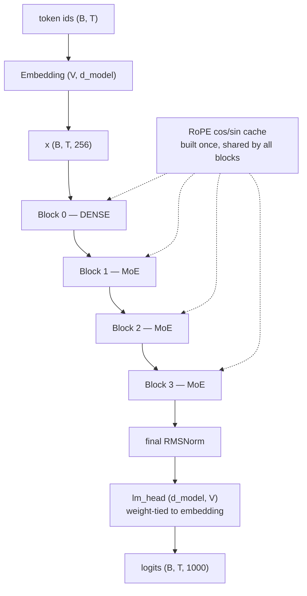
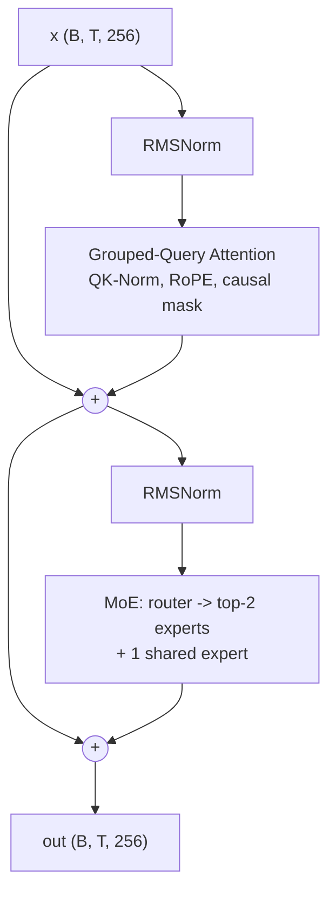
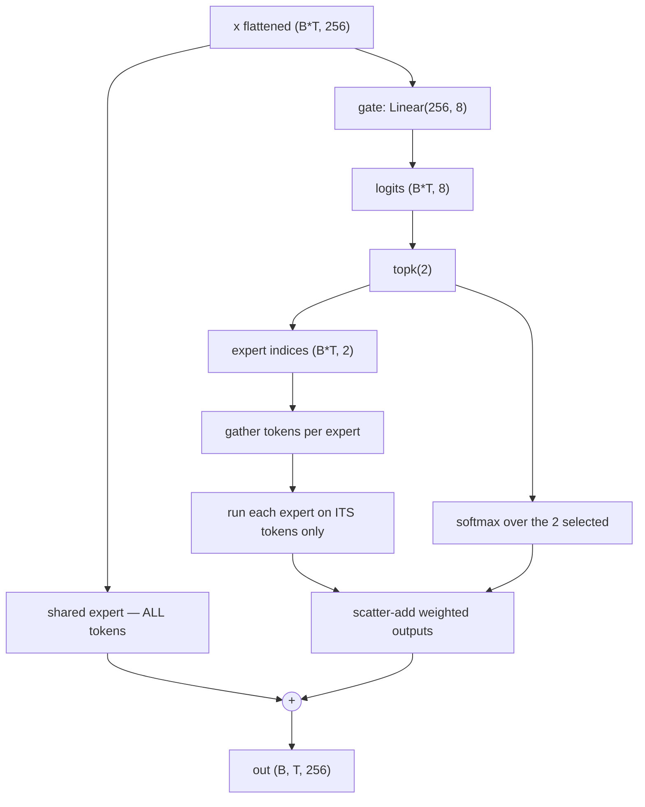
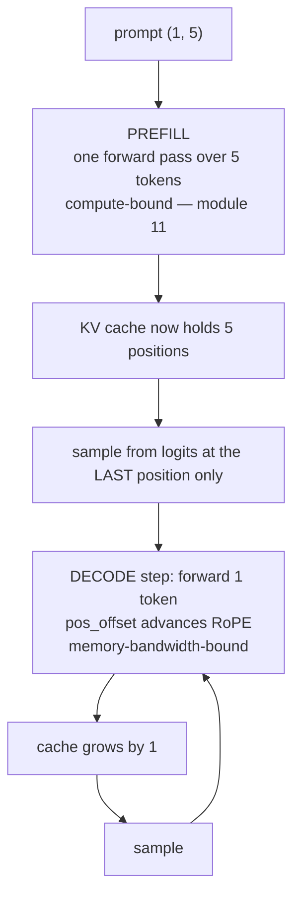

# 16 — Putting It Together: An Annotated End-to-End Forward Pass

> **Prerequisites:** modules 01–15.
> **You will learn:** how every component assembles into one working model, with
> real shapes at every step, from a runnable implementation.

The complete implementation lives at **[`code/modern_decoder.py`](./code/modern_decoder.py)**.
It runs standalone:

```bash
python code/modern_decoder.py
```

Every number in this module is copied from that program's actual output, not
estimated.

---

## 16.1 The model

A small decoder-only Transformer combining the whole course:

| Slot | Choice | Module |
|---|---|---|
| Normalization | RMSNorm, **pre-norm** | 06 |
| Position | **RoPE** (applied in every layer) | 05 |
| Attention | **GQA**, 8 query heads / 2 KV heads | 09 |
| Score stability | **QK-Norm** before RoPE | 06 |
| FFN | **SwiGLU** | 07 |
| Sparsity | **MoE**, 8 experts, top-2, + 1 shared | 12 |
| First layer | **dense** (not MoE) | 12 |
| Masking | causal | 08 |
| Inference | **KV cache** | 11 |
| Output | weight-tied `lm_head` | 02 |

```python
@dataclass
class Config:
    vocab_size: int = 1000
    d_model: int = 256
    n_layers: int = 4
    n_heads: int = 8            # query heads
    n_kv_heads: int = 2         # -> GQA group size 4
    d_head: int = 32
    d_ff: int = 512             # dense-layer FFN width
    n_experts: int = 8
    n_experts_active: int = 2   # top-k
    n_shared_experts: int = 1
    d_expert: int = 128         # fine-grained: narrower than d_ff
    first_k_dense: int = 1      # layer 0 is dense
    rope_theta: float = 10000.0
    max_seq_len: int = 512
    norm_eps: float = 1e-6
```

This is DeepSeek-shaped in miniature: MoE with a shared expert, dense first
layer, fine-grained experts. Swap `n_kv_heads = 8` and you have MHA; set
`n_experts = 0` and you have Llama-3-shaped.

## 16.2 The full architecture



And one block:



Note the two residual additions taking their input from *before* each norm. That
is pre-norm (module 06): the residual stream is never normalized in place.

## 16.3 The shape trace

Real output, `B = 1`, `T = 6`, tracing through block 1 (an MoE block):

```
token ids                        (1, 6)
after embedding                  (1, 6, 256)
after RMSNorm (pre-norm)         (1, 6, 256)

  --- attention sublayer ---
Q  (H=8 query heads)             (1, 8, 6, 32)
K  (H_kv=2 kv heads)             (1, 2, 6, 32)    <- CACHED (small)
V                                (1, 2, 6, 32)    <- CACHED (small)
after QK-Norm + RoPE           Q (1, 8, 6, 32)   K (1, 2, 6, 32)
K,V expanded to H heads          (1, 8, 6, 32)    <- NOT cached
attention scores                 (1, 8, 6, 6)
attention output                 (1, 8, 6, 32)
heads concatenated               (1, 6, 256)
after W_o                        (1, 6, 256)
after residual add               (1, 6, 256)

  --- FFN sublayer ---
after RMSNorm 2                  (1, 6, 256)
router logits                    (6, 8)
top-2 expert indices             (6, 2)
   token 0 -> experts [0, 7]     token 1 -> experts [0, 7]
MoE output                       (1, 6, 256)
after residual add               (1, 6, 256)

final logits                     (1, 6, 1000)
```

Five things this trace shows that prose cannot:

1. **The residual stream is `(B, T, 256)` at every checkpoint.** Everything in
   between is a temporary excursion. This is module 06's shape invariant, made
   visible.
2. **K and V are `(1, 2, 6, 32)` while Q is `(1, 8, 6, 32)`.** That 4× gap is
   exactly GQA's saving, and it is the *pre-expansion* tensors that get cached.
3. **The expansion to 8 heads is not cached.** `repeat_interleave` runs per step
   on the small tensors — this is why GQA saves cache and not just parameters.
4. **The score matrix is `(1, 8, 6, 6)`** — `H × T × T`. Grow `T` to 32,768 and
   this term is what explodes (modules 10–11).
5. **Router logits are `(6, 8)`, not `(1, 6, 8)`.** Routing is flattened across
   batch and time because it is **per token**, not per sequence (module 12).

### Router collapse, visible at initialization

Over 12 routing slots (6 tokens × top-2), expert usage at random init was:

```
expert:  0   1   2   3   4   5   6   7
count:   6   1   0   2   0   0   0   3
```

Expert 0 takes half of all slots; four experts are never chosen. This is exactly
the collapse dynamic module 12 described — visible in a randomly-initialised toy
model, before any training has amplified it. **This is what the load-balancing
loss is fighting.**

## 16.4 Attention, step by step

The core of `GroupedQueryAttention.forward`:

```python
def forward(self, x, cos, sin, cache=None):
    B, T, _ = x.shape

    # 1. project. Note W_k/W_v are SMALLER: H_kv heads, not H.
    q = self.W_q(x).view(B, T, self.H,    self.d_head).transpose(1, 2)
    k = self.W_k(x).view(B, T, self.H_kv, self.d_head).transpose(1, 2)
    v = self.W_v(x).view(B, T, self.H_kv, self.d_head).transpose(1, 2)

    # 2. QK-Norm (module 06) — bounds score magnitude. BEFORE RoPE.
    q = self.q_norm(q)
    k = self.k_norm(k)

    # 3. RoPE (module 05) — Q and K only, never V.
    q = apply_rope(q, cos, sin)
    k = apply_rope(k, cos, sin)

    # 4. cache the SMALL tensors (module 11)
    if cache is not None:
        k, v = cache.update(k, v)

    # 5. expand to match query heads — a view, not cached
    k = k.repeat_interleave(self.group_size, dim=1)
    v = v.repeat_interleave(self.group_size, dim=1)

    # 6. scaled dot-product with causal mask (modules 03, 08)
    #    dispatches to FlashAttention where available (module 11)
    out = F.scaled_dot_product_attention(q, k, v, is_causal=(T > 1))

    # 7. concat heads and project (module 04)
    out = out.transpose(1, 2).reshape(B, T, self.H * self.d_head)
    return self.W_o(out)
```

**Order matters and is easy to get wrong:**

- QK-Norm **before** RoPE. Raschka's Qwen3 implementation does this, and swapping
  them changes the model.
- RoPE on **Q and K only**. Position should shape *who attends to whom*, not the
  content retrieved (module 05).
- Cache **before** expansion. Caching the expanded tensors would discard the
  entire GQA benefit — a genuine and common bug.
- `is_causal=(T > 1)`. During single-token decode there is one query attending to
  the whole cache; a causal mask over a 1×N score row would be wrong.

## 16.5 MoE, step by step

```python
def forward(self, x):
    B, T, D = x.shape
    flat = x.reshape(-1, D)                       # (B*T, D) — per-token routing

    logits = self.gate(flat)                      # (N, n_experts)
    topk_logits, topk_idx = logits.topk(self.top_k, dim=-1)
    topk_w = F.softmax(topk_logits, dim=-1)       # over SELECTED experts only

    out = torch.zeros_like(flat)
    for e, expert in enumerate(self.experts):
        tok, slot = (topk_idx == e).nonzero(as_tuple=True)
        if tok.numel() == 0:
            continue                              # expert unused this batch
        out.index_add_(0, tok, topk_w[tok, slot, None] * expert(flat[tok]))

    for expert in self.shared:                    # always active (module 12)
        out = out + expert(flat)

    return out.view(B, T, D), logits
```



The gather/scatter structure is the point: **each expert only ever sees the
tokens routed to it.** That is where the compute saving comes from. This loop is
pedagogical — production uses grouped GEMMs or fused kernels — but the semantics
are identical.

## 16.6 Parameter accounting

Measured from the running model:

```
total parameters      : 3,967,488
routed-expert params  : 2,359,296     (59.5% of the model)
shared-expert params  :   294,912
active per token      : 2,198,016     (55.4%)
```

Two observations:

**Routed experts are 59.5% of parameters** — the module-07 fact (FFN dominates)
amplified by MoE. Exactly what MoE is designed to exploit.

**Activation ratio is only 55.4%**, versus DeepSeek V3's 5.5%. The toy model is
far denser because it has 8 experts activating 2 (25%) while DeepSeek has 256
activating 9 (3.5%). **Sparsity requires many experts** — with 8 experts you
simply cannot be very sparse. This is a concrete argument for fine-grained
experts (module 12) that the arithmetic makes obvious.

## 16.7 The training step

```python
logits, router_logits = model(ids)

# next-token objective (module 13) — the one-position shift
ce = F.cross_entropy(
    logits[:, :-1].reshape(-1, V),      # predictions at 0..T-2
    targets[:, 1:].reshape(-1),         # targets are the NEXT tokens
)

# load-balancing, one term per MoE layer (module 12)
aux = sum(load_balancing_loss(rl, rl.topk(k, -1).indices, n_experts)
          for rl in router_logits)

(ce + aux).backward()
grad_norm = torch.nn.utils.clip_grad_norm_(model.parameters(), 1.0)
```

Measured:

```
cross-entropy 6.8354   (expected approx ln(V) = 6.9078 at init)
aux loss      0.0683
grad-norm     8.833
```

**The cross-entropy check is the single most valuable sanity test you can run.**
At initialization a language model should be uniformly uncertain over `V` tokens,
giving loss `≈ ln(V)`. Here `ln(1000) = 6.908` and we measured `6.835`. Close.

If your initial loss is 200 rather than 7, your initialization is broken — which
is exactly what happened in the first version of this file before proper weight
init was added. If it is near 0, you have a data leak: check your causal mask.

## 16.8 Generation with the KV cache

```python
@torch.no_grad()
def generate(self, prompt_ids, max_new_tokens=20, temperature=0.8):
    caches = [KVCache() for _ in self.blocks]

    # --- PREFILL: whole prompt, one pass, causal ---
    logits, _ = self.forward(prompt_ids, caches, pos_offset=0)
    pos = prompt_ids.shape[1]
    next_id = self._sample(logits[:, -1], temperature)   # ONLY the last position

    out = [prompt_ids, next_id]

    # --- DECODE: one token per pass, reading the cache ---
    for _ in range(max_new_tokens - 1):
        logits, _ = self.forward(next_id, caches, pos_offset=pos)
        pos += 1
        next_id = self._sample(logits[:, -1], temperature)
        out.append(next_id)

    return torch.cat(out, dim=1)
```



Three details worth pinning down:

**`logits[:, -1]`** — video 84's point. During prefill the model produces logits
for all 5 positions, but positions 0–3 predict tokens you already have. Only the
last is a genuine prediction.

**`pos_offset`** — RoPE angles depend on absolute position. At decode step 3 the
single input token is at position `prompt_len + 2`, not position 0. Forgetting
this offset is a common and very confusing bug: generation looks plausible for a
few tokens and then degrades.

**`is_causal=(T > 1)`** — at `T = 1` there is nothing to mask.

### Verifying the cache is correct

The most important test in the file, because a broken cache produces output that
*looks* fine:

```
=== cached vs uncached equivalence ===
  max abs difference: 6.85e-07
```

Run 8 tokens through in one pass and record the final logits. Then prefill 7,
decode the 8th through the cache, and compare. Agreement to `6.85e-07` is
floating-point noise — the paths are equivalent.

**Always write this test.** A cache bug — wrong offset, caching post-expansion,
stale positions — degrades quality subtly rather than crashing.

## 16.9 What changes at real scale

| | This model | DeepSeek V3 |
|---|---|---|
| `d_model` | 256 | 7168 |
| Layers | 4 | 61 |
| Query heads | 8 | 128 |
| KV strategy | GQA (2 heads) | **MLA** (512-dim latent) |
| Experts | 8, top-2 | 256, top-8 |
| Shared experts | 1 | 1 |
| Dense layers first | 1 | 3 |
| Total params | 4.0M | 671B |
| Active | 55.4% | **5.5%** |

The structure is the same. Every difference is a hyperparameter, except MLA
replacing GQA — and MLA slots into the same position in the block.

Production additions this file omits:

- **FlashAttention** — `F.scaled_dot_product_attention` already dispatches to it
  on suitable hardware
- **PagedAttention** — cache in fixed blocks rather than one growing tensor
- **Grouped GEMM** for experts instead of the Python loop
- **Expert / tensor / pipeline parallelism**
- **Quantization**
- **Speculative decoding**

None change the mathematics. All of them are module 11 and 14 material.

---

## Reconciling the sources

This module is the synthesis, so both sources appear throughout:

**From the playlist:** the block walkthrough method itself (videos 80, 83, 84 —
trace one example through and narrate every shape), the residual + norm ordering,
causal masking, and the inference details of §16.8, especially "only the last
vector goes to the output head."

**From Raschka:** every component choice. GQA and MLA (§9), QK-Norm before RoPE —
taken directly from his Qwen3 implementation — RMSNorm, SwiGLU, MoE with shared
experts, dense-first-layers, and the DeepSeek V3 comparison in §16.9.

**The gap this module closes:** the playlist walks the 2017 architecture; Raschka
tabulates 2026 components without assembling them. Neither shows a complete
modern block end to end with real shapes. That is what
[`code/modern_decoder.py`](./code/modern_decoder.py) is for.

---

## Key takeaways

- The residual stream is `(B, T, d_model)` at **every** checkpoint. Everything
  else is a temporary excursion.
- GQA's saving is visible in shapes: Q is `(1, 8, 6, 32)`, K/V are
  `(1, 2, 6, 32)`. **Cache before expansion** — caching expanded K/V throws the
  entire benefit away.
- Order inside attention is load-bearing: QK-Norm → RoPE → cache → expand →
  attend. RoPE applies to Q and K only.
- Router logits are `(B·T, n_experts)` — routing is **per token**, and the flatten
  makes that explicit.
- Router collapse is observable at random initialization: 6 of 12 slots to one
  expert, four experts unused. That is what load-balancing loss prevents.
- Even in a toy model, routed experts are **59.5%** of parameters.
- High sparsity requires **many** experts: 8-experts-top-2 gives 55% active;
  DeepSeek's 256-top-9 gives 5.5%.
- **Initial cross-entropy should be `≈ ln(V)`.** Measured 6.835 against
  `ln(1000) = 6.908`. Far higher means broken init; near zero means a data leak.
- Generation: prefill once, sample from **the last position only**, then decode one
  token per pass with the correct **`pos_offset`** for RoPE.
- **Always test cached against uncached logits.** Measured agreement here:
  `6.85e-07`. A cache bug degrades quality silently instead of crashing.
- The gap from this model to DeepSeek V3 is hyperparameters plus MLA — not
  structure.

## Self-check

1. In the trace, K and V are `(1, 2, 6, 32)` before expansion and `(1, 8, 6, 32)`
   after. Which is cached, and what exactly breaks if you cache the other one?
2. Initial cross-entropy was 6.835 with `V = 1000`. Explain why `ln(V)` is the
   expected value, and what you would conclude from a measured 0.3.
3. `generate()` passes `pos_offset` on every decode step. Describe the failure
   mode if it were always 0 — and why the output would still look plausible at
   first.

---

**Next → [17 — Glossary & Cheat Sheet](./17-glossary-and-cheatsheet.md)**
