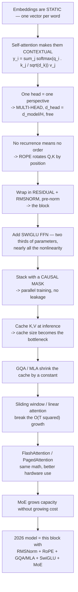

# 17 — Glossary & Cheat Sheet

> Standalone reference. Every entry links back to the module that derives it.

---

## Part 1 — Decision tables

### 1.1 Which attention variant?

| Situation | Use | Why | Module |
|---|---|---|---|
| Learning / small model | **MHA** | simplest, maximum expressiveness | 04 |
| Default production choice | **GQA** (`H_kv` = 4–8) | 4–8× smaller cache, ~no quality cost | 09 |
| Frontier scale, cache-dominated | **MLA** | ~50× smaller cache, quality ≥ MHA; hard to implement | 09 |
| Long context, mostly local deps | **GQA + sliding window** | `O(T·w)` compute, `O(w)` cache | 10 |
| Very long context, throughput-critical | **linear/SSM hybrid 3:1** | `O(T)`, fixed state — but weak exact recall | 10 |
| Never | **MQA alone** | quality cost rarely worth it vs GQA | 09 |

### 1.2 Which positional scheme?

| Situation | Use | Module |
|---|---|---|
| Default | **RoPE** | 05 |
| Need context beyond training length | **RoPE + YaRN** rescaling | 05 |
| Long-context length extrapolation | **partial RoPE** (25–50% of dims) | 05 |
| Decoder-only, some layers | **NoPE** (1-in-4, or global layers only) | 05 |
| Extrapolation is the top priority | **ALiBi** | 05 |
| Reproducing a 2017–2019 paper | sinusoidal or learned absolute | 05 |

### 1.3 Dense or MoE?

| Situation | Use | Module |
|---|---|---|
| Will be fine-tuned frequently | **dense** | 12 |
| Constrained total memory | **dense** | 12 |
| Serving at scale, memory available | **MoE** | 12 |
| Maximum capacity per unit inference cost | **MoE, many small experts** | 12 |
| Throughput matters more than peak quality | **MoE, fewer larger experts** | 12 |

### 1.4 Inference optimization, in priority order

| Priority | Technique | Gain | Lossy? | Module |
|---|---|---|---|---|
| 1 | KV cache | ~`T`× | no | 11 |
| 2 | FlashAttention (`is_causal=True`) | 2–4× | **no** | 11 |
| 3 | PagedAttention + continuous batching | 2–24× throughput | **no** | 11 |
| 4 | Prefix caching | huge on shared prefixes | **no** | 11 |
| 5 | INT8 weight quantization | 2× | negligible | 14 |
| 6 | Speculative decoding | 2–3× latency | **no** | 14 |
| 7 | INT4 weight quantization (GPTQ/AWQ) | 4× | small | 14 |
| 8 | KV cache quantization | 2–4× cache | small | 14 |
| 9 | Chunked prefill | latency smoothing | **no** | 14 |

**Do the lossless ones first.** Items 1–4 and 6 change nothing about output
quality.

---

## Part 2 — Comparison tables

### 2.1 Attention variants

| Variant | KV heads | Cache vs MHA | Compute | Quality | Used by |
|---|---|---|---|---|---|
| **MHA** | `H` | 1× | `O(T²)` | baseline | OLMo 2, Olmo 3 7B |
| **MQA** | 1 | `1/H` | `O(T²)` | degrades | rare alone |
| **GQA** | 4–8 | `1/g` | `O(T²)` | ≈ MHA | Llama, Qwen, Gemma, Mistral, gpt-oss |
| **MLA** | latent `d_c` | ~1/57 | `O(T²)` + proj | ≥ MHA | DeepSeek, Kimi, Mistral 3 Large, GLM-5 |
| **Sliding window** | any | `O(w)` | `O(T·w)` | ≈ (hybrid) | Gemma, gpt-oss, Olmo 3, MiMo, Trinity |
| **Sparse (content)** | any | `O(T)` | `O(T·k)` | ≈ | DeepSeek V3.2, GLM-5 |
| **Linear / DeltaNet** | none | `O(1)` | `O(T)` | weaker recall | Qwen3-Next, Kimi Linear |
| **SSM / Mamba-2** | none | `O(1)` | `O(T)` | weaker recall | Nemotron 3, Granite 4.0 |

### 2.2 Normalization

| | Mean-centered | Bias | Params | Reductions | Used by |
|---|---|---|---|---|---|
| **BatchNorm** | yes (across batch) | yes | `2d` | 2 | **never** in Transformers |
| **LayerNorm** | yes (across features) | yes | `2d` | 2 | BERT, GPT-2/3 |
| **RMSNorm** | **no** | **no** | `d` | 1 | everything since ~2023 |

Placement:

| Scheme | Form | Used by |
|---|---|---|
| Post-norm (outside residual) | `LN(x + f(x))` | 2017 paper only |
| **Pre-norm** | `x + f(LN(x))` | **most models** |
| Post-norm (inside residual) | `x + LN(f(x))` | OLMo 2, Olmo 3 |
| Pre + post | `x + LN₂(f(LN₁(x)))` | Gemma 2/3/4 |
| Four, depth-scaled | + gain `≈1/sqrt(L)` | Arcee Trinity Large |

### 2.3 Activations

| | Formula | Matrices | Typical `d_ff` | Used by |
|---|---|---|---|---|
| ReLU | `max(0,x)` | 2 | `4d` | Transformer 2017 |
| GELU | `x·Φ(x)` | 2 | `4d` | BERT, GPT-2/3 |
| **SwiGLU** | `Swish(xW_g) ⊙ xW_u` | **3** | `~8/3·d` | everything modern |

### 2.4 The complexity table

| | Training compute | Inference cache | Exact recall |
|---|---|---|---|
| RNN / LSTM | `O(T)` sequential | `O(1)` | no |
| Full attention | `O(T²)` parallel | `O(T)` | **yes** |
| Sliding window | `O(T·w)` parallel | `O(w)` | within window |
| Linear attention | `O(T)` parallel | `O(1)` | lossy |
| SSM / Mamba | `O(T)` parallel (scan) | `O(1)` | lossy |

The Transformer's whole bet: pay `O(T²)` to get parallel training and exact
recall. Everything in modules 09–11 is an attempt to reduce that bill without
losing the bet.

---

## Part 3 — Formulas

**Scaled dot-product attention** (module 03)

$$\text{Attention}(Q,K,V) = \operatorname{softmax}\!\left(\frac{QK^\top}{\sqrt{d_k}}\right)V$$

**Why `sqrt(d_k)`** — `Var(q·k) = d_k · Var(component)`, and `Var(X/c) = Var(X)/c²`.
Set `c = sqrt(d_k)` to make score variance dimension-independent.

**Sinusoidal positional encoding** (module 05)

$$PE_{(pos,2i)} = \sin\!\left(\frac{pos}{10000^{2i/d}}\right)\quad
PE_{(pos,2i+1)} = \cos\!\left(\frac{pos}{10000^{2i/d}}\right)$$

**RoPE relative property** (module 05)

$$\langle \mathrm{RoPE}(q,m), \mathrm{RoPE}(k,n)\rangle = g(q,k,\,n-m)$$

**RMSNorm** (module 06)

$$\text{RMSNorm}(x) = \frac{x}{\sqrt{\frac1d\sum_i x_i^2 + \epsilon}}\cdot\gamma$$

**SwiGLU** (module 07)

$$\text{FFN}(x) = \big(\text{Swish}(xW_{gate}) \odot xW_{up}\big)W_{down}$$

**KV cache size** (module 09)

$$2 \times B \times T \times L \times H_{kv} \times d_{head} \times \text{bytes}$$

**MoE load-balancing loss** (module 12)

$$\mathcal{L}_{aux} = \alpha \cdot N \sum_i f_i P_i$$

**Causal LM objective** (module 13)

$$\mathcal{L} = -\sum_t \log P(x_t \mid x_{<t})$$

**Speculative decoding acceptance** (module 14) — accept draft token `x` with
probability `min(1, p(x)/q(x))`; on rejection resample from normalized
`max(0, p−q)`. Output distribution is **exactly** `p`.

---

## Part 4 — Debugging table

| Symptom | Likely cause | Check | Module |
|---|---|---|---|
| Initial loss ≫ `ln(V)` | broken weight init | logits magnitude at step 0 | 16 |
| Initial loss ≈ 0 | data leakage | causal mask; target shift | 08 |
| Loss NaN early | no `sqrt(d_k)`; fp16 overflow | scaling; switch to bf16 | 03, 13 |
| Loss spikes mid-training | attention scores drifting | add QK-Norm; clip gradients | 06 |
| Needs careful LR warm-up | post-norm | switch to pre-norm | 06 |
| Generation degrades after `n` tokens | RoPE `pos_offset` wrong | cached vs uncached logits test | 16 |
| Cache saves no memory | caching post-expansion K/V | cache before `repeat_interleave` | 09, 16 |
| MoE: most experts unused | router collapse | expert usage histogram; raise `α` | 12 |
| MoE: loss plateaus high | `α` too large | lower load-balancing weight | 12 |
| Attention slower than expected | fell off the FlashAttention path | use `is_causal=True`, not a dense mask | 11 |
| OOM at long context | KV cache | GQA/MLA, sliding window, quantize cache | 09, 10, 14 |
| Poor length extrapolation | RoPE at unseen angles | YaRN, partial RoPE, or NoPE layers | 05 |
| Quantized model much worse | activation outliers | per-group scales; AWQ/GPTQ | 14 |

---

## Part 5 — Glossary

**ALiBi** — Attention with Linear Biases. Subtracts a per-head penalty
proportional to token distance from scores. No position vectors. *(05)*

**Attention sink** — first tokens receiving disproportionate attention as a place
to dump probability mass. Evicting them breaks the model. *(10)*

**AWQ** — Activation-aware Weight Quantization. Scales up the ~1% of channels
identified as salient from activation magnitudes before rounding. *(14)*

**Autoregressive** — each output conditioned on previously generated outputs.
Transformer decoders are autoregressive at inference, non-autoregressive at
training (teacher forcing). *(08)*

**BF16** — brain float 16. Same 8-bit exponent as FP32, fewer mantissa bits. The
training default; needs no loss scaling. *(13)*

**BPE** — Byte Pair Encoding. Builds a subword vocabulary by iteratively merging
the most frequent adjacent pair. Bottoms out at bytes, so no OOV. *(02)*

**Capacity factor** — multiplier on each MoE expert's token buffer (1.25–2.0).
Overflow tokens are dropped through the residual. *(12)*

**Causal mask** — adds `-inf` to future positions before softmax so their weights
become exactly 0. Enables parallel training without data leakage. *(08)*

**Chinchilla scaling** — compute-optimal training scales parameters and tokens
equally, ~20 tokens/parameter. Optimises *training* compute only. *(13)*

**Context vector** — in RNN seq2seq, the fixed-size encoder summary. Its
bottleneck motivated attention. *(01)*

**Continuous batching** — schedules per decode step, freeing a slot the instant a
sequence finishes. Depends on PagedAttention. *(11, 14)*

**Contextual embedding** — a token representation that depends on the whole
sequence. What self-attention produces. *(02, 03)*

**Cross-attention** — Q from one sequence, K/V from another. Score matrix is
rectangular. Also called encoder-decoder attention. *(08)*

**d_ff** — FFN inner width. `4·d_model` classically; `~8/3·d_model` with SwiGLU. *(07)*

**d_head** — per-head dimension. `d_model/H` by convention, often decoupled. *(04)*

**d_model** — residual-stream width. *(06)*

**DeltaNet / Gated DeltaNet** — linear-attention variants keeping a small
fast-weight memory updated by a delta rule with gates. *(10)*

**Data leakage** — training-time access to information unavailable at inference.
What the causal mask prevents. *(08)*

**Encoder-only / decoder-only / encoder-decoder** — the three families. Nearly all
2026 LLMs are decoder-only. *(08)*

**Expert** — one FFN inside an MoE layer. *(12)*

**FlashAttention** — tiled, fused attention keeping tiles in SRAM with an online
softmax. Memory `O(T²)→O(T)`, 2–4× faster, and **exact**. *(11)*

**FlashDecoding** — parallelises over the KV dimension for single-token decode. *(11)*

**FlashInfer** — JIT/block-sparse kernel library backing vLLM and SGLang. *(11)*

**GELU** — `x·Φ(x)`. Smooth alternative to ReLU. BERT/GPT-2 era. *(07)*

**GPTQ** — quantization that compensates rounding error by updating
not-yet-quantized weights using Hessian information. *(14)*

**GQA** — Grouped-Query Attention. Query heads share K/V within groups. The 2026
default. *(09)*

**Gradient checkpointing** — store activations at block boundaries and recompute
the rest in backward. ~33% more compute for `O(sqrt(L))` memory. *(13)*

**Head** — one independent attention computation with its own Q/K/V projections. *(04)*

**KV cache** — stored K/V from previous positions. Makes decode `O(1)` in
projection work; its size becomes the binding constraint. *(09, 11)*

**LayerNorm** — normalizes across features within each token. Replaced BatchNorm
because padding zeros poison per-column statistics. *(06)*

**Linear attention** — computes `φ(Q)(φ(K)ᵀV)` instead of `softmax(QKᵀ)V`. `O(T)`
with a fixed state, at the cost of lossy recall. *(10)*

**Load-balancing loss** — `α·N·Σ f_i·P_i`. Prevents MoE router collapse by
coupling non-differentiable usage to differentiable probability. *(12)*

**MHA** — Multi-Head Attention. `H` heads each with own K/V. *(04)*

**MLA** — Multi-Head Latent Attention. Compresses K/V into a low-rank latent
(~512 dims), cached instead of full K/V. ~57× smaller. *(09)*

**MoE** — Mixture of Experts. Replaces one FFN with `N`, routing each token to `k`.
Total parameters grow; active parameters do not. *(12)*

**MQA** — Multi-Query Attention. All query heads share one K/V pair. *(09)*

**MTP** — Multi-Token Prediction. Extra heads predicting `t+1..t+k`. Improves
training; the heads become a free speculative-decoding draft model. *(13, 14)*

**NoPE** — No Positional Embedding. Relies on the causal mask alone. Used in
*some* layers (SmolLM3 1-in-4, Kimi Linear global layers). *(05)*

**Online softmax** — running max/sum with rescaling, letting softmax be computed
blockwise. The core of FlashAttention. *(11)*

**PagedAttention** — OS-style paging for the KV cache: fixed 16-token blocks,
per-request block tables. Near-zero fragmentation, copy-on-write prefix sharing. *(11)*

**Partial RoPE** — rotate only a fraction of head dimensions. MiniMax-M2 ~50%,
Gemma 4 25%. Better long-context extrapolation. *(05)*

**Pre-norm / post-norm** — normalization before or after the sublayer, relative to
the residual. Pre-norm is the default. *(06)*

**Prefill / decode** — prompt processing (compute-bound) vs token-by-token
generation (memory-bandwidth-bound). *(11)*

**QK-Norm** — RMSNorm on Q and K before RoPE. Bounds score magnitude beyond what
`sqrt(d_k)` handles. *(06)*

**Residual connection** — `out = f(x) + x`. Gives gradients an identity path and
lets the network skip an unhelpful transformation. *(06)*

**Residual stream** — the running sum every sublayer reads from and adds to. Width
`d_model`. *(06)*

**RMSNorm** — LayerNorm without mean-centering or bias. One reduction, half the
parameters, same quality. *(06)*

**RoPE** — Rotary Position Embedding. Rotates Q and K by an angle ∝ position, in
every layer. Dot products depend only on relative offset. *(05)*

**Router** — the linear layer selecting which MoE experts a token uses. *(12)*

**Self-attention** — attention computed within one sequence. *(03)*

**Shared expert** — an always-active MoE expert absorbing common patterns.
Contested: DeepSeek/Kimi/GLM yes; Qwen3/gpt-oss/MiniMax-M2 no. *(12)*

**Sliding window attention** — each token attends to a local window. `O(T·w)`
compute, `O(w)` cache. Gemma 3 uses 5:1 with `w=1024`. *(10)*

**Speculative decoding** — draft `k` tokens cheaply, verify in one target pass.
Modified rejection sampling makes it **exactly lossless**. *(14)*

**SSM / Mamba** — state-space models. Fixed-size state, `O(T)`, parallel via scan. *(10)*

**SwiGLU** — `Swish(xW_gate) ⊙ xW_up`, then `W_down`. Three matrices. Universal. *(07)*

**Teacher forcing** — feeding ground-truth previous tokens during training,
removing the sequential dependency. *(08)*

**Top-p (nucleus) sampling** — sample from the smallest set with cumulative
probability ≥ `p`. Adapts to model confidence. *(14)*

**Weight tying** — sharing the embedding matrix with the output projection. *(02)*

**YaRN** — a careful RoPE rescaling technique for context extension. *(05)*

---

## Part 6 — Numbers worth remembering

| Quantity | Value | Module |
|---|---|---|
| Original Transformer `d_model` / heads / `d_head` | 512 / 8 / 64 | 04 |
| Original `d_ff` | 2048 (`4×`) | 07 |
| Original encoder/decoder depth | 6 / 6 | 06 |
| FFN share of parameters | **~2/3** | 07 |
| RoPE base `θ` | 10000 (often 1e6 for long context) | 05 |
| Typical GQA `H_kv` | 4–8 | 09 |
| Gemma 3 local:global | 5:1, window 1024 | 10 |
| Qwen3-Next / Kimi Linear linear:full | 3:1 | 10 |
| DeepSeek V3 | 671B total / 37B active (5.5%) | 12 |
| Kimi K2 | 1T total / 32B active | 15 |
| MiniMax-M2 sparsity | 4.37% active | 12 |
| Chinchilla optimum | ~20 tokens/parameter | 13 |
| Llama 3 8B actual | ~1875 tokens/parameter | 13 |
| Training state, bf16 + Adam | ~16 bytes/parameter | 13 |
| PagedAttention block size | 16 tokens | 11 |
| Initial LM loss | `≈ ln(V)` | 16 |

---

## Part 7 — The one-page summary

---

## Further reading

**Foundational** — Vaswani et al., *Attention Is All You Need* (2017) · Bahdanau
et al. (2014) · Luong et al. (2015)

**Components** — Su et al., *RoFormer* / RoPE (2021) · Zhang & Sennrich, *RMSNorm*
(2019) · Shazeer, *GLU Variants* (2020) · Press et al., *ALiBi* (2021) ·
Kazemnejad et al., *NoPE* (2023) · Xiong et al., *On Layer Normalization* (2020)

**Efficiency** — Shazeer, *MQA* (2019) · Ainslie et al., *GQA* (2023) · DeepSeek-V2
(2024) for MLA · Beltagy et al., *Longformer* (2020) · Katharopoulos et al.,
*Transformers are RNNs* (2020) · Gu & Dao, *Mamba* (2023)

**Systems** — Dao et al., *FlashAttention* (2022), *FlashAttention-2* (2023),
*FlashAttention-3* (2024) · Kwon et al., *vLLM / PagedAttention* (SOSP 2023) ·
Yu et al., *Orca* (2022)

**MoE** — Shazeer et al. (2017) · Fedus et al., *Switch Transformer* (2021) ·
DeepSeekMoE (2024)

**Training & inference** — Kaplan et al. (2020) · Hoffmann et al., *Chinchilla*
(2022) · Frantar et al., *GPTQ* (2022) · Lin et al., *AWQ* (2023) · Leviathan et
al., *Speculative Decoding* (2023)

**Course sources** — CampusX, *100 Days of Deep Learning*, videos 71–84 ·
Sebastian Raschka, *The Big LLM Architecture Comparison* · Raschka,
[LLM Architecture Gallery](https://sebastianraschka.com/llm-architecture-gallery/)

---

**Back to → [00 — README](./00-README.md)**
