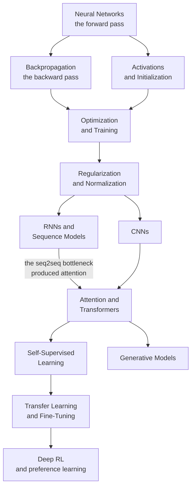

# Deep Learning

Deep learning learns representations and decision rules jointly. A multilayer
perceptron starts with affine maps and nonlinearities; convolution, recurrence,
attention, normalization, and residual connections add distinct structure.
Reverse-mode differentiation supplies gradients, but a successful experiment
also needs an appropriate objective, reliable data, numerical stability, and
honest evaluation.

These twelve pages follow that history of walls and fixes. Each architecture is
introduced by the problem it solves, not as a fact to memorise.

## Prerequisites and outcomes

Start with [matrix operations and conditioning](./math/linear-algebra.md),
[derivatives and the chain rule](./math/calculus.md),
[probability](./math/probability.md), and
[ML evaluation](./ml/model-evaluation.md). The
[PyTorch guide](./libraries/pytorch.md) covers tensor layout, device/dtype,
module state, autograd, optimizers, and data loading.

The practical goals are to train a model against a baseline, trace tensor shapes
and gradients, explain the loss and data contract, diagnose a failed run,
compare architectures under a controlled budget, and distinguish a passing
implementation test from evidence of useful generalization. Worked calculations
and solved self-checks complement the runnable experiments; neither replaces
the other.

## Topics

| Topic | Level | What it covers |
|---|---|---|
| [Neural Networks](./deep-learning/neural-networks.md) | intermediate | the neuron, XOR and what a hidden layer does, MLPs, depth vs width, a worked forward pass |
| [Backpropagation & Autodiff](./deep-learning/backpropagation-and-autodiff.md) | intermediate | the adjoint rule, forward vs reverse mode, VJPs, a hand-worked example, gradient checking |
| [Activations & Initialization](./deep-learning/activations-and-initialization.md) | intermediate | activation derivatives, dead-unit diagnosis, Xavier/He assumptions, second moments, signal propagation |
| [Optimization & Training](./deep-learning/optimization-and-training.md) | advanced | SGD to AdamW, schedules and warmup, batch size, clipping, mixed precision, distributed, debugging |
| [Regularization & Normalization](./deep-learning/regularization-and-normalization.md) | intermediate | dropout, weight decay, augmentation, mixup, BatchNorm/LayerNorm/RMSNorm, residual connections |
| [CNNs](./deep-learning/cnns.md) | intermediate | convolution derived, receptive fields, pooling, LeNet to ConvNeXt, depthwise separable, dense prediction |
| [RNNs & Sequence Models](./deep-learning/rnns-and-sequence-models.md) | intermediate | BPTT and vanishing gradients, LSTM and GRU gating, seq2seq, CTC, state-space models |
| [Attention & Transformers](./deep-learning/attention-and-transformers.md) | advanced | self-attention derived, multi-head, RoPE, the block, the three families, FlashAttention, scaling |
| [Transfer Learning & Fine-Tuning](./deep-learning/transfer-learning-and-finetuning.md) | intermediate | why transfer works, the adaptation ladder, LoRA and QLoRA, forgetting, distillation, fine-tune vs RAG |
| [Generative Models](./deep-learning/generative-models.md) | advanced | the trilemma, autoregressive, VAEs and the ELBO, GANs, flows, diffusion and guidance |
| [Self-Supervised Learning](./deep-learning/self-supervised-learning.md) | advanced | pretext tasks, InfoNCE, non-contrastive methods and collapse, masked modelling, CLIP, evaluation |
| [Deep Reinforcement Learning](./deep-learning/deep-rl.md) | advanced | MDPs and Bellman, DQN, PPO, exploration, offline RL, RLHF/GRPO and the distinct direct-preference objective DPO |

## The dependency structure



## Suggested order

1. **Neural Networks** and **Backpropagation** — nothing else makes sense first.
2. **Activations & Initialization**, then **Optimization & Training** — the
   difference between a model that trains and one that does not.
3. **Regularization & Normalization** — controlling generalization, scale, and train/eval behavior.
4. **CNNs** and **RNNs** for the historical arc, then **Attention &
   Transformers** to compare their inductive biases and execution patterns.
5. **Self-Supervised Learning** and **Transfer Learning** — how models are
   actually built today.
6. **Generative Models** and **Deep RL** as the two large specialisations.

## Experiments and assessments

- **Forward and backward:** [MLP training and a manual gradient check](./deep-learning/neural-networks.md#building-one-from-scratch),
  then [JVP, VJP, and higher-order derivatives](./deep-learning/backpropagation-and-autodiff.md#shared-graphs-directional-derivatives-and-higher-order).
  Explain every tensor axis and distinguish a sum loss from a mean loss.
- **Reliable optimization:** [measure activation moments](./deep-learning/activations-and-initialization.md#experiment-measure-signal-rather-than-trusting-a-label),
  verify [gradient accumulation including an unequal tail](./deep-learning/optimization-and-training.md#a-training-loop-that-works),
  and [select regularization on validation data](./deep-learning/regularization-and-normalization.md#experiment-select-regularization-without-touching-the-test-set).
- **Architectures:** [train a CNN on bundled digits](./deep-learning/cnns.md#experiment-train-a-small-cnn-without-downloading-data),
  handle [variable-length recurrent sequences](./deep-learning/rnns-and-sequence-models.md#practical-notes),
  and test [attention masks and cached decoding](./deep-learning/attention-and-transformers.md#runnable-attention-contracts).
  A shape-correct output is the starting point, not the final acceptance test.
- **Adaptation and representations:** compare [frozen, full, and low-rank adaptation](./deep-learning/transfer-learning-and-finetuning.md#runnable-lab-frozen-full-and-low-rank-adaptation),
  then evaluate [contrastive pretraining with a frozen probe](./deep-learning/self-supervised-learning.md#runnable-lab-contrastive-pretraining-and-a-frozen-probe).
  Keep labels, augmentation policy, and test data out of representation selection.
- **Generative modeling:** train a [small VAE](./deep-learning/generative-models.md#likelihood-units-and-a-worked-vae)
  and a [denoiser with reverse sampling](./deep-learning/generative-models.md#from-noise-prediction-to-an-actual-reverse-step).
  State the likelihood, reduction, noise schedule, and what the sample-quality
  evidence does and does not show.
- **Reinforcement learning:** verify [Bellman targets and episode boundaries](./deep-learning/deep-rl.md#bellman-calculations-and-episode-boundaries)
  and [policy-update ratios](./deep-learning/deep-rl.md#advantages-clipping-and-policy-probabilities).
  These bounded checks are followed by a complete
  [PPO training and evaluation loop](./deep-learning/deep-rl.md#runnable-lab-collect-experience-train-ppo-evaluate-complete-episodes)
  using Stable-Baselines3 and Gymnasium, with a random baseline and fresh
  evaluation seeds. A small CartPole run is not a benchmark of difficult RL tasks.

## Example environment

The CPU experiments use the same [Python 3.11 environment as ML](./ml.md#example-environment):
NumPy 1.26.4, SciPy 1.11.4, pandas 2.1.3, scikit-learn 1.3.2, and PyTorch
2.8.0; the RL environment lab additionally uses Gymnasium 1.2.0 and
Stable-Baselines3 2.7.0. [Download the versioned requirements](/assets/examples/requirements.txt).
No GPU, pretrained checkpoint, hosted API, or external dataset download is
needed for the independent experiments. Each includes its imports, data,
initialization, and numerical checks.

```bash
python3.11 -m venv .venv
source .venv/bin/activate
python -m pip install -r requirements.txt
python example-01.py
```

On Windows use `.venv\Scripts\activate`; for Linux CPU-only PyTorch follow
the [environment instructions](./ml.md#example-environment). Accelerator,
distributed-training, and pretrained-model fragments are explicitly scoped
separately: passing a CPU contract check does not validate their performance or
compatibility. Exact printed numbers can vary across numerical libraries;
inspect the invariant and tolerance behind each assertion.

## A training-and-debugging capstone

Choose one classification task with a frozen test split and compare a linear
baseline with a small neural model. Keep a record of data preprocessing,
initialization, loss units, optimizer, effective batch size, scheduler steps,
and random seeds. First overfit a tiny training subset, then restore the real
validation protocol. Inject and diagnose three failures: shuffled labels,
incorrect loss scaling, and train/eval mode confusion.

Deliver learning curves, baseline-relative performance, a validation-selected
configuration, a checkpoint/resume equivalence check, and a short failure
analysis. Extend it with either architecture comparison, frozen-feature
transfer, or a self-supervised representation. Do not compare many choices on
the final test set and present the best score as an untouched estimate.

## Related courses

Two long-form courses on this site go considerably deeper than these notes:

- **[Transformers Deep Dive](/courses/transformers/)** — 17 modules from "why did
  we abandon RNNs?" to the configuration choices in 2026 production models, with
  67 diagrams, worked numerics, and a runnable reference decoder.
- **[The Inference Engineering Course](/courses/inference/)** — 14 chapters on how
  LLM serving works, read out of the vLLM and SGLang source.

## The short version

- **Depth changes the hypothesis class and optimization problem.** Its value
  depends on the task, representation, sample size, and compute budget; tabular
  data does not have a universal exemption.
- **Residual connections and normalization often improve optimization.** An
  identity path does not mathematically guarantee nonzero gradients, and neither
  mechanism is mandatory for every trainable architecture.
- **Reverse-mode autodiff is the enabling technology.** One backward pass for a
  billion gradients is why any of this is affordable.
- **Compare transfer against a task-appropriate baseline.** Prompting is one
  option for instruction-capable language models, not an adaptation interface
  available to every neural network.
- **Architecture comparisons need controlled evidence.** Parallelism,
  inductive bias, optimization, data, and scaling all influence the result.
