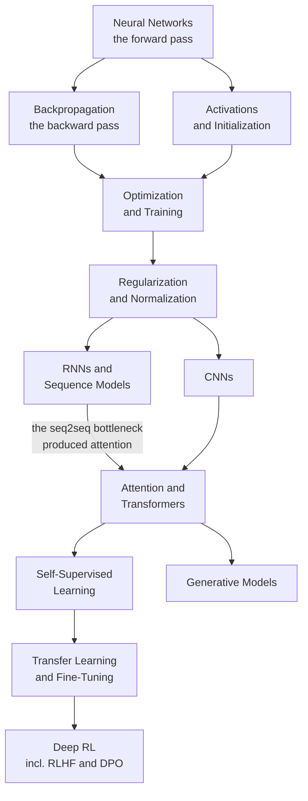

# Deep Learning

Deep learning is a stack of linear maps with non-linearities between them,
trained by reverse-mode automatic differentiation. Everything else —
convolutions, gating, attention, normalisation, residual connections — exists
because someone hit a specific wall with the plain version and engineered around
it.

These twelve pages follow that history of walls and fixes. Each architecture is
introduced by the problem it solves, not as a fact to memorise.

## Topics

| Topic | Level | What it covers |
|---|---|---|
| [Neural Networks](./deep-learning/neural-networks.md) | intermediate | the neuron, XOR and what a hidden layer does, MLPs, depth vs width, a worked forward pass |
| [Backpropagation & Autodiff](./deep-learning/backpropagation-and-autodiff.md) | intermediate | the adjoint rule, forward vs reverse mode, VJPs, a hand-worked example, gradient checking |
| [Activations & Initialization](./deep-learning/activations-and-initialization.md) | intermediate | every activation and what it fixes, dying ReLU, Xavier and He derived from variance |
| [Optimization & Training](./deep-learning/optimization-and-training.md) | advanced | SGD to AdamW, schedules and warmup, batch size, clipping, mixed precision, distributed, debugging |
| [Regularization & Normalization](./deep-learning/regularization-and-normalization.md) | intermediate | dropout, weight decay, augmentation, mixup, BatchNorm/LayerNorm/RMSNorm, residual connections |
| [CNNs](./deep-learning/cnns.md) | intermediate | convolution derived, receptive fields, pooling, LeNet to ConvNeXt, depthwise separable, dense prediction |
| [RNNs & Sequence Models](./deep-learning/rnns-and-sequence-models.md) | intermediate | BPTT and vanishing gradients, LSTM and GRU gating, seq2seq, CTC, state-space models |
| [Attention & Transformers](./deep-learning/attention-and-transformers.md) | advanced | self-attention derived, multi-head, RoPE, the block, the three families, FlashAttention, scaling |
| [Transfer Learning & Fine-Tuning](./deep-learning/transfer-learning-and-finetuning.md) | intermediate | why transfer works, the adaptation ladder, LoRA and QLoRA, forgetting, distillation, fine-tune vs RAG |
| [Generative Models](./deep-learning/generative-models.md) | advanced | the trilemma, autoregressive, VAEs and the ELBO, GANs, flows, diffusion and guidance |
| [Self-Supervised Learning](./deep-learning/self-supervised-learning.md) | advanced | pretext tasks, InfoNCE, non-contrastive methods and collapse, masked modelling, CLIP, evaluation |
| [Deep Reinforcement Learning](./deep-learning/deep-rl.md) | advanced | MDPs and Bellman, DQN, policy gradients, PPO, exploration, offline RL, RLHF/DPO/GRPO |

## The dependency structure

## Suggested order

1. **Neural Networks** and **Backpropagation** — nothing else makes sense first.
2. **Activations & Initialization**, then **Optimization & Training** — the
   difference between a model that trains and one that does not.
3. **Regularization & Normalization** — why deep networks are trainable at all.
4. **CNNs** and **RNNs** for the historical arc, then **Attention &
   Transformers** for what replaced both.
5. **Self-Supervised Learning** and **Transfer Learning** — how models are
   actually built today.
6. **Generative Models** and **Deep RL** as the two large specialisations.

## Related courses

Two long-form courses on this site go considerably deeper than these notes:

- **[Transformers Deep Dive](/courses/transformers/)** — 17 modules from "why did
  we abandon RNNs?" to the configuration choices in 2026 production models, with
  67 diagrams, worked numerics, and a runnable reference decoder.
- **[The Inference Engineering Book](/courses/inference/)** — 14 chapters on how
  LLM serving works, read out of the vLLM and SGLang source.

## The short version

- **Depth is a bet that the target function is compositional.** Images, text,
  audio, and code are; most tabular data is not.
- **Residual connections and normalisation are what make depth trainable.**
  Without them, deeper plain networks train *worse*, not just generalise worse.
- **Reverse-mode autodiff is the enabling technology.** One backward pass for a
  billion gradients is why any of this is affordable.
- **Almost nobody trains from scratch.** The default is to adapt a pretrained
  model, and the adaptation ladder starts at prompting, not fine-tuning.
- **Attention won on parallelism**, not on representational superiority.
