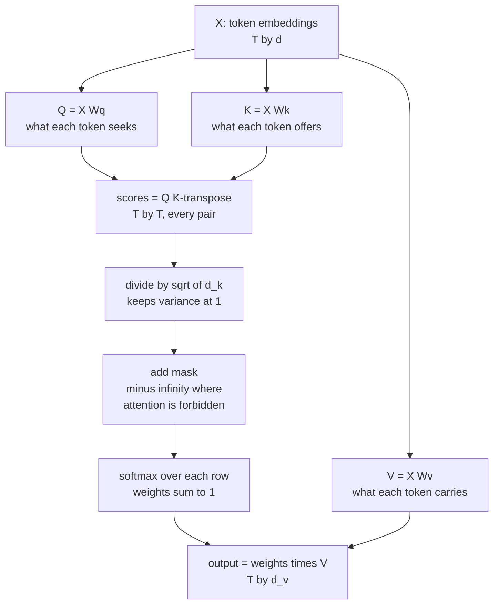
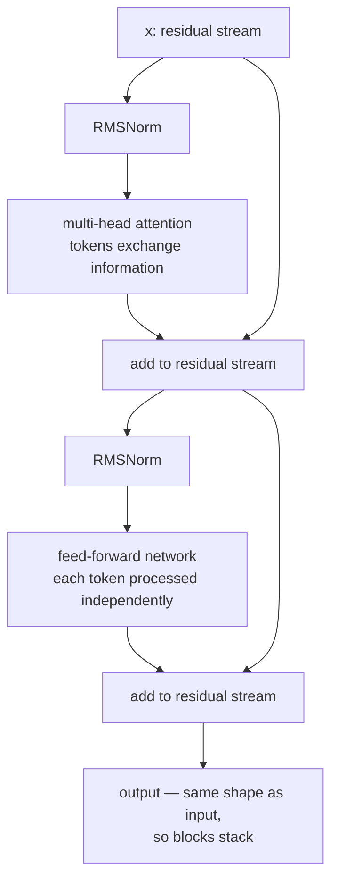

# Attention and Transformers

The transformer is the architecture behind essentially every capable model
released since 2018 — language, vision, audio, protein structure, code, video.
This page derives it. For the full treatment, including worked numeric examples
and a runnable reference implementation, the site has a
[17-module course](/courses/transformers/); this is the standalone version.

## Deriving self-attention

### The problem

Word embeddings are **static**. `bank` gets the same vector in "money bank
grows" and "river bank flows". We want a function that takes the embeddings of a
whole sentence and returns one **contextual** embedding per token.

### Attempt 1: represent each token as a mixture of the others

$$\mathbf{y}_i = \sum_j w_{ij}\,\mathbf{e}_j$$

Where do the weights come from? They should measure how related token $i$ is to
token $j$ — and we already have a similarity measure for vectors, the dot
product. So:

$$s_{ij} = \mathbf{e}_i^\top\mathbf{e}_j, \qquad w_{ij} = \mathrm{softmax}_j(s_{ij}), \qquad \mathbf{y}_i = \sum_j w_{ij}\mathbf{e}_j$$

Softmax does two jobs: dot products can be negative or unbounded, and we want a
proportional mixture. Softmax maps any reals to positive weights summing to 1.

**This is already parallel.** Computing $\mathbf{y}_i$ needs nothing from
$\mathbf{y}_j$, so all outputs are computed at once as three matrix
multiplications — which is exactly what an RNN could not do.

### Attempt 2: give each token three distinct roles

The version above has a problem: a token's role as "the thing asking" and "the
thing being matched" and "the content being mixed" are all the same vector. Split
them with three learned projections:

$$Q = XW_Q, \qquad K = XW_K, \qquad V = XW_V$$

| Projection | Role | Analogy |
|---|---|---|
| **Query** $\mathbf{q}_i$ | what token $i$ is looking for | a search query |
| **Key** $\mathbf{k}_j$ | what token $j$ offers as a match | a document's index terms |
| **Value** $\mathbf{v}_j$ | what token $j$ contributes if attended to | the document's content |

$$\mathrm{Attention}(Q,K,V) = \mathrm{softmax}\!\left(\frac{QK^\top}{\sqrt{d_k}}\right)V$$

### Why $\sqrt{d_k}$

For $\mathbf{q},\mathbf{k}$ with independent zero-mean unit-variance components,

$$\mathrm{Var}(\mathbf{q}\cdot\mathbf{k}) = \sum_{i=1}^{d_k}\mathrm{Var}(q_ik_i) = d_k$$

With $d_k = 64$, scores have standard deviation 8; with $d_k = 128$, about 11.
Large-magnitude logits push softmax into saturation, where its Jacobian
$p_i(\delta_{ij}-p_j)$ is nearly zero — vanishing gradients. Dividing by
$\sqrt{d_k}$ restores unit variance and keeps softmax in its responsive range.

This is not a minor detail; without it, deep transformers do not train.

## Multi-head attention

One attention operation produces one weighted average, and averaging is
lossy — a token often needs to attend to several things for different reasons.
Run $h$ attention operations in parallel on lower-dimensional projections:

$$\mathrm{MHA}(X) = \mathrm{Concat}(\mathrm{head}_1,\dots,\mathrm{head}_h)W_O, \qquad \mathrm{head}_i = \mathrm{Attention}(XW_Q^i, XW_K^i, XW_V^i)$$

with $d_k = d_v = d_{\text{model}}/h$, so the total cost matches single-head
attention at full width.

Empirically, different heads specialise: some attend to the previous token, some
to syntactic dependents, some to the subject of the sentence, some to matching
brackets or repeated patterns. The specialisation is emergent, not designed, and
studying it is the foundation of mechanistic interpretability.

**Head-count variants** for inference efficiency:

| Variant | K/V heads | KV cache size | Used by |
|---|---|---|---|
| **MHA** | $h$ | $2\cdot h\cdot d_h$ per token per layer | original Transformer, GPT-2 |
| **MQA** | 1 | $2\cdot d_h$ | PaLM, Falcon |
| **GQA** | $g$ groups, $1<g<h$ | $2\cdot g\cdot d_h$ | Llama 2/3, Mistral — the standard |
| **MLA** | latent-compressed | smallest | DeepSeek |

The KV cache dominates inference memory for long contexts. GQA with 8 groups
against 64 heads cuts the cache 8× for a negligible quality cost, which is why
it is now near-universal.

## Masking

A mask adds $-\infty$ to forbidden positions before the softmax, driving those
weights to exactly zero.

| Mask | Purpose |
|---|---|
| **Causal** | position $i$ may attend only to $j \le i$ — required for autoregressive generation |
| **Padding** | ignore padding tokens in a batched sequence |
| Sliding window | attend only within $w$ positions (Mistral, Longformer) |
| Prefix-LM | bidirectional over a prompt, causal over the completion |
| Block-diagonal | keep packed sequences from attending across document boundaries |

The causal mask is what makes a decoder-only model's training efficient:
every position predicts its next token **simultaneously** in one forward pass,
while remaining honest about not seeing the future.

## Positional encoding

Attention is **permutation equivariant** — shuffle the input and the outputs
shuffle identically. Without position information, "dog bites man" and "man bites
dog" are indistinguishable.

| Method | Mechanism | Extrapolates | Used by |
|---|---|---|---|
| Sinusoidal | fixed sin/cos of varying frequency, added to embeddings | somewhat | original Transformer |
| Learned absolute | a trainable vector per position | no — hard limit at training length | BERT, GPT-2 |
| Relative | bias based on $i-j$ | better | T5, Transformer-XL |
| **RoPE** | **rotate** Q and K by an angle proportional to position | yes, with scaling | Llama, Mistral, Qwen, most modern LLMs |
| ALiBi | linear distance penalty on attention scores | yes | BLOOM, MPT |
| NoPE | none, in decoder-only models | surprisingly, yes | research |

**RoPE** is worth understanding because it is now the default. It rotates
consecutive pairs of dimensions in $\mathbf{q}$ and $\mathbf{k}$ by an angle
$m\theta_i$ where $m$ is the position:

$$\langle \mathrm{RoPE}(\mathbf{q},m),\, \mathrm{RoPE}(\mathbf{k},n)\rangle = g(\mathbf{q},\mathbf{k},m-n)$$

The dot product depends only on the **relative** offset $m-n$, so relative
position falls out of an absolute operation. It is applied to Q and K only (not
V), needs no extra parameters, and extends to longer contexts through frequency
scaling — position interpolation, NTK-aware scaling, and YaRN are all
manipulations of RoPE's frequency base, which is how 8k-trained models are
extended to 128k.

## The transformer block

The **division of labour** is the clearest way to hold this in mind:

- **Attention moves information between positions.** It is the only place tokens
  interact.
- **The FFN processes each position independently.** It is where most of the
  parameters and, on current evidence, most of the stored knowledge live.

The FFN expands and contracts:

$$\mathrm{FFN}(\mathbf{x}) = W_2\,\phi(W_1\mathbf{x}+\mathbf{b}_1)+\mathbf{b}_2$$

with hidden dimension typically $4d$. Modern models use **SwiGLU**:

$$\mathrm{FFN}(\mathbf{x}) = \bigl(\mathrm{Swish}(\mathbf{x}W_1)\odot\mathbf{x}W_3\bigr)W_2$$

Three matrices instead of two, so the hidden dimension shrinks to
$\frac{2}{3}\cdot4d$ to keep parameters matched.

**Pre-norm** (normalise *before* each sublayer) is the modern default: it leaves
a clean identity path from the loss to every layer, which is why it trains
stably without the careful warmup the original post-norm Transformer required.

**Parameter count per block**, with $d$ the model dimension:

| Component | Parameters |
|---|---|
| Attention ($W_Q, W_K, W_V, W_O$) | $4d^2$ |
| FFN (with $4d$ hidden) | $8d^2$ |
| Norms | $\approx 4d$ |
| **Total** | $\approx 12d^2$ |

So a 32-layer model with $d = 4096$ has roughly
$32 \times 12 \times 4096^2 \approx 6.4$B parameters in its blocks — the FFN is
**two-thirds** of them.

## The three families

| Family | Attention | Pretraining | Best for | Examples |
|---|---|---|---|---|
| **Encoder-only** | bidirectional | masked language modelling | classification, NER, retrieval embeddings | BERT, RoBERTa, DeBERTa, ModernBERT |
| **Decoder-only** | causal | next-token prediction | generation, and in practice everything | GPT, Llama, Mistral, Claude, Gemini |
| **Encoder–decoder** | bidirectional encoder, causal decoder with cross-attention | span corruption / denoising | translation, summarisation | T5, BART, Whisper |

**Decoder-only won**, and the reasons are worth stating: next-token prediction is
a universal objective that applies to any text; every position contributes a
training signal in one pass; the architecture is simpler; it scales cleanly; and
in-context learning emerges from it. Encoders remain the right choice for
embeddings and for classification where you can afford a task-specific model —
they are cheaper and bidirectional context genuinely helps there.

## Complexity, and the efficiency work

| Component | Time | Memory |
|---|---|---|
| Attention scores | $O(n^2 d)$ | $O(n^2)$ naive |
| FFN | $O(n d^2)$ | $O(nd)$ |

Note that **attention only dominates when $n > d$**. For $d = 4096$ and
$n = 512$, the FFN is the bottleneck. The blanket claim "attention is quadratic
so transformers are slow" omits the constant that decides which term wins.

### FlashAttention

The key insight is that naive attention is **memory-bandwidth bound**, not
compute bound: it writes an $n\times n$ score matrix to high-bandwidth memory,
reads it back for the softmax, writes again, reads again for the $V$ multiply.

FlashAttention tiles the computation and keeps tiles in SRAM, computing the
softmax with a running maximum and sum (online softmax — the log-sum-exp trick,
streamed). It never materialises the $n\times n$ matrix.

Result: memory drops from $O(n^2)$ to $O(n)$ and wall-clock improves 2–4×, with
**mathematically identical output**. It is not an approximation, which is why it
was adopted universally within a year.

### Approximate and structured attention

| Method | Idea | Complexity |
|---|---|---|
| Sliding window | attend within $w$ positions | $O(nw)$ |
| Dilated / strided | skip positions | $O(n\sqrt{n})$ |
| Global + local (Longformer, BigBird) | a few global tokens plus local windows | $O(n)$ |
| Linear attention (Performer, Linformer) | kernel approximation or low-rank projection | $O(n)$ |
| Sparse (Reformer) | LSH bucketing of similar queries | $O(n\log n)$ |
| **Mamba / SSM** | selective state space, recurrent | $O(n)$ |

The honest assessment: **most approximate-attention methods lost to
FlashAttention**, because an exact algorithm with better constants beat
approximate algorithms with better asymptotics at the sequence lengths people
actually use. The methods still in production are the structurally simple ones —
sliding-window attention (Mistral) and hybrid SSM/attention stacks.

## Scaling

The **Chinchilla** result changed how models are sized. For a fixed compute
budget $C \approx 6ND$ (parameters $N$, tokens $D$), the compute-optimal
allocation is roughly $D \approx 20N$ — **20 tokens per parameter**.

Earlier models were badly under-trained: GPT-3 at 175B parameters saw 300B
tokens, about 1.7 tokens per parameter. Chinchilla at 70B parameters with 1.4T
tokens outperformed it while being 2.5× smaller.

The further practical wrinkle: for models that will be *served* to many users,
inference cost dominates, so it pays to train a **smaller model on far more
tokens than compute-optimal**. Llama 3's 8B model saw 15T tokens — roughly 1,875
tokens per parameter, ~90× past Chinchilla-optimal — because a smaller model is
cheaper to serve forever.

## Vision and beyond

**Vision Transformer** splits an image into 16×16 patches, projects each to an
embedding, adds positional encodings, and runs a standard transformer. It
outperforms CNNs given enough pretraining data (roughly 100M+ images) and
underperforms them below that, because it lacks convolution's locality prior and
must learn it from data.

The pattern generalised: **tokenise anything, then run a transformer.** Audio
spectrogram patches, video spatiotemporal patches, protein residues, point-cloud
tokens, robot action tokens. That generality is the transformer's most consequential
property — one architecture, one set of scaling laws, one optimisation recipe,
across every modality.

## Self-check

1. Derive why attention scores are divided by $\sqrt{d_k}$, using the variance of
   a dot product.
2. What do Q, K, and V each represent, and why are three projections better than
   one?
3. Why is multi-head attention better than a single wider head?
4. What does the causal mask enable during training that would otherwise require
   $n$ forward passes?
5. Explain how RoPE produces relative position from an absolute operation.
6. For $d = 4096$ and $n = 1024$, which dominates: attention or the FFN? Show the
   arithmetic.
7. Why did FlashAttention displace most approximate-attention methods?

## Where to go next

- [Transformers Deep Dive](/courses/transformers/) — 17 modules with worked
  numerics and a reference implementation.
- [The Inference Engineering Book](/courses/inference/) — how these models are
  served efficiently.
- [Transfer Learning](./transfer-learning-and-finetuning.md) — adapting a
  pretrained transformer.
