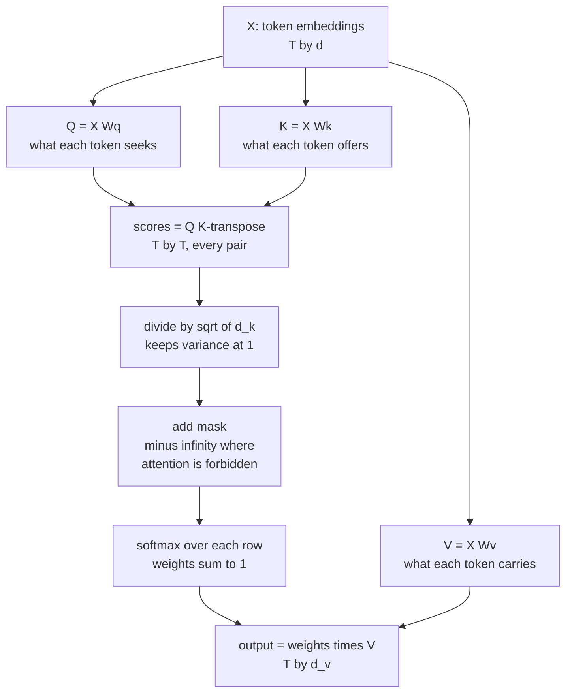
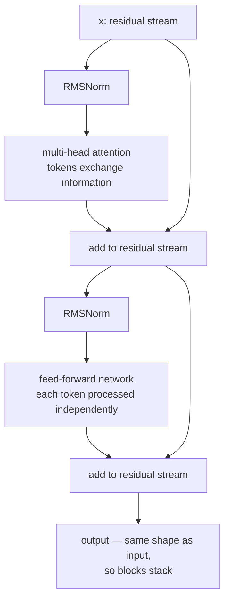

# Attention and Transformers

Transformers build representations by combining content-dependent communication
between positions with learned transformations at each position. They are widely
used in language, vision, audio and multimodal systems, alongside convolutional,
recurrent and state-space architectures. This chapter develops the mathematics,
tensor contracts and failure modes needed to train and inspect a small model.
The [Transformers Deep Dive](/courses/transformers/) extends the derivations into
production architecture comparisons and a complete decoder implementation.
The original architecture and encoder-decoder training setup are described in
[Attention Is All You Need](https://arxiv.org/abs/1706.03762).

## Deriving self-attention

### The problem

Word embeddings are **static**. `bank` gets the same vector in "money bank
grows" and "river bank flows". We want a function that takes the embeddings of a
whole sentence and returns one **contextual** embedding per token.

### Attempt 1: represent each token as a mixture of the others

$$\mathbf{y}_i = \sum_j w_{ij}\,\mathbf{e}_j$$

Where do the weights come from? They should measure how related token $i$ is to
token $j$ — and we already have a similarity measure for vectors, the dot
product. So:

$$s_{ij} = \mathbf{e}_i^\top\mathbf{e}_j, \qquad w_{ij} = \mathrm{softmax}_j(s_{ij}), \qquad \mathbf{y}_i = \sum_j w_{ij}\mathbf{e}_j$$

Softmax does two jobs: dot products can be negative or unbounded, and we want a
proportional mixture. Softmax maps any reals to positive weights summing to 1.

**This is already parallel.** Computing $\mathbf{y}_i$ needs nothing from
$\mathbf{y}_j$, so this simple version uses one score matrix product and one
weighted-value product, with row softmax between them. There is no recurrent
dependency between output positions within the layer.

### Attempt 2: give each token three distinct roles

The version above has a problem: a token's role as "the thing asking" and "the
thing being matched" and "the content being mixed" are all the same vector. Split
them with three learned projections:

$$Q = XW_Q, \qquad K = XW_K, \qquad V = XW_V$$

| Projection | Role | Analogy |
|---|---|---|
| **Query** $\mathbf{q}_i$ | what token $i$ is looking for | a search query |
| **Key** $\mathbf{k}_j$ | what token $j$ offers as a match | a document's index terms |
| **Value** $\mathbf{v}_j$ | what token $j$ contributes if attended to | the document's content |

$$\mathrm{Attention}(Q,K,V) = \mathrm{softmax}\!\left(\frac{QK^\top}{\sqrt{d_k}}\right)V$$



### Why $\sqrt{d_k}$

For $\mathbf{q},\mathbf{k}$ with independent zero-mean unit-variance components,

$$\mathrm{Var}(\mathbf{q}\cdot\mathbf{k}) = \sum_{i=1}^{d_k}\mathrm{Var}(q_ik_i) = d_k$$

With $d_k = 64$, scores have standard deviation 8; with $d_k = 128$, about 11.
Large-magnitude logits push softmax into saturation, where its Jacobian
$p_i(\delta_{ij}-p_j)$ is nearly zero — vanishing gradients. Dividing by
$\sqrt{d_k}$ restores unit variance and keeps softmax in its responsive range.

This scaling controls the score distribution under the stated independence and
variance assumptions. It does not guarantee healthy scores after training, and
alternative parameterizations such as query/key normalization or learned
temperature can control their magnitude differently. Saturation is problematic
when wrong matches become hard to correct, not whenever attention is sharp.

## Multi-head attention

One attention operation produces one weighted average, and averaging is
lossy — a token often needs to attend to several things for different reasons.
Run $h$ attention operations in parallel on lower-dimensional projections:

$$\mathrm{MHA}(X) = \mathrm{Concat}(\mathrm{head}_1,\dots,\mathrm{head}_h)W_O, \qquad \mathrm{head}_i = \mathrm{Attention}(XW_Q^i, XW_K^i, XW_V^i)$$

with $d_k = d_v = d_{\text{model}}/h$, so the total cost matches single-head
attention at full width.

Empirically, different heads specialise: some attend to the previous token, some
to syntactic dependents, some to the subject of the sentence, some to matching
brackets or repeated patterns. The specialisation is emergent, not designed, and
studying it is the foundation of mechanistic interpretability.

**Head-count variants** for inference efficiency:

| Variant | K/V heads | KV cache size | Used by |
|---|---|---|---|
| **MHA** | $h$ | $2\cdot h\cdot d_h$ per token per layer | original Transformer, GPT-2 |
| **MQA** | 1 | $2\cdot d_h$ | PaLM, Falcon |
| **GQA** | $g$ groups, $1<g<h$ | $2\cdot g\cdot d_h$ | Llama 2/3, Mistral — the standard |
| **MLA** | latent-compressed | depends on latent and positional dimensions | DeepSeek |

The KV cache dominates inference memory for long contexts. GQA with 8 groups
against 64 heads cuts the K/V element count 8 times at equal head dimension and
dtype. Quality depends on training and configuration, not just that ratio.

### Shapes and a cache budget

Use $X\in\mathbb R^{B\times T\times d}$, query heads $H_q$, key/value heads
$H_{kv}$, key dimension $d_k$ and value dimension $d_v$. After projection and
reshaping, $Q$ is `(B,Hq,Tq,dk)`, $K$ is `(B,Hkv,Tk,dk)`, and $V$ is
`(B,Hkv,Tk,dv)`. In cross-attention, $T_q$ and $T_k$ can differ: decoder states
make queries while encoder outputs make keys and values. Softmax reduces over
the key axis, not the query or feature axes. MHA usually sets $H_q=H_{kv}$;
GQA maps groups of query heads to shared K/V heads, normally requiring divisibility.

For equal K/V dimensions, cache bytes are
$2BLTH_{kv}d_kb$, with layers $L$ and bytes per stored element $b$. With one
sequence, 32 layers, 4096 cached positions, 8 KV heads, dimension 128 and bf16,
the total is 536,870,912 bytes, or 512 MiB. MHA with 32 KV heads would need 2 GiB.
This excludes allocator pages, metadata, temporary activations and replicated
head storage under some tensor-parallel configurations. Weight quantization does
not automatically quantize the cache. See
[GQA and MLA](/courses/transformers/09-mqa-gqa-mla/) for compressed-cache variants.

## Masking

A mask adds $-\infty$ to forbidden positions before the softmax, driving those
weights to exactly zero.

| Mask | Purpose |
|---|---|
| **Causal** | position $i$ may attend only to $j \le i$ — required for autoregressive generation |
| **Padding** | ignore padding tokens in a batched sequence |
| Sliding window | attend only within $w$ positions (Mistral, Longformer) |
| Prefix-LM | bidirectional over a prompt, causal over the completion |
| Block-diagonal | keep packed sequences from attending across document boundaries |

The causal mask is what makes a decoder-only model's training efficient:
every position predicts its next token **simultaneously** in one forward pass,
while remaining honest about not seeing the future.

For inputs `[BOS,a,b,c]`, labels are `[a,b,c,EOS]`. Query position two may see
`BOS,a,b`, but not `c`; it predicts `c`. A diagonal-inclusive causal mask is
therefore correct when labels are shifted. Using unshifted labels can produce
an identity-copy shortcut despite a visually plausible lower-triangular mask.

A padding-key mask prevents attention to absent keys; a loss mask prevents
training on padded query labels. Applying one does not perform the other's job.
Packed independent documents also require segment isolation if cross-document
conditioning is not intended. A query with no allowed keys has no probability
distribution: manual softmax of all negative infinities yields NaNs. Prefer data
contracts that guarantee a valid key for each evaluated query, or explicitly
define zero-output behavior and exclude those queries from downstream losses.

### Two tokens, fully computed

Take $d_k=1$, $Q=K=[1,0]^\top$, and scalar values $V=[10,20]^\top$.
Unmasked scores are `[[1,0],[0,0]]`; row probabilities are approximately
`[[0.73106,0.26894],[0.5,0.5]]`. Outputs are $(12.6894,15)$.
A causal mask changes the first row to `[1,0]`, so outputs become $(10,15)$.
The second query mixes equally because both scores are zero, not because its
value was zero. Values determine what is read; queries and keys determine where.

Softmax is invariant to adding a constant to every score in a row. Subtracting
the row maximum before exponentiation stabilizes evaluation without changing
the mathematical result. Changing the temperature, by contrast, changes the
distribution. Differentiating the weighted mean gives
$\partial y_i/\partial s_{ij}=p_{ij}(v_j-y_i)$ for scalar values: learning
increases attention to a value only insofar as that value improves the downstream
objective relative to the current mixture. It is not a supervised alignment label.

## Positional encoding

Unmasked content-only self-attention is **permutation equivariant**: for a
permutation matrix $P$, $F(PX)=PF(X)$. With masks, the equivalent statement also
permutes the mask as $PMP^\top$. A fixed causal mask supplies ordering structure,
so position-free causal decoders are not simply unordered set processors.
Equivariance means outputs reorder with inputs, not that every token receives the
same vector. Pooling those outputs symmetrically can make a set-level result
permutation invariant.

| Method | Mechanism | Extrapolates | Used by |
|---|---|---|---|
| Sinusoidal | fixed sin/cos of varying frequency, added to embeddings | somewhat | original Transformer |
| Learned absolute | a trainable vector per position | no — hard limit at training length | BERT, GPT-2 |
| Relative | bias based on $i-j$ | better | T5, Transformer-XL |
| **RoPE** | **rotate** Q and K by an angle proportional to position | yes, with scaling | Llama, Mistral, Qwen, most modern LLMs |
| ALiBi | linear distance penalty on attention scores | yes | BLOOM, MPT |
| NoPE | none, in decoder-only models | surprisingly, yes | research |

**RoPE** is worth understanding because it is now the default. It rotates
consecutive pairs of dimensions in $\mathbf{q}$ and $\mathbf{k}$ by an angle
$m\theta_i$ where $m$ is the position:

$$\langle \mathrm{RoPE}(\mathbf{q},m),\, \mathrm{RoPE}(\mathbf{k},n)\rangle = g(\mathbf{q},\mathbf{k},m-n)$$

The dot product depends only on the **relative** offset $m-n$, so relative
position falls out of an absolute operation. It is applied to Q and K only (not
V), needs no extra parameters, and extends to longer contexts through frequency
scaling, but longer supported positions do not guarantee reliable long-context
behavior. Position interpolation rescales positions; base adjustments change
frequencies nonuniformly by dimension; YaRN combines frequency-dependent scaling
and additional corrections. They are related, not identical operations.

For one coordinate pair define
$R(\theta)=\begin{bmatrix}\cos\theta&-\sin\theta\\\sin\theta&\cos\theta\end{bmatrix}$.
Then $(R(m\theta)q)^\top R(n\theta)k=q^\top R((n-m)\theta)k$ because rotations
are orthogonal and compose by angle addition. This convention gives offset
$n-m$; reversing the rotation convention reverses the sign consistently.
For $q=k=(1,0)$, $m=1$, $n=3$, $\theta=\pi/4$, the dot product is zero,
since the relative rotation is $\pi/2$. Norms are preserved, but the dot product
changes with displacement. Different coordinate pairs use different frequencies.

RoPE implementations may pair adjacent coordinates or split halves. Both can
work with matching weight layouts, but mixing a checkpoint convention and another
rotation implementation silently changes the model. During cached decoding, use
the token's absolute position in the existing sequence, not zero because the
current query tensor has length one. Context-extension evaluation should include
position-sensitive retrieval, distractors, multiple lengths and held-out tasks,
not only a single long-input perplexity number.
[RoFormer](https://arxiv.org/abs/2104.09864),
[position interpolation](https://arxiv.org/abs/2306.15595), and
[YaRN](https://arxiv.org/abs/2309.00071) specify their distinct constructions.

## The transformer block



The **division of labour** is the clearest way to hold this in mind:

- **Attention moves information between positions** in the standard block.
- **The FFN processes each position independently.** In the dense configuration
  below it holds most block parameters; factual behavior involves the full network.

The FFN expands and contracts:

$$\mathrm{FFN}(\mathbf{x}) = W_2\,\phi(W_1\mathbf{x}+\mathbf{b}_1)+\mathbf{b}_2$$

with hidden dimension typically $4d$. Modern models use **SwiGLU**:

$$\mathrm{FFN}(\mathbf{x}) = \bigl(\mathrm{Swish}(\mathbf{x}W_1)\odot\mathbf{x}W_3\bigr)W_2$$

Three matrices instead of two, so the hidden dimension shrinks to
$\frac{2}{3}\cdot4d$ to keep parameters matched.

**Pre-norm** (normalise *before* each sublayer) is the modern default: it leaves
an explicit identity contribution to the Jacobian. Other branches can cancel or
amplify it, so pre-norm is not a guarantee of stable training or a reason to skip
learning-rate validation. Warmup requirements depend on initialization, optimizer,
depth and batch scale. See [normalization](./regularization-and-normalization.md).

**Parameter count per block**, with $d$ the model dimension:

| Component | Parameters |
|---|---|
| Attention ($W_Q, W_K, W_V, W_O$) | $4d^2$ |
| FFN (with $4d$ hidden) | $8d^2$ |
| Norms | $4d$ for two affine LayerNorms; $2d$ for two gain-only RMSNorms |
| **Total** | $\approx 12d^2$ |

So a 32-layer model with $d = 4096$ has roughly
$32 \times 12 \times 4096^2 \approx 6.4$B parameters in its blocks — the FFN is
**two-thirds** of them.

## The three families

| Family | Attention | Pretraining | Best for | Examples |
|---|---|---|---|---|
| **Encoder-only** | bidirectional | masked language modelling | classification, NER, retrieval embeddings | BERT, RoBERTa, DeBERTa, ModernBERT |
| **Decoder-only** | causal | next-token prediction | generation, and in practice everything | GPT, Llama, Mistral, Claude, Gemini |
| **Encoder–decoder** | bidirectional encoder, causal decoder with cross-attention | span corruption / denoising | translation, summarisation | T5, BART, Whisper |

Decoder-only models are prominent in generative language modeling: next-token prediction is
a universal objective that applies to any text; every position contributes a
training signal in one pass; the architecture is simpler; it scales cleanly; and
in-context learning emerges from it. Encoders remain the right choice for
embeddings and for classification where you can afford a task-specific model —
they are cheaper and bidirectional context genuinely helps there.

## Complexity, and the efficiency work

| Component | Time | Memory |
|---|---|---|
| Attention scores | $O(n^2 d)$ | $O(n^2)$ naive |
| FFN | $O(n d^2)$ | $O(nd)$ |

Counting a multiply-add as two FLOPs, dense full attention's score and value
products cost approximately $4n^2d$ per layer. A two-matrix FFN of width $4d$
costs $16nd^2$, and Q/K/V/output projections add $8nd^2$. Thus the pairwise
attention work equals FFN work near $n=4d$ in this particular noncausal count,
not exactly $n=d$. At $n=1024,d=4096$, the FFN/pairwise-attention ratio is 16.
Causal triangular execution, GQA, gated FFNs and hardware utilization change
the crossover. FLOPs do not determine whether measured latency is limited by
weight reads, activations, launches or arithmetic.

### FlashAttention

Naive attention can spend substantial time moving intermediates: it writes an
$n\times n$ score matrix to high-bandwidth memory,
reads it back for the softmax, writes again, reads again for the $V$ multiply.

FlashAttention tiles the computation and keeps tiles in SRAM, computing the
softmax with a running maximum and sum (online softmax — the log-sum-exp trick,
streamed). It never materialises the $n\times n$ matrix.

At fixed width and head count, attention intermediates can scale linearly rather
than quadratically with sequence length. The algorithm is exact in real
arithmetic, while floating-point reduction order can change low bits. Speedups
depend on shapes, masks, dtype and device; kernel availability is not universal.
[FlashAttention](https://arxiv.org/abs/2205.14135) develops the tiled algorithm.

For score blocks with maxima $m_1,m_2$, exponential sums $l_1,l_2$ and weighted
value sums $u_1,u_2$, merge using $m=\max(m_1,m_2)$,
$l=e^{m_1-m}l_1+e^{m_2-m}l_2$, and
$u=e^{m_1-m}u_1+e^{m_2-m}u_2$. The final output is $u/l$.
Rescaling preserves the common exponential reference point. This is why each
block can be discarded after updating a small running state; the complete score
matrix need not be written to device memory.

### Approximate and structured attention

| Method | Idea | Complexity |
|---|---|---|
| Sliding window | attend within $w$ positions | $O(nw)$ |
| Dilated / strided | skip positions | $O(n\sqrt{n})$ |
| Global + local (Longformer, BigBird) | a few global tokens plus local windows | $O(n)$ |
| Linear attention (Performer, Linformer) | kernel approximation or low-rank projection | $O(n)$ |
| Sparse (Reformer) | LSH bucketing of similar queries | $O(n\log n)$ |
| **Mamba / SSM** | selective state space, recurrent | $O(n)$ |

Exact tiled attention raised the practical baseline, so better asymptotic
complexity alone is not enough to justify an approximation. Fixed-window methods
are linear in length only when window size is held fixed; linear-attention and
low-rank methods also hide feature/rank dimensions in their complexity. Evaluate
retrieval quality and hardware throughput together. An SSM is an alternative
sequence mixer, not an exact implementation of softmax attention.

## Scaling

The **Chinchilla** result changed how models are sized. For a fixed compute
budget $C \approx 6ND$ (parameters $N$, tokens $D$), the compute-optimal
allocation was roughly $D \approx 20N$ in the paper's fitted regime. This is an
empirical compute-allocation result, not a universal stopping law.
[Chinchilla](https://arxiv.org/abs/2203.15556).

Earlier models were badly under-trained: GPT-3 at 175B parameters saw 300B
tokens, about 1.7 tokens per parameter. Chinchilla at 70B parameters with 1.4T
tokens outperformed it while being 2.5× smaller.

The further practical wrinkle: for models that will be *served* to many users,
inference cost dominates, so it pays to train a **smaller model on far more
tokens than compute-optimal**. Llama 3's 8B model saw 15T tokens — roughly 1,875
tokens per parameter, ~90× past Chinchilla-optimal — because a smaller model is
cheaper per served token. Lifetime cost also depends on traffic, latency targets,
context lengths, distillation opportunities and the cost of updating the model.

## Vision and beyond

**Vision Transformer** splits an image into 16×16 patches, projects each to an
embedding, adds positional encodings, and runs a standard transformer. It
can compete strongly with CNNs under suitable pretraining and regularization.
There is no universal 100-million-image threshold: architecture, augmentation,
distillation and dataset overlap change the comparison. For a 224 by 224 RGB
image and 16 by 16 nonoverlapping patches, there are 196 tokens, each made from
768 pixel values before projection. Patch size trades token count and quadratic
attention work against fine spatial detail.

The pattern generalised: **tokenise anything, then run a transformer.** Audio
spectrogram patches, video spatiotemporal patches, protein residues, point-cloud
tokens, robot action tokens. That generality is the transformer's most consequential
property. Tokenization, losses, position structure, augmentation and evaluation
still differ across modalities. A protein residue sequence and video patches do
not inherit an identical optimization recipe merely by sharing an attention block.

## Runnable attention contracts

This first experiment compares PyTorch's scaled dot-product attention with an
explicit reference on a masked batch, then compares incremental cached outputs
with one full causal pass. It uses CPU tensors and disables attention dropout.
For SDPA boolean masks, `True` means allowed; `nn.MultiheadAttention` has different
boolean masking conventions. SDPA's `dropout_p` is used directly, so a module
must pass zero in evaluation mode. Check the
[official SDPA contract](https://docs.pytorch.org/docs/stable/generated/torch.nn.functional.scaled_dot_product_attention.html).

```python runnable
import math
import torch
from torch.nn import functional as F

torch.manual_seed(11)
torch.set_num_threads(1)
B, H, T, D = 2, 2, 5, 4
q, k, v = [torch.randn(B, H, T, D) for _ in range(3)]
lengths = torch.tensor([5, 3])
causal = torch.ones(T, T, dtype=torch.bool).tril()
keys_valid = torch.arange(T)[None, :] < lengths[:, None]
allowed = causal[None, None] & keys_valid[:, None, None, :]
scores = (q @ k.transpose(-2, -1)) / math.sqrt(D)
weights = scores.masked_fill(~allowed, -torch.inf).softmax(-1)
reference = weights @ v
actual = F.scaled_dot_product_attention(q, k, v, attn_mask=allowed, dropout_p=0.0)
torch.testing.assert_close(actual, reference, atol=1e-6, rtol=1e-5)
torch.testing.assert_close(weights.sum(-1), torch.ones(B, H, T))
assert weights.masked_select(~allowed.expand_as(weights)).eq(0).all()

# At decode step t, all cached keys are valid predecessors of this one query.
full = F.scaled_dot_product_attention(q, k, v, is_causal=True, dropout_p=0.0)
pieces = []
for t in range(T):
    pieces.append(F.scaled_dot_product_attention(
        q[:, :, t:t+1], k[:, :, :t+1], v[:, :, :t+1], dropout_p=0.0))
torch.testing.assert_close(torch.cat(pieces, dim=2), full, atol=1e-6, rtol=1e-5)
assert torch.isfinite(actual).all()
print("Causal masking, padding-key masking, row sums and cached decoding agree.")
```

Notice that a padded query can still produce a finite output: this lab masks
keys only and deliberately keeps a valid first key. Production training must
exclude padded query losses. For a cached query of length one against many keys,
blindly setting `is_causal=True` can select an unintended alignment depending on
the API; explicit absolute-position masks or the all-predecessors-valid case
above avoid ambiguity. When decoding multiple new tokens, build a rectangular
mask from query and key position indices, not a square mask sliced arbitrarily.

## Training a small causal transformer

The next lab learns associative retrieval using `nn.TransformerEncoderLayer`
as a causal block. Four context positions each contain a key and its randomly
assigned value; the final position contains a query key and a masked value.
The target is the value paired with that key earlier in this sequence. Values
are independently reassigned between examples, so the query token alone cannot
determine the answer. Each position is a structured key-value record represented
by the sum of two embeddings, not a text token or a pretrained language model.

Training and test sequences are exactly deduplicated and disjoint, although
both use the same key and value vocabularies. This tests generalization to new
assignments and combinations, not unseen symbols. The loss is applied only at
the final query, with its answer excluded from the input. For ordinary language
modeling, the shifted token labels described earlier instead supervise every
valid position. No positional embedding is needed for this task: key identity,
not the order of the distinct context records, determines the answer.

```python runnable
import torch
from torch import nn

torch.manual_seed(12)
torch.set_num_threads(1)
key_count, value_count, pairs, width = 8, 8, 4, 32
mask_value = value_count

def make_examples(count, generator, excluded=None):
    seen = set() if excluded is None else set(excluded)
    keys, values, answers = [], [], []
    while len(keys) < count:
        context_keys = torch.randperm(key_count, generator=generator)[:pairs]
        context_values = torch.randint(value_count, (pairs,), generator=generator)
        chosen = int(torch.randint(pairs, (), generator=generator))
        key_row = torch.cat((context_keys, context_keys[chosen:chosen+1]))
        value_row = torch.cat((context_values, torch.tensor([mask_value])))
        signature = tuple(key_row.tolist() + value_row.tolist())
        if signature in seen:
            continue
        seen.add(signature)
        keys.append(key_row)
        values.append(value_row)
        answers.append(int(context_values[chosen]))
    return torch.stack(keys), torch.stack(values), torch.tensor(answers), seen

train_keys, train_values, train_y, train_rows = make_examples(
    2048, torch.Generator().manual_seed(120))
test_keys, test_values, test_y, all_rows = make_examples(
    384, torch.Generator().manual_seed(121), train_rows)
assert len(all_rows) == len(train_rows) + len(test_y)

class TinyCausalRetriever(nn.Module):
    def __init__(self):
        super().__init__()
        self.key = nn.Embedding(key_count, width)
        self.value = nn.Embedding(value_count + 1, width)
        self.layer = nn.TransformerEncoderLayer(
            width, nhead=4, dim_feedforward=64, dropout=0.0,
            batch_first=True, norm_first=True)
        self.norm = nn.LayerNorm(width)
        self.head = nn.Linear(width, value_count)

    def forward(self, keys, values):
        x = self.key(keys) + self.value(values)
        blocked = torch.ones(keys.shape[1], keys.shape[1], dtype=torch.bool).triu(1)
        return self.head(self.norm(self.layer(x, src_mask=blocked)))

model = TinyCausalRetriever()
optimizer = torch.optim.AdamW(model.parameters(), lr=0.005, weight_decay=0.01)
loss_fn = nn.CrossEntropyLoss()
sampler = torch.Generator().manual_seed(122)
initial = loss_fn(model(train_keys[:128], train_values[:128])[:, -1],
                  train_y[:128]).item()
for _ in range(320):
    ids = torch.randint(len(train_y), (64,), generator=sampler)
    optimizer.zero_grad(set_to_none=True)
    loss = loss_fn(model(train_keys[ids], train_values[ids])[:, -1], train_y[ids])
    loss.backward()
    nn.utils.clip_grad_norm_(model.parameters(), 1.0)
    optimizer.step()
model.eval()
with torch.no_grad():
    logits = model(test_keys, test_values)
    test_loss = loss_fn(logits[:, -1], test_y).item()
    accuracy = (logits[:, -1].argmax(-1) == test_y).float().mean().item()
    no_context = model(test_keys[:, -1:], test_values[:, -1:])[:, -1]
    no_context_accuracy = (no_context.argmax(-1) == test_y).float().mean().item()
    changed_future = test_values.clone()
    changed_future[:, 2:pairs] = (changed_future[:, 2:pairs] + 1) % value_count
    torch.testing.assert_close(model(test_keys, changed_future)[:, :2],
                               logits[:, :2], atol=1e-6, rtol=1e-5)
    matched = (test_keys[:, :pairs] == test_keys[:, -1:]).long().argmax(-1)
    changed_context = test_values.clone()
    changed_answers = (test_y + 1) % value_count
    changed_context[torch.arange(len(test_y)), matched] = changed_answers
    revised = model(test_keys, changed_context)[:, -1].argmax(-1)
    intervention_accuracy = (revised == changed_answers).float().mean().item()
assert test_loss < initial * 0.25 and accuracy > 0.90
assert no_context_accuracy < 0.25
assert intervention_accuracy > 0.85
print({"initial_training_loss": initial, "test_loss": test_loss,
       "retrieval_accuracy": accuracy, "no_context_accuracy": no_context_accuracy,
       "changed_value_accuracy": intervention_accuracy})
```

Three controls distinguish retrieval from a shortcut. Removing all context leaves
only a query key and mask, giving an expected chance baseline of $1/8$ because
the value assignment is independent. The reported no-context accuracy is an
ablation of this trained model, not a separately optimized baseline. Changing
only the matching context value should change the answer accordingly, without
changing the query; the intervention accuracy tests that causal dependence.
Finally, perturbing future context values must not change earlier logits, which
checks the causal mask independently of task accuracy.

The fixed training budget and thresholds are deliberately forgiving regression
checks, not guarantees across seeds or architectures. This short task establishes
context-dependent associative retrieval with a tiny vocabulary, not long-context
memory or language understanding. Increase distractor count, vary the evidence
position, test held-out lengths, and compare against a trained query-only model
when investigating those stronger claims. Do not tune on the printed test score.

### Diagnosing a transformer run

Start with token and position contracts before adjusting optimization. Verify
that label shifting occurs once, padding is ignored in the denominator, and
document packing matches the intended context. Inspect a tiny attention matrix
for row normalization and forbidden zeros; then test causality by perturbing
future inputs as above. A plausible heatmap is weaker evidence than invariance
under a controlled intervention.

For loss spikes, inspect logits, finite activations, pre-clipping gradient norm,
learning rate and valid-token count. Normalization does not prevent overflow
everywhere. For unexpectedly poor decoding, compare full-sequence and cached
logits at identical positions and token histories before blaming sampling.
For out-of-memory errors, separate parameter/optimizer storage from sequence
activations and KV memory; changing one may leave the other untouched.

Attention entropy alone is not a quality metric. Uniform attention can be useful
for averaging, and sharp attention can implement retrieval or a shortcut. Head
importance also depends on residual and output projections, so interpretability
claims require ablations or causal interventions, not only colorful patterns.
For long-context models, evaluate answer accuracy by where evidence appears,
number of distractors and input length. A model accepting 128k tokens does not
prove it uses evidence throughout that interval.

## Self-check

1. Derive why attention scores are divided by $\sqrt{d_k}$, using the variance of
   a dot product.
2. What do Q, K, and V each represent, and why are three projections better than
   one?
3. Why is multi-head attention better than a single wider head?
4. What does the causal mask enable during training that would otherwise require
   $n$ forward passes?
5. Explain how RoPE produces relative position from an absolute operation.
6. For $d = 4096$ and $n = 1024$, which dominates: attention or the FFN? Show the
   arithmetic.
7. Why did FlashAttention displace most approximate-attention methods?

### Worked answers

1. With independent zero-mean unit-variance coordinates, each product $q_ik_i$
   has variance one and cross-covariances vanish, so the sum has variance $d_k$.
   Dividing by $\sqrt{d_k}$ restores variance one under those assumptions.
2. Queries and keys parameterize matching; values parameterize the payload.
   Separate projections allow different matching geometry and output content.
   They expand flexibility, but tying projections can be a deliberate restriction.
3. Heads can produce different distributions and therefore read several contexts
   before the output projection combines them. More heads are not guaranteed to
   improve quality: head dimension, redundancy and training budget matter.
4. With shifted labels, causal masking permits all teacher-forced next-token
   losses in one pass without future-label leakage. Autoregressive sampling still
   waits for previous sampled tokens unless a separate exact or approximate
   acceleration method is used.
5. $R(m\theta)^\top R(n\theta)=R((n-m)\theta)$. The relative angle remains
   after two absolute rotations; norms remain unchanged.
6. Pairwise attention costs $4n^2d$, and the width-$4d$ FFN costs $16nd^2$.
   Their ratio is $4d/n=16$ for the supplied dimensions. Projections add more
   dense work; wall-clock bottlenecks still require profiling.
7. Tiled exact attention avoids the large memory intermediate while preserving
   the real-arithmetic operation. This improves the baseline approximate methods
   must beat, but does not eliminate the usefulness of sparse or alternative
   mixers under other lengths, tasks and memory constraints.

## Where to go next

- [Transformers Deep Dive](/courses/transformers/) — 17 modules with worked
  numerics and a reference implementation.
- [The Inference Engineering Course](/courses/inference/) — how these models are
  served efficiently.
- [Transfer Learning](./transfer-learning-and-finetuning.md) — adapting a
  pretrained transformer.
