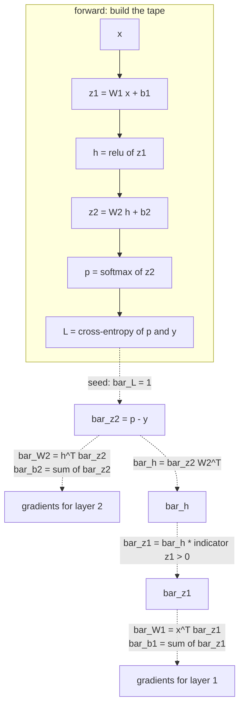

# Backpropagation and Automatic Differentiation

Backpropagation is the chain rule applied to a computation graph, arranged so
that computing the gradient of one scalar with respect to a billion parameters
costs about as much as one forward pass. That efficiency claim is the entire
reason deep learning is computationally possible, and it is worth understanding
precisely rather than accepting as a black box.

## The setup

A network is a composition of functions. Training needs
$\partial L/\partial \theta$ for every parameter $\theta$. The naive approach —
perturb each parameter and re-run the forward pass — costs $O(P)$ forward passes
for $P$ parameters. For $P = 10^9$ that is not a slow algorithm, it is an
impossible one.

Backpropagation computes all $10^9$ derivatives in **one** backward pass costing
roughly twice a forward pass.

## The chain rule, and the adjoint

For $z = f(y)$ and $y = g(x)$:

$$\frac{\partial z}{\partial x} = \frac{\partial z}{\partial y}\cdot\frac{\partial y}{\partial x}$$

Define the **adjoint** of a node $v$ as $\bar{v} = \partial L/\partial v$. The
rule that generates the whole algorithm:

$$\boxed{\;\bar{v} = \sum_{c\,:\,v\to c} \bar{c}\,\frac{\partial c}{\partial v}\;}$$

Read it as: *a node's gradient is the sum, over every node that consumes it, of
that consumer's gradient times the local derivative.*

**The sum matters enormously.** If a tensor feeds two places — a residual
connection, a tied embedding matrix, a weight applied at every timestep of an RNN
or every position of a convolution — gradients from all consumers **add**.
Overwriting instead of accumulating is the classic hand-rolled-autograd bug, and
it is why PyTorch's `.grad` accumulates and you must call `zero_grad()`.



## Forward mode vs reverse mode

Both compute exact derivatives by applying the chain rule numerically. They
differ in the direction of traversal, and that difference decides everything.

| | Forward mode | Reverse mode |
|---|---|---|
| Propagates | derivatives **with** the computation | adjoints **against** it |
| One pass gives | $\partial(\text{all outputs})/\partial(\text{one input})$ — a Jacobian **column** | $\partial(\text{one output})/\partial(\text{all inputs})$ — a Jacobian **row** |
| Passes for a full Jacobian | $n$ (inputs) | $m$ (outputs) |
| Memory | $O(1)$ extra | stores the whole forward tape |
| Best when | few inputs, many outputs | **many inputs, few outputs** |

Neural network training has $n \approx 10^9$ parameters and $m = 1$ scalar loss.
**Reverse mode wins by nine orders of magnitude.** The asymmetry is not an
optimisation detail; it is the enabling condition of the field.

The cost of that win is memory: reverse mode must keep the forward activations
until the backward pass consumes them. That is why training memory scales with
depth and batch size, and why gradient checkpointing — recomputing activations
instead of storing them — is the standard memory/compute trade.

## Vector–Jacobian products

Frameworks never build Jacobians. A layer mapping 4096 activations to 4096
activations has a $4096\times4096$ Jacobian: 16.7M entries per layer per example.

Instead, each operation implements a **VJP**: given the incoming adjoint
$\bar{\mathbf{v}}$, return $\bar{\mathbf{v}}^\top J$ without forming $J$.

| Operation | Forward | VJP |
|---|---|---|
| $Y = XW$ | matmul | $\bar{X} = \bar{Y}W^\top$, $\bar{W} = X^\top\bar{Y}$ |
| $\mathbf{y} = \mathbf{x} + \mathbf{b}$ (broadcast) | add | $\bar{\mathbf{x}} = \bar{\mathbf{y}}$, $\bar{\mathbf{b}} = \sum_{\text{batch}}\bar{\mathbf{y}}$ |
| $y = \mathrm{ReLU}(x)$ | max(0,x) | $\bar{x} = \bar{y}\odot\mathbb{1}[x>0]$ |
| $y = \sigma(x)$ | sigmoid | $\bar{x} = \bar{y}\odot y(1-y)$ |
| $y = \tanh(x)$ | tanh | $\bar{x} = \bar{y}\odot(1-y^2)$ |
| softmax + CE | fused | $\bar{\mathbf{z}} = \mathbf{p}-\mathbf{y}$ |
| $y = x_1 \odot x_2$ | elementwise product | $\bar{x}_1 = \bar{y}\odot x_2$, $\bar{x}_2 = \bar{y}\odot x_1$ |
| reshape / transpose | view | inverse reshape / transpose |
| sum over an axis | reduce | broadcast back |
| broadcast | expand | **sum** over the broadcast axis |
| concatenate | join | split |
| indexing / gather | select | **scatter-add** |

The last two rows encode a general duality worth remembering: **the VJP of a
broadcast is a sum, and the VJP of a gather is a scatter-add.** Both are
consequences of the adjoint rule's summation over consumers.

## Deriving the backward pass for a linear layer

Forward: $Y = XW + \mathbf{b}$ with $X\in\mathbb{R}^{B\times d_{in}}$,
$W\in\mathbb{R}^{d_{in}\times d_{out}}$.

Given $G = \bar{Y} \in \mathbb{R}^{B\times d_{out}}$, work out each gradient from
element-wise differentiation:

$$\bar{W}_{jk} = \sum_{i} G_{ik}\frac{\partial Y_{ik}}{\partial W_{jk}} = \sum_i G_{ik}X_{ij} \;\Longrightarrow\; \bar{W} = X^\top G$$

$$\bar{X}_{ij} = \sum_k G_{ik}\frac{\partial Y_{ik}}{\partial X_{ij}} = \sum_k G_{ik}W_{jk} \;\Longrightarrow\; \bar{X} = GW^\top$$

$$\bar{\mathbf{b}} = \sum_{i=1}^{B} G_{i,:}$$

**You can recover all three from shapes alone.** $X^\top G$ is the only product
of a $(B,d_{in})$ and a $(B,d_{out})$ that yields $(d_{in},d_{out})$. Shape
checking is the practical debugger for hand-derived gradients.

## The softmax + cross-entropy gradient

Softmax: $p_i = e^{z_i}/\sum_k e^{z_k}$. Its Jacobian, by the quotient rule with
the $i=j$ and $i\ne j$ cases handled separately:

$$\frac{\partial p_i}{\partial z_j} = p_i(\delta_{ij}-p_j)$$

Cross-entropy against a one-hot target: $L = -\sum_k y_k\log p_k$, so
$\partial L/\partial p_k = -y_k/p_k$. Chain:

$$\bar{z}_j = \sum_i \left(-\frac{y_i}{p_i}\right)p_i(\delta_{ij}-p_j) = -y_j + p_j\sum_i y_i = p_j - y_j$$

$$\boxed{\;\bar{\mathbf{z}} = \mathbf{p}-\mathbf{y}\;}$$

All that algebra collapses to a subtraction. This is why every framework fuses
the two operations: fusing skips the $K\times K$ Jacobian entirely and avoids
materialising $e^{z_i}$ for large $z_i$.

## A fully worked numeric example

Network: 1 input, 1 hidden unit, 1 output, sigmoid activations. Weights
$w_1 = 0.5$, $b_1 = 0.1$, $w_2 = 0.8$, $b_2 = -0.2$. Input $x = 1.0$, target
$y = 1.0$, loss = squared error.

**Forward:**

$$z_1 = 0.5(1.0)+0.1 = 0.6 \qquad h = \sigma(0.6) = 0.6457$$
$$z_2 = 0.8(0.6457)-0.2 = 0.3166 \qquad \hat{y} = \sigma(0.3166) = 0.5785$$
$$L = \tfrac12(0.5785-1.0)^2 = 0.0888$$

**Backward:**

$$\bar{\hat{y}} = \hat{y}-y = -0.4215$$
$$\bar{z}_2 = \bar{\hat{y}}\cdot\hat{y}(1-\hat{y}) = -0.4215 \times 0.5785 \times 0.4215 = -0.1028$$
$$\bar{w}_2 = \bar{z}_2\cdot h = -0.1028 \times 0.6457 = -0.0664$$
$$\bar{b}_2 = \bar{z}_2 = -0.1028$$
$$\bar{h} = \bar{z}_2\cdot w_2 = -0.1028\times0.8 = -0.0822$$
$$\bar{z}_1 = \bar{h}\cdot h(1-h) = -0.0822\times0.6457\times0.3543 = -0.0188$$
$$\bar{w}_1 = \bar{z}_1\cdot x = -0.0188 \qquad \bar{b}_1 = -0.0188$$

Notice the magnitudes: $\bar{z}_2 = -0.103$ and $\bar{z}_1 = -0.019$. **The
gradient shrank by a factor of 5.5 across one sigmoid layer.** Ten such layers
would shrink it by $10^{7}$. That is the vanishing gradient problem, visible in a
single hand-computed example.

## Vanishing and exploding gradients

Backpropagating through $L$ layers multiplies $L$ Jacobians:

$$\frac{\partial L}{\partial \mathbf{h}^{(0)}} = \frac{\partial L}{\partial\mathbf{h}^{(L)}}\prod_{\ell=L}^{1}\frac{\partial\mathbf{h}^{(\ell)}}{\partial\mathbf{h}^{(\ell-1)}}$$

A product of $L$ terms. If each has magnitude below 1, the product decays
exponentially; above 1, it grows exponentially.

| Activation | Max derivative | Effect over 10 layers |
|---|---|---|
| Sigmoid | 0.25 | $\le 4^{-10}\approx 10^{-6}$ |
| Tanh | 1.0 (only at 0) | vanishes once saturated |
| ReLU | 1.0 (for $x>0$) | preserved on the active path |
| GELU/SiLU | $\approx 1.1$ | preserved, smooth |

| Symptom | Diagnosis | Fixes |
|---|---|---|
| Early layers barely change; loss plateaus | vanishing | ReLU-family activations, residual connections, normalisation, better init, LSTM/GRU gating |
| Loss spikes to `inf`/`NaN`; huge gradient norms | exploding | gradient clipping, lower learning rate, normalisation, better init |

**Residual connections are the structural fix.** With
$\mathbf{h}^{(\ell)} = \mathbf{h}^{(\ell-1)} + F(\mathbf{h}^{(\ell-1)})$, the
Jacobian is $I + \partial F/\partial\mathbf{h}$. The identity term gives the
gradient a path that is multiplied by 1 at every layer, so it cannot vanish
through depth. That single observation is what made 100+ layer networks
trainable, and it is why every modern architecture — ResNets, Transformers,
U-Nets, diffusion backbones — is built from residual blocks.

**Gradient clipping** by global norm caps the magnitude while preserving
direction:

```python
torch.nn.utils.clip_grad_norm_(model.parameters(), max_norm=1.0)
```

Clip by *global* norm, not per-parameter: clipping each tensor separately
distorts the direction of the update.

## Gradient checking

When you write a custom kernel, verify it against a central finite difference,
whose error is $O(h^2)$ rather than the forward difference's $O(h)$:

$$\frac{\partial f}{\partial x_i} \approx \frac{f(\mathbf{x}+h\mathbf{e}_i)-f(\mathbf{x}-h\mathbf{e}_i)}{2h}$$

```python
def grad_check(f, x, analytic, h=1e-5):
    num = np.zeros_like(x)
    it = np.nditer(x, flags=["multi_index"])
    while not it.finished:
        i = it.multi_index
        old = x[i]
        x[i] = old + h; fp = f(x)
        x[i] = old - h; fm = f(x)
        x[i] = old
        num[i] = (fp - fm) / (2 * h)
        it.iternext()
    denom = np.maximum(np.abs(num) + np.abs(analytic), 1e-8)
    return np.max(np.abs(num - analytic) / denom)
```

| Relative error | Verdict |
|---|---|
| $< 10^{-7}$ | correct (float64) |
| $10^{-7}$ to $10^{-4}$ | suspicious; fine for float32 |
| $> 10^{-4}$ | a bug, unless a kink is involved |

Practical rules: use `float64`; freeze any stochastic component (dropout masks,
data augmentation) first; and avoid checking exactly at a ReLU kink, where the
finite difference straddles a discontinuity in the derivative.

PyTorch provides this directly:

```python
torch.autograd.gradcheck(fn, (x.double().requires_grad_(),), eps=1e-6, atol=1e-4)
```

## Custom autograd functions

```python
class StraightThroughRound(torch.autograd.Function):
    @staticmethod
    def forward(ctx, x):
        return torch.round(x)

    @staticmethod
    def backward(ctx, g):
        return g          # pretend d(round)/dx = 1
```

The **straight-through estimator** exists because the true derivative of `round`
is zero almost everywhere, which would block all gradient flow. Pretending it is
the identity is a biased estimator that nonetheless works well in practice, and
it is what makes quantisation-aware training and discrete latent variables
trainable.

Use `ctx.save_for_backward(...)` to stash tensors the backward pass needs, and
return one gradient per forward input (or `None` for non-differentiable ones).

## Memory: the real constraint

Reverse mode must retain forward activations. For a transformer, activation
memory scales as $O(\text{batch}\times\text{seq}\times\text{layers}\times d)$ and
frequently exceeds parameter memory.

| Technique | Saves | Costs |
|---|---|---|
| **Gradient checkpointing** | most activations | ~30% more compute (recompute forward) |
| Gradient accumulation | activations (smaller micro-batches) | more steps per update |
| Mixed precision | ~half of activation bytes | care with fp16 |
| Freezing layers | activations and gradients for frozen parts | less adaptation |
| LoRA / PEFT | optimiser state for frozen weights | limited expressivity |
| FlashAttention | the $O(n^2)$ attention matrix | none — it is strictly better |
| `set_to_none=True` on `zero_grad` | gradient buffers between steps | none |

```python
from torch.utils.checkpoint import checkpoint
h = checkpoint(self.block, x, use_reentrant=False)   # recompute in backward
```

## Debugging gradients

| Symptom | Likely cause | Check |
|---|---|---|
| All gradients `None` | tensor detached, or `requires_grad=False` | `param.requires_grad`, `param.grad_fn` |
| Gradients are zero | dead ReLUs, saturated activations, a detached path | histogram of activations |
| Gradients are `NaN` | `log(0)`, `0/0`, fp16 overflow | `set_detect_anomaly(True)` |
| Gradient norm grows over training | exploding | clip; lower the LR |
| Early layers have tiny gradients | vanishing | add residuals, normalisation |
| Loss does not move | `zero_grad` missing, `step` missing, LR ~0 | print the parameter delta |
| Memory grows every epoch | a graph retained across iterations | `.detach()` or `.item()` on accumulators |

Two diagnostics worth building into every training script:

```python
# per-layer gradient norms — a single layer at 1e20 localises the problem instantly
for n, p in model.named_parameters():
    if p.grad is not None:
        print(f"{n:40s} |g|={p.grad.norm():.3e}  |w|={p.norm():.3e}  ratio={p.grad.norm()/p.norm():.2e}")
```

The **update-to-weight ratio** $\|\eta\,g\|/\|w\|$ should sit around $10^{-3}$.
Orders of magnitude larger means the learning rate is too high; far smaller means
that layer is not learning.

And the single most effective debugging step in all of deep learning:
**overfit one batch.** Take 32 examples, train on them repeatedly, and confirm
the loss goes to near zero. If a model cannot memorise 32 examples, the bug is in
the model, the loss, or the gradient path — not in the data or the schedule.

## Self-check

1. State the adjoint rule and explain why the summation matters for weight tying.
2. Why does reverse mode dominate forward mode for neural network training?
3. Derive $\bar{W} = X^\top G$ for a linear layer, then recover it from shapes
   alone.
4. Show that softmax + cross-entropy gives $\bar{\mathbf{z}} = \mathbf{p} -
   \mathbf{y}$.
5. In the worked example the gradient shrank 5.5× in one layer. Extrapolate to
   20 layers and name the fix.
6. Why does a residual connection prevent vanishing gradients? Write the
   Jacobian.
7. Your custom kernel's gradient check gives relative error $3\times10^{-3}$ in
   float32. Is it broken? What would you try first?

## Where to go next

- [Neural Networks](./neural-networks.md) — the forward pass these gradients
  flow back through.
- [Activations & Initialization](./activations-and-initialization.md) — the
  choices that decide whether gradients survive.
- [Optimization & Training](./optimization-and-training.md) — what to do with
  the gradients once you have them.
