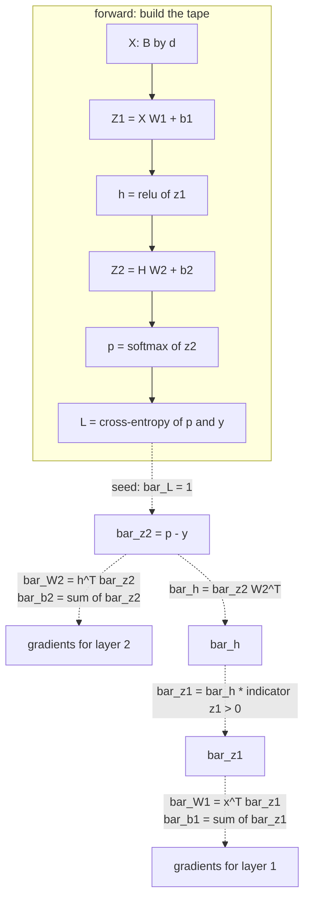

# Backpropagation and Automatic Differentiation

Backpropagation is the chain rule applied to a computation graph, arranged so
that computing the gradient of one scalar with respect to a billion parameters
costs about as much as one forward pass. That efficiency claim is the entire
reason deep learning is computationally possible, and it is worth understanding
precisely rather than accepting as a black box.

## The setup

A network is a composition of functions. Training needs
$\partial L/\partial \theta$ for every parameter $\theta$. The naive approach —
perturb each parameter and re-run the forward pass — costs $O(P)$ forward passes
for $P$ parameters. For $P = 10^9$ that is not a slow algorithm, it is an
impossible one.

Backpropagation computes all $10^9$ derivatives in **one** backward pass costing
often a small multiple of forward cost, depending on required gradients and recomputation.

We use row batches $X\in\mathbb R^{B\times d}$ and weights $W\in\mathbb R^{d\times m}$. For single-vector Jacobians, column differentials obey $df=J_f dx$ and reverse transport is $\bar x=J_f^\top\bar f$. See [calculus](../math/calculus.md) and [linear algebra](../math/linear-algebra.md) for the prerequisite conventions.

## The chain rule, and the adjoint

For $z = f(y)$ and $y = g(x)$:

$$\frac{\partial z}{\partial x} = \frac{\partial z}{\partial y}\cdot\frac{\partial y}{\partial x}$$

Define the **adjoint** of a node $v$ as $\bar{v} = \partial L/\partial v$. The
rule that generates the whole algorithm:

$$\boxed{\;\bar{v} = \sum_{c\,:\,v\to c} \bar{c}\,\frac{\partial c}{\partial v}\;}$$

Read it as: *a node's gradient is the sum, over every node that consumes it, of
that consumer's gradient times the local derivative.*

**The sum matters enormously.** If a tensor feeds two places — a residual
connection, a tied embedding matrix, a weight applied at every timestep of an RNN
or every position of a convolution — gradients from all consumers **add**.
Overwriting instead of summing loses paths. Distinguish this requirement from PyTorch's separate accumulation into leaf `.grad` buffers across backward calls. The latter supports microbatch accumulation; clear buffers at optimizer-update boundaries.



## Forward mode vs reverse mode

Both apply the chain rule to executed operations, subject to floating-point arithmetic and each operation's derivative convention. They
differ in the direction of traversal, and that difference decides everything.

| | Forward mode | Reverse mode |
|---|---|---|
| Propagates | derivatives **with** the computation | adjoints **against** it |
| One pass gives | $\partial(\text{all outputs})/\partial(\text{one input})$ — a Jacobian **column** | $\partial(\text{one output})/\partial(\text{all inputs})$ — a Jacobian **row** |
| Passes for a full Jacobian | $n$ (inputs) | $m$ (outputs) |
| Memory | tangents and live primal tensors; not constant in tensor size | saved intermediates or checkpoint recomputation |
| Best when | few inputs, many outputs | **many inputs, few outputs** |

Neural network training has $n \approx 10^9$ parameters and $m = 1$ scalar loss.
Reverse mode needs one output seed instead of a separate input seed per parameter for the complete gradient. This is a seed-count argument, not a measured billion-fold end-to-end speedup.

The cost of that win is memory: reverse mode must keep the forward activations
until the backward pass consumes them. That is why training memory scales with
depth and batch size, and why gradient checkpointing — recomputing activations
instead of storing them — is the standard memory/compute trade.

## Vector–Jacobian products

Ordinary scalar-loss training does not need full Jacobians, although frameworks expose full-Jacobian APIs when requested. A layer mapping 4096 activations to 4096
activations has a $4096\times4096$ Jacobian: 16.7M entries per layer per example.

Instead, each operation implements a **VJP**: given the incoming adjoint
$\bar{\mathbf{v}}$, return $\bar{\mathbf{v}}^\top J$ without forming $J$.

| Operation | Forward | VJP |
|---|---|---|
| $Y = XW$ | matmul | $\bar{X} = \bar{Y}W^\top$, $\bar{W} = X^\top\bar{Y}$ |
| $\mathbf{y} = \mathbf{x} + \mathbf{b}$ (broadcast) | add | $\bar{\mathbf{x}} = \bar{\mathbf{y}}$, $\bar{\mathbf{b}} = \sum_{\text{batch}}\bar{\mathbf{y}}$ |
| $y = \mathrm{ReLU}(x)$ | max(0,x) | $\bar{x} = \bar{y}\odot\mathbb{1}[x>0]$ |
| $y = \sigma(x)$ | sigmoid | $\bar{x} = \bar{y}\odot y(1-y)$ |
| $y = \tanh(x)$ | tanh | $\bar{x} = \bar{y}\odot(1-y^2)$ |
| softmax + CE | fused | $\bar{\mathbf{z}} = \mathbf{p}-\mathbf{y}$ |
| $y = x_1 \odot x_2$ | elementwise product | $\bar{x}_1 = \bar{y}\odot x_2$, $\bar{x}_2 = \bar{y}\odot x_1$ |
| reshape / transpose | view | inverse reshape / transpose |
| sum over an axis | reduce | broadcast back |
| broadcast | expand | **sum** over the broadcast axis |
| concatenate | join | split |
| indexing / gather | select | **scatter-add** |

The last two rows encode a general duality worth remembering: **the VJP of a
broadcast is a sum, and the VJP of a gather is a scatter-add.** Both are
consequences of the adjoint rule's summation over consumers.

## Deriving the backward pass for a linear layer

Forward: $Y = XW + \mathbf{b}$ with $X\in\mathbb{R}^{B\times d_{in}}$,
$W\in\mathbb{R}^{d_{in}\times d_{out}}$.

Given $G = \bar{Y} \in \mathbb{R}^{B\times d_{out}}$, work out each gradient from
element-wise differentiation:

$$\bar{W}_{jk} = \sum_{i} G_{ik}\frac{\partial Y_{ik}}{\partial W_{jk}} = \sum_i G_{ik}X_{ij} \;\Longrightarrow\; \bar{W} = X^\top G$$

$$\bar{X}_{ij} = \sum_k G_{ik}\frac{\partial Y_{ik}}{\partial X_{ij}} = \sum_k G_{ik}W_{jk} \;\Longrightarrow\; \bar{X} = GW^\top$$

$$\bar{\mathbf{b}} = \sum_{i=1}^{B} G_{i,:}$$

**Shapes are a strong check, not a complete proof.** $X^\top G$ is the only product
of a $(B,d_{in})$ and a $(B,d_{out})$ that yields $(d_{in},d_{out})$. Shape
checking is the practical debugger for hand-derived gradients.

## The softmax + cross-entropy gradient

Softmax: $p_i = e^{z_i}/\sum_k e^{z_k}$. Its Jacobian, by the quotient rule with
the $i=j$ and $i\ne j$ cases handled separately:

$$\frac{\partial p_i}{\partial z_j} = p_i(\delta_{ij}-p_j)$$

Cross-entropy against a one-hot target: $L = -\sum_k y_k\log p_k$, so
$\partial L/\partial p_k = -y_k/p_k$. Chain:

$$\bar{z}_j = \sum_i \left(-\frac{y_i}{p_i}\right)p_i(\delta_{ij}-p_j) = -y_j + p_j\sum_i y_i = p_j - y_j$$

$$\boxed{\;\bar{\mathbf{z}} = \mathbf{p}-\mathbf{y}\;}$$

For a batch mean, the result is $(P-Y)/B$. Soft targets work too when each target row sums to one. Class weighting and masking require the actual objective's denominator. Log-sum-exp avoids unstable exponentials, and a VJP avoids a full Jacobian even if the operations are not physically fused.

## A fully worked numeric example

Network: 1 input, 1 hidden unit, 1 output, sigmoid activations. Weights
$w_1 = 0.5$, $b_1 = 0.1$, $w_2 = 0.8$, $b_2 = -0.2$. Input $x = 1.0$, target
$y = 1.0$, loss = squared error.

**Forward:**

$$z_1 = 0.5(1.0)+0.1 = 0.6 \qquad h = \sigma(0.6) = 0.6457$$
$$z_2 = 0.8(0.6457)-0.2 = 0.3166 \qquad \hat{y} = \sigma(0.3166) = 0.5785$$
$$L = \tfrac12(0.5785-1.0)^2 = 0.0888$$

**Backward:**

$$\bar{\hat{y}} = \hat{y}-y = -0.4215$$
$$\bar{z}_2 = \bar{\hat{y}}\cdot\hat{y}(1-\hat{y}) = -0.4215 \times 0.5785 \times 0.4215 = -0.1028$$
$$\bar{w}_2 = \bar{z}_2\cdot h = -0.1028 \times 0.6457 = -0.0664$$
$$\bar{b}_2 = \bar{z}_2 = -0.1028$$
$$\bar{h} = \bar{z}_2\cdot w_2 = -0.1028\times0.8 = -0.0822$$
$$\bar{z}_1 = \bar{h}\cdot h(1-h) = -0.0822\times0.6457\times0.3543 = -0.0188$$
$$\bar{w}_1 = \bar{z}_1\cdot x = -0.0188 \qquad \bar{b}_1 = -0.0188$$

Notice the magnitudes: $\bar{z}_2 = -0.103$ and $\bar{z}_1 = -0.019$. **The
gradient shrank by a factor of 5.5 across one sigmoid layer.** Repeating that same contraction would shrink it dramatically; actual layers have different weights and operating points. This demonstrates local contraction, not a universal forecast.

## Vanishing and exploding gradients

Backpropagating through $L$ layers multiplies $L$ Jacobians:

$$\frac{\partial L}{\partial \mathbf{h}^{(0)}} = \frac{\partial L}{\partial\mathbf{h}^{(L)}}\prod_{\ell=L}^{1}\frac{\partial\mathbf{h}^{(\ell)}}{\partial\mathbf{h}^{(\ell-1)}}$$

A product of $L$ terms. The bound $\|J_L\cdots J_1\|_2\le\prod_\ell\|J_\ell\|_2$ shows how uniform contraction can force decay. Large individual norms permit but do not guarantee explosion: singular-vector alignment and cancellation matter.

| Activation | Max derivative | Effect over 10 layers |
|---|---|---|
| Sigmoid | 0.25 | activation-only factor $\le4^{-10}$; weights still matter |
| Tanh | 1.0 (only at 0) | vanishes once saturated |
| ReLU | 1.0 (for $x>0$) | activation preserves active coordinates; weights may contract |
| GELU/SiLU | slightly above 1 in part of the domain | smooth, not guaranteed gradient preservation |

| Symptom | Diagnosis | Fixes |
|---|---|---|
| Early layers barely change; loss plateaus | vanishing | ReLU-family activations, residual connections, normalisation, better init, LSTM/GRU gating |
| Loss spikes to `inf`/`NaN`; huge gradient norms | exploding | gradient clipping, lower learning rate, normalisation, better init |

**Residual connections are the structural fix.** With
$\mathbf{h}^{(\ell)} = \mathbf{h}^{(\ell-1)} + F(\mathbf{h}^{(\ell-1)})$, the
Jacobian is $I + \partial F/\partial\mathbf{h}$. A small residual Jacobian makes this close to identity and helps transport. But $F(h)=-h$ gives a zero Jacobian: cancellation is possible. Residual connections are a useful parameterization, not a guarantee against vanishing or explosion.

**Gradient clipping** by global norm caps the magnitude while preserving
direction:

```python
torch.nn.utils.clip_grad_norm_(model.parameters(), max_norm=1.0)
```

Clip by *global* norm, not per-parameter: clipping each tensor separately
distorts the direction of the update.

## Gradient checking

When you write a custom kernel, verify it against a central finite difference,
whose error is $O(h^2)$ rather than the forward difference's $O(h)$:

$$\frac{\partial f}{\partial x_i} \approx \frac{f(\mathbf{x}+h\mathbf{e}_i)-f(\mathbf{x}-h\mathbf{e}_i)}{2h}$$

```python
def grad_check(f, x, analytic, h=1e-5):
    num = np.zeros_like(x)
    it = np.nditer(x, flags=["multi_index"])
    while not it.finished:
        i = it.multi_index
        old = x[i]
        x[i] = old + h; fp = f(x)
        x[i] = old - h; fm = f(x)
        x[i] = old
        num[i] = (fp - fm) / (2 * h)
        it.iternext()
    denom = np.maximum(np.abs(num) + np.abs(analytic), 1e-8)
    return np.max(np.abs(num - analytic) / denom)
```

| Relative error | Verdict |
|---|---|
| Small across several step sizes | evidence for the tested inputs and directions |
| Large near zeros or kinks | inspect absolute error and differentiability |
| Persistent smooth float64 discrepancy | likely derivative, shape or reduction error |

Practical rules: use `float64`; freeze any stochastic component (dropout masks,
data augmentation) first; and avoid checking exactly at a ReLU kink, where the
finite difference straddles a discontinuity in the derivative.

PyTorch provides this directly:

```python
torch.autograd.gradcheck(fn, (x.double().requires_grad_(),), eps=1e-6, atol=1e-4)
```

## Custom autograd functions

```python
class StraightThroughRound(torch.autograd.Function):
    @staticmethod
    def forward(ctx, x):
        return torch.round(x)

    @staticmethod
    def backward(ctx, g):
        return g          # pretend d(round)/dx = 1
```

The **straight-through estimator** exists because the true derivative of `round`
is zero almost everywhere, which would block all gradient flow. Pretending it is
the identity is a biased estimator that nonetheless works well in practice, and
it is what makes quantisation-aware training and discrete latent variables
trainable.

Use `ctx.save_for_backward(...)` to stash tensors the backward pass needs, and
return one gradient per forward input (or `None` for non-differentiable ones).

## Memory: the real constraint

Reverse mode saves values needed by local derivatives, unless recomputation or
another strategy supplies them. Transformer activation terms include
$O(\text{batch}\times\text{seq}\times\text{layers}\times d)$, while naive
attention can add quadratic sequence terms. Which component dominates depends
on shapes, kernels, checkpointing and parameter-state precision.

| Technique | Saves | Costs |
|---|---|---|
| **Gradient checkpointing** | selected saved activations | recomputation and RNG/state bookkeeping |
| Gradient accumulation | activations (smaller micro-batches) | more steps per update |
| Mixed precision | ~half of activation bytes | care with fp16 |
| Freezing layers | parameter gradients and optimizer state | activations may remain needed for upstream gradients |
| LoRA / PEFT | optimiser state for frozen weights | limited expressivity |
| FlashAttention | materialized attention matrices | backend/shape constraints and different reduction ordering |
| `set_to_none=True` on `zero_grad` | gradient-buffer clearing overhead | `None` can differ from zero in optimizer behavior |

```python
from torch.utils.checkpoint import checkpoint
h = checkpoint(self.block, x, use_reentrant=False)   # recompute in backward
```

## Debugging gradients

| Symptom | Likely cause | Check |
|---|---|---|
| Expected leaf gradients `None` | unused/detached path or disabled gradients | inspect connectivity; a leaf's `grad_fn=None` is normal |
| Gradients are zero | dead ReLUs, saturated activations, a detached path | histogram of activations |
| Gradients are `NaN` | `log(0)`, `0/0`, fp16 overflow | `set_detect_anomaly(True)` |
| Gradient norm grows over training | exploding | clip; lower the LR |
| Early layers have tiny gradients | vanishing | add residuals, normalisation |
| Loss does not move | `zero_grad` missing, `step` missing, LR ~0 | print the parameter delta |
| Memory grows every epoch | a graph retained across iterations | `.detach()` or `.item()` on accumulators |

Two diagnostics worth building into every training script:

```python
# per-layer gradient norms — a single layer at 1e20 localises the problem instantly
for n, p in model.named_parameters():
    if p.grad is not None:
        print(f"{n:40s} |g|={p.grad.norm():.3e}  |w|={p.norm():.3e}  ratio={p.grad.norm()/p.norm():.2e}")
```

For plain SGD, $\eta\|g\|/\|w\|$ approximates the update ratio. For Adam, momentum or decay, measure the actual parameter change. No universal ratio is correct; compare trends and use absolute changes for near-zero parameter norms.

And the single most effective debugging step in all of deep learning:
**overfit one batch.** Take 32 examples, train on them repeatedly, and confirm
the loss decreases strongly. Disable strong regularization and check capacity and contradictory labels first. Failure narrows the investigation to data contracts, model, gradients and optimization; it does not automatically prove a code bug.

## Shared graphs, directional derivatives, and higher order

### One graph, several paths

Take $u=wx$ and $L=u^2+u+x$, with $x=2,w=3$. Forward gives $u=6$ and $L=44$.
The square contributes $12$ to $\bar u$, the direct $u$ contributes $1$, so
$\bar u=13$. Then $\bar w=13x=26$ and $\bar x=13w+1=40$. The last $1$ is the
direct skip path from $x$ to the loss. Overwriting either accumulation gives a
plausible-looking but wrong answer.

The same principle explains embeddings and convolutions. An embedding row used
at five positions receives five contributions; a convolution kernel reused at
many locations receives a sum over locations and observations. The forward
program shares storage, and reverse mode accumulates derivatives to that storage.
Advanced indexing is therefore not generally inverted by assignment: repeated
indices require scatter-add.

Calling `.backward()` again on a newly constructed graph adds another gradient
to existing leaf buffers. Calling it again on the same graph may fail because
saved tensors were released. `retain_graph=True` preserves those tensors, but
is not the usual solution for a training loop; rebuild the forward graph and
clear gradients at the appropriate update boundary.

### JVP and VJP on the same function

For $f(x_1,x_2)=(x_1x_2,x_1^2+\sin x_2)$:

$$J_f=\begin{bmatrix}x_2&x_1\\2x_1&\cos x_2\end{bmatrix}.$$

At $(2,3)$, direction $v=(1,-1)$ gives
$J_fv=(1,4-\cos3)$. Output seed $u=(2,-1)$ gives
$J_f^\top u=(2,4-\cos3)$. These are different contractions, with different
interpretations. The JVP asks how all outputs change in one input direction.
The VJP asks how an output-weighted scalar changes with every input.

They obey the adjoint identity $u^\top(Jv)=(J^\top u)^\top v$. This is a useful
test for a custom pair of forward/reverse rules, particularly when the full
Jacobian is too large. It tests consistency of the two rules, not necessarily
agreement with the actual forward function, so retain finite-difference tests too.

### A complete derivative laboratory

This CPU experiment verifies branching, repeated gathers, JVP/VJP duality,
an analytic Jacobian and a Hessian-vector product. Each assertion checks a
different derivative contract; no training convergence is needed to diagnose it.

```python runnable
import torch
from torch.func import jacrev, jvp, vjp

torch.set_num_threads(1)
torch.manual_seed(31)
dtype = torch.float64
x = torch.tensor(2.0, dtype=dtype, requires_grad=True)
w = torch.tensor(3.0, dtype=dtype, requires_grad=True)
u = w * x
loss = u.square() + u + x
loss.backward()
torch.testing.assert_close(x.grad, torch.tensor(40.0, dtype=dtype))
torch.testing.assert_close(w.grad, torch.tensor(26.0, dtype=dtype))

embedding = torch.arange(4.0, dtype=dtype, requires_grad=True)
embedding[torch.tensor([2, 0, 2])].sum().backward()
torch.testing.assert_close(embedding.grad, torch.tensor([1., 0., 2., 0.], dtype=dtype))

def function(z):
    return torch.stack((z[0] * z[1], z[0].square() + z[1].sin()))

point = torch.tensor([2., 3.], dtype=dtype)
direction = torch.tensor([1., -1.], dtype=dtype)
seed = torch.tensor([2., -1.], dtype=dtype)
expected_jacobian = torch.tensor([[3., 2.], [4., 0.]], dtype=dtype)
expected_jacobian[1, 1] = point[1].cos()
jacobian = jacrev(function)(point)
_, tangent = jvp(function, (point,), (direction,))
_, pullback = vjp(function, point)
adjoint = pullback(seed)[0]
torch.testing.assert_close(jacobian, expected_jacobian)
torch.testing.assert_close(tangent, jacobian @ direction)
torch.testing.assert_close(adjoint, jacobian.T @ seed)
torch.testing.assert_close(seed @ tangent, adjoint @ direction)

matrix = torch.tensor([[3., 1.], [1., 2.]], dtype=dtype)
z = point.clone().requires_grad_()
quadratic = 0.5 * z @ matrix @ z
gradient, = torch.autograd.grad(quadratic, z, create_graph=True)
hvp, = torch.autograd.grad(gradient @ direction, z)
torch.testing.assert_close(hvp, matrix @ direction)
print("Jacobian:", jacobian.tolist())
print("JVP:", tangent.tolist(), "VJP:", adjoint.tolist())
print("Shared paths, scatter-add and Hessian-vector checks passed.")
```

### Higher derivatives and implicit differentiation

For a smooth scalar loss, differentiating $g(\theta)^\top v$ yields $Hv$ when
$v$ is held constant. `create_graph=True` records the gradient computation so
another derivative can traverse it; `retain_graph=True` only preserves saved
state and does not by itself request differentiable gradient construction.
Hessian-vector products support curvature diagnostics and iterative Newton-type
methods without storing a $P\times P$ Hessian.

If $\theta^*(\lambda)$ is defined by a stationarity condition
$\nabla_\theta L(\theta^*,\lambda)=0$, differentiating that equation gives

$$H\frac{d\theta^*}{d\lambda}
=-\frac{\partial^2L}{\partial\theta\partial\lambda}.$$

An invertible Hessian and a locally differentiable solution are assumptions,
not guaranteed features of neural-network training. Solve the linear system
rather than forming $H^{-1}$. This can differentiate a converged inner problem
without storing every optimizer step, but differs from differentiating a finite
training trajectory. See [optimization](../math/optimization.md) for curvature
and stationary-point conditions.

## A custom derivative that can actually be checked

The straight-through example deliberately uses a surrogate. A smooth custom
operation should instead match the true derivative and, when promised, support
second derivatives. Consider $f(x)=x\sigma(x)$, whose derivative is
$\sigma(x)+x\sigma(x)(1-\sigma(x))$. Saving the original input lets the backward
computation construct its own differentiable sigmoid, preserving higher-order
dependence.

The following experiment checks first and second derivatives, sweeps central
differences, and compares checkpointed with ordinary gradients. It uses smooth
functions to isolate implementation errors from nondifferentiable points.

```python runnable
import copy
import torch
from torch import nn
from torch.utils.checkpoint import checkpoint

torch.set_num_threads(1)
torch.manual_seed(32)

class CheckedSiLU(torch.autograd.Function):
    @staticmethod
    def forward(ctx, x):
        ctx.save_for_backward(x)
        return x * torch.sigmoid(x)

    @staticmethod
    def backward(ctx, output_gradient):
        x, = ctx.saved_tensors
        probability = torch.sigmoid(x)
        derivative = probability + x * probability * (1 - probability)
        return output_gradient * derivative

x = torch.randn(6, dtype=torch.float64, requires_grad=True)
assert torch.autograd.gradcheck(CheckedSiLU.apply, (x,), eps=1e-6, atol=1e-5)
assert torch.autograd.gradgradcheck(CheckedSiLU.apply, (x,), eps=1e-6, atol=1e-5)
torch.testing.assert_close(CheckedSiLU.apply(x), nn.functional.silu(x))

point = torch.tensor(0.7, dtype=torch.float64)
analytic = torch.cos(point)
errors = []
for step in (1e-1, 1e-3, 1e-5, 1e-7, 1e-9):
    numeric = (torch.sin(point + step) - torch.sin(point - step)) / (2 * step)
    errors.append(abs((numeric - analytic).item()))
print("Finite-difference absolute errors:", errors)
assert errors[2] < errors[0] * 1e-4

plain = nn.Sequential(nn.Linear(4, 12), nn.Tanh(), nn.Linear(12, 3)).double()
recomputed = copy.deepcopy(plain)
a = torch.randn(7, 4, dtype=torch.float64, requires_grad=True)
b = a.detach().clone().requires_grad_()
ordinary_loss = plain(a).square().mean()
checkpoint_loss = checkpoint(recomputed, b, use_reentrant=False).square().mean()
ordinary_loss.backward()
checkpoint_loss.backward()
torch.testing.assert_close(ordinary_loss, checkpoint_loss)
torch.testing.assert_close(a.grad, b.grad)
for original, replayed in zip(plain.parameters(), recomputed.parameters()):
    torch.testing.assert_close(original.grad, replayed.grad)
print("First/second derivatives and checkpoint gradient equivalence passed.")
```

Central differences balance truncation error, typically $O(h^2)$ for a smooth
function, against cancellation/roundoff that grows roughly like $\epsilon/h$.
Making $h$ smaller indefinitely does not improve the estimate. Relative error is
also misleading near an exactly zero derivative, so inspect absolute error and
use a denominator floor. Directional differences reduce the cost of checking
large parameter vectors but do not inspect every independent coordinate.

Checkpoint recomputation must reproduce the relevant forward computation.
Random masks, mutable buffers, data-dependent global state and device movement
can break naive replay assumptions. The shown block is deterministic and has
no state updates; a BatchNorm block or custom random operation deserves separate
checks. Freezing a module is similarly different from wrapping it in `no_grad`:
the former prevents its parameter gradients, while the latter removes the graph
needed by upstream trainable inputs.

## Graph boundaries and failure analysis

`.detach()` creates a tensor disconnected from its history, although it may share
storage. `.item()` produces a Python scalar; using that scalar to build a new
loss loses the original derivative path. NumPy conversions also leave PyTorch's
graph unless a custom differentiable bridge is supplied. Ordinary Python control
flow records the branch actually executed, not derivatives of all hypothetical
branches.

Non-leaf tensors usually do not populate `.grad` unless `retain_grad()` is
requested. A leaf parameter having `grad_fn=None` is normal: it is a source of
the graph, not an operation result. An unused parameter may have `grad=None`;
that differs from a used parameter whose local derivative happens to be zero.
Optimizers can treat those cases differently, particularly with momentum or decay.

In-place modification can invalidate a value saved for backward, causing a
version-counter error. Avoid using `.data` to bypass those checks. Parameter
updates belong in an optimizer or an explicitly gradient-disabled update block.
Retaining a loss tensor in an ever-growing list can retain graph history; record
detached scalars for ordinary logging instead.

When gradients become nonfinite, identify the first invalid operation, not just
the first parameter with a nonfinite gradient. Masking an invalid division after
it occurred does not necessarily remove its problematic backward computation.
Compute safe branches without generating invalid intermediates where possible.
Anomaly detection is useful diagnostically but adds overhead and should not be
treated as a production performance setting.

### Derivatives of an executed program

Autodiff differentiates the program that ran. A Python conditional can choose
different smooth branches on either side of a threshold; away from the boundary,
the selected branch has a valid local derivative. At the switching boundary,
the mathematical function may be nondifferentiable. Taking an `argmax` to select
an index ordinarily supplies no derivative describing how the chosen index
would change. Differentiating the values gathered at that index is a narrower
operation and does not repair the missing discrete-selection derivative.

Broadcasting can similarly hide an objective bug while producing perfectly
correct derivatives of the wrong program. Predictions of shape `(B,1)` minus
targets `(B,)` produce a `(B,B)` tensor, comparing every prediction with every
target. Autograd correctly differentiates that unintended pairwise objective.
Assertions about shapes, units and reduction are therefore as important as
gradient checks. A gradient checker cannot determine what loss the author meant.

## Self-check

1. **Why must shared-weight gradients sum?** If one parameter changes several
   consumers, the loss changes through every path. The derivative of a sum of
   path contributions is their sum, not the contribution encountered last.
2. **Why reverse mode for training?** A scalar objective needs one reverse seed
   to obtain derivatives with respect to all parameters. A full gradient from
   forward mode would require many input-direction seeds. For few inputs and
   many outputs, that advantage can reverse.
3. **Derive the linear weight gradient.** Since
   $Y_{ik}=\sum_jX_{ij}W_{jk}+b_k$, differentiation gives
   $\bar W_{jk}=\sum_iX_{ij}G_{ik}$. Hence $\bar W=X^\top G$ with the same
   shape as $W$. Shape compatibility supports, but does not replace, the derivation.
4. **Where does $p-y$ come from?** Contract the softmax Jacobian
   $p_i(\delta_{ij}-p_j)$ with $-y_i/p_i$. Target normalization gives
   $-y_j+p_j\sum_i y_i=p_j-y_j$. A batch mean adds one factor $1/B$.
5. **Extrapolate a repeated contraction.** If the same magnitude factor $1/5.5$
   applied twenty times, its product would be about $1.6\times10^{-15}$.
   Actual Jacobians vary, so measure transport; initialization, normalization and
   residual parameterization can help, but none follows from this one scalar trace.
6. **Can a residual block erase gradients?** Yes: $F(x)=-x$ makes
   $I+J_F=0$. With $\|J_F\|_2<1$, singular values are bounded below by
   $1-\|J_F\|_2$, which explains why sufficiently small residual branches help
   locally without giving a depth-independent guarantee.
7. **Is relative error $0.003$ in float32 proof of a bug?** No. Recheck smooth
   points in float64, sweep finite-difference step sizes, inspect absolute error
   and remove randomness. Persistent discrepancies then warrant implementation
   inspection, especially reduction and broadcasting.
8. **Why does gathering index 2 twice double its gradient?** Both output entries
   depend on the same input coordinate. The gather VJP scatters and adds rather
   than overwriting, exactly like weight sharing.
9. **Why can frozen layers retain activations?** Their input may depend on an
   upstream trainable parameter. Computing that parameter's gradient still needs
   the frozen layer's input derivative, even though its own weight gradient is omitted.
10. **Should an STE pass finite-difference gradcheck?** Usually not. It deliberately
    supplies a surrogate backward rule inconsistent with the discrete forward
    derivative. Validate its intended surrogate separately rather than hiding
    the discrepancy with permissive tolerances.

## Where to go next

- [Neural Networks](./neural-networks.md) — the forward pass these gradients
  flow back through.
- [Activations & Initialization](./activations-and-initialization.md) — the
  choices that decide whether gradients survive.
- [Optimization & Training](./optimization-and-training.md) — what to do with
  the gradients once you have them.

Primary implementation references: [autograd mechanics](https://docs.pytorch.org/docs/stable/notes/autograd.html),
[gradcheck](https://docs.pytorch.org/docs/stable/generated/torch.autograd.gradcheck.html),
and [checkpointing](https://docs.pytorch.org/docs/stable/checkpoint.html).
The original [ResNet paper](https://arxiv.org/abs/1512.03385) motivates residual
learning; it does not establish a universal nonvanishing-gradient theorem.
