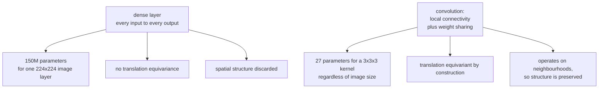

# Convolutional Neural Networks

A convolution is a dense layer with two constraints: **local connectivity** and
**weight sharing**. Both are statements about images — that meaning is local, and
that a feature detector useful in one place is useful everywhere — and imposing
them turns an intractable model into a practical one.

## Why not just use a dense layer?

For a 224×224 RGB image flattened to 150,528 inputs, a single dense layer with
1,000 units needs **150 million parameters**. Three problems, all fatal:

1. **Parameter count.** You cannot fit or train that from any realistic dataset.
2. **No translation equivariance.** A cat in the top-left and a cat in the
   bottom-right are entirely different input patterns, so the network must learn
   "cat" separately at every position.
3. **Spatial structure destroyed.** Flattening discards the fact that adjacent
   pixels are related.

Convolution fixes all three at once. The same 3×3×3 kernel applied at every
position is **27 parameters**, it detects its feature wherever it appears, and it
operates on spatial neighbourhoods.



## The convolution operation

For input $X$, kernel $K$ of size $k\times k$, at output position $(i,j)$ and
output channel $o$:

$$Y_{o,i,j} = b_o + \sum_{c=1}^{C_{in}}\sum_{u=0}^{k-1}\sum_{v=0}^{k-1} K_{o,c,u,v}\,X_{c,\,i\cdot s+u-p,\;j\cdot s+v-p}$$

(Strictly this is *cross-correlation*; true convolution flips the kernel. Since
the kernel is learned, the distinction is irrelevant in practice and every
framework calls it convolution.)

### The four hyperparameters

| Parameter | Effect | Common values |
|---|---|---|
| **Kernel size** $k$ | receptive field of one layer | 3 (almost always), 1, 7 for stems |
| **Stride** $s$ | downsampling factor | 1, or 2 to halve resolution |
| **Padding** $p$ | preserves spatial size at the border | `same` = $(k-1)/2$ for odd $k$ |
| **Dilation** $d$ | spacing between kernel taps | 1, or >1 for large receptive fields |

Output size:

$$H_{out} = \left\lfloor\frac{H_{in}+2p-d(k-1)-1}{s}\right\rfloor+1$$

**Worked**: $H_{in}=224$, $k=3$, $s=1$, $p=1$, $d=1$ gives
$\lfloor(224+2-2-1)/1\rfloor+1 = 224$. Same size — which is why 3×3 with padding
1 is the universal default.

With $s=2$: $\lfloor 223/2\rfloor + 1 = 112$. Halved.

**Why 3×3 dominates.** Two stacked 3×3 convolutions have the same 5×5 receptive
field as one 5×5 convolution, but use $2\times9C^2 = 18C^2$ parameters instead of
$25C^2$, and include an extra non-linearity. Three stacked 3×3 match a 7×7 with
$27C^2$ against $49C^2$. This was VGG's central observation and it settled the
question.

**1×1 convolutions** are not degenerate. They mix **channels** at each spatial
position — a per-pixel fully connected layer across the channel dimension. They
are how bottleneck blocks change channel counts cheaply, and they are the entire
basis of the "network in network" and Inception designs.

### Parameter and FLOP counts

$$\text{params} = C_{out}\bigl(C_{in}\cdot k^2 + 1\bigr), \qquad \text{FLOPs} \approx 2\,H_{out}W_{out}\,C_{out}\,C_{in}k^2$$

Worked: a 3×3 convolution with 256 input and 512 output channels on a 28×28
feature map is $512(256\cdot9+1) = 1{,}180{,}160$ parameters and roughly
$2\cdot28\cdot28\cdot512\cdot256\cdot9 \approx 1.85$ GFLOPs.

Note that parameter count is independent of spatial size but FLOPs are not.
Early layers have few parameters and enormous FLOPs; late layers have the
reverse. Optimising for "parameters" and optimising for "latency" are therefore
different problems.

## Receptive field

The region of the input that influences one output unit. It grows with depth:

$$RF_\ell = RF_{\ell-1} + (k_\ell-1)\prod_{i<\ell}s_i$$

| Layer | $k$ | $s$ | RF |
|---|---|---|---|
| 1 | 3 | 1 | 3 |
| 2 | 3 | 1 | 5 |
| 3 | 3 | 2 | 9 |
| 4 | 3 | 1 | 13 |
| 5 | 3 | 2 | 21 |

**The receptive field must cover the object.** A network whose deepest units see
only 21 pixels cannot recognise a 100-pixel object as a whole. Strategies to grow
it: more depth, stride/pooling, dilated convolutions (which grow it
exponentially without losing resolution), or global pooling at the end.

The **effective** receptive field is smaller than the theoretical one and roughly
Gaussian — centre pixels contribute far more than edge pixels — which is a good
reason not to cut the theoretical receptive field too close to the object size.

## Pooling

| Type | Operation | Use |
|---|---|---|
| Max pooling | max over a window | classic downsampling; keeps the strongest response |
| Average pooling | mean over a window | smoother; used in some architectures |
| **Global average pooling** | mean over all spatial positions | replaces the flatten + dense head; far fewer parameters |
| Adaptive pooling | to a fixed output size | handles variable input sizes |
| Strided convolution | learned downsampling | modern replacement for pooling |

**Global average pooling** was an important simplification. VGG's classifier head
(flatten 7×7×512, then dense 4096) is ~102M parameters — most of the network.
GAP reduces 7×7×512 to a 512-vector, and the classifier becomes 512×1000 = 512k.
It also makes the network accept any input size and improves interpretability
(each channel becomes a class-relevant feature map, which is what class
activation mapping exploits).

Modern architectures increasingly **replace pooling with strided convolutions**,
which learn the downsampling rather than fixing it.

## The architecture lineage

Each one is a specific fix for a specific problem.

| Year | Model | Contribution |
|---|---|---|
| 1998 | **LeNet-5** | convolution + pooling + dense; MNIST |
| 2012 | **AlexNet** | ReLU, dropout, GPU training, augmentation; won ImageNet by 10 points |
| 2014 | **VGG** | depth with uniform 3×3 stacks; showed 3×3 beats larger kernels |
| 2014 | **Inception/GoogLeNet** | parallel multi-scale branches; 1×1 bottlenecks; GAP |
| 2015 | **ResNet** | residual connections → 152 layers trainable; solved the degradation problem |
| 2016 | **DenseNet** | every layer connected to every later layer; feature reuse |
| 2017 | **MobileNet** | depthwise separable convolutions for mobile |
| 2017 | **SENet** | squeeze-and-excitation: learned per-channel attention |
| 2019 | **EfficientNet** | compound scaling of depth, width, and resolution together |
| 2020 | **ViT** | transformers on image patches; needs large-scale pretraining |
| 2021 | **ConvNeXt** | a ResNet modernised with ViT design choices; matches ViT |
| 2022+ | Hybrids | conv stems with attention stages, e.g. CoAtNet, MaxViT |

### The ResNet block

$$\mathbf{y} = \mathcal{F}(\mathbf{x}, \{W_i\}) + \mathbf{x}$$

The problem it solved was **degradation**, and the detail matters: a 56-layer
plain network had higher *training* error than a 20-layer one. That is not
overfitting — a deeper network can always represent a shallower one by making the
extra layers identity maps, so it is an **optimisation** failure. Residual
connections make the identity the default rather than something that must be
learned.

The **bottleneck block** (used from ResNet-50 up) is 1×1 to reduce channels, 3×3
to process, 1×1 to expand. For 256 channels with a 64-channel bottleneck that is
about 70k parameters versus 1.18M for two plain 3×3 convolutions at 256 channels
— a 17× saving with comparable capacity.

When the residual branch changes shape (stride 2, or a channel-count change), the
skip path needs a projection: a 1×1 convolution with matching stride.

### Depthwise separable convolutions

Factor a standard convolution into two steps:

1. **Depthwise**: one $k\times k$ kernel per input channel, applied
   independently. Spatial filtering, no channel mixing.
2. **Pointwise**: a 1×1 convolution. Channel mixing, no spatial extent.

| | Standard | Separable |
|---|---|---|
| Parameters | $C_{in}C_{out}k^2$ | $C_{in}k^2 + C_{in}C_{out}$ |
| For $C_{in}=C_{out}=256$, $k=3$ | 589,824 | 2,304 + 65,536 = 67,840 |
| Reduction | — | **8.7×** |

The general reduction factor is $\frac{1}{C_{out}} + \frac{1}{k^2}$, so for
$k=3$ and large $C_{out}$ it approaches 9×. This is the core of MobileNet,
Xception, and EfficientNet, and the reason CNNs run on phones at all.

**A caution**: depthwise convolutions have low arithmetic intensity — few FLOPs
per byte moved — so they are memory-bandwidth bound and do not achieve the
speedup their FLOP count suggests on GPUs. They shine on mobile CPUs and
dedicated accelerators.

### Squeeze-and-excitation

Global-pool the feature map to one value per channel, pass through a small MLP,
and use the output to rescale each channel:

$$\mathbf{s} = \sigma\bigl(W_2\,\delta(W_1\,\mathrm{GAP}(X))\bigr), \qquad \tilde{X}_c = s_c X_c$$

A learned, input-dependent channel attention. It costs almost nothing (a
bottleneck MLP on $C$ values) and reliably adds around 1% top-1 accuracy, which
is why it appears in EfficientNet and many later designs.

## Modern CNN design

**ConvNeXt** is worth studying because it is a controlled experiment: take a
ResNet-50 and apply, one at a time, the design choices that made ViTs work.

| Change | Gain |
|---|---|
| Training recipe (AdamW, 300 epochs, RandAugment, mixup, stochastic depth) | +2.7% |
| Stage compute ratio 3:3:9:3 (ViT-like) | +0.6% |
| Patchify stem (4×4, stride 4) | +0.1% |
| Depthwise convolution, wider network | +1.0% |
| Inverted bottleneck (expand then contract) | +0.7% |
| Larger 7×7 kernel | +0.7% |
| GELU instead of ReLU, fewer activations | +0.2% |
| **LayerNorm** instead of BatchNorm, fewer norms | +0.2% |
| Separate downsampling layers | +0.5% |

The conclusion is important: **much of the ViT-over-CNN gap was training recipe
and macro-design, not self-attention.** A modernised CNN matches a ViT at
comparable scale. Convolution's inductive bias remains a genuine advantage in the
small-to-medium data regime.

## Practical training

```python
model = torchvision.models.resnet50(weights="IMAGENET1K_V2")
model.fc = nn.Linear(2048, num_classes)
model = model.to(memory_format=torch.channels_last)      # 20-40% faster on tensor cores

train_tf = transforms.Compose([
    transforms.RandomResizedCrop(224, scale=(0.35, 1.0)),
    transforms.RandomHorizontalFlip(),
    transforms.TrivialAugmentWide(),
    transforms.ToTensor(),
    transforms.Normalize([0.485, 0.456, 0.406], [0.229, 0.224, 0.225]),
    transforms.RandomErasing(p=0.25),
])
```

| Practice | Reason |
|---|---|
| Start from pretrained weights | almost always beats training from scratch below ~1M images |
| `channels_last` memory format | matches tensor-core layout; large speedup, no accuracy change |
| Normalise with the pretrained model's statistics | the model expects that input distribution |
| Strong augmentation | CNNs overfit quickly on modest datasets |
| Mixed precision (bf16) | 2–3× throughput |
| Label smoothing 0.1 | small gain, better calibration |
| Cosine schedule with warmup | the modern default |
| Stochastic depth for deep models | strong regulariser for 100+ layers |
| Test-time augmentation | ~0.5% for free, at $k\times$ inference cost |
| EMA of weights | consistently a small gain; nearly free |

## Beyond classification

| Task | Architecture pattern |
|---|---|
| Classification | backbone → GAP → linear |
| Object detection (two-stage) | backbone → region proposals → per-region heads (Faster R-CNN) |
| Object detection (one-stage) | backbone → FPN → dense per-anchor heads (RetinaNet, YOLO) |
| Detection (set prediction) | backbone → transformer → Hungarian matching (DETR) |
| Semantic segmentation | encoder–decoder with skips (U-Net), or dilated convolutions (DeepLab) |
| Instance segmentation | detection + per-region mask head (Mask R-CNN) |
| Keypoints / pose | heatmap regression per keypoint |
| Depth / optical flow | encoder–decoder, dense regression |
| Super-resolution | residual blocks + sub-pixel upsampling |
| Video | 3-D convolutions, or 2-D + temporal aggregation |

**U-Net's skip connections** are the key idea for dense prediction: the encoder
loses spatial resolution while gaining semantics, and the skips restore the
fine-grained localisation that pooling destroyed. It was designed for biomedical
segmentation and now forms the backbone of essentially every diffusion image
model.

**Feature pyramid networks** solve the multi-scale problem: detect small objects
using high-resolution early features and large objects using semantically rich
late features, with a top-down pathway carrying semantics back down to high
resolution.

## Common issues

| Symptom | Cause | Fix |
|---|---|---|
| Overfits quickly on a small dataset | too much capacity, too little augmentation | pretrained weights, stronger augmentation, freeze early layers |
| Poor on small objects | receptive field or resolution mismatch | FPN, higher input resolution, dilated convolutions |
| Works on validation, fails in the field | distribution shift (lighting, camera, domain) | domain-matched augmentation, collect representative data |
| Batch size 4 destroys accuracy | BatchNorm statistics too noisy | GroupNorm, or gradient accumulation with SyncBN |
| Very slow training | dataloader-bound; wrong memory format | more workers, `channels_last`, profile |
| Not translation invariant despite convolution | strided layers alias; padding breaks equivariance at borders | anti-aliased downsampling (BlurPool) |
| Sensitive to tiny perturbations | adversarial fragility | adversarial training, augmentation |

That "not translation invariant" row surprises people. Convolution is
translation *equivariant*, and pooling is often assumed to add invariance — but
strided operations violate the Nyquist criterion, so shifting an input by one
pixel can change the prediction substantially. Anti-aliased downsampling (a blur
before the stride) largely fixes it.

## Self-check

1. Compute the parameter count of a dense layer on a 224×224×3 image with 1,000
   outputs, and of a 3×3×3×64 convolution. Explain the ratio.
2. Give the output size for $H=64$, $k=5$, $s=2$, $p=2$, $d=1$.
3. Why are two 3×3 convolutions preferred to one 5×5?
4. What does a 1×1 convolution do, and why is it useful?
5. Compute the parameter saving of a depthwise separable convolution with
   $C_{in}=C_{out}=512$, $k=3$.
6. Explain the degradation problem and why it is not overfitting.
7. What did ConvNeXt demonstrate about the ViT-versus-CNN comparison?

## Where to go next

- [RNNs & Sequence Models](./rnns-and-sequence-models.md) — the other classical
  architecture family.
- [Attention & Transformers](./attention-and-transformers.md) — what replaced
  both for most tasks.
- [Transfer Learning](./transfer-learning-and-finetuning.md) — using a pretrained
  backbone.
