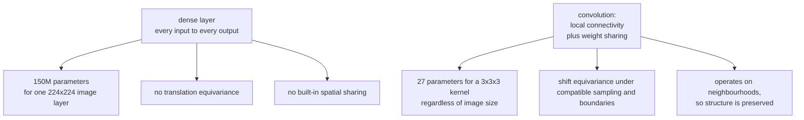

# Convolutional Neural Networks

A convolution is a dense layer with two constraints: **local connectivity** and
**weight sharing**. Both are statements about images — that meaning is local, and
that a feature detector useful in one place is useful everywhere — and imposing
them turns an intractable model into a practical one.

## Why not just use a dense layer?

For a 224×224 RGB image flattened to 150,528 inputs, a single dense layer with
1,000 units needs **150 million parameters**. Three reasons to consider spatial structure:

1. **Parameter count.** This is expensive and often statistically inefficient, though not inherently impossible to train.
2. **No translation equivariance.** A cat in the top-left and a cat in the
   bottom-right are entirely different input patterns, so the network must learn
   "cat" separately at every position.
3. **Spatial structure destroyed.** Flattening preserves pixel information if the shape is known, but a generic dense layer does not encode spatial locality or weight sharing.

Convolution fixes all three at once. The same 3×3×3 kernel applied at every
position is **27 parameters**, it detects its feature wherever it appears, and it
operates on spatial neighbourhoods.



## The convolution operation

For input $X$, kernel $K$ of size $k\times k$, at output position $(i,j)$ and
output channel $o$:

$$Y_{o,i,j} = b_o + \sum_{c=1}^{C_{in}}\sum_{u=0}^{k-1}\sum_{v=0}^{k-1} K_{o,c,u,v}\,X_{c,\,i\cdot s+d u-p,\;j\cdot s+d v-p}$$

(This is cross-correlation; mathematical convolution flips the kernel. Either orientation can be learned, but a fixed hand-designed kernel must follow the library convention. Out-of-image values follow the chosen padding rule.)

### The four hyperparameters

| Parameter | Effect | Common values |
|---|---|---|
| **Kernel size** $k$ | receptive field of one layer | 3, 1, and larger kernels in some stems/depthwise blocks |
| **Stride** $s$ | downsampling factor | 1, or 2 to halve resolution |
| **Padding** $p$ | boundary extension and output geometry | unit-stride symmetric same padding is $d(k-1)/2$ when integral |
| **Dilation** $d$ | spacing between kernel taps | 1, or >1 for large receptive fields |

Output size:

$$H_{out} = \left\lfloor\frac{H_{in}+2p-d(k-1)-1}{s}\right\rfloor+1$$

**Worked**: $H_{in}=224$, $k=3$, $s=1$, $p=1$, $d=1$ gives
$\lfloor(224+2-2-1)/1\rfloor+1 = 224$. Same size — which is why 3×3 with padding
1 is the universal default.

With $s=2$: $\lfloor 223/2\rfloor + 1 = 112$. Halved.

**Why 3×3 dominates.** Two stacked 3×3 convolutions have the same 5×5 receptive
field as one 5×5 convolution, but use $2\times9C^2 = 18C^2$ parameters instead of
$25C^2$, and include an extra non-linearity. Three stacked 3×3 match a 7×7 with
$27C^2$ against $49C^2$. This motivates VGG-style stacks under equal channel widths. Different intermediate widths, nonlinearities and efficient large-kernel designs change the comparison.

**1×1 convolutions** are not degenerate. They mix **channels** at each spatial
position — a per-pixel fully connected layer across the channel dimension. They
are how bottleneck blocks change channel counts cheaply, and they are the entire
basis of the "network in network" and Inception designs.

### Parameter and FLOP counts

For $g$ groups, with $g$ dividing both channel counts:

$P=C_{out}\left(\frac{C_{in}}g k_Hk_W+1\right),\qquad
F\approx2B H_{out}W_{out}C_{out}\frac{C_{in}}g k_Hk_W.$

Omit the $+1$ when bias is disabled. The FLOP count omits bias, activation and other overhead; dilation changes accessed locations but not the number of taps.

Worked: a 3×3 convolution with 256 input and 512 output channels on a 28×28
feature map is $512(256\cdot9+1) = 1{,}180{,}160$ parameters and roughly
$2\cdot28\cdot28\cdot512\cdot256\cdot9 \approx 1.85$ GFLOPs.

Note that parameter count is independent of spatial size but FLOPs are not.
Early layers have few parameters and enormous FLOPs; late layers have the
reverse. Optimising for "parameters" and optimising for "latency" are therefore
different problems.

## Receptive field

The region of the input that influences one output unit. It grows with depth:

$j_0=1,\quad RF_0=1,\quad
RF_\ell=RF_{\ell-1}+d_\ell(k_\ell-1)j_{\ell-1},\quad
j_\ell=s_\ell j_{\ell-1}.$

The incoming jump $j_{\ell-1}$, not the current layer's new jump, expands the field.

| Layer | $k$ | $s$ | RF |
|---|---|---|---|
| 1 | 3 | 1 | 3 |
| 2 | 3 | 1 | 5 |
| 3 | 3 | 2 | 7 |
| 4 | 3 | 1 | 11 |
| 5 | 3 | 2 | 15 |

A local unit cannot directly combine evidence outside its receptive field. But a classifier that pools many local units may still recognize a large object from local evidence; the receptive field of the complete output, not only one feature cell, determines available information. Strategies to grow
it: more depth, stride/pooling, dilated convolutions (exponential dilation schedules can grow span rapidly without reducing resolution), or global pooling at the end.

The **effective** receptive field is smaller than the theoretical one and roughly
Gaussian — centre pixels contribute far more than edge pixels — which is a good
reason not to cut the theoretical receptive field too close to the object size.

## Pooling

| Type | Operation | Use |
|---|---|---|
| Max pooling | max over a window | classic downsampling; keeps the strongest response |
| Average pooling | mean over a window | smoother; used in some architectures |
| **Global average pooling** | mean over all spatial positions | replaces the flatten + dense head; far fewer parameters |
| Adaptive pooling | to a fixed output size | handles variable input sizes |
| Strided convolution | learned downsampling | modern replacement for pooling |

**Global average pooling** was an important simplification. VGG's classifier head
(flatten 7×7×512, then dense 4096) is ~102M parameters — most of the network.
GAP reduces 7×7×512 to a 512-vector, and the classifier becomes 512×1000 = 512k.
It removes a fixed flattened-head size requirement, subject to valid intermediate dimensions, and supports class activation mapping
(each channel becomes a class-relevant feature map, which is what class
activation mapping exploits).

Modern architectures increasingly **replace pooling with strided convolutions**,
which learn the downsampling rather than fixing it.

## The architecture lineage

Each one is a specific fix for a specific problem.

| Year | Model | Contribution |
|---|---|---|
| 1998 | **LeNet-5** | convolution + pooling + dense; MNIST |
| 2012 | **AlexNet** | ReLU, dropout, GPU training, augmentation; won ImageNet by 10 points |
| 2014 | **VGG** | depth with uniform 3×3 stacks; showed 3×3 beats larger kernels |
| 2014 | **Inception/GoogLeNet** | parallel multi-scale branches; 1×1 bottlenecks; GAP |
| 2015 | **ResNet** | residual connections → 152 layers trainable; solved the degradation problem |
| 2016 | **DenseNet** | every layer connected to every later layer; feature reuse |
| 2017 | **MobileNet** | depthwise separable convolutions for mobile |
| 2017 | **SENet** | squeeze-and-excitation: learned per-channel attention |
| 2019 | **EfficientNet** | compound scaling of depth, width, and resolution together |
| 2020 | **ViT** | transformers on image patches; needs large-scale pretraining |
| 2022 | **ConvNeXt** | a ResNet modernised with ViT design choices; matches ViT |
| 2022+ | Hybrids | conv stems with attention stages, e.g. CoAtNet, MaxViT |

### The ResNet block

$$\mathbf{y} = \mathcal{F}(\mathbf{x}, \{W_i\}) + \mathbf{x}$$

The problem it solved was **degradation**, and the detail matters: a 56-layer
plain network had higher *training* error than a 20-layer one. That is not
overfitting — when compatible widths and operations permit identity maps, a deeper network can represent a shallower one with those maps, so it is an **optimisation** failure. Residual
connections make the identity the default rather than something that must be
learned.

The **bottleneck block** (used from ResNet-50 up) is 1×1 to reduce channels, 3×3
to process, 1×1 to expand. For 256 channels with a 64-channel bottleneck that is
$256\cdot64+9\cdot64^2+64\cdot256=69,632$ weights, compared with $2\cdot9\cdot256^2=1,179,648$ for two plain convolutions. The approximately 17-fold reduction changes the function class; 'comparable capacity' is not an algebraic consequence.

When the residual branch changes shape (stride 2, or a channel-count change), the
skip path needs a projection: a 1×1 convolution with matching stride.

### Depthwise separable convolutions

Factor a standard convolution into two steps:

1. **Depthwise**: one $k\times k$ kernel per input channel, applied
   independently. Spatial filtering, no channel mixing.
2. **Pointwise**: a 1×1 convolution. Channel mixing, no spatial extent.

| | Standard | Separable |
|---|---|---|
| Parameters | $C_{in}C_{out}k^2$ | $C_{in}k^2 + C_{in}C_{out}$ |
| For $C_{in}=C_{out}=256$, $k=3$ | 589,824 | 2,304 + 65,536 = 67,840 |
| Reduction | — | **8.7×** |

The separable-to-standard cost ratio is $\frac{1}{C_{out}}+\frac{1}{k^2}$. Its reciprocal is the reduction factor, approaching nine for $k=3$ and large $C_{out}$. This is the core of MobileNet,
Xception, and EfficientNet, and the reason CNNs run on phones at all.

**A caution**: depthwise convolutions have low arithmetic intensity — few FLOPs
per byte moved — so they are memory-bandwidth bound and do not achieve the
speedup their FLOP count suggests on GPUs. They shine on mobile CPUs and
dedicated accelerators.

### Squeeze-and-excitation

Global-pool the feature map to one value per channel, pass through a small MLP,
and use the output to rescale each channel:

$$\mathbf{s} = \sigma\bigl(W_2\,\delta(W_1\,\mathrm{GAP}(X))\bigr), \qquad \tilde{X}_c = s_c X_c$$

A learned, input-dependent channel attention. Its bottleneck MLP adds roughly $2C^2/r$ weights for reduction ratio $r$, plus pooling and rescaling. It is inexpensive relative to many spatial convolutions, but latency and accuracy gains depend on the model and benchmark.

## Modern CNN design

**ConvNeXt** is worth studying because it is a controlled experiment: take a
ResNet-50 and apply, one at a time, the design choices that made ViTs work.

| Change | Mechanism to investigate |
|---|---|
| Training recipe (AdamW, long schedules, RandAugment, mixup, stochastic depth) | optimization and regularization are part of the comparison |
| Stage compute ratio 3:3:9:3 | redistribute depth across resolutions |
| Patchify stem (4×4, stride 4) | stronger initial downsampling |
| Depthwise convolution, wider network | separate spatial processing from channel mixing |
| Inverted bottleneck (expand then contract) | transform through a wider channel representation |
| Larger 7×7 kernel | grow local span in a depthwise operator |
| GELU instead of ReLU, fewer activations | alter nonlinear placement and behavior |
| **LayerNorm** instead of BatchNorm, fewer norms | change normalization axes and placement |
| Separate downsampling layers | decouple resolution transitions from feature blocks |

The conclusion is important: **much of the ViT-over-CNN gap was training recipe
and macro-design, not self-attention.** A modernised CNN matches a ViT at
comparable scale. Convolution's inductive bias remains a genuine advantage in the
small-to-medium data regime.

## Practical training

```python
model = torchvision.models.resnet50(weights="IMAGENET1K_V2")
model.fc = nn.Linear(2048, num_classes)
model = model.to(memory_format=torch.channels_last)      # layout candidate; measure on the target hardware

train_tf = transforms.Compose([
    transforms.RandomResizedCrop(224, scale=(0.35, 1.0)),
    transforms.RandomHorizontalFlip(),
    transforms.TrivialAugmentWide(),
    transforms.ToTensor(),
    transforms.Normalize([0.485, 0.456, 0.406], [0.229, 0.224, 0.225]),
    transforms.RandomErasing(p=0.25),
])
```

| Practice | Reason |
|---|---|
| Start from pretrained weights | useful baseline when source features align with the target domain |
| `channels_last` memory format | may improve supported kernels; layout conversions can offset gains |
| Normalise with the pretrained model's statistics | the model expects that input distribution |
| Strong augmentation | CNNs overfit quickly on modest datasets |
| Mixed precision (bf16) | potential throughput/memory gains on supported hardware |
| Label smoothing 0.1 | small gain, better calibration |
| Cosine schedule with warmup | the modern default |
| Stochastic depth for deep models | strong regulariser for 100+ layers |
| Test-time augmentation | ensemble over valid transforms; extra inference cost and task-dependent gains |
| EMA of weights | smooths parameter trajectories; validate quality and account for the extra copy |

## Beyond classification

| Task | Architecture pattern |
|---|---|
| Classification | backbone → GAP → linear |
| Object detection (two-stage) | backbone → region proposals → per-region heads (Faster R-CNN) |
| Object detection (one-stage) | backbone → FPN → dense per-anchor heads (RetinaNet, YOLO) |
| Detection (set prediction) | backbone → transformer → Hungarian matching (DETR) |
| Semantic segmentation | encoder–decoder with skips (U-Net), or dilated convolutions (DeepLab) |
| Instance segmentation | detection + per-region mask head (Mask R-CNN) |
| Keypoints / pose | heatmap regression per keypoint |
| Depth / optical flow | encoder–decoder, dense regression |
| Super-resolution | residual blocks + sub-pixel upsampling |
| Video | 3-D convolutions, or 2-D + temporal aggregation |

**U-Net's skip connections** are the key idea for dense prediction: the encoder
loses spatial resolution while gaining semantics, and the skips restore the
fine-grained localisation that pooling destroyed. It was designed for biomedical
segmentation and now forms the a common diffusion backbone; transformer-based diffusion architectures are another important family.

**Feature pyramid networks** solve the multi-scale problem: detect small objects
using high-resolution early features and large objects using semantically rich
late features, with a top-down pathway carrying semantics back down to high
resolution.

## Common issues

| Symptom | Cause | Fix |
|---|---|---|
| Overfits quickly on a small dataset | too much capacity, too little augmentation | pretrained weights, stronger augmentation, freeze early layers |
| Poor on small objects | receptive field or resolution mismatch | FPN, higher input resolution, dilated convolutions |
| Works on validation, fails in the field | distribution shift (lighting, camera, domain) | domain-matched augmentation, collect representative data |
| Small-batch accuracy collapses | possibly noisy BatchNorm or changed optimization | isolate causes; GroupNorm or current-microbatch SyncBN, not accumulation as a statistics fix |
| Very slow training | dataloader-bound; wrong memory format | more workers, `channels_last`, profile |
| Not translation invariant despite convolution | strided layers alias; padding breaks equivariance at borders | anti-aliased downsampling (BlurPool) |
| Sensitive to tiny perturbations | adversarial fragility | adversarial training, augmentation |

That "not translation invariant" row surprises people. Convolution is
translation *equivariant*, and pooling is often assumed to add invariance — but
strided operations violate the Nyquist criterion, so shifting an input by one
pixel can change the prediction substantially. Anti-aliased downsampling can reduce this sensitivity, but boundary handling, sampling and task demands still matter; it is not a universal invariance guarantee.

## A convolution you can compute by hand

For one input channel, no padding and unit stride, take

$$X=\begin{bmatrix}1&2&3\\4&5&6\\7&8&9\end{bmatrix},\qquad
K=\begin{bmatrix}1&0\\0&-1\end{bmatrix}.$$

The top-left output is $1-5=-4$; top-right is $2-6=-4$; the lower entries are
$4-8=-4$ and $5-9=-4$. Thus every output equals $-4$. This is cross-correlation:
the kernel is not flipped. A hand-designed mathematical convolution kernel must
account for that convention; for a learned kernel either orientation can be
represented, but the numerical outputs of a fixed kernel differ.

If the loss is the sum of all four outputs, each upstream derivative equals one.
The kernel gradient sums the input patch at each output location:

$$\bar K=\begin{bmatrix}
1+2+4+5&2+3+5+6\\4+5+7+8&5+6+8+9
\end{bmatrix}=\begin{bmatrix}12&16\\24&28\end{bmatrix}.$$

The input gradient adds all overlapping kernel contributions:

$$\bar X=\begin{bmatrix}1&1&0\\1&0&-1\\0&-1&-1\end{bmatrix}.$$

The central input receives both $+1$ and $-1$ and cancels. Shared weights produce
summed kernel gradients; overlapping receptive fields produce summed input
gradients. These are instances of the same adjoint accumulation rule developed
in [backpropagation](./backpropagation-and-autodiff.md).

### The structured-matrix view

For fixed weights, convolution is a linear map from flattened input to flattened
output. Its matrix is sparse and repeats the same kernel entries in shifted
positions. Bias adds an affine offset. Explicitly constructing this large matrix
is usually wasteful, but the view explains both parameter sharing and backward:
if $y=Ax$, then input gradients are $A^\top\bar y$.

An `unfold`/im2col implementation instead extracts local input patches into rows
and multiplies them by flattened kernels. That exposes a dense GEMM, but the
materialized patch tensor can duplicate many input values. Optimized libraries
may use implicit GEMM, direct algorithms or transform-based methods depending
on shapes and hardware. Equal arithmetic counts do not imply equal memory
traffic or latency.

## Downsampling, alignment, and reconstruction

### Track centers as well as receptive-field sizes

For one spatial axis, initialize the first pixel center $a_0=0.5$ and jump
$j_0=1$. With left padding $p_\ell$, kernel size $k_\ell$ and dilation $d_\ell$:

$$a_\ell=a_{\ell-1}+\left(\frac{d_\ell(k_\ell-1)}2-p_\ell\right)j_{\ell-1}.$$

The receptive-field recurrence gives span, the jump gives center spacing, and
$a_\ell$ gives alignment. Two feature maps can have equal shapes but different
center alignments because of padding or resize conventions. Adding them in a
skip connection may be legal tensor arithmetic yet misalign image evidence.
Odd and even kernels deserve particular care in encoder-decoder architectures.

For the five $3\times3$ layers with strides $1,1,2,1,2$, spans are
$3,5,7,11,15$ and jumps $1,1,2,2,4$. Dilation multiplies the added span, not
the parameter count. Large fixed dilation may sample disconnected grids;
mixing dilation rates or dense local operations can reduce these gridding effects.

Theoretical receptive field describes possible dependency. Effective receptive
field measures actual sensitivity, for example the gradient of one output with
respect to input pixels. Weights, activation masks and paths determine it, and
it need not fill the theoretical support uniformly. Global average pooling
combines all spatial positions, extending the classifier's dependency beyond a
single cell's receptive field while discarding some location information.

### Equivariance is not invariance

For an infinite grid, a unit-stride convolution commutes with integer shifts:
shifting input shifts output. That is equivariance. An invariant classifier
instead gives the same prediction after a shift. Global pooling can encourage
that property, but finite boundaries, resizing, padding and strided sampling
prevent a blanket guarantee.

Stride-two output samples one lattice phase. A one-pixel input shift changes
that phase, so there may be no corresponding integer output shift. If high
spatial frequencies remain, downsampling aliases them into lower frequencies.
A low-pass filter before subsampling reduces aliasing, at the cost of blurring
some details. Whether that tradeoff helps depends on whether fine detail is
signal or nuisance for the task.

### Transposed convolution is an adjoint, not an inverse

A transposed convolution implements the transpose of the convolution's linear
map with compatible geometry. If striding or channel compression lost
information, no adjoint can uniquely recover it. For one axis its output size is

$$H_{out}=(H_{in}-1)s-2p+d(k-1)+o+1,$$

where $o$ is output padding, subject to the library's constraints. Output padding
resolves output-size ambiguity; it is not a learned border and does not restore
the discarded information. Different original input sizes can produce the same
strided output size, which is why the transpose needs a size choice.

Unequal overlap between upsampled kernel placements can create checkerboard
patterns, especially when kernel size and stride interact poorly. Alternatives
include nearest/bilinear resize followed by convolution and sub-pixel/pixel-shuffle
upsampling. Resize-plus-convolution fixes an interpolation rule before learned
filtering; transposed convolution learns the upsampling filter directly. Neither
is universally superior, and all need boundary/alignment checks in dense outputs.

### Executable operator checks

```python runnable
import torch
from torch import nn
from torch.nn import functional as F

torch.set_num_threads(1)
torch.manual_seed(71)
dtype = torch.float64
x = torch.arange(1., 10., dtype=dtype).reshape(1, 1, 3, 3).requires_grad_()
k = torch.tensor([[[[1., 0.], [0., -1.]]]], dtype=dtype, requires_grad=True)
y = F.conv2d(x, k)
torch.testing.assert_close(y, torch.full((1, 1, 2, 2), -4., dtype=dtype))
y.sum().backward()
torch.testing.assert_close(k.grad, torch.tensor([[[[12., 16.], [24., 28.]]]], dtype=dtype))
torch.testing.assert_close(x.grad, torch.tensor([[[[1., 1., 0.], [1., 0., -1.],
                                                 [0., -1., -1.]]]], dtype=dtype))

grouped = nn.Conv2d(8, 12, kernel_size=3, padding=1, groups=4, bias=False).double()
features = torch.randn(2, 8, 6, 6, dtype=dtype)
outputs = grouped(features)
pieces = [F.conv2d(features[:, 2*g:2*g+2], grouped.weight[3*g:3*g+3], padding=1)
          for g in range(4)]
torch.testing.assert_close(outputs, torch.cat(pieces, dim=1))
assert grouped.weight.numel() == 12 * 2 * 3 * 3

input_image = torch.randn(1, 1, 6, 6, dtype=dtype)
kernel = torch.randn(1, 1, 3, 3, dtype=dtype)
forward = F.conv2d(input_image, kernel, stride=2, padding=1)
seed = torch.randn_like(forward)
transpose = F.conv_transpose2d(seed, kernel, stride=2, padding=1, output_padding=1)
assert transpose.shape == input_image.shape
torch.testing.assert_close((forward * seed).sum(), (input_image * transpose).sum())

field, jump = 1, 1
fields = []
for stride in (1, 1, 2, 1, 2):
    field += 2 * jump
    jump *= stride
    fields.append(field)
assert fields == [3, 5, 7, 11, 15]
print("Convolution gradients, grouped equivalence, adjoint identity and receptive fields passed.")
```

The adjoint check verifies $\langle Ax,z\rangle=\langle x,A^\top z\rangle$.
It intentionally does not assert $A^\top Ax=x$, which would falsely treat a
transpose as an inverse. This is also a practical way to validate custom input
gradient kernels independently of a training loss.

## Experiment: train a small CNN without downloading data

Scikit-learn's built-in digits dataset contains $8\times8$ grayscale inputs.
The experiment normalizes by the documented pixel scale, splits before training,
selects a checkpoint on validation loss, and evaluates once on held-out test
data. It also checks tensor shapes and computes an input sensitivity map.

```python runnable
import copy
import numpy as np
import torch
from torch import nn
from sklearn.datasets import load_digits
from sklearn.model_selection import train_test_split

torch.set_num_threads(1)
torch.manual_seed(72)
np.random.seed(72)
data = load_digits()
images = data.images.astype(np.float32)[:, None, :, :] / 16.0
labels = data.target
train_x, hold_x, train_y, hold_y = train_test_split(
    images, labels, test_size=0.3, stratify=labels, random_state=73)
val_x, test_x, val_y, test_y = train_test_split(
    hold_x, hold_y, test_size=0.5, stratify=hold_y, random_state=74)
xt, yt = torch.tensor(train_x), torch.tensor(train_y, dtype=torch.long)
xv, yv = torch.tensor(val_x), torch.tensor(val_y, dtype=torch.long)
xs, ys = torch.tensor(test_x), torch.tensor(test_y, dtype=torch.long)
model = nn.Sequential(
    nn.Conv2d(1, 12, 3, padding=1), nn.ReLU(),
    nn.Conv2d(12, 24, 3, padding=1), nn.ReLU(), nn.MaxPool2d(2),
    nn.Flatten(), nn.Linear(24 * 4 * 4, 10)
)
assert model(xt[:7]).shape == (7, 10)
optimizer = torch.optim.AdamW(model.parameters(), lr=0.005, weight_decay=0.001)
generator = torch.Generator().manual_seed(75)
best = float("inf")
best_state = copy.deepcopy(model.state_dict())
for epoch in range(16):
    model.train()
    for indices in torch.randperm(len(xt), generator=generator).split(128):
        optimizer.zero_grad(set_to_none=True)
        loss = nn.functional.cross_entropy(model(xt[indices]), yt[indices])
        assert torch.isfinite(loss)
        loss.backward()
        optimizer.step()
    model.eval()
    with torch.inference_mode():
        validation = nn.functional.cross_entropy(model(xv), yv).item()
    if validation < best:
        best = validation
        best_state = copy.deepcopy(model.state_dict())
model.load_state_dict(best_state)
model.eval()
with torch.inference_mode():
    prediction = model(xs).argmax(1)
    accuracy = (prediction == ys).float().mean().item()
    test_loss = nn.functional.cross_entropy(model(xs), ys).item()
assert accuracy > 0.9
probe = xs[:1].detach().clone().requires_grad_()
score = model(probe)[0, int(ys[0])]
sensitivity, = torch.autograd.grad(score, probe)
assert sensitivity.shape == (1, 1, 8, 8)
assert torch.isfinite(sensitivity).all() and sensitivity.abs().sum() > 0
print("Parameters:", sum(p.numel() for p in model.parameters()))
print("Validation/test loss:", best, test_loss, "test accuracy:", accuracy)
print("Input sensitivity magnitude:", sensitivity.abs().sum().item())
```

An input-gradient map shows local sensitivity of the selected logit, not a
complete causal explanation. Saturation and cancellation can hide features that
matter under larger perturbations. Compare gradients with controlled occlusion
and real prediction changes rather than treating a visually plausible heatmap
as proof of faithful explanation.

For transfer to real images, use the preprocessing specification attached to the
pretrained weights, replace a task head intentionally, and distinguish freezing
parameters from freezing BatchNorm running statistics. The earlier torchvision
snippet is a partial pretrained-workflow sketch and may download weights;
the complete digits experiment is independent of it. See
[transfer learning](./transfer-learning-and-finetuning.md) for adaptation choices.

## Self-check

1. **Count the dense and convolutional layers.** Dense has
   $150,528\cdot1000+1000=150,529,000$ parameters. The biased convolution has
   $64(3\cdot9+1)=1792$. Their outputs and inductive biases differ, so the ratio
   is not an equal-capacity comparison.
2. **Compute output size for $H=64,k=5,s=2,p=2,d=1$.** The formula gives
   $\lfloor(64+4-4-1)/2\rfloor+1=32$. Apply it independently to width.
3. **Why stack two $3\times3$ kernels?** With equal widths and unit stride,
   their span is five and weight count is $18C^2$ instead of $25C^2$, with an
   extra nonlinearity. Different channel widths or hardware can change the tradeoff.
4. **What does $1\times1$ do?** It mixes channels independently at each position.
   It changes width without increasing spatial receptive field, enabling
   bottlenecks and efficient pointwise mixing.
5. **Depthwise saving at $C=512,k=3$?** Standard weights are $9\cdot512^2=2,359,296$.
   Separable weights are $9\cdot512+512^2=266,752$, about $8.84$ times fewer.
   This is a weight/FLOP ratio, not a measured latency speedup.
6. **Why is degradation not simply overfitting?** The deeper plain network can
   have higher training error. Residual parameterization makes identity-like
   mappings easier to reach, addressing optimization rather than just test error.
7. **What did ConvNeXt establish?** Under its matched experiments, modernizing
   convolutional macro-design and training closed much of the comparison gap.
   It does not prove all CNNs beat all transformers or isolate one universal cause.
8. **Does stride change the current incoming jump?** No. Expand the current field
   with the previous jump, then multiply jump by current stride. This gives
   $3,5,7,11,15$ for the listed five-layer example.
9. **Why is transposed convolution not an inverse?** It implements the adjoint
   matrix. Stride/compression can lose information, so many inputs can map to one
   output. Output padding selects geometry, not missing content.
10. **Can accumulation repair small-batch BatchNorm?** No. Its statistics are
    computed during each forward. SyncBatchNorm combines devices for that forward;
    accumulation only combines gradients across time.

## Where to go next

- [RNNs & Sequence Models](./rnns-and-sequence-models.md) — the other classical
  architecture family.
- [Attention & Transformers](./attention-and-transformers.md) — what replaced
  both for most tasks.
- [Transfer Learning](./transfer-learning-and-finetuning.md) — using a pretrained
  backbone.

Primary references: [Conv2d API](https://docs.pytorch.org/docs/stable/generated/torch.nn.Conv2d.html),
[transposed convolution API](https://docs.pytorch.org/docs/stable/generated/torch.nn.ConvTranspose2d.html),
[ResNet](https://arxiv.org/abs/1512.03385),
[MobileNet](https://arxiv.org/abs/1704.04861),
[ConvNeXt](https://arxiv.org/abs/2201.03545),
[effective receptive fields](https://arxiv.org/abs/1701.04128), and
[anti-aliased CNNs](https://proceedings.mlr.press/v97/zhang19a.html).
