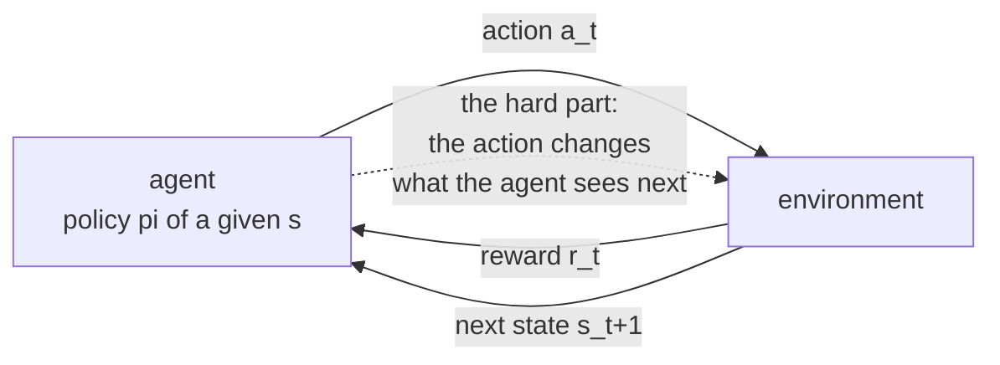
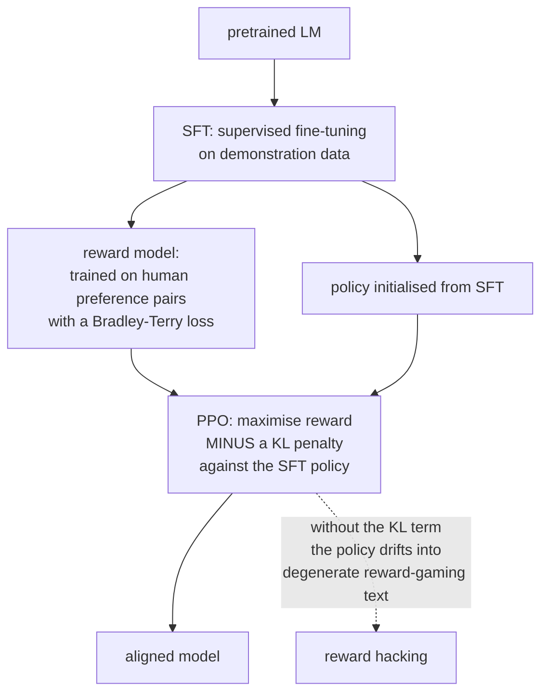

# Deep Reinforcement Learning

Reinforcement learning is the setting where an agent's **actions change the data
it subsequently sees**. Credit assignment, exploration and changing data
distributions distinguish it from supervised fitting. Deep RL uses neural
approximators for policies, values or dynamics in control, games, resource
allocation and language-model post-training. Each application needs a precise
interaction and evaluation contract.

## The setup

An agent observes a state, takes an action, receives a reward, and transitions to
a new state.



| Element | Symbol | Meaning |
|---|---|---|
| State | $s$ | a Markov description; an observation may expose only part |
| Action | $a$ | what it can do |
| Reward | $r$ | scalar feedback |
| Transition | $P(s'\mid s,a)$ | environment dynamics |
| Policy | $\pi(a\mid s)$ | the thing being learned |
| Return | $G_t = \sum_{k=0}^{\infty}\gamma^k r_{t+k}$ | discounted cumulative reward |
| Discount | $\gamma\in[0,1)$ | how much future reward is worth now |

The **discount factor** does two jobs: it keeps the infinite sum finite, and it
expresses a preference for sooner rewards. Its effective horizon is
$1/(1-\gamma)$ steps — $\gamma = 0.99$ means roughly 100 steps of foresight, and
choosing it changes the weighting of delayed outcomes. This is an approximate
timescale, not a cutoff. Bounded rewards and discount below one ensure finite
infinite-horizon return; finite episodic tasks can instead use discount one.

### The three difficulties

1. **Credit assignment.** A reward at step 200 may be caused by an action at step
   3.
2. **Exploration versus exploitation.** You only learn about actions you take.
3. **Non-stationarity.** As the policy improves, the data distribution shifts.

## Value functions and the Bellman equations

$$V^\pi(s) = \mathbb{E}_\pi[G_t\mid s_t=s], \qquad Q^\pi(s,a) = \mathbb{E}_\pi[G_t\mid s_t=s, a_t=a]$$

Both satisfy a recursive consistency condition:

$$Q^\pi(s,a) = \mathbb{E}\bigl[r + \gamma\,\mathbb{E}_{a'\sim\pi}Q^\pi(s',a')\bigr]$$

and the optimal $Q$ satisfies the **Bellman optimality equation**:

$$Q^*(s,a) = \mathbb{E}\bigl[r + \gamma\max_{a'}Q^*(s',a')\bigr]$$

Value-based methods seek Bellman consistency for a policy-evaluation or optimality
operator, using samples or a known model. The **advantage**
$A^\pi(s,a) = Q^\pi(s,a) - V^\pi(s)$ — "how much better than average is this
action?" — is the quantity policy-gradient methods actually want, because it
removes the state-value baseline that adds variance without changing the
gradient's expectation.

## Value-based methods

### Q-learning

$$Q(s,a) \leftarrow Q(s,a) + \alpha\bigl[\underbrace{r+\gamma\max_{a'}Q(s',a')}_{\text{TD target}} - Q(s,a)\bigr]$$

**Off-policy**: it learns about the greedy policy while behaving according to
something else (usually $\epsilon$-greedy), because the $\max$ does not depend on
what the agent actually did.

SARSA is the on-policy sibling: it uses $Q(s',a')$ for the action actually taken.
The classic illustration is the cliff-walking task, where Q-learning learns the
optimal path along the cliff edge while SARSA learns a safer path, because SARSA
accounts for the $\epsilon$-greedy exploration that will occasionally push it
off.

### DQN

Q-learning with a neural network, plus two stabilising tricks that were both
necessary.

| Component | Problem it solves |
|---|---|
| **Experience replay** | decorrelates sampled transitions and reuses experience; SGD does not universally require i.i.d. observations |
| **Target network** | the TD target uses the same network being updated, so the target moves as you chase it; a periodically-copied frozen network stabilises it |
| Reward clipping | one shared learning rate across games with different reward scales |
| Frame stacking | a single frame is not Markov (no velocity information) |

```python
q = policy_net(states).gather(1, actions)
with torch.no_grad():
    # Double DQN: SELECT with the online net, EVALUATE with the target net
    next_a = policy_net(next_states).argmax(1, keepdim=True)
    target = rewards + gamma * (~terminated).float() * target_net(next_states).gather(1, next_a)
loss = F.smooth_l1_loss(q, target)
```

**Overestimation bias** is the reason for Double DQN: $\max_a Q(s',a)$ over noisy
estimates can be biased upward: for unbiased estimates, convexity of max gives
$\mathbb E\max_a\hat Q_a\ge\max_a Q_a$. Decoupling selection from evaluation
can reduce the bias, not guarantee its removal under correlated errors. This
fragment assumes rewards, actions and boolean terminal masks all have shape
`(B,1)`; mixing `(B,)` rewards with `(B,1)` Q values broadcasts to `(B,B)`.

| Extension | Contribution |
|---|---|
| Double DQN | reduces selection-induced overestimation |
| Dueling DQN | separate value and advantage streams |
| Prioritised replay | sample transitions with large TD error more often |
| Noisy nets | learned parametric exploration instead of $\epsilon$-greedy |
| Distributional (C51, QR-DQN) | model the full return distribution, not just its mean |
| Rainbow | combines extensions whose interacting gains require ablation |

**The deadly triad** — function approximation + bootstrapping + off-policy
learning — can diverge. All three are present in DQN, which is why the tricks
are not optional decorations.

## Policy-gradient methods

Optimize the policy directly instead of deriving it from a discrete argmax.
This is useful for continuous actions and stochastic policies, not the only
possible approach to continuous control.

### The policy gradient theorem

$$\nabla_\theta J(\theta) = \mathbb{E}_{\pi_\theta}\bigl[\nabla_\theta\log\pi_\theta(a\mid s)\,Q^{\pi_\theta}(s,a)\bigr]$$

Read it as: **increase the log-probability of actions that led to high return.**
The $\nabla\log\pi$ term is the "score function", and this is the REINFORCE
estimator.

With appropriate on-policy occupancy and unbiased return estimates, the
score-function estimator is unbiased. Critics and off-policy samples need further
qualifications. Two standard variance-reduction approaches are:

- **Subtract a baseline** $b(s)$, usually $V(s)$. This leaves the expectation
  unchanged (since $\mathbb{E}[\nabla\log\pi] = 0$) and reduces variance
  substantially. Using $A = Q - V$ is exactly this.
- **Bootstrap** with a learned critic instead of using full Monte-Carlo returns,
  trading a little bias for much less variance.

### Actor-critic

Two networks: an **actor** $\pi_\theta$ and a **critic** $V_\phi$. The critic
supplies the advantage estimate; the actor updates on it.

**Generalised advantage estimation** interpolates between low-bias/high-variance
Monte Carlo and high-bias/low-variance one-step TD:

$$\hat{A}_t^{\mathrm{GAE}(\lambda)} = \sum_{l=0}^{\infty}(\gamma\lambda)^l\delta_{t+l}, \qquad \delta_t = r_t + \gamma V(s_{t+1}) - V(s_t)$$

$\lambda=0$ gives one-step TD. At $\lambda=1$, the sum telescopes to return
minus value, retaining any trajectory-end bootstrap. It becomes pure Monte Carlo
when the end is truly terminal. Values near 0.95 are common starting candidates.

### PPO

The workhorse. The problem it solves: a policy-gradient step that is too large
can damage performance, and old-policy data becomes less representative as the
policy moves. Importance ratios permit limited reuse, not arbitrary reuse.

Define the probability ratio $r_t(\theta) = \frac{\pi_\theta(a_t\mid
s_t)}{\pi_{\theta_{\text{old}}}(a_t\mid s_t)}$ and optimise the clipped
surrogate:

$$L^{\text{CLIP}} = \mathbb{E}_t\Bigl[\min\bigl(r_t\hat{A}_t,\; \mathrm{clip}(r_t, 1-\epsilon, 1+\epsilon)\hat{A}_t\bigr)\Bigr]$$

The clipping removes the incentive to move the ratio far from 1, so multiple
gradient epochs can be taken on the same batch of trajectories without the policy
moving as aggressively in favorable sampled directions. Clipping is not a hard
constraint on ratios or KL, especially with shared parameters and unseen states.
Monitor drift and stop early when appropriate. [PPO](https://arxiv.org/abs/1707.06347).

| Algorithm | Type | Action space | Note |
|---|---|---|---|
| REINFORCE | on-policy | any | high variance, rarely used alone |
| A2C / A3C | on-policy actor-critic | any | parallel environments |
| **PPO** | on-policy | any | the default; robust, simple |
| TRPO | on-policy | any | PPO's principled predecessor |
| **SAC** | off-policy | continuous | maximum-entropy; very sample-efficient |
| TD3 | off-policy | continuous | twin critics fix overestimation |
| DDPG | off-policy | continuous | brittle; superseded by TD3/SAC |
| **DQN family** | off-policy | discrete | Atari, discrete control |
| MuZero | model-based | discrete | learns dynamics in latent space |
| Dreamer | model-based | continuous | learns a world model, trains in imagination |

**SAC's maximum-entropy objective** adds $+\alpha H(\pi(\cdot\mid s))$ to the
reward, which keeps the policy stochastic, improves exploration, and makes the
method notably robust. The temperature $\alpha$ can itself be tuned
automatically toward a target entropy. A squashed Gaussian for bounded actions
also needs the change-of-variables correction in its log-probability; clipping
Gaussian samples is not an equivalent distribution.

## Exploration

| Strategy | Mechanism |
|---|---|
| $\epsilon$-greedy | random action with probability $\epsilon$, usually decayed |
| Boltzmann | sample proportional to $e^{Q/\tau}$ |
| Entropy bonus | reward stochastic policies (SAC, PPO's entropy term) |
| Upper confidence bound | optimism in the face of uncertainty |
| Thompson sampling | sample a model from the posterior, act greedily |
| Count-based / pseudo-counts | bonus for rarely visited states |
| **Curiosity / ICM** | bonus for states a learned dynamics model predicts poorly |
| **Random network distillation** | bonus for states where a predictor fails to match a fixed random network |
| Go-Explore | archive promising states and return to them |

Hard-exploration problems (Montezuma's Revenge is the canonical benchmark) are
where naive $\epsilon$-greedy fails completely: the reward is so sparse that
random actions essentially never reach it. Intrinsic motivation methods reward
*novelty* directly, which can help but does not guarantee tractable exploration.

The **noisy-TV problem** is the standard objection to curiosity: a genuinely
stochastic element (a television showing static) is permanently unpredictable, so
a prediction-error bonus attracts the agent forever. RND avoids it by predicting
the output of a *fixed deterministic* random network. Stochastic observations,
limited capacity and generalization can still cause persistent prediction error;
RND does not universally eliminate noisy-TV traps.

## Sample efficiency and offline RL

Deep RL is notoriously sample-hungry — millions of environment steps for tasks a
human learns in minutes. When environment interaction is expensive or dangerous
(robotics, healthcare, industrial control), that is disqualifying.

| Approach | Idea |
|---|---|
| **Offline RL** | learn from a fixed logged dataset, no interaction |
| Model-based RL | learn dynamics, plan or train in the model |
| Sim-to-real | train in simulation, transfer with domain randomisation |
| Imitation learning / behaviour cloning | supervised learning on expert demonstrations |
| Inverse RL | infer the reward function from demonstrations |
| Offline pretraining + online fine-tuning | the practical hybrid |

**Offline RL's core difficulty is distribution shift in the action space.** The
learned $Q$ function is queried at actions never present in the dataset, where
its estimates are unconstrained and typically over-optimistic — and the policy
then selects exactly those actions. The fixes constrain the policy toward the
data: CQL penalizes overly optimistic values relative to data actions; IQL avoids
out-of-dataset action maximization during value fitting using expectile regression,
and BCQ/TD3+BC constrain or regularize behavior. IQL's policy can still generalize
outside dataset support; no offline method obtains free evidence about unseen actions.

## RL for language models

For language models, state can be the prompt plus generated prefix and the
action the next token. Reward models or verifiers score outputs; tools and users
can provide additional transitions in interactive tasks.

### RLHF



The objective:

$$\max_\pi \;\mathbb{E}_{y\sim\pi}\bigl[r_\phi(x,y)\bigr] - \beta\,D_{\mathrm{KL}}\bigl(\pi(y\mid x)\,\Vert\,\pi_{\text{SFT}}(y\mid x)\bigr)$$

**A reference KL penalty is one important control.** Reward models are imperfect proxies, and an
unconstrained optimiser will find their failure modes — repetitive text, specific
phrasings that score highly, degenerate outputs. This is Goodhart's law with a
learned metric, and $\beta$ trades reward against distributional drift. Other
constraints and validated recipes exist; KL is neither universally required nor
a complete defense against reward exploitation.

### DPO

Direct preference optimisation observes that the KL-constrained objective has a
**closed-form optimal policy**, which can be rearranged to express the implicit
reward in terms of the policy itself. Substituting into the Bradley-Terry
preference likelihood gives a loss over preference pairs directly:

$$L_{\text{DPO}} = -\mathbb{E}\left[\log\sigma\left(\beta\log\frac{\pi_\theta(y_w\mid x)}{\pi_{\text{ref}}(y_w\mid x)} - \beta\log\frac{\pi_\theta(y_l\mid x)}{\pi_{\text{ref}}(y_l\mid x)}\right)\right]$$

**No reward model, no sampling loop, no RL machinery** — just supervised learning
on fixed preference pairs under the derivation's assumptions. Finite-data pairwise
training is not operationally identical to online policy optimization and need
not reach the same solution. Validate rate, reference choice and data support.
[DPO](https://arxiv.org/abs/2305.18290).

### GRPO and verifiable rewards

For tasks with a **checkable** answer — mathematics, code that must pass tests,
formal proofs — the reward model can be replaced by a verifier. Incomplete tests,
parser loopholes, leaked answers and unsafe execution remain reward-hacking risks.
Verification quality is part of the system, not a guarantee of correctness.

**Group relative policy optimisation** samples $G$ completions per prompt and
computes advantages *within the group* by standardising the rewards:

$$\hat{A}_i = \frac{r_i - \mathrm{mean}(r_1,\dots,r_G)}{\mathrm{std}(r_1,\dots,r_G)+\epsilon}$$

This removes a separately learned value critic in the basic recipe, not half of
total memory: policy, reference, optimizer, rollout KV and group samples remain.
Equal rewards give zero centered advantages, so all-correct or all-incorrect
groups supply no centered reward gradient. Specify population versus sample
standard deviation and epsilon. GRPO can also use learned rewards, not only
verifiers. [DeepSeekMath](https://arxiv.org/abs/2402.03300).

| Method | Needs | Trade-off |
|---|---|---|
| SFT | demonstrations | simple; limited by demonstration quality |
| RLHF (PPO) | a reward model + sampling | strongest control; complex, unstable |
| **DPO** | preference pairs | simple, stable; no online exploration |
| KTO | binary good/bad labels | cheaper labels than pairs |
| **GRPO** | group samples and scalar rewards | critic-free relative advantages; reward design still matters |
| Best-of-$n$ / rejection sampling | a reward model, inference compute | no training; pay at inference |

## Bellman calculations and episode boundaries

Consider two nonterminal states A and B. In A, action exit returns reward one
and terminates; action continue returns zero and reaches B. In B the only action
returns reward two and terminates. With $\gamma=0.9$, $V^*(B)=2$,
$Q^*(A,\mathrm{continue})=1.8$ and $Q^*(A,\mathrm{exit})=1$.
A policy choosing continue with probability 0.25 has
$V^\pi(A)=0.25\cdot1.8+0.75\cdot1=1.2$.
Its advantages are 0.6 and -0.2; their policy-weighted average is zero.
The optimal action is not necessarily the one with the largest immediate reward.

With bounded rewards and discount below one, the tabular Bellman optimality
operator is a contraction in the sup norm: applying it reduces maximum value
error by at most $\gamma$. This explains convergence of exact value iteration.
Projecting values through a neural network, using sampled replay and simultaneously
changing targets does not inherit that contraction automatically. The deadly
triad is a warning about lost guarantees, not proof that every DQN run diverges.
See [optimization](../math/optimization.md) for fixed-point and convergence ideas.

### Termination is not truncation

A genuine terminal state has no future return, so its bootstrap is zero.
An external collection time limit can stop a rollout even though the modeled
process continues; then bootstrap from the final observation. A finite-horizon
task whose deadline is part of the objective is different again: include remaining
time in the state to preserve the Markov property and treat the intended endpoint
as terminal. Do not infer this semantics from an arbitrary `done` variable.
[Gymnasium time limits](https://gymnasium.farama.org/tutorials/gymnasium_basics/handling_time_limits/).

Auto-reset vector environments may return a reset observation alongside final-state
metadata. Bootstrapping from the next episode's initial state is wrong. Recurrent
policies need state resets at episode boundaries, but a collector chunk boundary
alone need not reset the environment memory. A useful transition record includes
observation, action, reward, final next observation, termination, truncation and,
for on-policy methods, behavior log-probability and value estimate.

### Runnable lab: a complete Double-DQN update experiment

This uses a fixed synthetic transition batch to test the neural update contract,
not a hand-written game. The target network is held fixed during the short fitting
phase, making loss improvement interpretable. Online interaction and target refresh
are separate parts of a complete agent. The assertions distinguish terminal and
truncated transitions, prevent accidental broadcasting and prove target detachment.

```python runnable
import copy
import torch
from torch import nn
from torch.nn import functional as F

torch.manual_seed(51)
torch.set_num_threads(1)
B, state_dim, actions_count = 192, 4, 3
states = torch.randn(B, state_dim)
next_states = 0.8 * states + 0.1 * torch.randn_like(states)
actions = torch.randint(actions_count, (B, 1))
rewards = (states[:, :1] + 0.2 * actions.float()).tanh()
terminated = torch.zeros(B, 1, dtype=torch.bool)
terminated[::5] = True
truncated = torch.zeros(B, 1, dtype=torch.bool)
truncated[1::7] = True
truncated &= ~terminated
online = nn.Sequential(nn.Linear(state_dim, 32), nn.ReLU(), nn.Linear(32, actions_count))
target_net = copy.deepcopy(online).eval()
target_net.requires_grad_(False)
snapshot = {name: value.clone() for name, value in target_net.state_dict().items()}
gamma = 0.95
with torch.no_grad():
    selected = online(next_states).argmax(1, keepdim=True)
    continuation = target_net(next_states).gather(1, selected)
    targets = rewards + gamma * (~terminated).float() * continuation
assert targets.shape == rewards.shape == (B, 1)
torch.testing.assert_close(targets[terminated], rewards[terminated])
torch.testing.assert_close(targets[truncated],
                           (rewards + gamma * continuation)[truncated])
optimizer = torch.optim.Adam(online.parameters(), lr=0.015)
initial = F.smooth_l1_loss(online(states).gather(1, actions), targets).item()
for _ in range(100):
    optimizer.zero_grad(set_to_none=True)
    q = online(states).gather(1, actions)
    loss = F.smooth_l1_loss(q, targets)
    loss.backward()
    nn.utils.clip_grad_norm_(online.parameters(), 5.0)
    optimizer.step()
final = F.smooth_l1_loss(online(states).gather(1, actions), targets).item()
assert final < initial * 0.25
assert all(parameter.grad is None for parameter in target_net.parameters())
for name, value in target_net.state_dict().items():
    torch.testing.assert_close(value, snapshot[name], atol=0, rtol=0)
target_net.load_state_dict(online.state_dict())
print({"initial_td_loss": initial, "final_td_loss": final,
       "terminal_count": terminated.sum().item(), "truncated_count": truncated.sum().item()})
```

A normal Double-DQN learner recomputes next-action selection from the current
online network when constructing each new minibatch target. Here that selection
is deliberately frozen for one fitted-target phase so the assertions test a fixed
regression problem. This is not evidence that a policy improved its episodic
return. Evaluate complete held-out rollouts to make that claim. Replay priorities
also change the sampled objective: importance weights and their normalization
must be considered rather than treating large-TD-error sampling as free improvement.

## Advantages, clipping and policy probabilities

The baseline identity follows from
$\sum_a\pi(a|s)\nabla\log\pi(a|s)=\nabla\sum_a\pi(a|s)=0$.
Thus subtracting a baseline independent of the sampled action preserves the
expected score-function gradient. A baseline learned from the same samples or
depending on actions needs care; simply labeling a number a baseline does not
prove unbiasedness. A value baseline often helps but is not always the exact
minimum-variance baseline, which depends on score-gradient magnitudes.

For a terminal two-step trajectory with rewards $(1,2)$, values $(0.5,1)$,
$\gamma=0.9$ and $\lambda=0.8$, TD residuals are $(1.4,1)$.
GAE advantages are $A_1=1$ and $A_0=1.4+0.9\cdot0.8=2.12$.
At $\lambda=1$, $A_0=2.3$, matching Monte Carlo return
$1+0.9\cdot2=2.8$ minus initial value 0.5. At a truncated endpoint with
nonzero continuation value, retain its bootstrap but do not propagate the GAE
recursion into another episode. The bootstrap mask and trace-continuation mask
can therefore differ.

### What PPO clipping actually does

With positive advantage $A=2$, ratio $r=1.5$ and $\epsilon=0.2$, the surrogate
is $\min(3,2.4)=2.4$, removing incentive for further increases on that sample.
With negative advantage $A=-2$ and $r=0.5$, it is
$\min(-1,-1.6)=-1.6$, removing incentive for further decreases. But for
$A=-2,r=1.5$, the result is -3, so the harmful probability increase is not
clipped away. Both the sign and the minimum are essential.

The clipped objective does not project parameters into a probability-ratio box.
Shared parameters, entropy and value losses can move ratios beyond thresholds,
and a finite rollout says nothing directly about unseen states. Log approximate
or exact KL on the collected distribution, clip fraction, entropy, critic error,
gradient norms and episodic evaluation return. A high clipped fraction can mean
the step or number of epochs is too large; a tiny policy loss can instead mean
advantages are nearly zero or normalization is broken.

### Runnable lab: fixed-behavior PPO and actor-critic losses

This independent one-step contextual batch uses PyTorch's categorical distribution
for sampling, log-probabilities, entropy and KL. It illustrates policy improvement
on collected samples without implementing an environment. The reference policy
and old log-probabilities stay fixed across update epochs, as the ratio requires.

```python runnable
import copy
import torch
from torch import nn
from torch.distributions import Categorical, kl_divergence

torch.manual_seed(52)
torch.set_num_threads(1)
states = torch.randn(512, 4)
actor = nn.Linear(4, 3)
nn.init.zeros_(actor.weight)
nn.init.zeros_(actor.bias)
old_actor = copy.deepcopy(actor).eval()
old_actor.requires_grad_(False)
critic = nn.Linear(4, 1)
best_action = torch.stack((states[:, 0], states[:, 1], -states[:, 0]), 1).argmax(1)
with torch.no_grad():
    old_distribution = Categorical(logits=old_actor(states))
    actions = old_distribution.sample()
    old_log_prob = old_distribution.log_prob(actions)
    rewards = (actions == best_action).float()
    baseline = rewards.mean()
    advantages = rewards - baseline
    advantages = advantages / advantages.std(unbiased=False).clamp_min(1e-6)
    initial_success_probability = old_distribution.probs.gather(1, best_action[:, None]).mean().item()
opt = torch.optim.Adam(list(actor.parameters()) + list(critic.parameters()), lr=0.03)
for _ in range(12):
    distribution = Categorical(logits=actor(states))
    ratio = (distribution.log_prob(actions) - old_log_prob).exp()
    surrogate = torch.minimum(ratio * advantages,
                               ratio.clamp(0.8, 1.2) * advantages)
    policy_loss = -surrogate.mean()
    value_loss = (critic(states).squeeze(-1) - rewards).square().mean()
    loss = policy_loss + 0.5 * value_loss - 0.01 * distribution.entropy().mean()
    opt.zero_grad(set_to_none=True)
    loss.backward()
    nn.utils.clip_grad_norm_(list(actor.parameters()) + list(critic.parameters()), 1.0)
    opt.step()
with torch.no_grad():
    current = Categorical(logits=actor(states))
    success_probability = current.probs.gather(1, best_action[:, None]).mean().item()
    kl = kl_divergence(old_distribution, current).mean().item()
    ratios = (current.log_prob(actions) - old_log_prob).exp()
    clip_fraction = ((ratios < 0.8) | (ratios > 1.2)).float().mean().item()
assert success_probability > initial_success_probability
assert torch.isfinite(ratios).all() and kl >= 0
assert all(p.grad is None for p in old_actor.parameters())
print({"initial_success_probability": initial_success_probability,
       "final_success_probability": success_probability, "old_to_new_kl": kl,
       "clip_fraction": clip_fraction})
```

The critic is trained against one-step returns, while the actor uses a simple
frozen batch baseline; this isolates the loss contracts. Longer tasks need
trajectory-aware advantage estimation and fresh data collection after the update
phase. For continuous distributions, action dimensions are events: sum their
log-probabilities before constructing the ratio, rather than averaging ratios
per coordinate. Check action masks consistently in old and new distributions.

## Runnable lab: collect experience, train PPO, evaluate complete episodes

The two preceding labs isolate update equations. This third experiment closes
the interaction loop with [Stable-Baselines3 PPO 2.7.0](https://stable-baselines3.readthedocs.io/en/v2.7.0/modules/ppo.html)
and [Gymnasium CartPole-v1](https://gymnasium.farama.org/environments/classic_control/cart_pole/).
It uses the libraries' environment dynamics, rollout collection, advantage
estimation and optimizer rather than replacing those mechanisms with a synthetic
regression target. Install the site's pinned example dependencies; no graphical
renderer, downloaded dataset or pretrained checkpoint is needed.

CartPole observations contain cart position and velocity plus pole angle and
angular velocity. Either discrete action pushes the cart left or right. The
default reward is one per step, including the failure step, so undiscounted
evaluation return measures how long the episode lasts. Physical failure
terminates the episode; the version-one wrapper also truncates at 500 steps.
The training discount is 0.99, while the evaluation reports raw episode reward.
Those are different, explicitly chosen quantities, not competing estimates of
the same scalar.

Four environment copies collect 128 steps each per rollout: 512 transitions.
The requested 12,800 steps therefore contain exactly 25 complete rollouts.
Each rollout is optimized for six epochs in minibatches of 128, then replaced
with fresh on-policy experience. CPU execution with one PyTorch thread keeps
the example small and predictable. The actor-head assertion checks that a policy
parameter actually changed, not merely that the critic fit some values.

```python runnable
import numpy as np
import torch
import gymnasium as gym
from stable_baselines3 import PPO
from stable_baselines3.common.env_util import make_vec_env

torch.set_num_threads(1)
training_seed = 63
evaluation_seeds = list(range(9000, 9008))
train_env = make_vec_env("CartPole-v1", n_envs=4, seed=training_seed)
try:
    model = PPO("MlpPolicy", train_env, device="cpu", seed=training_seed,
                n_steps=128, batch_size=128, n_epochs=6,
                learning_rate=3e-4, gamma=0.99, gae_lambda=0.95,
                clip_range=0.2, verbose=0)
    initial_action_weights = model.policy.action_net.weight.detach().clone()
    model.learn(total_timesteps=12800, progress_bar=False)
    assert model.num_timesteps == 12800
    assert not torch.equal(model.policy.action_net.weight, initial_action_weights)
    assert all(torch.isfinite(p).all() for p in model.policy.parameters())
finally:
    train_env.close()

def evaluate(policy):
    env = gym.make("CartPole-v1")
    returns, endings = [], []
    try:
        for seed in evaluation_seeds:
            observation, info = env.reset(seed=seed)
            env.action_space.seed(seed + 10000)
            total_reward = 0.0
            for step in range(env.spec.max_episode_steps):
                if policy is None:
                    action = env.action_space.sample()
                else:
                    action, _ = policy.predict(observation, deterministic=True)
                    action = int(np.asarray(action).item())
                observation, reward, terminated, truncated, info = env.step(action)
                assert np.isfinite(observation).all() and np.isfinite(reward)
                total_reward += float(reward)
                if terminated or truncated:
                    endings.append((bool(terminated), bool(truncated)))
                    break
            else:
                raise AssertionError("The environment did not signal its time limit")
            returns.append(total_reward)
    finally:
        env.close()
    returns = np.asarray(returns)
    assert len(returns) == len(evaluation_seeds)
    assert np.isfinite(returns).all() and np.all((returns >= 1) & (returns <= 500))
    return {"episode_returns": returns.tolist(), "mean": float(returns.mean()),
            "sample_std": float(returns.std(ddof=1)),
            "terminated": sum(end[0] for end in endings),
            "truncated": sum(end[1] for end in endings)}

random_result = evaluate(None)
ppo_result = evaluate(model)
print({"environment_steps": model.num_timesteps,
       "evaluation_seeds": evaluation_seeds,
       "random_policy": random_result, "deterministic_ppo": ppo_result})
```

Evaluation uses a separate environment and fresh reset seeds, with no policy
updates. Both policies see the same initial-condition seeds; random actions have
their own seeded generator. Their subsequent states diverge because their actions
differ, which is precisely the distinction from a fixed supervised test matrix.
The learned policy uses deterministic action selection at evaluation, whereas
PPO samples during collection. Report that choice because stochastic-policy
evaluation measures a different deployment behavior.

The result includes every episode return, its arithmetic mean and the sample
standard deviation with denominator seven. This is variability across eight
initializations for one trained policy, not uncertainty across independent
training runs and not a confidence interval. The assertions deliberately avoid
promising a solved environment or a universal margin over random actions. Inspect
the comparison: an unchanged or weak return despite changing weights requires
investigation of training budget, policy drift, value estimates and seed
variability. Run several independent training seeds before comparing algorithms,
and use separate validation seeds for tuning rather than repeatedly selecting
settings on these evaluation episodes.

The library's vector-environment interface combines ending flags into `dones`
and carries timeout/final-observation information separately; the ordinary
Gymnasium evaluation loop above receives `terminated` and `truncated` directly.
Do not transplant one API's tuple unpacking into the other. An episode can have
both flags true, so their reported counts need not be mutually exclusive.
See the [SB3 vector-environment contract](https://stable-baselines3.readthedocs.io/en/v2.7.0/guide/vec_envs.html).
Stable-Baselines3 handles the rollout bootstrap conventions internally. The
explicit evaluator only records completed returns, so it never bootstraps a
value from a reset observation. Its 500-step cap also means high scores establish
performance only within this benchmark horizon, not indefinite stability or
transfer to changed physical dynamics.

## Offline learning, world models and preference assumptions

Behavior cloning fits $\log\pi(a|s)$ on demonstrations and does not bootstrap
unobserved actions. It is a useful offline baseline, although errors can compound
when the learned policy visits new states. Conservative value estimation, behavior
regularization and advantage-weighted regression make different tradeoffs between
imitation and improvement. Off-policy evaluation with importance sampling requires
behavior-policy support and can have enormous variance over long horizons;
fitted value estimates trade that variance for model assumptions. Report support
diagnostics and uncertainty rather than a single confident offline return.

Model-based methods learn transition or latent dynamics and then plan or train
inside the model. MuZero and Dreamer differ in representation, planning and update
design, but both face model exploitation: a policy can discover optimistic model
errors. Shorter imagined rollouts, uncertainty estimates and real-environment
validation help bound this risk. Sim-to-real adds actuator delays, sensing changes
and contact dynamics; randomization must span relevant uncertainty rather than
arbitrary cosmetic variation. Inverse RL infers rewards from behavior, which is
not uniquely identifiable without assumptions about policy and environment.

For KL-regularized sequence optimization, the formal unrestricted optimum is
$\pi^*(y|x)\propto\pi_{ref}(y|x)e^{r(x,y)/\beta}$, assuming reference support
and a finite normalizer. Taking log ratios expresses reward up to a prompt-only
normalization constant. That constant cancels between preferred and rejected
responses under a Bradley-Terry model, producing DPO. A finite neural policy,
noisy preference labels and limited pairs may not realize the unrestricted optimum.
Sequence log-probabilities normally sum response-token log-probabilities; length
normalization is a different objective and can change preference behavior.

With GRPO rewards $(0,0,1,1)$, mean is 0.5 and population standard deviation is
0.5, giving approximately $(-1,-1,1,1)$. With $(1,1,1,1)$, centered advantages
are all zero, not NaN when epsilon is included. That removes the reward-gradient
signal for that group, but entropy or KL terms can still update the policy.
Reward normalization also reweights prompts by their within-group variability;
it is not merely a numerically harmless scaling. Evaluate difficulty groups and
the fraction with no learning signal.

Verifier training should separate task correctness from formatting and execution
success. Use held-out tests, sandbox untrusted code, bound execution resources and
audit parser behavior. A model that satisfies a brittle checker is not necessarily
correct outside it. Compare pass-at-one, sample-budgeted success, output length
and computational cost; changing the sampling budget can improve a score without
improving a single-sample policy. The
[alignment note](../nlp/llm-prompting-and-alignment.md) connects these objectives to
language-model data and evaluation contracts.

## Practical difficulties

| Problem | Detail |
|---|---|
| **Reproducibility** | RL results vary enormously across seeds; report distributions across 5+ seeds, not single runs |
| **Reward shaping** | badly shaped rewards produce agents that satisfy the letter and not the intent |
| **Sparse rewards** | most real tasks; needs shaping, curriculum, or intrinsic motivation |
| Hyperparameter sensitivity | far worse than supervised learning |
| Sim-to-real gap | policies exploit simulator artefacts that do not exist in reality |
| Evaluation | training reward is not the objective; evaluate the deployed behaviour |
| Safety during exploration | random actions in the real world can be destructive |

**Reward hacking is the defining failure mode**, and the examples are
instructive: a boat-racing agent that loops collecting bonuses instead of
finishing the race; a robot that learns to hover its hand near an object because
the reward measured proximity rather than grasping; a language model that
produces long hedged answers because the reward model prefers them. In every case
the agent optimised exactly what was specified. **Whenever you write a reward
function, ask what maximising it to the extreme would look like.**

## Self-check

1. Write the Bellman optimality equation and say what every value-based method is
   doing with it.
2. Why is Q-learning off-policy and SARSA on-policy? What behavioural difference
   does that produce?
3. What two problems do experience replay and the target network each solve?
4. Explain overestimation bias and how Double DQN fixes it.
5. Why does subtracting a baseline reduce variance without introducing bias?
6. What does PPO's clipping enable that vanilla policy gradient does not?
7. Why does RLHF need a KL penalty, and what does GRPO's group baseline replace?

### Worked answers

1. $Q^*(s,a)=\mathbb E[r+\gamma\max_{a'}Q^*(s',a')]$, with zero continuation
   at a true terminal state. Value methods seek consistency with this or a
   policy-evaluation operator; neural approximation does not preserve all tabular guarantees.
2. Q-learning targets a greedy next action while behavior may explore. SARSA
   evaluates the actually sampled next action, incorporating exploration risk.
   Their policies can differ even with identical observations and rewards.
3. Replay reuses and decorrelates data; target networks slow target movement.
   Neither makes all off-policy neural updates stable or proves independent samples.
4. Selecting a maximum favors positive estimation errors. Double DQN separates
   selection from evaluation, reducing but not always removing bias under correlated errors.
5. An action-independent baseline multiplies a score whose conditional expectation
   is zero. A suitable baseline reduces variance, but arbitrary baselines need not
   be optimal and action-dependent terms require a correction.
6. PPO permits limited repeated optimization of a clipped importance-ratio surrogate.
   It does not enforce a hard KL bound; monitor policy drift and refresh rollouts.
7. Reference KL can limit policy drift from imperfect rewards, but is neither
   mandatory for every recipe nor sufficient for safety. GRPO replaces the learned
   critic baseline with within-prompt reward comparisons; equal-reward groups need
   a defined zero-variance rule and provide no centered reward signal.

## Where to go next

- [Transfer Learning](./transfer-learning-and-finetuning.md) — SFT and PEFT, the
  stage before preference tuning.
- [Self-Supervised Learning](./self-supervised-learning.md) — how the base model
  was trained.
- [Attention & Transformers](./attention-and-transformers.md) — the policy
  architecture in every LLM RL setup.
