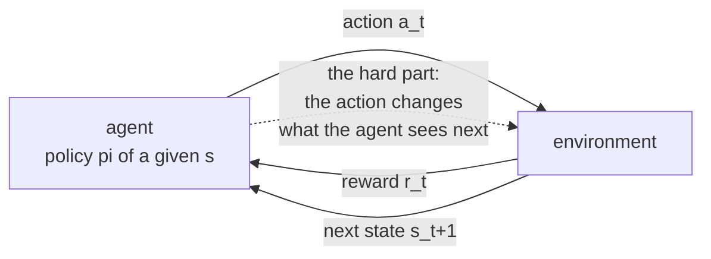
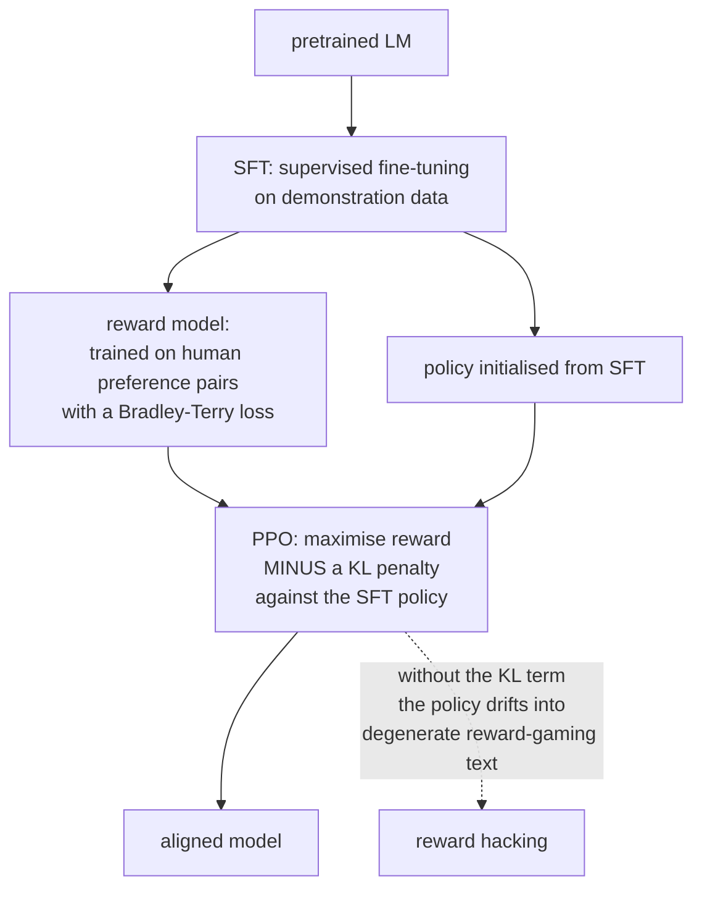

# Deep Reinforcement Learning

Reinforcement learning is the setting where an agent's **actions change the data
it subsequently sees**. That single property makes it harder than supervised
learning in three independent ways, and it is also why RL is the natural
framework for the thing it is now most used for: shaping the behaviour of large
language models.

## The setup

An agent observes a state, takes an action, receives a reward, and transitions to
a new state.



| Element | Symbol | Meaning |
|---|---|---|
| State | $s$ | what the agent observes |
| Action | $a$ | what it can do |
| Reward | $r$ | scalar feedback |
| Transition | $P(s'\mid s,a)$ | environment dynamics |
| Policy | $\pi(a\mid s)$ | the thing being learned |
| Return | $G_t = \sum_{k=0}^{\infty}\gamma^k r_{t+k}$ | discounted cumulative reward |
| Discount | $\gamma\in[0,1)$ | how much future reward is worth now |

The **discount factor** does two jobs: it keeps the infinite sum finite, and it
expresses a preference for sooner rewards. Its effective horizon is
$1/(1-\gamma)$ steps — $\gamma = 0.99$ means roughly 100 steps of foresight, and
choosing it is really choosing a horizon.

### The three difficulties

1. **Credit assignment.** A reward at step 200 may be caused by an action at step
   3.
2. **Exploration versus exploitation.** You only learn about actions you take.
3. **Non-stationarity.** As the policy improves, the data distribution shifts.

## Value functions and the Bellman equations

$$V^\pi(s) = \mathbb{E}_\pi[G_t\mid s_t=s], \qquad Q^\pi(s,a) = \mathbb{E}_\pi[G_t\mid s_t=s, a_t=a]$$

Both satisfy a recursive consistency condition:

$$Q^\pi(s,a) = \mathbb{E}\bigl[r + \gamma\,\mathbb{E}_{a'\sim\pi}Q^\pi(s',a')\bigr]$$

and the optimal $Q$ satisfies the **Bellman optimality equation**:

$$Q^*(s,a) = \mathbb{E}\bigl[r + \gamma\max_{a'}Q^*(s',a')\bigr]$$

**Everything in value-based RL is an algorithm for solving that fixed-point
equation** from samples rather than from a known model. The **advantage**
$A^\pi(s,a) = Q^\pi(s,a) - V^\pi(s)$ — "how much better than average is this
action?" — is the quantity policy-gradient methods actually want, because it
removes the state-value baseline that adds variance without changing the
gradient's expectation.

## Value-based methods

### Q-learning

$$Q(s,a) \leftarrow Q(s,a) + \alpha\bigl[\underbrace{r+\gamma\max_{a'}Q(s',a')}_{\text{TD target}} - Q(s,a)\bigr]$$

**Off-policy**: it learns about the greedy policy while behaving according to
something else (usually $\epsilon$-greedy), because the $\max$ does not depend on
what the agent actually did.

SARSA is the on-policy sibling: it uses $Q(s',a')$ for the action actually taken.
The classic illustration is the cliff-walking task, where Q-learning learns the
optimal path along the cliff edge while SARSA learns a safer path, because SARSA
accounts for the $\epsilon$-greedy exploration that will occasionally push it
off.

### DQN

Q-learning with a neural network, plus two stabilising tricks that were both
necessary.

| Component | Problem it solves |
|---|---|
| **Experience replay** | consecutive samples are highly correlated, violating the i.i.d. assumption SGD needs; a replay buffer decorrelates and reuses data |
| **Target network** | the TD target uses the same network being updated, so the target moves as you chase it; a periodically-copied frozen network stabilises it |
| Reward clipping | one shared learning rate across games with different reward scales |
| Frame stacking | a single frame is not Markov (no velocity information) |

```python
q = policy_net(states).gather(1, actions)
with torch.no_grad():
    # Double DQN: SELECT with the online net, EVALUATE with the target net
    next_a = policy_net(next_states).argmax(1, keepdim=True)
    target = rewards + gamma * (1 - dones) * target_net(next_states).gather(1, next_a)
loss = F.smooth_l1_loss(q, target)
```

**Overestimation bias** is the reason for Double DQN: $\max_a Q(s',a)$ over noisy
estimates is biased upward, because the max of noisy values exceeds the value of
the true max. Decoupling selection from evaluation removes most of it.

| Extension | Contribution |
|---|---|
| Double DQN | fixes overestimation |
| Dueling DQN | separate value and advantage streams |
| Prioritised replay | sample transitions with large TD error more often |
| Noisy nets | learned parametric exploration instead of $\epsilon$-greedy |
| Distributional (C51, QR-DQN) | model the full return distribution, not just its mean |
| Rainbow | all of the above; roughly the sum of their gains |

**The deadly triad** — function approximation + bootstrapping + off-policy
learning — can diverge. All three are present in DQN, which is why the tricks
are not optional decorations.

## Policy-gradient methods

Optimise the policy directly instead of deriving it from values. Necessary for
continuous action spaces, and natural for stochastic policies.

### The policy gradient theorem

$$\nabla_\theta J(\theta) = \mathbb{E}_{\pi_\theta}\bigl[\nabla_\theta\log\pi_\theta(a\mid s)\,Q^{\pi_\theta}(s,a)\bigr]$$

Read it as: **increase the log-probability of actions that led to high return.**
The $\nabla\log\pi$ term is the "score function", and this is the REINFORCE
estimator.

It is unbiased and has enormous variance. Two standard reductions:

- **Subtract a baseline** $b(s)$, usually $V(s)$. This leaves the expectation
  unchanged (since $\mathbb{E}[\nabla\log\pi] = 0$) and reduces variance
  substantially. Using $A = Q - V$ is exactly this.
- **Bootstrap** with a learned critic instead of using full Monte-Carlo returns,
  trading a little bias for much less variance.

### Actor-critic

Two networks: an **actor** $\pi_\theta$ and a **critic** $V_\phi$. The critic
supplies the advantage estimate; the actor updates on it.

**Generalised advantage estimation** interpolates between low-bias/high-variance
Monte Carlo and high-bias/low-variance one-step TD:

$$\hat{A}_t^{\mathrm{GAE}(\lambda)} = \sum_{l=0}^{\infty}(\gamma\lambda)^l\delta_{t+l}, \qquad \delta_t = r_t + \gamma V(s_{t+1}) - V(s_t)$$

$\lambda = 0$ gives one-step TD, $\lambda = 1$ gives Monte Carlo. $\lambda
\approx 0.95$ is the standard choice.

### PPO

The workhorse. The problem it solves: a policy-gradient step that is too large
can destroy the policy, and the data collected under the old policy becomes
invalid the moment the policy changes.

Define the probability ratio $r_t(\theta) = \frac{\pi_\theta(a_t\mid
s_t)}{\pi_{\theta_{\text{old}}}(a_t\mid s_t)}$ and optimise the clipped
surrogate:

$$L^{\text{CLIP}} = \mathbb{E}_t\Bigl[\min\bigl(r_t\hat{A}_t,\; \mathrm{clip}(r_t, 1-\epsilon, 1+\epsilon)\hat{A}_t\bigr)\Bigr]$$

The clipping removes the incentive to move the ratio far from 1, so multiple
gradient epochs can be taken on the same batch of trajectories without the policy
running away. That reuse is what makes PPO sample-efficient enough to be
practical, and its simplicity relative to TRPO's constrained optimisation is why
it won.

| Algorithm | Type | Action space | Note |
|---|---|---|---|
| REINFORCE | on-policy | any | high variance, rarely used alone |
| A2C / A3C | on-policy actor-critic | any | parallel environments |
| **PPO** | on-policy | any | the default; robust, simple |
| TRPO | on-policy | any | PPO's principled predecessor |
| **SAC** | off-policy | continuous | maximum-entropy; very sample-efficient |
| TD3 | off-policy | continuous | twin critics fix overestimation |
| DDPG | off-policy | continuous | brittle; superseded by TD3/SAC |
| **DQN family** | off-policy | discrete | Atari, discrete control |
| MuZero | model-based | discrete | learns dynamics in latent space |
| Dreamer | model-based | continuous | learns a world model, trains in imagination |

**SAC's maximum-entropy objective** adds $+\alpha H(\pi(\cdot\mid s))$ to the
reward, which keeps the policy stochastic, improves exploration, and makes the
method notably robust. The temperature $\alpha$ can itself be tuned
automatically to hit a target entropy.

## Exploration

| Strategy | Mechanism |
|---|---|
| $\epsilon$-greedy | random action with probability $\epsilon$, usually decayed |
| Boltzmann | sample proportional to $e^{Q/\tau}$ |
| Entropy bonus | reward stochastic policies (SAC, PPO's entropy term) |
| Upper confidence bound | optimism in the face of uncertainty |
| Thompson sampling | sample a model from the posterior, act greedily |
| Count-based / pseudo-counts | bonus for rarely visited states |
| **Curiosity / ICM** | bonus for states a learned dynamics model predicts poorly |
| **Random network distillation** | bonus for states where a predictor fails to match a fixed random network |
| Go-Explore | archive promising states and return to them |

Hard-exploration problems (Montezuma's Revenge is the canonical benchmark) are
where naive $\epsilon$-greedy fails completely: the reward is so sparse that
random actions essentially never reach it. Intrinsic motivation methods reward
*novelty* directly, which turns an unsolvable search into a tractable one.

The **noisy-TV problem** is the standard objection to curiosity: a genuinely
stochastic element (a television showing static) is permanently unpredictable, so
a prediction-error bonus attracts the agent forever. RND avoids it by predicting
the output of a *fixed deterministic* random network, which is learnable in
principle everywhere.

## Sample efficiency and offline RL

Deep RL is notoriously sample-hungry — millions of environment steps for tasks a
human learns in minutes. When environment interaction is expensive or dangerous
(robotics, healthcare, industrial control), that is disqualifying.

| Approach | Idea |
|---|---|
| **Offline RL** | learn from a fixed logged dataset, no interaction |
| Model-based RL | learn dynamics, plan or train in the model |
| Sim-to-real | train in simulation, transfer with domain randomisation |
| Imitation learning / behaviour cloning | supervised learning on expert demonstrations |
| Inverse RL | infer the reward function from demonstrations |
| Offline pretraining + online fine-tuning | the practical hybrid |

**Offline RL's core difficulty is distribution shift in the action space.** The
learned $Q$ function is queried at actions never present in the dataset, where
its estimates are unconstrained and typically over-optimistic — and the policy
then selects exactly those actions. The fixes constrain the policy toward the
data: CQL penalises Q-values for out-of-distribution actions, IQL avoids querying
them at all by using expectile regression, and BCQ/TD3+BC add explicit behaviour
cloning terms.

## RL for language models

This is where RL now has the most economic impact, and the framing is worth
making explicit: the "environment" is a reward model or a verifier, the "state"
is the prompt plus generated prefix, and the "action" is the next token.

### RLHF



The objective:

$$\max_\pi \;\mathbb{E}_{y\sim\pi}\bigl[r_\phi(x,y)\bigr] - \beta\,D_{\mathrm{KL}}\bigl(\pi(y\mid x)\,\Vert\,\pi_{\text{SFT}}(y\mid x)\bigr)$$

**The KL penalty is not optional.** Reward models are imperfect proxies, and an
unconstrained optimiser will find their failure modes — repetitive text, specific
phrasings that score highly, degenerate outputs. This is Goodhart's law with a
learned metric, and $\beta$ is the dial that trades alignment against drift.

### DPO

Direct preference optimisation observes that the KL-constrained objective has a
**closed-form optimal policy**, which can be rearranged to express the implicit
reward in terms of the policy itself. Substituting into the Bradley-Terry
preference likelihood gives a loss over preference pairs directly:

$$L_{\text{DPO}} = -\mathbb{E}\left[\log\sigma\left(\beta\log\frac{\pi_\theta(y_w\mid x)}{\pi_{\text{ref}}(y_w\mid x)} - \beta\log\frac{\pi_\theta(y_l\mid x)}{\pi_{\text{ref}}(y_l\mid x)}\right)\right]$$

**No reward model, no sampling loop, no RL machinery** — just supervised learning
on preference pairs, optimising the same objective. That simplicity is why DPO
became the default. Learning rates are very small ($5\times10^{-7}$); preference
tuning moves a model far more per step than SFT, and over-training collapses
output diversity.

### GRPO and verifiable rewards

For tasks with a **checkable** answer — mathematics, code that must pass tests,
formal proofs — the reward model can be replaced by a verifier, which removes the
reward-hacking problem almost entirely.

**Group relative policy optimisation** samples $G$ completions per prompt and
computes advantages *within the group* by standardising the rewards:

$$\hat{A}_i = \frac{r_i - \mathrm{mean}(r_1,\dots,r_G)}{\mathrm{std}(r_1,\dots,r_G)}$$

This removes the value network entirely — the group mean is the baseline — which
halves memory and simplifies the implementation considerably. It is the method
behind the recent generation of reasoning models, and the broader lesson is that
**RL works far better when the reward is verifiable than when it is learned**.

| Method | Needs | Trade-off |
|---|---|---|
| SFT | demonstrations | simple; limited by demonstration quality |
| RLHF (PPO) | a reward model + sampling | strongest control; complex, unstable |
| **DPO** | preference pairs | simple, stable; no online exploration |
| KTO | binary good/bad labels | cheaper labels than pairs |
| **GRPO** | a verifiable reward | excellent where verification exists |
| Best-of-$n$ / rejection sampling | a reward model, inference compute | no training; pay at inference |

## Practical difficulties

| Problem | Detail |
|---|---|
| **Reproducibility** | RL results vary enormously across seeds; report distributions across 5+ seeds, not single runs |
| **Reward shaping** | badly shaped rewards produce agents that satisfy the letter and not the intent |
| **Sparse rewards** | most real tasks; needs shaping, curriculum, or intrinsic motivation |
| Hyperparameter sensitivity | far worse than supervised learning |
| Sim-to-real gap | policies exploit simulator artefacts that do not exist in reality |
| Evaluation | training reward is not the objective; evaluate the deployed behaviour |
| Safety during exploration | random actions in the real world can be destructive |

**Reward hacking is the defining failure mode**, and the examples are
instructive: a boat-racing agent that loops collecting bonuses instead of
finishing the race; a robot that learns to hover its hand near an object because
the reward measured proximity rather than grasping; a language model that
produces long hedged answers because the reward model prefers them. In every case
the agent optimised exactly what was specified. **Whenever you write a reward
function, ask what maximising it to the extreme would look like.**

## Self-check

1. Write the Bellman optimality equation and say what every value-based method is
   doing with it.
2. Why is Q-learning off-policy and SARSA on-policy? What behavioural difference
   does that produce?
3. What two problems do experience replay and the target network each solve?
4. Explain overestimation bias and how Double DQN fixes it.
5. Why does subtracting a baseline reduce variance without introducing bias?
6. What does PPO's clipping enable that vanilla policy gradient does not?
7. Why does RLHF need a KL penalty, and what does GRPO's group baseline replace?

## Where to go next

- [Transfer Learning](./transfer-learning-and-finetuning.md) — SFT and PEFT, the
  stage before preference tuning.
- [Self-Supervised Learning](./self-supervised-learning.md) — how the base model
  was trained.
- [Attention & Transformers](./attention-and-transformers.md) — the policy
  architecture in every LLM RL setup.
