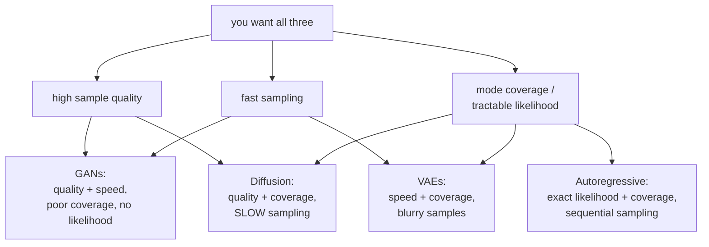
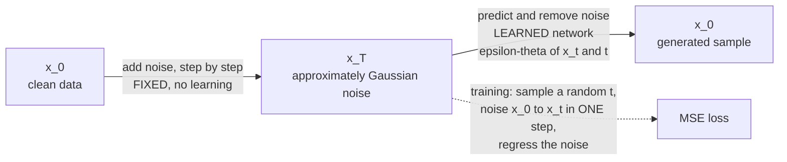

# Generative Models

A discriminative model learns $p(y\mid x)$. A generative model learns $p(x)$ —
and conditional generators model $p(x|c)$ for context $c$. Sampling, density
evaluation, reconstruction and useful representations are distinct capabilities.
This chapter develops the objectives and algorithms connecting them, including
complete CPU training and sampling experiments. High density alone is not a
reliable anomaly score in every domain; evaluate the intended downstream use.

## The generative trilemma

Families make different practical compromises. The diagram and table summarize
common tendencies, not an impossibility theorem or a guarantee of mode coverage.



| Family | Likelihood | Sample quality | Sampling speed | Mode coverage |
|---|---|---|---|---|
| Autoregressive | **exact** | high | slow (sequential) | good |
| VAE | lower bound | blurry | **fast** (one pass) | good |
| GAN | none | **sharp** | **fast** | **poor** |
| Normalizing flow | **exact** | moderate | fast | good |
| Diffusion | bound / score | **excellent** | slow (many steps) | **excellent** |
| Consistency / distilled diffusion | approximate | high | **fast** | good |

## Autoregressive models

Factor the joint distribution by the chain rule of probability:

$$p(\mathbf{x}) = \prod_{i=1}^{n} p(x_i \mid x_{<i})$$

That is an identity, not an approximation. Model each conditional with a network
and you have an exact likelihood model.

| Model | Domain |
|---|---|
| GPT-family | text, code |
| PixelCNN / PixelRNN | images, pixel by pixel |
| WaveNet | raw audio samples |
| Image/video tokenisers + transformer | VQ-GAN, Parti, MagViT |
| Molecular SMILES generators | chemistry |

**Strengths** include normalized conditional likelihoods, a direct cross-entropy
objective and access to entropy-coding methods for compression. Coverage and
sample quality depend on the learned conditionals and sampling policy, not the
chain rule alone. Perplexity comparisons also require matching tokenization.

**The weakness is sequential sampling**: generating $n$ tokens takes $n$ forward
passes. This is precisely why LLM inference engineering exists — KV caching,
speculative decoding, continuous batching — and why images are usually generated
by diffusion rather than pixel-by-pixel autoregression.

**Teacher forcing and exposure bias**: training conditions each step on the
*ground-truth* prefix, while generation conditions on the model's own output.
Errors can compound on prefixes that differ from training examples. Scheduled
sampling and sequence-level training address aspects of this mismatch but change
the statistical objective and can introduce their own bias. Compare complete
generation quality rather than assuming a lower teacher-forced loss settles it.

## Variational autoencoders

### The setup

Assume a latent variable model: $\mathbf{z}\sim p(\mathbf{z})$ (usually
$\mathcal{N}(0,I)$), then $\mathbf{x}\sim p_\theta(\mathbf{x}\mid\mathbf{z})$.
The marginal likelihood requires an intractable integral:

$$p_\theta(\mathbf{x}) = \int p_\theta(\mathbf{x}\mid\mathbf{z})p(\mathbf{z})\,d\mathbf{z}$$

### The ELBO, derived

Introduce a variational posterior $q_\phi(\mathbf{z}\mid\mathbf{x})$ and apply
Jensen's inequality:

$$\log p_\theta(\mathbf{x}) = \log\int q_\phi(\mathbf{z}\mid\mathbf{x})\frac{p_\theta(\mathbf{x},\mathbf{z})}{q_\phi(\mathbf{z}\mid\mathbf{x})}d\mathbf{z} \;\ge\; \mathbb{E}_{q_\phi}\!\left[\log\frac{p_\theta(\mathbf{x},\mathbf{z})}{q_\phi(\mathbf{z}\mid\mathbf{x})}\right]$$

Rearranged into the standard form:

$$\mathcal{L}_{\text{ELBO}} = \underbrace{\mathbb{E}_{q_\phi}\bigl[\log p_\theta(\mathbf{x}\mid\mathbf{z})\bigr]}_{\text{reconstruction}} - \underbrace{D_{\mathrm{KL}}\bigl(q_\phi(\mathbf{z}\mid\mathbf{x})\,\Vert\,p(\mathbf{z})\bigr)}_{\text{regularisation}}$$

The gap between $\log p_\theta(\mathbf{x})$ and the ELBO is exactly
$D_{\mathrm{KL}}(q_\phi\Vert p_\theta(\mathbf{z}\mid\mathbf{x}))$. Maximizing
the ELBO trades off data fit and posterior approximation; an individual joint
update need not improve both separately.

Read the two terms as a tension: reconstruction wants the latent to encode
everything about $\mathbf{x}$; the KL term wants the posterior to look like the
prior, i.e. to encode nothing. The balance is what produces a smooth,
sample-able latent space rather than a lookup table.

The original [variational autoencoder paper](https://arxiv.org/abs/1312.6114)
connects amortized posterior inference with a trainable lower-bound estimator.

### The reparameterisation trick

A naive parameter-dependent draw does not expose the desired derivative to
ordinary autodiff. For a Gaussian, use a pathwise estimator by rewriting

$$\mathbf{z} = \boldsymbol\mu_\phi(\mathbf{x}) + \boldsymbol\sigma_\phi(\mathbf{x})\odot\boldsymbol\epsilon, \qquad \boldsymbol\epsilon\sim\mathcal{N}(0,I)$$

The randomness now lives in $\boldsymbol\epsilon$, a constant input, and
gradients flow through $\boldsymbol\mu$ and $\boldsymbol\sigma$ normally. **This
substitution gives a differentiable path through the sample**. Score-function
estimators are another option, especially for discrete variables, often with
different variance and bias tradeoffs.

The following loss fragment assumes an encoder, decoder, data and beta coefficient;
the complete Gaussian example below specifies its likelihood and reductions.

```python
mu, logvar = encoder(x)
std = torch.exp(0.5 * logvar)
z = mu + std * torch.randn_like(std)              # reparameterised sample
recon = decoder(z)

rec_loss = F.mse_loss(recon, x, reduction="sum")   # or BCE for binary data
kl = -0.5 * torch.sum(1 + logvar - mu.pow(2) - logvar.exp())   # closed form vs N(0,I)
loss = rec_loss + beta * kl
```

### Why VAE samples are blurry

Two reinforcing reasons:

1. **The reconstruction term is usually a Gaussian likelihood** (MSE), which
   optimises the *conditional mean*. Averaging over plausible outputs produces
   blur by construction.
2. **The posterior is a factorised Gaussian**, which cannot represent the true
   posterior's structure, so the model hedges.

**Posterior collapse** is the other characteristic failure: with a powerful
decoder, the model can achieve good reconstruction while ignoring
$\mathbf{z}$ entirely, driving the KL term to zero. The latent becomes
uninformative. Candidate remedies include KL annealing, free bits (no additional
KL penalty below a per-coordinate or group threshold), or a weaker decoder.

| Variant | Change |
|---|---|
| **$\beta$-VAE** | weight the KL by $\beta>1$ to encourage disentanglement |
| **VQ-VAE** | discrete codebook latents; different collapse mechanisms, including unused codes |
| Conditional VAE | condition both encoder and decoder on a label |
| Hierarchical VAE (NVAE, VDVAE) | multiple latent levels; competitive sample quality |

**VQ-VAE deserves emphasis** because it is load-bearing in modern systems: it
turns images into sequences of discrete tokens, which is what lets a transformer
model image tokens autoregressively. It is also one possible autoencoder for
latent generation. Latent diffusion can instead use
a KL-regularized continuous autoencoder; discrete vector quantization is not a
requirement. [VQ-VAE](https://arxiv.org/abs/1711.00937) and
[latent diffusion](https://arxiv.org/abs/2112.10752) describe different design choices.

## Generative adversarial networks

Two networks in a minimax game:

$$\min_G\max_D \;\mathbb{E}_{x\sim p_{\text{data}}}[\log D(x)] + \mathbb{E}_{z\sim p_z}[\log(1-D(G(z)))]$$

The discriminator learns to tell real from generated; the generator learns to
fool it. At the optimal discriminator, the generator minimises
$2\,\mathrm{JS}(p_{\text{data}}\Vert p_g) - \log 4$.

**This diagnoses one source of weak gradients.** When the two
distributions have disjoint support — which is generic for high-dimensional data
on low-dimensional manifolds — the JS divergence is constant at $\log 2$ and its
gradient is **zero**. A discriminator that becomes too good provides no learning
signal under the idealized saturated minimax analysis. Finite discriminators,
non-saturating losses and simultaneous game dynamics require separate analysis;
the JS calculation alone does not explain every oscillation or collapsed run.

| Failure | Description | Mitigations |
|---|---|---|
| **Mode collapse** | the generator produces a few outputs that reliably fool $D$ | minibatch discrimination, unrolled GANs, WGAN-GP, diverse-batch losses |
| Vanishing generator gradient | $D$ too strong | non-saturating loss, WGAN |
| Training instability | oscillation, divergence | spectral normalisation, TTUR, careful architecture |
| No likelihood | cannot evaluate $p(x)$ | use FID/precision-recall metrics instead |
| Evaluation difficulty | FID and IS are imperfect proxies | human evaluation, precision/recall for distributions |

| Variant | Contribution |
|---|---|
| DCGAN | convolutional architecture guidelines that made GANs trainable |
| **WGAN / WGAN-GP** | Wasserstein distance — informative gradients even for disjoint support |
| **Spectral norm GAN** | constrain the discriminator's Lipschitz constant |
| Conditional GAN | condition on a label |
| **Pix2Pix / CycleGAN** | paired and unpaired image translation |
| **StyleGAN 1–3** | style-based generator; the peak of GAN image quality |
| BigGAN | large-scale class-conditional generation |

GANs have largely been displaced by diffusion for image synthesis, but they
remain candidates where **single-step sampling** matters: real-time style
transfer, super-resolution, and — notably — as the adversarial component in
diffusion-model distillation, where they train a few-step student.

## Normalizing flows

Define an invertible map $f$ from **data to base**, $z=f(x)$, and use
the change-of-variables formula:

$$\log p_X(\mathbf{x}) = \log p_Z(f(\mathbf{x})) + \log\left|\det\frac{\partial f}{\partial\mathbf{x}}\right|$$

Sampling uses $x=f^{-1}(z)$ with $z\sim p_Z$. These are exact mathematical
identities for tractable discrete flow layers, without an ELBO or adversary.
The constraint is severe: $f$ must be invertible and its Jacobian determinant
must be cheap, which restricts the architecture heavily.

| Design | Trick |
|---|---|
| Coupling layers (RealNVP, Glow) | transform half the dimensions conditioned on the other half → triangular Jacobian |
| Autoregressive flows (MAF, IAF) | triangular by construction; fast in one direction only |
| Continuous flows (FFJORD) | an ODE; the determinant becomes a trace |
| Invertible 1×1 convolutions | learned channel permutations (Glow) |

Flows are used where exact density matters — anomaly detection, variational
inference, physics and cosmology, and lossless compression — rather than for
image synthesis, where diffusion dominates on quality per parameter.

## Diffusion models

Diffusion learns to reverse a prescribed noising process and is widely used for
images, audio and video. Quality and sampling cost depend on the entire recipe.

### The forward process

Gradually add Gaussian noise over $T$ steps until the data contribution is small:

$$q(\mathbf{x}_t\mid\mathbf{x}_{t-1}) = \mathcal{N}\bigl(\sqrt{1-\beta_t}\,\mathbf{x}_{t-1},\; \beta_t I\bigr)$$

A closed form lets you jump to any timestep in one step, which is what makes
training efficient:

$$\mathbf{x}_t = \sqrt{\bar\alpha_t}\,\mathbf{x}_0 + \sqrt{1-\bar\alpha_t}\,\boldsymbol\epsilon, \qquad \bar\alpha_t = \prod_{s=1}^{t}(1-\beta_s)$$

### The reverse process

Train a network to predict the noise that was added:

$$L = \mathbb{E}_{t,\mathbf{x}_0,\boldsymbol\epsilon}\Bigl[\bigl\|\boldsymbol\epsilon - \boldsymbol\epsilon_\theta(\mathbf{x}_t, t)\bigr\|^2\Bigr]$$

This common simplified objective reweights terms in a variational construction.
Other recipes predict clean data, velocity or a score and choose different
time-dependent weights. Diffusion avoids adversarial game optimization, but can
still memorize data, miss modes, become numerically unstable or fail conditionally.



### Sampling and its cost

DDPM sampling takes $T = 1000$ network evaluations. Everything since has been an
attack on that number:

| Method | Steps | Idea |
|---|---|---|
| DDPM | ~1000 | the original stochastic reverse process |
| **DDIM** | 20–100 | deterministic, non-Markovian; skips steps |
| DPM-Solver / UniPC | 10–20 | treat it as an ODE and use a high-order solver |
| **Progressive distillation** | 4–8 | a student learns to take two teacher steps at once |
| **Consistency models** | 1–4 | map any point on a trajectory directly to its origin |
| Adversarial distillation (SDXL-Turbo) | 1–4 | a GAN loss on a distilled student |
| **Rectified flow / flow matching** | 1–20 | learn straight transport paths from noise to data |

### Conditioning and guidance

**Classifier-free guidance** is the technique that made text-to-image work at
production quality. Train the model with the conditioning randomly dropped (say
10% of the time) so it learns both conditional and unconditional predictions,
then at sampling time extrapolate:

$$\tilde{\boldsymbol\epsilon} = \boldsymbol\epsilon_\theta(\mathbf{x}_t,\varnothing) + w\bigl[\boldsymbol\epsilon_\theta(\mathbf{x}_t,c) - \boldsymbol\epsilon_\theta(\mathbf{x}_t,\varnothing)\bigr]$$

$w > 1$ pushes the sample further in the direction the conditioning indicates.
Higher $w$ gives better prompt adherence and lower diversity — the classic
quality/diversity dial, and the reason `guidance_scale` is the first parameter
anyone tunes. It costs two forward passes per step.

**Latent diffusion** is the other decisive engineering step: run the diffusion in
a VAE's compressed latent space (e.g. 64×64×4 instead of 512×512×3) rather than
in pixel space. That is a 64-fold reduction in spatial positions and a 48-fold
reduction in element count after including the channel change. That reduction
lowers the denoiser's workload, although the autoencoder adds its own computation
and reconstruction constraints.

### Architecture

U-Net backbones with residual blocks, self-attention at lower resolutions, and
timestep embeddings injected via FiLM-style modulation; cross-attention layers
inject text conditioning. **Diffusion Transformers (DiT)** replace the U-Net with
a plain transformer over latent patches and scale better — the direction
frontier image and video models have taken.

## Likelihood units and a worked VAE

For a diagonal Gaussian posterior with mean $\mu$ and variances $\sigma_j^2$,
the KL to a unit Gaussian is
$\tfrac12\sum_j(\mu_j^2+\sigma_j^2-1-\log\sigma_j^2)$.
If $\mu=(1,0)$ and variances are $(1,4)$, this is
$\tfrac12(1+4-1-\log4)=1.30685$ nats. A larger posterior variance is not a
free way to hide information: both very small and very large variances can incur
a KL cost. The [probability chapter](../math/probability.md) develops Gaussian
conditioning, while [information theory](../math/information-theory.md) explains
KL direction and units.

For decoder $p_\theta(x|z)=\mathcal N(m_\theta(z),\sigma_x^2I)$, reconstruction
negative log-likelihood is
$\|x-m_\theta(z)\|^2/(2\sigma_x^2)+(D/2)\log(2\pi\sigma_x^2)$.
Changing decoder variance changes the balance with KL. Summing pixels and then
averaging examples differs from averaging all elements; an unexplained reduction
can silently multiply the effective regularization by image dimension. With
$\beta=1$, the expected reconstruction NLL plus KL is negative ELBO. Other
$\beta$ values define a modified objective, not automatically the same likelihood
bound. Free-bits objectives clamp a KL penalty contribution; they do not force
each latent coordinate to actually encode useful information.

The ELBO gap is a posterior KL at fixed parameters. Joint optimization can
improve the data likelihood, change the gap, or trade one against the other;
every gradient step need not tighten both simultaneously. A factorized posterior
is an approximation choice, not a theorem that all VAE samples must blur. Stronger
likelihoods, hierarchical latents and expressive posteriors change sample quality.

### Runnable lab: Gaussian VAE training and prior sampling

The data are four noisy clusters in two dimensions. This model uses a fixed
Gaussian decoder variance and a standard normal prior. Its assertions check loss
improvement, a library KL identity and finite prior samples. They do not claim that
short training has perfectly recovered all four modes.

```python runnable
import math
import torch
from torch import nn
from torch.distributions import Normal, kl_divergence

torch.manual_seed(31)
torch.set_num_threads(1)
centers = torch.tensor([[-1., -1.], [-1., 1.], [1., -1.], [1., 1.]])
x = centers[torch.randint(4, (512,))] + 0.12 * torch.randn(512, 2)
encoder = nn.Sequential(nn.Linear(2, 32), nn.Tanh(), nn.Linear(32, 4))
decoder = nn.Sequential(nn.Linear(2, 32), nn.Tanh(), nn.Linear(32, 2))
opt = torch.optim.Adam(list(encoder.parameters()) + list(decoder.parameters()), lr=0.01)
sigma_x = 0.25
fixed_noise = torch.randn(len(x), 2)

def objective(noise):
    mu, logvar = encoder(x).chunk(2, dim=-1)
    logvar = logvar.clamp(-8, 4)
    std = (0.5 * logvar).exp()
    z = mu + std * noise
    reconstruction = decoder(z)
    nll = (0.5 * ((x - reconstruction) / sigma_x).square()
           + math.log(sigma_x * math.sqrt(2 * math.pi))).sum(-1)
    kl = 0.5 * (mu.square() + logvar.exp() - 1 - logvar).sum(-1)
    return (nll + kl).mean(), kl, mu, std

with torch.no_grad():
    initial = objective(fixed_noise)[0].item()
for _ in range(180):
    opt.zero_grad(set_to_none=True)
    loss, _, _, _ = objective(torch.randn(len(x), 2))
    loss.backward()
    opt.step()
encoder.eval()
decoder.eval()
with torch.no_grad():
    final, kl, mu, std = objective(fixed_noise)
    library_kl = kl_divergence(Normal(mu, std), Normal(torch.zeros_like(mu),
                                                       torch.ones_like(std))).sum(-1)
    torch.testing.assert_close(kl, library_kl, atol=1e-5, rtol=1e-5)
    prior_means = decoder(torch.randn(256, 2))
    samples = prior_means + sigma_x * torch.randn_like(prior_means)
    nearest = torch.cdist(samples, centers).argmin(-1)
    counts = torch.bincount(nearest, minlength=4)
assert final.item() < initial
assert samples.shape == (256, 2) and torch.isfinite(samples).all()
print({"initial_negative_elbo": initial, "final_negative_elbo": final.item(),
       "mean_kl": kl.mean().item(), "nearest_mode_counts": counts.tolist()})
```

Inspect reconstructions from posterior samples and fresh prior samples separately.
For this Gaussian likelihood, the decoder returns a conditional mean. Sampling
the modeled observation requires adding Gaussian noise with standard deviation
`sigma_x`, as the lab does; plotting only decoder means shows a different
distribution with the observation noise removed.
Excellent reconstruction with poor prior samples can indicate an aggregate-posterior
mismatch or a decoder that learned only a narrow latent region. Near-zero KL with
unchanged outputs when $z$ changes suggests posterior collapse. For VQ models,
instead inspect code usage, assignment entropy, commitment loss and dead codes;
the discrete bottleneck has its own failure modes.

## GAN gradients and flow geometry

Write a discriminator logit as $a$ and $D=\sigma(a)$. The minimax generator loss
$\log(1-D(G(z)))$ has derivative $-D$ with respect to $a$ and becomes weak when
the discriminator confidently rejects generated samples. The non-saturating
alternative $-\log D(G(z))$ has derivative $D-1$, approximately $-1$ when $D$
is near zero. Both still multiply by the discriminator's input derivative and
the generator Jacobian. Non-saturating loss repairs one saturation mechanism,
not every source of a poor generator gradient.

Mode collapse is easy to hide in a few samples. Suppose data place equal mass
at $-2$ and $2$, but a generator always outputs near $2$. Those samples can look
plausible while half the data distribution is absent. Evaluate coverage and
conditional diversity, not only discriminator loss. During discriminator updates,
detach generated samples; during generator updates, preserve the path through the
discriminator to generator parameters while avoiding unintended discriminator
updates. Loss values from a moving two-player game are not ordinary supervised
convergence curves. [Original GAN](https://arxiv.org/abs/1406.2661).

WGAN substitutes a critic with a Lipschitz constraint; gradient penalties and
spectral normalization enforce related but not identical restrictions. Two-time-scale
learning rates address optimization dynamics. Dueling generator/discriminator
capacity, augmentation and data scarcity still affect results. Conditional GANs,
Pix2Pix/CycleGAN, StyleGAN and BigGAN are choices of conditioning, architecture
and training design, not exceptions to the need for distributional evaluation.

### A triangular coupling transformation

For a data-to-base affine coupling, split $x=(x_a,x_b)$ and define
$z_a=x_a$, $z_b=(x_b-t(x_a))\odot e^{-s(x_a)}$.
Its inverse is $x_a=z_a$, $x_b=z_b\odot e^{s(z_a)}+t(z_a)$ and log absolute
Jacobian determinant is $-\sum_j s_j(x_a)$. Derivatives of $s,t$ occur in an
off-diagonal Jacobian block and do not change the triangular determinant.
Alternate partitions or invertible permutations so every coordinate can change.

In two dimensions, take $s=\log2$ and $t(x_a)=x_a$. At $x=(1,5)$, $z=(1,2)$,
the determinant is $1/2$, and standard-normal log-density is
$-\log(2\pi)-2.5-\log2\approx-5.0310$. The negative log-determinant is
necessary: expanding volume during generation reduces density per unit volume.
If the map is instead defined base-to-data, evaluate its inverse and subtract
its log determinant. Never copy a sign without specifying direction.

Continuous normalizing flows evolve $dx/dt=v_\theta(x,t)$ and track
$d\log p(x(t))/dt=-\operatorname{tr}(\partial v/\partial x)$.
The identity is exact, but a numerical ODE solution and a stochastic trace
estimator introduce approximation. Discrete image values also require a defined
dequantization or discrete-likelihood treatment before comparing continuous
bits-per-dimension. [Real NVP](https://arxiv.org/abs/1605.08803).

## From noise prediction to an actual reverse step

Let $\alpha_t=1-\beta_t$ and $\bar\alpha_t=\prod_{s=1}^t\alpha_s$. For a
DDPM noise predictor, a common reverse mean is

$$\mu_\theta(x_t,t)=\frac{1}{\sqrt{\alpha_t}}
\left(x_t-\frac{\beta_t}{\sqrt{1-\bar\alpha_t}}
\epsilon_\theta(x_t,t)\right).$$

One fixed-variance choice uses the forward posterior variance
$\tilde\beta_t=\beta_t(1-\bar\alpha_{t-1})/(1-\bar\alpha_t)$.
Sample $x_{t-1}=\mu_\theta+\sqrt{\tilde\beta_t}\xi$ with fresh standard normal
$\xi$, omitting that noise at the final step. Other variance choices are valid
recipes but must match the stated sampler. A finite schedule leaves residual
signal at $T$; initializing from an exact standard Gaussian is an approximation
unless the schedule makes the terminal marginal close enough.

For scalar $x_t=0.7$, predicted noise 0.2, $\alpha_t=0.9$ and
$\bar\alpha_t=0.5$, the reverse mean is approximately
$(0.7-0.1\cdot0.2/\sqrt{0.5})/\sqrt{0.9}=0.7080$.
Predicting noise does not mean simply subtracting it: the schedule supplies
scaling and stochastic variance. One may also estimate
$\hat x_0=(x_t-\sqrt{1-\bar\alpha_t}\epsilon_\theta)/\sqrt{\bar\alpha_t}$,
which can become numerically sensitive when the denominator is tiny.
[DDPM](https://arxiv.org/abs/2006.11239) gives the probabilistic construction.

### Runnable lab: training a denoiser and sampling a DDPM

This short two-dimensional experiment uses forty diffusion steps, a time-conditioned
PyTorch MLP, fresh corruption noise during training and a fixed evaluation batch.
The large final noise levels suit a tiny demonstration, not a production image
schedule. Samples and mode counts are diagnostics rather than asserted fidelity.

```python runnable
import torch
from torch import nn

torch.manual_seed(32)
torch.set_num_threads(1)
centers = torch.tensor([[-1., -1.], [-1., 1.], [1., -1.], [1., 1.]])
data = centers[torch.randint(4, (512,))] + 0.1 * torch.randn(512, 2)
steps = 40
beta = torch.linspace(0.01, 0.20, steps)
alpha = 1 - beta
abar = alpha.cumprod(0)
previous_abar = torch.cat((torch.ones(1), abar[:-1]))
posterior_variance = beta * (1 - previous_abar) / (1 - abar)
net = nn.Sequential(nn.Linear(3, 64), nn.SiLU(), nn.Linear(64, 64),
                    nn.SiLU(), nn.Linear(64, 2))
optimizer = torch.optim.Adam(net.parameters(), lr=0.005)

def predict(noisy, times):
    return net(torch.cat((noisy, times[:, None].float() / (steps - 1)), dim=1))

def denoising_loss(clean, times, noise):
    a = abar[times, None]
    noisy = a.sqrt() * clean + (1 - a).sqrt() * noise
    return nn.functional.mse_loss(predict(noisy, times), noise)

eval_times = torch.randint(steps, (len(data),))
eval_noise = torch.randn_like(data)
initial = denoising_loss(data, eval_times, eval_noise).item()
for _ in range(250):
    ids = torch.randint(len(data), (128,))
    times = torch.randint(steps, (128,))
    optimizer.zero_grad(set_to_none=True)
    loss = denoising_loss(data[ids], times, torch.randn(128, 2))
    loss.backward()
    optimizer.step()
net.eval()
with torch.no_grad():
    final = denoising_loss(data, eval_times, eval_noise).item()
    sample = torch.randn(256, 2)
    for t in reversed(range(steps)):
        times = torch.full((len(sample),), t, dtype=torch.long)
        epsilon = predict(sample, times)
        mean = (sample - beta[t] * epsilon / (1 - abar[t]).sqrt()) / alpha[t].sqrt()
        sample = mean if t == 0 else mean + posterior_variance[t].sqrt() * torch.randn_like(sample)
    counts = torch.bincount(torch.cdist(sample, centers).argmin(1), minlength=4)
assert posterior_variance[0] == 0
assert final < initial * 0.85
assert sample.shape == (256, 2) and torch.isfinite(sample).all()
print({"initial_noise_mse": initial, "final_noise_mse": final,
       "terminal_signal_fraction": abar[-1].item(), "mode_counts": counts.tolist()})
```

DDIM and ODE solvers may skip time points, but their update formulas must account
for both endpoints. Deleting iterations from a DDPM loop does not implement a
correct accelerated sampler. Conditioning dropout trains an unconditional branch;
classifier-free guidance with $w=1$ returns the conditional prediction and $w=0$
the unconditional one. Large extrapolation can improve alignment or instead
amplify artifacts and reduce diversity. Two branch evaluations may be batched;
they still represent roughly doubled denoiser work unless distilled or otherwise
optimized.

### Flow matching and rectified transport

Let $z\sim p_0$ be noise and $x\sim p_1$ be data. With interpolation
$x_t=(1-t)z+tx$, the path derivative for that pair is $x-z$.
Conditional flow matching trains
$\mathbb E\|v_\theta(x_t,t)-(x-z)\|^2$; the population optimum is the conditional
mean velocity given $x_t,t$. Generation integrates $dx_t/dt=v_\theta(x_t,t)$
from a noise sample at time zero. Pairwise paths are straight, but their averaged
learned velocity field need not give perfectly straight trajectories or accurate
one-step samples. Coupling choices, rectification and distillation affect the
number of useful solver steps. [Flow Matching](https://arxiv.org/abs/2210.02747).

For $z=(0,1)$ and $x=(2,3)$, $x_{0.25}=(0.5,1.5)$ and the target velocity is
$(2,2)$. An Euler step of size 0.25 with that exact constant velocity moves to
$(1,2)$. A learned field varies with location, so numerical solver error and model
error are separate. Diffusion noise prediction and flow-matching velocity can be
related under specified paths, but their network targets and sampler equations
must not be mixed without conversion.

## Evaluation

| Metric | Measures | Caveat |
|---|---|---|
| Negative log-likelihood / bits-per-dim | density fit | only for likelihood models; correlates poorly with perceived quality |
| **FID** | distance between Inception feature distributions | sensitive to the sample count and implementation details |
| Inception Score | quality and diversity via a classifier | superseded by FID |
| **Precision / Recall for distributions** | fidelity vs coverage, separately | far more diagnostic than a single FID number |
| CLIP score | text–image alignment | measures alignment, not quality |
| Human preference | preferences under a stated population and protocol | sampling uncertainty, rater differences and order effects |

**Report precision and recall separately.** A single FID number conflates
"samples look real" with "samples cover the data distribution", and the two fail
independently — mode collapse shows high precision and low recall, while a blurry
model shows the reverse.

## Choosing

| Need | Use |
|---|---|
| Text, code, any discrete sequence | autoregressive transformer |
| Highest-quality images or video | diffusion (latent, DiT backbone) |
| Real-time generation | GAN, or a distilled few-step diffusion model |
| Exact likelihood / anomaly detection | normalizing flow, or an autoregressive model |
| A smooth, structured latent space | VAE |
| Discrete tokens for a downstream transformer | VQ-VAE / VQ-GAN |
| Small data | VAE or a flow; GANs need a lot of data |

## Self-check

1. State the generative trilemma and place each family within it.
2. Derive the ELBO from Jensen's inequality and name the gap.
3. Why is the reparameterisation trick necessary, and what does it move where?
4. Give two independent reasons VAE samples are blurry.
5. Explain GAN training failure in terms of JS divergence and disjoint support.
6. What exactly does a diffusion model's network predict, and what is the loss?
7. What does classifier-free guidance trade off, and what does it cost per step?

### Worked answers

1. Quality, speed and coverage/likelihood are competing design goals, not a proven
   three-way impossibility. GANs, VAEs, autoregression, flows and diffusion occupy
   different empirical tradeoffs; conditioning and distillation can move them.
2. Insert $q(z|x)$ into the marginal integral and use Jensen on the logarithm.
   Rearrangement gives expected reconstruction log-likelihood minus prior KL.
   The gap is KL from the variational posterior to the model's true posterior.
3. Reparameterization moves randomness into a parameter-independent noise input,
   creating a differentiable path through mean and scale. It is not the only
   possible gradient estimator for stochastic latent-variable models.
4. A factorized Gaussian reconstruction model can predict conditional averages,
   and posterior/latent restrictions can limit detail. These are common causes,
   not proof that every VAE family is blurry; richer models can change both.
5. The ideal discriminator can separate disjoint supports while the minimax
   objective has weak gradients. Non-saturating loss improves one gradient path;
   capacity, game dynamics and mode coverage still require explicit diagnostics.
6. The common DDPM network predicts corruption noise using MSE at random times.
   Other targets include $x_0$, score and velocity. Sampling needs the matching
   reverse mean, variance and schedule, not just the network output.
7. Guidance extrapolates conditional away from unconditional predictions. It can
   trade diversity or artifacts against condition adherence and commonly requires
   two denoiser evaluations per step, possibly batched. Bigger is not always better.

## Where to go next

- [Self-Supervised Learning](./self-supervised-learning.md) — the other way to
  learn without labels.
- [CNNs](./cnns.md) — the U-Net backbone diffusion models are built on.
- [Attention & Transformers](./attention-and-transformers.md) — autoregressive
  models and DiT.
