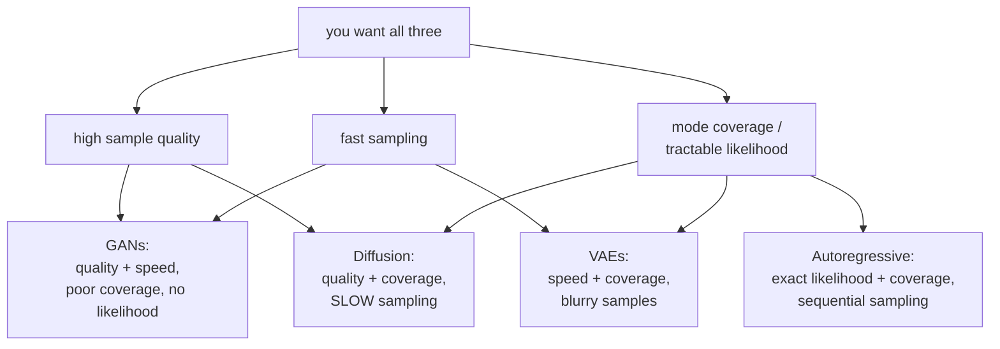
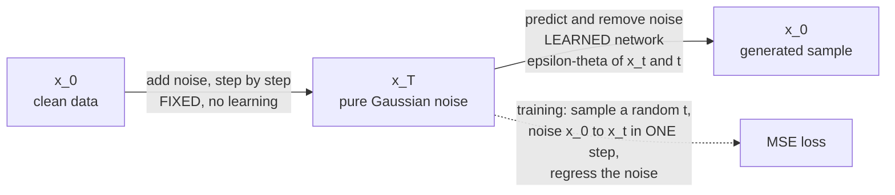

# Generative Models

A discriminative model learns $p(y\mid x)$. A generative model learns $p(x)$ —
and once you can evaluate or sample from that, you can create data, detect
outliers, fill in missing values, and compress. This page covers the five
families, what each optimises, and the trade-off that forces the choice between
them.

## The generative trilemma

Every family makes a different compromise among three desirable properties.



| Family | Likelihood | Sample quality | Sampling speed | Mode coverage |
|---|---|---|---|---|
| Autoregressive | **exact** | high | slow (sequential) | good |
| VAE | lower bound | blurry | **fast** (one pass) | good |
| GAN | none | **sharp** | **fast** | **poor** |
| Normalizing flow | **exact** | moderate | fast | good |
| Diffusion | bound / score | **excellent** | slow (many steps) | **excellent** |
| Consistency / distilled diffusion | approximate | high | **fast** | good |

## Autoregressive models

Factor the joint distribution by the chain rule of probability:

$$p(\mathbf{x}) = \prod_{i=1}^{n} p(x_i \mid x_{<i})$$

That is an identity, not an approximation. Model each conditional with a network
and you have an exact likelihood model.

| Model | Domain |
|---|---|
| GPT-family | text, code |
| PixelCNN / PixelRNN | images, pixel by pixel |
| WaveNet | raw audio samples |
| Image/video tokenisers + transformer | VQ-GAN, Parti, MagViT |
| Molecular SMILES generators | chemistry |

**Strengths**: exact likelihood (so perplexity is meaningful, and compression is
literal), stable training with a simple cross-entropy loss, excellent mode
coverage, and clean scaling behaviour.

**The weakness is sequential sampling**: generating $n$ tokens takes $n$ forward
passes. This is precisely why LLM inference engineering exists — KV caching,
speculative decoding, continuous batching — and why images are usually generated
by diffusion rather than pixel-by-pixel autoregression.

**Teacher forcing and exposure bias**: training conditions each step on the
*ground-truth* prefix, while generation conditions on the model's own output.
Errors compound at inference in a regime the model never saw during training.
Scheduled sampling and sequence-level training address it partially; in practice,
scale plus preference tuning has proved more effective than either.

## Variational autoencoders

### The setup

Assume a latent variable model: $\mathbf{z}\sim p(\mathbf{z})$ (usually
$\mathcal{N}(0,I)$), then $\mathbf{x}\sim p_\theta(\mathbf{x}\mid\mathbf{z})$.
The marginal likelihood requires an intractable integral:

$$p_\theta(\mathbf{x}) = \int p_\theta(\mathbf{x}\mid\mathbf{z})p(\mathbf{z})\,d\mathbf{z}$$

### The ELBO, derived

Introduce a variational posterior $q_\phi(\mathbf{z}\mid\mathbf{x})$ and apply
Jensen's inequality:

$$\log p_\theta(\mathbf{x}) = \log\int q_\phi(\mathbf{z}\mid\mathbf{x})\frac{p_\theta(\mathbf{x},\mathbf{z})}{q_\phi(\mathbf{z}\mid\mathbf{x})}d\mathbf{z} \;\ge\; \mathbb{E}_{q_\phi}\!\left[\log\frac{p_\theta(\mathbf{x},\mathbf{z})}{q_\phi(\mathbf{z}\mid\mathbf{x})}\right]$$

Rearranged into the standard form:

$$\mathcal{L}_{\text{ELBO}} = \underbrace{\mathbb{E}_{q_\phi}\bigl[\log p_\theta(\mathbf{x}\mid\mathbf{z})\bigr]}_{\text{reconstruction}} - \underbrace{D_{\mathrm{KL}}\bigl(q_\phi(\mathbf{z}\mid\mathbf{x})\,\Vert\,p(\mathbf{z})\bigr)}_{\text{regularisation}}$$

The gap between $\log p_\theta(\mathbf{x})$ and the ELBO is exactly
$D_{\mathrm{KL}}(q_\phi\Vert p_\theta(\mathbf{z}\mid\mathbf{x}))$ — so
maximising the ELBO both fits the data and tightens the posterior
approximation.

Read the two terms as a tension: reconstruction wants the latent to encode
everything about $\mathbf{x}$; the KL term wants the posterior to look like the
prior, i.e. to encode nothing. The balance is what produces a smooth,
sample-able latent space rather than a lookup table.

### The reparameterisation trick

You cannot backpropagate through sampling. Rewrite

$$\mathbf{z} = \boldsymbol\mu_\phi(\mathbf{x}) + \boldsymbol\sigma_\phi(\mathbf{x})\odot\boldsymbol\epsilon, \qquad \boldsymbol\epsilon\sim\mathcal{N}(0,I)$$

The randomness now lives in $\boldsymbol\epsilon$, a constant input, and
gradients flow through $\boldsymbol\mu$ and $\boldsymbol\sigma$ normally. **This
single substitution is what makes VAEs trainable by ordinary autodiff**, and the
same trick appears anywhere a gradient must pass through a sample.

```python
mu, logvar = encoder(x)
std = torch.exp(0.5 * logvar)
z = mu + std * torch.randn_like(std)              # reparameterised sample
recon = decoder(z)

rec_loss = F.mse_loss(recon, x, reduction="sum")   # or BCE for binary data
kl = -0.5 * torch.sum(1 + logvar - mu.pow(2) - logvar.exp())   # closed form vs N(0,I)
loss = rec_loss + beta * kl
```

### Why VAE samples are blurry

Two reinforcing reasons:

1. **The reconstruction term is usually a Gaussian likelihood** (MSE), which
   optimises the *conditional mean*. Averaging over plausible outputs produces
   blur by construction.
2. **The posterior is a factorised Gaussian**, which cannot represent the true
   posterior's structure, so the model hedges.

**Posterior collapse** is the other characteristic failure: with a powerful
decoder, the model can achieve good reconstruction while ignoring
$\mathbf{z}$ entirely, driving the KL term to zero. The latent becomes
uninformative. Fixes: KL annealing (ramp $\beta$ from 0), free bits (a minimum
KL per dimension), or a weaker decoder.

| Variant | Change |
|---|---|
| **$\beta$-VAE** | weight the KL by $\beta>1$ to encourage disentanglement |
| **VQ-VAE** | discrete latents via vector quantisation — no posterior collapse, and the basis of image tokenisers |
| Conditional VAE | condition both encoder and decoder on a label |
| Hierarchical VAE (NVAE, VDVAE) | multiple latent levels; competitive sample quality |

**VQ-VAE deserves emphasis** because it is load-bearing in modern systems: it
turns images into sequences of discrete tokens, which is what lets a transformer
model images with exactly the same machinery it uses for text. It is also the
first stage of latent diffusion.

## Generative adversarial networks

Two networks in a minimax game:

$$\min_G\max_D \;\mathbb{E}_{x\sim p_{\text{data}}}[\log D(x)] + \mathbb{E}_{z\sim p_z}[\log(1-D(G(z)))]$$

The discriminator learns to tell real from generated; the generator learns to
fool it. At the optimal discriminator, the generator minimises
$2\,\mathrm{JS}(p_{\text{data}}\Vert p_g) - \log 4$.

**And that is the theoretical diagnosis of GAN instability.** When the two
distributions have disjoint support — which is generic for high-dimensional data
on low-dimensional manifolds — the JS divergence is constant at $\log 2$ and its
gradient is **zero**. A discriminator that becomes too good provides no learning
signal at all.

| Failure | Description | Mitigations |
|---|---|---|
| **Mode collapse** | the generator produces a few outputs that reliably fool $D$ | minibatch discrimination, unrolled GANs, WGAN-GP, diverse-batch losses |
| Vanishing generator gradient | $D$ too strong | non-saturating loss, WGAN |
| Training instability | oscillation, divergence | spectral normalisation, TTUR, careful architecture |
| No likelihood | cannot evaluate $p(x)$ | use FID/precision-recall metrics instead |
| Evaluation difficulty | FID and IS are imperfect proxies | human evaluation, precision/recall for distributions |

| Variant | Contribution |
|---|---|
| DCGAN | convolutional architecture guidelines that made GANs trainable |
| **WGAN / WGAN-GP** | Wasserstein distance — informative gradients even for disjoint support |
| **Spectral norm GAN** | constrain the discriminator's Lipschitz constant |
| Conditional GAN | condition on a label |
| **Pix2Pix / CycleGAN** | paired and unpaired image translation |
| **StyleGAN 1–3** | style-based generator; the peak of GAN image quality |
| BigGAN | large-scale class-conditional generation |

GANs have largely been displaced by diffusion for image synthesis, but they
remain the right tool where **single-step sampling** is required: real-time style
transfer, super-resolution, and — notably — as the adversarial component in
diffusion-model distillation, where they train a few-step student.

## Normalizing flows

Build an invertible map $f$ from a simple base distribution to the data, and use
the change-of-variables formula:

$$\log p_X(\mathbf{x}) = \log p_Z(f(\mathbf{x})) + \log\left|\det\frac{\partial f}{\partial\mathbf{x}}\right|$$

**Exact likelihood, exact inference, exact sampling** — no bound, no adversary.
The constraint is severe: $f$ must be invertible and its Jacobian determinant
must be cheap, which restricts the architecture heavily.

| Design | Trick |
|---|---|
| Coupling layers (RealNVP, Glow) | transform half the dimensions conditioned on the other half → triangular Jacobian |
| Autoregressive flows (MAF, IAF) | triangular by construction; fast in one direction only |
| Continuous flows (FFJORD) | an ODE; the determinant becomes a trace |
| Invertible 1×1 convolutions | learned channel permutations (Glow) |

Flows are used where exact density matters — anomaly detection, variational
inference, physics and cosmology, and lossless compression — rather than for
image synthesis, where diffusion dominates on quality per parameter.

## Diffusion models

The current state of the art for images, audio, and video.

### The forward process

Gradually add Gaussian noise over $T$ steps until the data is pure noise:

$$q(\mathbf{x}_t\mid\mathbf{x}_{t-1}) = \mathcal{N}\bigl(\sqrt{1-\beta_t}\,\mathbf{x}_{t-1},\; \beta_t I\bigr)$$

A closed form lets you jump to any timestep in one step, which is what makes
training efficient:

$$\mathbf{x}_t = \sqrt{\bar\alpha_t}\,\mathbf{x}_0 + \sqrt{1-\bar\alpha_t}\,\boldsymbol\epsilon, \qquad \bar\alpha_t = \prod_{s=1}^{t}(1-\beta_s)$$

### The reverse process

Train a network to predict the noise that was added:

$$L = \mathbb{E}_{t,\mathbf{x}_0,\boldsymbol\epsilon}\Bigl[\bigl\|\boldsymbol\epsilon - \boldsymbol\epsilon_\theta(\mathbf{x}_t, t)\bigr\|^2\Bigr]$$

**That simple MSE is the whole training objective.** It is a reweighted form of
the variational bound, and its simplicity — no adversary, no bound to tighten, no
mode-collapse dynamics — is a large part of why diffusion training is so much
more stable than GAN training.



### Sampling and its cost

DDPM sampling takes $T = 1000$ network evaluations. Everything since has been an
attack on that number:

| Method | Steps | Idea |
|---|---|---|
| DDPM | ~1000 | the original stochastic reverse process |
| **DDIM** | 20–100 | deterministic, non-Markovian; skips steps |
| DPM-Solver / UniPC | 10–20 | treat it as an ODE and use a high-order solver |
| **Progressive distillation** | 4–8 | a student learns to take two teacher steps at once |
| **Consistency models** | 1–4 | map any point on a trajectory directly to its origin |
| Adversarial distillation (SDXL-Turbo) | 1–4 | a GAN loss on a distilled student |
| **Rectified flow / flow matching** | 1–20 | learn straight transport paths from noise to data |

### Conditioning and guidance

**Classifier-free guidance** is the technique that made text-to-image work at
production quality. Train the model with the conditioning randomly dropped (say
10% of the time) so it learns both conditional and unconditional predictions,
then at sampling time extrapolate:

$$\tilde{\boldsymbol\epsilon} = \boldsymbol\epsilon_\theta(\mathbf{x}_t,\varnothing) + w\bigl[\boldsymbol\epsilon_\theta(\mathbf{x}_t,c) - \boldsymbol\epsilon_\theta(\mathbf{x}_t,\varnothing)\bigr]$$

$w > 1$ pushes the sample further in the direction the conditioning indicates.
Higher $w$ gives better prompt adherence and lower diversity — the classic
quality/diversity dial, and the reason `guidance_scale` is the first parameter
anyone tunes. It costs two forward passes per step.

**Latent diffusion** is the other decisive engineering step: run the diffusion in
a VAE's compressed latent space (e.g. 64×64×4 instead of 512×512×3) rather than
in pixel space. That is a ~48× reduction in the spatial dimensionality the
diffusion model must handle, and it is what made Stable Diffusion runnable on
consumer hardware.

### Architecture

U-Net backbones with residual blocks, self-attention at lower resolutions, and
timestep embeddings injected via FiLM-style modulation; cross-attention layers
inject text conditioning. **Diffusion Transformers (DiT)** replace the U-Net with
a plain transformer over latent patches and scale better — the direction
frontier image and video models have taken.

## Evaluation

| Metric | Measures | Caveat |
|---|---|---|
| Negative log-likelihood / bits-per-dim | density fit | only for likelihood models; correlates poorly with perceived quality |
| **FID** | distance between Inception feature distributions | sensitive to the sample count and implementation details |
| Inception Score | quality and diversity via a classifier | superseded by FID |
| **Precision / Recall for distributions** | fidelity vs coverage, separately | far more diagnostic than a single FID number |
| CLIP score | text–image alignment | measures alignment, not quality |
| Human preference | the ground truth | expensive, and hard to make reproducible |

**Report precision and recall separately.** A single FID number conflates
"samples look real" with "samples cover the data distribution", and the two fail
independently — mode collapse shows high precision and low recall, while a blurry
model shows the reverse.

## Choosing

| Need | Use |
|---|---|
| Text, code, any discrete sequence | autoregressive transformer |
| Highest-quality images or video | diffusion (latent, DiT backbone) |
| Real-time generation | GAN, or a distilled few-step diffusion model |
| Exact likelihood / anomaly detection | normalizing flow, or an autoregressive model |
| A smooth, structured latent space | VAE |
| Discrete tokens for a downstream transformer | VQ-VAE / VQ-GAN |
| Small data | VAE or a flow; GANs need a lot of data |

## Self-check

1. State the generative trilemma and place each family within it.
2. Derive the ELBO from Jensen's inequality and name the gap.
3. Why is the reparameterisation trick necessary, and what does it move where?
4. Give two independent reasons VAE samples are blurry.
5. Explain GAN training failure in terms of JS divergence and disjoint support.
6. What exactly does a diffusion model's network predict, and what is the loss?
7. What does classifier-free guidance trade off, and what does it cost per step?

## Where to go next

- [Self-Supervised Learning](./self-supervised-learning.md) — the other way to
  learn without labels.
- [CNNs](./cnns.md) — the U-Net backbone diffusion models are built on.
- [Attention & Transformers](./attention-and-transformers.md) — autoregressive
  models and DiT.
