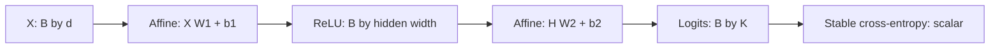

# Neural Networks: What Is Actually Being Computed

A multilayer perceptron learns a representation and a decision rule together.
Each hidden layer transforms coordinates; the output layer uses the resulting
coordinates to predict a target. Convolution, recurrence and attention add
different structural assumptions, rather than merely adding more neurons.

Three questions must remain separate: **can the architecture represent a useful
function, can training find it, and will it generalize?** A representation theorem
answers the first question, not the other two. A falling training loss answers
part of the second, not the third.

Prerequisites: [linear algebra](../math/linear-algebra.md) for inner products and
matrix maps, and [calculus](../math/calculus.md) for derivatives. Here $B$ is batch
size, $d$ is feature width and $K$ is class count. Observations occupy rows of
$X\in\mathbb R^{B\times d}$; this is a shape convention, not a memory-layout claim.

## The neuron

A neuron computes an affine score followed by a scalar function:

$$z=w^\top x+b,\qquad a=\phi(z).$$

Weights determine sensitivity to coordinates, the bias shifts the response, and
the activation determines how that response combines with later neurons. The
input derivative is $\partial a/\partial x_j=\phi'(z)w_j$, wherever it exists.
A large weight does not automatically mean an important feature: activation
saturation, correlated features, units and later layers change that interpretation.

For $w\ne0$, $w^\top x+b=0$ is a hyperplane. Its signed Euclidean distance from
$x$ is $(w^\top x+b)/\|w\|_2$, not the raw score. With $w=(3,4)$, $b=-5$ and
$x=(1,2)$, the score is $6$ and the distance is $1.2$. Multiplying weights and
bias by ten preserves the boundary but changes sigmoid probabilities. Decision
geometry and probability calibration are distinct properties.

An activation does not make a neuron inherently biological or probabilistic.
A threshold neuron is a linear classifier. A ReLU neuron is a hinge function.
A sigmoid can parameterize a Bernoulli probability when paired with an
appropriate objective. Biological neurons have substantially different dynamics;
the useful idea here is mathematical composition, not brain fidelity.

### The perceptron, and what it could not do

For labels $y_i\in\{-1,+1\}$, the perceptron updates a misclassified example by
$w\leftarrow w+\eta y_i x_i$, $b\leftarrow b+\eta y_i$. Incorporating the bias
as an extra constant feature makes the updates one vector operation.
Under linear separability with positive margin and bounded input norm, the
algorithm makes finitely many mistakes. Without separability it can cycle.

XOR illustrates a representational failure, not merely slow optimization:

| Input | Target | Sum $s=x_1+x_2$ |
|---|---|---|
| $(0,0)$ | 0 | 0 |
| $(0,1)$ | 1 | 1 |
| $(1,0)$ | 1 | 1 |
| $(1,1)$ | 0 | 2 |

No affine boundary separates the opposite corners. But two hidden ReLUs suffice:

$$h_1=\operatorname{ReLU}(s),\qquad h_2=\operatorname{ReLU}(s-1),
\qquad f(x)=h_1-2h_2.$$

The hidden coordinates are $(0,0),(1,0),(1,0),(2,1)$, respectively; $f$ is
$0,1,1,0$. A threshold at $0.5$ separates the classes. The hidden layer has made
an inseparable task linearly separable in its representation.

This construction specifies correct values only on four Boolean inputs.
Between them it defines a piecewise-linear extension, not a uniquely determined
continuous XOR. Many functions interpolate the same training points and disagree
elsewhere. Representation capacity alone cannot choose between them.

## The multilayer perceptron

Let the widths be $d_0,d_1,\ldots,d_L$, and use
$W_\ell\in\mathbb R^{d_{\ell-1}\times d_\ell}$ throughout. For a batch:

$$H_0=X,\quad Z_\ell=H_{\ell-1}W_\ell+\mathbf1b_\ell^\top,
\quad H_\ell=\phi_\ell(Z_\ell),\quad 1\le\ell<L,$$

$$Z_L=H_{L-1}W_L+\mathbf1b_L^\top.$$

Activations act elementwise in a plain MLP. The final tensor contains logits or
regression outputs as the task requires; it need not have a hidden activation.
For a single column-vector example the same convention gives
$z_\ell=W_\ell^\top h_{\ell-1}+b_\ell$.



### Why the nonlinearity matters

Two affine maps without an activation give

$$ (XW_1+\mathbf1b_1^\top)W_2+\mathbf1b_2^\top
=X(W_1W_2)+\mathbf1(b_1^\top W_2+b_2^\top).$$

The result is affine again. Depth adds no nonlinear representational power.
Nevertheless, linear regression is useful, and a narrow linear bottleneck
imposes a rank constraint. Factorization can also change optimization and
implicit regularization when the represented function class is unchanged.

For a ReLU network, fix the signs of every preactivation. Each ReLU then becomes
a diagonal matrix of zeros and ones, so the network is affine within that region.
Changing signs changes the formula. The decision boundary can therefore be
assembled from many linear pieces. More pieces provide flexibility, not a
guarantee that training selects a smooth or robust boundary.

### Batch form

PyTorch stores `nn.Linear(d_in, d_out).weight` as `(d_out,d_in)` and evaluates
`X @ weight.T + bias`. Its stored weight is the transpose of our $W$. For an
input `(B,T,d_in)`, the layer transforms the last dimension and returns
`(B,T,d_out)`; it does not mix sequence positions. Flattening `(B,T)` into an
example axis preserves this operation. Flattening `(T,d_in)` into one feature
axis changes the model and its parameter count.

One bias influences every observation, so its gradient sums the incoming gradient
over observations. If the objective is a batch mean, its $1/B$ is already inside
that incoming gradient. Dividing at every layer would incorrectly shrink
early-layer gradients repeatedly.

### Output layers and their losses

| Task | Output and target contract | Objective |
|---|---|---|
| Binary | logits and floating targets both `(B,1)` or both `(B,)` | binary cross-entropy with logits |
| Exclusive multiclass | logits `(B,K)`, integer class IDs `(B,)` | categorical cross-entropy |
| Multilabel | logits and binary floating targets `(B,K)` | independent binary cross-entropies |
| Regression | prediction and target exactly matching shapes | MSE, MAE or Huber |
| Counts | log-rate or positive rate; nonnegative count target | Poisson negative log likelihood |
| Quantiles | one scalar per requested quantile | asymmetric pinball loss |
| Heteroscedastic regression | mean and positive variance | Gaussian negative log likelihood |

Multiclass softmax forces probabilities to sum to one. That is correct for
one-of-$K$ outcomes, not labels that can simultaneously be true. Independent
sigmoids can express multiple positive labels but do not model their joint
dependence automatically.

For one binary observation, a stable loss is

$$\ell(z,y)=\max(z,0)-yz+\log(1+e^{-|z|}),\qquad
\frac{\partial\ell}{\partial z}=\sigma(z)-y.$$

For categorical classification,

$$\ell(z,y)=\log\sum_j e^{z_j}-z_y
=m+\log\sum_j e^{z_j-m}-z_y,\quad m=\max_jz_j.$$

Subtracting the maximum avoids overflow without changing probabilities.
Logits $(1000,999)$ with target $0$ yield loss
$\log(1+e^{-1})\approx0.3133$ and probabilities $(0.7311,0.2689)$.
Directly exponentiating $1000$ would overflow common floating-point formats.

Pass raw logits to PyTorch's fused losses. Feeding `softmax(z)` into
`CrossEntropyLoss` treats probabilities as another set of logits and optimizes
a different objective. Adding epsilon inside `-log(p)` also changes the loss;
its exact derivative is no longer simply $p-y$.

For Gaussian regression with mean $\mu$ and log-variance $s$:

$$\ell=\tfrac12\left[s+(y-\mu)^2e^{-s}\right]+\text{constant}.$$

The $s$ term penalizes arbitrarily inflated uncertainty. Monitor variance
predictions nonetheless: outliers, misspecified likelihoods and numerical overflow
can still destabilize training. For quantile $q$, pinball loss on residual
$r=y-\hat y$ is $\max(qr,(q-1)r)$. Multiple quantile heads may cross unless the
parameterization or objective prevents it. Output heads are statistical models,
not interchangeable cosmetic activations.

## A worked forward pass

Use a two-input, two-hidden-unit, one-logit network:

$$W_1=\begin{bmatrix}0.5&0.8\\-0.3&0.2\end{bmatrix},
\quad b_1=(0.1,-0.2),\quad W_2=\begin{bmatrix}1.2\\-0.7\end{bmatrix},
\quad b_2=0.3.$$

For $x=(1,2)$, the hidden scores are
$z_{11}=0.5-0.6+0.1=0$ and $z_{12}=0.8+0.4-0.2=1$.
ReLU gives $h=(0,1)$. The final logit is $-0.4$;
$p=\sigma(-0.4)\approx0.401312$. For target $1$, loss is
$\log(1+e^{0.4})\approx0.913015$ and the logit gradient is
$g=p-1\approx-0.598688$.

The output-weight gradient is $h^\top g=(0,-0.598688)^\top$, and the output-bias
gradient is $g$. The hidden gradient is
$gW_2^\top=(-0.718425,0.419082)$. Taking the usual ReLU derivative $0$ at its
kink gives hidden-score gradient $(0,0.419082)$ and

$$\nabla_{W_1}\ell=
\begin{bmatrix}0&0.419082\\0&0.838163\end{bmatrix},
\qquad \nabla_{b_1}\ell=(0,0.419082).$$

The first unit receives no local gradient for this example, but another example
can activate it. Decimal expressions intended to equal zero can also round to
tiny nonzero values in a program; finite-difference checks should avoid kinks.

Gradient descent makes the negative second output weight less negative, raising
the logit and probability of the positive target. A derivative should pass this
directional sanity check as well as a shape check.

## Why depth

### Universal approximation

A standard approximation statement for suitable activations such as ReLU says
that, on a compact subset of Euclidean space, a sufficiently wide one-hidden-layer
network can approximate a continuous function uniformly to any prescribed
positive tolerance. Width and parameters may depend on the function and
tolerance. It does not say one fixed network represents every continuous
function exactly.

The theorem supplies neither efficient training nor enough observations to
identify the function. It says nothing about behavior outside the compact domain.
A ReLU regressor extrapolates using the affine pieces established by its learned
parameters; excellent interpolation does not imply plausible extrapolation.

### Depth can make composition efficient

Boolean parity has an $O(n)$ shallow ReLU construction using hinges on the integer
sum of $n$ bits, so it is not an unrestricted exponential shallow-network lower
bound. Depth-separation results require a specific activation, distribution,
approximation error and resource measure.

Consider the tent map on $[0,1]$:

$$t(x)=2\operatorname{ReLU}(x)-4\operatorname{ReLU}(x-1/2)
+2\operatorname{ReLU}(x-1).$$

It rises from zero to one and falls to zero. Repeated composition creates more
oscillations using a small reusable block. A shallow univariate piecewise-linear
representation needs additional breakpoints to reproduce them. This illustrates
compositional efficiency without claiming every real task requires depth.
For formal assumptions, see [Telgarsky's depth-separation result](https://proceedings.mlr.press/v49/telgarsky16.html).

Depth also complicates optimization: gradients traverse products of Jacobians,
intermediate distributions evolve, and many parameter settings represent the
same function. Residuals and normalization address some problems, not all.
Depth is a useful inductive bias when hierarchical composition matches the task,
not a universal replacement for width or good features.

### What each layer learns

Vision models often develop edge/color responses followed by more task-specific
features. But individual units need not correspond to human concepts, and
transformer layers do not follow a universal syntax-then-semantics curriculum.
Representations can be distributed, redundant and dependent on the chosen basis.

Inspect them with held-out linear probes, nearest-neighbor examples and controlled
perturbations. A successful probe establishes accessibility to that probe, not
causal use by the original model. Transfer works when learned features align
with the new task and distribution; early layers are not automatically reusable
without adaptation. See [transfer learning](./transfer-learning-and-finetuning.md).

## Capacity, parameters, and compute

For a fully connected network with biases:

$$P=\sum_{\ell=1}^L(d_{\ell-1}d_\ell+d_\ell).$$

Widths $784\to512\to256\to10$ give
$401,920+131,328+2,570=535,818$ parameters. A dense multiply costs approximately
$2Bd_{in}d_{out}$ FLOPs when multiplication and addition count separately.
Biases, activations, reductions and memory movement add costs beyond that count.

Backward typically needs products for input and weight gradients, making dense
training roughly three forward-equivalent matrix multiplies. Frozen weights,
unused input gradients, attention, sparse lookups and checkpoint recomputation
change that ratio. The transformer shorthand $6ND$ is a rough dense-model
training estimate, not a universal accuracy guarantee.

Itemize memory. FP32 weights, gradients and two Adam moments require roughly
$4+4+8=16$ bytes per parameter before activations and workspaces. Low-precision
weights plus master copies, quantized optimizer state and sharding produce
different totals. Activations grow with batch size and layer widths; naive
attention can additionally store quadratic sequence-by-sequence matrices.

Parameter count is not statistical capacity by itself. Norms, margins,
augmentation, optimization, data structure and sample size all matter.
Interpolation and double descent do not make enlarging every overfitting network
a reliable remedy. Compare held-out performance under a fixed selection protocol.

### A supervised-learning workflow

Split data before fitting scalers or selecting hyperparameters. Fit preprocessing
only on training observations, use validation for architecture and checkpoint
selection, and evaluate the chosen model once on the test set. For time series,
users or repeated measurements, random rows can leak related observations; use
the dependency-aware splits in [model evaluation](../ml/model-evaluation.md).

Cross-entropy measures probability quality, confusion matrices expose class-wise
failures, and calibration checks expose overconfidence. Majority-class accuracy
can conceal zero minority recall. Selecting an operating threshold is a separate
validation decision from fitting logits.

### Symmetries and identifiability

Permuting hidden units and applying the inverse permutation to the next weight
matrix leaves the function unchanged. For ReLU, multiplying one unit's incoming
weights and bias by $c>0$ and dividing its outgoing weights by $c$ also preserves
the function, because $\operatorname{ReLU}(cz)=c\operatorname{ReLU}(z)$.
Two trained models can therefore compute the same outputs while having different
weight histograms. Comparing raw weights is not always a meaningful comparison
of learned functions.

These symmetries help explain why a Hessian can have small or zero curvature
directions without the predictor being uninformative. Weight decay may prefer
one factorization over another, and optimization may travel along nearly flat
directions. Function-space measurements on representative inputs complement
parameter-space diagnostics.

## Building one from scratch

This complete experiment uses PyTorch for differentiation and optimization,
then verifies a two-layer derivative against NumPy formulas. It trains an affine
baseline and an MLP on the same two-moons data with training-only standardization
and validation-selected checkpoints held in memory. It requires NumPy,
scikit-learn and PyTorch; it downloads and writes nothing.

```python runnable
import copy
import numpy as np
import torch
from torch import nn
from sklearn.datasets import make_moons
from sklearn.model_selection import train_test_split
from sklearn.preprocessing import StandardScaler

torch.set_num_threads(1)
torch.manual_seed(17)
np.random.seed(17)
X, y = make_moons(n_samples=1000, noise=0.16, random_state=17)
X_train, X_hold, y_train, y_hold = train_test_split(
    X, y, test_size=0.4, stratify=y, random_state=18
)
X_val, X_test, y_val, y_test = train_test_split(
    X_hold, y_hold, test_size=0.5, stratify=y_hold, random_state=19
)
scaler = StandardScaler().fit(X_train)
def tensors(features, labels):
    return (torch.tensor(scaler.transform(features), dtype=torch.float32),
            torch.tensor(labels, dtype=torch.long))
xt, yt = tensors(X_train, y_train)
xv, yv = tensors(X_val, y_val)
xs, ys = tensors(X_test, y_test)
loss_fn = nn.CrossEntropyLoss()

def train(hidden):
    torch.manual_seed(20)
    model = (nn.Sequential(nn.Linear(2, 24), nn.Tanh(), nn.Linear(24, 2))
             if hidden else nn.Linear(2, 2))
    optimizer = torch.optim.AdamW(model.parameters(), lr=0.02, weight_decay=0.001)
    best_loss = float("inf")
    best_state = copy.deepcopy(model.state_dict())
    for epoch in range(300):
        model.train()
        optimizer.zero_grad(set_to_none=True)
        loss = loss_fn(model(xt), yt)
        assert torch.isfinite(loss)
        loss.backward()
        optimizer.step()
        model.eval()
        with torch.inference_mode():
            val_loss = loss_fn(model(xv), yv).item()
        if val_loss < best_loss:
            best_loss = val_loss
            best_state = copy.deepcopy(model.state_dict())
    model.load_state_dict(best_state)
    model.eval()
    with torch.inference_mode():
        test_loss = loss_fn(model(xs), ys).item()
        accuracy = (model(xs).argmax(1) == ys).float().mean().item()
    print("MLP" if hidden else "affine", "validation", round(best_loss, 4),
          "test loss", round(test_loss, 4), "test accuracy", round(accuracy, 3))
    return model, accuracy

linear, linear_accuracy = train(False)
mlp, mlp_accuracy = train(True)
assert mlp_accuracy > 0.92
assert mlp_accuracy > linear_accuracy + 0.04

# Verify a smooth two-layer backward pass in float64.
rng = np.random.default_rng(21)
a = rng.normal(size=(5, 3))
w1 = rng.normal(size=(3, 4)) * 0.2
b1 = rng.normal(size=4) * 0.1
w2 = rng.normal(size=(4, 2)) * 0.2
b2 = np.zeros(2)
labels = np.array([0, 1, 0, 1, 1])
h = np.tanh(a @ w1 + b1)
logits = h @ w2 + b2
shifted = logits - logits.max(axis=1, keepdims=True)
log_probs = shifted - np.log(np.exp(shifted).sum(axis=1, keepdims=True))
loss_np = -log_probs[np.arange(5), labels].mean()
g = np.exp(log_probs)
g[np.arange(5), labels] -= 1
g /= len(labels)
gw2, gb2 = h.T @ g, g.sum(axis=0)
g1 = (g @ w2.T) * (1 - h * h)
gw1, gb1 = a.T @ g1, g1.sum(axis=0)
params = [torch.tensor(v, dtype=torch.float64, requires_grad=True)
          for v in (w1, b1, w2, b2)]
tw1, tb1, tw2, tb2 = params
z = torch.tanh(torch.tensor(a) @ tw1 + tb1) @ tw2 + tb2
loss_torch = nn.functional.cross_entropy(z, torch.tensor(labels))
loss_torch.backward()
np.testing.assert_allclose(loss_np, loss_torch.item(), rtol=1e-12)
for parameter, expected in zip(params, (gw1, gb1, gw2, gb2)):
    np.testing.assert_allclose(parameter.grad.numpy(), expected, atol=1e-12)
print("All manual gradients match autograd.")
```

Under this split and budget, the nonlinear model captures curvature the affine
model cannot. Assertions catch a lost nonlinearity, broken label contract or
incorrect reduction; they are not universal accuracy guarantees.

Extend the comparison by varying width with a fixed budget and repeating several
split seeds. Record training loss, validation loss and parameter count. A lower
training loss with worse validation loss is not a win. A decision grid generated
with `model(grid).argmax(1)` should show a line for the affine model and a curved
boundary for the MLP. Visualization is useful, but an attractive boundary should
not replace a numerical evaluation protocol.

## Choosing the architecture

Convolutions share local feature detectors, recurrent networks share a state
transition, transformers mix positions through content-dependent attention, and
graph/set models can enforce permutation properties. An unconstrained MLP must
learn those relationships from examples when they are not otherwise provided.

| Data or constraint | Useful baseline | What to compare |
|---|---|---|
| Tabular | linear model and boosted trees | missing values, categories, calibration and MLP gains |
| Images | pretrained CNN or vision transformer | resolution, augmentation, latency and transfer |
| Text | pretrained transformer | tokenization, context and adaptation budget |
| Time series | lag features, then TCN/recurrent/attention model | temporal leakage and horizon |
| Graphs | graph-aware model | neighborhood assumptions and oversmoothing |
| Sets | invariant or attention pooling | order invariance and cardinality |
| Audio | convolutional/spectral frontend plus sequence model | resolution and causal latency |
| Small labeled data | simple model or frozen features | uncertainty and overfitting |

For an MLP, start with a few hidden layers, verify targets and preprocessing,
and inspect learning curves before scaling. Widths $128$ to $512$ are candidate
starting points, not a law relating hidden width to input/output dimensions.
A bottleneck may remove relevant information; an extremely wide layer may spend
memory without improving validation performance.

## Representation, uncertainty, and deployment contracts

### Inputs are part of the architecture

A dense layer accepts numbers, but the meaning of those numbers determines its
inductive bias. Encoding a nominal category as integers $0,1,2$ asserts an
ordering and equal spacing that may not exist. A one-hot representation instead
lets each category have its own coefficient; a learned embedding compresses that
representation and shares statistical structure across categories. Unknown and
missing categories need a policy established during training, not an arbitrary
integer invented at deployment.

Continuous units matter too. A weight of $0.01$ on a feature measured in dollars
cannot be compared directly with a weight of $2$ on one measured in thousands of
dollars. Standardization changes parameter geometry and optimizer conditioning
without changing which affine functions can be represented when the transform
is invertible. A zero-variance feature requires explicit handling rather than
division by zero. Missing-value indicators can reveal informative missingness,
but also expose shortcuts tied to a data-collection process that later changes.

Interactions illustrate what a hidden layer contributes. An affine predictor
$w_1x_1+w_2x_2+b$ has zero mixed second derivative. A task depending on the
product $x_1x_2$ therefore needs engineered interaction features or a nonlinear
representation. A network can approximate the product on a bounded domain,
but providing known interactions can reduce data requirements. Learning features
and designing features are complementary choices, not competing ideologies.

### Compression and invariance can remove the target

A bottleneck $h\in\mathbb R^r$ forces all later predictions to depend on $x$
only through $h(x)$. If two inputs map to the same representation, no downstream
head can distinguish them. That can be desirable when they differ only by
nuisance variation, and fatal when they require different labels. Increasing
the output head's width cannot recover information already discarded upstream.

Consider classifying the presence of a local texture versus predicting its exact
position. Pooling position-specific features may help the first task by reducing
location sensitivity while making the second impossible without retaining
position information. Likewise, a permutation-invariant set representation is
appropriate for an unordered collection, but not for a sentence whose meaning
depends on word order. Architecture should enforce only invariances justified
by the task.

This reasoning also sharpens transfer learning. A frozen representation can
support a new linear head only if the needed distinctions remain accessible.
A head failing to improve may reflect insufficient training, but it may also
reflect a representation that intentionally removed the new target's signal.
Compare a frozen probe with partial and full adaptation before concluding the
dataset is inherently unlearnable.

### Probabilities require distributional assumptions

Cross-entropy encourages the conditional probabilities of the training
distribution when the model class and optimization permit it. It does not make
predictions calibrated under arbitrary distribution shift. A network can be
confident on inputs far outside its training support because its logits continue
to be computed there even when no relevant evidence was observed.

Class weighting changes the effective objective. For binary positive weight
$a$ and true conditional probability $\pi(x)$, minimizing weighted Bernoulli
cross-entropy gives the idealized probability

$$p^*(x)=\frac{a\pi(x)}{a\pi(x)+1-\pi(x)}.$$

For $a=9$ and $\pi=0.1$, the optimum is $0.5$, not $0.1$. This is useful for
altering an operating tradeoff, but the resulting raw sigmoid should not be
interpreted as the unweighted population probability without adjustment and
validation. Oversampling can produce a related prior change. Discrimination,
calibration and cost-sensitive decisions are separate objectives.

Deployment evaluation should therefore include the intended population, relevant
subgroups, input-quality failures and plausible shifts. Confidence thresholds
can support abstention, but an overconfident out-of-distribution predictor may
not abstain when it should. Ensembles and other uncertainty methods are useful
tools, not automatic guarantees against unknown inputs.

### What must travel with the weights

A usable predictor includes preprocessing statistics, feature order, category
maps, tokenizer or image transforms where relevant, output-label ordering and
the chosen operating threshold. A tensor checkpoint without those contracts can
load successfully and still produce systematically wrong predictions. Verify
training/evaluation mode and compare a fixed set of reference inputs across
serialization or deployment conversions.

Numerical agreement is task-dependent: a small logit perturbation near a tie can
change an argmax, while larger changes far from a boundary may preserve labels.
Check both prediction differences and the application's quality metric. That
same distinction will recur in quantization, compilation and inference serving;
the mathematical network is only one component of the complete prediction system.

## Common misconceptions

| Claim | More precise statement |
|---|---|
| More layers always help | Extra expressivity may be unnecessary or hard to optimize |
| Approximation guarantees learning | It is an existence statement under assumptions |
| More parameters necessarily overfit | Data and training matter, not count alone |
| Hidden units are individually meaningful | Representations can be distributed and basis-dependent |
| Good accuracy implies good probabilities | Calibration and operating thresholds need separate checks |
| A GPU is required | Small experiments run comfortably on CPUs |
| Networks necessarily beat trees on tables | Compare strong baselines under matched splits and budgets |
| Biases do not matter | They shift thresholds and priors; they can also overfit |

Before blaming architecture, verify label dtype, loss reduction, train/eval mode,
feature scaling and actual parameter updates. Try fitting a small consistent
batch without regularization. Failure narrows the investigation, but can also
reflect contradictory labels, inadequate capacity or poor optimization rather
than an autograd defect.

## Self-check

1. **Collapse two affine layers.** The effective weight is $W_1W_2$ and bias is
   $b_1^\top W_2+b_2^\top$. If intermediate width is $r$, the effective matrix
   has rank at most $r$, even though the expression remains affine.
2. **Verify XOR.** At sums $0,1,2$, hidden pairs are $(0,0),(1,0),(2,1)$,
   producing $0,1,0$. Both sum-one inputs receive the positive representation.
3. **What does approximation fail to guarantee?** Finding parameters, sufficient
   samples, efficient width, optimization stability and extrapolation remain
   unresolved. Approximation on a compact domain is not arbitrary-input correctness.
4. **Count a $100\to64\to64\to3$ MLP.** Layer counts are $6464$, $4160$ and
   $195$, totaling $10,819$. Batch size changes compute, not parameter count.
5. **Why sum a bias gradient?** Every row uses the same $b_k$, giving
   $\partial L/\partial b_k=\sum_i\partial L/\partial Y_{ik}$. Mean reduction
   contributes one $1/B$, not one at every layer.
6. **Why not softmax for simultaneous labels?** It allocates one unit of mass
   among mutually exclusive outcomes. Independent sigmoids can both approach one,
   describing marginal events rather than a single categorical outcome.
7. **What does a hidden layer do?** It learns coordinates useful to subsequent
   computation. Separability, compression and nuisance removal are possible
   outcomes, not guarantees from merely adding a layer.
8. **Does multiplying binary logits by ten preserve quality?** Zero-threshold
   decisions stay fixed, but probabilities become more extreme. Cross-entropy
   rises sharply for confident mistakes; calibration may improve or worsen.
9. **Why can training improve while validation worsens?** The model can fit
   sample-specific variation or shortcuts. Check splits and compare regularization
   under validation, without selecting repeatedly on test performance.
10. **Where is mean reduction applied in the experiment?** The categorical
    outgoing gradient divides by five once. Matrix products and bias sums then
    propagate derivatives of that already normalized scalar loss.

## Where to go next

- [Backpropagation and autodiff](./backpropagation-and-autodiff.md): local
  derivative rules and independent numerical checks.
- [Activations and initialization](./activations-and-initialization.md): signal
  and gradient scales at the start of training.
- [Optimization and training](./optimization-and-training.md): correct updates,
  accumulation, validation and checkpoint semantics.
- [Bias, variance and generalization](../ml/bias-variance-and-generalization.md):
  why fitting observations is not enough.

Primary reading: [Deep Learning, chapter 6](https://www.deeplearningbook.org/contents/mlp.html),
[depth separation](https://proceedings.mlr.press/v49/telgarsky16.html), and
[PyTorch autograd mechanics](https://docs.pytorch.org/docs/stable/notes/autograd.html).
The experiment runs with PyTorch 2.8 and requires no pretrained checkpoint.
