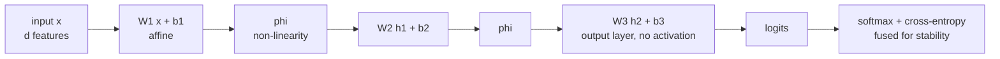

# Neural Networks: What Is Actually Being Computed

A neural network is a stack of linear maps with a non-linearity between each
pair. That is the whole architecture. Everything else — convolutions,
attention, normalisation, residual connections — is a constraint or an addition
on top of that skeleton, and every one of them exists because of a specific
problem with training the plain version.

## The neuron

A single artificial neuron computes a weighted sum and applies a non-linearity:

$$a = \phi\left(\sum_{j=1}^{d} w_j x_j + b\right) = \phi(\mathbf{w}^\top\mathbf{x}+b)$$

| Piece | Role |
|---|---|
| $w_j$ | how much input $j$ matters, and in which direction |
| $b$ | shifts the threshold; lets the neuron fire without any input |
| $\mathbf{w}^\top\mathbf{x}$ | a **projection** — how much of $\mathbf{x}$ points along $\mathbf{w}$ |
| $\phi$ | the non-linearity, without which the whole network collapses |

Geometrically, $\mathbf{w}^\top\mathbf{x}+b=0$ is a hyperplane, and the neuron
measures signed distance from it. A single neuron is a linear classifier; a
network is a composition of them.

### The perceptron, and what it could not do

Rosenblatt's 1958 perceptron used a step function and a simple update rule:
$\mathbf{w} \leftarrow \mathbf{w} + \eta(y - \hat{y})\mathbf{x}$. It provably
converges — in finite steps — **if the data is linearly separable**.

Minsky and Papert's 1969 counterexample was XOR:

| $x_1$ | $x_2$ | XOR |
|---|---|---|
| 0 | 0 | 0 |
| 0 | 1 | 1 |
| 1 | 0 | 1 |
| 1 | 1 | 0 |

No line separates $\{(0,1),(1,0)\}$ from $\{(0,0),(1,1)\}$. A single perceptron
cannot represent XOR at all — not "learns it badly", cannot represent it.

**A two-layer network solves it with two neurons.** The hidden layer computes
$h_1 = \mathrm{ReLU}(x_1 + x_2)$ and $h_2 = \mathrm{ReLU}(x_1 + x_2 - 1)$, and
the output is $h_1 - 2h_2$:

| $(x_1,x_2)$ | $h_1$ | $h_2$ | $h_1 - 2h_2$ |
|---|---|---|---|
| $(0,0)$ | 0 | 0 | 0 |
| $(0,1)$ | 1 | 0 | 1 |
| $(1,0)$ | 1 | 0 | 1 |
| $(1,1)$ | 2 | 1 | 0 |

The hidden layer has re-represented the input in coordinates where the problem
*is* linearly separable. **That is what a hidden layer does**, and it is the
single most useful sentence to hold onto: hidden layers learn representations,
the output layer draws a line in them.

## The multilayer perceptron

Stack $L$ layers, each an affine map followed by a non-linearity:

$$\mathbf{h}^{(0)} = \mathbf{x}, \qquad \mathbf{h}^{(\ell)} = \phi\bigl(W^{(\ell)}\mathbf{h}^{(\ell-1)} + \mathbf{b}^{(\ell)}\bigr), \qquad \hat{\mathbf{y}} = W^{(L)}\mathbf{h}^{(L-1)} + \mathbf{b}^{(L)}$$



**The non-linearity is load-bearing.** Without it,

$$W_3(W_2(W_1\mathbf{x})) = (W_3W_2W_1)\mathbf{x} = W'\mathbf{x}$$

— a composition of linear maps is a linear map, so a hundred layers without
activations is exactly equivalent to one layer. Depth buys you nothing at all.
This is worth deriving once, because it explains why every architecture has
non-linearities and why "linear layers" alone are never a model.

### Batch form

In practice everything is batched, and the convention is row-major:

$$H^{(\ell)} = \phi\bigl(H^{(\ell-1)}W^{(\ell)} + \mathbf{b}^{(\ell)}\bigr)$$

with $H \in \mathbb{R}^{B\times d}$ and $W \in \mathbb{R}^{d_{in}\times d_{out}}$.
The bias is **broadcast** across the batch, which is why its gradient is a sum
over the batch dimension.

### Output layers and their losses

| Task | Final layer | Loss |
|---|---|---|
| Binary classification | 1 logit | `BCEWithLogitsLoss` |
| Multiclass (exclusive) | $K$ logits | `CrossEntropyLoss` (applies softmax internally) |
| Multilabel | $K$ logits | `BCEWithLogitsLoss` — **not** softmax |
| Regression | 1 linear unit | MSE, or Huber for outliers |
| Multi-output regression | $K$ linear units | MSE |
| Count | 1 unit, exponentiated | Poisson NLL |
| Quantiles | one unit per quantile | pinball loss |
| Heteroscedastic regression | mean and log-variance | Gaussian NLL |

**Do not put a softmax before `CrossEntropyLoss`.** It applies `log_softmax`
itself, and the fused version is both faster and numerically safe. Applying
softmax twice degrades training silently — the model still learns, just worse,
which is why the bug survives so long.

## A worked forward pass

A 2-input, 2-hidden, 1-output network. Weights:

$$W^{(1)} = \begin{bmatrix}0.5 & -0.3\\ 0.8 & 0.2\end{bmatrix},\quad \mathbf{b}^{(1)}=\begin{bmatrix}0.1\\-0.2\end{bmatrix},\quad W^{(2)}=\begin{bmatrix}1.2 & -0.7\end{bmatrix},\quad b^{(2)}=0.3$$

Input $\mathbf{x} = [1.0,\; 2.0]^\top$, ReLU activation, sigmoid output.

**Layer 1 pre-activation:**

$$z_1 = 0.5(1.0) + (-0.3)(2.0) + 0.1 = 0.5 - 0.6 + 0.1 = 0.0$$
$$z_2 = 0.8(1.0) + 0.2(2.0) - 0.2 = 0.8 + 0.4 - 0.2 = 1.0$$

**Activation:** $h_1 = \mathrm{ReLU}(0.0) = 0.0$, $h_2 = \mathrm{ReLU}(1.0) = 1.0$.

Note that $h_1$ is exactly at ReLU's kink. Its gradient is undefined there;
frameworks define $\mathrm{ReLU}'(0) = 0$ by convention, so no gradient flows
back through that unit for this example.

**Output:** $z^{(2)} = 1.2(0.0) + (-0.7)(1.0) + 0.3 = -0.4$, so
$\hat{y} = \sigma(-0.4) = 0.401$.

**Loss** with target $y=1$: $-\log(0.401) = 0.914$ nats.

**Output gradient:** $\partial L/\partial z^{(2)} = \hat{y} - y = -0.599$.
Predicted minus actual — the same clean form that appears for every canonical
link/loss pairing.

## Why depth

### Universal approximation

A network with **one** hidden layer and enough units can approximate any
continuous function on a compact set to arbitrary accuracy. So why go deeper?

Because the theorem says nothing about *how many* units, *whether you can find*
the weights, or *how much data* you need. It is an existence result, and the
existence can require exponentially many units.

### Depth is exponentially more efficient

For functions with compositional structure, a deep network needs exponentially
fewer parameters than a shallow one. The clean example: the parity function on
$n$ bits requires $O(2^n)$ units in one hidden layer and $O(n)$ units in
$O(\log n)$ layers.

The intuition is **reuse**. A deep network builds features hierarchically —
edges, then textures, then parts, then objects — and each level reuses the level
below. A shallow network must enumerate every combination separately.

| Property | Shallow and wide | Deep and narrow |
|---|---|---|
| Universal approximator | yes | yes |
| Parameters for compositional functions | exponential | polynomial |
| Feature reuse | none | extensive |
| Trainability | easy | needs residuals, normalisation, careful init |
| Inductive bias | weak | hierarchical composition |

**Depth is a bet that the target function is compositional.** Images, language,
audio, and code all are — they are built from parts that are built from parts.
Tabular data mostly is not, which is a large part of why deep learning does not
dominate there.

### What each layer learns

In a trained vision network the progression is remarkably consistent and
visualisable: early layers detect oriented edges and colour blobs (closely
resembling Gabor filters, and closely resembling what mammalian V1 does), middle
layers detect textures and simple shapes, later layers detect object parts, and
final layers detect whole objects. Language models show an analogous
progression: surface form, then syntax, then semantics, then task structure.

This hierarchy is **why transfer learning works**: the early layers learn
features that are useful for almost any task in that modality, so only the later
layers need retraining.

## Capacity, parameters, and compute

For a network with layer widths $d_0, d_1, \dots, d_L$:

$$\text{parameters} = \sum_{\ell=1}^{L}\bigl(d_{\ell-1}d_\ell + d_\ell\bigr)$$

Worked: an MLP with widths $784 \to 512 \to 256 \to 10$ has
$784{\cdot}512 + 512 = 401{,}920$, plus $512{\cdot}256+256 = 131{,}328$, plus
$256{\cdot}10+10 = 2{,}570$ — **535,818 parameters** in total.

| Quantity | Rule of thumb |
|---|---|
| Forward FLOPs | $\approx 2 \times$ parameters, per example |
| Backward FLOPs | $\approx 2\times$ forward |
| Training FLOPs | $\approx 6 \times$ parameters $\times$ tokens/examples |
| Activation memory | $\approx$ batch $\times$ sum of layer widths $\times$ bytes |
| Optimiser memory (AdamW, mixed precision) | $\approx 18$ bytes per parameter |

The $6ND$ rule (6 × parameters × tokens) is the standard estimate for
transformer pretraining compute and is accurate to within a factor of ~1.2.

## Building one from scratch

```python
import numpy as np

class MLP:
    def __init__(self, sizes, seed=0):
        rng = np.random.default_rng(seed)
        # He initialisation — variance 2/fan_in, correct for ReLU
        self.W = [rng.normal(0, np.sqrt(2 / a), (a, b)) for a, b in zip(sizes[:-1], sizes[1:])]
        self.b = [np.zeros(b) for b in sizes[1:]]

    def forward(self, X):
        self.cache = [X]                       # activations, needed for the backward pass
        for i, (W, b) in enumerate(zip(self.W, self.b)):
            Z = self.cache[-1] @ W + b
            A = np.maximum(Z, 0) if i < len(self.W) - 1 else Z   # linear output
            self.cache.append(A)
        return self.cache[-1]

    def backward(self, dZ, lr):
        for i in reversed(range(len(self.W))):
            A_prev = self.cache[i]
            dW = A_prev.T @ dZ / len(dZ)
            db = dZ.mean(0)
            if i > 0:
                dA = dZ @ self.W[i].T
                dZ = dA * (self.cache[i] > 0)   # ReLU derivative
            self.W[i] -= lr * dW
            self.b[i] -= lr * db

def softmax_cross_entropy(logits, y):
    z = logits - logits.max(1, keepdims=True)           # log-sum-exp stability
    p = np.exp(z); p /= p.sum(1, keepdims=True)
    loss = -np.log(p[np.arange(len(y)), y] + 1e-12).mean()
    dZ = p.copy(); dZ[np.arange(len(y)), y] -= 1        # p - y, the clean gradient
    return loss, dZ
```

Every non-obvious line is a decision explained elsewhere on this site: He
initialisation for ReLU, caching activations because the backward pass needs
them, the max-subtraction for numerical stability, and $\mathbf{p}-\mathbf{y}$
as the fused softmax/cross-entropy gradient.

## Choosing the architecture

| Data | Architecture | Why |
|---|---|---|
| Tabular | boosted trees first; MLP if it plateaus | axis-aligned splits suit tabular structure |
| Images | CNN or Vision Transformer | translation locality; ViTs need more data or pretraining |
| Sequences, text | Transformer | parallel training, long-range dependencies |
| Time series | boosted trees on lags first; then TCN or Transformer | often surprisingly hard to beat lag features |
| Graphs | GNN | permutation invariance over neighbourhoods |
| Sets | Deep Sets / attention pooling | permutation invariance |
| Audio | Conv frontend + Transformer | local spectral structure, then long context |
| Small data (< 10k rows) | classical ML, or fine-tune a pretrained model | deep nets from scratch need data |

Sizing an MLP, in practice: start with 2–3 hidden layers, width somewhere between
the input and output dimensions (128–512 is a reasonable band), and scale up only
after the model demonstrably underfits. Adding capacity to an overfitting model
is the most common wasted effort in the field.

## Common misconceptions

| Claim | Correction |
|---|---|
| "Neural networks work like the brain" | the analogy stops at the word "neuron"; biological neurons spike, are stochastic, and do not backpropagate |
| "More layers always helps" | without residuals and normalisation, deep plain networks train *worse* — that is the degradation problem ResNets solved |
| "Universal approximation means depth is unnecessary" | it says nothing about the number of units, trainability, or sample complexity |
| "Neural networks are black boxes by necessity" | interpretability techniques exist; and on tabular data an interpretable model is often as accurate |
| "You need a GPU for everything" | a 500k-parameter MLP trains on a laptop in seconds |
| "Deep learning beats trees on tabular data" | it usually does not, and the reasons are well documented |
| "Bias terms are unimportant" | without them, every hyperplane must pass through the origin |
| "More parameters means overfitting" | double descent; implicit regularisation matters more than raw count |

## Self-check

1. Prove that a network without activations is equivalent to a single linear
   layer.
2. Construct a two-neuron hidden layer that solves XOR, and verify all four
   inputs.
3. Why is universal approximation not an argument against depth?
4. Count the parameters in a $100 \to 64 \to 64 \to 3$ MLP.
5. Why must the bias gradient be summed over the batch?
6. Your multilabel classifier uses softmax and never predicts two labels. Explain.
7. What does a hidden layer *do*, in one sentence?

## Where to go next

- [Backpropagation & Autodiff](./backpropagation-and-autodiff.md) — how the
  gradients in that code are computed.
- [Activations & Initialization](./activations-and-initialization.md) — choosing
  $\phi$ and the starting weights.
- [Optimization & Training](./optimization-and-training.md) — actually making it
  converge.
