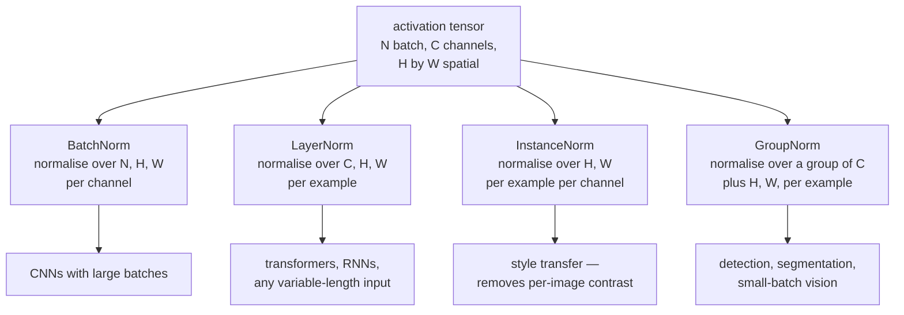
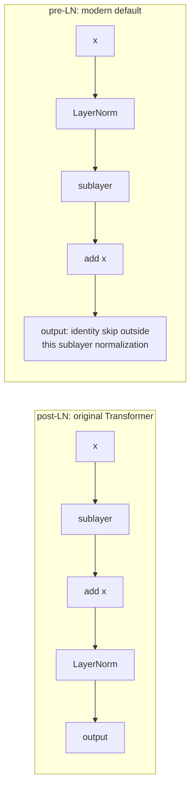

# Regularization and Normalization

Two families that are often confused because both improve training. They do
different jobs: **regularisation** controls the gap between training and test
performance; **normalisation** controls the conditioning of the optimisation
problem so that training is possible at all. Normalisation happens to
regularise a little, and regularisation happens to help optimisation a little,
but the primary purpose of each is distinct.

## Regularization

### Weight decay / L2

$$L' = L + \frac{\lambda}{2}\|\theta\|_2^2 \;\Longrightarrow\; \nabla L' = \nabla L + \lambda\theta$$

Shrinks weights toward zero. Under the Bayesian reading it is a Gaussian prior
with variance $1/\lambda$; under the constraint reading it shrinks the hypothesis
space. Typical values: $10^{-4}$ for CNNs with SGD, $0.01$–$0.1$ for AdamW on
transformers.

**Use AdamW, not Adam plus L2.** Adding $\lambda\theta$ to the gradient routes
the penalty through Adam's $\sqrt{\hat v}$ normalisation, so parameters with
large gradients are regularised *less* — the opposite of the intent. AdamW
applies the decay directly to the parameters.

**Exclude biases and normalisation parameters.** This is a common training policy, not proof that these parameters cannot overfit. A collection of biases can encode substantial capacity. The `ndim <= 1` shortcut misses multidimensional LayerNorm gains; module-aware grouping is more explicit.

### Dropout

During training, zero each activation independently with probability $p$ and
scale the survivors by $1/(1-p)$ — **inverted dropout**, so that inference needs
no change at all.

$$\tilde{h}_i = \frac{h_i \cdot m_i}{1-p}, \qquad m_i \sim \mathrm{Bernoulli}(1-p)$$

Two complementary explanations:

1. **Prevents co-adaptation.** A unit cannot rely on a specific partner being
   present, so features must be independently useful.
2. **Implicit ensemble.** Training samples from $2^n$ subnetworks with shared
   weights; inference approximates their average.

| Variant | Drops | For |
|---|---|---|
| Standard dropout | individual activations | fully connected layers |
| **Dropout2d / SpatialDropout** | whole channels | CNNs — adjacent pixels are correlated, so per-pixel dropout does little |
| DropPath / stochastic depth | whole residual branches | very deep ResNets, ViTs |
| DropConnect | individual weights | rarely used |
| Attention dropout | attention weights | transformers |
| Word/token dropout | whole tokens | NLP, robustness to missing input |
| AlphaDropout | preserves mean and variance | SELU networks |

Typical rates: 0.5 for large fully connected layers, 0.1–0.3 for transformers,
0.0–0.1 for CNNs with BatchNorm (which already regularises), and **0.0 in several large-LLM pretraining recipes**. This is an empirical compute/quality choice, not proof that large corpora eliminate overfitting, duplication or memorization.

**Dropout and BatchNorm interact badly.** Dropout changes the variance of
activations between training and inference; BatchNorm's running statistics are
estimated under the dropout-active distribution but used under the
dropout-inactive one. The resulting variance shift measurably hurts. Modern CNNs
mostly use BatchNorm without dropout, or put dropout only after the final pooling
layer.

`model.eval()` is what disables dropout. Forgetting it is a classic bug that
makes validation results noisy and worse than they should be.

### Early stopping

Monitor validation loss; stop when it stops improving; restore the best weights.

The runnable ablation below stores copied best weights in memory and restores them after selection. A production checkpoint additionally needs optimizer and training-state metadata when it is intended for resume.


It limits the optimization trajectory and can regularize fitting. For linear
least squares its spectral filtering resembles ridge, but there is generally
no single ridge coefficient exactly matching every direction; the derivation
below makes that distinction explicit. Validation selection also has statistical
cost even when evaluation is computationally inexpensive.

Choose `patience` from how noisy validation is, and note that early stopping
interacts with cosine schedules: stopping early means the learning rate never
decayed fully, so the model never settled. For a fixed-length cosine run, prefer
to let the schedule finish.

### Data augmentation

Augmentation injects assumptions about label-preserving variation. It does not create independent observations from nowhere: it trades a domain assumption for a useful training constraint, provided the assumed invariance is appropriate.

| Modality | Transformations |
|---|---|
| **Images** | flips, crops, rotation, colour jitter, RandAugment, TrivialAugment, Cutout/random erasing, mixup, CutMix |
| **Text** | back-translation, synonym replacement, EDA, token dropout, paraphrasing with an LLM |
| **Audio** | time/frequency masking (SpecAugment), speed perturbation, noise injection, room impulse responses |
| **Tabular** | SMOTE-style interpolation, Gaussian noise, feature dropout, mixup |
| **Time series** | window slicing, jittering, magnitude warping, time warping |
| **Graphs** | node/edge dropping, subgraph sampling, feature masking |

**Augmentation encodes domain knowledge.** A horizontally flipped cat is a cat,
so flip augmentation is valid for ImageNet. Digit shapes and medically meaningful laterality can change under reflection, so a flip must be judged against the actual labeling task rather than enabled by habit. **The augmentation must respect the true invariances of the
task**, and this is where most augmentation bugs live.

**Mixup** trains on convex combinations of examples and their labels:

$$\tilde{x} = \lambda x_i + (1-\lambda)x_j, \qquad \tilde{y} = \lambda y_i + (1-\lambda)y_j, \qquad \lambda \sim \mathrm{Beta}(\alpha,\alpha)$$

It encourages linear behaviour between training examples, improves calibration,
and increases robustness to label noise. **CutMix** pastes a rectangular patch
of one image into another with proportional label mixing, and preserves local structure, though its relative benefit depends on the dataset and training recipe.

### Label smoothing

$$y'_k = (1-\epsilon)y_k + \frac{\epsilon}{K}$$

The target now has non-zero entropy, so the minimum loss is no longer zero and
an optimum matching the targets no longer assigns probability one to the correct
class. At an ideal optimum it constrains relevant logit differences, not absolute
logits: adding one constant to every logit preserves all probabilities.
Calibration and accuracy improvements are empirical, not guaranteed; evaluate
them separately.

Typical $\epsilon = 0.1$. One real cost: it can hurt some knowledge-distillation settings,
because it erases the fine-grained inter-class information in the teacher's soft
targets that distillation depends on.

### The full regularisation menu

| Technique | Primary effect | Cost |
|---|---|---|
| Weight decay | shrinks weights | one hyperparameter |
| Dropout | prevents co-adaptation | slower convergence |
| Early stopping | limits effective capacity | free |
| Data augmentation | encodes invariances | domain knowledge required |
| Label smoothing | discourages extreme fitted probabilities | validate calibration and distillation effects; neither has a universal direction |
| Mixup / CutMix | linear interpolation behaviour | needs tuning |
| Noise injection | flattens minima | tuning |
| Stochastic depth | ensemble over depths | for very deep nets |
| Ensembling | variance reduction | $k\times$ inference cost |
| Reduced precision | incidental gradient noise | numerical care |
| Smaller model | less capacity | may underfit |
| **More data** | the real answer | expensive |

## Normalization

### The problem it solves

The original "internal covariate shift" story — that layers must constantly
adapt to shifting input distributions — has been substantially disputed. Alternative analyses emphasize reparameterization, scale invariance and smoother optimization under particular assumptions. No unconditional theorem says adding an arbitrary normalization layer reduces a whole network's Lipschitz constant or guarantees faster convergence.

Whatever the mechanism, the empirical effects are not in dispute: faster
convergence, higher usable learning rates, less sensitivity to initialisation,
and a mild regularising effect.

### Batch normalization

Normalise each feature across the **batch** dimension:

$$\hat{x}_i = \frac{x_i - \mu_B}{\sqrt{\sigma_B^2+\epsilon}}, \qquad y_i = \gamma\hat{x}_i + \beta$$

$\gamma$ and $\beta$ are learned, restoring flexible scale and shift after standardization. Fixed affine parameters cannot generally undo every input-dependent training-batch mean and variance. Inference with fixed running statistics is a different, fixed affine transformation.

**Train and inference differ.** During training, batch statistics are used and
running averages are updated. At inference, the running averages are used, so the
output for one example does not depend on the others in its batch.

| Problem | Detail |
|---|---|
| Small effective sample count | statistics can be noisy; spatial positions and their correlations also matter |
| Sequence models | pooling batch/time statistics requires careful masking and causality; not mathematically undefined |
| Distributed training | statistics are per-device unless SyncBatchNorm is used |
| Train/inference mismatch | a persistent source of subtle bugs |
| Online / batch-size-1 inference | must use running statistics |

### The normalization family



| Norm | Normalises over | Batch-size dependent | Used in |
|---|---|---|---|
| **BatchNorm** | batch, spatial (per channel) | **yes** | CNNs, large batches |
| **LayerNorm** | configured trailing `normalized_shape` axes | no | transformers, RNNs |
| **RMSNorm** | configured feature axes, without centering | no | many language models |
| InstanceNorm | spatial (per example, per channel) | no | style transfer |
| GroupNorm | groups of channels (per example) | no | small-batch vision |
| WeightNorm | reparameterises weights | no | some GANs, RL |
| SpectralNorm | constrains the largest singular value | no | GAN discriminators |

**RMSNorm** drops the mean subtraction:

$$y = \frac{x}{\sqrt{\frac{1}{d}\sum_i x_i^2 + \epsilon}}\odot\gamma$$

The usual RMSNorm has a gain and no learned shift. Omitting centering can reduce work, but exact speed depends on fusion and bandwidth; quality equivalence is model-dependent. RMSNorm and LayerNorm have different invariances and cannot generally be substituted in a trained checkpoint.

### Placement: pre-norm versus post-norm



**Pre-norm is the modern default** because it leaves a clean identity path from
the loss to every layer. Post-norm places a normalisation on that path, which
produces much larger gradients at the final layers early in training — which is
one motivation for careful warmup in post-norm recipes. Pre-norm can reduce sensitivity, but does not universally remove warmup or scaling requirements.

The trade: post-norm often reaches marginally better final quality when it
trains, and pre-norm can suffer from growing residual-stream magnitudes at very
large depth. Hybrid schemes (sandwich norm, DeepNorm, and a final norm before the
output head) address both.

### Residual connections

$$\mathbf{h}^{(\ell)} = \mathbf{h}^{(\ell-1)} + F(\mathbf{h}^{(\ell-1)})$$

The Jacobian is $I + \partial F/\partial\mathbf{h}$. **The identity term adds a direct gradient contribution**, often useful when the residual Jacobian is small. It can still cancel: $F(x)=-x$ gives $I+J_F=0$. Residual parameterization helps optimization without guaranteeing nonvanishing gradients.

Two further readings, both useful:

- **Learning a residual is easier.** If the optimal transformation is close to
  the identity, $F$ only has to learn the small difference. The
  degradation problem — deeper plain networks performing *worse* than shallower
  ones, on training error, not just test — is what motivated ResNets, and it is
  an optimisation failure rather than an overfitting one.
- **A residual network behaves like an ensemble** of paths of varying depth.
  Removing a single layer from a trained ResNet barely hurts, which is very
  unlike a plain network.

In transformers the residual stream is the central object: every attention and
FFN block **reads from and writes to** it additively, which is what makes
mechanistic interpretability of transformers tractable at all.

## Putting it together

| Architecture | Normalisation | Regularisation |
|---|---|---|
| CNN (vision, large batch) | BatchNorm | weight decay $10^{-4}$, augmentation, label smoothing, stochastic depth |
| CNN (detection, small batch) | GroupNorm | weight decay, augmentation |
| Transformer (NLP) | pre-RMSNorm | weight decay 0.1 excluding norms/biases, dropout 0.1, label smoothing |
| LLM pretraining | pre-RMSNorm | weight decay 0.1, **no dropout**, gradient clipping |
| LLM fine-tuning | inherited | dropout 0.05–0.1, low LR, early stopping, LoRA |
| RNN/LSTM | LayerNorm | dropout between layers (not within recurrence), gradient clipping |
| GAN generator | BatchNorm or none | — |
| GAN discriminator | SpectralNorm | — |
| Small MLP on tabular data | BatchNorm or none | strong weight decay, dropout 0.2–0.5, early stopping |

**Do not confuse a no-dropout recipe with an absence of memorization.** Corpora can contain duplicates, and a model can memorize after a single exposure. Whether dropout improves a large run is an empirical question involving data reuse, model size, optimization and compute budget. Preserve the inherited recipe when adapting a checkpoint unless a controlled comparison justifies changing it.

## Diagnosing

| Symptom | Likely cause | Fix |
|---|---|---|
| Train ≪ validation loss | overfitting | more augmentation, dropout, weight decay, more data |
| Both losses high | underfitting — possibly over-regularised | reduce regularisation, raise capacity |
| Validation loss below train | dropout active in train only | usually fine; confirm `eval()` |
| Unexpected train/eval gap | dropout, BatchNorm statistics, preprocessing or distribution shift | compare controlled deterministic passes and running statistics |
| Works at batch 64, fails at batch 4 | possibly noisy BatchNorm or changed optimization | isolate statistics from batch/LR changes; consider GroupNorm |
| Multi-GPU results differ from single | per-device BN statistics | SyncBatchNorm |
| Very deep network trains worse than shallow | degradation problem | residual connections |
| Loss unstable at high LR | insufficient normalisation | pre-norm, gradient clipping |
| Model is overconfident | calibration error or distribution shift | validate temperature scaling or regularization; inspect subgroup errors |

## Worked statistics and normalization axes

### Dropout preserves a conditional mean, not every prediction

For a fixed activation $h$ and mask $m\sim\operatorname{Bernoulli}(1-p)$,
inverted dropout gives $\tilde h=mh/(1-p)$. Therefore

$$E[\tilde h\mid h]=h,\qquad
\operatorname{Var}(\tilde h\mid h)=\frac{p}{1-p}h^2.$$

At $h=2,p=0.25$, retained values are $8/3$, the mean is two and variance is
$4/3$. Disabling dropout preserves the local conditional mean but does not
exactly average a nonlinear downstream network: generally
$E[f(\tilde h)]\ne f(E[\tilde h])$. The ensemble interpretation is useful
intuition, not an exact inference identity.

The variance increase explains one BatchNorm interaction. If dropout precedes
a normalization that records running statistics, those statistics can describe
a noisier training distribution than the deterministic inference distribution.
Placement matters; dropout elsewhere in the architecture is not automatically
incompatible with BatchNorm. Stochastic depth similarly changes a residual
branch's variance and must follow its intended train/eval scaling convention.

### Axes are part of the model

For an image tensor `(B,C,H,W)`, BatchNorm computes one mean/variance per channel
over `(B,H,W)`. InstanceNorm reduces `(H,W)` separately for each example/channel.
GroupNorm reduces channels within a group together with spatial positions,
separately per example. LayerNorm reduces exactly its configured trailing shape:
`LayerNorm((C,H,W))` and a channel-only norm after arranging channels last are
different operations.

For transformer activations `(B,T,D)`, `LayerNorm(D)` normalizes each token
over its $D$ features. It does not pool over batch or time, and therefore does
not mix future token statistics into a causal representation. A normalization
over `(T,D)` would instead mix positions and would need a different causal
analysis. Padded tokens can still have nonzero outputs after affine normalization;
mask them in the appropriate downstream computation and loss.

BatchNorm's effective sample count in a CNN is $BHW$, not merely $B$.
Correlated neighboring pixels provide less independent statistical information
than that raw count suggests. Gradient accumulation does not increase the batch
seen by one forward pass. SyncBatchNorm combines current per-device observations,
not all microbatches that will later contribute to one optimizer update.

### Training and inference are different functions

Take a two-observation, two-feature batch with rows $(1,3)$ and $(3,7)$.
Feature means are $(2,5)$ and biased batch variances are $(1,4)$. With unit gain,
zero bias and negligible epsilon, training normalization gives rows $(-1,-1)$
and $(1,1)$. The unbiased variances are $(2,8)$ because the sample count is two.

PyTorch uses biased variance in the training normalization and an unbiased
estimate for its running-variance update. With momentum $0.1$, initial running
mean zero and variance one, the new running values are $(0.2,0.5)$ and
$(1.1,1.7)$. Inference uses these running statistics rather than the current
batch, so its output need not match training output after one update. This
momentum is a running-stat update coefficient, not optimizer momentum.
See the [BatchNorm contract](https://docs.pytorch.org/docs/stable/generated/torch.nn.BatchNorm2d.html).

### Executable moment and axis checks

```python runnable
import torch
from torch import nn

torch.set_num_threads(1)
torch.manual_seed(61)
dtype = torch.float64
fixed = torch.full((100000,), 2.0, dtype=dtype)
dropout = nn.Dropout(p=0.25)
sampled = dropout(fixed)
assert abs(sampled.mean().item() - 2) < 0.02
assert abs(sampled.var(unbiased=False).item() - 4 / 3) < 0.03
dropout.eval()
torch.testing.assert_close(dropout(fixed), fixed)

batch = torch.tensor([[1., 3.], [3., 7.]], dtype=dtype)
bn = nn.BatchNorm1d(2, affine=False, momentum=0.1).double()
bn.train()
actual = bn(batch)
mean = batch.mean(dim=0)
variance = batch.var(dim=0, unbiased=False)
expected = (batch - mean) / torch.sqrt(variance + bn.eps)
torch.testing.assert_close(actual, expected)
torch.testing.assert_close(bn.running_mean, torch.tensor([0.2, 0.5], dtype=dtype))
torch.testing.assert_close(bn.running_var, torch.tensor([1.1, 1.7], dtype=dtype))
bn.eval()
evaluation = bn(batch)
torch.testing.assert_close(evaluation,
    (batch - bn.running_mean) / torch.sqrt(bn.running_var + bn.eps))
assert not torch.allclose(actual, evaluation)

tokens = torch.arange(1., 25., dtype=dtype).reshape(2, 3, 4)
ln = nn.LayerNorm(4, elementwise_affine=False).double()
normalized = ln(tokens)
torch.testing.assert_close(normalized.mean(-1), torch.zeros(2, 3, dtype=dtype), atol=1e-12, rtol=0)
rms = tokens / torch.sqrt(tokens.square().mean(-1, keepdim=True) + 1e-5)
assert torch.all(rms.mean(-1) > 0)
torch.testing.assert_close(rms.square().mean(-1), torch.ones(2, 3, dtype=dtype), atol=2e-6, rtol=0)

x = torch.randn(5, dtype=dtype, requires_grad=True)
(x + (-x)).sum().backward()
torch.testing.assert_close(x.grad, torch.zeros_like(x))
target = torch.tensor([[0.9, 0.05, 0.05]], dtype=dtype)
logits = target.log()
loss = -(target * logits.log_softmax(-1)).sum()
shifted_loss = -(target * (logits + 1000).log_softmax(-1)).sum()
torch.testing.assert_close(loss, shifted_loss)
print("Dropout moments, BN running statistics, LN/RMS axes and invariances passed.")
```

The last two assertions refute two tempting guarantees: a residual identity term
can cancel, and finite smoothed targets do not bound the common logit offset.
For a ten-class one-hot target smoothed with $\epsilon=0.1$, the correct-class
target is $0.91$ and each other target is $0.01$. At the ideal optimum, correct
versus incorrect logit differences equal $\log91\approx4.51$; adding any common
constant leaves those differences and probabilities unchanged.

## Experiment: select regularization without touching the test set

This small noisy-data comparison keeps initialization, splits and optimizer
budget controlled while varying dropout and decay. It chooses both the checkpoint
and configuration using validation loss, then evaluates only the winner on test
data. The purpose is the selection protocol, not a claim that one setting wins
for every dataset or seed.

```python runnable
import copy
import math
import numpy as np
import torch
from torch import nn
from sklearn.datasets import make_moons
from sklearn.model_selection import train_test_split
from sklearn.preprocessing import StandardScaler

torch.set_num_threads(1)
torch.manual_seed(62)
np.random.seed(62)
X, y = make_moons(n_samples=600, noise=0.25, random_state=62)
train_x, hold_x, train_y, hold_y = train_test_split(
    X, y, train_size=100, stratify=y, random_state=63)
val_x, test_x, val_y, test_y = train_test_split(
    hold_x, hold_y, train_size=100, stratify=hold_y, random_state=64)
scaler = StandardScaler().fit(train_x)
def convert(features, labels):
    return (torch.tensor(scaler.transform(features), dtype=torch.float32),
            torch.tensor(labels, dtype=torch.long))
xt, yt = convert(train_x, train_y)
xv, yv = convert(val_x, val_y)
xs, ys = convert(test_x, test_y)
trials = []
for dropout_rate, decay in ((0.0, 0.0), (0.2, 0.01), (0.4, 0.1)):
    torch.manual_seed(65)
    model = nn.Sequential(nn.Linear(2, 32), nn.ReLU(), nn.Dropout(dropout_rate),
                          nn.Linear(32, 32), nn.ReLU(), nn.Linear(32, 2))
    optimizer = torch.optim.AdamW(model.parameters(), lr=0.01, weight_decay=decay)
    best, best_epoch = float("inf"), -1
    state = copy.deepcopy(model.state_dict())
    for epoch in range(180):
        model.train()
        optimizer.zero_grad(set_to_none=True)
        loss = nn.functional.cross_entropy(model(xt), yt)
        assert torch.isfinite(loss)
        loss.backward()
        optimizer.step()
        model.eval()
        with torch.inference_mode():
            validation = nn.functional.cross_entropy(model(xv), yv).item()
        if validation < best:
            best, best_epoch = validation, epoch
            state = copy.deepcopy(model.state_dict())
    model.load_state_dict(state)
    model.eval()
    with torch.inference_mode():
        training = nn.functional.cross_entropy(model(xt), yt).item()
    trials.append((best, model, dropout_rate, decay))
    print("dropout/decay", dropout_rate, decay, "best epoch", best_epoch,
          "training/validation", training, best)
selected = min(trials, key=lambda item: item[0])
best, model, dropout_rate, decay = selected
with torch.inference_mode():
    test_loss = nn.functional.cross_entropy(model(xs), ys).item()
    test_accuracy = (model(xs).argmax(1) == ys).float().mean().item()
assert best < math.log(2)
assert test_accuracy > 0.8
print("Selected:", dropout_rate, decay, "test loss/accuracy:", test_loss, test_accuracy)
```

This comparison changes two regularizers together to survey recipes. For causal
attribution, vary one at a time or use a factorial design. Repeat seeds and
report variability before claiming a small advantage. The test set is not a
second validation set to repeatedly revisit after every experiment.

### Why early stopping resembles, but is not identical to, ridge

For least squares with $H=X^\top X$ and gradient descent initialized at zero,
the component along eigenvalue $\lambda_i>0$ accumulates a filter
$1-(1-\eta\lambda_i)^t$ relative to the unregularized solution. Ridge instead
uses $\lambda_i/(\lambda_i+\alpha)$. Both suppress small-curvature directions,
but generally no single $\alpha$ makes all directions equal for a fixed stopping
time. The analogy is spectral, not an identity for arbitrary neural training.

Early stopping also spends validation information. Very frequent selection among
many noisy checkpoints can overfit that validation set. Choose a meaningful
metric and patience, keep an untouched test set and consider uncertainty when
differences are small. It is computationally cheap, not statistically free.

Augmentation deserves the same discipline. A crop can remove the only labeled
object, a time warp can alter a medically relevant duration, and feature mixing
can create impossible category combinations. Specify whether a transform should
preserve a label, transform the label consistently or create a soft target.
Regularization encodes beliefs about plausible functions; inappropriate beliefs
can increase bias even when training curves look smoother.

### Freezing statistics and calibrating the final predictor

Setting a BatchNorm gain's `requires_grad=False` stops that parameter gradient;
it does not stop running-stat updates while the module remains in training mode.
Conversely, `eval()` selects stored statistics but does not itself disable
gradients through the affine parameters. Fine-tuning recipes sometimes keep a
backbone's BatchNorm in evaluation mode while training the classifier. State the
policy explicitly and reapply it after a broad `model.train()` call if needed.

Temperature scaling fits a positive scalar on held-out logits, using
$\operatorname{softmax}(z/T)$. For positive $T$ it preserves argmax decisions
while changing confidence, so accuracy can remain fixed while cross-entropy
improves. It is a post-training calibration procedure, not evidence that the
underlying representation became more robust. Fit the temperature on validation
or a separate calibration set, and evaluate calibration on data not used to fit it.

The same separation matters when comparing regularizers. Lower validation
cross-entropy can reflect improved calibration even if accuracy is unchanged.
Better accuracy can coexist with worse calibration. Pick metrics corresponding
to the intended decisions and report both when probability quality matters.

## Self-check

1. **Why inverted scaling?** Since $E[m]=1-p$, multiplying retained activations
   by $1/(1-p)$ preserves their conditional mean during training. Inference can
   then use the identity, although downstream nonlinear predictions are not
   exactly the ensemble average.
2. **What are two dropout interpretations?** It discourages reliance on a fixed
   set of partner features and trains many shared-weight subnetworks. Both are
   useful interpretations; neither guarantees an improvement on every dataset.
3. **Why can dropout before BatchNorm hurt?** Dropout increases variance while
   running statistics are collected. Turning it off changes the distribution.
   The effect depends on placement, rate and how statistics are estimated.
4. **What changes at BatchNorm inference?** Current-batch statistics are replaced
   by stored running statistics in the usual configuration. Forgetting `eval()`
   can make predictions depend on other inference examples and update buffers.
5. **Why can pre-norm help?** A block $x+F(\operatorname{LN}(x))$ retains an
   additive identity derivative outside normalization. Post-norm also transports
   through the final norm's Jacobian. These different products affect stability,
   but neither placement gives a universal quality or convergence guarantee.
6. **Does $I+J_F$ prevent vanishing?** Not always: $J_F=-I$ cancels it. Small
   residual Jacobians make individual blocks near identity, which is a useful
   sufficient local intuition, not a guarantee over arbitrary depth.
7. **Why do dropout recipes differ by regime?** Data reuse, model size, pretrained
   initialization and compute budget change the tradeoff. A single-epoch corpus
   can still contain duplicates and support memorization; no-dropout recipes
   do not prove regularization is unnecessary.
8. **Which axes does `LayerNorm(D)` use on `(B,T,D)`?** Only the last feature
   axis for every token separately. It neither combines batch examples nor
   normalizes over time, unlike `LayerNorm((T,D))`.
9. **Does label smoothing bound logits?** It gives finite optimal probability
   ratios, hence finite relevant logit differences in the ideal case. A common
   additive offset remains unconstrained because softmax is shift-invariant.
10. **Why not select the recipe with best test accuracy?** Repeated selection
    consumes test information and biases the reported result. Choose using
    validation; reserve test for the selected procedure's final assessment.

## Where to go next

- [Optimization & Training](./optimization-and-training.md) — the schedules these
  layers make possible.
- [CNNs](./cnns.md) — where BatchNorm and residual blocks came from.
- [Attention & Transformers](./attention-and-transformers.md) — pre-norm,
  RMSNorm, and the residual stream.

Primary references: [Dropout](https://jmlr.org/papers/v15/srivastava14a.html),
[BatchNorm](https://arxiv.org/abs/1502.03167),
[LayerNorm](https://arxiv.org/abs/1607.06450),
[GroupNorm](https://arxiv.org/abs/1803.08494),
[RMSNorm](https://arxiv.org/abs/1910.07467), and
[mixup](https://arxiv.org/abs/1710.09412).
For evaluation discipline, see [model evaluation](../ml/model-evaluation.md) and
[generalization](../ml/bias-variance-and-generalization.md).
