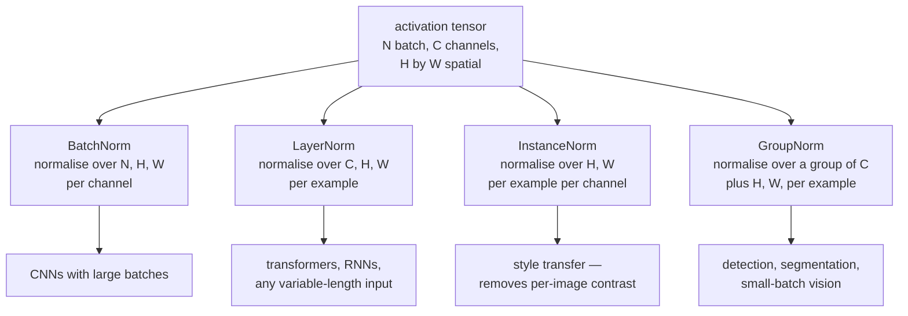
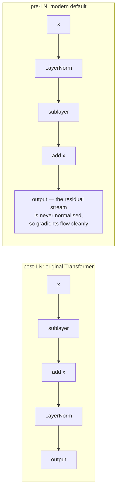

# Regularization and Normalization

Two families that are often confused because both improve training. They do
different jobs: **regularisation** controls the gap between training and test
performance; **normalisation** controls the conditioning of the optimisation
problem so that training is possible at all. Normalisation happens to
regularise a little, and regularisation happens to help optimisation a little,
but the primary purpose of each is distinct.

## Regularization

### Weight decay / L2

$$L' = L + \frac{\lambda}{2}\|\theta\|_2^2 \;\Longrightarrow\; \nabla L' = \nabla L + \lambda\theta$$

Shrinks weights toward zero. Under the Bayesian reading it is a Gaussian prior
with variance $1/\lambda$; under the constraint reading it shrinks the hypothesis
space. Typical values: $10^{-4}$ for CNNs with SGD, $0.01$–$0.1$ for AdamW on
transformers.

**Use AdamW, not Adam plus L2.** Adding $\lambda\theta$ to the gradient routes
the penalty through Adam's $\sqrt{\hat v}$ normalisation, so parameters with
large gradients are regularised *less* — the opposite of the intent. AdamW
applies the decay directly to the parameters.

**Exclude biases and normalisation parameters.** A bias has one degree of
freedom and does not overfit; a LayerNorm gain decayed toward zero destroys the
layer's scale. The standard idiom is to exclude every parameter with
`ndim <= 1`.

### Dropout

During training, zero each activation independently with probability $p$ and
scale the survivors by $1/(1-p)$ — **inverted dropout**, so that inference needs
no change at all.

$$\tilde{h}_i = \frac{h_i \cdot m_i}{1-p}, \qquad m_i \sim \mathrm{Bernoulli}(1-p)$$

Two complementary explanations:

1. **Prevents co-adaptation.** A unit cannot rely on a specific partner being
   present, so features must be independently useful.
2. **Implicit ensemble.** Training samples from $2^n$ subnetworks with shared
   weights; inference approximates their average.

| Variant | Drops | For |
|---|---|---|
| Standard dropout | individual activations | fully connected layers |
| **Dropout2d / SpatialDropout** | whole channels | CNNs — adjacent pixels are correlated, so per-pixel dropout does little |
| DropPath / stochastic depth | whole residual branches | very deep ResNets, ViTs |
| DropConnect | individual weights | rarely used |
| Attention dropout | attention weights | transformers |
| Word/token dropout | whole tokens | NLP, robustness to missing input |
| AlphaDropout | preserves mean and variance | SELU networks |

Typical rates: 0.5 for large fully connected layers, 0.1–0.3 for transformers,
0.0–0.1 for CNNs with BatchNorm (which already regularises), and **0.0 for large
LLM pretraining** — with a corpus far larger than the model, there is nothing to
overfit and dropout only adds noise.

**Dropout and BatchNorm interact badly.** Dropout changes the variance of
activations between training and inference; BatchNorm's running statistics are
estimated under the dropout-active distribution but used under the
dropout-inactive one. The resulting variance shift measurably hurts. Modern CNNs
mostly use BatchNorm without dropout, or put dropout only after the final pooling
layer.

`model.eval()` is what disables dropout. Forgetting it is a classic bug that
makes validation results noisy and worse than they should be.

### Early stopping

Monitor validation loss; stop when it stops improving; restore the best weights.

```python
if val_loss < best - min_delta:
    best, wait = val_loss, 0
    torch.save(model.state_dict(), "best.pt")
else:
    wait += 1
    if wait >= patience:
        model.load_state_dict(torch.load("best.pt")); break
```

It is a genuine regulariser: it limits how far parameters travel from their
initialisation, and for linear models early stopping is approximately equivalent
to ridge regression with a specific $\lambda$. It is also free — you were going
to evaluate anyway.

Choose `patience` from how noisy validation is, and note that early stopping
interacts with cosine schedules: stopping early means the learning rate never
decayed fully, so the model never settled. For a fixed-length cosine run, prefer
to let the schedule finish.

### Data augmentation

The strongest regulariser available, because it adds real information rather than
just constraining the model — provided the invariance you assert is true.

| Modality | Transformations |
|---|---|
| **Images** | flips, crops, rotation, colour jitter, RandAugment, TrivialAugment, Cutout/random erasing, mixup, CutMix |
| **Text** | back-translation, synonym replacement, EDA, token dropout, paraphrasing with an LLM |
| **Audio** | time/frequency masking (SpecAugment), speed perturbation, noise injection, room impulse responses |
| **Tabular** | SMOTE-style interpolation, Gaussian noise, feature dropout, mixup |
| **Time series** | window slicing, jittering, magnitude warping, time warping |
| **Graphs** | node/edge dropping, subgraph sampling, feature masking |

**Augmentation encodes domain knowledge.** A horizontally flipped cat is a cat,
so flip augmentation is valid for ImageNet. A horizontally flipped "6" is not a
"6", so it is invalid for digit recognition. A flipped chest X-ray is
anatomically wrong. **The augmentation must respect the true invariances of the
task**, and this is where most augmentation bugs live.

**Mixup** trains on convex combinations of examples and their labels:

$$\tilde{x} = \lambda x_i + (1-\lambda)x_j, \qquad \tilde{y} = \lambda y_i + (1-\lambda)y_j, \qquad \lambda \sim \mathrm{Beta}(\alpha,\alpha)$$

It encourages linear behaviour between training examples, improves calibration,
and increases robustness to label noise. **CutMix** pastes a rectangular patch
of one image into another with proportional label mixing, and generally works
better for classification because it preserves local structure.

### Label smoothing

$$y'_k = (1-\epsilon)y_k + \frac{\epsilon}{K}$$

The target now has non-zero entropy, so the minimum loss is no longer zero and
the model cannot drive the correct logit to infinity. Effects: bounded logit
magnitudes, **substantially better calibration**, tighter class clusters in the
penultimate layer, and a small accuracy gain on large-scale classification.

Typical $\epsilon = 0.1$. One real cost: it **hurts knowledge distillation**,
because it erases the fine-grained inter-class information in the teacher's soft
targets that distillation depends on.

### The full regularisation menu

| Technique | Primary effect | Cost |
|---|---|---|
| Weight decay | shrinks weights | one hyperparameter |
| Dropout | prevents co-adaptation | slower convergence |
| Early stopping | limits effective capacity | free |
| Data augmentation | encodes invariances | domain knowledge required |
| Label smoothing | caps confidence, calibrates | hurts distillation |
| Mixup / CutMix | linear interpolation behaviour | needs tuning |
| Noise injection | flattens minima | tuning |
| Stochastic depth | ensemble over depths | for very deep nets |
| Ensembling | variance reduction | $k\times$ inference cost |
| Reduced precision | incidental gradient noise | numerical care |
| Smaller model | less capacity | may underfit |
| **More data** | the real answer | expensive |

## Normalization

### The problem it solves

The original "internal covariate shift" story — that layers must constantly
adapt to shifting input distributions — has been substantially disputed. The
better-supported explanation is that normalisation **smooths the loss
landscape**: it reduces the Lipschitz constant of the loss and its gradient,
which permits larger learning rates and makes optimisation less sensitive to
initialisation.

Whatever the mechanism, the empirical effects are not in dispute: faster
convergence, higher usable learning rates, less sensitivity to initialisation,
and a mild regularising effect.

### Batch normalization

Normalise each feature across the **batch** dimension:

$$\hat{x}_i = \frac{x_i - \mu_B}{\sqrt{\sigma_B^2+\epsilon}}, \qquad y_i = \gamma\hat{x}_i + \beta$$

$\gamma$ and $\beta$ are learned, so the network can undo the normalisation if
that is optimal — normalisation constrains the optimisation path, not the
function class.

**Train and inference differ.** During training, batch statistics are used and
running averages are updated. At inference, the running averages are used, so the
output for one example does not depend on the others in its batch.

| Problem | Detail |
|---|---|
| Small batches | statistics are noisy; performance degrades sharply below ~8 |
| Sequence models | length varies; statistics across the batch are ill-defined |
| Distributed training | statistics are per-device unless SyncBatchNorm is used |
| Train/inference mismatch | a persistent source of subtle bugs |
| Online / batch-size-1 inference | must use running statistics |

### The normalization family



| Norm | Normalises over | Batch-size dependent | Used in |
|---|---|---|---|
| **BatchNorm** | batch, spatial (per channel) | **yes** | CNNs, large batches |
| **LayerNorm** | all features (per example) | no | transformers, RNNs |
| **RMSNorm** | as LayerNorm, no mean subtraction | no | Llama-family, modern LLMs |
| InstanceNorm | spatial (per example, per channel) | no | style transfer |
| GroupNorm | groups of channels (per example) | no | small-batch vision |
| WeightNorm | reparameterises weights | no | some GANs, RL |
| SpectralNorm | constrains the largest singular value | no | GAN discriminators |

**RMSNorm** drops the mean subtraction:

$$y = \frac{x}{\sqrt{\frac{1}{d}\sum_i x_i^2 + \epsilon}}\odot\gamma$$

It is cheaper (no mean, no shift parameter) and works essentially as well, which
is why Llama, Mistral, Gemma and most recent LLMs use it. That re-centring turns
out not to be the part that mattered.

### Placement: pre-norm versus post-norm



**Pre-norm is the modern default** because it leaves a clean identity path from
the loss to every layer. Post-norm places a normalisation on that path, which
produces much larger gradients at the final layers early in training — which is
precisely why the original Transformer needed careful warmup and why pre-norm
trains stably without it.

The trade: post-norm often reaches marginally better final quality when it
trains, and pre-norm can suffer from growing residual-stream magnitudes at very
large depth. Hybrid schemes (sandwich norm, DeepNorm, and a final norm before the
output head) address both.

### Residual connections

$$\mathbf{h}^{(\ell)} = \mathbf{h}^{(\ell-1)} + F(\mathbf{h}^{(\ell-1)})$$

The Jacobian is $I + \partial F/\partial\mathbf{h}$. **The identity term gives
the gradient a path multiplied by 1 at every layer**, so it cannot vanish through
depth. That is the entire mechanism, and it is why 100+ layer networks became
trainable.

Two further readings, both useful:

- **Learning a residual is easier.** If the optimal transformation is close to
  the identity, $F$ only has to learn the small difference. The
  degradation problem — deeper plain networks performing *worse* than shallower
  ones, on training error, not just test — is what motivated ResNets, and it is
  an optimisation failure rather than an overfitting one.
- **A residual network behaves like an ensemble** of paths of varying depth.
  Removing a single layer from a trained ResNet barely hurts, which is very
  unlike a plain network.

In transformers the residual stream is the central object: every attention and
FFN block **reads from and writes to** it additively, which is what makes
mechanistic interpretability of transformers tractable at all.

## Putting it together

| Architecture | Normalisation | Regularisation |
|---|---|---|
| CNN (vision, large batch) | BatchNorm | weight decay $10^{-4}$, augmentation, label smoothing, stochastic depth |
| CNN (detection, small batch) | GroupNorm | weight decay, augmentation |
| Transformer (NLP) | pre-RMSNorm | weight decay 0.1 excluding norms/biases, dropout 0.1, label smoothing |
| LLM pretraining | pre-RMSNorm | weight decay 0.1, **no dropout**, gradient clipping |
| LLM fine-tuning | inherited | dropout 0.05–0.1, low LR, early stopping, LoRA |
| RNN/LSTM | LayerNorm | dropout between layers (not within recurrence), gradient clipping |
| GAN generator | BatchNorm or none | — |
| GAN discriminator | SpectralNorm | — |
| Small MLP on tabular data | BatchNorm or none | strong weight decay, dropout 0.2–0.5, early stopping |

**Note the "no dropout" for LLM pretraining.** With a corpus of trillions of
tokens and a single epoch, the model never sees an example twice — there is
nothing to memorise, and dropout only adds gradient noise. Regularisation
assumptions built for the small-data regime do not transfer to the
large-data one.

## Diagnosing

| Symptom | Likely cause | Fix |
|---|---|---|
| Train ≪ validation loss | overfitting | more augmentation, dropout, weight decay, more data |
| Both losses high | underfitting — possibly over-regularised | reduce regularisation, raise capacity |
| Validation loss below train | dropout active in train only | usually fine; confirm `eval()` |
| Results differ between train and eval mode | BatchNorm running statistics are wrong | check momentum; ensure enough warm-up batches |
| Works at batch 64, fails at batch 4 | BatchNorm with too-small batches | GroupNorm or LayerNorm |
| Multi-GPU results differ from single | per-device BN statistics | SyncBatchNorm |
| Very deep network trains worse than shallow | degradation problem | residual connections |
| Loss unstable at high LR | insufficient normalisation | pre-norm, gradient clipping |
| Model is overconfident | no label smoothing; miscalibrated | label smoothing, temperature scaling |

## Self-check

1. Why does inverted dropout scale by $1/(1-p)$ during training rather than at
   inference?
2. Give two independent explanations for why dropout works.
3. Why do BatchNorm and dropout interact badly?
4. What does BatchNorm compute differently at inference, and what breaks if you
   get it wrong?
5. Why is pre-norm more stable than post-norm? Answer in terms of the gradient
   path.
6. Write the Jacobian of a residual block and explain why it prevents vanishing
   gradients.
7. Why is dropout usually zero for LLM pretraining but not for fine-tuning?

## Where to go next

- [Optimization & Training](./optimization-and-training.md) — the schedules these
  layers make possible.
- [CNNs](./cnns.md) — where BatchNorm and residual blocks came from.
- [Attention & Transformers](./attention-and-transformers.md) — pre-norm,
  RMSNorm, and the residual stream.
