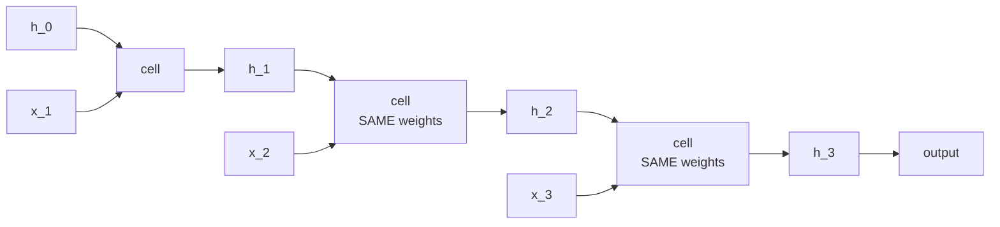
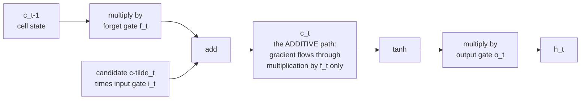
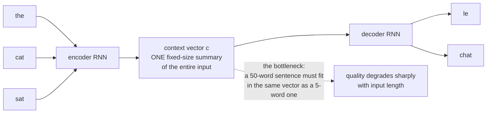

# RNNs and Sequence Models

Recurrent networks were the standard for sequences for roughly twenty-five years
and were displaced by transformers in about three. They remain worth
understanding for three reasons: the problems they were designed to solve are
still the problems; the gating mechanisms reappear in modern state-space models;
and the specific failure that killed them is what motivated attention.

## The recurrent idea

Process a sequence one element at a time, carrying a hidden state:

$$\mathbf{h}_t = \phi\bigl(W_{hh}\mathbf{h}_{t-1} + W_{xh}\mathbf{x}_t + \mathbf{b}\bigr), \qquad \mathbf{y}_t = W_{hy}\mathbf{h}_t$$



Two properties follow directly:

- **Weight sharing across time.** The same $W_{hh}$ applies at every step, so the
  model handles arbitrary-length sequences with a fixed parameter count.
- **The hidden state is a fixed-size summary** of everything seen so far. That is
  both the appeal and the fatal limitation.

### Sequence-to-what

| Pattern | Example |
|---|---|
| one-to-many | image captioning |
| many-to-one | sentiment classification |
| many-to-many, aligned | POS tagging, frame-level labelling |
| many-to-many, unaligned | translation, summarisation (encoder–decoder) |

## Backpropagation through time

Unroll the network across $T$ steps and apply ordinary backpropagation. Because
$W_{hh}$ is used at every step, its gradient is a **sum over all timesteps** —
the adjoint rule's summation over consumers, applied $T$ times.

$$\frac{\partial L}{\partial W_{hh}} = \sum_{t=1}^{T}\frac{\partial L_t}{\partial W_{hh}}, \qquad \frac{\partial\mathbf{h}_t}{\partial\mathbf{h}_k} = \prod_{i=k+1}^{t}\frac{\partial\mathbf{h}_i}{\partial\mathbf{h}_{i-1}} = \prod_{i=k+1}^{t}W_{hh}^\top\,\mathrm{diag}\bigl(\phi'(\cdot)\bigr)$$

**That product is the problem.** Over $t-k$ steps it is essentially $W_{hh}$
raised to a power, which is governed by the largest eigenvalue $\lambda_{\max}$
of $W_{hh}$:

| Condition | Behaviour |
|---|---|
| $\lambda_{\max} < 1$ | gradients **vanish** exponentially; long dependencies cannot be learned |
| $\lambda_{\max} > 1$ | gradients **explode**; loss becomes `NaN` |
| $\lambda_{\max} = 1$ | knife-edge; unstable in practice |

Concretely: with $\lambda_{\max} = 0.9$ and a 100-step dependency, the gradient
is scaled by $0.9^{100} \approx 3\times10^{-5}$. The network cannot connect a
word at position 1 to a word at position 100.

**Truncated BPTT** limits the backward pass to $k$ steps to bound memory and
compute — which also bounds the dependency length the model can learn, so it is a
partial mitigation and a partial concession.

**Gradient clipping** solves exploding gradients cleanly (rescale the gradient
vector when its norm exceeds a threshold) and does nothing for vanishing ones.
Vanishing needs an architectural change.

## LSTM

The long short-term memory cell adds a **cell state** $\mathbf{c}_t$ that is
updated **additively**, plus three gates controlling what enters, leaves, and is
read from it.

$$\mathbf{f}_t = \sigma(W_f[\mathbf{h}_{t-1},\mathbf{x}_t]+\mathbf{b}_f) \qquad\text{forget gate}$$
$$\mathbf{i}_t = \sigma(W_i[\mathbf{h}_{t-1},\mathbf{x}_t]+\mathbf{b}_i) \qquad\text{input gate}$$
$$\tilde{\mathbf{c}}_t = \tanh(W_c[\mathbf{h}_{t-1},\mathbf{x}_t]+\mathbf{b}_c) \qquad\text{candidate}$$
$$\mathbf{c}_t = \mathbf{f}_t\odot\mathbf{c}_{t-1} + \mathbf{i}_t\odot\tilde{\mathbf{c}}_t \qquad\text{cell update}$$
$$\mathbf{o}_t = \sigma(W_o[\mathbf{h}_{t-1},\mathbf{x}_t]+\mathbf{b}_o) \qquad\text{output gate}$$
$$\mathbf{h}_t = \mathbf{o}_t\odot\tanh(\mathbf{c}_t) \qquad\text{hidden state}$$



**Why this fixes vanishing gradients.** The cell-state gradient is

$$\frac{\partial\mathbf{c}_t}{\partial\mathbf{c}_{t-1}} = \mathbf{f}_t$$

There is no weight matrix and no activation derivative in that path. If the
forget gate stays near 1, the gradient is multiplied by ~1 at each step and
propagates essentially unchanged. This is the same trick as a residual connection
— an additive, near-identity path through depth — arrived at eight years earlier
for time rather than depth.

**Initialise the forget-gate bias to 1.** With $\sigma(0) = 0.5$, a
zero-initialised forget gate halves the cell state at every step, which is a
vanishing gradient by construction. Starting at $\mathbf{b}_f = 1$ gives
$\sigma(1) \approx 0.73$ and a "remember by default" prior. This is a small
change with a measurable effect on learning long dependencies.

Read the gates as a memory controller: **forget** decides what to erase,
**input** decides what to write, **output** decides what to expose. `c` is
long-term storage, `h` is the working register.

## GRU

A simplification with two gates and no separate cell state:

$$\mathbf{z}_t = \sigma(W_z[\mathbf{h}_{t-1},\mathbf{x}_t]) \qquad\text{update gate}$$
$$\mathbf{r}_t = \sigma(W_r[\mathbf{h}_{t-1},\mathbf{x}_t]) \qquad\text{reset gate}$$
$$\tilde{\mathbf{h}}_t = \tanh(W[\mathbf{r}_t\odot\mathbf{h}_{t-1},\mathbf{x}_t])$$
$$\mathbf{h}_t = (1-\mathbf{z}_t)\odot\mathbf{h}_{t-1} + \mathbf{z}_t\odot\tilde{\mathbf{h}}_t$$

The update gate **couples** forgetting and inputting — what you keep is exactly
what you do not overwrite — which is where the parameter saving comes from.

| | LSTM | GRU |
|---|---|---|
| Gates | 3 | 2 |
| Separate cell state | yes | no |
| Parameters | $4(d_h(d_h+d_x)+d_h)$ | $3(d_h(d_h+d_x)+d_h)$ |
| Speed | slower | ~25% faster |
| Performance | comparable | comparable |
| Very long dependencies | slight edge | — |
| Small data | — | slight edge (fewer parameters) |

The honest summary from the systematic comparisons: **they perform about the
same**, and the choice matters far less than the amount of data and the tuning.
GRU is the reasonable default for its speed.

## Architectural variants

| Variant | Idea | Use |
|---|---|---|
| **Bidirectional** | run forward and backward, concatenate | when the full sequence is available — tagging, classification. **Never** for autoregressive generation |
| **Stacked / deep** | feed one layer's outputs to the next | 2–4 layers typical; more rarely helps |
| Residual RNN | skip connections between layers | deeper stacks |
| Layer-normalised RNN | LayerNorm inside the cell | stabilises training |
| Peephole LSTM | gates also see the cell state | marginal |
| Attention-augmented | attend over encoder states | the step that led to transformers |

**Dropout placement in RNNs is a specific gotcha.** Applying independent dropout
at every timestep to the recurrent connection destroys the memory. The correct
form (variational/locked dropout) uses the **same mask at every timestep**, or
applies dropout only between layers rather than within the recurrence.
PyTorch's `nn.LSTM(dropout=...)` applies it between layers only.

## Sequence-to-sequence and the bottleneck

The encoder–decoder architecture: encode the input into a fixed-size vector,
decode the output from it.



**The bottleneck is the whole story.** Everything the decoder knows about the
input must pass through one vector. Empirically, translation quality falls off
sharply beyond ~20 tokens.

**Attention was the fix.** Instead of one context vector, let the decoder compute
a *different* weighted combination of encoder states at every output step:

$$e_{tj} = a(\mathbf{s}_{t-1}, \mathbf{h}_j), \qquad \alpha_{tj} = \mathrm{softmax}_j(e_{tj}), \qquad \mathbf{c}_t = \sum_j \alpha_{tj}\mathbf{h}_j$$

Bahdanau's 2014 additive attention and Luong's 2015 multiplicative variant both
did this, and the effect on long sentences was dramatic. The attention weights
also turned out to align roughly with word correspondences, giving a free
interpretability signal.

Then in 2017 the obvious question was asked: if attention does the work, is the
recurrence needed at all? **"Attention Is All You Need"** answered no, and the
architecture that removed the RNN entirely is what runs everything today.

## Why transformers won

| Property | RNN | Transformer |
|---|---|---|
| **Training parallelism** | none — step $t$ needs step $t-1$ | full — all positions at once |
| Path length between positions | $O(n)$ | $O(1)$ |
| Computation per layer | $O(n\,d^2)$ | $O(n^2 d + n d^2)$ |
| Memory during training | $O(n\,d)$ | $O(n^2)$ naively, $O(n)$ with FlashAttention |
| Inference per token | $O(d^2)$, constant state | $O(n d)$, growing KV cache |
| Long-range dependencies | difficult even with gating | direct |
| Hardware fit | poor (sequential) | excellent (matmul) |

**Parallelism is the decisive one.** An RNN's sequential dependency means a
1,000-token sequence needs 1,000 sequential steps, and GPUs cannot exploit that.
A transformer processes all positions simultaneously as matrix multiplications.
That difference is what made scaling to hundreds of billions of parameters
economically possible — not any representational superiority.

Note the interesting reversal at inference: an RNN's constant-size state makes
generation $O(1)$ per token in memory, while a transformer's KV cache grows
linearly with context. That asymmetry is exactly what modern state-space models
are trying to exploit.

## Where RNNs still make sense

| Situation | Why |
|---|---|
| Very long sequences with a strict memory budget | constant state, linear time |
| Streaming / online inference with no lookahead | naturally incremental |
| Small data | fewer parameters, stronger inductive bias |
| Embedded and edge devices | small footprint, no KV cache |
| Simple time-series forecasting | often beaten by boosted trees on lags anyway |
| Speech recognition (some deployed systems) | RNN-T remains competitive for streaming ASR |

## Modern successors

The interesting development is that **linear-time sequence models are back**.

| Model | Idea |
|---|---|
| **TCN** | dilated causal convolutions; parallel training, fixed receptive field |
| **S4 / S5** | structured state-space models with a principled long-range parameterisation |
| **Mamba / Mamba-2** | selective state spaces: the state transition depends on the input, giving content-based reasoning at linear cost |
| **RWKV** | a linear-attention formulation trainable in parallel, runnable as an RNN |
| **RetNet** | retention: parallel training, recurrent inference |
| **Hybrid** (Jamba, Zamba, Samba) | mostly SSM layers with a few attention layers interleaved |

The shared goal is the transformer's parallel training with the RNN's
constant-memory inference. Mamba's selectivity — making the state transition
input-dependent, so the model can choose what to remember — was the key step that
made SSMs competitive on language, because the earlier time-invariant versions
could not perform content-based retrieval.

Hybrids are currently the pragmatic answer: a handful of attention layers for
exact retrieval, SSM layers for everything else, giving most of the quality at a
fraction of the KV-cache cost.

## CTC: sequence labelling without alignment

For speech and handwriting, you have an input of length $T$ and a label sequence
of length $U \ll T$, with no alignment between them. **Connectionist temporal
classification** solves this by introducing a blank symbol and summing the
probability over *all* alignments that collapse to the target:

$$p(\mathbf{y}\mid\mathbf{x}) = \sum_{\pi \in \mathcal{B}^{-1}(\mathbf{y})} \prod_{t=1}^{T} p(\pi_t\mid\mathbf{x})$$

The sum has exponentially many terms and is computed in $O(TU)$ by a
forward–backward dynamic program, which is what makes the loss differentiable and
tractable. The collapse rule removes repeats and then blanks, so blanks are what
allow genuine repeated characters ("ll" in "hello").

CTC assumes conditional independence between output steps given the input, which
is why CTC systems are usually paired with an external language model at decoding
time. RNN-Transducer removes that assumption by adding a prediction network, and
is the standard for streaming ASR.

## Practical notes

```python
lstm = nn.LSTM(input_size=300, hidden_size=512, num_layers=2,
               batch_first=True, bidirectional=True, dropout=0.2)

packed = nn.utils.rnn.pack_padded_sequence(x, lengths.cpu(),
                                           batch_first=True, enforce_sorted=False)
out, (h, c) = lstm(packed)
out, _ = nn.utils.rnn.pad_packed_sequence(out, batch_first=True)
```

| Issue | Handling |
|---|---|
| Variable-length sequences | `pack_padded_sequence` — the RNN skips padding rather than processing it |
| Exploding gradients | `clip_grad_norm_(params, 1.0)` — essentially mandatory |
| Long sequences | truncated BPTT, or a different architecture |
| Slow training | cuDNN fused kernels (use `nn.LSTM`, not a hand-written loop) |
| Bidirectional output | shape is `(B, T, 2*hidden)`; the two directions are concatenated |
| Extracting the final state | with padding, the last *valid* step, not `out[:, -1]` |
| Stateful across batches | `.detach()` the hidden state between batches or the graph grows without bound |

That "last valid step" issue is a real and common bug: with right-padded
sequences, `out[:, -1]` is the output at a padding position for every sequence
shorter than the longest.

## Self-check

1. Write the gradient of $\mathbf{h}_t$ with respect to $\mathbf{h}_k$ and
   explain the vanishing/exploding condition in terms of $\lambda_{\max}$.
2. Which path in an LSTM prevents vanishing gradients, and what is its
   derivative?
3. Why initialise the forget-gate bias to 1?
4. What is the seq2seq bottleneck, and how did attention remove it?
5. Give the single most important reason transformers replaced RNNs.
6. Why is standard per-timestep dropout wrong inside a recurrence?
7. What problem does CTC solve, and what makes its loss tractable?

## Where to go next

- [Attention & Transformers](./attention-and-transformers.md) — what came next.
- [Backpropagation & Autodiff](./backpropagation-and-autodiff.md) — the gradient
  analysis behind BPTT.
- [Transformers Deep Dive](/courses/transformers/) — the full course.
