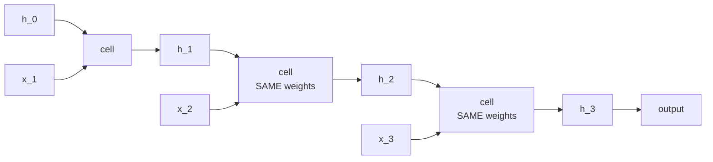
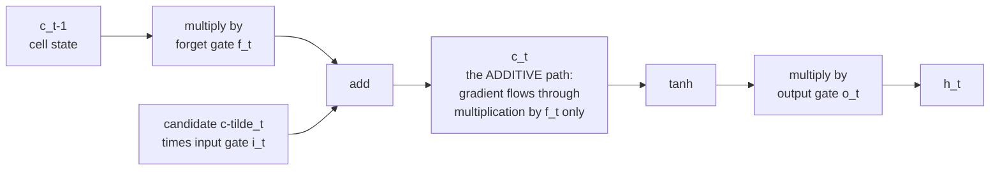
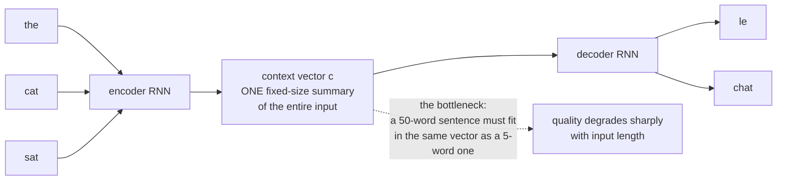

# RNNs and Sequence Models

Recurrent networks trade direct access to the past for a state that can be updated
incrementally. This is valuable for streaming, control, speech and constrained
devices, even though attention dominates large language-model training. The useful
question is not which architecture won history, but which information must survive,
how gradients teach the state to preserve it, and what the deployment can afford.

Use column vectors for single states: input dimension $d_x$, hidden dimension
$d_h$, and sequence length $T$. Library batches use `(B,T,D)` below. Read
[matrix derivatives](../math/calculus.md) and
[autodiff](./backpropagation-and-autodiff.md) if Jacobian products are unfamiliar.

## The recurrent idea

Process a sequence one element at a time, carrying a hidden state:

$$\mathbf{h}_t = \phi\bigl(W_{hh}\mathbf{h}_{t-1} + W_{xh}\mathbf{x}_t + \mathbf{b}\bigr), \qquad \mathbf{y}_t = W_{hy}\mathbf{h}_t$$



Two properties follow directly:

- **Weight sharing across time.** The same $W_{hh}$ applies at every step, so the
  model handles arbitrary-length sequences with a fixed parameter count.
- **The hidden state is a fixed-size summary** of everything seen so far. That is
  both the memory advantage and a potential information bottleneck.

### Sequence-to-what

| Pattern | Example |
|---|---|
| one-to-many | image captioning |
| many-to-one | sentiment classification |
| many-to-many, aligned | POS tagging, frame-level labelling |
| many-to-many, unaligned | translation, summarisation (encoder–decoder) |

## Backpropagation through time

Unroll the network across $T$ steps and apply ordinary backpropagation. Because
$W_{hh}$ is used at every step, its gradient is a **sum over all timesteps** —
the adjoint rule's summation over consumers, applied $T$ times.

Let $a_t=W_{hh}h_{t-1}+W_{xh}x_t+b$ and
$D_t=\operatorname{diag}(\phi'(a_t))$. The local forward Jacobian is
$J_t=D_tW_{hh}$, so the ordered forward product is

$$\frac{\partial h_t}{\partial h_k}=J_tJ_{t-1}\cdots J_{k+1}.$$

For a loss summed over positions, define $g_t=\partial L/\partial h_t$ including
all future consumers. Its recursion is
$g_t=\partial\ell_t/\partial h_t+J_{t+1}^{\top}g_{t+1}$.
The preactivation adjoint is $\delta_t=D_tg_t$, and shared-weight accumulation is

$$\nabla_{W_{hh}}L=\sum_t\delta_t h_{t-1}^{\top},\qquad
\nabla_{W_{xh}}L=\sum_t\delta_t x_t^{\top},\qquad
\nabla_bL=\sum_t\delta_t.$$

The norm is bounded by a product of local singular-value norms, not simply a
signed largest eigenvalue of $W_{hh}$. For a scalar linear recurrence with
multiplier 0.9, a 100-step sensitivity is $0.9^{100}\approx2.66\times10^{-5}$.
That is an instructive special case. Nonlinear gates, changing activation
derivatives, input trajectories and nonnormal matrices alter the general case.
For example, `[[0.9,10],[0,0.9]]` has spectral radius 0.9 but can amplify some
directions transiently. A recurrent weight above one can still be suppressed by
saturated tanh derivatives. See [spectral geometry](../math/linear-algebra.md).

**Truncated BPTT** carries the numerical hidden state forward but detaches the
graph at chunk boundaries. It removes direct credit assignment across a boundary,
not the ability to use a state containing older information. Shared parameters
can still learn reusable memory mechanisms from shorter examples. The truncation
is a biased gradient approximation whose acceptability depends on the task.

**Gradient clipping** replaces $g$ with $g\min(1,c/\|g\|)$ for threshold $c$.
It limits a finite gradient's update contribution, but cannot restore vanished
directions, undo nonfinite forward values, or guarantee stable optimization.

### A three-step backward trace

Use the linear scalar cell $h_t=ah_{t-1}+bx_t$, $h_0=0$, inputs $(1,2,-1)$,
$a=0.5$, $b=1$, and $L=\tfrac12h_3^2$. Forward states are $(1,2.5,0.25)$.
Backward state adjoints are $g_3=0.25$, $g_2=0.125$, $g_1=0.0625$.
The three contributions to $\partial L/\partial a$ are
$0$, $0.125\cdot1$, and $0.25\cdot2.5$, summing to $0.75$.
For $b$ they are $0.0625$, $0.25$, and $-0.25$, summing to $0.0625$.
The recurrent gradient is not just the final local derivative: the earlier use
of the same parameter contributes through later states.

Detach $h_2$ and the forward result stays 0.25, but only the last-step gradients
remain: $\partial L/\partial a=0.625$ and $\partial L/\partial b=-0.25$.
This numerical discrepancy is exactly what truncated BPTT discards, not a bug in
autograd. Chunk boundaries should follow real stream continuity; shuffling
unrelated examples while retaining their states mixes identities.

## LSTM

The long short-term memory cell adds a **cell state** $\mathbf{c}_t$ that is
updated **additively**, plus three gates controlling what enters, leaves, and is
read from it.

$$\mathbf{f}_t = \sigma(W_f[\mathbf{h}_{t-1},\mathbf{x}_t]+\mathbf{b}_f) \qquad\text{forget gate}$$
$$\mathbf{i}_t = \sigma(W_i[\mathbf{h}_{t-1},\mathbf{x}_t]+\mathbf{b}_i) \qquad\text{input gate}$$
$$\tilde{\mathbf{c}}_t = \tanh(W_c[\mathbf{h}_{t-1},\mathbf{x}_t]+\mathbf{b}_c) \qquad\text{candidate}$$
$$\mathbf{c}_t = \mathbf{f}_t\odot\mathbf{c}_{t-1} + \mathbf{i}_t\odot\tilde{\mathbf{c}}_t \qquad\text{cell update}$$
$$\mathbf{o}_t = \sigma(W_o[\mathbf{h}_{t-1},\mathbf{x}_t]+\mathbf{b}_o) \qquad\text{output gate}$$
$$\mathbf{h}_t = \mathbf{o}_t\odot\tanh(\mathbf{c}_t) \qquad\text{hidden state}$$



**Why gating helps.** Holding the gate values fixed, the direct cell-state path
has Jacobian $\operatorname{diag}(f_t)$. The complete derivative also contains
paths through hidden states and gate dependencies. A forget gate near one gives
an accessible near-identity route, but does not guarantee nonvanishing gradients.
The original [LSTM paper](https://www.bioinf.jku.at/publications/older/2604.pdf)
predates residual networks by roughly eighteen years; later forget-gate variants
made the memory retention adaptive.

**Consider a positive forget-gate bias.** When other logit contributions are
near zero, a zero bias gives $\sigma(0)=0.5$, halving the retained old-cell
contribution, separately from newly written input. A combined bias of one gives
$\sigma(1)\approx0.73$ and a stronger retention prior. This is a small
change worth validating, not a universal initialization rule. With constant
$f=0.73$, retention after 100 steps is still only about $2.15\times10^{-14}$.
Long retention needs learned gates much closer to one: $0.99^{100}\approx0.366$.
For a scalar trace, $c_0=2$, $f=0.9$, $i=0.2$, candidate $=0.5$ give
$c_1=1.9$, $c_2=1.81$ and $c_3=1.729$. The fixed point is one, and a perturbation
to $c_0$ is multiplied by $0.9^3$. Gating controls both retention and accumulated
input, so inspect gates together rather than declaring a large cell norm healthy.

Read the gates as a memory controller: **forget** decides what to erase,
**input** decides what to write, **output** decides what to expose. `c` is
long-term storage, `h` is the working register.

## GRU

A simplification with two gates and no separate cell state:

$$\mathbf{z}_t = \sigma(W_z[\mathbf{h}_{t-1},\mathbf{x}_t]) \qquad\text{update gate}$$
$$\mathbf{r}_t = \sigma(W_r[\mathbf{h}_{t-1},\mathbf{x}_t]) \qquad\text{reset gate}$$
$$\tilde{\mathbf{h}}_t = \tanh(W[\mathbf{r}_t\odot\mathbf{h}_{t-1},\mathbf{x}_t])$$
$$\mathbf{h}_t = (1-\mathbf{z}_t)\odot\mathbf{h}_{t-1} + \mathbf{z}_t\odot\tilde{\mathbf{h}}_t$$

The update gate **couples** forgetting and inputting — what you keep is exactly
what you do not overwrite — which is where the parameter saving comes from.

| | LSTM | GRU |
|---|---|---|
| Gates | 3 | 2 |
| Separate cell state | yes | no |
| Parameters | $4(d_h(d_h+d_x)+d_h)$ | $3(d_h(d_h+d_x)+d_h)$ |
| Speed | four affine gate groups | three affine gate groups; benchmark latency |
| Performance | comparable | comparable |
| Very long dependencies | slight edge | — |
| Small data | — | slight edge (fewer parameters) |

These parameter counts use one combined bias per gate. PyTorch stores both
input and recurrent biases, giving $4d_h(d_x+d_h+2)$ for a one-layer LSTM and
$3d_h(d_x+d_h+2)$ for GRU. Stacking and bidirectionality change the input width of
later layers. GRU conventions also differ: PyTorch uses the update gate as the
coefficient on the old state, and applies the reset gate after the recurrent
affine transform in its candidate. Renaming $z$ to $1-z$ aligns the interpolation,
but moving a diagonal reset gate across a dense matrix is not generally equivalent.
Check checkpoint equations before implementing a custom cell.
[GRU API](https://docs.pytorch.org/docs/stable/generated/torch.nn.GRU.html).

## Architectural variants

| Variant | Idea | Use |
|---|---|---|
| **Bidirectional** | run forward and backward, concatenate | fully observed input; not future target tokens during autoregressive decoding |
| **Stacked / deep** | feed one layer's outputs to the next | 2–4 layers typical; more rarely helps |
| Residual RNN | skip connections between layers | deeper stacks |
| Layer-normalised RNN | LayerNorm inside the cell | stabilises training |
| Peephole LSTM | gates also see the cell state | marginal |
| Attention-augmented | attend over encoder states | the step that led to transformers |

**Dropout placement in RNNs is a specific gotcha.** Applying independent dropout
at every timestep to the recurrent connection can disrupt memory. A common
form (variational/locked dropout) uses the **same mask at every timestep**, or
applies dropout only between layers rather than within the recurrence.
PyTorch's `nn.LSTM(dropout=...)` applies it between layers only.

## Sequence-to-sequence and the bottleneck

The encoder–decoder architecture: encode the input into a fixed-size vector,
decode the output from it.



Everything the decoder knows about the input must pass through one vector. The
severity depends on capacity, data, optimization and input length; there is no
universal twenty-token failure threshold.

**Attention was the fix.** Instead of one context vector, let the decoder compute
a *different* weighted combination of encoder states at every output step:

$$e_{tj} = a(\mathbf{s}_{t-1}, \mathbf{h}_j), \qquad \alpha_{tj} = \mathrm{softmax}_j(e_{tj}), \qquad \mathbf{c}_t = \sum_j \alpha_{tj}\mathbf{h}_j$$

Bahdanau's 2014 additive attention and Luong's 2015 multiplicative variant both
did this, and the effect on long sentences was dramatic. The attention weights
can align with word correspondences, but their appearance alone does not prove
a faithful causal explanation of the output.

Then in 2017 the obvious question was asked: if attention does the work, is the
recurrence needed at all? **"Attention Is All You Need"** answered no, and the
architecture that removed the RNN is now central to large language modeling.

During teacher forcing, decoder inputs are `[BOS,y1,...,y(U-1)]` and labels are
`[y1,...,yU]`. Cross-entropy ignores padded labels, while attention independently
masks padded encoder keys. These are different masks. At inference feed each
sampled token back, retain the recurrent state and stop each sequence at EOS or a
declared length limit. Beam search compares sequence scores; it does not make a
miscalibrated model correct. Exposure bias names the prefix-distribution mismatch
between teacher-forced training and self-generated rollouts. Evaluate complete
generated sequences, not just next-token accuracy.

## Why transformers won

| Property | RNN | Transformer |
|---|---|---|
| **Training parallelism** | sequential time dependency; parallel batch/features | positions parallel within a layer |
| Path length between positions | $O(n)$ | $O(1)$ |
| Computation per layer | $O(n\,d^2)$ | $O(n^2 d + n d^2)$ |
| Memory during training | $O(n\,d)$ | $O(n^2)$ naively, $O(n)$ with FlashAttention |
| Inference per token | $O(d^2)$, constant state | $O(d^2+nd)$ with caching, growing KV cache |
| Long-range dependencies | difficult even with gating | direct |
| Hardware fit | poor (sequential) | excellent (matmul) |

**Parallelism is the decisive one.** An RNN's sequential dependency means a
1,000-token sequence needs 1,000 dependent state updates, although GPUs still
parallelize across batch items, features and gate matrix multiplications.
A transformer processes all positions simultaneously as matrix multiplications.
That difference is what made scaling to hundreds of billions of parameters
economically attractive, alongside optimization and representation differences.

Note the interesting reversal at inference: an RNN's constant-size state makes
generation $O(1)$ per token in memory, while a transformer's KV cache grows
linearly with context. That asymmetry is exactly what modern state-space models
are trying to exploit.

## Where RNNs still make sense

| Situation | Why |
|---|---|
| Very long sequences with a strict memory budget | constant state, linear time |
| Streaming / online inference with no lookahead | naturally incremental |
| Small data | fewer parameters, stronger inductive bias |
| Embedded and edge devices | small footprint, no KV cache |
| Simple time-series forecasting | often beaten by boosted trees on lags anyway |
| Speech recognition (some deployed systems) | RNN-T remains competitive for streaming ASR |

## Modern successors

The interesting development is that **linear-time sequence models are back**.

| Model | Idea |
|---|---|
| **TCN** | dilated causal convolutions; parallel training, fixed receptive field |
| **S4 / S5** | structured state-space models with a principled long-range parameterisation |
| **Mamba / Mamba-2** | selective state spaces: the state transition depends on the input, giving content-based reasoning at linear cost |
| **RWKV** | a linear-attention formulation trainable in parallel, runnable as an RNN |
| **RetNet** | retention: parallel training, recurrent inference |
| **Hybrid** (Jamba, Zamba, Samba) | mostly SSM layers with a few attention layers interleaved |

The shared goal is the transformer's parallel training with the RNN's
constant-memory inference. Mamba's selectivity — making the state transition
input-dependent, so the model can choose what to remember — was the key step that
made SSMs competitive on language, because the earlier time-invariant versions
had a fixed transition operator rather than an input-dependent selection mechanism.

Hybrids exchange additional attention-state memory for direct access to selected
past activations. Their quality and efficiency must be compared at matched
parameter, training and serving budgets, not inferred from the architecture name.

### State-space equations and discretization

A continuous linear system $\dot h(t)=Ah(t)+Bx(t)$, $y(t)=Ch(t)+Dx(t)$ becomes,
under zero-order-hold input with step $\Delta$,
$h_t=\bar A h_{t-1}+\bar Bx_t$, where $\bar A=e^{\Delta A}$ and
$\bar B=\int_0^\Delta e^{uA}B\,du$. The integral definition remains valid when
$A$ is singular; the common inverse formula needs care in that case.
For scalar $A=-2$, $B=1$, $\Delta=0.5$, $\bar A=e^{-1}\approx0.368$ and
$\bar B=(1-e^{-1})/2\approx0.316$. With constant input one and zero initial
state, the discrete system approaches 0.5, matching the continuous equilibrium.

With fixed coefficients, unrolling yields convolution kernels
$K_j=C\bar A^j\bar B$. Structured parameterizations make long kernels efficient;
stability depends on discretization and the transition spectrum. Input-dependent
coefficients break a single fixed convolution, but associative scan structure can
still expose training parallelism. This distinction explains why simply calling
an SSM a convolution or an RNN misses its execution options.
[S4](https://arxiv.org/abs/2111.00396) and
[Mamba](https://arxiv.org/abs/2312.00752) give the original constructions.

A causal TCN instead has a finite receptive field. For kernel width $k$ and
dilations $1,2,4,...,2^{L-1}$ with one convolution per level, the field is
$1+(k-1)(2^L-1)$. At $k=3,L=4$, that is 31 positions. Increasing depth grows
accessible history, while streaming implementations cache intermediate activations.
Unlike an RNN's theoretically unbounded history, information outside that field
cannot influence the current output at all. Neither guarantee implies successful
learning of every dependency inside the accessible history.

## CTC: sequence labelling without alignment

For speech and handwriting, you have an input of length $T$ and a label sequence
of length $U \ll T$, with no alignment between them. **Connectionist temporal
classification** solves this by introducing a blank symbol and summing the
probability over *all* alignments that collapse to the target:

$$p(\mathbf{y}\mid\mathbf{x}) = \sum_{\pi \in \mathcal{B}^{-1}(\mathbf{y})} \prod_{t=1}^{T} p(\pi_t\mid\mathbf{x})$$

The sum has exponentially many terms and is computed in $O(TU)$ by a
forward–backward dynamic program, which is what makes the loss differentiable and
tractable. The collapse rule removes repeats and then blanks, so blanks are what
allow genuine repeated characters ("ll" in "hello").

CTC factorizes alignment-symbol probabilities conditioned on the input features.
Those features may already summarize the full utterance. External language models
and prefix-beam decoding can improve sequence plausibility. RNN-Transducer adds
label-history dependence through a prediction network and is another major
streaming-ASR family, not the only deployment choice.

### A complete tiny alignment calculation

Use alphabet `{blank,a}` with three frames, each assigning probability 0.5 to
each symbol. There are eight equally probable paths. Six collapse to `a`:
`a--`, `-a-`, `--a`, `aa-`, `-aa`, `aaa`. `---` collapses to the empty string,
and `a-a` collapses to `aa`. Therefore $p(a|x)=6/8=0.75$ and its negative
log-likelihood is $-\log0.75\approx0.28768$.

For an explicit forward table, extend target `a` to states `[blank,a,blank]`.
At frame one their masses are `(0.5,0.5,0)`, at frame two
`(0.25,0.5,0.25)`, and at frame three `(0.125,0.5,0.25)`. Sum the final label
and trailing-blank states to obtain 0.75. General targets also allow skips over a
blank when the destination label differs from the previous label; suppress that
skip for repeated labels. The minimum frame count is target length plus the
number of adjacent repeated-label pairs. Target `aa` needs at least three frames.

Greedy decoding chooses the most likely path, not the most likely collapsed
sequence, because many lower-probability paths can contribute to one target.
Prefix beam search maintains separate blank-ending and nonblank-ending masses.
Compute long forward recursions in log space with log-sum-exp to avoid underflow;
the library loss supplies this core algorithm rather than requiring a custom DP.

## Practical notes

This shape fragment assumes `x`, positive sequence `lengths`, and `nn` are already
defined. The complete training example below supplies its own imports and data.

```python
lstm = nn.LSTM(input_size=300, hidden_size=512, num_layers=2,
               batch_first=True, bidirectional=True, dropout=0.2)

packed = nn.utils.rnn.pack_padded_sequence(x, lengths.cpu(),
                                           batch_first=True, enforce_sorted=False)
out, (h, c) = lstm(packed)
out, _ = nn.utils.rnn.pad_packed_sequence(out, batch_first=True)
```

| Issue | Handling |
|---|---|
| Variable-length sequences | `pack_padded_sequence` — the RNN skips padding rather than processing it |
| Exploding gradients | `clip_grad_norm_(params, 1.0)` — essentially mandatory |
| Long sequences | truncated BPTT, or a different architecture |
| Slow training | cuDNN fused kernels (use `nn.LSTM`, not a hand-written loop) |
| Bidirectional output | shape is `(B, T, 2*hidden)`; the two directions are concatenated |
| Extracting the final state | use top-layer `h_n`; unpack layers and directions explicitly |
| Stateful across batches | `.detach()` the hidden state between batches or the graph grows without bound |

For a bidirectional LSTM, the final forward state is at the last valid position,
but the final reverse state is at position zero. Selecting the last valid output
does not return both terminal directions. Packed inputs prevent recurrent updates
through padding; a zero padding vector alone does not prevent bias or recurrent
weights from changing the state. Use positive CPU lengths and restore original
batch order consistently. The [LSTM contract](https://docs.pytorch.org/docs/stable/generated/torch.nn.LSTM.html)
defines `h_n` separately from time-indexed outputs.

### Runnable lab: variable-length classification and state contracts

This offline experiment predicts the sign of a sequence's first coordinate sum.
The split is by independent sequences, not overlapping windows. Packing, terminal
directions and padding invariance are tested as well as learning. The task is
deliberately short; passing it does not establish long-range memory capability.

```python runnable
import torch
from torch import nn
from torch.nn.utils.rnn import pack_padded_sequence

torch.manual_seed(7)
torch.set_num_threads(1)
B, T, D = 256, 9, 3
lengths = torch.randint(3, T + 1, (B,))
valid = torch.arange(T)[None, :] < lengths[:, None]
x = torch.randn(B, T, D) * valid[..., None]
y = (x[:, :, 0].sum(1) > 0).long()

class SequenceClassifier(nn.Module):
    def __init__(self):
        super().__init__()
        self.rnn = nn.LSTM(D, 12, batch_first=True, bidirectional=True)
        self.head = nn.Linear(24, 2)

    def forward(self, values, sizes):
        packed = pack_padded_sequence(values, sizes.cpu(), batch_first=True,
                                      enforce_sorted=False)
        _, (h, _) = self.rnn(packed)
        final = h.reshape(1, 2, len(sizes), 12)[-1]
        return self.head(torch.cat((final[0], final[1]), dim=-1))

model = SequenceClassifier()
opt = torch.optim.Adam(model.parameters(), lr=0.02)
criterion = nn.CrossEntropyLoss()
model.train()
initial = criterion(model(x[:192], lengths[:192]), y[:192]).item()
for _ in range(90):
    opt.zero_grad(set_to_none=True)
    loss = criterion(model(x[:192], lengths[:192]), y[:192])
    loss.backward()
    nn.utils.clip_grad_norm_(model.parameters(), 1.0)
    opt.step()
model.eval()
with torch.no_grad():
    final_loss = criterion(model(x[:192], lengths[:192]), y[:192]).item()
    scores = model(x[192:], lengths[192:])
    accuracy = (scores.argmax(1) == y[192:]).float().mean().item()
    poisoned = x.clone()
    poisoned[~valid] = 1000.0
    torch.testing.assert_close(model(poisoned, lengths), model(x, lengths))
assert final_loss < initial * 0.5
assert accuracy > 0.70
print({"initial_loss": initial, "final_loss": final_loss, "test_accuracy": accuracy})
```

### Runnable lab: CTC probability and infeasible targets

The loss expects log-probabilities shaped `(time,batch,classes)`, not raw logits
or batch-first outputs. `zero_infinity=True` is a numerical guard, not permission
to silently ignore bad alignment lengths. Count infeasible examples separately.
[CTCLoss API](https://docs.pytorch.org/docs/stable/generated/torch.nn.CTCLoss.html).

```python runnable
import math
import torch
from torch import nn

torch.manual_seed(8)
torch.set_num_threads(1)
logits = torch.zeros(3, 1, 2, requires_grad=True)
loss_fn = nn.CTCLoss(blank=0, reduction="sum", zero_infinity=False)
loss = loss_fn(logits.log_softmax(-1), torch.tensor([1]),
               torch.tensor([3]), torch.tensor([1]))
torch.testing.assert_close(loss, torch.tensor(-math.log(0.75)))
loss.backward()
assert logits.grad is not None and torch.isfinite(logits.grad).all()
bad = loss_fn(torch.zeros(2, 1, 2).log_softmax(-1), torch.tensor([1, 1]),
              torch.tensor([2]), torch.tensor([2]))
assert torch.isinf(bad)
good = loss_fn(torch.zeros(3, 1, 2).log_softmax(-1), torch.tensor([1, 1]),
               torch.tensor([3]), torch.tensor([2]))
torch.testing.assert_close(good, torch.tensor(-math.log(0.125)))
print({"one_a_nll": loss.item(), "two_a_nll": good.item()})
```

### Failure diagnosis and experimental design

An RNN may exploit sequence length rather than content if classes have different
length distributions. Compare shuffled-token, first-token-only and length-only
baselines. For forecasting, split chronologically before constructing overlapping
windows and fit normalization on training history only. Never let future labels
enter an encoder advertised as streaming. A bidirectional encoder is acceptable
for a fully observed source sequence, even when a separate decoder generates
autoregressively; the prohibition applies to future target leakage.

Log gradient norms before clipping, hidden/cell norms, gate quantiles and accuracy
by sequence length. A clipped gradient every step can indicate excessive learning
rate, poor scaling or genuinely large credit-assignment paths. Small gradients
can indicate saturation, but also a solved task. Compare loss and prediction
changes before assigning a cause. State resets at episode boundaries and correct
state-to-stream assignment are often more important than adding another layer.

For deployment, benchmark an end-to-end stream with batching and reset costs.
A fused `nn.LSTM` kernel is not comparable to a Python loop over tiny `LSTMCell`
calls. Report both per-step latency and throughput, and specify whether the
baseline uses cached attention. See [speech and audio](../nlp/speech-and-audio.md)
for application metrics and [model evaluation](../ml/model-evaluation.md) for
leakage-resistant comparison design.

## Self-check

1. Write the gradient of $\mathbf{h}_t$ with respect to $\mathbf{h}_k$ and
   explain why singular-value products matter more generally than one eigenvalue.
2. Which direct path in an LSTM helps preserve gradients, and what is its
   derivative?
3. Why initialise the forget-gate bias to 1?
4. What is the seq2seq bottleneck, and how did attention remove it?
5. Explain the training-parallelism advantage and inference-state disadvantage of attention.
6. Why can independent per-timestep recurrent dropout disrupt memory?
7. What problem does CTC solve, and what makes its loss tractable?

### Worked answers

1. The forward derivative is $J_t\cdots J_{k+1}$ and backward propagation uses
   its transpose. Local activation derivatives and changing directions affect
   the product; spectral radius alone describes neither finite-time amplification
   nor nonlinear trajectory sensitivity. The scalar 0.9 example is one special case.
2. Holding gates fixed, $c_{t-1}\to c_t$ contributes
   $\operatorname{diag}(f_t)$. Gate dependencies supply other terms. A direct
   near-identity route helps but is not a guarantee, just as a residual branch can
   cancel an identity contribution.
3. A positive forget bias starts with more retention than a zero bias. With
   PyTorch's two bias vectors, setting both forget slices to one yields total bias
   two, not one. Choose the combined bias intentionally and measure the horizon.
4. One encoder vector must summarize the source for every decoder step. Attention
   exposes all encoder states and computes a query-dependent context, trading
   constant source memory for richer access. It does not remove the need for
   correct source padding masks.
5. Attention can compute teacher-forced positions in parallel within a layer,
   while recurrence has time dependencies. Cached full attention stores keys and
   values proportional to context length; recurrent inference retains a fixed
   state per active stream. Neither is uniformly better under every workload.
6. Independent masks perturb which memory components survive each time step.
   Locked masks reduce this source of temporal noise. Other recurrent regularizers
   exist; use a method whose recurrence and dropout placement are explicitly defined.
7. CTC learns from unaligned monotonic input/label pairs by summing alignment-path
   probabilities with a forward-backward dynamic program. Adjacent repeated labels
   require intervening blanks; `a-a` and `aaa` therefore collapse differently.

### Choosing a sequence objective

For many-to-one classification, a terminal state is one aggregation choice;
masked mean pooling over outputs is a useful baseline when evidence is spread
through the sequence. For aligned labeling, classify every valid output and divide
by valid labels, not padded timesteps. A bidirectional model can use future input
context when the full sequence is known, but that advantage must not leak into a
streaming benchmark. Report lookahead or end-of-sequence latency explicitly.

For forecasting, separate direct multi-horizon prediction from recursively feeding
predictions back. The former has a fixed output horizon; the latter accumulates
distribution shift across rollout steps. Validation losses should match deployed
horizons and target scales. Missing observations need explicit masking or elapsed
time when absence is informative; replacing everything missing with zero can
confuse absence with a genuine measurement. Irregular sampling also makes one
recurrent step an inconsistent unit of physical time unless the model accounts for it.

For recurrent representation learning, test whether the final state preserves the
specific information required downstream. A state that predicts the next value
well need not support exact recall of a rare event hundreds of steps ago. Compare
retention, predictive accuracy and reset behavior under controlled interventions,
rather than using architecture names as evidence of memory capability. These
comparisons connect the mathematical credit-assignment horizon to an observable
task requirement instead of assuming that long input length alone tests memory.

## Where to go next

- [Attention & Transformers](./attention-and-transformers.md) — what came next.
- [Backpropagation & Autodiff](./backpropagation-and-autodiff.md) — the gradient
  analysis behind BPTT.
- [Transformers Deep Dive](/courses/transformers/) — the full course.
