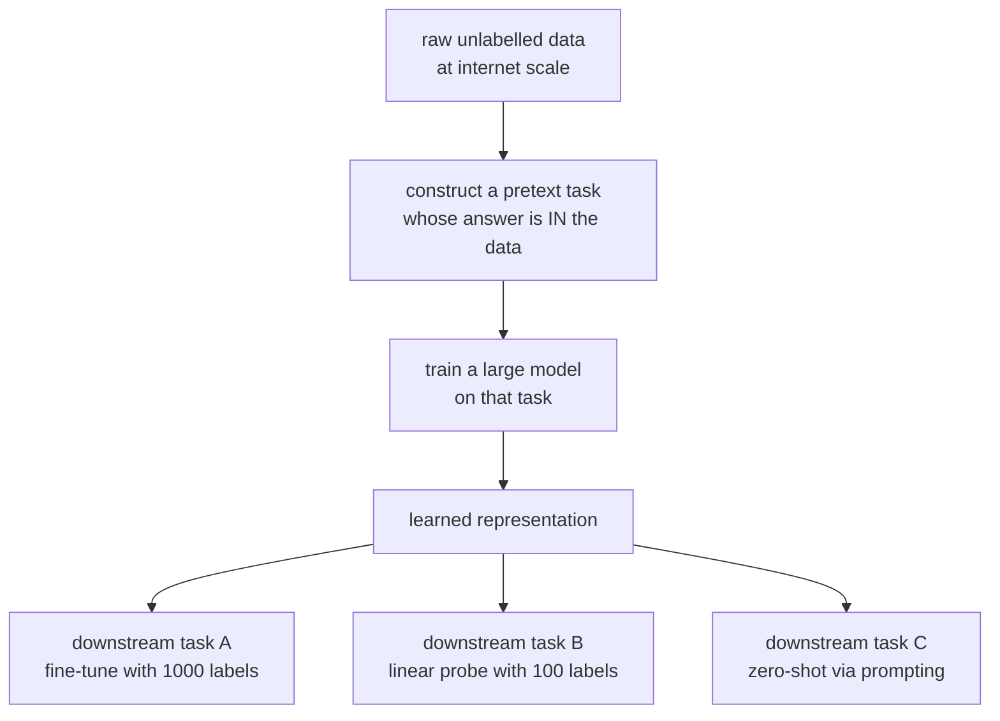
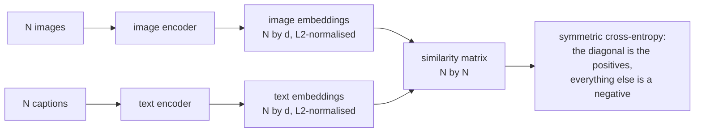

# Self-Supervised Learning

Labels are the scarce resource. There are trillions of tokens of text, billions
of images, and millions of hours of audio on the internet, and essentially none
of it is labelled for your task. Self-supervised learning turns that raw data
into training signal by constructing targets from the data. Many foundation
models combine self-supervision with curated labels, human feedback or paired
modalities. Ask which useful information the objective encourages a representation
to preserve, and how that claim can be tested.

## The idea

Hide part of the input, predict it from the rest. The "label" is the hidden part,
so no additional manual label is needed for that target. Data collection, rights,
filtering and compute are still real constraints.



The bet is that **solving the pretext task well requires understanding the
data**. To predict the next word you must model syntax, semantics, and world
knowledge. To decide whether two crops come from the same image you must
represent objects rather than pixels. The representation is the product; the
pretext task is scaffolding.

## Predictive methods

### Next-token prediction

$$L = -\sum_t \log p_\theta(x_t \mid x_{<t})$$

The chain rule of probability, made into an objective. It has proven to be the
widely used objective for autoregressive language models, and capabilities beyond
explicit downstream labels (translation,
arithmetic, code generation, in-context learning) emerge from it at scale.

Why it works so well: every token is a supervised example, the causal mask lets
all positions train in one pass, and the task is *hard enough* that solving it
requires genuine modelling rather than surface statistics.

### Masked language modelling

BERT masks 15% of tokens and predicts them from bidirectional context. The
original recipe's 80/10/10 split (mask / random token / unchanged) exists to
prevent a train–inference mismatch, since `[MASK]` never appears at fine-tuning
time.

| | Causal LM | Masked LM |
|---|---|---|
| Context | left only | bidirectional |
| Training signal per pass | every token | ~15% of tokens |
| Generation | natural | awkward |
| Best for | generation, and in practice everything | classification, NER, embeddings |

Sample and compute efficiency depend on architecture, objective and evaluation
task. Counting loss-bearing positions alone does not prove superiority.
Bidirectional encoders and causal generators have different context contracts;
compare representation quality and deployment cost on the intended task.

### Masked image modelling

| Method | Predicts |
|---|---|
| **MAE** | raw pixels of masked patches, with a very high mask ratio (75%) and a lightweight decoder |
| BEiT | discrete visual tokens from a pretrained tokeniser |
| SimMIM | pixels, with a simple linear head |
| data2vec | latent representations of the teacher, across modalities |

MAE's high mask ratio is the interesting design choice: images are far more
redundant than text, so masking 15% leaves the task trivially solvable by
interpolation on some images. A high ratio makes prediction harder but does not
guarantee semantic reasoning; texture and dataset shortcuts can remain. MAE's
encoder processes only visible patches, reducing its token work. The actual
speedup also depends on decoder cost and implementation.

### Other pretext tasks

| Task | Modality | Status |
|---|---|---|
| Predict rotation | images | superseded |
| Solve a jigsaw of patches | images | superseded |
| Colourise a greyscale image | images | superseded |
| Predict relative patch position | images | superseded |
| Inpainting | images | still used in generative contexts |
| Order shuffled sentences | text | superseded |
| Next sentence prediction | text | **removed** — RoBERTa showed it hurt |
| Contrastive predictive coding | audio, sequences | led to wav2vec |

The early hand-designed vision pretext tasks all worked somewhat and were all
beaten by contrastive and masked methods. The pattern is familiar: clever
task-specific engineering loses to a simpler objective applied at scale.

## Contrastive learning

Pull together representations of two views of the same item; push apart views of
different items.

### InfoNCE

$$L = -\log\frac{\exp(\mathrm{sim}(\mathbf{z}_i,\mathbf{z}_j)/\tau)}{\sum_{k=1}^{2N}\mathbb{1}_{[k\ne i]}\exp(\mathrm{sim}(\mathbf{z}_i,\mathbf{z}_k)/\tau)}$$

with cosine similarity and temperature $\tau$. This is a cross-entropy over
"which of the $2N-1$ candidates is my positive pair". Under the classical
joint-positive/independent-marginal-negative assumptions, a construction with $M$
total candidates gives $I(X;Y)\ge\log M-L_{\mathrm{NCE}}$. The loss itself is
not a mutual-information lower bound. Correlated two-view batches require care
when transferring this proof to a practical objective.
[Contrastive Predictive Coding](https://arxiv.org/abs/1807.03748).

- **The estimator cannot exceed $\log M$** since the loss is nonnegative.
  More negatives change the bound and discrimination problem but do not guarantee
  better representations. False negatives, duplicates and optimization matter.
- **Temperature controls the hardness weighting.** Low $\tau$ concentrates the
  gradient on the hardest negatives; too low and the model chases noise and
  label-collision pairs. $\tau \approx 0.07$–$0.1$ is typical.

### The methods

| Method | How it gets negatives | Key detail |
|---|---|---|
| **SimCLR** | other items in the batch | large batches helped its original recipe; strong augmentation and a projection head |
| **MoCo** | a momentum-updated queue of past embeddings | decouples the negative count from the batch size |
| **CLIP** | the other captions in the batch | cross-modal: image and text encoders trained jointly |
| SupCon | uses labels to define positives | supervised contrastive; multiple positives per anchor |

**Augmentation choice is the whole game in visual contrastive learning.** SimCLR's
ablations showed random cropping plus colour distortion is the critical pair —
crops alone let the model cheat by matching colour histograms. The augmentations
encourage invariances in the representation, so they are a place domain
knowledge enters.

**The projection head** is a small MLP applied before the contrastive loss and
often **discarded** afterwards; the layer before it is a candidate representation. The
explanation is that the contrastive loss forces invariance to the augmentations,
destroying information (colour, orientation) that downstream tasks may need. The
projection head absorbs that destruction, leaving the backbone representation
richer.

## Non-contrastive methods

Negatives are expensive and awkward. Can you train with positives only?

The obvious problem is **collapse**: mapping everything to a constant vector
satisfies "make views of the same item similar" perfectly. Each method avoids it
differently, and the differences are the interesting part.

| Method | Anti-collapse mechanism |
|---|---|
| **BYOL** | momentum target, predictor and stop-gradient create asymmetric training dynamics |
| **SimSiam** | a stop-gradient on one branch; shows the momentum encoder is not required |
| **Barlow Twins** | make the cross-correlation matrix of the two views' embeddings the identity — on-diagonal invariance, off-diagonal decorrelation |
| **VICReg** | three explicit terms: variance (keep each dimension's std above a threshold), invariance, covariance (decorrelate) |
| **DINO / DINOv2** | self-distillation with centring and sharpening of the teacher output |
| SwAV | online clustering with the Sinkhorn algorithm enforcing balanced assignment |

**BYOL was a genuine surprise** — the field's consensus was that negatives were
mathematically necessary, and BYOL matched contrastive methods without them. The
subsequent analysis showed the predictor plus stop-gradient creates an implicit
dynamic that repels collapse, and SimSiam stripped it to the minimum ingredients.

DINOv2 reported strong transferable visual features on its benchmark suite;
this is a dated empirical result, not a live universal ranking. Some learned
features correspond to objects without segmentation labels, but an appealing
attention map is not equivalent to quantitative segmentation evaluation.
[DINOv2](https://arxiv.org/abs/2304.07193).

## Multimodal: CLIP

Train an image encoder and a text encoder jointly so that matched image–caption
pairs are close and mismatched pairs are far, using a symmetric InfoNCE over the
$N\times N$ similarity matrix of a batch.



**Zero-shot classification falls out for free.** Embed the class names as
prompts ("a photo of a {class}"), embed the image, take the argmax over cosine
similarities. No task-specific training at all, and it was competitive with a
fully supervised ResNet-50 on ImageNet.

Why it works: natural-language supervision is far richer than a class index. "A
golden retriever running through a park" contains object, breed, action, and
context, and it is available at web scale.

CLIP embeddings became infrastructure: text-to-image conditioning (Stable
Diffusion), retrieval, dataset filtering, and evaluation (CLIP score). Successors
— SigLIP (a sigmoid loss that removes the need for a global softmax and therefore
huge batches), EVA-CLIP, and the vision towers of multimodal LLMs — refine the
recipe rather than replace it.

## Evaluating a representation

The pretext-task loss is not the goal. Standard protocols:

| Protocol | Measures |
|---|---|
| **Linear probe** | a linear classifier on frozen features — the standard, and it isolates representation quality from adaptation capacity |
| $k$-NN evaluation | classification by nearest neighbours in feature space; no training at all |
| Fine-tuning | the practical number, but conflates representation with adaptation |
| Low-shot | performance with 1% or 10% of labels — where SSL's advantage is largest |
| Transfer to many tasks | detection, segmentation, retrieval — generality |
| Probing for properties | does the representation encode syntax, depth, part-of-speech? |
| **Robustness** | out-of-distribution, corruption, adversarial |

Linear probing tests linear accessibility under a specified training protocol.
A high-dimensional representation can still support overfitting, and information
that is present but nonlinear may be missed. Fine-tuning answers a different
question because it can relearn the features.

Low-shot evaluation is especially useful when labels are scarce. Self-supervised
pretraining can help, but its advantage depends on source-domain relevance and
the supervised baseline. Specify whether the unlabeled pretraining data and
compute are available to every compared method.

## Why it works: the current understanding

Not fully explained, but several partial accounts have support:

- **Information bottleneck.** The objective forces retention of information
  predictive across views and discarding of view-specific noise.
- **Augmentation defines the invariances.** The representation is invariant to
  transformations encouraged by the objective, not necessarily exactly or only
  those transformations. Preserve semantics while varying candidate nuisances.
- **The pretext task must be hard enough.** If it can be solved by a shortcut
  (colour histograms, chromatic aberration, JPEG artefacts), the model learns the
  shortcut. Most pretext-task failures are shortcut failures.
- **Scale changes the answer.** Methods that are close at 1M images separate at
  1B, and small-scale ablations frequently do not transfer.

**Shortcut learning is the recurring practical trap.** Early rotation-prediction
work found models detecting watermarks; contrastive models can match crops by
chromatic aberration; audio models can exploit codec artefacts. If a pretext task
is being solved suspiciously well, look for the shortcut before celebrating.

## Similarity matrices, positives and collapse

Let two batches of normalized embeddings be $U,V\in\mathbb R^{N\times d}$.
CLIP-style logits are $S=UV^\top/\tau$. Row cross-entropy identifies the matched
caption for each image; column cross-entropy identifies the matched image for
each caption. Their mean is a symmetric retrieval objective. Caption pairs are
natural-language supervision, often described as weak or naturally occurring
supervision; they are not labels derived solely from the image pixels.

For three perfectly matching orthogonal pairs and temperature one, $S=I_3$.
Each positive probability is $e/(e+2)\approx0.5761$, and each directional loss is
$\log(e+2)-1\approx0.5514$. Perfect ranking does not mean zero cross-entropy:
the finite logit margin still gives probability to alternatives. Lower temperature
sharpens this matrix, but may also amplify a wrongly matched or false-negative pair.

SimCLR concatenates two views into $Z\in\mathbb R^{2N\times d}$. If the order is
`[view1 batch, view2 batch]`, positive indices are `(i+N) mod (2N)`. The diagonal
must be excluded, because self-similarity is not the positive task. Each row then
contains one positive and $2N-2$ negatives, for $2N-1$ candidates. At $N=1$ the
only candidate is positive and the loss supplies no discrimination; reject that
batch for this recipe. A batch shuffling operation that changes views independently
must carry the pairing indices or it silently changes the objective.

With target distribution $p^*$ and softmax probabilities $p$, the score-logit
gradient is $p-p^*$. Division by temperature multiplies the similarity gradient
by $1/\tau$. Feature normalization removes vector length as a shortcut to larger
cosine scores, but a learned global logit scale can still grow. Validate or bound
its parameterization and monitor logits rather than interpreting every decreasing
loss as improved semantic structure.

### False negatives and distributed batches

Two different images of the same class can be negatives under instance
discrimination even when the downstream task wants them close. Duplicate captions
or duplicate documents can make the diagonal-only target outright incorrect for
retrieval. Options include removing duplicates, masking uncertain negatives or
using multi-positive objectives. These define different supervision assumptions:
labels used to form SupCon positives make it supervised contrastive learning.

An all-gathered global embedding batch is not automatically equivalent to a local
larger batch. Decide whether gradients flow into remote embeddings, how local
losses are normalized and how distributed gradient averaging interacts with the
global denominator. A detached queue such as MoCo intentionally uses stale target
features; a momentum encoder slows their drift. Queue length, encoder momentum
and augmentation distribution control the usefulness of those negatives. Debug
on two processes with a tiny reference before claiming distributed equivalence.

### VICReg and Barlow Twins objectives

For centered embeddings $Z_c$, covariance is $C=Z_c^\top Z_c/(N-1)$.
VICReg combines view agreement, a standard-deviation floor, and off-diagonal
covariance penalties. One form is

$$L=\lambda\,\operatorname{mean}(Z-Z')^2+
\mu\sum_{A\in\{Z,Z'\}}\frac1d\sum_j\max(0,\gamma-\sqrt{\operatorname{Var}(A_j)+\epsilon})+
\nu\sum_{A\in\{Z,Z'\}}\frac1d\sum_{i\ne j}C(A)_{ij}^2.$$

The coefficients and reductions are part of the method. A constant embedding
has perfect agreement and zero covariance, but violates the variance floor.
However, exact constant embeddings can still be stationary under some symmetric
parameterizations because variance derivatives vanish there. A penalty discouraging
collapse does not prove every initialization and optimizer escapes it.
[VICReg](https://arxiv.org/abs/2105.04906).

Barlow Twins normalizes coordinate statistics and penalizes a cross-correlation
matrix whose diagonal differs from one or whose off-diagonal entries differ from
zero. The diagonal encourages agreement; off-diagonal terms discourage redundant
coordinates. It is not the same as requiring every pair of samples to be orthogonal.
When feature dimension exceeds $N-1$, empirical centered covariance cannot be full
rank, so a small-batch spectrum has a rank ceiling even without representation
collapse. Use enough examples and compare spectra under a fixed protocol.
[Barlow Twins](https://arxiv.org/abs/2103.03230).

BYOL/SimSiam stop gradients through one target branch while an online predictor
learns to match it; this is a training asymmetry, not a proof that constant outputs
are absent from the hypothesis class. DINO adds teacher centering and sharpening;
SwAV uses balanced online assignments. Their anti-collapse dynamics are method
specific. Diagnose per-dimension variance, pairwise similarities, covariance
eigenvalues, cluster use and downstream performance together.

## Runnable lab: contrastive pretraining and a frozen probe

The synthetic observations contain two meaningful coordinates plus six nuisance
coordinates. Views preserve content with small noise while resampling nuisances.
A PyTorch encoder trains with symmetric pair indexing; a scikit-learn pipeline
then fits a linear probe on frozen features. Labels are used only by the probe.
The representation split here is inductive: pretraining does not use test examples.

```python runnable
import numpy as np
import torch
from torch import nn
from torch.nn import functional as F
from sklearn.linear_model import LogisticRegression
from sklearn.pipeline import make_pipeline
from sklearn.preprocessing import StandardScaler

torch.manual_seed(41)
torch.set_num_threads(1)
np.random.seed(41)
content = torch.randn(384, 2)
labels = (content[:, 0] + content[:, 1] > 0).long()
encoder = nn.Sequential(nn.Linear(8, 32), nn.ReLU(), nn.Linear(32, 12))
projector = nn.Sequential(nn.Linear(12, 16), nn.ReLU(), nn.Linear(16, 8))
optimizer = torch.optim.Adam(list(encoder.parameters()) + list(projector.parameters()), lr=0.006)

def view(latent):
    return torch.cat((latent + 0.04 * torch.randn_like(latent),
                      torch.randn(len(latent), 6)), dim=1)

def contrastive(a, b, temperature=0.2):
    n = len(a)
    if n < 2:
        raise ValueError("At least two paired examples are needed")
    z = F.normalize(torch.cat((a, b)), dim=-1)
    logits = z @ z.T / temperature
    logits = logits.masked_fill(torch.eye(2*n, dtype=torch.bool), -torch.inf)
    positive = (torch.arange(2*n) + n) % (2*n)
    return F.cross_entropy(logits, positive)

fixed_a, fixed_b = view(content[:128]), view(content[:128])
with torch.no_grad():
    initial = contrastive(projector(encoder(fixed_a)), projector(encoder(fixed_b))).item()
for _ in range(180):
    ids = torch.randperm(256)[:96]
    a, b = view(content[ids]), view(content[ids])
    optimizer.zero_grad(set_to_none=True)
    loss = contrastive(projector(encoder(a)), projector(encoder(b)))
    loss.backward()
    optimizer.step()
encoder.eval()
projector.eval()
with torch.no_grad():
    final = contrastive(projector(encoder(fixed_a)), projector(encoder(fixed_b))).item()
    features = encoder(torch.cat((content, torch.zeros(384, 6)), dim=1)).numpy()
probe = make_pipeline(StandardScaler(), LogisticRegression(C=1.0, max_iter=1000, random_state=41))
probe.fit(features[:128], labels[:128].numpy())
accuracy = probe.score(features[256:], labels[256:].numpy())
eigenvalues = np.linalg.eigvalsh(np.cov(features[:256], rowvar=False))
assert final < initial
assert np.isfinite(features).all() and eigenvalues[-1] > 1e-4
assert accuracy > 0.75
print({"initial_contrastive_loss": initial, "final_contrastive_loss": final,
       "probe_accuracy": accuracy, "largest_covariance_eigenvalue": eigenvalues[-1]})
```

The positive pairing is preserved, but nuisance resampling is safe only because
the synthetic label rule ignores those coordinates. In medical or satellite
images, cropping, color changes or rotation may destroy the target information.
The experiment's success cannot justify those augmentations for another domain.
Its fixed probe regularization avoids test selection; a larger comparison should
choose `C` on a separate validation split and repeat across seeds and label budgets.

## Runnable lab: masked reconstruction without label leakage

This second independent experiment learns from correlated synthetic measurements.
The input contains visible values plus a mask indicator; the loss uses only
hidden values. The target is not available through a skip connection. A train-set
mean is the baseline. This is a compact masked-modeling experiment, not a faithful
MAE architecture: MAE additionally removes masked tokens from its expensive encoder.

```python runnable
import torch
from torch import nn

torch.manual_seed(42)
torch.set_num_threads(1)
mixing = torch.randn(3, 12)
data = torch.randn(512, 3) @ mixing + 0.05 * torch.randn(512, 12)
mean = data[:384].mean(0)
scale = data[:384].std(0).clamp_min(1e-4)
data = (data - mean) / scale
model = nn.Sequential(nn.Linear(24, 64), nn.GELU(), nn.Linear(64, 64),
                      nn.GELU(), nn.Linear(64, 12))
opt = torch.optim.Adam(model.parameters(), lr=0.005)

def make_mask(n):
    # Exactly six hidden coordinates per example avoids empty-loss batches.
    order = torch.rand(n, 12).argsort(1)
    hidden = torch.zeros(n, 12, dtype=torch.bool)
    return hidden.scatter(1, order[:, :6], True)

def reconstruct(values, hidden):
    visible = values.masked_fill(hidden, 0)
    return model(torch.cat((visible, hidden.float()), dim=-1))

fixed_mask = make_mask(128)
for _ in range(220):
    ids = torch.randint(384, (96,))
    values = data[ids]
    hidden = make_mask(len(values))
    opt.zero_grad(set_to_none=True)
    prediction = reconstruct(values, hidden)
    loss = (prediction - values).square()[hidden].mean()
    loss.backward()
    opt.step()
model.eval()
with torch.no_grad():
    test = data[384:]
    prediction = reconstruct(test, fixed_mask)
    mse = (prediction - test).square()[fixed_mask].mean().item()
    baseline = test.square()[fixed_mask].mean().item()
    corrupted = test.clone()
    corrupted[fixed_mask] = 999
    torch.testing.assert_close(reconstruct(corrupted, fixed_mask), prediction)
assert mse < baseline * 0.7
print({"masked_test_mse": mse, "train_mean_baseline_mse": baseline})
```

The final assertion changing hidden values is a direct leakage test: predictions
must not change because those values are removed before encoding. It does not
establish that the representation helps a classification task. Reconstruction can
preserve nuisance variation and miss a small discriminative feature. Add a frozen
probe or transfer task when representation quality, rather than imputation, is
the objective. Compare different mask fractions without assuming the optimum
from an image paper transfers to a sensor array.

## A defensible representation evaluation

Freeze the backbone and set its intended evaluation mode. Extract train/validation/
test features with the same preprocessing, then fit feature normalization on
training features only. Choose probe regularization and any layer selection on
validation data. Report the final test once, along with feature dimension,
augmentation policy and whether pretraining saw unlabeled test inputs. Transductive
evaluation may deliberately use those inputs, but must be named and compared fairly.

For nearest-neighbor evaluation, specify cosine versus Euclidean distance,
normalization, neighbor count, vote weighting and duplicate handling. Retrieval
requires correct multi-positive labels and an exclusion policy for self-matches.
For low-shot classification, sample several labeled subsets rather than reporting
the luckiest one. A probe can fail because information is nonlinear, not absent;
full fine-tuning can succeed by adding adaptation capacity, not proving the original
representation was already linearly useful.

Web pretraining can overlap evaluation images, documents or captions. Report
known overlap checks and uncertainty, especially for near-duplicate retrieval.
Out-of-distribution tests should separate label shift, corruptions and new
domains. Shortcut checks include replacing backgrounds, changing codecs, removing
watermarks and altering length distributions while preserving labels. A lower
pretext loss after adding a watermark should be a warning, not a success criterion.
See [generalization](../ml/bias-variance-and-generalization.md) and
[transfer learning](./transfer-learning-and-finetuning.md).

### Multimodal evaluation and sigmoid alternatives

Zero-shot classification is still a designed evaluation protocol. State the class
descriptions, prompt templates and whether several template embeddings are
averaged before or after normalization. A class name with several meanings can
produce a different query from a descriptive phrase. Adding candidate classes
changes the classification problem even if the encoders are untouched. Report
per-class confusion and domain slices instead of interpreting one top-one number
as universal cross-modal understanding.

For retrieval, one image can have many valid captions and one caption can match
many images. A diagonal-only benchmark can mark a correct semantic retrieval as
wrong. Construct the positive relation explicitly and choose recall-at-k or a
ranking metric that matches it. If the source corpus contains near-duplicate
images, evaluate both deduplicated and realistic deployment settings so the easy
duplicates do not hide poor transfer to genuinely new examples.

Sigmoid-based alignment uses independent pair decisions rather than one global
softmax denominator. With similarity logit $s_{ij}$, pair label
$y_{ij}\in\{-1,1\}$ and an optional learned bias, a term is
$\operatorname{softplus}(-y_{ij}s_{ij})$. This changes how negative sampling and
pair imbalance affect the objective; it does not eliminate the need for good
negatives, normalization, temperature choices or validation. With N matching
pairs there are N diagonal positives but $N(N-1)$ off-diagonal negatives, so
sampling and loss scaling must be explicit. Neither softmax nor sigmoid alignment
guarantees calibrated probabilities of downstream correctness.

## Practical guidance

| Situation | Approach |
|---|---|
| A pretrained model exists for your modality | **use it** — do not pretrain from scratch |
| A large domain corpus, unlabelled | continued pretraining with the original objective |
| Millions of unlabelled images, few labels | DINOv2 features, or fine-tune with MAE-style pretraining |
| Text in a specialised domain | continued MLM/CLM pretraining, then fine-tune |
| Paired data across modalities | contrastive alignment (CLIP-style) |
| Tabular data | self-supervision generally underperforms — use boosted trees |
| Time series | masked modelling and contrastive both work; evaluate both |

Compare available pretrained features with an in-domain baseline before choosing
pretraining from scratch. Unusual sensors, privacy constraints, licensing,
domain mismatch and sufficiently large corpora can change the economics.
Continued pretraining is an intermediate option, not the same as starting over.

## Self-check

1. Why is next-token prediction such an effective self-supervised task?
2. State the InfoNCE mutual-information bound and explain why it does not guarantee larger-batch gains.
3. Why is the projection head discarded after contrastive pretraining?
4. What is representation collapse, and how do BYOL and Barlow Twins each avoid
   it?
5. Why does MAE mask 75% of patches when BERT masks 15%?
6. How does CLIP do zero-shot classification without any task-specific training?
7. Why is linear probing preferred to fine-tuning for evaluating a
   representation?

### Worked answers

1. Next-token prediction creates many targets from raw sequences and supports
   teacher-forced parallel training with a causal mask. It can encourage useful
   predictive structure, but also shortcuts; low loss alone is not proof of reasoning.
2. Under the required negative-sampling assumptions, $I\ge\log M-L_{NCE}$.
   The estimator ceiling grows with candidate count, while false negatives,
   optimization and data correlation can offset benefits. Loss is not itself the bound.
3. A projector can absorb information discarded by the pretext objective while
   earlier features retain useful variation. Discarding it is common, not mandatory;
   compare layers using validation rather than a universal rule.
4. Collapse maps distinct examples to identical or low-dimensional outputs.
   BYOL uses asymmetric training dynamics; Barlow Twins penalizes disagreement and
   cross-coordinate redundancy. Neither slogan replaces measuring variance and rank.
5. The original image and text recipes have different redundancy, tokenization
   and objectives. Their ratios are empirical choices, not universal percentages
   guaranteed to force semantic understanding.
6. Encode candidate class descriptions and choose the closest image-text match.
   Prompt wording, class set and domain affect accuracy; no task-specific updates
   does not mean no supervision in the pretraining image-caption pairs.
7. A frozen linear probe tests linear accessibility with limited adaptation.
   Fine-tuning measures adaptable usefulness instead. Both need controlled splits,
   normalization, hyperparameter selection and explicit comparison budgets.

## Where to go next

- [Transfer Learning](./transfer-learning-and-finetuning.md) — using the
  representations these methods produce.
- [Generative Models](./generative-models.md) — the other family of
  label-free objectives.
- [Attention & Transformers](./attention-and-transformers.md) — the architecture
  they are almost always applied to.
