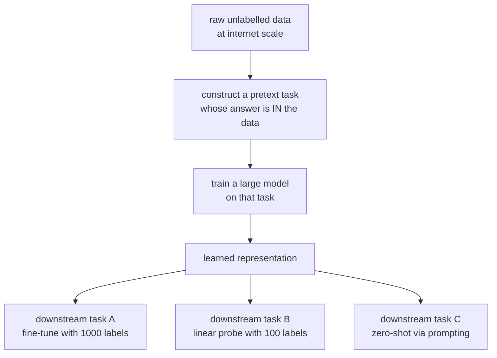
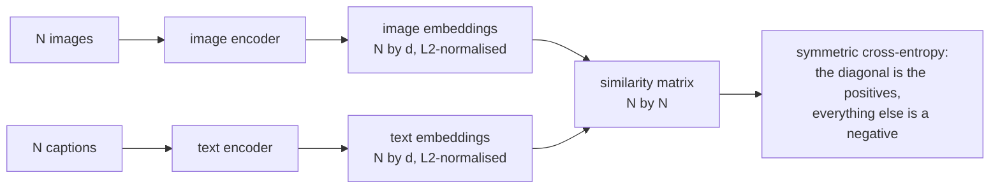

# Self-Supervised Learning

Labels are the scarce resource. There are trillions of tokens of text, billions
of images, and millions of hours of audio on the internet, and essentially none
of it is labelled for your task. Self-supervised learning turns that raw data
into training signal by constructing a task whose answer is already present in
the data — and it is the technique behind every foundation model.

## The idea

Hide part of the input, predict it from the rest. The "label" is the hidden part,
so supervision is free and unlimited.

The bet is that **solving the pretext task well requires understanding the
data**. To predict the next word you must model syntax, semantics, and world
knowledge. To decide whether two crops come from the same image you must
represent objects rather than pixels. The representation is the product; the
pretext task is scaffolding.

## Predictive methods

### Next-token prediction

$$L = -\sum_t \log p_\theta(x_t \mid x_{<t})$$

The chain rule of probability, made into an objective. It has proven to be the
most effective self-supervised task ever devised — every large language model is
trained this way, and capabilities that were never trained for (translation,
arithmetic, code generation, in-context learning) emerge from it at scale.

Why it works so well: every token is a supervised example, the causal mask lets
all positions train in one pass, and the task is *hard enough* that solving it
requires genuine modelling rather than surface statistics.

### Masked language modelling

BERT masks 15% of tokens and predicts them from bidirectional context. The
original recipe's 80/10/10 split (mask / random token / unchanged) exists to
prevent a train–inference mismatch, since `[MASK]` never appears at fine-tuning
time.

| | Causal LM | Masked LM |
|---|---|---|
| Context | left only | bidirectional |
| Training signal per pass | every token | ~15% of tokens |
| Generation | natural | awkward |
| Best for | generation, and in practice everything | classification, NER, embeddings |

Masked modelling is **more sample-efficient per token seen** for representation
quality, and causal modelling is **more efficient per unit of compute** because
every position contributes. Causal won for scaling; masked encoders remain the
better choice for embeddings and token-level tasks.

### Masked image modelling

| Method | Predicts |
|---|---|
| **MAE** | raw pixels of masked patches, with a very high mask ratio (75%) and a lightweight decoder |
| BEiT | discrete visual tokens from a pretrained tokeniser |
| SimMIM | pixels, with a simple linear head |
| data2vec | latent representations of the teacher, across modalities |

MAE's high mask ratio is the interesting design choice: images are far more
redundant than text, so masking 15% leaves the task trivially solvable by
interpolation. Masking 75% forces genuine semantic inference. The asymmetric
design — the encoder sees only visible patches — also makes pretraining ~3×
cheaper.

### Other pretext tasks

| Task | Modality | Status |
|---|---|---|
| Predict rotation | images | superseded |
| Solve a jigsaw of patches | images | superseded |
| Colourise a greyscale image | images | superseded |
| Predict relative patch position | images | superseded |
| Inpainting | images | still used in generative contexts |
| Order shuffled sentences | text | superseded |
| Next sentence prediction | text | **removed** — RoBERTa showed it hurt |
| Contrastive predictive coding | audio, sequences | led to wav2vec |

The early hand-designed vision pretext tasks all worked somewhat and were all
beaten by contrastive and masked methods. The pattern is familiar: clever
task-specific engineering loses to a simpler objective applied at scale.

## Contrastive learning

Pull together representations of two views of the same item; push apart views of
different items.

### InfoNCE

$$L = -\log\frac{\exp(\mathrm{sim}(\mathbf{z}_i,\mathbf{z}_j)/\tau)}{\sum_{k=1}^{2N}\mathbb{1}_{[k\ne i]}\exp(\mathrm{sim}(\mathbf{z}_i,\mathbf{z}_k)/\tau)}$$

with cosine similarity and temperature $\tau$. This is a cross-entropy over
"which of the $2N-1$ candidates is my positive pair", and it is a **lower bound
on the mutual information** between the two views.

Two consequences follow directly from that:

- **The bound saturates at $\log N$** for $N$ negatives. That is the honest
  reason large batch sizes help SimCLR and CLIP — not a training heuristic but a
  property of the objective.
- **Temperature controls the hardness weighting.** Low $\tau$ concentrates the
  gradient on the hardest negatives; too low and the model chases noise and
  label-collision pairs. $\tau \approx 0.07$–$0.1$ is typical.

### The methods

| Method | How it gets negatives | Key detail |
|---|---|---|
| **SimCLR** | other items in the batch | needs very large batches (4096+); strong augmentation is essential; a projection head that is discarded afterwards |
| **MoCo** | a momentum-updated queue of past embeddings | decouples the negative count from the batch size |
| **CLIP** | the other captions in the batch | cross-modal: image and text encoders trained jointly |
| SupCon | uses labels to define positives | supervised contrastive; multiple positives per anchor |

**Augmentation choice is the whole game in visual contrastive learning.** SimCLR's
ablations showed random cropping plus colour distortion is the critical pair —
crops alone let the model cheat by matching colour histograms. The augmentations
define the invariances the representation learns, so they are the place domain
knowledge enters.

**The projection head** is a small MLP applied before the contrastive loss and
**discarded** afterwards; the layer before it is the useful representation. The
explanation is that the contrastive loss forces invariance to the augmentations,
destroying information (colour, orientation) that downstream tasks may need. The
projection head absorbs that destruction, leaving the backbone representation
richer.

## Non-contrastive methods

Negatives are expensive and awkward. Can you train with positives only?

The obvious problem is **collapse**: mapping everything to a constant vector
satisfies "make views of the same item similar" perfectly. Each method avoids it
differently, and the differences are the interesting part.

| Method | Anti-collapse mechanism |
|---|---|
| **BYOL** | a momentum-updated target encoder plus a predictor on the online branch only — asymmetry prevents the trivial solution |
| **SimSiam** | a stop-gradient on one branch; shows the momentum encoder is not required |
| **Barlow Twins** | make the cross-correlation matrix of the two views' embeddings the identity — on-diagonal invariance, off-diagonal decorrelation |
| **VICReg** | three explicit terms: variance (keep each dimension's std above a threshold), invariance, covariance (decorrelate) |
| **DINO / DINOv2** | self-distillation with centring and sharpening of the teacher output |
| SwAV | online clustering with the Sinkhorn algorithm enforcing balanced assignment |

**BYOL was a genuine surprise** — the field's consensus was that negatives were
mathematically necessary, and BYOL matched contrastive methods without them. The
subsequent analysis showed the predictor plus stop-gradient creates an implicit
dynamic that repels collapse, and SimSiam stripped it to the minimum ingredients.

**DINOv2 is currently the strongest general-purpose visual representation**, and
its emergent property is notable: attention maps segment objects without ever
being trained on segmentation. Self-supervised objectives can produce structure
nobody asked for.

## Multimodal: CLIP

Train an image encoder and a text encoder jointly so that matched image–caption
pairs are close and mismatched pairs are far, using a symmetric InfoNCE over the
$N\times N$ similarity matrix of a batch.

**Zero-shot classification falls out for free.** Embed the class names as
prompts ("a photo of a {class}"), embed the image, take the argmax over cosine
similarities. No task-specific training at all, and it was competitive with a
fully supervised ResNet-50 on ImageNet.

Why it works: natural-language supervision is far richer than a class index. "A
golden retriever running through a park" contains object, breed, action, and
context, and it is available at web scale.

CLIP embeddings became infrastructure: text-to-image conditioning (Stable
Diffusion), retrieval, dataset filtering, and evaluation (CLIP score). Successors
— SigLIP (a sigmoid loss that removes the need for a global softmax and therefore
huge batches), EVA-CLIP, and the vision towers of multimodal LLMs — refine the
recipe rather than replace it.

## Evaluating a representation

The pretext-task loss is not the goal. Standard protocols:

| Protocol | Measures |
|---|---|
| **Linear probe** | a linear classifier on frozen features — the standard, and it isolates representation quality from adaptation capacity |
| $k$-NN evaluation | classification by nearest neighbours in feature space; no training at all |
| Fine-tuning | the practical number, but conflates representation with adaptation |
| Low-shot | performance with 1% or 10% of labels — where SSL's advantage is largest |
| Transfer to many tasks | detection, segmentation, retrieval — generality |
| Probing for properties | does the representation encode syntax, depth, part-of-speech? |
| **Robustness** | out-of-distribution, corruption, adversarial |

**Linear probing is the honest default** because a linear head cannot rescue a
bad representation. A strong fine-tuning number can hide a mediocre one, since
fine-tuning re-learns features.

**The low-shot column is where the argument for SSL lives.** With full labels,
supervised training is often competitive. With 1% of labels, self-supervised
pretraining wins by a wide margin — which is the realistic situation for most
applications.

## Why it works: the current understanding

Not fully explained, but several partial accounts have support:

- **Information bottleneck.** The objective forces retention of information
  predictive across views and discarding of view-specific noise.
- **Augmentation defines the invariances.** The representation is invariant to
  exactly what your augmentations vary. Choose augmentations that destroy
  nuisances and preserve semantics.
- **The pretext task must be hard enough.** If it can be solved by a shortcut
  (colour histograms, chromatic aberration, JPEG artefacts), the model learns the
  shortcut. Most pretext-task failures are shortcut failures.
- **Scale changes the answer.** Methods that are close at 1M images separate at
  1B, and small-scale ablations frequently do not transfer.

**Shortcut learning is the recurring practical trap.** Early rotation-prediction
work found models detecting watermarks; contrastive models can match crops by
chromatic aberration; audio models can exploit codec artefacts. If a pretext task
is being solved suspiciously well, look for the shortcut before celebrating.

## Practical guidance

| Situation | Approach |
|---|---|
| A pretrained model exists for your modality | **use it** — do not pretrain from scratch |
| A large domain corpus, unlabelled | continued pretraining with the original objective |
| Millions of unlabelled images, few labels | DINOv2 features, or fine-tune with MAE-style pretraining |
| Text in a specialised domain | continued MLM/CLM pretraining, then fine-tune |
| Paired data across modalities | contrastive alignment (CLIP-style) |
| Tabular data | self-supervision generally underperforms — use boosted trees |
| Time series | masked modelling and contrastive both work; evaluate both |

**The dominant practical answer in 2026 is that you almost never pretrain.**
Foundation models exist for text, images, audio, video, code, and protein
sequences. Self-supervised pretraining from scratch makes sense for a genuinely
unusual modality (specialised sensors, proprietary formats) or when you have a
domain corpus large enough that continued pretraining pays for itself.

## Self-check

1. Why is next-token prediction such an effective self-supervised task?
2. What does InfoNCE bound, and why does that imply large batches help?
3. Why is the projection head discarded after contrastive pretraining?
4. What is representation collapse, and how do BYOL and Barlow Twins each avoid
   it?
5. Why does MAE mask 75% of patches when BERT masks 15%?
6. How does CLIP do zero-shot classification without any task-specific training?
7. Why is linear probing preferred to fine-tuning for evaluating a
   representation?

## Where to go next

- [Transfer Learning](./transfer-learning-and-finetuning.md) — using the
  representations these methods produce.
- [Generative Models](./generative-models.md) — the other family of
  label-free objectives.
- [Attention & Transformers](./attention-and-transformers.md) — the architecture
  they are almost always applied to.
