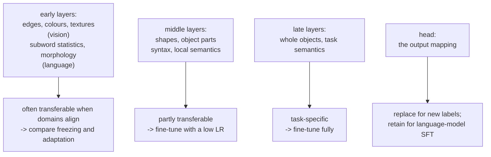

# Transfer Learning and Fine-Tuning

Transfer learning reuses a model trained on one distribution for another task or
domain. It can reduce data and compute needs, but the gain depends on what the
source representation preserves. Define the desired behavior, measure retained
capabilities, and select the least expensive adaptation that meets both goals.

## Why transfer works

Deep networks learn a **hierarchy** of features, and the lower levels are
often broadly transferable, rather than strictly task-independent.



The empirical fact underneath: the first-layer filters of a network trained on
ImageNet look like Gabor filters, and so do the first-layer filters of a network
trained on medical images, satellite imagery, or paintings. **Nothing about the
task alone determines them**; modality, resolution and training objective matter
too. Treat transferable features as an empirical hypothesis.

In language, tokenization ordinarily occurs before the transformer. Embeddings
and early blocks process token identities and contextual patterns. Tokenizer
coverage can therefore constrain adaptation before trainable layers see an input.

## The adaptation ladder

| Strategy | Trainable | Data needed | When |
|---|---|---|---|
| **Zero-shot / prompting** | nothing | 0 | a capable instruction-tuned model already does the task |
| **Few-shot / in-context** | nothing | 3–50 examples in the prompt | task is demonstrable, latency and cost allow |
| **RAG** | nothing | a document corpus | the gap is *knowledge*, not capability |
| **Linear probe / feature extraction** | a new head only | 100s | tiny data, very different task, or you need embeddings anyway |
| **Partial fine-tuning** | the last $k$ blocks + head | 1k–10k | moderate data, related domain |
| **PEFT (LoRA/QLoRA)** | 0.1–1% of parameters | 1k–100k | the default for LLMs |
| **Full fine-tuning** | everything | 10k+ | large data, or a substantially different domain |
| **Continued pretraining** | everything, self-supervised | a large domain corpus | a genuinely different domain (legal, code, biomedical) |
| **From scratch** | everything | millions | no suitable pretrained model exists |

These data counts and parameter percentages are illustrative orders of magnitude,
not thresholds. Compare interventions on the same held-out workload. A RAG system
may also train its retriever or reranker; zero parameter updates is one configuration.

## Feature extraction

Freeze the backbone, replace and train the head.

```python
model = torchvision.models.resnet50(weights="IMAGENET1K_V2")
for p in model.parameters():
    p.requires_grad = False
model.fc = nn.Linear(2048, num_classes)          # new head, requires_grad=True by default
opt = torch.optim.AdamW(model.fc.parameters(), lr=1e-3)
```

Fast and often memory-light, but a head over thousands of features can overfit
a small labeled dataset. The equivalent for text is extracting sentence embeddings and
training a logistic regression on them, which remains an unreasonably strong
baseline for text classification with a few hundred labels.

Note that with the backbone frozen you can **precompute the features once** and
train the head on cached vectors. Freezing parameters does not freeze BatchNorm
buffers or disable dropout. Put a frozen backbone in evaluation mode when fixed
features are intended, independently of the head's mode. Caching a deterministic
crop also removes online augmentation. The fragment above requires a downloaded
checkpoint; the complete offline experiment below trains its source model locally.

## Full fine-tuning

Unfreeze everything and train with a small learning rate.

```python
opt = torch.optim.AdamW([
    {"params": [p for name, p in model.named_parameters()
                if not name.startswith("fc.")], "lr": 1e-5},
    {"params": model.fc.parameters(), "lr": 1e-3},
], weight_decay=0.01)
```

Before this continuation, call `requires_grad_(True)` on parameters to unfreeze
them. **Discriminative learning rates** — lower for earlier layers, higher for later
ones — reflect the hierarchy: early features barely need to change, the head
needs to be learned outright. A common scheme multiplies the learning rate by a
factor per layer group going upward, selected on validation data.

**Gradual unfreezing** is the other standard technique: train the head alone
first, then unfreeze one block at a time. It avoids large early gradients from
the random head destroying the pretrained backbone.

Typical hyperparameters for fine-tuning a pretrained encoder: learning rate
$2\times10^{-5}$ to $5\times10^{-5}$, 2–4 epochs, warmup 6%, weight decay 0.01,
and early stopping. These are starting candidates, not universal settings.
Optimizer, loss reduction, batch size and trainable layers affect useful rates;
measure updates and held-out retention rather than deciding from the number alone.

## Catastrophic forgetting

Fine-tuning on a narrow task degrades general capability, sometimes severely. The
model has no mechanism to protect what it previously knew — gradient descent on
the new loss simply moves the weights.

| Mitigation | Idea |
|---|---|
| Lower learning rate, fewer epochs | move less |
| **PEFT** | the base weights are frozen and mathematically unchanged |
| Replay / data mixing | include 5–20% general data in the fine-tuning mix |
| **KL regularisation to the base model** | penalise divergence from the original output distribution |
| Elastic weight consolidation | penalise changes to parameters the Fisher information says matter |
| Model averaging (WiSE-FT, model soups) | interpolate fine-tuned and base weights |
| Adapter composition | keep task adapters separate, swap per request |

**Weight interpolation is the surprising cheap win.** Simply averaging the base
and fine-tuned weights, $\theta_\alpha = (1-\alpha)\theta_{\text{base}} +
\alpha\theta_{\text{ft}}$, often retains most of the fine-tuned task performance
while recovering some general performance for compatible models. Validate the
interpolation coefficient and parameter alignment; independently trained features
can be permutation-incompatible. Frozen base weights with an enabled adapter do
not imply unchanged behavior. Disabling adapters restores the base only if other
weights, buffers and preprocessing also remained fixed.

## LoRA

The dominant PEFT method, and worth understanding precisely.

**The hypothesis** is that a useful update can be represented at low rank for
the task. This is an inductive restriction, not a theorem about every full update.
Parameterize it as a product of two thin matrices:

$$W' = W_0 + \Delta W = W_0 + \frac{\alpha}{r}BA, \qquad B\in\mathbb{R}^{d\times r},\; A\in\mathbb{R}^{r\times k},\; r \ll \min(d,k)$$

| Property | Detail |
|---|---|
| $W_0$ | **frozen** — no gradients, no optimiser state |
| $A$ | initialised $\mathcal{N}(0,\sigma^2)$ |
| $B$ | initialised **zero**, so $\Delta W = 0$ and training starts exactly at the pretrained model |
| Trainable parameters | $r(d+k)$ instead of $dk$ |
| Inference | $B A$ can be **merged into $W_0$** — zero added latency |

Concretely, for $d = k = 4096$ and $r = 16$: $131{,}072$ trainable parameters
against $16.8$M — a **128× reduction**, and the optimiser state shrinks by the
same factor.

```python
from peft import LoraConfig, get_peft_model

cfg = LoraConfig(
    r=16, lora_alpha=32, lora_dropout=0.05, bias="none",
    target_modules=["q_proj", "k_proj", "v_proj", "o_proj",
                    "gate_proj", "up_proj", "down_proj"],
    task_type="CAUSAL_LM",
)
model = get_peft_model(model, cfg)
model.print_trainable_parameters()      # inspect the actual architecture and targets
```

| Hyperparameter | Guidance |
|---|---|
| `r` | 8–16 for style, format, and tone; 32–64 for new knowledge or hard tasks |
| `lora_alpha` | commonly $2r$; the effective scale is $\alpha/r$ |
| `target_modules` | inspect actual names; compare attention-only and attention-plus-MLP targets |
| `lora_dropout` | 0.05–0.1 on small datasets |
| learning rate | 1e-4 to 3e-4 — ~10× higher than full fine-tuning, since the base is frozen |

**QLoRA** adds 4-bit quantisation of the frozen base — NF4 (a
normal-distribution-optimal quantisation), double quantisation of the scales, and
paged optimizer states to manage memory spikes. The original study trained a 65B
model on a 48 GB GPU under its configuration, not an unconditional 70B capacity
guarantee. Frozen storage, adapter and computation dtypes are distinct choices.
[LoRA](https://arxiv.org/abs/2106.09685) and
[QLoRA](https://arxiv.org/abs/2305.14314) give the original experiments.

**Multi-tenancy is LoRA's underrated advantage.** One base model can serve dozens
of task-specific adapters, swapped per request. vLLM and TGI support this
natively, and it is a strong architectural argument for LoRA over full
fine-tuning in any product with several specialised behaviours.

### The PEFT family

| Method | Mechanism | Parameters | Inference cost |
|---|---|---|---|
| **LoRA** | low-rank update | 0.1–1% | zero when merged |
| **QLoRA** | LoRA + 4-bit frozen base | 0.1–1% | merging may require dequantization/requantization |
| **DoRA** | decomposes into magnitude and direction | ~LoRA | zero when merged |
| Adapters | bottleneck layers inserted in blocks | 1–5% | adds latency |
| Prefix tuning | learned key/value prefixes per layer | 0.1% | consumes context |
| Prompt tuning | learned soft tokens at the input | < 0.1% | consumes context |
| IA³ | learned rescaling vectors | < 0.1% | negligible |
| BitFit | train biases only | ~0.1% | zero |

Merged LoRA avoids a separate adapter matmul in compatible dense layers. Unmerged
adapters, multi-tenant batching and quantized merging have different costs. Prompt
and prefix methods spend context or attention-state capacity; relative quality
depends on the model, task and comparison budget.

## Domain adaptation

When the input distribution shifts but the task stays the same.

| Setting | Labels in target domain | Approach |
|---|---|---|
| Supervised | yes | fine-tune on target data |
| Semi-supervised | a few | fine-tune plus pseudo-labelling |
| **Unsupervised (UDA)** | none | domain-adversarial training, feature alignment (CORAL, MMD), self-training |
| Test-time adaptation | none, at inference | update BatchNorm statistics or use entropy minimisation |
| Domain generalisation | none, unseen domain | train on multiple domains, strong augmentation |

**Domain-adversarial training** (DANN) trains a domain classifier on the features
and a gradient-reversal layer that pushes the encoder to make features
domain-indistinguishable. Matching feature marginals can still hurt when class
proportions or conditional label rules differ. Evaluate each domain and class.

The cheapest and often most effective intervention for a domain shift is
**continued pretraining**: run the model's original self-supervised objective on
unlabelled target-domain text or images before fine-tuning. For legal, biomedical,
or code domains this is a candidate to compare with direct supervised adaptation.

## Knowledge distillation

Train a small student to match a large teacher's outputs.

$$L = \alpha\,T^2\,\mathrm{KL}\bigl(p_{\text{teacher}}^{T}\,\Vert\, p_{\text{student}}^{T}\bigr) + (1-\alpha)\,\mathrm{CE}(y, p_{\text{student}})$$

with softened distributions $p^T = \mathrm{softmax}(z/T)$ and $T > 1$.

**The teacher's "dark knowledge" is the point.** A hard label says "this is a 7".
The teacher's distribution says "this is a 7, and it looks somewhat like a 1, and
not at all like an 8" — relative probabilities over wrong classes that carry real
information about the input, which a one-hot label simply does not contain. The
$T^2$ factor compensates for the gradient scaling introduced by the temperature.

| Variant | Matches |
|---|---|
| Response distillation | output distributions |
| Feature distillation | intermediate representations |
| Attention transfer | attention maps |
| Self-distillation | a student of the same size — still helps |
| Sequence-level (LLMs) | generated sequences, not just token distributions |
| **On-policy distillation** | teacher outputs on the *student's* own generations |

Distillation is how production-sized models are made: DistilBERT retains ~97% of
BERT's performance in its reported evaluation with 40% fewer parameters, about
60% of its size, and faster inference in that benchmark. The modern LLM
version trains a small model on a large model's generations, often alongside
other data sources. [DistilBERT](https://arxiv.org/abs/1910.01108).

## Fine-tune, retrieve, or prompt?

Choose the intervention from measured failures on the intended workload.

| Need | Solution | Why |
|---|---|---|
| Knowledge that changes | **RAG** | update the index, not the weights |
| Private or proprietary facts | **RAG** | with access control at retrieval time |
| Attribution and citations | **RAG** | you can point at the source |
| A specific output format or style | compare prompting, constrained decoding and tuning | different reliability and context costs |
| A specialised task the base model does poorly | **fine-tuning** | new capability, not new facts |
| Lower latency and cost | compare small tuned and large prompted models | measure quality at the serving budget |
| A domain the model has barely seen | **continued pretraining**, then fine-tune | vocabulary and structure are unfamiliar |
| Quick iteration, low volume | **prompting** | no training, instant changes |
| Behaviour, tone, refusal policy | tuning plus system-level controls | no training method alone guarantees the policy |

**A useful heuristic: fine-tuning adapts behavior, retrieval supplies evidence.**
Fine-tuning can learn facts too, but memorized documentation can be incomplete,
hard to attribute and stale after updates. Retrieval supports updating sources,
but does not guarantee
faithful answers, correct permissions or resistance to malicious retrieved text.
Fine-tuning does not make a refusal policy unbreakable either. Some workflows need
constrained decoding, output validation and tool execution in addition to either.

In practice the strongest systems combine them: fine-tune for format,
tool-calling, and domain tone; retrieve for facts.

## Initial gradients, merging and memory

Let $s=\alpha/r$, $u=Ax$, and $y=W_0x+sBu$. For upstream column gradient $g$,
$\nabla_B L=sgu^\top$ and $\nabla_A L=sB^\top gx^\top$. At initialization
$B=0$, the adapter output and $A$ gradient vanish, but the $B$ gradient is generally
nonzero because $A$ is random. After $B$ moves, $A$ can learn. Initializing both
factors to zero blocks both gradients. This is why initialization is a mechanism,
not merely a recipe copied from a configuration file.

For a numerical example, $W_0=I_2$, $A=[1,2]$, $B=[0.1,-0.2]^\top$ and $s=2$
give $sBA=[[0.2,0.4],[-0.4,-0.8]]$. At $x=[3,1]^\top$, the original output is
$(3,1)$ and the adapted output is $(4,-1)$. Multiplying by the merged matrix gives
the same result in real arithmetic. Training-time adapter dropout prevents a
single fixed-matrix equivalence, so compare merges in evaluation mode. Low-precision
arithmetic adds another difference: requantizing $W_0+sBA$ is not generally the
same as adding the adapter to a separately dequantized base at runtime.

A bf16 parameter occupies two bytes, but Adam commonly adds two fp32 moments,
and some recipes also retain fp32 master weights. Frozen parameters avoid their
optimizer states, not necessarily all saved activations: gradients may still need
to pass through frozen operations into trainable quantities upstream. Sequence
length, microbatch size, attention kernels and checkpointing remain important in
PEFT memory consumption. Ten million trainable parameters need about 80 MB for
two fp32 moments alone. An eight-billion-parameter 4-bit base has a 4 GB ideal
payload before scales, unquantized layers and buffers. Neither predicts peak
training memory by itself.

Record peak allocated and reserved device memory, valid tokens per microbatch,
optimizer state dtypes and checkpointing configuration. Discover target modules
through `named_modules()` rather than assuming every architecture uses `q_proj`.
Verify that the optimizer contains every intended trainable parameter once, and
that frozen parameters remain unchanged after updates. Adapter artifacts must
identify the base revision, tokenizer, target-module names, rank/scaling convention
and any additionally saved heads or embeddings. An adapter of the correct shape
can still be semantically incompatible with another base checkpoint.

## Data and evaluation contracts

Split by the unit that must generalize: independent documents, conversations,
patients, authors, time periods or organizations. A random row split is misleading
when one source document produces hundreds of near-duplicate examples. Check exact
and approximate overlap across splits without using test performance to select
cleaning rules. Reserve a final test set that does not choose adapter rank, epochs,
learning rate, prompt template or retrieval settings. See
[model evaluation](../ml/model-evaluation.md) for grouped and temporal designs.

For language-model SFT, define which tokens receive loss. Completion-only training
usually masks system/user tokens and padding with an ignore index while retaining
the assistant response and intended EOS. Full-conversation training is a different
objective. Tokenize the complete conversation with the base model's chat template
and derive role boundaries consistently; separately tokenizing prompt and response
can change boundary tokenization. Inspect decoded examples with role delimiters
before training. A falling loss on duplicated prompts is not successful adaptation.

Packing independent conversations requires an explicit attention and position
policy. A correct loss mask alone does not prevent cross-example attention.
Summing token losses and dividing by valid-token count weights longer responses
more heavily than averaging each response's mean loss. Either can be intentional;
name the denominator and preserve it across gradient accumulation. Test EOS and
truncation cases so long examples do not silently lose all supervised answer tokens.
The [language-model note](../nlp/language-models.md) develops these token contracts.

Measure target quality, retained source capability, calibration and deployment
cost separately. For extraction, valid JSON is not the same as correct fields.
For grounded answers, evidence retrieval and evidence use are different failure
stages. For classification, inspect class-conditional errors rather than only
aggregate accuracy. Compare methods at a declared hyperparameter-search budget;
thirty trials for one method versus one for another confounds method quality with
tuning effort. A held-out general-capability set should remain unchanged across
adaptation experiments, so forgetting is measured against a stable target.

## Runnable lab: frozen, full and low-rank adaptation

This offline experiment pretrains a source classifier and adapts it to a related
label rule using a small target set. The low-rank layer uses PyTorch linear
modules and autograd; there are no downloads or optional PEFT dependencies.
Production PEFT libraries should handle module discovery, artifacts and serving
compatibility rather than copying this small educational wrapper into a loader.

```python runnable
import copy
import torch
from torch import nn

torch.manual_seed(21)
torch.set_num_threads(1)
x = torch.randn(1024, 6)
source_y = (x[:, 0] + 0.5 * x[:, 1] > 0).long()
target_y = (x[:, 0] + 0.5 * x[:, 1] + 0.8 * x[:, 2] > 0).long()
base = nn.Sequential(nn.Linear(6, 24), nn.Tanh(), nn.Linear(24, 2))
criterion = nn.CrossEntropyLoss()
optimizer = torch.optim.Adam(base.parameters(), lr=0.02)
for _ in range(100):
    optimizer.zero_grad(set_to_none=True)
    loss = criterion(base(x[:640]), source_y[:640])
    loss.backward()
    optimizer.step()
base.eval()
base_snapshot = {k: v.detach().clone() for k, v in base.state_dict().items()}

class LowRankLinear(nn.Module):
    def __init__(self, linear, rank=2):
        super().__init__()
        self.base = linear
        self.base.requires_grad_(False)
        self.a = nn.Linear(linear.in_features, rank, bias=False)
        self.b = nn.Linear(rank, linear.out_features, bias=False)
        nn.init.zeros_(self.b.weight)
        self.scale = 2.0

    def forward(self, values):
        return self.base(values) + self.scale * self.b(self.a(values))

results = {}
for strategy in ("head", "full", "lora"):
    model = copy.deepcopy(base)
    if strategy != "full":
        model.requires_grad_(False)
        model[2].requires_grad_(True)
    if strategy == "lora":
        model[0] = LowRankLinear(model[0])
        torch.testing.assert_close(model(x[:8]), base(x[:8]))
        criterion(model(x[:96]), target_y[:96]).backward()
        assert model[0].a.weight.grad.eq(0).all()
        assert model[0].b.weight.grad.norm() > 0
        model.zero_grad(set_to_none=True)
    frozen_snapshot = {name: parameter.detach().clone()
                       for name, parameter in model.named_parameters()
                       if not parameter.requires_grad}
    params = [p for p in model.parameters() if p.requires_grad]
    opt = torch.optim.Adam(params, lr=0.01)
    initial = criterion(model(x[:96]), target_y[:96]).item()
    model.train()
    for _ in range(100):
        opt.zero_grad(set_to_none=True)
        loss = criterion(model(x[:96]), target_y[:96])
        loss.backward()
        opt.step()
    model.eval()
    with torch.no_grad():
        train_loss = criterion(model(x[:96]), target_y[:96]).item()
        predicted = model(x[768:]).argmax(1)
        results[strategy] = {
            "trainable": sum(p.numel() for p in params),
            "target_accuracy": (predicted == target_y[768:]).float().mean().item(),
            "source_retention": (predicted == source_y[768:]).float().mean().item(),
        }
        if strategy == "lora":
            layer = model[0]
            merged_weight = layer.base.weight + layer.scale * layer.b.weight @ layer.a.weight
            merged = nn.functional.linear(x[768:], merged_weight, layer.base.bias)
            torch.testing.assert_close(merged, layer(x[768:]), atol=2e-6, rtol=2e-5)
    assert train_loss < initial
    for name, parameter in model.named_parameters():
        if name in frozen_snapshot:
            torch.testing.assert_close(parameter, frozen_snapshot[name], rtol=0, atol=0)
for key, value in base.state_dict().items():
    torch.testing.assert_close(value, base_snapshot[key], rtol=0, atol=0)
assert results["lora"]["trainable"] < results["full"]["trainable"]
print(results)
```

Each adapted copy's frozen parameters are compared with their own pre-update
snapshot. The final separate check confirms that copying and adapting did not
modify the original source model. Checking only that original would not detect
an accidental update inside a copy. This lab has no running-stat buffers; a
backbone with BatchNorm also needs a check of the intended buffer/mode policy.

The source and target rules partly disagree: perfect target predictions can
require lower source accuracy on the same input distribution. Retention is a
tradeoff to define, not a number that must always improve. The assertions check
optimization and algebra; they intentionally do not enforce a universal winner.
Repeat with fewer labels, stronger shifts and validation-selected settings before
claiming that one strategy generalizes better. This CPU lab reports parameter
counts, not GPU peak-memory measurements it cannot establish.

## Runnable lab: distillation and temperature

For one example, the gradient of $T^2\mathrm{KL}(p_t^T\Vert p_s^T)$ with respect
to student logits is $T(p_s^T-p_t^T)$. At high temperature, the probability
difference commonly shrinks approximately as $1/T$, motivating the scaling. It
does not make every gradient exactly temperature-invariant. For teacher logits
$(2,0)$, student $(0,0)$ and $T=2$, the gradient is approximately
$(-0.462,0.462)$; at $T=1$ it is about $(-0.381,0.381)$.

`kl_div` takes student log-probabilities first and teacher probabilities second.
`batchmean` sums class contributions per example; an elementwise mean would change
the coefficient by the class count. Teacher targets are detached deliberately.

```python runnable
import torch
from torch import nn
from torch.nn import functional as F

torch.manual_seed(22)
torch.set_num_threads(1)
x = torch.randn(256, 5)
teacher = nn.Linear(5, 3)
teacher.requires_grad_(False)
teacher.eval()
student = nn.Linear(5, 3)
temperature, mixture = 2.0, 0.7
with torch.no_grad():
    teacher_logits = teacher(x)
    soft_targets = (teacher_logits / temperature).softmax(-1)
    labels = teacher_logits.argmax(-1)
opt = torch.optim.Adam(student.parameters(), lr=0.04)

def objective():
    logits = student(x)
    soft = F.kl_div((logits / temperature).log_softmax(-1), soft_targets,
                    reduction="batchmean") * temperature**2
    return mixture * soft + (1 - mixture) * F.cross_entropy(logits, labels)

initial = objective().item()
for _ in range(100):
    opt.zero_grad(set_to_none=True)
    loss = objective()
    loss.backward()
    opt.step()
final = objective().item()
assert final < initial * 0.5
assert all(p.grad is None for p in teacher.parameters())
print({"initial_objective": initial, "final_objective": final,
       "teacher_agreement": (student(x).argmax(-1) == labels).float().mean().item()})
```

This checks optimization, not generalization: all samples train the student. A
real study reserves new inputs and measures ground-truth quality as well as
teacher agreement. Confident teacher mistakes can transfer. Label smoothing may
weaken class-similarity information, but its impact on distillation is empirical,
not a universal reason to prohibit smoothing.

## Practical checklist

- **Match the preprocessing to the pretrained model.** The same tokenizer, the
  same image normalisation statistics, the same input resolution. Mismatches are
  silent and destroy performance.
- **Use a much lower learning rate than training from scratch** — 10–100×
  lower.
- **Validate warmup.** A random head can produce disruptive early gradients;
  freezing first or a gradual schedule may help.
- **Watch for overfitting early.** Choose evaluation frequency by dataset size
  and optimizer updates, not a universal epoch count.
- **Compare freezing and PEFT on small data.** Feature quality and independent
  group count matter; sample count alone does not settle the choice.
- **Check the licence.** Model weights carry licences that restrict commercial
  use and derivative models.
- **Evaluate on general capability too**, not only your task — that is how you
  detect forgetting.
- **Version the base model.** "Fine-tuned from Llama-3.1-8B-Instruct at commit
  abc123" is the reproducibility unit.

Before deployment, compare adapted and base models under the exact serving
tokenizer, precision, adapter-selection path and decoding settings. A successful
checkpoint can fail because serving loads the wrong adapter, uses an incompatible
chat template or omits a separately trained head. Keep a fixed regression batch
with expected score tolerances to test export, merge and reload. These checks
verify deployment equivalence; the held-out task suite verifies that the
equivalently deployed model is useful.

## Self-check

1. Why do the early layers of networks trained on completely different image
   datasets look alike?
2. Write the LoRA update and explain why $B$ is initialised to zero.
3. Compute the trainable-parameter reduction for $d=k=4096$, $r=8$.
4. Why does LoRA add no inference latency when merged?
5. Give three defences against catastrophic forgetting and say which one is
   nearly free.
6. Your model must answer questions about internal documents that change weekly.
   Fine-tune or retrieve? Justify it.
7. What is "dark knowledge" in distillation, and why does label smoothing hurt
   it?

### Worked answers

1. Similar early filters can reflect shared natural-image statistics and training
   objectives. They are not guaranteed across modalities; test frozen-feature
   quality rather than declaring complete task independence.
2. $W'=W_0+(\alpha/r)BA$. Zero $B$ preserves the initial function, while random
   $A$ supplies nonzero features for its first gradient. Both factors zero stall.
3. Rank eight uses $8(4096+4096)=65,536$ parameters versus 16,777,216, a factor
   of 256 for that matrix. Whole-model savings depend on all targeted modules.
4. Merging creates one same-shaped dense matrix. This does not promise no cost
   for unmerged multi-tenant adapters or numerically identical quantized merging.
5. Replay, reference KL, smaller updates and adapter isolation can limit forgetting.
   Weight interpolation is cheap but needs compatible weights and validation.
6. Retrieval supports freshness and attribution; also evaluate permissions, evidence
   use and malicious content. Fine-tuning can complement the retrieval workflow.
7. Soft probabilities reveal class relationships omitted by one-hot labels.
   Smoothing can weaken some relationships, but the relevant outcome is student
   performance, not an assumption that every softened teacher is worse.

## Where to go next

- [Self-Supervised Learning](./self-supervised-learning.md) — how the pretrained
  models are made.
- [Attention & Transformers](./attention-and-transformers.md) — the architecture
  being adapted.
- [Hugging Face ecosystem](../libraries.md) — `peft`, `trl`, and the tooling.
