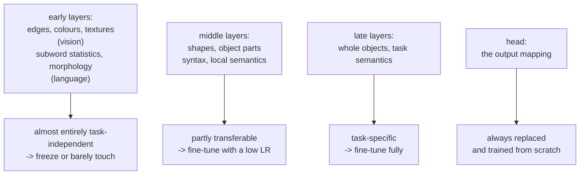

# Transfer Learning and Fine-Tuning

Training from scratch is now the exception. The default workflow is to take a
model that has already learned general structure from a very large corpus and
adapt it — which changes the data requirement from millions of labelled examples
to hundreds, and the compute requirement from weeks to minutes.

## Why transfer works

Deep networks learn a **hierarchy** of features, and the lower levels are
task-independent.



The empirical fact underneath: the first-layer filters of a network trained on
ImageNet look like Gabor filters, and so do the first-layer filters of a network
trained on medical images, satellite imagery, or paintings. **Nothing about the
task determines them**, so learning them again is wasted effort.

The same holds in language: the early layers of any transformer model tokenise,
resolve morphology, and track local syntax. Those are properties of the language,
not of your classification task.

## The adaptation ladder

| Strategy | Trainable | Data needed | When |
|---|---|---|---|
| **Zero-shot / prompting** | nothing | 0 | a capable instruction-tuned model already does the task |
| **Few-shot / in-context** | nothing | 3–50 examples in the prompt | task is demonstrable, latency and cost allow |
| **RAG** | nothing | a document corpus | the gap is *knowledge*, not capability |
| **Linear probe / feature extraction** | a new head only | 100s | tiny data, very different task, or you need embeddings anyway |
| **Partial fine-tuning** | the last $k$ blocks + head | 1k–10k | moderate data, related domain |
| **PEFT (LoRA/QLoRA)** | 0.1–1% of parameters | 1k–100k | the default for LLMs |
| **Full fine-tuning** | everything | 10k+ | large data, or a substantially different domain |
| **Continued pretraining** | everything, self-supervised | a large domain corpus | a genuinely different domain (legal, code, biomedical) |
| **From scratch** | everything | millions | no suitable pretrained model exists |

**Work down this list, not up.** Each step costs more and constrains you more.
Most projects that reach for fine-tuning should have tried prompting and
retrieval first, and a meaningful fraction would have been fine there.

## Feature extraction

Freeze the backbone, replace and train the head.

```python
model = torchvision.models.resnet50(weights="IMAGENET1K_V2")
for p in model.parameters():
    p.requires_grad = False
model.fc = nn.Linear(2048, num_classes)          # new head, requires_grad=True by default
opt = torch.optim.AdamW(model.fc.parameters(), lr=1e-3)
```

Fast, memory-light, and impossible to overfit badly — the head has few
parameters. The equivalent for text is extracting sentence embeddings and
training a logistic regression on them, which remains an unreasonably strong
baseline for text classification with a few hundred labels.

Note that with the backbone frozen you can **precompute the features once** and
train the head on cached vectors, which makes iteration nearly instantaneous.

## Full fine-tuning

Unfreeze everything and train with a small learning rate.

```python
opt = torch.optim.AdamW([
    {"params": model.backbone.parameters(), "lr": 1e-5},   # gentle on pretrained weights
    {"params": model.head.parameters(),     "lr": 1e-3},   # aggressive on the new head
], weight_decay=0.01)
```

**Discriminative learning rates** — lower for earlier layers, higher for later
ones — reflect the hierarchy: early features barely need to change, the head
needs to be learned outright. A common scheme multiplies the learning rate by a
factor of 2.6 per layer group going upward.

**Gradual unfreezing** is the other standard technique: train the head alone
first, then unfreeze one block at a time. It avoids large early gradients from
the random head destroying the pretrained backbone.

Typical hyperparameters for fine-tuning a pretrained encoder: learning rate
$2\times10^{-5}$ to $5\times10^{-5}$, 2–4 epochs, warmup 6%, weight decay 0.01,
and early stopping. Rates suitable for training from scratch ($10^{-3}$) destroy
pretrained weights within a few hundred steps.

## Catastrophic forgetting

Fine-tuning on a narrow task degrades general capability, sometimes severely. The
model has no mechanism to protect what it previously knew — gradient descent on
the new loss simply moves the weights.

| Mitigation | Idea |
|---|---|
| Lower learning rate, fewer epochs | move less |
| **PEFT** | the base weights are frozen and mathematically unchanged |
| Replay / data mixing | include 5–20% general data in the fine-tuning mix |
| **KL regularisation to the base model** | penalise divergence from the original output distribution |
| Elastic weight consolidation | penalise changes to parameters the Fisher information says matter |
| Model averaging (WiSE-FT, model soups) | interpolate fine-tuned and base weights |
| Adapter composition | keep task adapters separate, swap per request |

**Weight interpolation is the surprising cheap win.** Simply averaging the base
and fine-tuned weights, $\theta_\alpha = (1-\alpha)\theta_{\text{base}} +
\alpha\theta_{\text{ft}}$, often retains most of the fine-tuned task performance
while recovering most of the lost general performance. It costs one addition.

## LoRA

The dominant PEFT method, and worth understanding precisely.

**The observation**: the *update* $\Delta W$ learned during fine-tuning has low
intrinsic rank — adaptation does not need the full expressivity of a $d\times k$
matrix. So parameterise it as a product of two thin matrices:

$$W' = W_0 + \Delta W = W_0 + \frac{\alpha}{r}BA, \qquad B\in\mathbb{R}^{d\times r},\; A\in\mathbb{R}^{r\times k},\; r \ll \min(d,k)$$

| Property | Detail |
|---|---|
| $W_0$ | **frozen** — no gradients, no optimiser state |
| $A$ | initialised $\mathcal{N}(0,\sigma^2)$ |
| $B$ | initialised **zero**, so $\Delta W = 0$ and training starts exactly at the pretrained model |
| Trainable parameters | $r(d+k)$ instead of $dk$ |
| Inference | $B A$ can be **merged into $W_0$** — zero added latency |

Concretely, for $d = k = 4096$ and $r = 16$: $131{,}072$ trainable parameters
against $16.8$M — a **128× reduction**, and the optimiser state shrinks by the
same factor.

```python
from peft import LoraConfig, get_peft_model

cfg = LoraConfig(
    r=16, lora_alpha=32, lora_dropout=0.05, bias="none",
    target_modules=["q_proj", "k_proj", "v_proj", "o_proj",
                    "gate_proj", "up_proj", "down_proj"],
    task_type="CAUSAL_LM",
)
model = get_peft_model(model, cfg)
model.print_trainable_parameters()      # trainable: 0.24% || all: 8.03B
```

| Hyperparameter | Guidance |
|---|---|
| `r` | 8–16 for style, format, and tone; 32–64 for new knowledge or hard tasks |
| `lora_alpha` | commonly $2r$; the effective scale is $\alpha/r$ |
| `target_modules` | attention projections at minimum; **including the MLP projections consistently helps** |
| `lora_dropout` | 0.05–0.1 on small datasets |
| learning rate | 1e-4 to 3e-4 — ~10× higher than full fine-tuning, since the base is frozen |

**QLoRA** adds 4-bit quantisation of the frozen base — NF4 (a
normal-distribution-optimal quantisation), double quantisation of the scales, and
paged optimiser states to survive memory spikes. A 70B model becomes trainable on
a single 48 GB GPU. The base is quantised, the LoRA parameters stay in bf16, and
computation dequantises on the fly.

**Multi-tenancy is LoRA's underrated advantage.** One base model can serve dozens
of task-specific adapters, swapped per request. vLLM and TGI support this
natively, and it is a strong architectural argument for LoRA over full
fine-tuning in any product with several specialised behaviours.

### The PEFT family

| Method | Mechanism | Parameters | Inference cost |
|---|---|---|---|
| **LoRA** | low-rank update | 0.1–1% | zero when merged |
| **QLoRA** | LoRA + 4-bit frozen base | 0.1–1% | zero when merged |
| **DoRA** | decomposes into magnitude and direction | ~LoRA | zero when merged |
| Adapters | bottleneck layers inserted in blocks | 1–5% | adds latency |
| Prefix tuning | learned key/value prefixes per layer | 0.1% | consumes context |
| Prompt tuning | learned soft tokens at the input | < 0.1% | consumes context |
| IA³ | learned rescaling vectors | < 0.1% | negligible |
| BitFit | train biases only | ~0.1% | zero |

LoRA and its variants dominate because they combine competitive quality with zero
inference overhead. Prompt and prefix tuning are cheaper still but consistently
weaker and consume context budget.

## Domain adaptation

When the input distribution shifts but the task stays the same.

| Setting | Labels in target domain | Approach |
|---|---|---|
| Supervised | yes | fine-tune on target data |
| Semi-supervised | a few | fine-tune plus pseudo-labelling |
| **Unsupervised (UDA)** | none | domain-adversarial training, feature alignment (CORAL, MMD), self-training |
| Test-time adaptation | none, at inference | update BatchNorm statistics or use entropy minimisation |
| Domain generalisation | none, unseen domain | train on multiple domains, strong augmentation |

**Domain-adversarial training** (DANN) trains a domain classifier on the features
and a gradient-reversal layer that pushes the encoder to make features
domain-indistinguishable. Simple and effective when the label spaces match.

The cheapest and often most effective intervention for a domain shift is
**continued pretraining**: run the model's original self-supervised objective on
unlabelled target-domain text or images before fine-tuning. For legal, biomedical,
or code domains this consistently beats fine-tuning alone.

## Knowledge distillation

Train a small student to match a large teacher's outputs.

$$L = \alpha\,T^2\,\mathrm{KL}\bigl(p_{\text{teacher}}^{T}\,\Vert\, p_{\text{student}}^{T}\bigr) + (1-\alpha)\,\mathrm{CE}(y, p_{\text{student}})$$

with softened distributions $p^T = \mathrm{softmax}(z/T)$ and $T > 1$.

**The teacher's "dark knowledge" is the point.** A hard label says "this is a 7".
The teacher's distribution says "this is a 7, and it looks somewhat like a 1, and
not at all like an 8" — relative probabilities over wrong classes that carry real
information about the input, which a one-hot label simply does not contain. The
$T^2$ factor compensates for the gradient scaling introduced by the temperature.

| Variant | Matches |
|---|---|
| Response distillation | output distributions |
| Feature distillation | intermediate representations |
| Attention transfer | attention maps |
| Self-distillation | a student of the same size — still helps |
| Sequence-level (LLMs) | generated sequences, not just token distributions |
| **On-policy distillation** | teacher outputs on the *student's* own generations |

Distillation is how production-sized models are made: DistilBERT retains ~97% of
BERT's performance at 40% of the size and 60% faster inference. The modern LLM
version — training a small model on a large model's generations — is how most
small open models are produced.

## Fine-tune, retrieve, or prompt?

The most consequential decision in an LLM project, and it is usually made wrong.

| Need | Solution | Why |
|---|---|---|
| Knowledge that changes | **RAG** | update the index, not the weights |
| Private or proprietary facts | **RAG** | with access control at retrieval time |
| Attribution and citations | **RAG** | you can point at the source |
| A specific output format or style | **fine-tuning** | prompting is unreliable at scale, and consumes context |
| A specialised task the base model does poorly | **fine-tuning** | new capability, not new facts |
| Lower latency and cost | **fine-tuning** | a small fine-tuned model beats a large prompted one |
| A domain the model has barely seen | **continued pretraining**, then fine-tune | vocabulary and structure are unfamiliar |
| Quick iteration, low volume | **prompting** | no training, instant changes |
| Behaviour, tone, refusal policy | **fine-tuning** (or preference tuning) | prompting can be circumvented |

**The clearest rule: fine-tuning teaches *behaviour*, retrieval supplies
*knowledge*.** Fine-tuning a model on your documentation to make it answer
questions about your product is the standard mistake — the facts will be
memorised imperfectly, will not be attributable, and will be stale the moment the
documentation changes. RAG solves that problem directly.

In practice the strongest systems combine them: fine-tune for format,
tool-calling, and domain tone; retrieve for facts.

## Practical checklist

- **Match the preprocessing to the pretrained model.** The same tokenizer, the
  same image normalisation statistics, the same input resolution. Mismatches are
  silent and destroy performance.
- **Use a much lower learning rate than training from scratch** — 10–100×
  lower.
- **Warm up.** A random head produces large early gradients that damage the
  backbone.
- **Watch for overfitting immediately.** Fine-tuning on small data overfits
  within one or two epochs; evaluate every few hundred steps, not every epoch.
- **Freeze or use PEFT when data is small.** Fewer than ~1,000 examples rarely
  justifies full fine-tuning.
- **Check the licence.** Model weights carry licences that restrict commercial
  use and derivative models.
- **Evaluate on general capability too**, not only your task — that is how you
  detect forgetting.
- **Version the base model.** "Fine-tuned from Llama-3.1-8B-Instruct at commit
  abc123" is the reproducibility unit.

## Self-check

1. Why do the early layers of networks trained on completely different image
   datasets look alike?
2. Write the LoRA update and explain why $B$ is initialised to zero.
3. Compute the trainable-parameter reduction for $d=k=4096$, $r=8$.
4. Why does LoRA add no inference latency when merged?
5. Give three defences against catastrophic forgetting and say which one is
   nearly free.
6. Your model must answer questions about internal documents that change weekly.
   Fine-tune or retrieve? Justify it.
7. What is "dark knowledge" in distillation, and why does label smoothing hurt
   it?

## Where to go next

- [Self-Supervised Learning](./self-supervised-learning.md) — how the pretrained
  models are made.
- [Attention & Transformers](./attention-and-transformers.md) — the architecture
  being adapted.
- [Hugging Face ecosystem](../libraries.md) — `peft`, `trl`, and the tooling.
