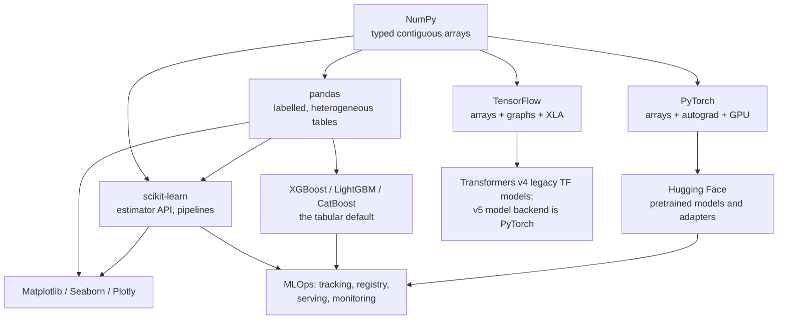

# Libraries for ML

Every library on this page is a set of decisions about how to represent data and
what to make cheap. NumPy decided on contiguous typed buffers. Pandas added
labels and paid for it with alignment surprises. PyTorch made the graph an
execution trace. Understanding those decisions is what turns API memorisation
into judgement — and it is what interviewers are actually probing when they ask
"why is this slow?"

## Topics

| Topic | Level | What it covers |
|---|---|---|
| [NumPy](./libraries/numpy.md) | beginner | ndarrays, strides, broadcasting, vectorization, views vs copies, einsum, performance rules |
| [Pandas](./libraries/pandas.md) | beginner | the Index and alignment, dtypes and memory, groupby internals, joins, reshaping, time series |
| [Scikit-learn](./libraries/scikit-learn.md) | beginner | the estimator API, pipelines as a leakage firewall, cross-validation, metrics, calibration |
| [PyTorch](./libraries/pytorch.md) | intermediate | tensors, autograd, nn.Module, dataloaders, the training loop, mixed precision, DDP, torch.compile |
| [TensorFlow & Keras](./libraries/tensorflow.md) | intermediate | eager vs graph, tf.function and tracing, three Keras APIs, tf.data, distribution strategies, TFLite |
| [Boosting Libraries](./libraries/boosting-libraries.md) | intermediate | gradient boosting derived, XGBoost vs LightGBM vs CatBoost, tuning that converges, SHAP |
| [Visualization](./libraries/visualization.md) | beginner | Matplotlib's object model, Seaborn, the plots that matter in ML, colour, anti-patterns |
| [Hugging Face](./libraries/huggingface.md) | intermediate | transformers, tokenizers, datasets, PEFT/LoRA, TRL, generation, deployment |
| [MLOps & Serving](./libraries/mlops-and-serving.md) | advanced | tracking, versioning, feature stores, serving patterns, monitoring, drift, CI/CD |

## How they stack

## Which one for which job

| Problem | Reach for |
|---|---|
| A table with 10k–10M rows | LightGBM or CatBoost, wrapped in a scikit-learn Pipeline |
| A table with < 1k rows | regularised linear model, or CatBoost with default settings |
| Images | PyTorch + `timm`, or a pretrained vision backbone from Hugging Face |
| Text classification | a fine-tuned encoder (DeBERTa, RoBERTa) via `transformers` |
| Text generation, chat, extraction | a pretrained LLM + LoRA via `peft`, served with vLLM |
| Time series forecasting | boosted trees on lag features first; deep models only if that plateaus |
| Anything on a phone or in a browser | TensorFlow → TFLite / TF.js, or ONNX Runtime |
| CPU-constrained inference | benchmark native execution against supported ONNX/LiteRT exports and calibrated quantization |
| Exploring a new dataset | pandas + Seaborn, in that order |

## A note on what changes and what does not

APIs move. `pandas` 3.0 makes copy-on-write mandatory, Keras went
multi-backend, `torch.compile` optimizes execution while `torch.export` addresses
export, and scikit-learn's set-output
API changed how transformers return frames. None of that changes the underlying
ideas: contiguous memory is fast, index alignment is silent, fitting outside a
cross-validation fold leaks, and gradients accumulate.

Learn the model each library imposes and the API churn becomes a lookup, not a
relearning.

The selection table gives starting hypotheses, not row-count laws. Benchmark the
actual sparse/dense representation, task, quality target, memory, and latency.
An export that runs but changes predictions is not a successful optimization.
[PyTorch export](https://docs.pytorch.org/docs/stable/export.html) and the
[Transformers v5 migration guide](https://github.com/huggingface/transformers/blob/main/MIGRATION_GUIDE_V5.md)
describe the distinct current backend/export contracts.

### Reproducible learning paths

Start tabular work with NumPy, pandas, evaluation, and scikit-learn before comparing
boosters. Start deep learning with array shapes and derivatives before either
framework, then Hugging Face. Serving assumes a fitted preprocessing/model artifact,
an immutable version, and a known prediction schema, not just an endpoint.

Record Python and package versions with `importlib.metadata.version`; distinguish
CPU examples from CUDA, TensorFlow, remote-checkpoint, and optional serving extras.
An example labeled `python runnable` is a self-contained local fixture; other
fragments declare surrounding state or external prerequisites. Do not install all
GPU runtimes into one environment merely to reproduce a table.

A cross-library capstone should retain one fixed train/development/test manifest:
clean a synthetic transaction table, fit a fold-local pipeline, compare a boosted
baseline, inspect calibration and subgroup counts, and package its schema and
prediction fixtures for serving. Passing means reordered columns are handled or
rejected explicitly, fitted transforms exclude validation rows, and offline and
served outputs agree within a declared tolerance. Conversion boundaries must record
whether labels, nullable dtypes, sparse structure, or device placement are lost.
