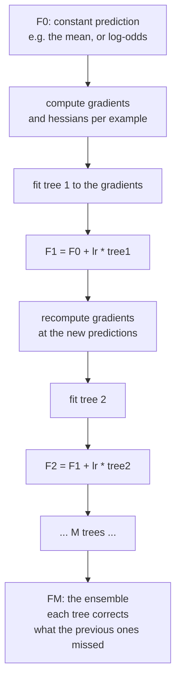

# Boosting Libraries: XGBoost, LightGBM, CatBoost

If your data is a table, a gradient-boosted tree ensemble is the model to beat.
That has been true since 2015 and, despite a decade of attempts, remains true:
controlled benchmarks on medium-sized tabular data consistently find boosted
trees matching or beating deep tabular architectures while training in a
fraction of the time and needing far less tuning.

This page explains why the algorithm works, then what the three major
implementations actually do differently.

## Gradient boosting from first principles

Boosting builds an additive model, one weak learner at a time, where each new
learner fits the **errors** of the ensemble so far.

$$F_0(x) = \arg\min_\gamma \sum_i \ell(y_i, \gamma), \qquad F_m(x) = F_{m-1}(x) + \eta \, h_m(x)$$

The insight that turns this into a general algorithm: fit $h_m$ to the **negative
gradient** of the loss with respect to the current predictions.

$$r_{im} = -\left[\frac{\partial \ell(y_i, F(x_i))}{\partial F(x_i)}\right]_{F = F_{m-1}}$$

For squared error, $r_{im} = y_i - F_{m-1}(x_i)$ — literally the residual. For
log-loss, it is $y_i - p_i$. **This is gradient descent in function space**: each
tree is a step in the direction that most reduces the loss, and $\eta$ is the
learning rate.



### XGBoost's second-order objective

XGBoost's original contribution was to Taylor-expand the loss to **second** order
and add explicit regularisation:

$$\mathcal{L}^{(m)} \approx \sum_i \left[ g_i h_m(x_i) + \tfrac12 h_i h_m(x_i)^2 \right] + \Omega(h_m), \qquad \Omega(h) = \gamma T + \tfrac12\lambda\|w\|^2$$

with $g_i$ the first derivative, $h_i$ the second, and $T$ the number of leaves.
Minimising over leaf weights gives a closed form:

$$w_j^\star = -\frac{\sum_{i \in I_j} g_i}{\sum_{i \in I_j} h_i + \lambda}, \qquad \mathcal{L}^\star = -\frac12 \sum_j \frac{(\sum_{i\in I_j} g_i)^2}{\sum_{i\in I_j} h_i + \lambda} + \gamma T$$

and the **gain** of a candidate split is the improvement in $\mathcal{L}^\star$:

$$\text{Gain} = \tfrac12\left[\frac{G_L^2}{H_L+\lambda} + \frac{G_R^2}{H_R+\lambda} - \frac{(G_L+G_R)^2}{H_L+H_R+\lambda}\right] - \gamma$$

Three things fall out of this formula and are worth reading off it directly:

- **$\lambda$ shrinks leaf values** toward zero — it is L2 regularisation on the
  leaf weights.
- **$\gamma$ is a minimum gain threshold.** A split whose improvement is below
  $\gamma$ is not made, which is pre-pruning by cost.
- **Second-order information adapts the step size per leaf.** $H$ in the
  denominator means confident regions take smaller steps, which is why XGBoost
  needs less learning-rate tuning than first-order boosting.

### Boosting vs bagging

| | Bagging (Random Forest) | Boosting (GBM family) |
|---|---|---|
| Trees are | independent, parallel | sequential, each fits the last one's errors |
| Base learners | deep, low bias, high variance | shallow, high bias, low variance |
| Reduces | variance | **bias** (and variance, via shrinkage) |
| Overfits with more trees? | no, it plateaus | **yes** — needs early stopping |
| Parallelism | across trees | within a tree (split finding) only |
| Tuning sensitivity | low | moderate to high |
| Typical accuracy on tabular | good | usually better |

That "overfits with more trees" row is the practical difference. A random forest
with 5,000 trees is fine; a booster with 5,000 trees and no early stopping is
usually worse than the same model stopped at 400.

## The three libraries

### XGBoost — the exact-ish one

The original scalable implementation. Its defining features:

- **Second-order objective** with explicit $\lambda$, $\alpha$, and $\gamma$
  regularisation.
- **Level-wise (depth-wise) tree growth** by default: grow every node at a depth
  before descending. Balanced trees, controlled by `max_depth`.
- **Sparsity-aware split finding**: missing values get a learned default
  direction at each split rather than being imputed.
- **Weighted quantile sketch** for approximate split finding on large data.
- Mature GPU support (`device="cuda"`, `tree_method="hist"`), distributed
  training, and integrations everywhere.

```python
import xgboost as xgb

clf = xgb.XGBClassifier(
    n_estimators=5000, learning_rate=0.03,
    max_depth=6, min_child_weight=5,
    subsample=0.8, colsample_bytree=0.8,
    reg_lambda=1.0, reg_alpha=0.0, gamma=0.0,
    tree_method="hist", device="cuda",
    eval_metric="aucpr", early_stopping_rounds=100,
    enable_categorical=True,
)
clf.fit(X_train, y_train, eval_set=[(X_val, y_val)], verbose=100)
print(clf.best_iteration, clf.best_score)
```

### LightGBM — the fast one

Microsoft's implementation, built around two ideas plus a different growth
strategy.

- **Leaf-wise growth**: always split the leaf with the highest gain, anywhere in
  the tree. This reaches a lower loss for the same number of leaves, but produces
  deep, unbalanced trees that overfit small datasets. Control with
  `num_leaves` (the primary complexity knob) and `min_data_in_leaf`, not
  `max_depth`.
- **GOSS** (Gradient-based One-Side Sampling): keep all large-gradient examples
  and randomly sample the small-gradient ones, reweighting to stay unbiased.
  Fewer examples per split evaluation, same information.
- **EFB** (Exclusive Feature Bundling): bundle mutually exclusive sparse features
  (they are rarely non-zero simultaneously) into single features, shrinking the
  effective feature count on one-hot-heavy data.
- **Histogram binning** of continuous features into 255 buckets, which turns
  split finding from a sort into a histogram scan.

```python
import lightgbm as lgb

clf = lgb.LGBMClassifier(
    n_estimators=5000, learning_rate=0.03,
    num_leaves=63, min_child_samples=40,
    subsample=0.8, subsample_freq=1, colsample_bytree=0.8,
    reg_lambda=1.0, max_bin=255,
    objective="binary", metric="average_precision",
)
clf.fit(X_train, y_train, eval_set=[(X_val, y_val)],
        categorical_feature=cat_cols,
        callbacks=[lgb.early_stopping(100), lgb.log_evaluation(100)])
```

**The `num_leaves` trap.** A depth-$d$ level-wise tree has $2^d$ leaves. Setting
`num_leaves=1024` with the intent of "depth 10" gives LightGBM licence to build
a wildly unbalanced tree that memorises the training set. The usual guidance is
`num_leaves < 2^max_depth`, and in practice 31–127 covers most problems.

### CatBoost — the categorical one

Yandex's implementation, designed around two specific biases in the standard
algorithm.

- **Ordered target statistics.** Naive target encoding uses a category's mean
  target computed from all rows *including the current one*, which leaks. CatBoost
  processes examples in a random permutation and computes each row's encoding
  using only rows that precede it — an out-of-time estimate that is unbiased by
  construction.
- **Ordered boosting.** The same leak exists in gradient estimation: the residual
  for a training row is computed from a model that was fit on that row. CatBoost
  maintains models trained on prefixes of a permutation to remove this
  "prediction shift".
- **Oblivious (symmetric) trees.** Every node at a given depth uses the *same*
  split. That is a strong regulariser and makes inference extremely fast — a tree
  becomes a bit-index into a lookup table, which is why CatBoost has the best CPU
  inference latency of the three.
- **Native categorical and text features**, plus automatic combinations of
  categorical features.

```python
from catboost import CatBoostClassifier, Pool

train_pool = Pool(X_train, y_train, cat_features=cat_cols, text_features=text_cols)
val_pool   = Pool(X_val,   y_val,   cat_features=cat_cols, text_features=text_cols)

clf = CatBoostClassifier(
    iterations=5000, learning_rate=0.03, depth=6,
    l2_leaf_reg=3.0, loss_function="Logloss", eval_metric="PRAUC",
    early_stopping_rounds=100, task_type="GPU", verbose=200,
)
clf.fit(train_pool, eval_set=val_pool)
```

### Side by side

| | XGBoost | LightGBM | CatBoost |
|---|---|---|---|
| Tree growth | level-wise (leaf-wise available) | **leaf-wise** | **oblivious/symmetric** |
| Main complexity knob | `max_depth` | `num_leaves` | `depth` |
| Speed on large data | fast | **fastest** | moderate |
| Small-data robustness | good | overfits more easily | **best** |
| Categorical handling | one-hot or `enable_categorical` | integer codes, native | **ordered target statistics** |
| Missing values | learned default direction | native | native |
| Default hyperparameters | need tuning | need tuning | **often good as-is** |
| Inference latency | good | good | **best** (symmetric trees) |
| Text features | no | no | yes |
| GPU training | mature | mature | mature |
| Overfitting protection | $\gamma$, $\lambda$, `min_child_weight` | `min_data_in_leaf`, `num_leaves` | ordered boosting, symmetric trees |

**A reasonable default policy**: LightGBM when rows exceed ~1M or you are
iterating quickly; CatBoost when categoricals dominate or data is small;
XGBoost when you want the most predictable, best-documented behaviour or you are
matching an existing production model. On most problems all three land within
noise of each other after tuning, and an average of their predictions beats any
one of them.

## Hyperparameters that matter, in order

| Rank | Parameter | Effect | Sensible range |
|---|---|---|---|
| 1 | `n_estimators` + early stopping | the number of trees; **let early stopping choose it** | 5000 cap, `early_stopping_rounds=100` |
| 2 | `learning_rate` | step size; lower needs more trees | 0.01–0.1 |
| 3 | `max_depth` / `num_leaves` | model capacity | depth 3–10; leaves 15–255 |
| 4 | `min_child_weight` / `min_data_in_leaf` | minimum evidence per leaf | 1–100; raise on noisy data |
| 5 | `subsample` (row sampling) | stochastic boosting, decorrelates trees | 0.6–1.0 |
| 6 | `colsample_bytree` (feature sampling) | decorrelates trees, speeds training | 0.4–1.0 |
| 7 | `reg_lambda` (L2) | shrinks leaf values | 0–10, log scale |
| 8 | `reg_alpha` (L1) | sparsifies leaf values | 0–10, log scale |
| 9 | `gamma` / `min_split_gain` | minimum gain to split | 0–5 |
| 10 | `scale_pos_weight` | class imbalance | $n_{neg}/n_{pos}$ |

**The learning-rate/trees trade-off is the core one.** Halving the learning rate
roughly doubles the number of trees needed and usually improves final accuracy a
little. A practical workflow: tune structure at `learning_rate=0.1` for speed,
then drop to 0.02–0.03 with early stopping for the final model.

### A tuning recipe that converges

```python
import optuna

def objective(trial):
    params = dict(
        learning_rate    = 0.03,
        num_leaves       = trial.suggest_int("num_leaves", 15, 255, log=True),
        min_child_samples= trial.suggest_int("min_child_samples", 5, 300, log=True),
        subsample        = trial.suggest_float("subsample", 0.5, 1.0),
        subsample_freq   = 1,
        colsample_bytree = trial.suggest_float("colsample_bytree", 0.3, 1.0),
        reg_lambda       = trial.suggest_float("reg_lambda", 1e-3, 30.0, log=True),
        reg_alpha        = trial.suggest_float("reg_alpha", 1e-3, 30.0, log=True),
        n_estimators     = 5000,
    )
    scores = []
    for tr, va in StratifiedKFold(5, shuffle=True, random_state=0).split(X, y):
        m = lgb.LGBMClassifier(**params)
        m.fit(X.iloc[tr], y[tr], eval_set=[(X.iloc[va], y[va])],
              callbacks=[lgb.early_stopping(100, verbose=False)])
        scores.append(average_precision_score(y[va], m.predict_proba(X.iloc[va])[:, 1]))
    return np.mean(scores)

study = optuna.create_study(direction="maximize",
                            pruner=optuna.pruners.MedianPruner())
study.optimize(objective, n_trials=100)
```

Two details make this correct rather than merely plausible: the learning rate is
**fixed** so trials are comparable and early stopping does the tree-count search,
and the objective is cross-validated so a lucky single split cannot win.

## Categorical features

| Approach | Cardinality | Note |
|---|---|---|
| One-hot | low (< ~15) | explodes dimension; poor for trees at high cardinality |
| Ordinal/label encoding | any | imposes a false order, but trees can partly recover with enough splits |
| Native categorical (LightGBM/XGBoost) | medium | finds an optimal partition of levels per split via a sorted-by-gradient heuristic |
| Target encoding | high | powerful and dangerous — **must** be cross-fitted |
| CatBoost ordered statistics | high | target encoding done correctly by construction |
| Hashing | very high | fixed width, collisions, no fit needed |
| Learned embeddings | very high | requires a neural model |

**Why one-hot is bad for trees at high cardinality**: each one-hot column can
only produce a "this level vs everything else" split, so isolating a group of $k$
levels needs $k$ levels of depth. Native categorical support instead sorts levels
by their gradient statistics and finds the best contiguous partition in one split
— a far better use of tree capacity.

**Target encoding leakage** is the single most common way to get a wonderful CV
score and a broken model. If a category appears once, its target mean *is* its
target. Always cross-fit (encode each fold using only the other folds), and add
smoothing toward the global mean:

$$\text{enc}(c) = \frac{n_c \bar{y}_c + m \bar{y}}{n_c + m}$$

## Imbalanced data

```python
XGBClassifier(scale_pos_weight=neg/pos)              # reweights the positive gradient
LGBMClassifier(is_unbalance=True)                    # or class_weight="balanced"
CatBoostClassifier(auto_class_weights="Balanced")
```

Class weighting changes what the model optimises, but it also **decalibrates the
probabilities** — a reweighted model no longer predicts the true base rate. If
you need calibrated probabilities, train unweighted, then tune the decision
threshold on a validation set, and check a reliability diagram. Optimising
`aucpr`/`average_precision` as the early-stopping metric matters more than the
weighting in most cases.

## Interpretation

```python
import shap
explainer = shap.TreeExplainer(model)
sv = explainer(X_val)
shap.summary_plot(sv, X_val)                # global: which features, which direction
shap.plots.waterfall(sv[0])                 # local: this prediction, explained
shap.plots.dependence("age", sv, X_val)     # interaction with the strongest partner
```

**TreeSHAP is exact and fast** for tree ensembles — polynomial rather than
exponential in features — which is why SHAP became the default explanation tool
in tabular ML. Its values are additive: each prediction decomposes as the base
value plus one contribution per feature.

Built-in importances are much weaker and should be read with care:

| Importance type | What it measures | Bias |
|---|---|---|
| `weight` / `split` | number of times a feature is split on | favours high-cardinality features |
| `gain` | total loss reduction from its splits | better, still training-set-based |
| `cover` | number of examples affected | rarely what you want |
| permutation | held-out degradation when shuffled | honest, but misleading under correlation |
| SHAP | per-example additive attribution | the best default; still not causal |

**None of these are causal.** A feature can be important because it is a proxy
for something else, or because it leaks the target. High importance on an
unexpected feature is a signal to investigate leakage, not to celebrate.

## Why trees still beat deep learning on tabular data

Reproducible benchmark findings, in the order they matter:

1. **Rotational invariance is the wrong inductive bias.** Neural networks treat
   all directions in feature space alike; tabular features are individually
   meaningful and axis-aligned splits exploit that.
2. **Robustness to uninformative features.** Trees simply never split on them;
   MLPs must learn to ignore them, and often do so imperfectly.
3. **Irregular target functions.** Real tabular targets are full of thresholds
   and non-smooth jumps. Trees model those exactly; smooth networks approximate
   them poorly.
4. **No preprocessing requirements.** Monotone feature transforms do not change a
   tree's splits, missing values are handled natively, and mixed scales are
   irrelevant.
5. **Vastly less tuning.** A default LightGBM is usually within a few percent of
   its tuned self. A default MLP is often unusable.

Deep tabular models (TabNet, FT-Transformer, SAINT, TabPFN) close the gap in
specific regimes — very large datasets, heavy multi-modality, transfer across
related tables, or very small datasets in TabPFN's case — but the default answer
for a table with 10k–10M rows remains a boosted ensemble.

## Production notes

```python
model.save_model("model.json")             # XGBoost: JSON/UBJ, version-portable
model.booster_.save_model("model.txt")     # LightGBM: plain text
model.save_model("model.cbm")              # CatBoost: native binary
```

- **Save the native format, not a pickle.** Native formats survive library
  upgrades; pickles frequently do not.
- **Pin the library version** with the artefact anyway; split thresholds and
  histogram binning can change between versions.
- **Record `best_iteration`** and use it at inference (`num_iteration=` /
  `ntree_limit=`) — otherwise you serve the overfitted full ensemble.
- **Freeze the feature order and names.** All three libraries index by position
  internally; a reordered frame silently produces garbage.
- **For latency**, CatBoost's symmetric trees are fastest; alternatively compile
  the ensemble with Treelite/`lleaves` for a large single-row speedup.
- **Monitor feature drift**, not just prediction drift. Trees extrapolate
  terribly — a feature moving outside its training range gets clipped to the
  outermost leaf, which fails silently rather than loudly.

## Self-check

1. Write the gradient boosting update, and say what $h_m$ is fit to.
2. Read $\gamma$ and $\lambda$ off the XGBoost gain formula and say what each
   does.
3. Why does `num_leaves=1024` overfit LightGBM even with a small learning rate?
4. Explain the leak that CatBoost's ordered target statistics prevent.
5. Your booster's validation score improves for 300 trees then degrades. What is
   happening, and what is the fix?
6. When is one-hot encoding actively harmful for a tree model?
7. Give three reasons boosted trees beat MLPs on tabular data.

## Where to go next

- [Scikit-learn](./scikit-learn.md) — `HistGradientBoosting`, pipelines, and
  leak-free cross-validation.
- [Pandas](./pandas.md) — building the table these models consume.
- [Machine Learning notes](../ml.md) — trees, ensembles, and the bias–variance
  reasoning behind boosting.
