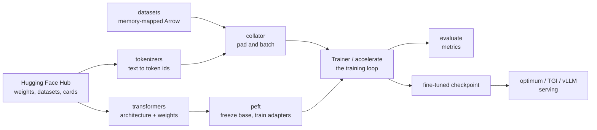

# The Hugging Face Ecosystem

Nobody trains a language model from scratch to solve a business problem. The
default workflow is: find a pretrained checkpoint, adapt it, evaluate it, serve
it. Hugging Face is the toolchain that makes each of those four steps a few lines
rather than a few weeks, and it has become the de facto standard interface for
open models.

## The libraries and what each does

| Library | Job |
|---|---|
| `transformers` | model architectures + pretrained weights + tokenizers + `Trainer` |
| `tokenizers` | fast Rust BPE/WordPiece/Unigram implementations |
| `datasets` | memory-mapped, streamable dataset loading and processing |
| `accelerate` | device placement and distributed training without rewriting the loop |
| `peft` | LoRA, QLoRA, prefix tuning, IA³ — parameter-efficient fine-tuning |
| `trl` | SFT, reward modelling, PPO, DPO, GRPO for preference tuning |
| `evaluate` | metric implementations with a common interface |
| `safetensors` | a weight format that is fast to load and cannot execute code |
| `optimum` | export and acceleration — ONNX Runtime, OpenVINO, TensorRT, Neuron |
| `diffusers` | diffusion pipelines for image/audio/video generation |
| `huggingface_hub` | download, upload, versioning, and model cards |
| `text-generation-inference` | legacy serving option in maintenance mode; assess active alternatives |



## Loading a model

```python
from transformers import AutoTokenizer, AutoModelForSequenceClassification

name = "microsoft/deberta-v3-base"
id2label = {0: "negative", 1: "positive"}
label2id = {label: index for index, label in id2label.items()}
tok = AutoTokenizer.from_pretrained(name)
model = AutoModelForSequenceClassification.from_pretrained(
    name, num_labels=2, id2label=id2label, label2id=label2id)
```

The `Auto*` classes read the checkpoint's `config.json` and instantiate the right
architecture, which is why the same three lines work for BERT, DeBERTa, RoBERTa,
or a model released next month.

**Pick the head that matches the task**, because it determines the output shape
and the loss:

| `AutoModelFor…` | Task | Output |
|---|---|---|
| `SequenceClassification` | sentiment, intent, NLI | logits over labels |
| `TokenClassification` | NER, POS | logits per token |
| `QuestionAnswering` | extractive QA | start/end logits |
| `CausalLM` | GPT-style generation | logits over the vocabulary |
| `MaskedLM` | BERT-style pretraining | logits at masked positions |
| `Seq2SeqLM` | translation, summarisation (T5, BART) | decoder logits |
| `MultipleChoice` | multiple-choice benchmarks | one logit per option |

```python
import torch
from transformers import AutoModelForCausalLM, AutoTokenizer
causal_name = "meta-llama/Llama-3.1-8B-Instruct"
causal_tok = AutoTokenizer.from_pretrained(causal_name, padding_side="left")
if causal_tok.pad_token_id is None:
    causal_tok.pad_token = causal_tok.eos_token
causal_model = AutoModelForCausalLM.from_pretrained(
    "meta-llama/Llama-3.1-8B-Instruct",
    dtype=torch.bfloat16,
    device_map="auto",             # shard across available GPUs, offload if needed
    attn_implementation="flash_attention_2",
)
```

`device_map="auto"` uses `accelerate` to place layers across GPUs, CPU, and disk
by available memory. Convenient for experimentation; for production, place
deliberately or use a serving engine.

**Prefer `safetensors`.** PyTorch `.bin` checkpoints are pickles and executing an
untrusted one runs arbitrary code. `safetensors` is a flat, zero-copy,
memory-mappable format that cannot execute anything, and it loads faster.
This protects tensor deserialization, not arbitrary repository Python enabled by
`trust_remote_code=True`. Pin a reviewed immutable revision for model, tokenizer
and adapter, keep remote code disabled unless separately reviewed, and verify the
checkpoint license and authentication requirements. The large causal example
requires compatible accelerator memory and FlashAttention dependencies; it is not
the classification model reused below.

## Tokenizers

```python
enc = tok(
    texts, padding=True, truncation=True, max_length=512,
    return_tensors="pt", return_attention_mask=True,
)
enc.keys()      # input_ids, attention_mask, (token_type_ids for BERT-likes)
```

| Argument | Meaning |
|---|---|
| `padding` | `True`/`"longest"` pads to the longest in batch; `"max_length"` pads to `max_length` |
| `truncation` | cut sequences longer than `max_length` |
| `return_offsets_mapping` | spans useful for original-text alignment; `word_ids` can align pretokenized word labels without offsets |
| `add_special_tokens` | `[CLS]`/`[SEP]`/BOS/EOS; on by default |
| `return_tensors` | `"pt"`, `"tf"`, `"np"`, or Python lists |

**Pad to the longest in the batch, not to `max_length`.** Padding everything to
512 when the median length is 40 wastes most of your compute on padding tokens.
With a `DataCollatorWithPadding` and length-grouped batching, throughput often
doubles.

**Left vs right padding matters for generation.** Decoder-only models generate
from the last position, so right padding puts pad tokens where the model should
be reading. Set `tok.padding_side = "left"` for batched generation with a causal
LM. This is a genuine silent-garbage bug.

**Alignment for token classification.** Subword tokenization splits words, so
word-level labels must be aligned. The following first-subword policy masks
continuations; supervising all subwords with a consistent BIO policy is another
valid objective:

```python
enc = tok(words, is_split_into_words=True, truncation=True)
labels = []
for i, word_ids in enumerate([enc.word_ids(i) for i in range(len(words))]):
    prev, seq = None, []
    for wid in word_ids:
        if wid is None:           seq.append(-100)      # special token
        elif wid != prev:         seq.append(tags[i][wid])
        else:                     seq.append(-100)      # continuation subword
        prev = wid
    labels.append(seq)
```

`-100` is the ignore index that PyTorch's cross-entropy skips — the standard
convention throughout the library.

**Chat templates** are the correct way to format instruction data. Every
instruct model has its own control tokens, and getting them wrong degrades
quality badly:

```python
messages = [{"role": "system", "content": "You are terse."},
            {"role": "user",   "content": "Explain LoRA in one sentence."}]
prompt = tok.apply_chat_template(messages, tokenize=False, add_generation_prompt=True)
```

Never hand-write `<|im_start|>` strings; let the template do it.

## Datasets

```python
from datasets import load_dataset, DatasetDict

ds = load_dataset("imdb")                       # DatasetDict with train/test
split = ds["train"].train_test_split(test_size=0.1, seed=42)
ds = DatasetDict(train=split["train"], validation=split["test"], test=ds["test"])
# Alternative independent ingestion: local_ds = load_dataset("json", data_files={"train": "train.jsonl"})
stream = load_dataset("c4", "en", split="train", streaming=True)  # downloads during iteration
```

`datasets` stores data as **Apache Arrow on disk, memory-mapped**, so a 500 GB
corpus uses almost no RAM and multiple processes share the same pages.

```python
def preprocess(batch):
    return tok(batch["text"], truncation=True, max_length=512)

ds = ds.map(preprocess, batched=True, batch_size=1000,
            num_proc=8, remove_columns=["text"])
ds = ds.filter(lambda ex: len(ex["input_ids"]) > 10)
ds.set_format("torch", columns=["input_ids", "attention_mask", "label"])
```

| Practice | Why |
|---|---|
| `batched=True` | calls the fast tokenizer once per 1,000 examples instead of per example — often 20× faster |
| `num_proc=` | parallel processing across cores |
| `remove_columns=` | drop raw text so the collator does not choke on strings |
| caching | `map` results are cached on disk by a hash of the function; change the function and it recomputes |
| `streaming=True` | iterate a dataset far larger than disk |

Deduplication before training matters more than most people expect: duplicated
documents in a pretraining corpus cause memorisation and inflate evaluation
scores. MinHash-LSH deduplication is standard practice.

## Fine-tuning with `Trainer`

The following downloaded-model classification track targets **Transformers
4.57.1**, uses the DeBERTa model/tokenizer and the explicit IMDB validation split
above, and assumes bf16-capable training hardware. It writes local training
artifacts; it is not a self-contained CPU lab. Transformers v5 changes backend
and training-argument contracts; current versions use
`train_sampling_strategy="group_by_length"` instead of this pinned v4 boolean.

```python
from transformers import TrainingArguments, Trainer, DataCollatorWithPadding
from sklearn.metrics import accuracy_score, f1_score

def compute_metrics(eval_pred):
    logits, labels = eval_pred
    prediction = logits.argmax(-1)
    return {"accuracy": accuracy_score(labels, prediction),
            "f1": f1_score(labels, prediction, average="macro")}

args = TrainingArguments(
    output_dir="out", num_train_epochs=3,
    per_device_train_batch_size=16, gradient_accumulation_steps=4,
    learning_rate=2e-5, warmup_ratio=0.06, weight_decay=0.01,
    lr_scheduler_type="cosine",
    bf16=True, gradient_checkpointing=True,
    eval_strategy="steps", eval_steps=200, save_steps=200,
    load_best_model_at_end=True, metric_for_best_model="f1",
    logging_steps=50, report_to="none", seed=42,
    group_by_length=True,
)

trainer = Trainer(
    model=model, args=args,
    train_dataset=ds["train"], eval_dataset=ds["validation"],
    data_collator=DataCollatorWithPadding(tok),
    compute_metrics=compute_metrics,
)
trainer.train()
trainer.save_model("out/final")
tok.save_pretrained("out/final")
```

Sensible starting points for full fine-tuning of an encoder: learning rate
$2\times10^{-5}$ to $5\times10^{-5}$, 2–4 epochs, warmup 6%, weight decay 0.01.
Rates that work for training from scratch ($10^{-3}$) will destroy pretrained
weights in some settings; they are not universally invalid. Validate a short
learning-rate pilot instead of assuming a fixed range guarantees a good fit.
Publishing is an explicit opt-in action after privacy, license and repository
visibility checks, not the final line of a beginner training recipe.

`group_by_length=True` batches similar-length sequences together, cutting padding
waste substantially.

For full control, `accelerate` wraps a hand-written loop instead:

```python
from accelerate import Accelerator
acc = Accelerator(mixed_precision="bf16", gradient_accumulation_steps=4)
model, opt, loader, sched = acc.prepare(model, opt, loader, sched)

for batch in loader:
    with acc.accumulate(model):
        loss = model(**batch).loss
        acc.backward(loss)
        opt.step(); sched.step(); opt.zero_grad()
```

The same script then runs on CPU, one GPU, multi-GPU DDP, DeepSpeed, or FSDP
depending on `accelerate config`, with no code changes.

## PEFT and LoRA

Full fine-tuning memory depends on parameter, gradient, optimizer and master-copy
dtypes. A particular 18-byte layout would use about 126 GB for 7B parameters
before activations; ordinary FP32-state autocast has a different accounting.
LoRA reduces trainable state, but unquantized frozen base weights and activations
remain. It does not universally fit a consumer GPU.

**The idea**: freeze $W$ and learn a low-rank update.

$$W' = W + \frac{\alpha}{r}BA, \qquad B \in \mathbb{R}^{d\times r},\; A \in \mathbb{R}^{r\times k},\; r \ll \min(d,k)$$

$A$ is initialised randomly and $B$ to zero, so training starts exactly at the
pretrained model. Only $A$ and $B$ receive gradients — typically 0.1–1% of the
parameters — so optimiser state shrinks by the same factor. At inference the
product can be merged back into $W$, giving **zero added latency**.

```python
from peft import LoraConfig, get_peft_model, prepare_model_for_kbit_training

cfg = LoraConfig(
    r=16, lora_alpha=32, lora_dropout=0.05, bias="none",
    target_modules=["q_proj", "k_proj", "v_proj", "o_proj",
                    "gate_proj", "up_proj", "down_proj"],
    task_type="CAUSAL_LM",
)
lora_model = get_peft_model(causal_model, cfg)
lora_model.print_trainable_parameters()  # measure this exact architecture/configuration
```

| Parameter | Guidance |
|---|---|
| `r` | 8–16 for style/format adaptation; 32–64 for new knowledge or hard tasks |
| `lora_alpha` | commonly $2r$; the effective scale is $\alpha/r$ |
| `target_modules` | attention projections at minimum; **including the MLP projections consistently helps** |
| `lora_dropout` | 0.05–0.1 on small datasets |

**QLoRA** goes further: quantise the frozen base to 4-bit NF4 and train LoRA
adapters on top of it, with paged optimisers to manage memory spikes. Capacity
depends on the exact architecture, sequence length, batch size, optimizer, and
quantisation backend; four-bit base weights are not the entire training footprint.

```python
from transformers import BitsAndBytesConfig

bnb = BitsAndBytesConfig(
    load_in_4bit=True, bnb_4bit_quant_type="nf4",
    bnb_4bit_compute_dtype=torch.bfloat16, bnb_4bit_use_double_quant=True,
)
base = AutoModelForCausalLM.from_pretrained(causal_name, quantization_config=bnb, device_map={"": 0})
base = prepare_model_for_kbit_training(base, use_gradient_checkpointing=True)
qlora_model = get_peft_model(base, cfg)
```

Other PEFT methods worth knowing: **DoRA** (decomposes into magnitude and
direction, usually a small win over LoRA at the same rank), **IA³** (learned
rescaling vectors, even fewer parameters), **prefix/prompt tuning** (learned
virtual tokens, weakest but tiniest), and **adapters** (bottleneck layers,
add inference latency).

**Adapters are composable.** One base model can serve dozens of task-specific
LoRAs, swapped per request — the multi-LoRA serving pattern that vLLM and TGI
support natively, and a strong argument for LoRA over full fine-tuning in
multi-tenant products.

## Preference tuning with TRL

```python
from trl import SFTTrainer, DPOTrainer, SFTConfig, DPOConfig

sft = SFTTrainer(model=qlora_model, processing_class=causal_tok,
                 train_dataset=chat_ds,
                 args=SFTConfig(max_length=2048, packing=False, assistant_only_loss=True))
sft.train()

dpo = DPOTrainer(model=sft.model, ref_model=None,
                 train_dataset=pref_ds, args=DPOConfig(beta=0.1, learning_rate=5e-7))
dpo.train()
```

This is a separate optional **TRL 1.1-style** integration sketch, not code to run
against an arbitrary installed TRL. Define `causal_tok` from the same reviewed
causal checkpoint and provide conversational `chat_ds` with a chat template that
supports assistant masks. Inspect a collated batch and assert user/system/padding
labels are `-100` before training; `packing=True` alone never guarantees masking.
For prompt/completion datasets, explicitly configure `completion_only_loss`
instead. Reference behavior with `ref_model=None` depends on PEFT/adapters and
configuration; establish which frozen policy provides reference log probabilities
rather than assuming it always means the original base. See the
[SFT trainer](https://huggingface.co/docs/trl/v1.1.0/en/sft_trainer).

The standard alignment pipeline:

| Stage | Data | Objective |
|---|---|---|
| **Pretraining** | raw text | next-token prediction |
| **SFT** | (prompt, good response) pairs | supervised next-token on the response only |
| **Reward modelling** | (prompt, chosen, rejected) | Bradley–Terry ranking loss |
| **RLHF (PPO)** | prompts + reward model | maximise reward with a KL penalty toward the SFT model |
| **DPO** | (prompt, chosen, rejected) | direct preference loss under reward/reference assumptions; no separate reward model or online sampling required |
| **GRPO** | prompts + a reward function/model | group-relative advantages; verifiable rewards are one option |

DPO uses an analytic relationship to KL-regularized reward optimization to derive
a preference-classification loss. This is not a closed-form solution of finite-data
RL training or a guarantee that different optimizers return the same policy.
Preference learning rate, reference support and beta need validation; no universal
ratio to SFT's learning rate applies.

`packing=True` in SFT concatenates short examples into full-length sequences,
which can double throughput on chat data where most turns are short.

**Choose and inspect the SFT loss mask.** Response-only training is a common
instruction-tuning objective, not the only valid one. Full-sequence loss also
models prompt tokens. The configured tensor labels, not descriptive prose,
determine which objective is actually trained.

## Generation

```python
causal_tok = AutoTokenizer.from_pretrained(causal_name, padding_side="left")
if causal_tok.pad_token_id is None:
    causal_tok.pad_token = causal_tok.eos_token
enc = causal_tok(["Explain a matrix rank."], return_tensors="pt", padding=True)
enc = enc.to(causal_model.get_input_embeddings().weight.device)
out = causal_model.generate(
    **enc, max_new_tokens=256,
    do_sample=True, temperature=0.7, top_p=0.9, top_k=50,
    repetition_penalty=1.05, no_repeat_ngram_size=0,
    eos_token_id=causal_tok.eos_token_id, pad_token_id=causal_tok.pad_token_id,
)
print(causal_tok.decode(out[0][enc["input_ids"].shape[1]:], skip_special_tokens=True))
```

| Strategy | Setting | Use for |
|---|---|---|
| Greedy | `do_sample=False` | deterministic, factual, extraction |
| Beam search | `num_beams=4` | translation, summarisation; degenerate for open-ended text |
| Temperature sampling | `temperature` | the main creativity dial |
| Top-k | `top_k=50` | truncate to the k most likely |
| Top-p (nucleus) | `top_p=0.9` | truncate to the smallest set covering p mass — adapts to the distribution |
| Min-p | `min_p=0.05` | threshold relative to the top token; robust at high temperature |
| Contrastive search | `penalty_alpha=0.6, top_k=4` | fluent and non-repetitive without sampling |

Slicing off the prompt (`out[0][input_len:]`) is necessary because `generate`
returns prompt plus continuation for causal models.

For serving, benchmark engines such as vLLM or SGLang against the actual workload.
TGI is in maintenance mode. Continuous batching and engine-level cache management
can improve throughput, but there is no universal order-of-magnitude gain.

## Evaluation

```python
from sklearn.metrics import accuracy_score, precision_recall_fscore_support

def compute_metrics(eval_pred):
    logits, labels = eval_pred
    predictions = logits.argmax(-1)
    precision, recall, f1, _ = precision_recall_fscore_support(
        labels, predictions, average="macro", zero_division=0)
    return {"accuracy": accuracy_score(labels, predictions), "precision": precision,
            "recall": recall, "f1": f1}
```

For generative models, the harnesses that matter are `lm-evaluation-harness`
(standard academic benchmarks, comparable numbers), `lighteval`, and for
instruction quality, LLM-as-judge protocols. Be aware that benchmark
contamination is pervasive — a model trained on web data has very likely seen
the test sets — so a held-out, private evaluation on your own data is worth more
than any leaderboard position.

## Deployment

| Path | Use for |
|---|---|
| `optimum` → ONNX Runtime | CPU inference, cross-platform, encoder models |
| `optimum` → TensorRT / OpenVINO | maximum GPU / Intel CPU throughput |
| `text-generation-inference` | maintenance-mode server; evaluate lifecycle risk |
| vLLM / SGLang | highest-throughput open LLM serving |
| `pipeline()` | convenience API with ordinary batching and model generation caches, not a continuous serving scheduler |
| GGUF + `llama.cpp` | CPU and consumer-GPU local inference |
| Inference Endpoints | managed hosting |

```python
from optimum.onnxruntime import ORTModelForSequenceClassification
m = ORTModelForSequenceClassification.from_pretrained(name, export=True)
```

For encoder models on CPU, ONNX Runtime with int8 dynamic quantisation commonly
gives 2–4× lower latency at negligible accuracy cost — the single best-value
optimisation in the whole list.

## Practical cautions

| Issue | Detail |
|---|---|
| Licences differ per model | Apache-2.0, Llama community licence, research-only — check before shipping |
| Pickled weights execute code | prefer `safetensors`; do not load untrusted `.bin` |
| Model cards can be aspirational | evaluate on your own data before believing benchmark claims |
| Silent tokenizer mismatch | always load the tokenizer from the same checkpoint as the weights |
| `pipeline()` is not a serving control plane | ordinary batching/KV caching exist; admission control, continuous scheduling and operational cache policy need more infrastructure |
| Downloads are cached in `~/.cache/huggingface` | set `HF_HOME` on shared machines; it grows to hundreds of GB |
| Version churn | pin `transformers`; APIs and defaults move quickly |
| Benchmark contamination | assume public test sets are in the training data |
| Gated repos | need `huggingface-cli login` and accepted terms |

## Self-check

### Runnable local model and loss-mask inspection

This tiny randomly initialized Transformers classifier needs no Hub access,
tokenizer download or GPU. It checks actual model/head shapes, one training step,
and a response-only label contract. It is not evidence of pretrained language
quality or a tested QLoRA/TRL training run.

```python runnable
import os
os.environ["USE_TF"] = "0"  # this independent example uses only PyTorch
import torch
from transformers import BertConfig, BertForSequenceClassification
torch.manual_seed(5)
torch.set_num_threads(1)
config = BertConfig(vocab_size=32, hidden_size=16, num_hidden_layers=1,
    num_attention_heads=2, intermediate_size=24, num_labels=2,
    hidden_dropout_prob=0., attention_probs_dropout_prob=0.)
model = BertForSequenceClassification(config)
ids = torch.tensor([[2, 8, 9, 3, 0], [2, 6, 7, 8, 3]])
mask = ids.ne(0).long()
labels = torch.tensor([0, 1])
optimizer = torch.optim.AdamW(model.parameters(), lr=.001)
before = model.classifier.weight.detach().clone()
result = model(input_ids=ids, attention_mask=mask, labels=labels)
assert result.logits.shape == (2, 2) and torch.isfinite(result.loss)
result.loss.backward()
optimizer.step()
assert not torch.equal(before, model.classifier.weight)
assistant = torch.tensor([[False, False, True, True, False],
                          [False, False, False, True, True]])
lm_labels = ids.clone().masked_fill(~assistant | ~mask.bool(), -100)
assert (lm_labels[~assistant] == -100).all()
assert (lm_labels[assistant] == ids[assistant]).all()
model.eval()
with torch.inference_mode():
    probability = model(input_ids=ids, attention_mask=mask).logits.softmax(-1)
assert torch.allclose(probability.sum(-1), torch.ones(2))
print("local classifier update, output shapes and explicit response masks passed")
```

For a real chat tokenizer, derive those booleans from supported template spans,
not fixed indices. Distinguish padding from genuine EOS when they share an ID;
mask by attention/span position rather than blindly masking every EOS token.
Packed documents need a declared cross-document attention policy. Primary
references: [Trainer](https://huggingface.co/docs/transformers/main_classes/trainer),
[pipelines](https://huggingface.co/docs/transformers/main_classes/pipelines), and
[TGI lifecycle](https://huggingface.co/docs/text-generation-inference/index).

1. Why must padding be left-side for batched generation with a causal LM?
2. What does `-100` mean in a labels tensor, and where does it come from?
3. Write the LoRA update and say why $B$ is initialised to zero.
4. Why does DPO not need a reward model? What objective is it equivalent to?
5. Your fine-tuned model outputs garbage after a few hundred steps at
   `lr=1e-3`. Diagnose it.
6. What does `batched=True` change in `datasets.map`, and roughly how much?
7. Give two reasons to prefer `safetensors` over a `.bin` checkpoint.

## Where to go next

- [PyTorch](./pytorch.md) — the tensors and autograd underneath.
- [MLOps & Serving](./mlops-and-serving.md) — getting the result into production.
- [Transformers Deep Dive](/courses/transformers/) — what the architecture is
  actually doing.
- [The Inference Engineering Course](/courses/inference/) — how serving engines
  make generation fast.
