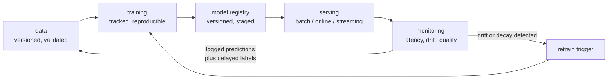
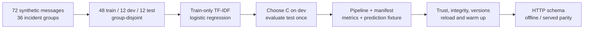

# MLOps & Serving: From Notebook to Something On Call

A model that only exists in a notebook has no value. The gap between "it scores
0.91 in cross-validation" and "it makes correct decisions for real users at 3 a.m."
is filled by a set of unglamorous tools and disciplines. This page covers them in
the order you meet them.



Every arrow is a place where projects fail. The loop closing — production
feeding back into training data — is what separates a system from a script.

## Experiment tracking

You will run hundreds of experiments. Without tracking, you will not be able to
answer "what produced the model currently in production?"

| Tool | Character |
|---|---|
| **MLflow** | open source, self-hostable, tracking + registry + packaging; the safe default |
| **Weights & Biases** | best UI, rich artefact and sweep support, hosted (self-host available) |
| **Neptune / Comet** | similar hosted alternatives |
| **DVC + DVCLive** | git-native, tracking lives in the repo |
| **TensorBoard** | curves only; no registry, no comparison across projects |
| **Aim** | open source, fast local UI |

```python
import mlflow

mlflow.set_experiment("churn-v3")
with mlflow.start_run(run_name="lgbm-tuned"):
    mlflow.log_params(params)
    mlflow.log_metrics({"val_auc": auc, "val_ap": ap, "train_auc": train_auc})
    mlflow.log_artifact("confusion_matrix.png")
    mlflow.set_tags({"git_sha": sha, "data_version": data_hash, "owner": "risk-ml"})
    mlflow.sklearn.log_model(pipeline, "model", signature=signature,
                             input_example=X_val.head())
```

**Log these every run, without exception:**

| Item | Why |
|---|---|
| Git commit SHA | which code produced this |
| Data version or content hash | which data produced this |
| Full hyperparameters | reproducibility |
| Library versions (`pip freeze`) | a silent upgrade can change results |
| Random seeds | to distinguish a real gain from seed noise |
| Train **and** validation metrics | the gap is the overfitting diagnosis |
| Hardware and wall-clock | cost accounting and capacity planning |
| The model **signature** | input schema, caught at serve time |

The seed one matters more than people expect: on small datasets the spread across
seeds often exceeds the improvement being claimed. Run 3–5 seeds and report mean
± std, not a single lucky number.

## Data and model versioning

Git does not handle a 40 GB Parquet directory. The standard options:

| Tool | Approach |
|---|---|
| **DVC** | git-tracked pointer files, data in S3/GCS/Azure; `dvc repro` for pipelines |
| **LakeFS** | git-like branches and commits over an object store |
| **Delta Lake / Iceberg / Hudi** | ACID table formats with time travel and schema evolution |
| **Pachyderm** | data-driven pipeline versioning |
| Content hashing | the minimum viable version: hash the inputs, record the hash |

**Time travel is the feature that matters.** "Reproduce the model we shipped in
March" requires reading the data as it was in March, not as it is now. Delta and
Iceberg support time-travel queries with format-specific syntax, but retention
and vacuum policies can remove required history. Preserve snapshots explicitly;
an old version identifier alone is not the data.

```python
mlflow.register_model("runs:/<run_id>/model", "churn")
client = mlflow.MlflowClient()
client.set_registered_model_alias("churn", "candidate", "7")
resolved = client.get_model_version_by_alias("churn", "candidate")
immutable_uri = f"models:/churn/{resolved.version}"
```

A registry provides immutable versions, mutable aliases/tags, and lineage.
Legacy stage-transition APIs are deprecated in MLflow; resolve an alias to the
actual version before loading/logging a deployed artifact. See the
[registry workflow](https://mlflow.org/docs/latest/ml/model-registry/workflow/).

## Feature stores

The problem a feature store solves is **train/serve skew**: the feature computed
in a training SQL query and the feature computed in the serving Python are
subtly different. An ordinary offline score may miss this, but historical replay
and offline-versus-served feature parity tests can expose the mismatch.

| Store | Note |
|---|---|
| **Feast** | open source, bring-your-own infrastructure |
| **Tecton** | managed, streaming-first |
| Cloud native | Vertex AI Feature Store, SageMaker Feature Store, Databricks |
| DIY | a shared transformation library plus an online key-value store |

The two properties that define a feature store:

1. **One definition, two paths.** The same transformation code produces the
   offline training table and the online serving value.
2. **Point-in-time correctness.** When building a training set, each row's
   features must be the values that were known *at that row's timestamp* — not
   the current values. This is an as-of join, and getting it wrong is the most
   damaging form of leakage in production ML, because it inflates offline metrics
   and can be detected offline through timestamp/availability assertions,
   historical replay, feature parity checks and held-out backtests.

If you build nothing else, build the point-in-time join correctly.

## Serving patterns

| Pattern | Latency | Use when |
|---|---|---|
| **Batch (offline) scoring** | hours | daily churn scores, recommendations precomputed nightly |
| **Online (request/response)** | 10–500 ms | fraud checks, ranking, real-time personalisation |
| **Streaming** | seconds | event-driven scoring off Kafka/Kinesis |
| **Edge / on-device** | ms, offline-capable | mobile, IoT, privacy-sensitive |
| **Embedded in the app** | microseconds | small models compiled into the service |

**Batch first.** If the business can tolerate day-old predictions, batch scoring
removes an entire class of operational problems: no latency budget, no
autoscaling, easy retries, trivial rollback. Reach for online serving when
freshness genuinely matters.

### A latency budget

A 100 ms end-to-end budget spends roughly:

| Stage | Typical |
|---|---|
| Network in/out | 10–20 ms |
| Feature retrieval (online store) | 5–30 ms |
| Preprocessing | 1–10 ms |
| Model inference | 5–50 ms |
| Post-processing, business rules | 1–5 ms |

Feature retrieval is frequently the bottleneck, not the model. Optimising a
15 ms model to 8 ms while a feature lookup takes 40 ms is wasted effort —
**profile the whole path before optimising the part you find most interesting.**

Serve p99, not the mean. A mean of 40 ms with a p99 of 900 ms means 1% of users
have a bad experience, and in a fan-out architecture where one request touches 20
services, independent 1%-tail events imply probability
$1-0.99^{20}\approx18.2\%$ of at least one tail event, not nearly every request.
Correlation changes that probability.

### Serving frameworks

| Framework | Strength |
|---|---|
| **FastAPI + uvicorn** | simple, Pythonic, fine for low QPS |
| **NVIDIA Triton** | multi-framework, dynamic batching, model ensembles, GPU sharing |
| **TorchServe** | legacy PyTorch server; no planned updates or security patches |
| **TF Serving** | TensorFlow-native, mature versioning and batching |
| **BentoML** | packaging + serving + adaptive batching, good developer experience |
| **Ray Serve** | composable pipelines, autoscaling, Python-native |
| **KServe / Seldon** | Kubernetes-native, canaries and explainers built in |
| **vLLM / SGLang / TGI** | LLM-specific: continuous batching, paged KV cache |

**Dynamic batching is the single highest-leverage server feature.** GPUs are
throughput devices; serving one request at a time leaves them idle. Grouping
concurrent requests for a few milliseconds trades a small latency increase for a
large throughput multiplier. For LLMs, **continuous batching** goes further,
admitting new requests into a running batch as others finish rather than waiting
for the whole batch to complete.

### Runnable local serving contract

This CPU fixture tests a probability API with FastAPI's in-process client. It does
not start a network server, write artifacts, or contact a registry. A real loader
must verify artifact integrity/trust and return an immutable version. A default
MLflow sklearn pyfunc commonly calls `predict`, yielding labels; use an explicit
probability wrapper or loaded estimator's `predict_proba` for a probability API.

```python runnable
from contextlib import asynccontextmanager
import numpy as np
from fastapi import FastAPI, HTTPException
from fastapi.testclient import TestClient
from pydantic import BaseModel, Field
from sklearn.linear_model import LogisticRegression

class Request(BaseModel):
    f0: float = Field(..., allow_inf_nan=False)
    f1: float = Field(..., allow_inf_nan=False)
    class Config:
        extra = "forbid"

def create_app(loader):
    @asynccontextmanager
    async def lifespan(app):
        model, version = loader()
        warm = model.predict_proba(np.zeros((1, 2)))
        if warm.shape != (1, 2) or not np.isfinite(warm).all():
            raise RuntimeError("warmup failed")
        app.state.model, app.state.version = model, version
        app.state.ready = True
        try:
            yield
        finally:
            app.state.ready = False

    app = FastAPI(lifespan=lifespan)
    app.state.ready = False

    @app.get("/health")
    def health():
        return {"ok": True}

    @app.get("/ready")
    def ready():
        if not app.state.ready:
            raise HTTPException(503, "not ready")
        return {"ok": True}

    @app.post("/predict")
    def predict(request: Request):
        if not app.state.ready:
            raise HTTPException(503, "not ready")
        positive = np.flatnonzero(app.state.model.classes_ == 1).item()
        score = app.state.model.predict_proba([[request.f0, request.f1]])[0, positive]
        return {"score": float(score), "model_version": app.state.version}
    return app

X = np.array([[-2., 0], [-1., 1], [1., -1], [2., 0]])
model = LogisticRegression(random_state=0).fit(X, [0, 0, 1, 1])
app = create_app(lambda: (model, "fixture-version-7"))
assert TestClient(app).get("/ready").status_code == 503
with TestClient(app) as client:
    assert client.get("/ready").status_code == 200
    result = client.post("/predict", json={"f1": 0., "f0": 2.}).json()
    assert result["model_version"] == "fixture-version-7"
    assert np.isclose(result["score"], model.predict_proba([[2., 0.]])[0, 1])
    assert client.post("/predict", json={"f0": 1.}).status_code == 422
    assert client.post("/predict", json={"f0": 1., "f1": 0., "secret": 3}).status_code == 422
assert not app.state.ready
print("readiness status, fixed schema, class probability and immutable version passed")
```

Log a minimized prediction identifier, immutable model/schema version and permitted
diagnostics for delayed labels. Raw inputs may contain secrets or sensitive
attributes: define redaction, retention, access controls and deletion instead of
logging all inputs by default. Add authentication, authorization, request deadlines,
bounded queues, overload responses and cancellation before network deployment.
FastAPI recommends [lifespan management](https://fastapi.tiangolo.com/advanced/events/).

## Containerisation and orchestration

```dockerfile
FROM python:3.11-slim AS build
WORKDIR /app
COPY requirements.txt .
RUN pip install --no-cache-dir --prefix=/install -r requirements.txt

FROM python:3.11-slim
WORKDIR /app
COPY --from=build /install /usr/local
COPY src/ /app/src/
COPY model/ /app/model/
ENV PYTHONUNBUFFERED=1 OMP_NUM_THREADS=1
RUN useradd --create-home --uid 10001 appuser
USER appuser
EXPOSE 8080
HEALTHCHECK CMD python -c "import urllib.request; urllib.request.urlopen('http://localhost:8080/ready', timeout=2)"
CMD ["uvicorn", "src.app:app", "--host", "0.0.0.0", "--port", "8080"]
```

| Practice | Reason |
|---|---|
| Multi-stage builds | build tools do not ship to production |
| Pin every version, lock file committed | a silent dependency bump changes predictions |
| Non-root user | basic container hygiene |
| `OMP_NUM_THREADS=1` per replica | thread oversubscription is a classic latency killer under a process manager |
| Model in the image, or fetched at startup | in-image is reproducible; fetched allows swapping without a rebuild |
| Separate liveness and readiness probes | do not take traffic before the model has loaded |
| Resource requests **and** limits | ML pods OOM-kill neighbours otherwise |

On Kubernetes, the pieces that matter for ML specifically are HPA on a custom
metric (queue depth or GPU utilisation, not CPU), pod disruption budgets so a
node drain does not take out every replica, and a warm-up request in the
readiness probe so the first real request does not pay JIT compilation cost.

## Deployment strategies

| Strategy | Mechanism | Risk |
|---|---|---|
| **Shadow / dark launch** | new model scores live traffic, output discarded | no direct decision effect; shared resources/logs still pose risk |
| **Canary** | 1% → 5% → 25% → 100% with metric gates | limited blast radius |
| **Blue/green** | two full environments, switch the router | instant rollback, double cost |
| **A/B test** | randomised split with statistical analysis | the only way to measure business impact |
| **Multi-armed bandit** | traffic shifts toward the better arm | faster, but confounded by non-stationarity |

**Shadow mode first, always.** It catches schema mismatches, latency
regressions, and unexpected input distributions. With later outcome labels it can
compare predictive quality, but cannot directly identify the causal effect of
taking different actions. Resource isolation and privacy controls still matter;
shadow mode does not certify safety.

Automate rollback on a metric gate. A deployment that requires a human to notice
a problem at 3 a.m. is not a deployment strategy.

## Monitoring

Four layers, in increasing difficulty:

### 1. Operational

Latency (p50/p95/p99), throughput, error rate, saturation, cost per prediction.
Standard Prometheus/Grafana territory. Alert on p99 and error rate.

### 2. Data quality

Schema conformance, null rates, cardinality, range checks, duplicate rates,
freshness. These fail more often than models do, and they fail silently.

```python
import pandera as pa

schema = pa.DataFrameSchema({
    "age":    pa.Column(int,   pa.Check.in_range(18, 120)),
    "income": pa.Column(float, pa.Check.ge(0), nullable=True),
    "region": pa.Column(str,   pa.Check.isin(VALID_REGIONS)),
})
schema.validate(df, lazy=True)     # collect every violation, not just the first
```

Great Expectations, Pandera, Evidently, and dbt tests all cover this ground. Run
the checks at the boundary — where data enters your system — and fail loudly.

### 3. Drift

| Type | Definition | Detection |
|---|---|---|
| **Covariate shift** | $P(X)$ changes, $P(Y \mid X)$ stable | KS test, PSI, or a classifier trained to distinguish train from live |
| **Label shift** | $P(Y)$ changes | monitor the prediction rate and base rate |
| **Concept drift** | $P(Y \mid X)$ changes | requires labels; watch metric decay |
| **Upstream data change** | a pipeline changed a unit or an encoding | schema and range checks |

The **population stability index** is the standard practical measure:

$$\mathrm{PSI} = \sum_i (a_i - e_i)\ln\frac{a_i}{e_i}$$

over binned feature values, with $e$ the expected (training) proportion and $a$
the actual. Conventional thresholds: $< 0.1$ stable, $0.1$–$0.25$ investigate,
$> 0.25$ significant shift.

A useful and under-used detector: **train a classifier to distinguish training
data from production data.** Evaluate its AUC on held-out, appropriately grouped
or temporal rows; training AUC can reflect memorization. Importances suggest
diagnostic features but do not uniquely identify marginal changes, especially
with correlated features or changed interactions.

**Prediction drift is your early-warning system**, because it needs no labels.
If the mean predicted probability moves from 0.03 to 0.11 overnight, something
happened — upstream, in the world, or in your code.

### 4. Model quality

The hard one, because labels arrive late or never.

| Label availability | Approach |
|---|---|
| Immediate (click, conversion within minutes) | direct online metrics |
| Delayed (churn in 30 days, default in 90) | maintain a delayed evaluation job keyed by prediction id |
| Partial (only on served items) | correct for the feedback loop; log propensities |
| Never | proxy metrics, human review of a sample, drift as a leading indicator |

**Feedback loops are the subtle failure.** A recommender only observes outcomes
for items it chose to show. Training the next model on that log makes it more
confident in what it already believed. Log the propensity (probability of
showing each item) so you can inverse-propensity-weight the training data, and
keep a small randomised exploration slice.

## Retraining

| Trigger | Fits |
|---|---|
| Scheduled (weekly/daily) | steady drift; simple and predictable |
| Drift-triggered | expensive training; sporadic shifts |
| Performance-triggered | labels arrive fast enough to measure decay |
| Event-triggered | a known change: new product, new market, new upstream schema |

A retraining pipeline must **gate on evaluation**, not just complete. The
minimum gates:

1. Data validation passes.
2. New model beats the current production model on a held-out set **and** on
   critical slices.
3. No regression on protected segments.
4. Latency and model size within budget.
5. Shadow mode for a fixed period before promotion.

Warm-starting from the previous checkpoint is faster but accumulates drift and
makes reproducibility harder; retraining from scratch is cleaner. Prefer from
scratch unless training cost forbids it.

## CI/CD for ML

The following is a workflow sketch: a runnable GitHub Actions job additionally
needs `runs-on`, checkout, Python/dependency setup, credentials policy and the
referenced repository commands/files. It has not been executed as CI here.

```yaml
on: [pull_request]
jobs:
  test:
    steps:
      - run: ruff check . && mypy src/
      - run: pytest tests/unit
      - run: pytest tests/data          # schema and expectation checks
      - run: python -m src.train --smoke --max-steps 50
      - run: pytest tests/model         # behavioural tests on a fixed checkpoint
      - run: python -m src.eval --gate metrics.json --min-auc 0.85
```

Tests specific to ML, beyond ordinary unit tests:

| Test | Catches |
|---|---|
| **Smoke training run** | the pipeline is broken end to end |
| **Overfit a tiny batch** | the model/loss cannot learn at all |
| **Schema tests on training data** | upstream changes |
| **Invariance tests** | prediction should not change when an irrelevant field changes |
| **Directional expectation tests** | raising income should not raise default probability |
| **Minimum functionality tests** | obvious cases the model must get right |
| **Metric gates** | quality regressions |
| **Slice tests** | regression on a subgroup hidden by the aggregate |
| **Serving contract tests** | request/response schema, latency budget |

The invariance/directional/minimum-functionality trio comes from behavioural
testing (the CheckList methodology) and is far more useful than an aggregate
metric for catching the failures users actually notice.

## LLM-specific operations

Serving and monitoring language models differs enough to call out:

| Concern | Detail |
|---|---|
| Metrics | TTFT (time to first token), TPOT (time per output token), tokens/sec, not just request latency |
| Batching | continuous batching is mandatory for throughput |
| KV cache | dominates memory; paged allocation avoids fragmentation |
| Prompt caching | shared system prompts can be cached across requests |
| Cost | priced per token — track input and output tokens per endpoint |
| Quality | no single metric; use LLM-as-judge plus a human-reviewed sample |
| Guardrails | input filtering, output validation, structured decoding for JSON |
| Prompt versioning | prompts are code; version them and evaluate changes |
| Regression suites | a fixed set of prompts with expected properties, run on every change |
| Fallbacks | timeouts, retries with backoff, a smaller model as a degraded mode |

The most important operational habit: **an evaluation set of real prompts from
your own product**, scored on every prompt or model change. Public benchmarks
will not tell you whether your extraction prompt regressed.

## Cost

| Lever | Effect |
|---|---|
| Batch instead of online | order of magnitude cheaper |
| Spot/preemptible instances for training | 60–90% cheaper, needs checkpointing |
| Right-size the model | distillation or a smaller variant is often within a point |
| Quantisation | int8/int4 cuts memory and cost, especially for memory-bound decoding |
| Caching | identical requests, or shared prompt prefixes |
| Autoscale to zero | for spiky low-volume endpoints |
| CPU where it suffices | small models on CPU with ONNX Runtime are far cheaper than idle GPUs |
| Early-exit / cascades | cheap model first, escalate only uncertain cases |

Cascades deserve a mention: route every request to a small fast model, and only
escalate to the large one when the small model's confidence is low. On many
workloads this cuts cost by more than half at negligible quality loss, and it is
easy to tune with a single confidence threshold.

## Capstone: train, package, reload, serve

The earlier in-process example isolates the HTTP contract. This capstone connects
the complete artifact path: a grouped text dataset, train-only preprocessing,
development-set model selection, final evaluation, a serialized pipeline, an
integrity-checked manifest, and the same predictions through FastAPI. It is a
CPU-only offline fixture, with no model downloads, cloud account, registry,
telemetry, or paid service.

**Downloads:** [complete Python capstone](/assets/examples/artifact_capstone.py)
and [focused environment](/assets/examples/requirements-artifact-capstone.txt).
The source includes training, loading, service construction, and the executable
demonstration. These teaching pins reproduce the example; they are not a
security-maintained production lockfile.



### Run the complete workflow

Download the two files into one directory and run with Python 3.11:

```bash
python3.11 -m venv .venv
.venv/bin/python -m pip install -r requirements-artifact-capstone.txt
.venv/bin/python artifact_capstone.py demo --output ./ticket-artifact
```

The output directory must not already exist. The script refuses to overwrite a
previous release. A failed run can leave an incomplete directory; inspect it and
choose a new output path for the next run. In a registry implementation, build
under a temporary version and promote it atomically only after validation.

The command prints the chosen regularization, development and test log loss,
per-class scores, confusion matrix, immutable model digest, manifest digest, and
`roundtrip: passed`. It executes HTTP requests through an in-process ASGI test
client. **It does not bind a port or deploy a public server.** Use `train` instead
of `demo` to write the artifact without running the HTTP demonstration.

To call that same artifact through a real local HTTP listener, use the manifest
digest printed by your own trusted training run:

```bash
.venv/bin/python artifact_capstone.py serve --artifact ./ticket-artifact \
  --manifest-sha256 YOUR_TRUSTED_MANIFEST_SHA256 --trust-artifact --port 8001
```

The server binds only to `127.0.0.1`, runs one worker, and disables access logs.
Choose another port if 8001 is occupied. In another terminal:

```bash
curl --fail http://127.0.0.1:8001/ready
curl --fail http://127.0.0.1:8001/predict \
  -H 'Content-Type: application/json' \
  -d '{"texts":["please refund the invoice","reset my password"]}'
```

Stop the server with Ctrl+C. Startup loads and validates the artifact before
accepting requests. The explicit trust flag is not an authentication mechanism;
do not take the digest from a bundle whose producer you do not trust. This
single-process development command does not expose the model publicly and has
none of the production access controls described below.

| File | What it records | Why it belongs with the release |
|---|---|---|
| `dataset.json` | the complete 72-row synthetic fixture | exact data bytes can be hashed and inspected |
| `splits.json` | row IDs and incident groups in each split | split membership is an artifact, not an undocumented seed |
| `model.joblib` | fitted TF-IDF vectorizer and classifier together | inference uses the fitted vocabulary, IDF weights, and coefficients |
| `metrics.json` | every development candidate, selected C, final test report | model selection and final evaluation remain distinguishable |
| `predictions.json` | ordered texts, class order, probabilities, tolerance | fixed offline outputs make reload and serving parity testable |
| `manifest.json` | schema, exact runtime versions, file digests, source digest | binds the model, data, protocol, and interface into one release record |

This fixture contains no private data. A real release should not automatically
embed raw training texts or customer identifiers in downloadable bundles. Store
access-controlled references and approved redacted prediction fixtures when the
data policy requires them. Hashes of sensitive texts are not anonymization.

### Split isolation is an executable property

The task has three mutually exclusive labels: `account`, `billing`, and
`delivery`. Each category has twelve synthetic incidents; every incident has two
related messages. Splitting individual messages would allow the paired variant
to land in another split. The fixed splitter instead assigns eight incident
groups per class to training, two to development, and two to testing. The seed
is 41, and all group IDs are saved.

Training uses only the `text` field. IDs, group labels, and targets are never
passed as separate predictive features. Every incident also has a unique neutral
marker token. Tests verify that training markers occur in the fitted vocabulary,
while development and test markers do not. Fitting `TfidfVectorizer` on all texts
before the split would fail this check, even if no labels were passed to it:
vocabulary and document-frequency statistics are learned state.

The script fits three complete pipelines with `C` in `{0.5, 2.0, 8.0}` on the
same training split. It chooses the smallest development log loss, with smaller
`C` as a deterministic tie-breaker, then evaluates the selected model once on
the test split. It deliberately does **not** refit on train plus development,
so the train-only vocabulary invariant remains straightforward. A later refit
is a different artifact: rerun the parity fixture and identify exactly which
evaluation data remain untouched. Review [pipelines and cross-validation](./scikit-learn.md)
and [text evaluation](../nlp/nlp-evaluation.md) for the wider protocol.

This is a plumbing dataset, not a language understanding benchmark. Message
templates repeat across incident groups, and category words make the task easy.
The reproduced fixture yields macro-F1 of 1.0 on just twelve test messages, four
per class; development and test losses are also equal because of the symmetric
templates. These values diagnose whether the example is wired correctly. They
do not establish generalization, calibration, statistical significance, or
robustness to new organizations, topics, languages, or time periods.

### Trust is separate from a checksum

`joblib` persists Python objects using pickle machinery, so loading a malicious
artifact may execute code. An attacker who controls a model and its adjacent
checksum can replace both. The loader therefore requires two explicit inputs:
`trusted=True`, meaning the producer is trusted to supply executable objects, and
an expected SHA-256 for the manifest obtained from an independent trusted
release channel. This example does not authenticate that channel or implement
signatures. These constraints follow scikit-learn's [model persistence guidance](https://scikit-learn.org/stable/model_persistence.html).

```python
from artifact_capstone import train_artifact, load_artifact

# A new artifact produced locally by code you have inspected.
release = train_artifact("./another-ticket-artifact")
model, manifest = load_artifact(
    "./another-ticket-artifact",
    trusted=True,
    expected_manifest_sha256=release["manifest_sha256"],
)
probabilities = model.predict_proba(["please refund the invoice"])
print(manifest["classes"], probabilities.tolist())
```

Before deserialization, the loader checks the manifest digest, supported format
and input schema, exact runtime version map, fixed filenames, every file digest,
and the model's content identity. It reads the model bytes once, verifies those
bytes, and deserializes that same in-memory buffer. Reopening the pathname after
verification would introduce a replacement race. Fixed filenames also prevent
a manifest from directing the loader to arbitrary paths.

After loading, it checks the expected Pipeline steps and class ordering, then
warms up the probability path. These post-load checks catch incompatible trusted
artifacts; they do not make unpickling untrusted bytes safe. For different trust
boundaries, consider an appropriately inspected safer format or a supported
runtime export, and test prediction parity again. Cross-version scikit-learn
loading is unsupported; the example deliberately rejects version differences
rather than relying on a successful deserialization as proof of compatibility.

`artifact_version` identifies the serialized model bytes. The manifest digest
identifies the broader release, including evaluation and data references.
Identical predictions need not imply identical serialized bytes across runtimes;
preserve both content identity and behavioral fixtures. The source-code digest
records provenance but is not a complete environment or supply-chain attestation.

### An explicit HTTP contract

The request is a JSON object with exactly one field, `texts`, holding 1 to 32
strict strings. Each string must contain non-whitespace content and be at most
4,000 Python characters. Extra fields, numeric coercions, nulls, empty lists,
oversized batches, and oversized strings receive HTTP 422. Character limits
are not encoded-byte limits or tokenizer limits; an ingress proxy still needs
its own request-body budget.

```json
{"texts": ["please refund the invoice", "reset my password"]}
```

The response includes `schema_version`, `artifact_version`, ordered `classes`,
and one prediction per input in the same order. Every probability vector uses
the returned class ordering. Never assume column one means the business-positive
class: map through `classes_`. The test compares saved, reloaded, and served
probabilities with `rtol=0` and `atol=1e-12`, appropriate for this unchanged CPU
pipeline. A quantized or exported runtime needs a separately justified tolerance
and task-level quality checks.

The app loads once in its lifespan context, then warms up before setting
readiness. `/health` is a process-level liveness response; `/ready` returns 503
before initialization and 200 with the model version after success. Missing or
corrupted artifacts abort startup. Shutdown clears readiness and the model
reference. In the tests, entering `with TestClient(app)` executes startup and
shutdown; constructing the client alone does not. This follows FastAPI's
[lifespan](https://fastapi.tiangolo.com/advanced/events/) and
[testing guidance](https://fastapi.tiangolo.com/advanced/testing-events/).

### Failure cases and worked checks

| Deliberate failure | Expected result | What it teaches |
|---|---|---|
| Fit TF-IDF before splitting | held-out marker invariant fails | unsupervised preprocessing can leak information |
| Omit explicit artifact trust or trusted digest | rejection before deserialization | integrity metadata alone is not a trust decision |
| Change model bytes or prediction fixture | digest rejection before deserialization | evaluation fixtures are part of the release too |
| Change manifest without changing trusted expected digest | manifest rejected | the manifest itself needs integrity protection |
| Change runtime/schema version in a newly trusted manifest | contract rejection | a trusted producer can still produce incompatible artifacts |
| Reverse the declared classes | class-order rejection | matching array shape does not prove semantic compatibility |
| Start with a missing model | startup fails, readiness stays false | do not serve a silently substituted fallback |
| Submit whitespace, numbers, extra keys, or an oversized batch | HTTP 422 | validation is part of the model interface |
| Submit an entirely unseen word | valid finite class probabilities | a closed-set model does not automatically recognize unsupported requests |

The repository's `site/test_artifact_capstone.py` checks these boundaries, a
fresh-process reload, deterministic predictions on repeat training, preserved
batch order, HTTP parity, lifecycle behavior, CLI execution, and refusal to
overwrite existing output. The standalone `demo` command provides a smaller
smoke test without requiring the repository test harness.

**Why is the unseen-word result not an exception?** TF-IDF maps an all-OOV text
to a zero feature row. Logistic regression can still return intercept-driven
probabilities and an argmax label. That answer is mathematically valid but may
be inappropriate for the application. Monitor OOV coverage and design a validated
abstention policy on realistic unsupported inputs; never infer reliability solely
from `predict_proba` being available. See [classification robustness](../nlp/text-classification.md#robustness).

**Does parity prove that the model is useful?** No. It proves that these tested
paths implement the same fitted computation within the chosen tolerance. A
consistently wrong classifier can pass every artifact parity test. Quality,
calibration, subgroup performance, and real service reliability need their own
acceptance gates.

### Extend toward a real deployment

Replace synthetic incidents with a licensed, versioned corpus and an annotation
guide. Group by the actual leakage boundary, such as conversation, customer, or
source document, and use a time-based holdout when predicting future traffic.
Deduplicate before splitting without letting evaluation labels guide cleaning.
Retain split counts, uncertain labels, language and length slices, and an error
review set. Compare this linear baseline against a stronger encoder only under
the same frozen evaluation protocol.

Next, measure calibration and cost-sensitive abstention on development data,
then evaluate the frozen policy on held-out data with uncertainty intervals at
the correct independent unit. Run the local ASGI server under a load generator to
measure latency, concurrency, memory, startup time, overload behavior, timeouts,
and graceful drain. An in-process TestClient neither measures network latency
nor verifies multi-worker deployment or cancellation under load.

Finally add authentication, authorization, TLS termination, request-size limits,
rate limits, privacy-safe logs, release signing, dependency scanning, resource
budgets, rollback, and monitored quality with delayed labels. This capstone does
not implement those controls, a container, an online feature store, a registry,
or an actual public deployment. Treat each as a separate testable requirement,
not as a property conferred by having a `/predict` route.

## Self-check

1. What is train/serve skew, and what property of a feature store prevents it?
2. Explain point-in-time correctness and give two offline tests that detect violations.
3. Your model's p50 latency is 30 ms and p99 is 800 ms. Why does the p99 matter
   more, and what would you check first?
4. Name the four drift types and say which ones you can detect without labels.
5. Why is shadow deployment insufficient to decide whether to ship a new model?
6. Give three ML-specific CI tests that a normal unit-test suite would not have.
7. A recommender's metrics improve every retraining cycle while user engagement
   falls. What is happening?

## Where to go next

- [Scikit-learn](./scikit-learn.md) — pipelines that serialise cleanly into a
  serving artefact.
- [Hugging Face ecosystem](./huggingface.md) — the model side of an LLM
  deployment.
- [The Inference Engineering Course](/courses/inference/) — the serving layer in
  depth.
