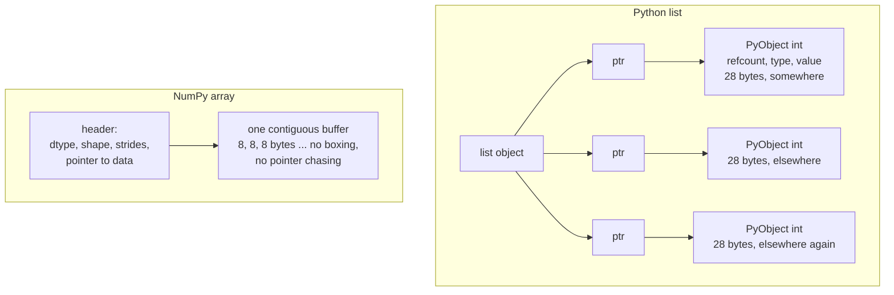

# NumPy: The Array That Everything Else Is Built On

Pandas is NumPy with labels. Scikit-learn's estimators take and return NumPy
arrays. PyTorch tensors deliberately copy NumPy's API and can share memory with
it. Every plotting library consumes it. If you understand NumPy's memory model
properly, most of the "why is this slow?" questions in the rest of the stack
answer themselves.

## Why NumPy is fast (and Python is not)

A Python list of a million integers is a million pointers to a million boxed
`PyObject`s scattered across the heap. Each has a reference count, a type
pointer, and its value. Iterating it means chasing pointers, checking types, and
allocating result objects.

A NumPy array of a million `int64`s is **one contiguous 8 MB block** plus a small
header. Operating on it dispatches once to a C loop that the CPU can vectorise
with SIMD instructions and prefetch perfectly.



The measured gap is 10–100×, and it comes from three things: no per-element
Python object overhead, cache-friendly contiguous access, and SIMD.

```python
import numpy as np, time

a = list(range(1_000_000))
b = np.arange(1_000_000)

t = time.perf_counter(); s = sum(x * x for x in a); py = time.perf_counter() - t
t = time.perf_counter(); s = (b * b).sum();         np_ = time.perf_counter() - t
print(f"python {py*1000:.1f} ms   numpy {np_*1000:.1f} ms   speedup {py/np_:.0f}x")
```

## The ndarray: four pieces of metadata

Every array is a buffer plus four descriptors. Understanding them explains
reshape, transpose, slicing, and every "why did this copy?" question.

| Attribute | Meaning |
|---|---|
| `dtype` | element type and size — `int64`, `float32`, `bool`, `complex128`, `object` |
| `shape` | tuple of dimension lengths |
| `strides` | bytes to step to advance one index along each axis |
| `data` | pointer to the buffer, possibly shared with another array |

```python
a = np.arange(12).reshape(3, 4)
a.dtype     # dtype('int64')
a.shape     # (3, 4)
a.strides   # (32, 8)  -> 4 elements * 8 bytes per row, 8 bytes per column
a.flags     # C_CONTIGUOUS: True, OWNDATA: False (it's a view of arange's buffer)
```

**Strides are the key idea.** A transpose does not move any data — it swaps the
strides:

```python
a.T.strides      # (8, 32)  -- same buffer, different reading order
a.T.flags        # F_CONTIGUOUS: True, C_CONTIGUOUS: False
```

That is why `a.T` is $O(1)$ and why `a.T.reshape(-1)` is *not* — reshaping a
non-contiguous array must materialise a copy. `np.ascontiguousarray` makes the
copy explicit; `.ravel()` copies only if needed, `.flatten()` always copies.

### dtypes, and the memory they cost

| dtype | Bytes | Range/precision | When to use |
|---|---|---|---|
| `bool` | 1 | True/False | masks |
| `int8`/`uint8` | 1 | −128..127 / 0..255 | images, quantised weights |
| `int32` | 4 | ±2.1e9 | indices, counts |
| `int64` | 8 | ±9.2e18 | NumPy's default integer on Linux |
| `float16` | 2 | ~3 decimal digits | storage, GPU transfer |
| `float32` | 4 | ~7 digits | **the ML default** |
| `float64` | 8 | ~16 digits | NumPy's default float; scientific work |
| `object` | 8 + boxed | anything | avoid — this is a Python list wearing a costume |

**Two defaults that cost real money.** NumPy defaults to `float64`, and
scikit-learn/PyTorch mostly want `float32`. A 10M-row × 100-feature matrix is
8 GB in float64 and 4 GB in float32. Always be explicit:

```python
X = np.asarray(data, dtype=np.float32)
```

And `dtype=object` arrays give you none of NumPy's benefits — they store
pointers to Python objects and every operation falls back to the interpreter.
A pandas column of strings is exactly this, which is why string operations in
pandas are slow.

**Integer overflow is silent.** NumPy does not promote to bignum:

```python
np.array([2**62], dtype=np.int64) * 4   # negative — wrapped around, no warning
```

## Broadcasting

Broadcasting lets arrays of different shapes combine without materialising
copies. The rules, applied right-to-left across the shapes:

1. If the arrays have different numbers of dimensions, left-pad the shorter with
   1s.
2. Two dimensions are compatible if they are equal, or if one of them is 1.
3. A dimension of size 1 is stretched (by setting its stride to 0 — no data is
   duplicated).
4. Any other mismatch is an error.

| A | B | Result | Note |
|---|---|---|---|
| `(3, 4)` | `(4,)` | `(3, 4)` | row vector added to every row |
| `(3, 4)` | `(3, 1)` | `(3, 4)` | column vector added to every column |
| `(5, 1, 3)` | `(1, 4, 3)` | `(5, 4, 3)` | outer-product style expansion |
| `(3, 4)` | `(3,)` | **error** | 4 vs 3 on the last axis |
| `(256, 256, 3)` | `(3,)` | `(256, 256, 3)` | per-channel scaling of an image |

```python
X = np.random.randn(1000, 20)

# standardise every column, no loops, no temporaries you did not intend
Xz = (X - X.mean(0)) / X.std(0)          # (1000,20) - (20,) -> broadcast

# all pairwise squared distances between two point sets
A = np.random.randn(500, 3)
B = np.random.randn(800, 3)
D2 = ((A[:, None, :] - B[None, :, :]) ** 2).sum(-1)     # (500, 800)
```

**The trap in that last example**: `A[:, None, :] - B[None, :, :]` materialises a
`(500, 800, 3)` intermediate — 9.6 MB here, but 96 GB for 50k × 50k points. The
algebraic identity avoids it entirely:

$$\|a-b\|^2 = \|a\|^2 - 2a\cdot b + \|b\|^2$$

```python
D2 = (A**2).sum(1)[:, None] - 2 * A @ B.T + (B**2).sum(1)[None, :]
np.maximum(D2, 0, out=D2)     # clamp tiny negatives from float cancellation
```

That is the trick behind `sklearn.metrics.pairwise_distances`, and the clamp is
there because catastrophic cancellation can produce small negative "squared"
distances.

`np.newaxis` (a.k.a. `None`) is how you control which axis broadcasts. When a
broadcast fails, print the shapes — the error message tells you the axis, and
the fix is almost always an inserted `None`.

## Vectorization: replacing loops with array expressions

The rule is simple: **if you wrote a Python `for` loop over array elements, there
is a faster way.**

| Loop pattern | Vectorised form |
|---|---|
| element-wise arithmetic | `a * b + c` |
| conditional assignment | `np.where(cond, x, y)` |
| multi-way conditional | `np.select([c1, c2], [v1, v2], default=v0)` |
| accumulate a running total | `np.cumsum`, `np.cumprod` |
| filter by predicate | boolean mask `a[a > 0]` |
| count matching | `(a > 0).sum()` |
| lookup by index | fancy indexing `table[idx]` |
| per-group aggregate | `np.bincount(groups, weights=vals)` |
| sliding window | `np.lib.stride_tricks.sliding_window_view` |
| pairwise op then reduce | `einsum` or the matmul identity |

```python
# a decision rule, three ways
scores = np.random.randn(1_000_000)

labels = np.array([1 if s > 0.5 else (-1 if s < -0.5 else 0) for s in scores])  # ~400 ms
labels = np.where(scores > 0.5, 1, np.where(scores < -0.5, -1, 0))              # ~6 ms
labels = np.sign(scores) * (np.abs(scores) > 0.5)                               # ~4 ms
```

**`np.vectorize` is not vectorisation.** It is a convenience wrapper around a
Python loop and is roughly as slow. If the docs for a function say "provided
primarily for convenience, not for performance", believe them.

### Ufuncs and their extras

Universal functions (`np.add`, `np.exp`, `np.maximum`, …) all support the same
machinery:

```python
np.add(a, b, out=c)              # write into an existing buffer, no allocation
np.add.reduce(a, axis=0)         # == a.sum(0)
np.add.accumulate(a)             # == np.cumsum(a)
np.add.outer(a, b)               # all pairwise sums
np.add.at(a, idx, vals)          # UNBUFFERED add — handles repeated indices
```

`np.add.at` deserves emphasis. `a[idx] += vals` with repeated indices in `idx`
only applies the last one, because the fancy-index read and write are separate
operations. `np.add.at(a, idx, vals)` accumulates correctly. This is exactly the
scatter-add that embedding-gradient accumulation needs, and it is a classic
silent-wrong-answer bug.

## Indexing: views vs copies

This single distinction causes more NumPy bugs than anything else.

| Indexing style | Example | Returns |
|---|---|---|
| Basic slicing | `a[1:5, ::2]` | **view** — shares memory |
| Integer scalar | `a[3]` | view (of the sub-array) |
| Boolean mask | `a[a > 0]` | **copy** |
| Integer array (fancy) | `a[[0, 2, 4]]` | **copy** |
| `np.ix_`, mixed advanced | `a[np.ix_(r, c)]` | copy |
| `.reshape` on contiguous | `a.reshape(2, 6)` | view |
| `.reshape` on non-contiguous | `a.T.reshape(-1)` | copy |
| `.T`, `.transpose`, `swapaxes` | `a.T` | view |
| `.copy()` | `a.copy()` | copy, always |

```python
a = np.arange(10)
v = a[2:5]        # view
v[0] = 999
a                 # array([0, 1, 999, 3, 4, 5, ...])  <- a was modified!

m = a[a > 3]      # copy
m[0] = -1
a                 # unchanged
```

Use `arr.base` to ask whether something is a view (`None` means it owns its
data), and `np.shares_memory(a, b)` to check overlap. When a function takes an
array it may mutate, take a defensive `.copy()`.

### Fancy indexing patterns worth knowing

```python
# one-hot encoding without sklearn
onehot = np.eye(n_classes, dtype=np.float32)[labels]         # (N, C)

# gather the predicted probability of the true class for every row
p_true = probs[np.arange(len(labels)), labels]               # (N,)

# top-k indices per row, unsorted (O(n)) then sorted within the k
idx = np.argpartition(-scores, k, axis=1)[:, :k]
idx = np.take_along_axis(idx, np.argsort(-np.take_along_axis(scores, idx, 1), 1), 1)

# shuffle features and labels together
perm = rng.permutation(len(X)); X, y = X[perm], y[perm]
```

`np.argpartition` is the one people miss: it finds the top-$k$ in $O(n)$ instead
of $O(n\log n)$, which matters when $n$ is a million and $k$ is 10.

## Reductions and axes

The `axis` argument means **"the axis that disappears"**.

```python
a = np.arange(24).reshape(2, 3, 4)
a.sum(axis=0).shape      # (3, 4)   -- axis 0 collapsed
a.sum(axis=(0, 2)).shape # (3,)
a.sum(axis=-1).shape     # (2, 3)
a.sum(axis=1, keepdims=True).shape   # (2, 1, 4)  -- kept for broadcasting
```

`keepdims=True` is what makes normalisation expressions work without manual
`None` insertion:

```python
probs = e / e.sum(axis=-1, keepdims=True)
```

| Reduction | Note |
|---|---|
| `sum`, `prod`, `mean`, `std`, `var` | `std`/`var` default to `ddof=0` (population); pandas defaults to `ddof=1` |
| `min`, `max`, `argmin`, `argmax` | `argmax` returns a flat index unless `axis` is given |
| `any`, `all` | on booleans |
| `nansum`, `nanmean`, `nanmax`, … | skip `NaN` instead of propagating |
| `cumsum`, `cumprod` | running totals |
| `np.median`, `np.percentile`, `np.quantile` | need a partial sort |

**The `ddof` mismatch** between NumPy (0) and pandas (1) silently changes your
reported standard deviation. Be explicit if the number matters.

**`NaN` propagates through every ordinary reduction.** One `NaN` in a column
makes the mean `NaN`. Use the `nan*` family, or find them first:

```python
np.isnan(X).any(0)          # which columns contain NaN
np.isfinite(X).all()        # any NaN or inf anywhere?
```

## Linear algebra

```python
A @ B                       # matmul — use this, not np.dot, for 2-D
np.linalg.solve(A, b)       # solve Ax=b   -- NOT inv(A) @ b
np.linalg.lstsq(X, y, rcond=None)   # least squares, QR/SVD based
np.linalg.inv(A)            # you almost never want this
np.linalg.pinv(A)           # pseudo-inverse via SVD, handles singular A
np.linalg.eigh(S)           # symmetric eigendecomposition — faster and stabler than eig
np.linalg.svd(A, full_matrices=False)
np.linalg.cholesky(S)       # for positive-definite S; twice as fast as LU
np.linalg.norm(x, ord=2)    # ord: 1, 2, inf, 'fro', 'nuc'
np.linalg.matrix_rank(A)
np.trace(A), np.linalg.det(A), np.linalg.slogdet(A)
```

Three rules that come straight from numerical analysis:

1. **Never form an inverse to solve a system.** `solve` is faster and
   numerically far better conditioned than `inv(A) @ b`.
2. **Never form $(X^\top X)^{-1}$ for least squares.** It squares the condition
   number. Use `lstsq`.
3. **Use `slogdet` instead of `log(det(A))`.** Determinants of large matrices
   overflow or underflow; `slogdet` returns the sign and the log magnitude
   separately.

### `einsum`: one notation for all of them

Einstein summation names the axes and sums over any index that does not appear
in the output.

```python
np.einsum('ij,jk->ik', A, B)          # matrix multiply
np.einsum('ij,ij->', A, B)            # Frobenius inner product
np.einsum('ii->', A)                  # trace
np.einsum('ij->ji', A)                # transpose
np.einsum('bij,bjk->bik', X, Y)       # batched matmul
np.einsum('bhqd,bhkd->bhqk', Q, K)    # attention scores, batch and head aware
np.einsum('i,j->ij', a, b)            # outer product
np.einsum('bi,bi->b', a, b)           # row-wise dot product
```

`einsum` is self-documenting in a way that a chain of `transpose`/`reshape`/
`matmul` is not, which matters enormously when reading attention code. Pass
`optimize=True` for multi-operand contractions so it picks a good contraction
order — the difference can be orders of magnitude.

## Random numbers, done correctly

The legacy `np.random.seed` / `np.random.rand` global API is discouraged. Use
the `Generator` API:

```python
rng = np.random.default_rng(42)

rng.random((3, 4))                 # uniform [0,1)
rng.standard_normal((3, 4))        # N(0,1)
rng.normal(loc=0, scale=2, size=5)
rng.integers(0, 10, size=5)        # note: high is EXCLUSIVE, unlike old randint
rng.choice(n, size=k, replace=False)
rng.permutation(n)
rng.shuffle(a)                     # in place
```

Generators are independent objects, so parallel workers each get their own
stream — `rng.spawn(n)` produces provably independent children. That is the
correct pattern for dataloader workers, and it fixes the classic bug where every
forked worker produces identical "random" augmentations.

## Performance rules

| Rule | Why |
|---|---|
| Preallocate with `np.empty`/`np.zeros`, do not `np.append` in a loop | `append` reallocates and copies the whole array every call — $O(n^2)$ |
| Use `out=` for hot in-place ops | avoids a temporary allocation per operation |
| Prefer one fused expression to many temporaries | `a*b + c*d` allocates two temporaries; `numexpr` or chunking avoids them |
| Match memory order to access pattern | row-wise access on a C-contiguous array is ~5× faster than on an F-contiguous one |
| Use `float32` unless you need `float64` | half the bytes, half the bandwidth |
| Use `np.argpartition` for top-k | $O(n)$ vs $O(n\log n)$ |
| Avoid `dtype=object` | destroys every advantage NumPy has |
| Chunk very large operations | avoid a 40 GB intermediate you did not intend |
| Check `arr.nbytes` before you allocate | catches shape mistakes before the OOM |

```python
# the shape of a memory bug
N, D = 100_000, 512
print(f"{N * D * 4 / 1e9:.1f} GB")        # 0.2 GB, fine
print(f"{N * N * 4 / 1e12:.1f} TB")       # 40 TB — an accidental pairwise matrix
```

**`np.memmap`** lets you work with arrays larger than RAM by mapping a file:

```python
X = np.memmap('features.f32', dtype=np.float32, mode='r', shape=(10_000_000, 128))
batch = np.asarray(X[i:i+1024])       # only this slice is paged in
```

This is how large embedding tables and pretokenised datasets are usually stored.

## Interoperability

```python
import torch
t = torch.from_numpy(a)      # SHARES memory — mutating one mutates the other
b = t.numpy()                # also shares (CPU tensors only)
c = t.cpu().numpy().copy()   # explicit copy when you want independence
```

The zero-copy bridge works because both use the buffer protocol / DLPack. It
only applies to CPU tensors with a compatible dtype and stride layout; a CUDA
tensor must be moved to the host first.

Similarly, `df.to_numpy()` on a pandas DataFrame is zero-copy when all columns
share a dtype and a copy otherwise, and `scipy.sparse` matrices interoperate via
`.toarray()` — which materialises the dense form, so check the size first.

## Common bugs

| Symptom | Cause | Fix |
|---|---|---|
| Modifying a slice changed the original | basic slicing returns a view | `.copy()` |
| `a[idx] += 1` lost updates | repeated indices in fancy indexing | `np.add.at(a, idx, 1)` |
| Shapes broadcast when you wanted an error | `(n,)` vs `(n,1)` confusion | be explicit with `reshape(-1, 1)` |
| Result is all `NaN` | one `NaN` propagated through a reduction | `np.isnan(X).any()`, use `nan*` reductions |
| Integer division truncates | `//` or int dtype arithmetic | cast to float first |
| Memory blows up on a "simple" line | an unintended broadcast intermediate | compute `nbytes` of the intermediate |
| `argmax` returns a single number | no `axis` given — it flattens | pass `axis=`, or `np.unravel_index` |
| Results differ from pandas | `ddof=0` vs `ddof=1` | set `ddof` explicitly |
| Different results across runs | global RNG state, forked workers | use `default_rng` and `spawn` |

## Self-check

1. Why is `a.T` free but `a.T.reshape(-1)` not?
2. Given `A` of shape `(1000, 3)` and `B` of shape `(2000, 3)`, write pairwise
   distances without allocating a `(1000, 2000, 3)` intermediate.
3. Which of these return views: `a[::2]`, `a[a>0]`, `a[[1,2]]`, `a.reshape(2,-1)`?
4. `counts[idx] += 1` undercounts. Explain and fix.
5. Your 10M × 200 feature matrix takes 16 GB. Halve it with one change.
6. Write attention scores `(B, H, Q, K)` from `Q` and `K` of shape `(B, H, T, D)`
   using `einsum`.
7. Why does `np.linalg.solve(A, b)` beat `np.linalg.inv(A) @ b`?

## Where to go next

- [Pandas](./pandas.md) — labelled, heterogeneous data on top of these arrays.
- [Scikit-learn](./scikit-learn.md) — models that consume these arrays.
- [PyTorch](./pytorch.md) — the same API with autograd and GPUs attached.
