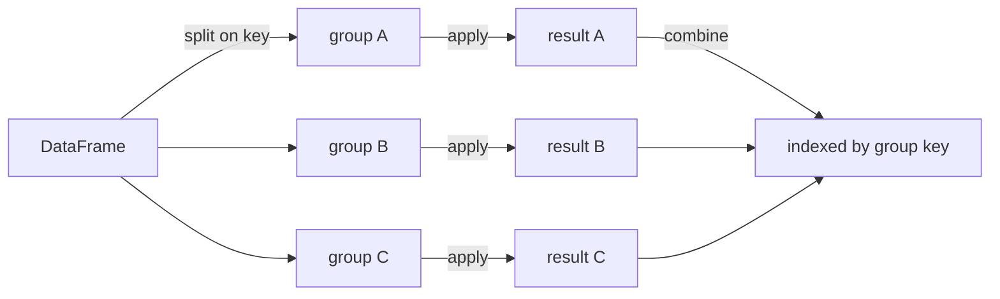

# Pandas: Labelled Data, and How Not to Fight It

Pandas is where most ML projects actually spend their time. It is also where
most of them are slowest and most subtly wrong. Two ideas explain nearly all of
that: **the Index** (which aligns everything silently) and **the block manager**
(which decides whether an operation is a memcpy or a full reallocation).

## The two data structures

A **Series** is a 1-D array with an index. A **DataFrame** is an ordered dict of
Series sharing one index.

```python
import pandas as pd, numpy as np

s = pd.Series([1.0, 2.0, 3.0], index=["a", "b", "c"], name="score")
df = pd.DataFrame({
    "user":  ["u1", "u2", "u1", "u3"],
    "event": ["click", "view", "buy", "click"],
    "value": [1.5, 0.0, 42.0, 2.0],
})
```

### The Index is not decoration

The index drives **automatic alignment**. Every binary operation between two
labelled objects aligns on labels first, and non-matching labels become `NaN`.

```python
a = pd.Series([1, 2, 3], index=[0, 1, 2])
b = pd.Series([10, 20, 30], index=[1, 2, 3])
a + b        # 0: NaN, 1: 12, 2: 23, 3: NaN  -- not element-wise!
```

This is the single most common source of mysterious `NaN`s. After a filter, a
`groupby`, or a concat, indices no longer line up. If you want positional
arithmetic, drop the labels:

```python
a.to_numpy() + b.to_numpy()          # positional, or
a.reset_index(drop=True) + b.reset_index(drop=True)
```

The same mechanism is why assigning a filtered Series back into a DataFrame
"works" — it aligns on the index — and why assigning a NumPy array of the wrong
length raises.

## dtypes and memory

Pandas stores each column as a typed array. Getting dtypes right is usually the
single biggest memory win available.

| dtype | Notes |
|---|---|
| `int64`/`int32`/`int16`/`int8` | no missing values allowed |
| `Int64` (capital I) | nullable integer, backed by a mask |
| `float64`/`float32` | `NaN` is the missing marker |
| `bool` / `boolean` | the second is nullable |
| `object` | Python objects — usually strings; slow and memory-hungry |
| `string[python]` / `string[pyarrow]` | proper string dtype; Arrow-backed is far faster |
| `category` | dictionary encoding: integer codes + a categories array |
| `datetime64[ns]`, `datetime64[ns, tz]` | timestamps, optionally tz-aware |
| `timedelta64[ns]` | durations |
| `period[M]`, `interval` | calendar periods, binned ranges |

**The `object` dtype is the enemy.** A column of 1M short strings as `object` is
a million Python string objects — roughly 60–80 bytes each plus a pointer.
As `category` with 50 distinct values, it is 1M `int8` codes plus 50 strings.

```python
def shrink(df):
    out = df.copy()
    for c in out.columns:
        col = out[c]
        if pd.api.types.is_integer_dtype(col):
            out[c] = pd.to_numeric(col, downcast="integer")
        elif pd.api.types.is_float_dtype(col):
            out[c] = pd.to_numeric(col, downcast="float")
        elif col.dtype == object and col.nunique() / max(len(col), 1) < 0.5:
            out[c] = col.astype("category")
    return out

df.memory_usage(deep=True).sum() / 1e6      # deep=True actually measures strings
```

`deep=True` matters: without it, an `object` column reports only the 8 bytes per
pointer and hides the actual strings.

**PyArrow backing** (`dtype_backend="pyarrow"`, pandas 2.0+) is worth adopting
for string-heavy data: it stores strings contiguously, supports genuine missing
values across all types, and interoperates with Parquet and Polars without
conversion.

## Selection: `[]`, `.loc`, `.iloc`, and the ones to avoid

| Accessor | Indexes by | Slice endpoint | Use for |
|---|---|---|---|
| `df[col]` | column name | — | one column, or a list of columns |
| `df.loc[rows, cols]` | **labels** | **inclusive** | the default choice |
| `df.iloc[rows, cols]` | **positions** | exclusive | positional work |
| `df.at[r, c]` / `df.iat[i, j]` | scalar label/position | — | fastest single-cell access |
| `df.query("a > 1 and b == 'x'")` | expression | — | readable filters, avoids temporaries |
| `df.ix` | removed | — | do not use; gone since 1.0 |

`.loc`'s inclusive slice endpoint surprises everyone once:

```python
df.loc["2024-01-01":"2024-01-31"]   # includes Jan 31
df.iloc[0:10]                        # rows 0..9
```

### Chained assignment and `SettingWithCopyWarning`

```python
df[df.value > 0]["flag"] = 1        # WRONG — sets on a temporary, silently lost
df.loc[df.value > 0, "flag"] = 1    # RIGHT — one indexing operation
```

The first line calls `__getitem__` (producing a copy or a view — pandas cannot
tell you which) and then `__setitem__` on that object. Whether the original is
modified is an implementation detail, which is why pandas warns. **Always use a
single `.loc` with both axes.**

Pandas 3.0 makes Copy-on-Write the only behaviour, which removes the ambiguity:
every indexing result behaves like a copy, and chained assignment simply never
propagates. Writing `.loc`-style code today makes that migration a no-op.

## Missing data

```python
df.isna().sum()                     # count per column
df.isna().mean().sort_values()      # fraction per column — the useful view
df.dropna(subset=["y"])             # drop rows missing the target
df.fillna({"a": 0, "b": df.b.median()})
df["x"].ffill()                     # forward fill — time series only
df["x"].interpolate(method="time")
```

Two rules that matter more than the API:

1. **Missingness is information.** Add an indicator column before imputing;
   "this field was blank" is often predictive.
2. **Fit imputation on train only.** `df.fillna(df.mean())` computed over the
   whole dataset leaks the test set's statistics into training. Use
   `sklearn.impute.SimpleImputer` inside a `Pipeline` so the fit/transform split
   is enforced.

Note the sentinel differences: `np.nan` for floats, `pd.NaT` for datetimes,
`pd.NA` for the nullable dtypes. `None` in an object column becomes `NaN` in a
float column. `np.nan != np.nan`, so always use `.isna()`, never `== np.nan`.

## GroupBy: split, apply, combine



Four apply-shapes, and choosing the right one is most of the skill:

| Method | Returns | Use for |
|---|---|---|
| `.agg()` | one row per group | sums, means, custom reductions |
| `.transform()` | **same shape as input** | group-normalisation, filling with group means |
| `.filter()` | subset of original rows | "keep groups with ≥ 10 rows" |
| `.apply()` | anything | last resort — slow, per-group Python |

```python
g = df.groupby("user", observed=True, sort=False)

g["value"].agg(["mean", "std", "count"])
g.agg(total=("value", "sum"), n_events=("event", "nunique"))   # named aggregation

df["value_z"] = g["value"].transform(lambda s: (s - s.mean()) / s.std())
df["group_mean"] = g["value"].transform("mean")                # vectorised, much faster

big = g.filter(lambda d: len(d) >= 10)
```

**Performance notes that actually matter:**

- `observed=True` when grouping on categoricals. Without it, pandas produces the
  full Cartesian product of category levels — a real memory bomb with multiple
  categorical keys.
- `sort=False` skips sorting the group keys when you do not need ordered output.
- **String aggregation names beat lambdas.** `transform("mean")` uses a Cython
  path; `transform(lambda s: s.mean())` runs Python per group. The gap is often
  50×.
- `as_index=False` or `.reset_index()` to get a flat frame back.
- `.apply()` on many small groups is the classic slow line in a pandas pipeline.
  Look for an `agg`/`transform` equivalent first.

### The window functions people reimplement badly

```python
df["rank_in_user"]  = g["value"].rank(method="dense", ascending=False)
df["cum_value"]     = g["value"].cumsum()
df["prev_value"]    = g["value"].shift(1)
df["delta"]         = df["value"] - df["prev_value"]
df["roll7"]         = g["value"].rolling(7, min_periods=1).mean().reset_index(0, drop=True)
df["expanding_max"] = g["value"].expanding().max().reset_index(0, drop=True)
```

`shift` inside a group is how you build lag features without leaking across
users. Getting the `groupby` wrong here — computing a lag over the whole frame —
is one of the most common causes of leakage in time-series feature engineering.

## Joins and merges

```python
pd.merge(left, right, on="key", how="inner",
         validate="one_to_many", indicator=True, suffixes=("_l", "_r"))
```

| `how` | Keeps |
|---|---|
| `inner` | keys present in both |
| `left` | all left rows |
| `right` | all right rows |
| `outer` | union of keys |
| `cross` | Cartesian product |

**`validate=` is the most under-used argument in pandas.** `"one_to_one"`,
`"one_to_many"`, `"many_to_one"` — it raises if the relationship you assumed is
violated. An unexpected many-to-many join silently multiplies your row count,
duplicates training examples, and inflates your metrics. Assert the cardinality
instead of discovering it later.

`indicator=True` adds a `_merge` column showing `left_only` / `right_only` /
`both`, which turns "why did I lose 3% of rows?" into a one-line check.

```python
before = len(df)
out = df.merge(dim, on="id", how="left", validate="many_to_one", indicator=True)
assert len(out) == before, f"row count changed: {before} -> {len(out)}"
print(out["_merge"].value_counts())
```

Other joining tools:

- `df.join(other)` — joins on the index, convenient but easy to misuse.
- `pd.concat([a, b], axis=0)` — stack rows; `axis=1` aligns on index.
- `pd.merge_asof(left, right, on="time", by="id", direction="backward")` — the
  **as-of join**: for each left row, take the most recent right row at or before
  its timestamp. This is the correct primitive for building point-in-time
  correct features, and it is what prevents look-ahead leakage in time-series
  feature stores.

## Reshaping

| Operation | Direction | Function |
|---|---|---|
| Long → wide | one column becomes many | `pivot`, `pivot_table` |
| Wide → long | many columns become one | `melt` |
| Index level → columns | | `unstack` |
| Columns → index level | | `stack` |
| Cross-tabulate counts | | `crosstab` |
| Expand list-valued cells | | `explode` |

```python
wide = df.pivot_table(index="user", columns="event", values="value",
                      aggfunc="sum", fill_value=0, observed=True)

long = wide.reset_index().melt(id_vars="user", var_name="event", value_name="value")
```

`pivot` requires unique index/column pairs and raises otherwise; `pivot_table`
aggregates duplicates. Reach for `pivot_table` unless you want the uniqueness
check.

`explode` turns a column of lists into one row per element — the standard move
for tokenised text or multi-label targets.

## Time series

```python
df["ts"] = pd.to_datetime(df["ts"], utc=True, format="ISO8601")
df = df.set_index("ts").sort_index()

df.resample("1D").agg({"value": "sum", "user": "nunique"})
df.rolling("7D").mean()             # time-based window, not row-based
df.between_time("09:00", "17:00")
df.tz_convert("America/New_York")
df.asfreq("1H").ffill()             # regularise an irregular series
```

The `.dt` accessor gives calendar features in one line:

```python
df["hour"]    = df.index.hour
df["dow"]     = df.index.dayofweek
df["is_wknd"] = df.index.dayofweek >= 5
# cyclical encoding so 23:00 and 00:00 are adjacent
df["hour_sin"] = np.sin(2 * np.pi * df["hour"] / 24)
df["hour_cos"] = np.cos(2 * np.pi * df["hour"] / 24)
```

**Timezones are where correctness lives.** Store UTC, convert for display, and
be aware that `rolling("7D")` on a naive index across a DST boundary silently
gives you a 7-day-and-one-hour window. Always parse with `utc=True` unless you
have a reason not to.

**Never shuffle a time series into a random train/test split.** Use
`TimeSeriesSplit` or an explicit date cutoff; a random split lets the model see
the future.

## Performance

| Pattern | Speed | When |
|---|---|---|
| Vectorised column ops | fastest | always try first |
| `.map()` on a Series with a dict | fast | value lookups |
| `np.where` / `np.select` | fast | conditionals |
| `.apply(axis=0)` on a Series | medium | per-column Python |
| `.apply(axis=1)` on a DataFrame | **very slow** | almost never — it builds a Series per row |
| `.itertuples()` | slow but 10× faster than `iterrows` | when you truly need row loops |
| `.iterrows()` | slowest | avoid — it boxes every row as a Series |

```python
# 1M rows, a simple derived column
df["z"] = df.apply(lambda r: r.a * 2 + r.b, axis=1)   # ~10 s
df["z"] = df.a * 2 + df.b                              # ~5 ms
```

Other levers:

- **Read only what you need**: `pd.read_csv(..., usecols=[...], dtype={...},
  parse_dates=[...])`. Specifying dtypes up front avoids a full inference pass
  and the `object` fallback.
- **Chunk large files**: `pd.read_csv(path, chunksize=500_000)` yields frames you
  can aggregate incrementally.
- **Use Parquet, not CSV.** Columnar, compressed, typed, and it stores the
  schema, so no re-inference. Typically 5–10× smaller and 10–50× faster to load.
- **`pd.eval` / `df.query`** avoid intermediate temporaries for large frames.
- **Avoid growing a frame in a loop.** `pd.concat` inside a loop is $O(n^2)$;
  collect a list and concat once.
- **`copy=False` and in-place-ish patterns** matter less than they used to;
  under Copy-on-Write pandas avoids most defensive copies itself.

### When to leave pandas

| Situation | Alternative |
|---|---|
| Data exceeds RAM | Polars (streaming), DuckDB, Dask |
| Heavy SQL-style analytics | DuckDB — query Parquet directly, often faster than pandas |
| Need multicore | Polars, Dask, DuckDB — pandas is single-threaded |
| Interchange with Spark/Arrow | PyArrow tables, `pandas.ArrowDtype` |
| GPU dataframes | cuDF (mostly pandas-compatible API) |

DuckDB is the highest-leverage addition to a pandas toolkit: `duckdb.sql("SELECT
... FROM 'data/*.parquet'").df()` runs a vectorised, multi-threaded,
larger-than-memory query and hands you back a DataFrame.

## Correctness checklist for an ML pipeline

- **Assert row counts** around every merge.
- **`validate=`** on every merge.
- **Check for duplicates** on the key before joining: `df.id.duplicated().any()`.
- **Verify the target's distribution** did not change after transformation.
- **Never fit a scaler, imputer, or encoder on the full dataset** — inside a
  `Pipeline`, fit on train only.
- **Use `merge_asof` or grouped `shift`** for any feature derived from history.
- **Freeze the schema**: assert dtypes and column sets after loading, so an
  upstream change fails loudly rather than silently producing `object` columns.
- **Log `df.describe()` and `df.isna().mean()`** at pipeline boundaries; the diff
  between runs catches data drift early.

## Common bugs

| Symptom | Cause | Fix |
|---|---|---|
| Unexpected `NaN` after arithmetic | index alignment | `.to_numpy()` or reset both indices |
| `SettingWithCopyWarning` | chained assignment | single `.loc[rows, cols] = ...` |
| Row count grew after a merge | many-to-many key | `validate=`, dedupe the right frame |
| Memory 10× expectation | `object` dtypes | `category` / `string[pyarrow]`, `memory_usage(deep=True)` |
| GroupBy result is enormous | unobserved categorical levels | `observed=True` |
| `.apply(axis=1)` takes minutes | per-row Python | vectorise, or `np.select` |
| Std differs from NumPy | `ddof=1` vs `ddof=0` | set it explicitly |
| Model performs great offline, badly live | leakage from global fit or a future-looking join | pipeline + `merge_asof` |
| Dates parsed as strings | no `parse_dates` | specify at read time, with `format=` |
| `df.x` returns a method not a column | column named like an attribute (`count`, `max`) | use `df["x"]` |

## Self-check

1. `a + b` on two Series of the same length gives `NaN`s. Give the cause and two
   fixes.
2. What is the difference between `.agg`, `.transform`, and `.apply` on a
   GroupBy, and which produces the same number of rows as the input?
3. Why is `df[df.a > 0]["b"] = 1` wrong, and what replaces it?
4. Your merge turned 1M rows into 1.4M. Name the argument that would have caught
   it at the moment of the join.
5. A 4 GB CSV becomes 22 GB in memory. What are the two most likely causes?
6. You need "the most recent price at or before each trade". Which pandas
   function, and why is a plain merge wrong?
7. Why must a scaler be fit inside a Pipeline rather than on the full frame?

## Where to go next

- [NumPy](./numpy.md) — the arrays underneath every column.
- [Scikit-learn](./scikit-learn.md) — pipelines, and where the fit/transform
  discipline is enforced.
- [Visualization](./visualization.md) — plotting what you just wrangled.
