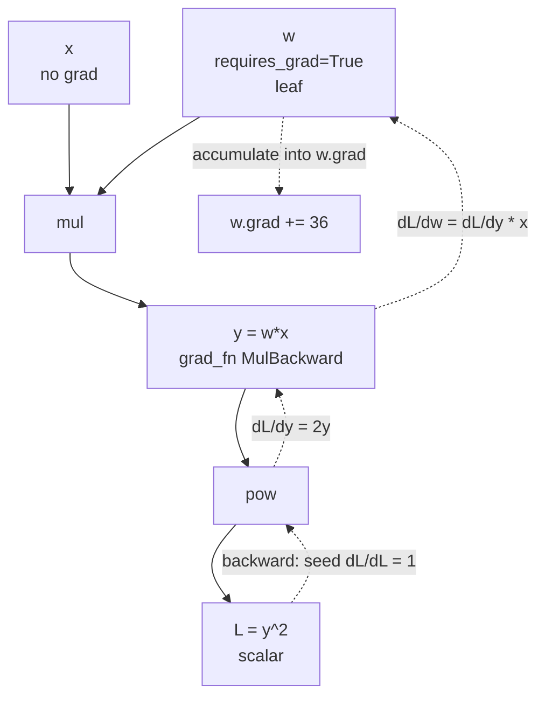

# PyTorch: Tensors, Autograd, and a Training Loop You Wrote Yourself

PyTorch won because it made the computation graph an ordinary Python execution
trace. There is no session, no placeholder, no compile step before you can print
a tensor. The cost of that design — you write the training loop — turns out to be
the thing that makes it teachable: nothing is hidden.

## Tensors

A tensor is NumPy's `ndarray` with three additions: it can live on a GPU, it can
record operations for autograd, and it carries a `requires_grad` flag.

```python
import torch

x = torch.tensor([[1., 2.], [3., 4.]])
x.shape, x.dtype, x.device          # torch.Size([2,2]) torch.float32 cpu
x.to("cuda")                        # or x.cuda()
x.float(), x.half(), x.bfloat16()   # dtype casts
```

**PyTorch defaults to `float32`**, unlike NumPy's `float64`. That is the right
default for deep learning and a common source of dtype mismatch when converting.

### Creation and the NumPy bridge

```python
torch.zeros(3, 4);  torch.ones(3, 4);  torch.empty(3, 4)
torch.arange(10);   torch.linspace(0, 1, 11)
torch.randn(3, 4);  torch.rand(3, 4);  torch.randint(0, 10, (3,))
torch.zeros_like(x); torch.full((2,2), 7.0)
torch.eye(4)

t = torch.from_numpy(a)        # SHARES memory with the NumPy array
a2 = t.numpy()                 # also shares (CPU only)
t2 = torch.as_tensor(a)        # shares if possible, else copies
t3 = torch.tensor(a)           # ALWAYS copies (and warns if given a tensor)
```

### Shape manipulation, and the view/reshape distinction

| Operation | Returns | Note |
|---|---|---|
| `view(shape)` | view | requires compatible strides, not global contiguity |
| `reshape(shape)` | view or copy | works always; copies when it must |
| `permute(dims)` / `transpose(a,b)` | view | changes stride order; may be non-contiguous |
| `contiguous()` | copy if needed | what `view` complains about |
| `squeeze` / `unsqueeze(dim)` | view | drop or add a size-1 axis |
| `expand(shape)` | view, stride 0 | broadcast without copying |
| `repeat(shape)` | copy | actually duplicates data |
| `flatten(start, end)` | view or copy | flatten a range of dims |
| `einops.rearrange` | as needed | far more readable for 4-D+ |

```python
x = torch.randn(2, 3, 4)
x.permute(2, 0, 1).view(-1)          # RuntimeError: view size is not compatible
x.permute(2, 0, 1).contiguous().view(-1)   # fine
x.permute(2, 0, 1).reshape(-1)             # fine, copies internally
```

The distinction is exactly NumPy's strides story: `permute` rewrites strides,
`view` requires the requested dimensions to be expressible by the existing
strides. `torch.arange(12)[::2].view(2,3)` succeeds despite noncontiguity.

`expand` vs `repeat` matters for memory: `expand` sets a stride to zero and costs
nothing; `repeat` materialises. Use `expand` for broadcasting a mask over a
batch, never `repeat`.

## Autograd

Every tensor with `requires_grad=True` records the operations applied to it into
a dynamic graph. Calling `.backward()` on a scalar walks that graph in reverse
and accumulates gradients into `.grad`.

```python
w = torch.tensor([2.0], requires_grad=True)
x = torch.tensor([3.0])

y = w * x            # y.grad_fn = <MulBackward0>
L = y ** 2           # L.grad_fn = <PowBackward0>
L.backward()
w.grad               # dL/dw = 2*(w*x)*x = 2*6*3 = 36
```



### The rules people get wrong

**Gradients accumulate.** `.grad` is added to, not replaced. This is deliberate —
it lets you sum gradients from several backward passes, which is exactly what
gradient accumulation and multi-task losses need. It also means forgetting
`zero_grad()` silently trains on the sum of all previous batches.

```python
optimizer.zero_grad(set_to_none=True)   # set_to_none frees memory and is faster
```

**Saved intermediates are generally freed after `backward()`.** A second backward
fails when it needs freed values; trivial graphs needing none can work. Graph
objects can still exist while references remain. If you need two backward passes over one forward, that
flag is the answer — but the more common cause of that error is accidentally
keeping a graph across iterations.

**Detach breaks the graph.**

```python
z = y.detach()          # same data, no grad history
with torch.no_grad():   # nothing inside records history
    val_loss = criterion(model(xb), yb)
```

`torch.no_grad()` for inference and validation is not just tidiness: it avoids
building the graph, which saves substantial memory. `torch.inference_mode()` is
stricter and slightly faster still, and is the right choice for serving.

**Accumulate detached summaries.** `total_loss += loss` retains graph references
and can grow memory. Ordinary backward may already have released saved activations,
so it does not invariably retain every activation until OOM. Use `.item()` or
`.detach()` for monitoring that should not be differentiable.

**In-place operations can break autograd.** `x += 1` on a tensor needed for the
backward pass raises "a variable needed for gradient computation has been
modified". Underscore-suffixed methods (`add_`, `relu_`, `clamp_`) are in-place.
Use them only where you know the value is not needed.

### Custom autograd

```python
class StraightThroughRound(torch.autograd.Function):
    @staticmethod
    def forward(ctx, x):
        return torch.round(x)
    @staticmethod
    def backward(ctx, g):
        return g            # pretend round has derivative 1
```

This is the straight-through estimator that makes quantisation-aware training
and discrete latents train with a surrogate gradient. It intentionally disagrees
with the derivative of rounding, so ordinary finite-difference `gradcheck` should
fail for this example. Use gradcheck on differentiable custom Functions whose
backward claims to implement the true derivative, not to certify a biased STE.

## nn.Module

A `Module` owns parameters and submodules, and knows how to move, save, and
switch modes for all of them recursively.

```python
import torch.nn as nn

class MLP(nn.Module):
    def __init__(self, d_in, d_hidden, d_out, p_drop=0.1):
        super().__init__()                       # forgetting this breaks everything
        self.net = nn.Sequential(
            nn.Linear(d_in, d_hidden),
            nn.GELU(),
            nn.Dropout(p_drop),
            nn.Linear(d_hidden, d_out),
        )
        self.register_buffer("running_count", torch.zeros(1))   # state, not a parameter

    def forward(self, x):
        return self.net(x)
```

| Concept | Meaning |
|---|---|
| `nn.Parameter` | a tensor registered as learnable; appears in `.parameters()` |
| `register_buffer` | persistent state that is **not** learned (BN statistics, masks, positional tables) |
| `model.train()` / `model.eval()` | switches Dropout and BatchNorm behaviour |
| `state_dict()` | an `OrderedDict` of tensors — parameters and buffers |
| `.to(device)` | moves parameters and buffers in place |
| `.apply(fn)` | recursively applies `fn` to every submodule (used for init) |

**`model.eval()` is not `torch.no_grad()`.** The first changes layer behaviour
(dropout off, BatchNorm uses running statistics); the second stops graph
building. Validation needs both.

**A plain Python list of modules is invisible.** Use `nn.ModuleList` or
`nn.ModuleDict`, or the parameters will not move to the GPU, will not be
saved, and will not be optimised.

## Data loading

```python
from torch.utils.data import Dataset, DataLoader

class TabularDS(Dataset):
    def __init__(self, X, y):
        self.X = torch.as_tensor(X, dtype=torch.float32)
        self.y = torch.as_tensor(y, dtype=torch.long)
    def __len__(self):  return len(self.y)
    def __getitem__(self, i): return self.X[i], self.y[i]

loader = DataLoader(
    TabularDS(X, y), batch_size=256, shuffle=True,
    num_workers=8, pin_memory=True, persistent_workers=True,
    prefetch_factor=4, drop_last=True,
)
```

| Argument | Why |
|---|---|
| `num_workers` | parallel loading in subprocesses; 4–8 per GPU is typical |
| `pin_memory` | page-locked host memory enables async `.to(device, non_blocking=True)` |
| `persistent_workers` | avoids re-spawning workers every epoch |
| `prefetch_factor` | batches queued per worker |
| `drop_last` | avoids a ragged final batch — matters for BatchNorm and for fixed shapes |
| `collate_fn` | custom batching: padding variable-length sequences |
| `sampler` | `WeightedRandomSampler` for imbalance, `DistributedSampler` for DDP |

**Use `IterableDataset` for streaming** data that does not fit on disk or arrives
from a queue — but then you must shard by worker yourself, or every worker
yields the same data.

**The RNG-in-workers bug**: with `fork`, every worker inherits the same NumPy
random state and produces identical augmentations. Use a `worker_init_fn` that
reseeds from `torch.initial_seed()`, or use `torch.rand` (which PyTorch seeds
per worker correctly).

## The training loop, annotated

```python
import math
model = MLP(d_in, 512, n_classes).to(device)
opt = torch.optim.AdamW(model.parameters(), lr=3e-4, weight_decay=0.01)
steps = epochs * math.ceil(len(train_loader) / accum_steps)
sched = torch.optim.lr_scheduler.OneCycleLR(opt, max_lr=3e-4, total_steps=steps)
use_cuda = torch.device(device).type == "cuda"
scaler = torch.amp.GradScaler("cuda", enabled=use_cuda)  # this path uses fp16
criterion = nn.CrossEntropyLoss(label_smoothing=0.1, reduction="sum")

for epoch in range(epochs):
    model.train()
    opt.zero_grad(set_to_none=True)
    window_samples = 0
    for step, (xb, yb) in enumerate(train_loader):
        xb = xb.to(device, non_blocking=True)
        yb = yb.to(device, non_blocking=True)

        with torch.autocast("cuda", dtype=torch.float16, enabled=use_cuda):
            loss = criterion(model(xb), yb)
        window_samples += len(yb)

        scaler.scale(loss).backward()

        if (step + 1) % accum_steps == 0 or step + 1 == len(train_loader):
            scaler.unscale_(opt)                                   # before clipping
            for parameter in model.parameters():
                if parameter.grad is not None:
                    parameter.grad.div_(window_samples)
            torch.nn.utils.clip_grad_norm_(model.parameters(), 1.0)
            previous_scale = scaler.get_scale()
            scaler.step(opt); scaler.update()
            opt.zero_grad(set_to_none=True)
            if scaler.get_scale() >= previous_scale:  # overflow skip: do not advance scheduler
                sched.step()
            window_samples = 0

    model.eval()
    total, correct = 0, 0
    with torch.inference_mode():
        for xb, yb in val_loader:
            logits = model(xb.to(device))
            correct += (logits.argmax(-1).cpu() == yb).sum().item()
            total += len(yb)
    print(f"epoch {epoch}  val acc {correct/total:.4f}")
```

Points worth stating explicitly:

- **`CrossEntropyLoss` takes logits, not probabilities.** It applies
  `log_softmax` internally. Passing softmax output is a real and common bug that
  degrades training silently. The same applies to
  `BCEWithLogitsLoss` vs `BCELoss` — always prefer the `WithLogits` version for
  numerical stability.
- **Unscale before clipping.** Clipping scaled gradients clips the wrong
  magnitude.
- **Normalize by the actual accumulated sample count.** Summed losses and gradient
  division handle unequal microbatches and the short final window. For masked token
  losses use the valid-token denominator. BatchNorm and dropout mean microbatch
  execution need not equal one large forward pass even with correct normalization.
- **`.item()` synchronises** the GPU. Calling it every step in a tight loop
  serialises host and device; accumulate on-device and sync once per epoch when
  it matters.

## Checkpointing

```python
torch.save({
    "epoch": epoch,
    "model": model.state_dict(),
    "optimizer": opt.state_dict(),
    "scheduler": sched.state_dict(),
    "scaler": scaler.state_dict(),
    "rng": torch.get_rng_state(),
    "config": cfg,
}, "ckpt.pt")

ckpt = torch.load("ckpt.pt", map_location="cpu", weights_only=True)
model.load_state_dict(ckpt["model"])
opt.load_state_dict(ckpt["optimizer"])
sched.load_state_dict(ckpt["scheduler"])
scaler.load_state_dict(ckpt["scaler"])
torch.set_rng_state(ckpt["rng"])
```

Save the `state_dict`, not the module object — pickling the module ties the file
to your source layout. Save the optimiser too: resuming without Adam's moments
is a different training run. `weights_only=True` is the safe load path and is now
the default in recent versions. Exact resume additionally needs any Python/NumPy
and CUDA RNG states, sampler epoch, consumed batches, and deterministic data-worker
policy. The shown checkpoint alone does not guarantee a mid-epoch distributed
replay. Restricted loading is not permission to trust arbitrary artifact sources.

## Mixed precision

```python
with torch.autocast(device_type="cuda", dtype=torch.bfloat16):
    out = model(x)
    loss = criterion(out, y)
```

`autocast` runs matmul-heavy ops in low precision and keeps reductions, softmax,
and normalisation in fp32. **bf16 needs no `GradScaler`**; fp16 does, because its
5-bit exponent underflows on small gradients. On Ampere and later, use bf16 and
delete the scaler.

Never wrap `loss.backward()` inside `autocast` — the backward automatically uses
the dtypes recorded in the forward.

## Distributed training

| Strategy | Splits | Use when |
|---|---|---|
| `DataParallel` | batch, single process | deprecated — don't |
| `DistributedDataParallel` | batch, one process per GPU | the standard for data parallelism |
| FSDP / ZeRO-3 | parameters, gradients, optimiser state | model does not fit on one GPU |
| Tensor parallel | individual matrices across GPUs | very large layers; needs fast interconnect |
| Pipeline parallel | layers across GPUs | very deep models; has bubble overhead |

```python
# torchrun --nproc_per_node=8 train.py
import os
import torch.distributed as dist
from torch.nn.parallel import DistributedDataParallel as DDP
from torch.utils.data.distributed import DistributedSampler

dist.init_process_group("nccl")
local_rank = int(os.environ["LOCAL_RANK"])
rank = dist.get_rank()
torch.cuda.set_device(local_rank)
model = DDP(model.to(local_rank), device_ids=[local_rank])

sampler = DistributedSampler(dataset, shuffle=True)
loader = DataLoader(dataset, sampler=sampler, batch_size=per_gpu_bs)

for epoch in range(epochs):
    sampler.set_epoch(epoch)     # without this, every epoch has the same order
    ...
```

DDP overlaps the gradient all-reduce with the backward pass, which is why it
scales far better than `DataParallel`'s scatter/gather. Note that the effective
batch is `per_gpu_bs × world_size`, so scale the learning rate accordingly, and
that logging/checkpoints should use global `rank == 0`, not local rank zero on
every host. Reduce metric numerators and denominators across ranks, account for
DistributedSampler padding duplicates, and call `dist.destroy_process_group()`
on clean shutdown. Learning-rate scaling is a heuristic to validate, not a law.

## torch.compile

```python
model = torch.compile(model)     # mode="max-autotune" for the aggressive path
```

`torch.compile` traces the model with TorchDynamo, lowers to an intermediate
representation, and generates fused Triton kernels via TorchInductor. Typical
speedups are 1.3–2× on training and more on inference-heavy small ops, mostly by
eliminating kernel-launch overhead and memory round-trips through fusion.

What breaks it: data-dependent control flow, `.item()` inside the model, printing
tensors, and shape changes that invalidate guards. Dynamic shape generalization
can avoid compiling every distinct shape. Diagnose with
`TORCH_LOGS="graph_breaks,recompiles"` rather than assuming each shape recompiles.

## Memory

Ordinary bf16 autocast commonly retains FP32 parameters, gradients and Adam
moments: roughly 16 bytes per parameter for those four FP32 arrays after state
initialization, plus activations, temporary casts, buffers and optimizer workspace.
Other mixed-precision implementations use separate low-precision weights and
master copies. An 18-byte accounting applies only to that specific storage design,
not every autocast loop. Measure actual tensors and peak allocated memory.

| Technique | Saves | Costs |
|---|---|---|
| Gradient accumulation | activation memory | wall-clock (more steps per update) |
| Gradient checkpointing | most activations | ~30% more compute (recomputes forward) |
| Mixed precision | ~half of activations and weights | needs care with fp16 |
| 8-bit optimiser (`bitsandbytes`) | ~6 bytes/param | tiny quality impact |
| FSDP / ZeRO | shards states across GPUs | communication |
| LoRA / PEFT | optimiser state for frozen weights | limited expressivity |
| Smaller batch + accumulation | activations | throughput |

```python
from torch.utils.checkpoint import checkpoint
h = checkpoint(self.expensive_block, x, use_reentrant=False)
```

Debug OOM with `torch.cuda.memory_summary()` and
`torch.cuda.max_memory_allocated()`. A steadily growing allocation across epochs
almost always means a retained graph — look for a tensor accumulated without
`.detach()`.

## Inference and export

```python
model.eval()
with torch.inference_mode():
    logits = model(x)
```

| Path | Use for |
|---|---|
| `torch.compile` | fastest Python-native serving |
| `torch.export` | ahead-of-time graph capture, the modern replacement for TorchScript |
| TorchScript (`trace`/`script`) | legacy; still deployed widely |
| ONNX (`torch.onnx.export`) | cross-runtime portability, ONNX Runtime / TensorRT |
| `torchao` quantisation | int8/int4 weights for memory-bound decoding |
| vLLM / SGLang / TensorRT-LLM | serving LLMs; do not hand-roll this |

`torch.jit.trace` records one execution and therefore **bakes in any control
flow** — a model with `if` branches traces incorrectly. `torch.jit.script`
compiles the source instead but supports only a subset of Python.

## Debugging checklist

| Symptom | First things to check |
|---|---|
| Loss does not decrease | LR far too low/high; forgot `zero_grad`; forgot `optimizer.step()`; passing probabilities to `CrossEntropyLoss` |
| Loss is `NaN` | LR too high; `log(0)`; fp16 overflow; a bad batch — add `clip_grad_norm_` and check inputs |
| Train loss ≪ val loss | overfitting, or `model.eval()` never called |
| Val loss lower than train | dropout active in train only — usually fine |
| Memory grows each epoch | accumulating tensors with graphs attached |
| Model does not move to GPU | modules in a plain list; use `nn.ModuleList` |
| Results not reproducible | unseeded RNG, non-deterministic kernels, `num_workers` ordering |
| GPU utilisation low | dataloader-bound — raise `num_workers`, `pin_memory`, prefetch |
| Slow with `torch.compile` | graph breaks and recompilations from dynamic shapes |

**Overfit one batch first.** Take a single batch, train on it repeatedly, and
confirm the loss goes to ~0. If it cannot memorise 32 examples, the bug is in the
model or the loss, not in the data or the schedule. This is the single most
effective debugging step in deep learning.

## The ecosystem

| Library | Purpose |
|---|---|
| `torchvision` / `torchaudio` / `torchtext` | datasets, transforms, pretrained models |
| `einops` | readable tensor rearrangement — `rearrange(x, 'b h n d -> b n (h d)')` |
| PyTorch Lightning / `accelerate` | remove training-loop boilerplate, handle distributed |
| Hugging Face `transformers` | pretrained models and trainers |
| `torchmetrics` | distributed-correct metric computation |
| `bitsandbytes` | 8-bit optimisers, 4-bit quantised inference |
| `torchao` | native quantisation and sparsity |
| `timm` | vision backbones |
| `captum` | attribution and interpretability |

## Self-check

### Runnable accumulation and derivative checks

This CPU fixture verifies a short final accumulation window against a full-batch
gradient in a model without dropout or BatchNorm. It also distinguishes the true
derivative check from an STE. GPU AMP, multi-host DDP and export performance require
separate hardware tests; these assertions do not claim to execute those paths.

```python runnable
import copy
import torch
torch.manual_seed(4)
torch.set_num_threads(1)
X, y = torch.randn(7, 3), torch.randn(7, 1)
whole = torch.nn.Linear(3, 1)
micro = copy.deepcopy(whole)
torch.nn.functional.mse_loss(whole(X), y).backward()
for start in range(0, len(X), 3):
    torch.nn.functional.mse_loss(micro(X[start:start+3]), y[start:start+3], reduction="sum").backward()
for full, small in zip(whole.parameters(), micro.parameters()):
    small.grad.div_(len(X))
    torch.testing.assert_close(full.grad, small.grad)

class Cube(torch.autograd.Function):
    @staticmethod
    def forward(ctx, x):
        ctx.save_for_backward(x)
        return x ** 3
    @staticmethod
    def backward(ctx, gradient):
        (x,) = ctx.saved_tensors
        return gradient * 3 * x ** 2

assert torch.autograd.gradcheck(Cube.apply, (torch.tensor([0.4], dtype=torch.double, requires_grad=True),))
x = torch.tensor(2., requires_grad=True)
first = torch.autograd.grad(x**3, x, create_graph=True)[0]
second = torch.autograd.grad(first, x)[0]
assert second.item() == 12
assert torch.arange(12)[::2].view(2, 3).shape == (2, 3)
print("unequal accumulation, true backward, higher derivative, stride checks passed")
```

The [AMP examples](https://docs.pytorch.org/docs/stable/notes/amp_examples.html)
specify unscaling and accumulation semantics; the
[view reference](https://docs.pytorch.org/docs/stable/generated/torch.Tensor.view.html)
states the actual stride compatibility condition.

1. Why does PyTorch accumulate gradients rather than overwrite them, and what
   does that enable?
2. Give the difference between `model.eval()` and `torch.no_grad()`, and say what
   validation needs.
3. When does `view` fail where `reshape` succeeds?
4. Why is bf16 preferable to fp16 for training, and what can you delete when you
   switch?
5. Your GPU memory grows every epoch. Name the most likely cause and the fix.
6. What does `expand` do that `repeat` does not, and why does it matter?
7. Your model will not learn. Describe the "overfit one batch" test and what each
   outcome tells you.

## Where to go next

- [TensorFlow & Keras](./tensorflow.md) — the other framework, and what it does
  differently.
- [Hugging Face ecosystem](./huggingface.md) — pretrained models on top of this.
- [Transformers Deep Dive](/courses/transformers/) — the architecture these
  tensors are usually arranged into.
