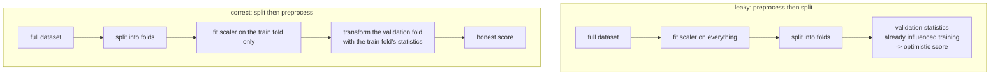

# Scikit-learn: The API That Everything Copied

Scikit-learn's lasting contribution is not its algorithms — most are textbook.
It is the **estimator interface**: four methods that every model, transformer,
and meta-estimator implements identically, which makes them composable. Learn
the interface and the 200-odd classes collapse into one object with a lot of
constructors.

## The estimator interface

| Method | Contract |
|---|---|
| `fit(X, y=None)` | learn parameters from training data; return `self` |
| `transform(X)` | apply the learned transformation |
| `fit_transform(X, y=None)` | estimator-specific training representation; not universally equivalent to `fit().transform()` |
| `predict(X)` | produce labels or values |
| `predict_proba(X)` | class probabilities (classifiers that support it) |
| `decision_function(X)` | signed distance from the boundary |
| `score(X, y)` | a default metric — accuracy or $R^2$ |
| `get_params` / `set_params` | introspection; this is what grid search uses |

Two conventions matter:

- **Learned attributes end with an underscore**: `coef_`, `n_iter_`,
  `feature_names_in_`, `classes_`. A missing trailing underscore means a
  constructor argument, not something learned.
- **Constructor arguments never touch data.** All learning happens in `fit`.
  This is what makes clone-based cross-validation correct.

```python runnable
import numpy as np
from sklearn.base import BaseEstimator, TransformerMixin, OneToOneFeatureMixin, clone
from sklearn.utils.validation import check_is_fitted
try:
    from sklearn.utils.validation import validate_data  # public API, sklearn >= 1.6
except ImportError:
    def validate_data(estimator, X, **kwargs):
        return estimator._validate_data(X, **kwargs)  # pinned older sklearn compatibility

class ClipOutliers(OneToOneFeatureMixin, TransformerMixin, BaseEstimator):
    """Finite, numeric, two-dimensional inputs; compatibility path for sklearn 1.3+."""
    def __init__(self, lower=0.01, upper=0.99):
        self.lower, self.upper = lower, upper       # store, do not validate here

    def fit(self, X, y=None):
        if not 0 <= self.lower <= self.upper <= 1:
            raise ValueError("quantiles must satisfy 0 <= lower <= upper <= 1")
        X = validate_data(self, X, reset=True, dtype=float)
        self.lo_ = np.quantile(X, self.lower, axis=0)
        self.hi_ = np.quantile(X, self.upper, axis=0)
        return self

    def transform(self, X):
        check_is_fitted(self, ["lo_", "hi_"])
        X = validate_data(self, X, reset=False, dtype=float)
        return np.clip(X, self.lo_, self.hi_)

X = np.arange(12., dtype=float).reshape(6, 2)
t = ClipOutliers(0.2, 0.8).fit(X)
assert t.transform(X).shape == X.shape
assert len(t.get_feature_names_out()) == 2
assert not hasattr(clone(t), "lo_")
try:
    t.transform(np.ones((2, 3)))
except ValueError:
    pass
else:
    raise AssertionError("changed feature width accepted")
print("transformer validation and clone checks passed")
```

Validation, mixin ordering, cloning and feature names make this finite-numeric
transformer composable. Passing method-name checks alone does not establish every
estimator contract; use scikit-learn estimator checks for reusable public classes.

## Pipelines: the leakage firewall

This is the most important section on this page.

**The bug.** Fit a scaler on the whole dataset, then cross-validate. Every fold's
"held-out" data contributed to the mean and standard deviation used to scale the
training data. Your CV score is optimistic and you will not find out until
production.

```python
# WRONG — the scaler saw the validation folds
X_scaled = StandardScaler().fit_transform(X)
scores = cross_val_score(LogisticRegression(), X_scaled, y, cv=5)

# RIGHT — the scaler is refit inside each fold
pipe = make_pipeline(StandardScaler(), LogisticRegression())
scores = cross_val_score(pipe, X, y, cv=5)
```



Every stateful preprocessing step leaks if fit outside the split: scaling,
imputation, target encoding, PCA, feature selection, SMOTE, vocabulary building
in `TfidfVectorizer`. **If it has a `fit`, it belongs inside the Pipeline.**

### ColumnTransformer for heterogeneous data

```python
from sklearn.compose import ColumnTransformer
from sklearn.pipeline import Pipeline
from sklearn.impute import SimpleImputer
from sklearn.preprocessing import StandardScaler, OneHotEncoder
from sklearn.linear_model import LogisticRegression

numeric = Pipeline([
    ("impute", SimpleImputer(strategy="median", add_indicator=True)),
    ("scale",  StandardScaler()),
])
categorical = Pipeline([
    ("impute", SimpleImputer(strategy="most_frequent")),
    ("onehot", OneHotEncoder(handle_unknown="infrequent_if_exist",
                             min_frequency=10, sparse_output=True)),
])

pre = ColumnTransformer([
    ("num", numeric,     ["age", "income"]),
    ("cat", categorical, ["region"]),
], remainder="drop", verbose_feature_names_out=False)

model = Pipeline([("pre", pre), ("clf", LogisticRegression(max_iter=500))])
model.fit(X_train, y_train)
model[:-1].get_feature_names_out()[:10]  # exclude the final classifier
```

`handle_unknown` is not optional in production: a category unseen at training
time will otherwise raise at inference. `min_frequency` folds rare levels into an
`infrequent` bucket, which both controls dimensionality and improves
may improve generalization. This fragment assumes a frame with the three named
columns and `X_train, y_train`; explicit schema selection also includes pandas
string/category storage without relying on `object` inference. An unseen category
uses the infrequent bucket only when fitting created one. HistGradientBoosting
instead needs dense input or a supported native categorical dataframe; never
densify a large sparse vocabulary just to make it fit.

## Preprocessing, and when each is appropriate

| Transformer | What it does | Use when |
|---|---|---|
| `StandardScaler` | $(x-\mu)/\sigma$ | most models; assumes roughly symmetric data |
| `MinMaxScaler` | scale to $[0,1]$ | bounded inputs, neural nets, image data |
| `RobustScaler` | median and IQR | heavy outliers |
| `MaxAbsScaler` | divide by max absolute | sparse data — preserves sparsity |
| `Normalizer` | scale each **row** to unit norm | text vectors, cosine similarity |
| `QuantileTransformer` | map to uniform or normal | badly skewed features; nonlinear |
| `PowerTransformer` | Yeo-Johnson / Box-Cox | make data more Gaussian |
| `KBinsDiscretizer` | bin into intervals | give linear models non-linearity |
| `PolynomialFeatures` | products of features | explicit interactions; explodes fast |
| `OneHotEncoder` | indicator per level | linear models, low cardinality |
| `OrdinalEncoder` | integer per level | genuine ordering, or explicitly configured native categorical handling |
| `TargetEncoder` | mean target per level, cross-fitted | high-cardinality categoricals |
| `SplineTransformer` | B-spline basis | smooth non-linearity for linear models |

**Which models need scaling?**

| Needs scaling | Does not |
|---|---|
| Anything distance-based: kNN, k-means, SVM with RBF | Decision trees |
| Anything regularised: ridge, lasso, elastic net, L2 logistic regression | Random forests |
| PCA and most matrix factorisations | Gradient boosting (XGBoost, LightGBM, HistGB) |
| Neural networks | Naive Bayes (mostly) |

The reason is uniform: penalties and distances treat all dimensions in the same
units, so a feature measured in dollars dominates one measured in fractions.
Trees split on thresholds within a single feature, so monotone rescaling changes
nothing.

**`TargetEncoder` is the one to know for high-cardinality categoricals.** It
replaces each level with a smoothed mean of the target, and scikit-learn's
`fit_transform` uses internal cross-fitting so a row's own target does not feed
its own encoding. Hand-rolled target encoding without that cross-fit is one of
the most effective ways to leak yourself a great CV score and a terrible model.
Calling `fit(X,y).transform(X)` instead produces in-sample encodings, not those
cross-fitted training values. Group/time restrictions also need appropriate inner
encoding splits. [TargetEncoder](https://scikit-learn.org/stable/modules/generated/sklearn.preprocessing.TargetEncoder.html)
documents the training/inference distinction.

## Cross-validation

| Splitter | Use for |
|---|---|
| `KFold` | plain i.i.d. data |
| `StratifiedKFold` | classification — preserves class ratios per fold |
| `GroupKFold` / `StratifiedGroupKFold` | when rows share a group that must not straddle folds (patients, users, sessions) |
| `TimeSeriesSplit` | temporal data — train always precedes validation |
| `RepeatedStratifiedKFold` | small data; reduces split variance |
| `LeaveOneOut` | tiny datasets; high variance, expensive |
| `ShuffleSplit` / `StratifiedShuffleSplit` | many random train/test draws |
| `PredefinedSplit` | you already know the split |

**`GroupKFold` is the one people forget.** If the same patient, user, or document
appears in several rows, a random split puts near-duplicates in both train and
validation, and your score measures memorisation. The same applies to augmented
images derived from one original.

```python
from sklearn.model_selection import cross_validate, StratifiedGroupKFold

cv = StratifiedGroupKFold(n_splits=5, shuffle=True, random_state=0)
res = cross_validate(
    model, X, y, groups=groups, cv=cv,
    scoring=["roc_auc", "average_precision", "f1"],
    return_train_score=True, n_jobs=-1,
)
print(res["test_roc_auc"].mean(), res["test_roc_auc"].std())
```

`return_train_score=True` is worth the small cost: a large train–validation gap
suggests overfitting, while low scores on both suggest underfitting; neither is a
unique diagnosis. Check shift, leakage, labels, optimization, and metric direction.

**Nested cross-validation** is the correct protocol when you both tune and
estimate performance. The inner loop tunes; the outer loop estimates. Reporting
the best inner-loop score as your performance estimate is optimistic, because
you selected on it.

```python
inner = GridSearchCV(model, grid, cv=StratifiedKFold(3), scoring="roc_auc")
outer_scores = cross_val_score(inner, X, y, cv=StratifiedKFold(5), scoring="roc_auc")
```

## Model selection and tuning

| Searcher | Idea |
|---|---|
| `GridSearchCV` | exhaustive over a grid |
| `RandomizedSearchCV` | sample from distributions; usually strictly better per unit compute |
| `HalvingGridSearchCV` / `HalvingRandomSearchCV` | successive halving — many configs on little data, survivors on more |
| external: Optuna, scikit-optimize | Bayesian optimisation with pruning |

```python
from scipy.stats import loguniform, randint

search = RandomizedSearchCV(
    model,
    {
        "clf__C": loguniform(1e-3, 1e2),
        "pre__num__impute__strategy": ["mean", "median"],
    },
    n_iter=60, cv=cv, scoring="average_precision",
    n_jobs=-1, random_state=0, refit=True,
)
search.fit(X, y, groups=groups)
search.best_params_, search.best_score_
```

Note the `__` syntax: it reaches into nested estimators, so you can tune a
preprocessing choice and a model hyperparameter in the same search. That is the
practical payoff of the `get_params` convention.

**Search log-scaled hyperparameters on a log scale.** Learning rate and
regularisation strength span orders of magnitude; `loguniform` samples them
correctly, a linear grid wastes almost all its budget in the wrong decade.

## Metrics, and choosing the right one

| Task | Metric | When |
|---|---|---|
| Balanced classification | `accuracy` | classes roughly equal, errors equally costly |
| Imbalanced classification | `average_precision` | noninterpolated AP; distinct from trapezoidal PR-AUC |
| Ranking quality | `roc_auc` | threshold-free discrimination |
| Cost-sensitive | `f_beta`, custom scorer | false positives and negatives differ in cost |
| Probability quality | `neg_log_loss`, `neg_brier_score` | scorer strings; `brier_score_loss` is the metric-function name |
| Multiclass | `f1_macro` vs `f1_micro` vs `f1_weighted` | macro treats classes equally; micro equals accuracy for single-label |
| Regression | `neg_root_mean_squared_error` | squared-error losses, Gaussian noise |
| Regression, outliers | `neg_mean_absolute_error` | robust; median-seeking |
| Regression, relative error | `neg_mean_absolute_percentage_error` | unstable near zero targets; choose the denominator policy explicitly |
| Regression, fit quality | `r2` | proportion of variance explained; can go negative |

**ROC-AUC vs PR-AUC on imbalanced data** is the distinction interviewers probe.
ROC-AUC uses the false positive rate, whose denominator is the (huge) number of
negatives, so a large absolute number of false positives barely moves it. At 1%
positives, a model can show 0.95 ROC-AUC and 0.20 precision at any usable
threshold. Precision–recall curves make that visible because precision's
denominator is the number of predicted positives.

```python
from sklearn.metrics import make_scorer

def profit(y_true, y_pred, tp=100, fp=-20):
    return tp * ((y_pred == 1) & (y_true == 1)).sum() + fp * ((y_pred == 1) & (y_true == 0)).sum()

scoring = make_scorer(profit, greater_is_better=True)
```

Optimising the business metric directly, when you can write it down, beats
arguing about F1.

## Calibration

A model that ranks well can still have meaningless probabilities. If you
threshold at 0.5, or feed probabilities into an expected-value calculation, they
must be calibrated.

```python
from sklearn.calibration import CalibratedClassifierCV, CalibrationDisplay

cal = CalibratedClassifierCV(model, method="isotonic", cv=5)   # or "sigmoid"
cal.fit(X_train, y_train)
CalibrationDisplay.from_estimator(cal, X_test, y_test, n_bins=15)
```

| Method | Fits | Use when |
|---|---|---|
| Platt scaling (`sigmoid`) | a logistic on the scores | little data; sigmoid-shaped distortion (SVMs, boosted trees) |
| Isotonic | a monotone step function | ≥ ~1,000 calibration points; arbitrary distortion |

Which models are miscalibrated, and how:

- **Naive Bayes** — wildly overconfident, because the independence assumption
  multiplies correlated evidence.
- **SVMs** — `decision_function` is a margin, not a probability, at all.
- **Boosted trees** — calibration direction depends on depth, shrinkage, data and fitting.
- **Random forests** — pulled toward the middle by averaging.
- **Logistic regression** — log loss supports probabilistic estimation, but
  regularization, misspecification, finite data and shift can impair calibration.

Measure it with the **expected calibration error** or a reliability diagram, not
by eye.

## Imbalanced data

```python
LogisticRegression(class_weight="balanced")         # reweight the loss
RandomForestClassifier(class_weight="balanced_subsample")
```

`class_weight="balanced"` sets $w_c = n/(K \cdot n_c)$ — it is the simplest and
often the best intervention. The alternatives:

| Approach | Note |
|---|---|
| Class weights | no data change; usually try first |
| Random undersampling | fast, throws away data |
| Random oversampling | risks overfitting the duplicated minority |
| SMOTE / ADASYN (`imbalanced-learn`) | synthesise minority points; **must be inside the CV fold**, and use `imblearn.pipeline.Pipeline`, not sklearn's |
| Threshold tuning | often the whole answer — do not assume 0.5 |
| Anomaly-detection framing | when positives are < 0.1% |

**Threshold tuning is underrated.** Train with whatever loss, then choose the
operating point on a validation set by maximising your actual objective. This
decouples "is the ranking good?" from "where do we cut?", which are separate
questions with separate answers.

## The parts of sklearn people reimplement by hand

| Need | It already exists |
|---|---|
| Train/test split preserving class ratios | `train_test_split(..., stratify=y)` |
| Learning curves | `learning_curve`, `LearningCurveDisplay` |
| Validation curve over one hyperparameter | `validation_curve` |
| Permutation feature importance | `permutation_importance` — model-agnostic, honest |
| Partial dependence / ICE plots | `PartialDependenceDisplay` |
| Confusion matrix plot | `ConfusionMatrixDisplay` |
| ROC / PR curve plot | `RocCurveDisplay`, `PrecisionRecallDisplay` |
| Baseline to beat | `DummyClassifier`, `DummyRegressor` |
| Ensembling several models | `VotingClassifier`, `StackingClassifier` |
| Multi-output / multi-label wrappers | `MultiOutputClassifier`, `ClassifierChain` |
| Feature union of parallel pipelines | `FeatureUnion` |
| Caching expensive transformers across a grid search | `Pipeline(memory=...)` |
| Applying a transform to the **target** | `TransformedTargetRegressor` |
| Out-of-core learning | estimators with `partial_fit` + `SGDClassifier` |

**`DummyClassifier` first, always.** If your model does not beat
`strategy="prior"` on an imbalanced problem, something is wrong, and you want to
know that before you spend a week on features.

**Permutation importance over `feature_importances_`.** Tree impurity
importances are biased toward high-cardinality and continuous features, and they
are computed on training data. `permutation_importance` on a held-out set
measures what you actually care about — though it too is misleading under
correlated features, where dropping one is compensated by its correlate.

## HistGradientBoosting: the strong default

```python
from sklearn.ensemble import HistGradientBoostingClassifier

clf = HistGradientBoostingClassifier(
    max_iter=500, learning_rate=0.06, max_leaf_nodes=31,
    l2_regularization=1.0, early_stopping=True,
    validation_fraction=0.1, n_iter_no_change=30,
    categorical_features="from_dtype",  # requires scikit-learn >= 1.4
)
```

It is a LightGBM-style histogram booster inside scikit-learn: it handles `NaN`
natively, handles categorical dtypes without one-hot encoding, is fast on
hundreds of thousands of rows, and needs almost no tuning. For tabular data it is
the right first model, and often the last.

## Sparse data

Text pipelines produce sparse matrices, and preserving sparsity is the whole
game.

```python
from sklearn.feature_extraction.text import TfidfVectorizer

tfidf = TfidfVectorizer(ngram_range=(1, 2), min_df=5, max_df=0.7,
                        sublinear_tf=True, strip_accents="unicode")
X = tfidf.fit_transform(docs)          # scipy.sparse.csr_matrix
```

Centered `StandardScaler` rejects sparse input rather than silently densifying it.
`PolynomialFeatures` supports sparse output but can explode feature count; several
tree ensembles support sparse input with format conversions. `.toarray()` really
does allocate dense storage. Check each estimator's contract. Use
`MaxAbsScaler` or `StandardScaler(with_mean=False)`, and models with sparse
support: `SGDClassifier`, `LinearSVC`, `LogisticRegression(solver="liblinear"
or "saga")`, `MultinomialNB`.

`HashingVectorizer` trades the vocabulary for a fixed-width hash: no `fit`
needed, constant memory, streaming-friendly, at the cost of collisions and
non-invertibility.

## Persistence and production

```python
import joblib
joblib.dump(model, "model.joblib")
model = joblib.load("model.joblib")
```

Four caveats that cause real incidents:

1. **Pickles are version-fragile.** A model saved under one scikit-learn version
   may not load under another. Pin the version alongside the artefact.
2. **Pickles execute code on load.** Never load an untrusted one.
3. **Save the whole Pipeline**, not just the final estimator. The preprocessing
   is part of the model.
4. **Record the input schema** — column names, dtypes, and order.
   `feature_names_in_` helps, but assert it explicitly at inference.

For portability, ONNX (`skl2onnx`) exports many estimators to a runtime-agnostic
graph, removing the Python dependency entirely.

### Test persistence through the serving boundary

The [complete artifact capstone](./mlops-and-serving.md#capstone-train-package-reload-serve)
turns the persistence rules into an executable workflow. A grouped split keeps
related messages together; vocabulary-marker assertions prove TF-IDF saw only
training texts. Development log loss selects regularization, and a final test
report is saved alongside the full Pipeline. A second process reloads it, then
an HTTP client verifies the same ordered probabilities to an absolute tolerance
of `1e-12`. Corrupted bytes, missing trust, incompatible schemas or runtimes, and
class-order mismatches fail explicitly. Download the script to inspect the actual
boundary rather than treating successful `joblib.load` as sufficient validation.

## Common bugs

| Symptom | Cause |
|---|---|
| CV score far better than production | preprocessing fit outside the fold |
| Great CV, terrible on new users | random split with grouped rows; use `GroupKFold` |
| Perfect score on a time-series problem | random split leaked the future |
| `ValueError: Found unknown categories` at inference | `handle_unknown` not set on the encoder |
| Probabilities cluster near 0.5 or near 0/1 | uncalibrated model |
| High ROC-AUC, useless in practice | imbalanced data; look at PR-AUC and the threshold |
| Feature importances look nonsensical | impurity bias, or correlated features |
| Memory error on text data | something densified the sparse matrix |
| Different results every run | unseeded `random_state`; set it on the estimator *and* the splitter |
| Grid search is glacial | refitting the same preprocessing each time; use `Pipeline(memory=...)` |

## Self-check

### Composite-estimator acceptance checks

The [composition guide](https://scikit-learn.org/stable/modules/compose.html)
explains preprocessing names and sparse output. A final classifier does not have
`get_feature_names_out`, so request names from `pipeline[:-1]`. The feature-engineering
chapter's [complete mixed-column lab](../ml/feature-engineering.md) verifies unseen
categories, missing values and fitted names; its [nested search counterpart](../ml/hyperparameter-tuning.md)
keeps the final holdout untouched.

Metadata is not automatically routed everywhere: under legacy routing pass a
step's weights as `clf__sample_weight`, and pass groups to the splitter/search.
With metadata routing enabled, request the relevant metadata on consuming
estimators and use the version's supported `params`/fit routing. Modern
`Pipeline(transform_input=...)` can transform validation inputs, but requires
compatible versions and explicitly routed consumers. Never pass an outer holdout
to an inner early-stopping fit merely because an API accepts it.

**What proves sparse compatibility?** Exercise the actual sparse branch, not a
small dense fixture whose ColumnTransformer density happened to exceed its
threshold. **What proves calibration?** Held-out probability diagnostics with
counts and uncertainty, not the estimator family. **What does a CV gap diagnose?**
It is evidence to investigate variance, leakage, optimization and shift; it does
not uniquely identify one cause. A fold containing one class cannot support ROC
AUC and should fail visibly or use a predeclared alternative evaluation design.

1. Explain precisely what leaks when you call `StandardScaler().fit_transform(X)`
   before `cross_val_score`.
2. When must you use `GroupKFold`, and what does a random split measure instead?
3. Your model has 0.94 ROC-AUC on a 1%-positive problem and is useless. What
   metric would have shown that, and why?
4. What does `__` mean in `GridSearchCV` parameter names?
5. Name three transformers that must live inside the Pipeline and say what each
   would leak.
6. Which is better calibrated out of the box, logistic regression or a random
   forest, and why?
7. What is nested cross-validation for, and what bias does it remove?

## Where to go next

- [Pandas](./pandas.md) — the frames that feed these pipelines.
- [Boosting Libraries](./boosting-libraries.md) — when HistGradientBoosting is
  not quite enough.
- [Machine Learning notes](../ml.md) — the algorithms behind the estimators.
